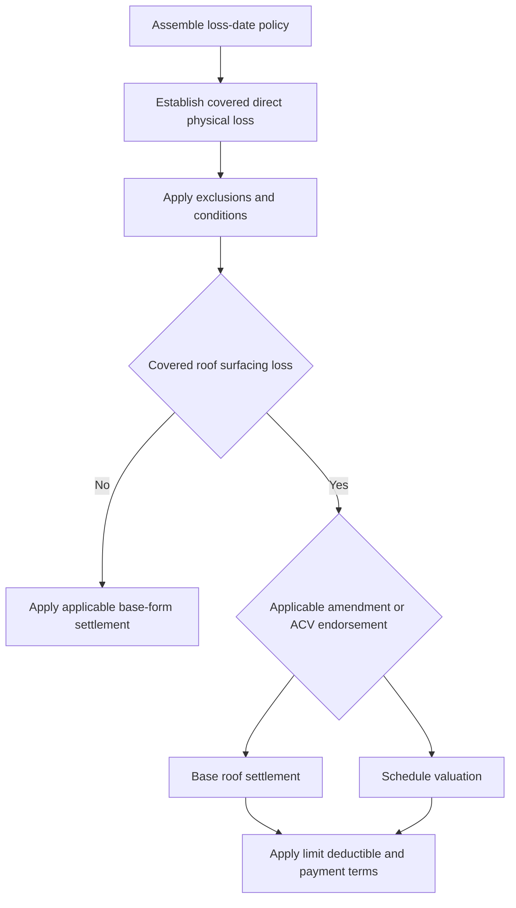

# Roof Loss Settlement and Actual Cash Value Schedules

## Scope and governing record

This is a form-specific Coverage A reference, not a rule that every roof claim is covered or that every older roof is ineligible. Assemble the policy in force on the loss date: Declarations (location, limits, deductibles, and policy period), base HO-3 form and edition, every attached endorsement, and any applicable state amendment. An attachment changes the base form only to the extent it says it does; where the Florida amendment conflicts with the policy, it controls. [HO 01 09 (2023-07), T.0 T.1–T.6](repo://forms/HO/FL/HO-01-09/2023-07.md#L13-L25)

Keep two questions in order:

1. **Coverage:** Is there covered property and covered direct physical loss under the base form and applicable amendments?
2. **Settlement:** Once covered loss is established, what valuation basis, limit, deductible, and payment conditions apply to the covered roof component?

A roof-age threshold or an ACV schedule answers the second question. It does not independently establish a covered cause of loss, direct physical damage, repair scope, or underwriting outcome. The HO-3 (2024-03) itself states that its roof-schedule trigger age does not establish that a loss is covered. [HO-3 (2024-03), I.P P.41](repo://forms/HO/MS/HO-3/2024-03.md#L637-L639)

The sequence distinguishes coverage from valuation: an endorsement changes settlement only after the claim reaches a covered roof-surfacing loss within its terms.

<!-- openwiki: broken internal link [/openwiki/coverages/coverage-a/dwelling-and-settlement] file "/openwiki/coverages/coverage-a/dwelling-and-settlement" does not exist. Fix the href or restore the target, then delete this comment. -->
For broader dwelling property, limits, ordinary ACV/replacement-cost prerequisites, and appraisal, see [Coverage A — Dwelling, Limits, and Base Loss Settlement](/openwiki/coverages/coverage-a/dwelling-and-settlement).

## Base Coverage A: property, cause, then value

### What is being valued

Under both reviewed HO-3 editions, Coverage A includes the dwelling and attached structures. The 2024-03 edition covers direct physical loss to covered property from a risk of direct physical loss subject to policy terms; the earlier 2018-09 edition covers the dwelling for direct physical loss and calls for an accidental covered peril. [HO-3 (2024-03), I.A A.1–A.4](repo://forms/HO/MS/HO-3/2024-03.md#L97-L105) [HO-3 (2018-09), I.A A.1–A.8](repo://forms/HO/MS/HO-3/2018-09.md#L85-L101)

Neither edition makes a roof-loss valuation provision a coverage grant. In the 2024 edition, direct physical loss from wind or hail to roof surfacing requires impairment of the surfacing’s ability to shed water; cosmetic damage is excluded. Interior rain damage requires direct force of wind or hail first to damage the building and create an opening, and only through that opening. [HO-3 (2024-03), I.P P.38–P.41](repo://forms/HO/MS/HO-3/2024-03.md#L631-L639)

For a reported roof loss, identify the damaged component and the claimed event, then develop the event-to-damage connection before applying ACV or replacement cost. Evidence useful to that determination includes observations of the roof and interior, weather information, photographs, repair history, maintenance records, prior damage, and the age and condition of the *damaged* materials. A contractor or inspector opinion is evidence to evaluate, not the policy determination by itself.

### Base settlement differs by edition

| Base form | Base settlement for a covered dwelling loss | Roof-specific baseline |
| --- | --- | --- |
| **HO-3 2018-09** | Replacement cost without depreciation requires Coverage A of at least 80% of the dwelling’s full replacement cost at loss. Otherwise, settlement is ACV; replacement cost is not paid until repair or replacement, although ACV may be paid first and a later additional claim supported by records. [I.A A.20–A.24](repo://forms/HO/MS/HO-3/2018-09.md#L125-L133) | No separate base roof-surfacing settlement rule appears in the reviewed Coverage A section. An attached HO 23 74 can change the otherwise applicable settlement for its defined roof surfacing. |
| **HO-3 2024-03** | Replacement-cost settlement requires a dwelling limit at least 80% of full replacement cost immediately before loss. If that condition is not met, the form uses ACV until repair or replacement is complete; payment cannot exceed the amount actually and necessarily spent. [I.A A.19–A.21](repo://forms/HO/MS/HO-3/2024-03.md#L135-L139) | Covered roof surfacing is settled at replacement cost **unless** an ACV roof-schedule endorsement is attached. [I.A A.22](repo://forms/HO/MS/HO-3/2024-03.md#L141-L141) |

The applicable Coverage A limit and deductible remain constraints on a covered payment. Under HO-3 (2024-03), the dwelling limit is the most paid for all covered loss arising from the same occurrence, and the deductible reduces covered loss unless an endorsement changes it. [HO-3 (2024-03), I.A A.26 and I.S S.29–S.34](repo://forms/HO/MS/HO-3/2024-03.md#L147-L151) [HO-3 (2024-03), I.S S.29–S.34](repo://forms/HO/MS/HO-3/2024-03.md#L859-L869)

## HO 23 74 ACV roof-surfacing endorsements

HO 23 74 concerns **Roof Surfacing**, not necessarily the entire roof system. The 2018 edition defines it as exposed exterior material and excludes material beneath it unless that material itself forms the weather-exposed exterior surface. The 2025 edition defines exterior material that sheds water and protects the structure, and includes associated materials necessary to install the damaged surfacing workmanlike. Confirm the applicable edition and defined component rather than assuming that deck, underlayment, flashing, vents, or all undamaged materials have the same settlement treatment. [HO 23 74 (2018-09), Definitions](repo://forms/HO/MS/HO-23-74/2018-09.md#L831-L857) [HO 23 74 (2025-05), W.1 W.1–W.2](repo://forms/HO/MS/HO-23-74/2025-05.md#L57-L63)

### Live policy populations and settlement effects

| Endorsement edition | Applicable policy population | Settlement mechanism |
| --- | --- | --- |
| **HO 23 74 (2018-09)** | Superseded for policies effective on or after **2025-05-01**, but expressly remains in force for policies written under it. Apply it only if that edition remains attached to the loss-date policy. [form status](repo://forms/HO/MS/HO-23-74/2018-09.md#L8-L9) | For covered roof-surfacing loss when the surfacing is **15 years old** at loss, settlement is ACV: like-kind-and-quality repair/replacement less depreciation. Depreciation may account for age, condition, useful life, wear, and obsolescence; it may differ by material, component, and area, and the endorsement permits reasonable labor depreciation. [W.1 W.2–W.7](repo://forms/HO/MS/HO-23-74/2018-09.md#L47-L59) Its stated minimum payable percentage of roof-surfacing replacement cost is **25%**. [W.4 W.4](repo://forms/HO/MS/HO-23-74/2018-09.md#L301-L305) |
| **HO 23 74 (2025-05)** | Effective **2025-05-01**. Apply it only when it is attached to the policy; its preamble says it forms part of the policy when attached. [form and attachment](repo://forms/HO/MS/HO-23-74/2025-05.md#L2-L6) [W.0](repo://forms/HO/MS/HO-23-74/2025-05.md#L13-L19) | For a covered loss to roof surfacing with **Roof Age 12 years or greater**, pay ACV whether or not repair/replacement occurs. Age is the age of the *damaged surfacing* at loss and can be established with records, permits, invoices, inspections, photos, statements, or other reliable evidence. A limited-area replacement does not establish the age of other areas without evidence of the same installation. [W.1 W.4–W.10](repo://forms/HO/MS/HO-23-74/2025-05.md#L63-L77) |

**Modifies — HO 23 74 (2018-09):** When attached, the endorsement says that it changes the policy only as stated and that inconsistent policy provisions are amended to conform; its ACV provisions therefore modify the base HO-3 (2018-09) Coverage A settlement path for covered roof surfacing to which the endorsement applies, not the coverage grant. [HO 23 74 (2018-09), W.0](repo://forms/HO/MS/HO-23-74/2018-09.md#L13-L23) [HO-3 (2018-09), I.A A.20–A.24](repo://forms/HO/MS/HO-3/2018-09.md#L125-L133)

**Modifies — HO 23 74 (2025-05):** When attached, this endorsement changes roof-surfacing loss settlement while retaining other policy exclusions, conditions, limits, and deductibles. It modifies the default 2024-03 rule that settles covered roof surfacing at replacement cost unless an ACV roof schedule is attached. [HO 23 74 (2025-05), W.0 and W.1 W.59–W.60](repo://forms/HO/MS/HO-23-74/2025-05.md#L39-L53) [HO 23 74 (2025-05), W.1 W.59–W.60](repo://forms/HO/MS/HO-23-74/2025-05.md#L175-L177) [HO-3 (2024-03), I.A A.22](repo://forms/HO/MS/HO-3/2024-03.md#L141-L141)

### Applying ACV without importing a coverage decision

Under the 2025 endorsement, ACV reflects depreciation, condition, age, and obsolescence. Depreciation must reasonably reflect the damaged surfacing’s condition immediately before loss, must not be applied twice to the same element, and may be revised if reliable evidence changes the age, condition, or value assessment. The endorsement pays necessary damaged surfacing, labor, and material on the defined terms; it can separately evaluate roof surfacing from other covered property, subject to the limit and deductible. [HO 23 74 (2025-05), W.1 W.3 and W.7–W.10](repo://forms/HO/MS/HO-23-74/2025-05.md#L63-L77) [HO 23 74 (2025-05), W.1 W.13–W.21 and W.38](repo://forms/HO/MS/HO-23-74/2025-05.md#L83-L99) [HO 23 74 (2025-05), W.1 W.38](repo://forms/HO/MS/HO-23-74/2025-05.md#L131-L135)

The 2025 endorsement permits like-kind-and-quality material rather than identical material. Appearance alone does not establish that undamaged surfacing requires replacement. It also allows reasonable emergency measures to protect damaged surfacing from further *covered* damage, but does not turn temporary protection into permanent replacement or expand the policy limit. [HO 23 74 (2025-05), W.1 W.24–W.29 and W.43](repo://forms/HO/MS/HO-23-74/2025-05.md#L103-L115) [HO 23 74 (2025-05), W.1 W.43](repo://forms/HO/MS/HO-23-74/2025-05.md#L141-L145)

ACV is not an automatic reduction for every old roof. It is available only when the specific attached schedule says it applies and after a covered loss and covered roof-surfacing scope have been determined. The 2018 and 2025 endorsement preambles expressly say they do not create coverage for otherwise uncovered loss. [HO 23 74 (2018-09), W.0](repo://forms/HO/MS/HO-23-74/2018-09.md#L19-L27) [HO 23 74 (2025-05), W.0](repo://forms/HO/MS/HO-23-74/2025-05.md#L39-L47)

## Florida: amendment, regulator, and underwriting are separate controls

### Florida policy amendment

For a Florida HO-3 policy carrying **HO 01 09 (2023-07)**, the amendment is an additional controlling policy record, not a regulator bulletin or internal guide. Its T.8 Other Amendments provides that, when roof age reaches **10 years**, the roof is subject to the ACV roof schedule and settlement uses its pre-loss condition. It also directs consideration of deterioration, wear, prior damage, and maintenance when determining ACV; separately, it states exclusions for certain repeated leakage and faulty work/maintenance, with resulting-covered-peril language for the latter. [HO 01 09 (2023-07), T.8 T.1–T.14](repo://forms/HO/FL/HO-01-09/2023-07.md#L613-L641)

**Modifies — HO 01 09 (2023-07):** The amendment says it changes policy terms only where different and controls a conflict. Thus, where attached to a Florida policy, its specific 10-year roof-schedule/ACV term is applied together with the base form’s settlement provision and any other attached endorsement; do not substitute an unattached HO 23 74 edition or a bulletin threshold. [HO 01 09 (2023-07), T.0 T.1–T.6](repo://forms/HO/FL/HO-01-09/2023-07.md#L13-L25) [HO-3 (2024-03), I.A A.19–A.22](repo://forms/HO/MS/HO-3/2024-03.md#L135-L141)

The Florida amendment also carries post-loss mechanics: cooperate, protect property, preserve damaged property where reasonably possible, allow inspection, provide material records, give prompt notice, show property, and supply a requested proof of loss. Investigation or settlement is not an admission of liability. These duties support the loss investigation but do not relieve the decision-maker of applying the controlling policy language. [HO 01 09 (2023-07), T.8 T.2–T.7 and T.21–T.24](repo://forms/HO/FL/HO-01-09/2023-07.md#L615-L627) [HO 01 09 (2023-07), T.8 T.21–T.24](repo://forms/HO/FL/HO-01-09/2023-07.md#L653-L661) [HO 01 09 (2023-07), T.7 T.14](repo://forms/HO/FL/HO-01-09/2023-07.md#L593-L599)

### Florida regulator requirements

The bulletins govern insurer conduct in Florida; they do **not** themselves amend an insured’s policy. The currently stated 2023-04 bulletin applies to admitted Florida residential insurance and says an insurer must not use roof age alone as a substitute for roof-condition assessment for underwriting/nonrenewal. Its claims standards separately require claim evaluation based on loss facts and prohibit denial, limitation, or delay solely because of roof age. It requires application of policy valuation and deductible provisions as written, with a factual basis for any age-related reduction. [OIR-2023-04, B.1](repo://bulletins/FL/oir-2023-04-roof-age-nonrenewal.md#L13-L23) [OIR-2023-04, B.4](repo://bulletins/FL/oir-2023-04-roof-age-nonrenewal.md#L239-L265)

OIR-2019-11 is superseded for policies effective on or after 2023-04-11 but remains in force for policies written under it. It contains its own 15-year ACV-schedule and 20-year inspection rules. Do not apply those historic operational thresholds to a later policy population merely because the bulletin remains in the repository. [OIR-2019-11, status](repo://bulletins/FL/oir-2019-11-roof-age.md#L8-L9) [OIR-2019-11, B.2–B.3](repo://bulletins/FL/oir-2019-11-roof-age.md#L49-L65) [OIR-2019-11, B.3](repo://bulletins/FL/oir-2019-11-roof-age.md#L153-L171)

### Internal roof selection is not a claim exclusion

The internal Underwriting Referral and Authority Matrix is explicitly noncontractual: it can identify a referral need but cannot create, expand, restrict, or waive coverage. It directs referral where roof age material to a schedule is material to a proposed action. [Underwriting Referral and Authority Matrix, H.0](repo://guidelines/authority/referral-matrix.md#L13-L25) [Underwriting Referral and Authority Matrix, H.0.15](repo://guidelines/authority/referral-matrix.md#L41-L45)

Its selection rules may require information on installation date, covering, repair history, and condition; identify referral triggers such as a 25-year roof, active leak, unrepaired opening, unclear evidence, repeated leaks, or adverse inspection findings; and distinguish roof-covering replacement from deck work, flashing work, or patching. Those are eligibility and referral controls. They are not coverage exclusions and cannot be used to turn roof age alone into a claim result. [Underwriting Referral and Authority Matrix, H.2](repo://guidelines/authority/referral-matrix.md#L199-L243) [Underwriting Referral and Authority Matrix, H.2](repo://guidelines/authority/referral-matrix.md#L245-L273)

## Practical adjustment record and referral boundaries

For a roof claim, preserve a record that permits separate decisions on cause, scope, and valuation:

- report promptly; take safe, reasonable temporary measures to protect property; keep receipts and records;
- photograph affected and unaffected areas and, when practical, retain samples or failed materials before permanent repair or disposal;
- obtain available weather data, prior claims, repair/maintenance records, invoices, permits, inspection reports, estimates, and communications;
- document the reported source/pathway, date and manner of discovery, condition before and after loss, prior leaks or repairs, and the basis for allocating old, maintenance-related, and claimed event damage; and
- separate supported direct physical damage and reasonable emergency protection from maintenance, permanent correction, upgrades, replacement of undamaged property, and other work not shown to result from the covered event.

These practices align with the 2024 HO-3 duties to give prompt notice, protect property, retain it when reasonably possible, allow inspection, provide requested information, identify time/cause/ACV in a requested proof of loss, and cooperate in determining cause, extent, and value. [HO-3 (2024-03), I.S S.4–S.19](repo://forms/HO/MS/HO-3/2024-03.md#L809-L839)

Refer rather than make an unsupported settlement or coverage characterization when form/endorsement applicability is uncertain; roof age or partial-replacement evidence conflicts; source, timing, or water path cannot be reliably established; causation or allocation needs technical review; fungi, contamination, repeated leakage, or defective work may implicate distinct terms; or proposed action exceeds authority. The Matrix requires referral when facts do not support a confident authority determination and preservation of material supporting information. [Underwriting Referral and Authority Matrix, H.0](repo://guidelines/authority/referral-matrix.md#L15-L35) [Underwriting Referral and Authority Matrix, H.0](repo://guidelines/authority/referral-matrix.md#L43-L57)

Do not let an appraisal substitute for coverage analysis. Under HO-3 (2024-03), appraisal can establish amount of loss and, where applicable, ACV, but does not decide coverage, policy interpretation, or condition compliance. [HO-3 (2024-03), I.S S.42–S.47](repo://forms/HO/MS/HO-3/2024-03.md#L885-L895)
