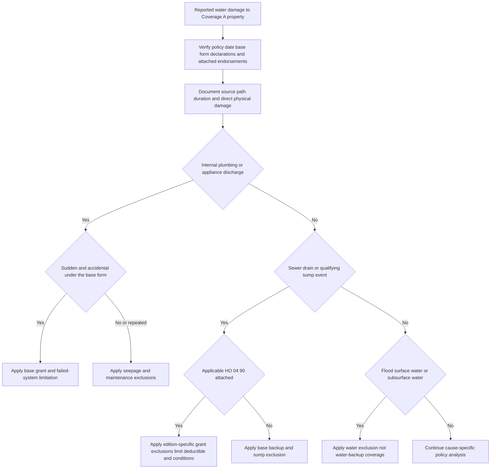

## Scope and controlling-document rule

This is a **Coverage A / Section I property** analysis. Coverage A insures the dwelling, attached structures, construction materials, and permanently installed equipment, subject to the applicable policy terms. It is not a general promise to cover every instance of water in a dwelling. The decisive questions are the property damaged, the actual water source and path, the duration and mechanism of release, the policy edition, and the attached endorsements and state amendments.

Read the declarations, base form, endorsements, and applicable state amendment together. Both HO 04 90 editions say the endorsement controls only where it changes the policy and leave other provisions in force. An endorsement must actually be attached and applicable on the date of loss; an internal handling guide, producer statement, quote, or Illinois disclosure does not itself add water-backup insurance.

> **Source labels do not decide coverage.** “Water damage,” “sewage,” “sump failure,” or a contractor's use of “backup” does not establish the contractual mechanism. Establish where the water emerged and whether it was an accidental internal discharge, a sewer/drain backup, a sump discharge or overflow, exterior flood/surface water, groundwater, or a long-term leak.

## Decision sequence

*Coverage classification begins with the actual source and route, then tests the base form and only an attached applicable endorsement.*

## Base-form water paths are materially different

### Sudden internal discharge is not backup

For the Mississippi HO-3 (2018-09), **“sudden and accidental”** means “abrupt, unintended, and unexpected”; it includes an unforeseen pipe rupture and excludes gradual seepage, leakage, and deterioration. Its Section I grant covers **“sudden and accidental direct physical loss caused by water or steam that escapes from”** specified plumbing, heating, air-conditioning, fire-protective-sprinkler, or household-appliance systems. The damaged system or appliance itself is not covered by that grant. The 2024 HO-3 similarly covers an **“accidental discharge or overflow”** from those internal systems, but not loss to the system or appliance from which the water escaped.

That is a different entry point from reverse flow through a sewer or drain, or water discharging or overflowing from sump equipment. The 2018 form excludes water or waterborne material that backs up through sewers, drains, or sumps and sump-system overflow/discharge; the 2024 form excludes backup through sewers, drains, or sump systems unless the relevant water-backup endorsement is attached. Do not recharacterize a backup as an appliance discharge merely because the damaged property is indoors.

### Repeated seepage, maintenance, and failed equipment remain separate

The 2018 HO-3 excludes **“repeated seepage or leakage”** from listed systems occurring over time, and the 2024 HO-3 excludes **“continuous or repeated seepage or leakage”** over time. Both also retain exclusions or limitations for wear, deterioration, defective work or maintenance, and failed equipment. Sudden discovery is not proof of a sudden event. Allocate direct damage caused by a qualifying accidental event separately from pre-existing, gradual, maintenance-related, and failed-component costs.

### Flood, surface water, and water below ground are not backup

The base HO-3 forms separately exclude flood, surface water, waves, tidal water, body-of-water overflow, and waterborne material, as well as water below the surface of the ground that presses on, seeps through, leaks through, or flows into a structure. A sump pit, drain, or low area does not transform exterior water into covered backup. The 2024 HO-3's anti-concurrent-cause wording also applies to excluded perils that contribute concurrently or in sequence.

The HO-6 (2023-02) is a unit-owner form rather than a Coverage A dwelling form. Its named-peril provisions likewise distinguish accidental internal discharge/overflow from constant or repeated seepage and exclude sewer/drain backup and sump discharge/overflow, plus flood/surface water and groundwater. It is useful confirmation of the distinction, but it is not the governing Coverage A form and HO 04 90 is identified in the repository as an HO-3 endorsement.

## HO 04 90 (2010-10): the older, $5,000 write-back

### Applicability, grant, and base provision written back

This edition remains in force for policies written under it; it is superseded by the 2027 edition for policies effective on or after 2027-01-01. **HO 04 90 (2010-10), W.1.1 and W.1.5–W.1.11 writes back** the Mississippi HO-3 (2018-09) **P.16 and X.5–X.6** backup/sump exclusion: it pays direct physical loss to covered property caused by accidental water that backs up through a **“sewer”** or **“drain,”** or that discharges or overflows from a sump, sump pump, or related equipment. The endorsement requires direct physical loss; water merely being present is insufficient.

The grant reaches covered property even if the sewer, drain, sump, or related equipment is not itself covered property and the water source is inside or outside the insured location. It does not make the source equipment covered: it excludes repair, replacement, maintenance, obstruction clearing, or defect correction for the sewer, drain, sump, pump, or related equipment while preserving resulting direct physical loss where the defined event caused it.

### Exclusions preserved by the 2010 edition

**HO 04 90 (2010-10), W.4.2–W.4.6 preserves** the Mississippi HO-3 (2018-09) **P.18–P.20 and X.3–X.4** exclusions for flood and surface water, subsurface water, water that seeps/leaks/migrates through structural surfaces, dampness/humidity/condensation, and repeated seepage or leakage. The endorsement also independently excludes precipitation as the cause even when it later contacts a drain or sump. Thus, analyze the path of precipitation, surface water, or groundwater rather than assuming later contact with drainage equipment is a backup.

**HO 04 90 (2010-10), W.4.7–W.4.14 preserves** the Mississippi HO-3 (2018-09) **P.5, P.8, and P.46** wear/deterioration and faulty-work-or-maintenance exclusions. It expressly excludes repair or improvement of a failed or malfunctioning device, a blocked/clogged/deteriorated sewer or drain, power or utility interruption, inadequate sump-pump maintenance or automatic-control failure, and discharge in construction, repair, testing, flushing, or maintenance. Resulting property damage must still satisfy the endorsement's defined accident and all retained exclusions.

### Limit and deductible

The limit is **$5,000 for all covered loss**, shared collectively rather than separately by item, claimant, location, or claim. Payments reduce the available amount and do not restore it. The endorsement deductible is **$500**; it applies to the total covered loss arising from a single occurrence after terms affecting the payable amount are applied. Do not treat the dollar limit or deductible as a grant for excluded loss.

### Duties that affect handling

The 2010 edition requires prompt notice (including report within 30 days), reasonable protection of property, preservation of the source evidence and damaged property where reasonably possible, access, cooperation, records, and a showing of direct physical loss caused by backup or sump discharge/overflow. It separately requires serviceable drainage/sump equipment and specifies that a backwater valve is **not required** for finished areas below grade, though an installed valve must be serviceable and properly operated. A failure is relevant only to the extent it prejudices investigation, evaluation, or resolution.

## HO 04 90 (2027-01): the newer, $10,000 write-back

### Applicability and principal write-back

This is the replacement edition for policies effective on or after 2027-01-01, but it applies only when attached. **HO 04 90 (2027-01), W.1.1–W.1.4 writes back** the Mississippi HO-3 (2024-03) **X.8–X.9** sewer/drain/sump backup and sump discharge/overflow exclusions. It covers direct physical loss caused by **“Water Backup”**—water that backs up through a sewer or drain, including waterborne material—or a **“Sump Discharge or Overflow.”** For the sump grant, the discharge or overflow must originate from equipment on the residence premises.

The 2027 edition expressly says that a backup or sump event may occur suddenly or gradually, but direct physical loss must occur during the policy period and the covered water event must be its direct cause. It also says water's presence, or the mere existence of a sump system, does not establish either mechanism. The source-and-path investigation is therefore indispensable.

### Exclusions preserved by the 2027 edition

**HO 04 90 (2027-01), W.1.15–W.1.20 preserves** the Mississippi HO-3 (2024-03) **P.10–P.12 and X.7–X.10** treatment of flood, non-qualifying surface water, groundwater intrusion, and water from a plumbing fixture/appliance or exterior drainage system. It excludes flood even if concurrent or sequential, surface water that **“has not backed up through a sewer or drain,”** and subsurface water that “seeps, leaks, flows, or presses through a building.” It also excludes a sump-system loss where failure to maintain materially contributes and imposes serviceability, known-repair, and known-obstruction duties.

**HO 04 90 (2027-01), W.1.30–W.1.32 preserves** the Mississippi HO-3 (2024-03) **P.20, P.22, and P.29** limitations on failed equipment, maintenance, and repeated seepage. It covers resulting damage, not repair/replacement of equipment solely because it failed, wore out, corroded, deteriorated, or became defective; it also excludes correcting, redesigning, upgrading, improving, or replacing drainage or sump equipment to prevent a future loss. Neglect after a covered water event is excluded only to the additional loss caused by the neglect.

**HO 04 90 (2027-01), W.4.18–W.4.19 preserves** the base policy's microbial limits by excluding mold, fungus, wet rot, dry rot, bacteria, virus, and other microorganisms even when the condition follows backup, discharge, or overflow. A separate limited-fungi endorsement must independently supply any applicable grant; see [Fungi, Wet or Dry Rot, and Bacteria Limits](fungi-wet-rot-and-bacteria.md).

### A power or mechanical-failure conflict requires policy-specific review

The new edition contains competing provisions. **HO 04 90 (2027-01), W.1.40 writes back** the Mississippi HO-3 (2024-03) **P.12** sump-system-failure exclusion for damage when a sump system loses power or mechanical function and covered water enters insured property. But **HO 04 90 (2027-01), W.4.23–W.4.25 preserves** that base-form power-failure, mechanical-breakdown, improper-installation, inadequate-capacity, and maintenance exclusion. The endorsement text does not state how to reconcile those provisions. Do not resolve that conflict from an internal guide or a generic “pump failure” label; identify the precise facts, attached form, and applicable state law, and refer the interpretation when material.

### Limit, deductible, and enhanced requirements

The 2027 limit is **$10,000** for covered direct physical loss and covered expenses, not a separate limit per item, insured, or location; payments reduce the remaining amount. Its **$1,000** deductible applies once per covered occurrence.

This edition adds more express operational requirements. The insured must timely report, mitigate, preserve equipment and records, allow inspection before permanent repair unless immediate work is needed to protect property, identify the source/path, and distinguish pre-existing damage. It requires a backwater valve for finished below-grade areas and requires it to be operable. It also requires maintaining the plumbing, drainage, water-control, and sump equipment and correcting known defects; failure can affect coverage to the extent it prejudices the insurer's ability to investigate, adjust, or settle.

## State materials: changes must be express

The Florida HO 01 09 (2023-07) and Louisiana HO 01 17 (2020-09) amend an attached HO-3 policy only to the extent expressly stated and otherwise preserve policy terms, conditions, exclusions, and limitations. Neither state amendment is evidence that water-backup coverage was purchased. In their applicable amendments, Florida states exclusions for repeated seepage, flood/surface water, backup through sewers/drains/sump systems, groundwater, and water that seeps or leaks through a structure; Louisiana's Seacoast Territory provision separately excludes backup/sump overflow and flood, surface water, tidal water, body-of-water overflow, and storm surge. Confirm the state amendment actually attached and whether a separate HO 04 90 endorsement is in force before applying either edition's write-back.

Illinois Bulletin IDOI-2017-10 governs insurer disclosure and claims-process obligations, not an insured's water-backup coverage grant. It requires clear disclosure whether water-backup coverage is included, optional, or unavailable; disclosure of scope, events, exclusions, deductible, conditions, and a stated $5,000 maximum; and records of disclosure and selection/rejection. It also requires a reasonable claim investigation and a written explanation tied to policy language. The bulletin's $5,000 disclosure requirement cannot override a policy's actual attached endorsement, its edition, or its limit and deductible.

## File checklist and focused tests

1. Verify the complete policy in force: declarations, Coverage A property and limit, base-form edition, state amendment, all endorsements, and each endorsement's effective date.
2. Record the emergence point, route, source, trigger, timing and duration, weather/exterior-water facts, prior water history, and exact damaged property. Preserve pump, float, valve, drain/sewer materials, photographs, service records, and mitigation records where reasonably possible.
3. Apply the **internal-discharge test**: was water or steam released from one of the listed internal systems, and was it accidental or **“sudden and accidental”** where that wording controls? Exclude the failed system/appliance unless another grant applies.
4. Apply the **backup test**: did water actually back up through a sewer or drain, or discharge/overflow from qualifying sump equipment? Do not infer this from water's location, contamination, or a vendor description.
5. Apply the **exterior-water test**: distinguish flood, surface water, precipitation runoff, water below ground, and water entering through building materials from a qualifying backup path.
6. Apply the **duration and maintenance test**: identify repeated leakage/seepage, known defects, deterioration, obstruction, maintenance, failed equipment, and prevention/betterment work separately from resulting direct damage.
7. If the applicable HO 04 90 grants coverage, calculate only the covered direct loss and covered protective expense; apply its aggregate limit and one-occurrence deductible. Separately analyze fungi, ordinance work, and loss of use under their own provisions.
8. For Illinois, preserve the disclosure/selection record and provide the required policy-language explanation, but do not treat the disclosure as the contract. For an unresolved edition, attachment, causation, state-amendment, or 2027 power-failure conflict, refer rather than infer coverage.

For field evidence and noncontractual handling workflow, see [Water-Loss Investigation and Handling](../../claims-guidance/water-loss-investigation-and-handling.md). For policy-form ordering, use the governing-policy assembly materials and the actual policy packet.
