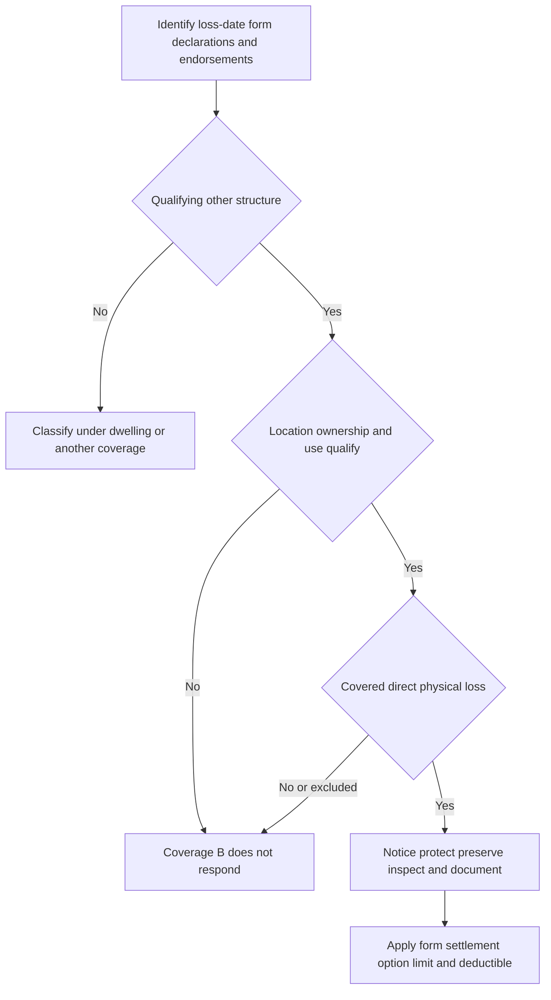

# Coverage B — Other Structures

## Scope and decision order

This is a form comparison, not a coverage determination. Start with the policy, Declarations, endorsements, and effective form at the date of loss. The 2018 HO-3 says the policy consists of its provisions, endorsements, and Declarations, and that the Declarations identify the residence premises, limits, and deductible. An attached state endorsement controls when its terms conflict with the policy, while unchanged terms remain in force. [HO-3 (2018-09), AGR.1–AGR.4](repo://forms/HO/MS/HO-3/2018-09.md#L15-L22) [Florida HO 01 09 (2023-07), T.1–T.3](repo://forms/HO/FL/HO-01-09/2023-07.md#L15-L20)

Coverage B is a **building-property classification**, not a catch-all for every item outside the main dwelling. The core questions are: whether the item is a qualifying structure; whether its physical connection makes it dwelling property instead; whether it is at the residence premises and has the required ownership or insurable-interest status; whether its actual use triggers a rental, business, farm, or occupancy restriction; and only then whether the direct physical loss, exclusions, limits, deductible, and settlement terms allow payment.

This is the practical Coverage B control flow: classification precedes cause-of-loss analysis, and a covered loss remains subject to post-loss duties, the applicable limit, and deductible. [HO-3 (2024-03), I.B B.1–B.6 and B.26–B.31](repo://forms/HO/MS/HO-3/2024-03.md#L153-L165) [HO-6 (2023-02), I.B B.1–B.18](repo://forms/HO/MS/HO-6/2023-02.md#L134-L170)

## What counts as an other structure

### Detached versus attached is outcome-determinative

Both reviewed HO-3 editions classify as Coverage B an other structure on the residence premises that is separated from the dwelling by clear space or is connected only by a fence, utility line, or similar connection. The 2018 form expressly says a structure attached by **more** than one of those limited connections is part of the dwelling and is covered as such rather than as an other structure. [HO-3 (2018-09), I.B B.1–B.4](repo://forms/HO/MS/HO-3/2018-09.md#L163-L171) The 2024 form states the same clear-space or limited-connection test. [HO-3 (2024-03), I.B B.1](repo://forms/HO/MS/HO-3/2024-03.md#L153-L155)

<!-- openwiki: broken internal link [/openwiki/coverages/coverage-a/dwelling-and-settlement] file "/openwiki/coverages/coverage-a/dwelling-and-settlement" does not exist. Fix the href or restore the target, then delete this comment. -->
The HO-6 (2023-02) uses the same physical test but makes the Coverage A boundary express: a structure physically attached to the dwelling is **not** an other structure and receives no Coverage B protection. It must be analyzed, if at all, under the HO-6 unit-owner building-property grant and the insured’s responsibility under the applicable agreement. [HO-6 (2023-02), I.B B.1–B.3](repo://forms/HO/MS/HO-6/2023-02.md#L134-L140) See [Coverage A — Dwelling, Limits, and Base Loss Settlement](/openwiki/coverages/coverage-a/dwelling-and-settlement) for the separate HO-6 building-responsibility analysis.

**Inspection implication.** Record the structure’s exact location and every physical connection—not merely call it a “shed,” “garage,” or “detached building.” Photographs, a site plan, and construction details can establish whether clear space exists or whether a connection is more substantial than the fence/utility-line example. This evidence also bears on the on-premises requirement and the loss cause.

### Form-specific property, ownership, and location boundaries

| Form and edition | Property and location grant | Ownership or responsibility boundary |
| --- | --- | --- |
| **HO-3 (2018-09)** | Other structure must be on the residence premises; coverage ends with loss of the insured’s insurable interest. [B.4 and B.11](repo://forms/HO/MS/HO-3/2018-09.md#L171-L185) | Insurable interest is required at loss. [B.4](repo://forms/HO/MS/HO-3/2018-09.md#L171-L171) |
| **HO-3 (2024-03)** | The structure must be located on the residence premises and used in connection with it; the form does not cover it after removal from the premises. [B.3 and B.32](repo://forms/HO/MS/HO-3/2024-03.md#L159-L159) [B.32](repo://forms/HO/MS/HO-3/2024-03.md#L215-L217) | It must be owned by or rented to the insured. [B.3](repo://forms/HO/MS/HO-3/2024-03.md#L159-L159) |
| **HO-6 (2023-02)** | The grant is for direct physical loss to other structures at the residence premises. Permanently installed fixtures and on-premises materials for their repair or alteration are included; personal property is not. [B.1–B.6](repo://forms/HO/MS/HO-6/2023-02.md#L134-L146) | The structure must be owned solely by an insured; association-, third-party-, and entity-owned structures are expressly excluded. [B.9](repo://forms/HO/MS/HO-6/2023-02.md#L152-L152) |

The HO-6 distinction is especially important in condominium claims. Its Coverage A protects specified unit building property only when it is the insured’s responsibility under an agreement, while Coverage B does not protect an association-owned other structure. Do not assume that an exclusive-use area or association responsibility creates Coverage B ownership. [HO-6 (2023-02), I.A A.4–A.8 and A.12](repo://forms/HO/MS/HO-6/2023-02.md#L86-L102) [HO-6 (2023-02), I.B B.9](repo://forms/HO/MS/HO-6/2023-02.md#L152-L152)

## Limits and settlement

### Limit mechanics differ materially

For both reviewed HO-3 editions, the Coverage B limit is **10% of the applicable Coverage A limit**, is additional insurance, and does not reduce Coverage A. [HO-3 (2018-09), I.B B.2](repo://forms/HO/MS/HO-3/2018-09.md#L165-L168) [HO-3 (2024-03), I.B B.2](repo://forms/HO/MS/HO-3/2024-03.md#L155-L157) Read the applicable Coverage A amount from the Declarations before calculating the 10%; it is not an independently stated dollar limit in either reviewed HO-3 form.

The HO-6 (2023-02) does **not** state a 10%-of-Coverage-A Coverage B allocation. Instead, it says the limit applicable to this coverage is the most it will pay for loss arising from an occurrence. The applicable amount must therefore be taken from the policy’s applicable Coverage B limit rather than imported from either HO-3 form. [HO-6 (2023-02), I.B B.15](repo://forms/HO/MS/HO-6/2023-02.md#L162-L166)

### Settlement is not automatically Coverage A replacement cost

Neither reviewed HO-3 form makes the Coverage A 80%-of-dwelling replacement-cost test a Coverage B rule. In the 2018 edition, Coverage B lets the insurer repair, rebuild, replace with like kind and quality, or pay; its valuation provision permits consideration of the structure’s pre-loss condition, depreciation, age, and use. [HO-3 (2018-09), I.B B.28–B.30](repo://forms/HO/MS/HO-3/2018-09.md#L219-L224) By contrast, the 80% threshold appears in that edition’s Coverage A settlement wording. [HO-3 (2018-09), I.A A.20–A.24](repo://forms/HO/MS/HO-3/2018-09.md#L125-L133)

The 2024 HO-3 similarly permits repair, replacement, rebuilding with like-kind-and-quality materials and workmanship, or payment, and caps payment at the applicable limit; its Coverage B text does not set out the Coverage A replacement-cost threshold. [HO-3 (2024-03), I.B B.29–B.31](repo://forms/HO/MS/HO-3/2024-03.md#L211-L215) The HO-6 lets the insurer repair, replace, or pay and select materials, methods, and service providers, subject to the coverage limit for the occurrence. [HO-6 (2023-02), I.B B.14–B.16](repo://forms/HO/MS/HO-6/2023-02.md#L162-L166) In every case, determine whether a separate loss-settlement endorsement alters this base-form result.

## Eligibility exclusions and loss causation

### Use and occupancy exclusions are a first-pass screen

| Form and edition | High-impact Coverage B eligibility restrictions |
| --- | --- |
| **HO-3 (2018-09)** | Excludes a structure rented or held for rental to a person who is not a dwelling tenant, except one used solely as a private garage; excludes a structure from which business is conducted; and excludes business-property storage except the stated insured/residence-employee-owned storage exception where no business is conducted. A principally business-use structure is excluded, subject to the form’s private-garage wording. [B.7–B.10](repo://forms/HO/MS/HO-3/2018-09.md#L177-L183) |
| **HO-3 (2024-03)** | Excludes business use, business-property storage and goods for sale, farming, business operations, a structure occupied as a dwelling, land, outdoor property not part of the structure, and separately insured property. A detached private garage is covered for the specified private-garage use but not if rented to a non-dwelling tenant. [B.4–B.14](repo://forms/HO/MS/HO-3/2024-03.md#L161-L181) |
| **HO-6 (2023-02)** | Excludes rental or held-for-rental structures except a private garage made available for rental; excludes a business structure except a private garage used only to store an insured’s business property; and separately requires sole insured ownership. Land and landscaping are also excluded. [B.6–B.9](repo://forms/HO/MS/HO-6/2023-02.md#L146-L152) |

These restrictions turn on the structure’s actual use and ownership at the relevant time. Obtain the rental agreement, business or farm-use facts, title or association records, and a record of what was stored or conducted there. A private-garage exception is not a general exception for every commercial, rental, or nonresidential structure.

### Cause-of-loss gate and recurring exclusions

The HO-3 forms provide risk-of-direct-physical-loss coverage subject to exclusions and limitations; the 2018 edition requires accidental physical damage and the 2024 edition requires an accidental loss during the policy period caused by a peril not excluded or limited. [HO-3 (2018-09), I.P P.1–P.2](repo://forms/HO/MS/HO-3/2018-09.md#L625-L630) [HO-3 (2024-03), I.P P.1–P.5](repo://forms/HO/MS/HO-3/2024-03.md#L557-L568) HO-6 is materially different: it covers direct physical loss only when a **named peril** directly causes it, rather than using the HO-3 risk-of-loss formulation. [HO-6 (2023-02), I.P P.1–P.3](repo://forms/HO/MS/HO-6/2023-02.md#L514-L520)

Across the forms, significant loss-cause barriers include ordinance or law, earth movement, flood/surface water, water below ground, sewer/drain/sump backup, neglect, and excluded wear, deterioration, settling, defective work, pollutants, and animals. The precise language and any ensuing-loss exception differ by form, so test the loss under the active edition rather than applying this list as an independent exclusion. [HO-3 (2018-09), I.P P.4–P.25 and P.33–P.37](repo://forms/HO/MS/HO-3/2018-09.md#L631-L699) [HO-3 (2024-03), I.P P.7–P.25](repo://forms/HO/MS/HO-3/2024-03.md#L571-L607) [HO-6 (2023-02), I.P P.4–P.11 and P.28–P.32](repo://forms/HO/MS/HO-6/2023-02.md#L522-L536) [HO-6 (2023-02), I.P P.28–P.32](repo://forms/HO/MS/HO-6/2023-02.md#L570-L578)

For water losses, do not treat a damaged detached building as enough by itself. The HO-3 (2024-03) excludes backup and sump overflow, flood/surface water, and below-surface water; it separately covers accidental discharge or overflow from listed internal systems but not damage to the source system or appliance. [HO-3 (2024-03), I.P P.9–P.12 and P.30–P.31](repo://forms/HO/MS/HO-3/2024-03.md#L575-L581) The HO-6 has the same core distinction between accidental-discharge damage to other covered property and damage to the system or appliance, as well as its backup and underground-water exclusions. [HO-6 (2023-02), I.P P.28–P.32](repo://forms/HO/MS/HO-6/2023-02.md#L570-L578)

## Claim handling, deductible, and resolution

An insured must promptly report the loss; protect against further damage; make only necessary temporary repairs; preserve damage and repair materials where reasonably possible; allow inspection; and provide records, photographs, estimates, and requested information. The 2024 HO-3 requires a sworn proof of loss within 90 days after request. [HO-3 (2024-03), I.S S.4–S.18](repo://forms/HO/MS/HO-3/2024-03.md#L809-L837) The HO-6 requires the requested sworn proof within 60 days and also requires cooperation on repair or replacement. [HO-6 (2023-02), I.S S.4–S.18](repo://forms/HO/MS/HO-6/2023-02.md#L850-L878) Emergency mitigation does not authorize loss of material evidence: retain removed materials and document the condition before, during, and after work whenever practicable.

The base deductible applies only after identifying covered loss and does not enlarge the limit. The 2018 HO-3 recovers only the amount remaining after the deductible, subject to its $500 Section I floor; the 2024 HO-3 likewise recovers only the amount after deductible but has a $1,000 Section I floor. [HO-3 (2018-09), I.S S.15–S.18](repo://forms/HO/MS/HO-3/2018-09.md#L943-L949) [HO-3 (2024-03), I.S S.29–S.34](repo://forms/HO/MS/HO-3/2024-03.md#L859-L869) HO-6 applies the Section I deductible to each covered loss, subject to its $500 floor. [HO-6 (2023-02), I.S S.31–S.32](repo://forms/HO/MS/HO-6/2023-02.md#L904-L906)

When the dispute is the amount rather than coverage, each reviewed form provides a written appraisal mechanism. Appraisal determines amount of loss (and specified valuation measures), not coverage, policy interpretation, or compliance with conditions. [HO-3 (2018-09), I.S S.46–S.51](repo://forms/HO/MS/HO-3/2018-09.md#L1005-L1015) [HO-6 (2023-02), I.S S.48–S.53](repo://forms/HO/MS/HO-6/2023-02.md#L938-L948)

## State amendment checkpoints

An attached state amendment must be reviewed rather than assumed from the state name. Florida HO 01 09 (2023-07) says the endorsement controls conflicts and does not broaden coverage beyond its express terms; Louisiana HO 01 17 (2020-09) similarly controls conflicts and otherwise leaves policy provisions applicable. [Florida HO 01 09 (2023-07), T.1–T.6](repo://forms/HO/FL/HO-01-09/2023-07.md#L15-L25) [Louisiana HO 01 17 (2020-09), T.1–T.7](repo://forms/HO/LA/HO-01-17/2020-09.md#L15-L31)

* **Florida.** The endorsement’s amended definition preserves the clear-space/fence/utility-line/similar-connection test and expressly says other structures do not include land. Its windstorm-and-hail deductible applies to covered structures loss, is determined under the applicable damaged-property limit, and is applied before the payable amount; it ranges from 2% to 15%. [Florida HO 01 09 (2023-07), T.9 T.4–T.7](repo://forms/HO/FL/HO-01-09/2023-07.md#L753-L759) [Florida HO 01 09 (2023-07), T.1 T.1–T.14](repo://forms/HO/FL/HO-01-09/2023-07.md#L57-L85)
* **Louisiana.** The amended definition defines other structures as those on the residence premises separated by clear space or a connection that is not part of the dwelling, and includes permanently attached fixtures. For covered other-structure or detached-structure wind/hail loss, its 2%–5% windstorm-and-hail deductible applies; the endorsement says that deductible does not create coverage and is applied before payment. [Louisiana HO 01 17 (2020-09), T.9 T.5–T.9](repo://forms/HO/LA/HO-01-17/2020-09.md#L789-L797) [Louisiana HO 01 17 (2020-09), T.1 T.1–T.7, T.21, and T.52](repo://forms/HO/LA/HO-01-17/2020-09.md#L61-L73) [Louisiana HO 01 17 (2020-09), T.1 T.52](repo://forms/HO/LA/HO-01-17/2020-09.md#L161-L165)
* **Texas.** The Texas HO 01 45 (2022-01) windstorm-and-hail provision is not automatically a Coverage B limit. It expressly applies to Coverage A and to any other coverage for which the Declarations identify that deductible; it is calculated from the applicable damaged-property limit, applied before payment, and constrained to 1%–10%. Confirm the Declarations before applying it to a Coverage B structure. [Texas HO 01 45 (2022-01), T.1 T.1–T.7](repo://forms/HO/TX/HO-01-45/2022-01.md#L61-L74)

The operational invariant is therefore: **do not calculate a deductible, valuation, or limit until the loss-date declarations and attached endorsements establish the controlling form and property classification.**
