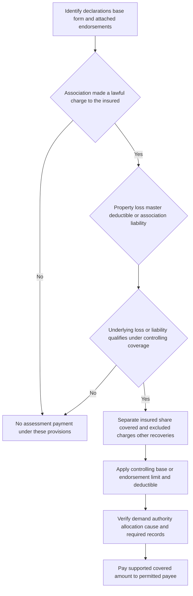

# Loss Assessment Coverage

## Start with the charge and the governing policy

A loss assessment is not the same thing as damage to the insured's unit or personal property. It is the insured's legally chargeable share of an association-level loss, expense, or liability. The governing base form, its edition, declarations, the association's governing documents, and every attached endorsement determine whether and how that share is covered. The HO 04 35 endorsement becomes part of the policy only while attached, preserves nonconflicting policy terms, and controls a conflict; it does not turn an excluded loss into a covered one. [HO 04 35 (2023-02), W.0](repo://forms/HO/MS/HO-04-35/2023-02.md#L13-L39)

The reviewed forms use materially different wording and limits. Do not use a state amendatory endorsement's reference to a “loss assessment additional coverage limit,” an internal procedure, or an association invoice as the source of a limit. Identify the edition in force at the loss and the actual attachment before stating a coverage position.

*The coverage sequence is assessment-first: a member's charge must be tied to a qualifying underlying loss or liability, then allocated, limited, and supported.* [HO 04 35 (2023-02), W.1](repo://forms/HO/MS/HO-04-35/2023-02.md#L41-L81) [HO 04 35 (2023-02), W.2](repo://forms/HO/MS/HO-04-35/2023-02.md#L161-L201)

## What is being insured

Three related amounts require separate analysis:

| Item | What it is | Why it is not interchangeable |
| --- | --- | --- |
| **The direct property loss** | Physical loss to property. Under HO-6, Coverage A can include unit alterations, fixtures, improvements, or building property for which the unit owner is responsible under an agreement. | This is first-party coverage for property the insured owns or is responsible to insure. It does not by itself insure association/common property. [HO-6 (2023-02), I.A A.4–A.12](repo://forms/HO/MS/HO-6/2023-02.md#L86-L102) |
| **The association assessment** | A charge allocated to the insured by a corporation or association because of an association-level property loss or liability. | Coverage addresses the insured's properly allocated, legally enforceable share—not the association's whole repair bill, another member's share, or an unenforceable demand. [HO 04 35 (2023-02), W.1.2 and W.1.15–W.1.17](repo://forms/HO/MS/HO-04-35/2023-02.md#L43-L77) |
| **The master-policy deductible** | The portion of an otherwise covered association loss that the master insurer does not pay. | It is a possible reason an association levies an assessment, not the insured's own homeowners deductible. Under HO 04 35 it is covered only when the association charges it to the insured and the underlying direct physical loss has a covered cause. [HO 04 35 (2023-02), W.1.8–W.1.10](repo://forms/HO/MS/HO-04-35/2023-02.md#L57-L61) |

An assessment can therefore be a claim even when the damaged property was not the insured's separately covered unit property. Conversely, coverage for a unit fixture or personal item is not payment of an association levy. Keep the direct-damage estimate, the master-policy claim information, and the member's allocated demand as distinct lines of analysis.

## Base-form additional coverage

The following are edition-specific base-form provisions. They are separate from HO 04 35 and do not assume that endorsement is attached.

### HO-3 (2018-09)

The reviewed HO-3 (2018-09) covers an assessment charged by a property-owner corporation or association when direct loss affects property collectively owned by its members and the loss is caused by a covered peril. It also describes assessment coverage for liability attributable to collectively owned property's ownership, maintenance, or use when the liability arises from a covered occurrence. Written prompt notice, assessment/loss documentation, cooperation, a valid legal obligation, and compliance with association governing documents are required. [HO-3 (2018-09), I.E E.37–E.41](repo://forms/HO/MS/HO-3/2018-09.md#L491-L499) [HO-3 (2018-09), I.E E.47](repo://forms/HO/MS/HO-3/2018-09.md#L509-L511)

Its maximum is **$1,500 for all covered assessments arising from the same loss**. The payment does not reduce Coverage E, and the provision says a deductible does not apply to covered loss assessment. The same base provision excludes an assessment charged because of a deductible on association property and excludes earthquake, flood, surface water, sewer backup, subsurface water, and maintenance/repair/replacement that was not caused by a covered loss. [HO-3 (2018-09), I.E E.42–E.46](repo://forms/HO/MS/HO-3/2018-09.md#L501-L509)

### HO-3 (2024-03)

The reviewed HO-3 (2024-03) covers a loss assessment charged by a property-owner corporation or association for direct loss to property it owns only when the direct loss was caused by a peril insured against under Coverage A and the assessment was made during the policy period. The provision makes this **$2,000 additional insurance** and applies the deductible applicable to the direct property loss; the insured must provide assessment and basis evidence when requested. It excludes maintenance, repair, replacement, or improvement unrelated to a covered direct loss and assessments from ownership of property not insured by the policy. [HO-3 (2024-03), I.E E.23–E.27](repo://forms/HO/MS/HO-3/2024-03.md#L457-L465)

The form also contains a distinct Section II loss-assessment provision: it requires a property-owner association charge arising from direct loss to association-owned property, supporting records, and proof that the assessment is valid and legally enforceable. It excludes certain assessments involving property not used as an insured location and an insured's breach of contract. Do not silently combine its wording with the $2,000 Section I additional-coverage provision; identify the applicable coverage part and limit. [HO-3 (2024-03), II.11–II.13](repo://forms/HO/MS/HO-3/2024-03.md#L1249-L1253)

### HO-6 (2023-02)

The reviewed HO-6 (2023-02) treats an association assessment as a **$2,000 additional coverage** that does not reduce Coverage C. It covers an assessment charged by an association with authority to levy it when it results from covered direct physical loss; the form separately identifies qualifying association-property damage and association liability for bodily injury or property damage from a covered occurrence. The insured must promptly provide the association notice, governing records, and other requested supporting documents. [HO-6 (2023-02), I.E E.21–E.25](repo://forms/HO/MS/HO-6/2023-02.md#L410-L418)

The base HO-6 excludes design/workmanship/maintenance defects, wear and deterioration, operating-fund shortages, fines or rule-violation charges, damage to noncovered insured-owned property or land, and charges outside the insured's ownership period. It also makes payment contingent on a lawful association demand and reasonable efforts to obtain reimbursement from the association or another responsible source; it does not impose a duty to defend the association. [HO-6 (2023-02), I.E E.26–E.32](repo://forms/HO/MS/HO-6/2023-02.md#L420-L432)

A separate HO-6 Section II provision concerns a member's assessment resulting from **covered property damage for which the insured is liable**, subject to association governing documents. It requires prompt notice, supporting records, and cooperation, and excludes an assessment involving property owned by the insured or the association, business property, rule failures, and fines or interest. It is a liability-side pathway, not a way to recast direct association property damage under the unit-owner's property coverage. [HO-6 (2023-02), II.23–II.35](repo://forms/HO/MS/HO-6/2023-02.md#L1256-L1280)

## HO 04 35 (2023-02) endorsement

### Coverage grant and eligibility

When attached, HO 04 35 supplies loss-assessment coverage for a legally chargeable owner or tenant share. Its property path covers the insured's allocated share of direct physical loss to collective property caused by a cause that would be covered if the collective property were owned by the insured. The endorsement separately covers an association charge for a master-policy deductible only when the association charges that deductible to the insured and the underlying physical loss has a covered cause. [HO 04 35 (2023-02), W.1.1–W.1.10](repo://forms/HO/MS/HO-04-35/2023-02.md#L43-L61)

Its liability path covers the insured's share of an assessment arising from property damage for which the association is legally liable, when the property damage results from an applicable occurrence; it includes an assessment arising from a judgment, settlement, or expense for that liability. The endorsement's special requirements separately address a bodily-injury assessment only where the association is legally obligated for bodily-injury damages from an applicable occurrence. A bodily-injury issue therefore requires the complete controlling policy and endorsement wording, rather than an assumption that the property-damage grant alone resolves it. [HO 04 35 (2023-02), W.1.11–W.1.14](repo://forms/HO/MS/HO-04-35/2023-02.md#L63-L69) [HO 04 35 (2023-02), W.6.7–W.6.8](repo://forms/HO/MS/HO-04-35/2023-02.md#L473-L477)

The insured must have an ownership or tenancy interest when the assessment is charged. The assessment must be legally enforceable, properly allocated to that insured, and supported by the association's authority and records. It does not cover a voluntary assumption or another person's allocation. [HO 04 35 (2023-02), W.1.15–W.1.17](repo://forms/HO/MS/HO-04-35/2023-02.md#L71-L77) [HO 04 35 (2023-02), W.1.48](repo://forms/HO/MS/HO-04-35/2023-02.md#L137-L139)

### Endorsement limit and deductible

HO 04 35 states a **$25,000** maximum for covered loss assessments. Payment reduces what remains available, and the applicable limit is the most payable for all covered loss assessments arising from the same occurrence regardless of the number of insureds, claims, assessments, members, or associations. A separate notice does not multiply coverage. [HO 04 35 (2023-02), W.1.43](repo://forms/HO/MS/HO-04-35/2023-02.md#L127-L129) [HO 04 35 (2023-02), W.2.1–W.2.9](repo://forms/HO/MS/HO-04-35/2023-02.md#L143-L159)

The endorsement applies the applicable deductible to the otherwise payable **covered assessment** and does not pay an amount within that deductible. It applies after coverage is determined, does not make an uncovered charge payable, and is not waived without a written agreement. A revised assessment is recalculated using the revised amount; a withdrawn assessment before payment is due is not subject to that deductible. [HO 04 35 (2023-02), W.3.1–W.3.19](repo://forms/HO/MS/HO-04-35/2023-02.md#L205-L241)

### How it changes a base provision

For a policy to which HO 04 35 is attached and applicable, its conflict rule makes its $25,000 limit and its deductible treatment controlling over an inconsistent base additional-coverage limit or deductible condition. For example, the reviewed HO-3 (2024-03) base provision states $2,000 additional insurance and applies the direct-property-loss deductible, while HO 04 35 states $25,000 and separately applies the deductible to the covered assessment. The same comparison applies to the HO-6's $2,000 additional coverage; the 2018 HO-3 base amount is $1,500 and says no deductible applies. Confirm the schedule, edition, and attachment before treating the endorsement as applicable. [HO 04 35 (2023-02), W.0](repo://forms/HO/MS/HO-04-35/2023-02.md#L13-L25) [HO 04 35 (2023-02), W.2–W.3](repo://forms/HO/MS/HO-04-35/2023-02.md#L141-L241) [HO-3 (2024-03), I.E E.23–E.26](repo://forms/HO/MS/HO-3/2024-03.md#L457-L463) [HO-6 (2023-02), I.E E.21–E.24](repo://forms/HO/MS/HO-6/2023-02.md#L410-L416) [HO-3 (2018-09), I.E E.42–E.46](repo://forms/HO/MS/HO-3/2018-09.md#L501-L509)

This endorsement also changes the 2018 HO-3's relevant base exclusion for an assessment charged because of an association-property deductible: that base form excludes it, while HO 04 35 expressly grants a properly charged master-policy deductible assessment that stems from a covered cause of loss. It remains subject to the endorsement's allocation, enforceability, limit, deductible, exclusions, and conditions. [HO-3 (2018-09), I.E E.43](repo://forms/HO/MS/HO-3/2018-09.md#L503-L505) [HO 04 35 (2023-02), W.0 and W.1.8–W.1.10](repo://forms/HO/MS/HO-04-35/2023-02.md#L15-L25) [HO 04 35 (2023-02), W.1.8–W.1.10](repo://forms/HO/MS/HO-04-35/2023-02.md#L57-L61)

### Endorsement exclusions and payment boundaries

HO 04 35 does not cover routine or deferred maintenance, wear or deterioration, repair or improvement without direct physical loss, betterment, reserve or operating funding, fines and penalties, voluntary obligations, or a charge that is not legally enforceable. It also retains cause-based and policy exclusions; examples expressly listed include flood/surface water, earth movement, certain water backup, faulty work, ordinance-or-law charges, and other insurance or recovery to the stated extent. A deductible or a percentage deductible applied by a master policy does not itself establish coverage. [HO 04 35 (2023-02), W.1.16–W.1.31](repo://forms/HO/MS/HO-04-35/2023-02.md#L73-L103) [HO 04 35 (2023-02), W.4.1–W.4.13](repo://forms/HO/MS/HO-04-35/2023-02.md#L245-L271) [HO 04 35 (2023-02), W.4.27–W.4.41](repo://forms/HO/MS/HO-04-35/2023-02.md#L299-L327)

Only the covered portion of a combined assessment is payable. The endorsement reduces payment for amounts recovered or recoverable from another insurer, responsible party, organization, or source, and permits payment to the insured, the association, or another legally entitled person. Payment to the association satisfies the obligation to the extent paid. [HO 04 35 (2023-02), W.1.42–W.1.47](repo://forms/HO/MS/HO-04-35/2023-02.md#L123-L135) [HO 04 35 (2023-02), W.2.19–W.2.29](repo://forms/HO/MS/HO-04-35/2023-02.md#L179-L199)

## Claim responsibilities and evidence

### Base-form responsibilities

For the reviewed base forms, prompt notice and association records are central. The 2018 HO-3 asks for written notice and documents describing the assessment and related loss. The 2024 HO-3 asks for evidence of the assessment and its basis, and its Section II path calls for supporting records and validity/enforceability proof. The HO-6 asks for prompt notice and association notice, governing records, and supporting documents; its liability-side section requires notice, records, and cooperation. [HO-3 (2018-09), I.E E.40–E.41](repo://forms/HO/MS/HO-3/2018-09.md#L497-L499) [HO-3 (2024-03), I.E E.26](repo://forms/HO/MS/HO-3/2024-03.md#L461-L463) [HO-3 (2024-03), II.12](repo://forms/HO/MS/HO-3/2024-03.md#L1251-L1253) [HO-6 (2023-02), I.E E.25](repo://forms/HO/MS/HO-6/2023-02.md#L416-L418) [HO-6 (2023-02), II.24–II.25](repo://forms/HO/MS/HO-6/2023-02.md#L1258-L1260)

### HO 04 35 responsibilities

The endorsement is more specific. It requires notice of the loss within **60 days after the insured knows of the loss**, identification of the association if known, and prompt forwarding of demands, assessment statements, invoices, correspondence, and legal papers. The insured must cooperate, give access to relevant property and records, avoid voluntary payment/obligation/settlement without consent except reasonable protective measures, and furnish available association governing, meeting, and voting records. [HO 04 35 (2023-02), W.5.1–W.5.10](repo://forms/HO/MS/HO-04-35/2023-02.md#L369-L387)

The insured must also establish the association's authority, the allocation to the insured, the ownership interest, the underlying cause or liability, and the assessment amount. Preserve evidence and recovery rights; report a revision, withdrawal, reduction, reallocation, dispute, or another insurer/recovery source. The endorsement permits direct association communication and record inspection, an examination under oath, a signed proof or statement on request, and payment may be affected by material noncompliance to the extent permitted by law. [HO 04 35 (2023-02), W.5.11–W.5.27](repo://forms/HO/MS/HO-04-35/2023-02.md#L389-L421) [HO 04 35 (2023-02), W.5.37–W.5.46](repo://forms/HO/MS/HO-04-35/2023-02.md#L441-L459)

### Focused file checklist

1. Preserve the declarations, edition, attachments, and association/master-policy information in effect at the underlying loss.
2. Obtain the written demand, bylaws/declaration or other source of levy authority, meeting or board action where available, allocation calculation, and proof the charge is legally enforceable against this insured.
3. Document the underlying event, damaged collective property or association liability, cause-of-loss analysis, master-policy deductible if relevant, and all coverage/recovery already available.
4. Split the invoice into covered physical-loss or qualifying liability amounts and noncovered maintenance, improvement, reserve, fee, fine, interest, or other portions.
5. Apply the applicable base or endorsement limit and deductible only after identifying the covered portion; never use payment for unit property, the association's whole loss, or a master deductible as a substitute calculation.
6. Give notice promptly, preserve property/records and recovery rights, and do not settle an assessment or impair recovery rights without following the controlling policy terms.

<!-- openwiki: broken internal link [/openwiki/claims-guidance/claim-intake-investigation-and-documentation] file "/openwiki/claims-guidance/claim-intake-investigation-and-documentation" does not exist. Fix the href or restore the target, then delete this comment. -->
For the general file-development workflow—policy assembly, preservation, targeted requests, decision documentation, payment controls, and recovery preservation—see [Claims Guidance — Intake, Investigation, Duties, and Payment Handling](/openwiki/claims-guidance/claim-intake-investigation-and-documentation). That page is operational guidance; the cited policy provisions control this coverage analysis.
