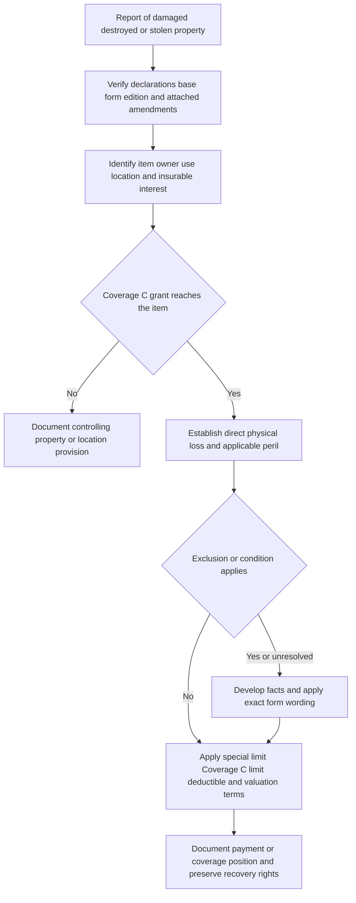

## Scope: establish the contract before applying Coverage C

Coverage C is not a uniform contents coverage. Start with the policy in force on the loss date: declarations (including the selected limits and deductibles), base-form line and edition, and all attached endorsements and state amendments. The applicable form determines the property grant, location treatment, covered perils, special limit, and post-loss duties; an amendment controls only where it conflicts with the policy and does not itself broaden coverage except as stated. [FL HO 01 09, T.0](repo://forms/HO/FL/HO-01-09/2023-07.md#L13-L25) [TX HO 01 45, T.0](repo://forms/HO/TX/HO-01-45/2022-01.md#L13-L25)

The Mississippi sources below are the available complete base forms. Florida HO 01 09 and Texas HO 01 45 are amendatory endorsements, not standalone Coverage C schedules. Their text must be read with the applicable base form and declarations; this page does not infer a Coverage C special limit, a valuation basis, or a grant from either overlay alone.

*The claim path classifies the item and loss under the controlling form before calculating a covered amount.*

## Coverage grant and off-premises treatment

### HO-3 Special Form — Mississippi 2018-09

The 2018 HO-3 grants Coverage C for **“personal property” owned or used by an “insured” while it is at the “residence premises” or elsewhere**. It says the Coverage C limit is **50% of Coverage A**, is the most payable under Coverage C, and remains subject to the special limits. It also defines covered property to include property normally used by an insured while away from the residence premises. [MS HO-3 2018, C.1-C.4](repo://forms/HO/MS/HO-3/2018-09.md#L231-L240)

Property of others is narrower: **“We may also cover property of others while that property is at the residence premises, if you request coverage for that property.”** The item, location, request, and applicable limit therefore need support; do not treat possession of another person's item away from the residence premises as this grant. [MS HO-3 2018, C.1](repo://forms/HO/MS/HO-3/2018-09.md#L231-L234)

This edition gives Coverage C a stated list of perils, including fire/lightning, windstorm/hail (with the building-opening condition for rain, snow, sleet, sand, or dust), theft, falling objects, accidental discharge/overflow from listed systems, freezing subject to reasonable care, and sudden accidental electrical-current damage. A claim must satisfy one of the listed Coverage C perils and its internal conditions; the form also says coverage is subject to exclusions. [MS HO-3 2018, C.13-C.28](repo://forms/HO/MS/HO-3/2018-09.md#L257-L287)

### HO-3 Special Form — Mississippi 2024-03

The 2024 HO-3 instead provides personal-property coverage **“while the property is anywhere in the world”** and sets Coverage C at **50% of Coverage A**. The property must be **“usual or incidental to the occupancy of the ‘residence premises’ by an insured.”** It covers direct physical loss only when caused by a peril covered by the policy, and a special limit is the greatest payable amount within—not in addition to—the Coverage C limit. [MS HO-3 2024, C.1-C.10](repo://forms/HO/MS/HO-3/2024-03.md#L219-L240)

At the insured's request, this edition may cover a guest's property at the residence premises while in the insured's care, custody, or control, and a residence employee's property at the residence premises; it may require ownership proof. This is an express, request-based property-of-others extension—not a general extension for all noninsured owners or locations. [MS HO-3 2024, C.4-C.6](repo://forms/HO/MS/HO-3/2024-03.md#L227-L232) The form also requires an insured to have an insurable interest at the time of loss and caps payment at that insured's financial interest. [MS HO-3 2024, S.2](repo://forms/HO/MS/HO-3/2024-03.md#L844-L848)

### HO-6 Unit-Owners Form — Mississippi 2023-02

The HO-6 grants Coverage C for personal property owned or used by an insured **“while it is anywhere in the world,”** and separately states that property may be at or away from the residence premises. Its specifically stated extensions include property usually kept at another residence where the insured is temporarily living, and a related or in-care student's property while the student resides away. [MS HO-6, C.1-C.7](repo://forms/HO/MS/HO-6/2023-02.md#L184-L198)

For property of others, the HO-6 uses different wording from either HO-3 edition: at the insured's request it covers property at the residence premises, and may cover a guest's or residence employee's property in **“any residence occupied by an insured.”** The guest/residence-employee item must be in an insured's care when the loss occurs; its owner may be required to give records and submit to an examination under oath. [MS HO-6, C.3-C.4](repo://forms/HO/MS/HO-6/2023-02.md#L190-L193)

HO-6 is a named-peril form: it covers direct physical loss caused by a named peril, which must directly cause the loss. The listed perils include fire/lightning, windstorm/hail (including its opening requirement for interior property), theft with location and locked-vehicle restrictions, accidental discharge/overflow, system breakage, freezing, and electrical current. [MS HO-6, P.1-P.3](repo://forms/HO/MS/HO-6/2023-02.md#L514-L520) [MS HO-6, P.8-P.38](repo://forms/HO/MS/HO-6/2023-02.md#L530-L590)

## Special limits: apply the exact form and category

Each limit below is within Coverage C, not additional insurance. The category and the cause qualifier matter: a theft-only limit does not become a cap for another covered cause, while the money and watercraft limits expressly apply to loss rather than only theft. Do not substitute a colloquial item label for the form's category.

| Category and controlling wording | MS HO-3 2018-09 | MS HO-3 2024-03 | MS HO-6 2023-02 |
| --- | ---: | ---: | ---: |
| **Money / precious metals** | **$250** for “money, bank notes, bullion, coins, medals, scrip, and precious metals” | **$300** for “money, bank notes, bullion, coins, medals and precious metals” | **$250** for “money, bank notes, bullion, gold other than goldware, silver other than silverware, platinum, coins, medals, and precious metals” |
| **Theft of jewelry** | **$1,500** for “jewelry, watches, and precious stones” | **$2,000** for “jewelry, watches and precious stones” | **$2,000** for “jewelry, watches, precious and semiprecious stones” |
| **Theft of firearms** | **$2,500**, including related equipment/accessories intended for firearm use | **$3,000**, including related equipment | **$2,500** for firearms and related equipment |
| **Watercraft** | **$1,500**, including trailers, furnishings, equipment, and motors | **$1,500**, including trailers, furnishings, equipment, and accessories | **$1,500**, including trailers, furnishings, equipment, and outboard motors |
| **Theft of silver/gold/pewter ware** | **$2,500** for “silverware, goldware, or pewterware” | **$3,000** for “silverware,” including silver-plated ware, gold-plated ware and pewterware | **$2,500** for “silverware, silver-plated ware, goldware, gold-plated ware, and pewterware” |
| **Business property at the residence premises** | **$3,000** | **$3,000** | **$3,000** |
| **Electronic apparatus in/on a motor vehicle** | **$1,500** if operable from vehicle electrical power | **$1,500** while in or upon a motor vehicle | **$1,500** if operable from the vehicle electrical system |

[MS HO-3 2018, C.5-C.12](repo://forms/HO/MS/HO-3/2018-09.md#L241-L256) [MS HO-3 2024, C.9-C.18](repo://forms/HO/MS/HO-3/2024-03.md#L237-L255) [MS HO-6, C.26-C.37](repo://forms/HO/MS/HO-6/2023-02.md#L236-L258)

The HO-6 expressly applies the special limits to all covered property in the same loss regardless of the number of insureds, claims, or items, and says that special limits apply **before** the deductible. The 2024 HO-3 says the limits apply regardless of individual, joint, or benefit ownership. These rules reinforce the need to group items under the actual category and occurrence rather than assign a separate sublimit to each item or claimant. [MS HO-6, C.26, C.34-C.35](repo://forms/HO/MS/HO-6/2023-02.md#L236-L256) [MS HO-3 2024, C.9-C.10, C.18](repo://forms/HO/MS/HO-3/2024-03.md#L237-L255)

## Exclusions and boundaries that commonly decide the item claim

The cited Coverage C provisions are not an exhaustive substitute for Section I exclusions, conditions, or endorsements. Apply the exact edition's broader exclusion section and the relevant peril provision. The following are recurrent, material boundaries in the Coverage C text.

- **Property character or ownership:** The 2018 HO-3 excludes separately described and specifically insured property to the extent other insurance covers it, living creatures and property held primarily for sale; it also excludes motor vehicles except a residence-servicing vehicle or disability-assistance vehicle, aircraft, hovercraft, nonrelated resident roomer/boarder/tenant property absent prior written agreement, and business data except blank media. [MS HO-3 2018, C.29-C.37](repo://forms/HO/MS/HO-3/2018-09.md#L289-L305)
- **2024 HO-3 ownership/use limits:** It excludes separately described and specifically insured property to the extent other insurance responds, noninsured-owned property except as the section provides, property after title passes or that is abandoned/unlawfully possessed, and loss while used for an unlawful purpose. It also excludes sentimental value above payable value, loss of use, delay, and diminished or market-value loss. [MS HO-3 2024, C.33-C.39](repo://forms/HO/MS/HO-3/2024-03.md#L285-L297) [MS HO-3 2024, C.54-C.56](repo://forms/HO/MS/HO-3/2024-03.md#L327-L331)
- **HO-6 property/use limits:** It excludes property held for sale in the regular course of business, property transferred through fraud/deceit/trickery, items in a transporter/storer/repairer/servicer's care, separately described/specially insured property to the extent other insurance responds, most motor vehicles, aircraft except non-passenger model/hobby aircraft, and watercraft except as provided by its special limit. It excludes roomer, boarder, and tenant property unless owned/used by an insured, subject to the guest-at-residence exception. [MS HO-6, C.8, C.12-C.20](repo://forms/HO/MS/HO-6/2023-02.md#L200-L224)
- **Theft is qualified, not merely disappearance:** The 2018 HO-3 does not cover theft by an insured or a person entrusted with the property. HO-6 also excludes theft by an insured or a regular resident; at another residence owned, rented, or occupied by an insured it requires temporary residence, and a motor-vehicle theft claim requires a fully enclosed, locked compartment. [MS HO-3 2018, C.21](repo://forms/HO/MS/HO-3/2018-09.md#L271-L274) [MS HO-6, P.21-P.24](repo://forms/HO/MS/HO-6/2023-02.md#L556-L562)
- **Cause, condition, and post-loss care:** The forms contain exclusions for gradual conditions such as wear, marring, deterioration, mechanical breakdown, rust/corrosion, mold/rot, settling/expansion, and animal damage, with edition-specific ensuing-loss wording. They also require reasonable protection from further damage. The 2024 HO-3 additionally applies its Coverage C exclusion regardless of another contributing cause or event. [MS HO-3 2018, C.38-C.49](repo://forms/HO/MS/HO-3/2018-09.md#L307-L329) [MS HO-3 2024, C.7-C.8](repo://forms/HO/MS/HO-3/2024-03.md#L233-L235) [MS HO-6, C.38-C.50](repo://forms/HO/MS/HO-6/2023-02.md#L260-L284)

For water source, duration, failed equipment, and water-backup endorsement analysis that can determine whether damaged contents have a covered cause, see [Water Damage and Water-Backup Write-Backs](/openwiki/coverages/coverage-a/water-damage-and-water-backup.md). It is a separate cause-of-loss analysis; contents status does not convert flood, groundwater, backup, or repeated leakage into a covered peril.

## Valuation, payment, and proof

Do not call Coverage C replacement-cost coverage unless the policy or a specific endorsement supplies that settlement term. The available base-form Coverage C grants do not state a blanket personal-property replacement-cost promise. Their actual-cash-value language and loss documentation requirements instead support development of value, condition, ownership, and the covered amount under the full policy.

- In the 2018 HO-3, **“actual cash value”** means repair/replacement cost reduced by depreciation and physical condition. The damaged-personal-property inventory must state condition, actual cash value, and amount of loss; the sworn proof must include ACV and amount for each item or category. [MS HO-3 2018, DEF.1](repo://forms/HO/MS/HO-3/2018-09.md#L41-L47) [MS HO-3 2018, C.50-C.58](repo://forms/HO/MS/HO-3/2018-09.md#L331-L347) [MS HO-3 2018, S.27-S.29](repo://forms/HO/MS/HO-3/2018-09.md#L967-L973)
- In the 2024 HO-3, ACV is the value at loss with appropriate depreciation and obsolescence deduction, and market value may be considered when it reasonably reflects that value. Its proof of loss must state ACV and amount of loss for each claimed item. The insurer may repair, replace, restore, or pay value where permitted, with like kind and quality but no greater value, capacity, or utility. [MS HO-3 2024, DEF.1](repo://forms/HO/MS/HO-3/2024-03.md#L41-L47) [MS HO-3 2024, S.13-S.16](repo://forms/HO/MS/HO-3/2024-03.md#L827-L833) [MS HO-3 2024, C.40-C.44](repo://forms/HO/MS/HO-3/2024-03.md#L299-L307)
- In the HO-6, ACV is replacement cost less depreciation reflecting age, condition, expected useful life, and wear. It requires an inventory showing quantity, description, age, condition, and value, and permits repair, restoration, or replacement with reasonable adjustment for age, condition, and physical depreciation. [MS HO-6, DEF.1](repo://forms/HO/MS/HO-6/2023-02.md#L35-L40) [MS HO-6, S.12-S.13](repo://forms/HO/MS/HO-6/2023-02.md#L864-L869) [MS HO-6, S.43-S.44](repo://forms/HO/MS/HO-6/2023-02.md#L926-L931)

Across these forms, develop an itemized inventory and preserve available purchase records, receipts, photographs, appraisals, manuals, warranties, account records, and repair or maintenance material as applicable. This is evidence development, not agreement with the claimed value. Both HO-3 editions permit inspection, requested records, and examination; the 2024 form permits payment to a lawful interest holder and may take possession after payment. [MS HO-3 2018, C.50-C.56](repo://forms/HO/MS/HO-3/2018-09.md#L331-L343) [MS HO-3 2024, C.19-C.30, C.40-C.42](repo://forms/HO/MS/HO-3/2024-03.md#L257-L303)

## State overlays, deductibles, and referral boundary

The Florida amendment applies its windstorm/hail deductible to covered personal-property loss **whether located at the residence premises or elsewhere**; it is applied before the payable amount and does not increase a limit. The Texas amendment likewise applies its windstorm/hail deductible when windstorm or hail damages personal property inside or outside the dwelling. Texas further says that deductible applies before any applicable special limit is considered. These statements regulate calculation for an otherwise covered wind/hail loss; they do not establish a Coverage C property grant or override another applicable limitation. [FL HO 01 09, T.1.12-T.1.15](repo://forms/HO/FL/HO-01-09/2023-07.md#L79-L87) [TX HO 01 45, T.1.18, T.1.50](repo://forms/HO/TX/HO-01-45/2022-01.md#L93-L101) [TX HO 01 45, T.1.48-T.1.52](repo://forms/HO/TX/HO-01-45/2022-01.md#L153-L163)

The referral matrix is an internal authority tool, not a coverage contract: it says it cannot create, expand, restrict, or waive coverage, and directs referral when the facts do not support a confident authority determination. Use it to escalate an unclear category, ownership/possession issue, valuation evidence conflict, or authority question, while grounding every coverage communication in the controlling form. [Referral and Authority Matrix, H.0](repo://guidelines/authority/referral-matrix.md#L13-L31)

For the larger handling lifecycle—notice, evidence preservation, authorized decision, payment, recovery, and reopening—see [Claims Guidance — Intake, Investigation, Duties, and Payment Handling](/openwiki/claims-guidance/claim-intake-investigation-and-documentation.md). Loss assessment and loss-of-use analysis are separate coverages and require their own grants, limits, and conditions; do not consume or supplement the Coverage C limit without a controlling provision.

## Focused file checks

1. Identify the **exact item** and establish owner, insured use, possession, location at loss, and any insurable or legal interest. For property of others, document the form-specific request, location, care/custody/control condition, and owner evidence.
2. Select the correct **form line and edition**, then determine whether the loss must satisfy listed named perils or the 2024 HO-3 covered-peril wording. Record the actual cause, direct physical damage, and every operative internal condition.
3. Test category restrictions and the relevant Section I exclusions before valuing. In theft claims, preserve report, recovery status, entrustment/residency facts, residence/vehicle location, and locked-compartment evidence where required.
4. Match every potentially limited item to the **quoted special-limit category** and loss cause. Calculate under the policy sequence: supported covered loss, special limit, Coverage C limit, deductible, and any form- or endorsement-specific valuation restriction. For Texas wind/hail losses, its amendment expressly places the deductible before the special limit.
5. Request and retain an itemized inventory plus available ownership, condition, and valuation support. Preserve damaged or recovered property for inspection when reasonably possible; distinguish damaged from undamaged, pre-existing, and excluded-condition items.
6. State unresolved issues precisely and refer under internal authority when needed. An inventory, inspection, information request, or partial payment does not itself concede coverage, valuation, ownership, or a particular settlement basis.
