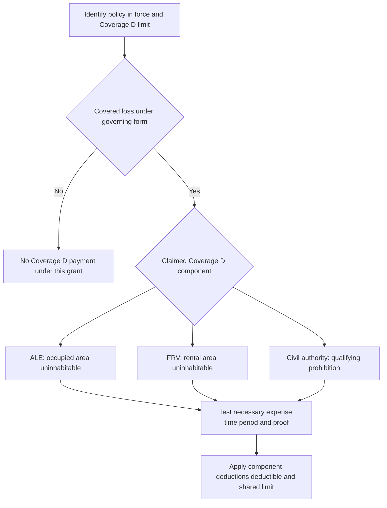

# Coverage D — Loss of Use

## Scope: a separate coverage analysis

Coverage D is not a property-repair allowance and it is not an automatic consequence of a favorable Coverage A decision. For each requested expense or rental amount, establish the governing form and edition, a **covered loss** under that form, the specific Coverage D component, the required loss of habitability or actual civil-authority prohibition, the covered time window, the applicable Coverage D limit, and supporting proof. The HO-3 (2024-03) separately limits Coverage D to necessary increased living expenses when a covered loss makes the residence premises uninhabitable; the HO-6 (2023-02) similarly grants loss-of-use coverage only as stated in its own section. [HO-3 (2024-03), D.1–D.6](repo://forms/HO/MS/HO-3/2024-03.md#L361-L373) [HO-6 (2023-02), D.1–D.6](repo://forms/HO/MS/HO-6/2023-02.md#L300-L312)

<!-- openwiki: broken internal link [/openwiki/coverages/coverage-a/dwelling-and-settlement] file "/openwiki/coverages/coverage-a/dwelling-and-settlement" does not exist. Fix the href or restore the target, then delete this comment. -->
Accordingly, a dwelling repair decision may supply facts relevant to causation, scope, or habitability, but it does not itself decide additional living expense (ALE), fair rental value (FRV), or civil-authority coverage. Analyze the property cause and repair scope under [Coverage A — Dwelling, Limits, and Base Loss Settlement](/openwiki/coverages/coverage-a/dwelling-and-settlement), then make the distinct Coverage D determination below.

*Coverage D follows its own trigger-and-proof path after a covered-loss determination; it is not settled merely by approving or denying a building repair.*

## Shared entry conditions, limit, and calculation order

The policy packet controls. The HO-3 (2018-09) states that the policy consists of its provisions, endorsements, and Declarations and that Declarations identify the applicable limits and deductible; the later HO-3 also ties coverage to the facts, policy terms, and applicable law. [HO-3 (2018-09), AGR.1–AGR.7](repo://forms/HO/MS/HO-3/2018-09.md#L13-L27) [HO-3 (2024-03), AGR.6–AGR.9](repo://forms/HO/MS/HO-3/2024-03.md#L25-L31) Confirm the declarations and all attached amendments before calculating the dollar ceiling or deductible.

| Form and edition | Coverage D aggregate limit | Common gate | Calculation consequence |
| --- | --- | --- | --- |
| **HO-3 (2018-09)** | 20% of the limit applicable to the covered dwelling; payments reduce what remains for covered loss of use. [D.1–D.3](repo://forms/HO/MS/HO-3/2018-09.md#L349-L355) | Loss of use must result from a covered loss to property at the residence premises that makes it unfit to live in. [D.1](repo://forms/HO/MS/HO-3/2018-09.md#L349-L351) | Pay actual loss sustained, but no more than reasonably necessary for the covered loss of use and the reducing aggregate limit. |
| **HO-3 (2024-03)** | 20% of Coverage A. Payments reduce Coverage D and cannot exceed its applicable limit. [D.1 and D.22](repo://forms/HO/MS/HO-3/2024-03.md#L361-L365) [D.22](repo://forms/HO/MS/HO-3/2024-03.md#L403-L405) | The particular component must flow from a covered loss and meet its uninhabitability or civil-authority requirements. | The limit is a shared, reducing cap for D payments; it does not enlarge Coverage A. |
| **HO-6 (2023-02)** | 50% of Coverage A, the most paid for **all** loss of use arising from any covered loss. [D.1–D.2](repo://forms/HO/MS/HO-6/2023-02.md#L300-L305) | Loss of use must result from a covered loss to property at the residence premises. [D.1](repo://forms/HO/MS/HO-6/2023-02.md#L300-L302) | This is a materially larger percentage than either reviewed HO-3, but remains one aggregate cap, not a separate limit per component or expense. |

Apply the component’s offset or baseline before treating an amount as payable: ALE is the **increase** in necessary living expense, while FRV excludes expenses that do not continue during the rental interruption. The limit does not transform an otherwise nonqualifying personal, repair, business, or speculative amount into covered loss of use. [HO-3 (2018-09), D.3–D.11](repo://forms/HO/MS/HO-3/2018-09.md#L355-L371) [HO-3 (2024-03), D.3–D.9](repo://forms/HO/MS/HO-3/2024-03.md#L367-L379) [HO-6 (2023-02), D.8–D.12](repo://forms/HO/MS/HO-6/2023-02.md#L316-L324)

## The three Coverage D components

### Additional living expense: the occupied portion

| Form and edition | Trigger and covered amount | Time period | Required proof and controls |
| --- | --- | --- | --- |
| **HO-3 (2018-09)** | A covered loss must make the residence premises unfit to live in. ALE is necessary increased living expense actually incurred to maintain the household’s normal standard of living, measured against necessary living expense before versus after loss. [D.1 and D.4–D.7](repo://forms/HO/MS/HO-3/2018-09.md#L349-L363) | Ends when the residence premises becomes fit to live in. [D.32](repo://forms/HO/MS/HO-3/2018-09.md#L409-L415) | Give prompt notice identifying the covered loss and claimed loss of use; retain records showing date, purpose, and amount paid, and provide requested receipts, invoices, and alternative-living-arrangement information. [D.26–D.30](repo://forms/HO/MS/HO-3/2018-09.md#L399-L409) |
| **HO-3 (2024-03)** | A covered loss must make the residence premises uninhabitable. The form expressly identifies reasonable temporary lodging, meals, related services, necessary household-property relocation, and necessary temporary storage as possible expenses; only the necessary increase needed for the normal standard of living is covered. [D.2–D.6](repo://forms/HO/MS/HO-3/2024-03.md#L365-L373) | ALE is limited to expenses incurred while the residence is uninhabitable because of the covered loss. [D.21](repo://forms/HO/MS/HO-3/2024-03.md#L401-L405) | Retain and provide receipts, invoices, leases, rental agreements, and other requested records; promptly report a temporary household-location change and when the residence is fit to live in. The insurer may require proof of cause, uninhabitability, amount, and direct connection. [D.13–D.14 and D.24](repo://forms/HO/MS/HO-3/2024-03.md#L385-L389) [D.24](repo://forms/HO/MS/HO-3/2024-03.md#L407-L409) |
| **HO-6 (2023-02)** | The part used by the insured must be unfit for living because of a covered loss. ALE is the reasonable and necessary increase required to maintain the household’s normal standard of living. [D.3–D.4](repo://forms/HO/MS/HO-6/2023-02.md#L306-L310) | Payable while that occupied part is unfit; it stops once fit for living. The form also ends loss-of-use payment when the premises are repaired or replaced and fit, or on permanent relocation, and limits it to the time reasonably required for repair or replacement. [D.5 and D.17–D.20](repo://forms/HO/MS/HO-6/2023-02.md#L310-L310) [D.17–D.20](repo://forms/HO/MS/HO-6/2023-02.md#L334-L340) | Keep records showing each expense and why it was necessary, provide requested receipts/invoices/rental records, identify ordinary expenses that would have continued anyway, and provide reasonable proof of unfitness and covered causation if requested. [D.23–D.27](repo://forms/HO/MS/HO-6/2023-02.md#L346-L354) |

The operative comparison is incremental, not total household spending. The reviewed HO-3 editions exclude expenses that would have been incurred without the loss, personal-convenience accommodations, voluntary relocation while the residence remains fit, and accommodations above the normal standard of living. The 2018 edition also requires reasonable steps to reduce ALE, and the HO-6 directs the insured to minimize it and not incur unnecessary or excessive expense. [HO-3 (2018-09), D.6–D.7 and D.25](repo://forms/HO/MS/HO-3/2018-09.md#L361-L363) [HO-3 (2024-03), D.15–D.16](repo://forms/HO/MS/HO-3/2024-03.md#L391-L395) [HO-6 (2023-02), D.6–D.7](repo://forms/HO/MS/HO-6/2023-02.md#L312-L315)

### Fair rental value: the rental portion

| Form and edition | Trigger and covered amount | Time period | Required proof and controls |
| --- | --- | --- | --- |
| **HO-3 (2018-09)** | A part rented to others or held for rental must be unfit to live in because of a covered loss. FRV is the rental value of that part less expenses that do not continue, limited to the value reasonably obtainable absent the loss. [D.8–D.11](repo://forms/HO/MS/HO-3/2018-09.md#L365-L371) | Ends when the rented or held-for-rental part becomes fit to live in. [D.32](repo://forms/HO/MS/HO-3/2018-09.md#L409-L415) | Provide supporting rental-value records plus the D.26–D.30 notice, records, requested lease/invoice, cooperation, occupancy, and rental-arrangement information. [D.26–D.30](repo://forms/HO/MS/HO-3/2018-09.md#L399-L409) |
| **HO-3 (2024-03)** | The rented part must be made uninhabitable by a covered loss and unavailable for rental. FRV is reduced by expenses that do not continue, and rental income must be supported by a lease, rental agreement, rental history, or other reliable evidence. [D.7–D.9](repo://forms/HO/MS/HO-3/2024-03.md#L375-L379) | Limited to rental income lost while the rented part is uninhabitable because of the covered loss. [D.21](repo://forms/HO/MS/HO-3/2024-03.md#L401-L405) | The D.13 record requirement and D.24 causation, habitability, expense, and rental-income proof authority apply. [D.13 and D.24](repo://forms/HO/MS/HO-3/2024-03.md#L385-L387) [D.24](repo://forms/HO/MS/HO-3/2024-03.md#L407-L409) |
| **HO-6 (2023-02)** | The rented or held-for-rental portion must be unfit for living because of a covered loss. Pay the rental portion’s value less noncontinuing expenses, but only for rental use actually lost. [D.8–D.11](repo://forms/HO/MS/HO-6/2023-02.md#L316-L322) | Payable while the rental portion is unfit, subject to the repair/replacement, permanent-relocation, and reasonable-repair-time endpoints described above. [D.10 and D.17–D.20](repo://forms/HO/MS/HO-6/2023-02.md#L320-L320) [D.17–D.20](repo://forms/HO/MS/HO-6/2023-02.md#L334-L340) | Keep rental and expense records, identify noncontinuing expenses, and provide requested receipts, invoices, and proof of rental value. Lease, rental records, and comparable rental information may be considered. [D.23–D.28](repo://forms/HO/MS/HO-6/2023-02.md#L346-L356) |

FRV is not a business-interruption substitute. The HO-3 (2018-09) excludes speculative or unsupported anticipated rental income, tenant default/cancellation/refusal, and lease disputes; its business-income exclusion preserves FRV otherwise covered by D. The HO-3 (2024-03) excludes FRV for space not held out for rental and unrelated vacancy, as well as business income and profits; the HO-6 requires reasonable efforts to rent once property is fit and does not pay loss caused by failure to do so. [HO-3 (2018-09), D.10 and D.17–D.18](repo://forms/HO/MS/HO-3/2018-09.md#L369-L385) [HO-3 (2024-03), D.19–D.20](repo://forms/HO/MS/HO-3/2024-03.md#L397-L401) [HO-6 (2023-02), D.12](repo://forms/HO/MS/HO-6/2023-02.md#L324-L324)

### Civil authority: actual prohibition, not inconvenience

Civil-authority coverage is its own route. It does not require direct damage at the residence premises, but it does require qualifying nearby direct physical loss from a covered cause and an actual prohibition—not difficult, delayed, limited, or merely inconvenient access or use.

| Form and edition | Trigger and component available | Time period | Proof focus |
| --- | --- | --- | --- |
| **HO-3 (2018-09)** | A civil authority must prohibit **access** because nearby property suffered direct damage from a covered cause. [D.12](repo://forms/HO/MS/HO-3/2018-09.md#L373-L373) | Only while the prohibition prevents access; it ends when access is no longer prohibited. [D.13](repo://forms/HO/MS/HO-3/2018-09.md#L375-L375) | Preserve the order, its effective and end dates, the nearby direct damage and covered cause, access facts, and component-specific ALE or FRV records. The form excludes merely difficult/limited access or premises that can reasonably be occupied. [D.14](repo://forms/HO/MS/HO-3/2018-09.md#L377-L377) |
| **HO-3 (2024-03)** | ALE and FRV may be covered where a civil authority prohibits **access** because a covered peril directly damaged nearby premises; the same peril must cause the damage and prohibition. [D.10](repo://forms/HO/MS/HO-3/2024-03.md#L381-L381) | Only while access is prohibited; no expenses or lost rental income after access is permitted. [D.11](repo://forms/HO/MS/HO-3/2024-03.md#L383-L383) | Provide the authority order and timeline, evidence of nearby direct damage and covered peril, and the normal D records and direct-causation proof. [D.13 and D.24](repo://forms/HO/MS/HO-3/2024-03.md#L385-L387) [D.24](repo://forms/HO/MS/HO-3/2024-03.md#L407-L409) |
| **HO-6 (2023-02)** | ALE and FRV may be covered where civil authority prohibits **use** of the residence premises, directly because nearby property sustained direct physical loss from a covered cause. [D.13–D.14](repo://forms/HO/MS/HO-6/2023-02.md#L326-L328) | Only while the prohibition is in effect; no payment after it ends. [D.15](repo://forms/HO/MS/HO-6/2023-02.md#L330-L330) | Preserve the authoritative prohibition, its dates, nearby loss and cause, use-prevention facts, and the normal component records. An action that does not prohibit use or is unrelated to a covered cause does not qualify. [D.16](repo://forms/HO/MS/HO-6/2023-02.md#L332-L332) |

## Boundaries, exclusions, and state amendments

Coverage D pays neither the building repair nor a betterment. The HO-3 (2024-03) expressly excludes repair, replacement, rebuilding, restoration, defect correction, improvements, and ordinance-compliance cost under Coverage D. It also excludes expenses caused by an excluded peril, and its expense and FRV rules are confined to the covered-loss uninhabitability period. [HO-3 (2024-03), D.17–D.21](repo://forms/HO/MS/HO-3/2024-03.md#L395-L403) The earlier HO-3 separately excludes preexisting conditions, voluntary nonoccupancy, unrelated construction delay, business income, maintenance and betterment, unrelated ordinance work, and non-loss-related utility or service shortage. [HO-3 (2018-09), D.15–D.24](repo://forms/HO/MS/HO-3/2018-09.md#L379-L397)

Read any state amendment precisely rather than carrying its deductible wording into a new Coverage D grant:

- **Louisiana HO 01 17 (2020-09).** The endorsement controls a conflict but does not provide coverage that the policy does not provide unless it expressly does so. For an otherwise covered windstorm/hail loss of use, it expressly applies the windstorm-and-hail deductible **when such coverage is provided** and directs payment to the policy’s loss-of-use terms. Its wind/hail deductible range is 2% to 5%, applies before payment to covered loss, and does not increase the limit. [HO 01 17 (2020-09), T.0](repo://forms/HO/LA/HO-01-17/2020-09.md#L13-L35) [HO 01 17 (2020-09), T.1–T.7 and T.51](repo://forms/HO/LA/HO-01-17/2020-09.md#L59-L73) [HO 01 17 (2020-09), T.51](repo://forms/HO/LA/HO-01-17/2020-09.md#L159-L163)
- **Florida HO 01 09 (2023-07).** This amendment changes only terms that differ and does not broaden coverage beyond its express terms. Its windstorm-and-hail deductible applies only to otherwise covered wind/hail loss, is 2% to 15%, and is calculated from applicable damaged-property limits before payable loss. It does not itself state an ALE, FRV, or civil-authority component; use the attached base policy’s Coverage D language for those elements. [HO 01 09 (2023-07), T.0](repo://forms/HO/FL/HO-01-09/2023-07.md#L13-L25) [HO 01 09 (2023-07), T.1–T.16](repo://forms/HO/FL/HO-01-09/2023-07.md#L57-L89)
- **Texas HO 01 45 (2022-01).** Its wind/hail deductible is 1% to 10%, calculated from the applicable damaged-property limit, and applies to Coverage A and any coverage for which Declarations identify that deductible. Do not assume that this text alone attaches it to Coverage D; check the Declarations and the policy in force. This is an edition-sensitive question: the preceding Texas 2019-01 edition expressly said the deductible applied to loss of use, whereas the 2022-01 language does not use that direct rule. [HO 01 45 (2022-01), T.1–T.7](repo://forms/HO/TX/HO-01-45/2022-01.md#L59-L73) [HO 01 45 (2019-01), T.9–T.12](repo://forms/HO/TX/HO-01-45/2019-01.md#L77-L84)

## Focused handling and proof checks

1. **Assemble the contract.** Preserve the declarations, base form, all endorsements, state amendment, and dates. Identify the particular D edition and its percentage limit; do not substitute HO-6’s 50% for HO-3’s 20% or the older text for the current text.
2. **Prove the D trigger independently.** Identify the covered property loss, why and when the occupied or rental portion was unfit, or obtain the civil-authority order and prove its nearby-loss, covered-cause, and prohibition elements. A repair estimate alone does not show any of those facts.
3. **Allocate by component and period.** Separate ALE, FRV, and prohibited-access/use periods. For ALE, establish the ordinary baseline and necessary increment. For FRV, establish the rental status/value and noncontinuing expense offset. Stop each calculation at the form-specific endpoint.
4. **Request records matched to the amount.** Obtain dated receipts, invoices, proof of payment or legal obligation, leases, rental agreements/history, noncontinuing-expense support, temporary-housing details, notice of return-to-habitability, and civil orders where relevant. The HO-3 (2024-03) may require proof that claimed expense or income directly resulted from the covered loss; the HO-6 may require proof of unfitness, covered causation, and rental value. [HO-3 (2024-03), D.24](repo://forms/HO/MS/HO-3/2024-03.md#L407-L409) [HO-6 (2023-02), D.27–D.28](repo://forms/HO/MS/HO-6/2023-02.md#L354-L356)
5. **Apply constraints last, not instead of coverage analysis.** Remove ordinary or noncontinuing expenses and unsupported amounts, address reasonable mitigation and delay controls, then apply the applicable deductible and reducing shared D limit. A deductible or limit does not create coverage for an excluded cause or an expense outside Coverage D.

<!-- openwiki: broken internal link [/openwiki/claims-guidance/claim-intake-investigation-and-documentation] file "/openwiki/claims-guidance/claim-intake-investigation-and-documentation" does not exist. Fix the href or restore the target, then delete this comment. -->
For general evidence preservation, post-loss duty, payment, and escalation workflow, use [Claims Guidance — Intake, Investigation, Duties, and Payment Handling](/openwiki/claims-guidance/claim-intake-investigation-and-documentation). For water or roof causation and repair scope, use the applicable Coverage A pages; return here to determine whether the separate Coverage D trigger and component requirements are met.
