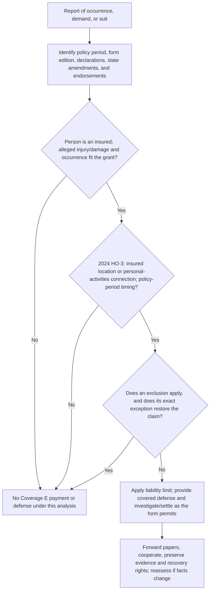

## Scope and controlling contract

Coverage E is **Section II liability coverage**, not first-party property coverage and not no-fault medical-payments coverage. It responds only under the controlling declarations, base form edition, state amendment, and attached endorsements. Confirm those documents before quoting a liability limit, deciding who is an insured, or treating a reported demand as covered. The current Mississippi HO-3 describes the policy as a whole as applying only as stated, limits payment to the applicable limit, and permits changes only by authorized written action. [MS HO-3 2024, AGR](repo://forms/HO/MS/HO-3/2024-03.md#L13-L39)

An endorsement controls only to the extent that it conflicts with the policy and only within its stated subject matter. The Louisiana, North Carolina, and Texas amendatory forms each preserve unmodified policy provisions and say that their terms do not create coverage unless the amendment expressly does so. A state form must therefore be checked for a Section II change; its mere attachment is not a substitute Coverage E grant. [LA HO 01 17, T.0](repo://forms/HO/LA/HO-01-17/2020-09.md#L13-L57) [NC HO 01 32, T.0](repo://forms/HO/NC/HO-01-32/2018-05.md#L13-L57) [TX HO 01 45, T.0](repo://forms/HO/TX/HO-01-45/2022-01.md#L13-L57)

This page describes the forms in this repository—not a universal homeowners policy. In particular, the Mississippi HO-3 **2024-03**, Mississippi HO-3 **2018-09**, and Mississippi HO-6 **2023-02** have materially different wording. Apply the edition issued with the policy and the jurisdictionally applicable amendments.

## The Coverage E promise

Under the Mississippi HO-3 2024-03, Coverage E pays damages for which an insured is legally liable because of bodily injury or property damage caused by an occurrence to which coverage applies. The same form defines an occurrence as an accident, including continuous or repeated exposure to substantially the same general harmful conditions; it defines bodily injury and property damage separately. Legal liability, a covered occurrence, qualifying injury or damage, policy-period timing, the available limit, and no applicable exclusion are distinct requirements—not interchangeable labels. [MS HO-3 2024, E.1 and definitions](repo://forms/HO/MS/HO-3/2024-03.md#L41-L83) [MS HO-3 2024, E.1](repo://forms/HO/MS/HO-3/2024-03.md#L1023-L1029)

The 2024 HO-3's stated territorial connection is also two-part: injury or damage must arise from an occurrence at an **insured location** or from the insured's personal activities, and the damages must be caused during the policy period. Its definition of insured location includes the residence premises and specified qualifying associated, residential, and temporary-residence locations; the definition must be applied rather than equating every owned or visited location with an insured location. [MS HO-3 2024, DEF.4–DEF.6](repo://forms/HO/MS/HO-3/2024-03.md#L53-L64) [MS HO-3 2024, E.5](repo://forms/HO/MS/HO-3/2024-03.md#L1031-L1035)

The older Mississippi HO-3 2018-09 instead frames application in terms of bodily injury or property damage within the coverage territory, arising from conditions existing during the policy period. It defines coverage territory to include locations where an insured is temporarily present when the occurrence arises from personal activities, and separately excludes premises liability other than at an insured location. Do not transpose its territory wording, definitions, or exclusions onto the 2024 form. [MS HO-3 2018, E.1–E.8](repo://forms/HO/MS/HO-3/2018-09.md#L1075-L1092) [MS HO-3 2018, E.21–E.22](repo://forms/HO/MS/HO-3/2018-09.md#L1117-L1119)

The HO-6 is a unit-owner form. Its Coverage E grant calls for legally liable damages because of bodily injury or property damage caused by an occurrence, but requires the injury or damage to arise from a covered loss; its Section II exclusions include premises not an insured location. It should not be used as an HO-3 location or limit template. [MS HO-6 2023, E.1–E.3](repo://forms/HO/MS/HO-6/2023-02.md#L1004-L1010) [MS HO-6 2023, E.20](repo://forms/HO/MS/HO-6/2023-02.md#L1040-L1050)

## Defense: a related but bounded obligation

Where a claim or suit seeks damages covered by the insurance, the 2024 HO-3 provides defense at the insurer's expense and permits investigation and settlement as the insurer considers appropriate. It also pays an insured's reasonable requested investigation/defense expenses and specified bond premiums. The form expressly ends the defense duty once payment for damages exhausts the applicable liability limit and excludes any duty to defend damages not covered by the insurance. Defense is therefore not a separate source of indemnity and does not eliminate the need to analyze the allegations, facts, exclusions, and available limit. [MS HO-3 2024, E.2–E.4](repo://forms/HO/MS/HO-3/2024-03.md#L1025-L1032)

The 2018 HO-3 uses a similar defense structure but expressly adds defense expenses, requested insured expenses, taxed costs, and judgment interest. The HO-6 also offers defense for a suit seeking damages covered under Coverage E, ends that duty when the applicable limit is exhausted by judgments or settlements, and has no duty to defend non-covered damages. The exact defense language is edition-specific. [MS HO-3 2018, E.1–E.2 and E.9–E.10](repo://forms/HO/MS/HO-3/2018-09.md#L1075-L1079) [MS HO-3 2018, E.9–E.10](repo://forms/HO/MS/HO-3/2018-09.md#L1093-L1095) [MS HO-6 2023, E.2–E.3](repo://forms/HO/MS/HO-6/2023-02.md#L1006-L1010)

Coverage applies separately to each insured under the 2024 HO-3, but that separation does **not** increase the liability limit. Determine the liability limit from the declarations and track all indemnity payments against that applicable limit. [MS HO-3 2024, E.6](repo://forms/HO/MS/HO-3/2024-03.md#L1033-L1035)

## Coverage analysis sequence

*Coverage E decision flow based on the 2024 HO-3 grant, defense limit, location/personal-activities requirement, exclusions, and claim duties; another issued form may require a different branch.* [MS HO-3 2024, E.1–E.24](repo://forms/HO/MS/HO-3/2024-03.md#L1023-L1071)

This sequence is a coverage-analysis aid, not a rule that every factual uncertainty defeats coverage. Develop the particular occurrence, parties, alleged liability, location/activity connection, claimed damages, and defenses under the actual policy. Internal intake guidance is useful for preserving evidence, documenting requests and communications, and escalating unresolved coverage or litigation issues, but it does not create an exclusion or make a policy duty an automatic denial. [Claims Guidance — Intake, Investigation, Duties, and Payment Handling](repo://openwiki/claims-guidance/claim-intake-investigation-and-documentation.md#L11-L17) [Claims Guidance — Intake, Investigation, Duties, and Payment Handling](repo://openwiki/claims-guidance/claim-intake-investigation-and-documentation.md#L66-L72)

## Material exclusions and their stated exceptions

The governing form controls. The following is a grouped map of the **2024 Mississippi HO-3** exclusions, not an assertion that every homeowners form uses the same exclusions.

| Issue | 2024 HO-3 treatment | Important stated exception or limit |
| --- | --- | --- |
| Expected or intended injury/damage | Excluded when expected or intended by an insured. | Bodily injury resulting from reasonable force to protect persons or property is excepted. |
| Business and professional services | Injury/damage arising from an insured's business, and from rendering or failing to render professional services, is excluded. | The business exclusion excepts activities ordinarily incident to nonbusiness pursuits. |
| Motor vehicles, aircraft, and watercraft | Ownership, maintenance, use, loading, or unloading is excluded. | The motor-vehicle exclusion excepts a vehicle used solely to service an insured location and not subject to registration; do not assume a broader watercraft exception. |
| Contract and statutory benefits | Contractually assumed liability and obligations imposed by workers compensation, disability benefits, or similar law are excluded. | Contract liability otherwise existing without the contract is excepted. |
| Property in the insured's relationship or control | Owned property and property rented to, occupied by, or used by an insured are excluded, along with property in the insured's care, custody, control, or physical control. | The rented/occupied/used-property wording excepts property damage caused by fire to property rented to an insured; the exact exception is not stated for the separate care/custody/control provision. |
| Intentional loss, controlled substances, disease, and abuse | Intentional loss; controlled-substance activity; communicable disease transmitted by an insured; and abuse, molestation, corporal punishment, or physical/mental cruelty are excluded. | Legitimate medication used under a licensed provider's direction is excepted from the controlled-substance exclusion. |
| War and nuclear hazard | Injury or damage arising from the listed war-related events or nuclear hazard is excluded. | No exception is stated in this provision. |

[MS HO-3 2024, E.7–E.13](repo://forms/HO/MS/HO-3/2024-03.md#L1037-L1049) [MS HO-3 2024, E.14–E.20](repo://forms/HO/MS/HO-3/2024-03.md#L1051-L1063)

The older HO-3 2018-09 places additional Section II exclusions outside the Coverage E grant, including injury to an insured, employee-related injury and benefits, pollution, and premises liability that does not involve an insured location. It also has distinct business/rental, watercraft, motor-vehicle, and property-control wording. A claim that resembles a 2024 HO-3 exception must be tested against the actual 2018 language. [MS HO-3 2018, Section II exclusions](repo://forms/HO/MS/HO-3/2018-09.md#L1197-L1297)

The HO-6 2023-02 has its own extensive Section II exclusion schedule. Among other things, it addresses business and specified short rental, recreational conveyances, pollutants and microbial matter, data/cyber, non-insured-location premises, water/earth movement, animals, punitive damages, and concurrent causation. These are policy exclusions—not underwriting appetite judgments about animals, business activity, or premises hazards. [MS HO-6 2023, Section II exclusions](repo://forms/HO/MS/HO-6/2023-02.md#L1108-L1208)

## Notice, cooperation, and litigation control

For the 2024 HO-3, an insured must promptly notify the insurer of an occurrence that may result in a claim and provide the specified occurrence facts; promptly forward every notice, demand, summons, or legal paper; cooperate in investigation, settlement, or defense; and not make a voluntary payment, assume an obligation, or incur expense without consent. Reasonable expenses to protect persons or property from further injury or damage are the stated exception to the voluntary-payment provision, and the insured must assist with evidence and witnesses. The form also transfers the insured's recovery rights against a responsible party to the insurer to the extent of payment. [MS HO-3 2024, E.21–E.24](repo://forms/HO/MS/HO-3/2024-03.md#L1065-L1071)

These are contractual responsibilities, not a generic conclusion that a late notice or imperfect cooperation automatically defeats coverage. The 2024 form's general agreement says noncompliance may affect coverage where it causes prejudice, while the 2018 HO-3 says a failure of a duty or condition may affect coverage to the extent permitted by law. Apply the actual wording, material facts, amendments, and applicable law before assigning a consequence. [MS HO-3 2024, AGR.6](repo://forms/HO/MS/HO-3/2024-03.md#L23-L29) [MS HO-3 2018, S.2](repo://forms/HO/MS/HO-3/2018-09.md#L913-L925)

For an operational file, preserve the policy package and declarations; occurrence and notice dates; involved people and witnesses; demands and service papers; photographs, recordings, documents, and other evidence; defense assignments and authority decisions; payments and remaining limit; and potential recovery information. These practices implement investigation and recovery preservation; they do not alter the contractual coverage test. [Claims Guidance — Intake, Investigation, Duties, and Payment Handling](repo://openwiki/claims-guidance/claim-intake-investigation-and-documentation.md#L39-L48) [Claims Guidance — Intake, Investigation, Duties, and Payment Handling](repo://openwiki/claims-guidance/claim-intake-investigation-and-documentation.md#L122-L128)

## Endorsements and adjacent coverages

### Additional insured — only when HO 04 41 is attached

HO 04 41 (2011-05) gives the identified additional insured insured status **only** for liability tied to ownership, maintenance, or use of the residence premises, and only for liability otherwise covered. It gives no greater rights than the named insured has, remains subject to policy terms/duties, and does not provide property insurance or unrelated personal-liability coverage. It is an endorsement-specific extension of who may be an insured, not a general expansion of Coverage E. [HO 04 41, W.0](repo://forms/HO/MS/HO-04-41/2011-05.md#L13-L55) [HO 04 41, W.1–W.8](repo://forms/HO/MS/HO-04-41/2011-05.md#L57-L73)

### Fungi endorsement — not a general liability extension

HO 04 81 (2018-09) modifies property insurance for expressly defined, limited fungi loss, preserving other policy terms unless changed. It is not, by its cited grant, a Coverage E personal-liability grant. The underlying liability form and its actual exclusions must be analyzed if a third party alleges bodily injury or property damage associated with fungi. [HO 04 81, W.0](repo://forms/HO/MS/HO-04-81/2018-09.md#L13-L43) [HO 04 81, W.1–W.6](repo://forms/HO/MS/HO-04-81/2018-09.md#L45-L57)

### Coverage F is different

[Coverage F — Medical Payments to Others](/openwiki/coverages/coverage-f/medical-payments-to-others.md) is adjacent Section II coverage but is not Coverage E. For example, the 2024 HO-3 says necessary medical expenses may be paid without regard to an insured's legal liability, whereas Coverage E turns on legal liability for covered damages. Do not use a Coverage F payment to resolve Coverage E liability. [MS HO-3 2024, F.1](repo://forms/HO/MS/HO-3/2024-03.md#L1073-L1079) [MS HO-3 2024, E.1](repo://forms/HO/MS/HO-3/2024-03.md#L1023-L1029)

## Focused file checks

1. Identify the exact insured, declarations limit, policy period, form edition, state amendment, and attached endorsements.
2. Record the occurrence facts, alleged legal liability, bodily injury/property damage, location, personal activity connection, and timing.
3. Test the grant before exclusions, then test each potentially applicable exclusion and its **exact** stated exception.
4. On a demand or suit, preserve and promptly forward all papers; determine whether it seeks covered damages and calendar defense, notice, and response decisions.
5. Keep indemnity-limit tracking separate from the defense analysis, even though limit exhaustion may end the defense duty.
6. Treat additional-insured status and endorsement effects as separate questions of attachment, scope, and conflict—not assumed coverage.
7. Refer to [Claim Intake, Investigation, and Documentation](/openwiki/claims-guidance/claim-intake-investigation-and-documentation.md) for internal workflow, [Louisiana Contract Amendments](/openwiki/state-overlays/louisiana-contract-amendments.md) for the related state overlay, and [Risk Selection, Inspection, and Referral](/openwiki/underwriting-guidance/risk-selection-inspection-and-referral.md) for underwriting guidance; none replaces the applicable liability contract.
