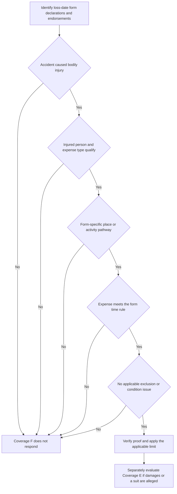

# Coverage F — Medical Payments to Others

## Scope: a no-fault medical-expense grant, not liability coverage

This page compares the reviewed Mississippi HO-3 (2018-09 and 2024-03) and HO-6 (2023-02) forms. It is not a coverage determination. Confirm the loss-date form, Declarations, all attached endorsements, jurisdiction, and the facts before communicating an entitlement or a limit. In the 2018 HO-3, the policy consists of the form, endorsements, and Declarations, and the Declarations identify applicable limits; the reviewed Florida, Louisiana, and North Carolina endorsements each state that an endorsement controls a conflict only within its scope, while unchanged policy terms continue to apply. [HO-3 (2018-09), AGR.1–AGR.2](repo://forms/HO/MS/HO-3/2018-09.md#L15-L18) [Florida HO 01 09 (2023-07), T.0](repo://forms/HO/FL/HO-01-09/2023-07.md#L15-L27) [Louisiana HO 01 17 (2020-09), T.0](repo://forms/HO/LA/HO-01-17/2020-09.md#L15-L31) [North Carolina HO 01 32 (2018-05), T.0](repo://forms/HO/NC/HO-01-32/2018-05.md#L15-L29)

Coverage F pays qualifying necessary medical expenses arising from bodily injury caused by an accident **without regard to an insured's legal liability** in the 2018 and 2024 HO-3 forms and the HO-6 form. That is a no-fault *payment condition*, not a conclusion that every reported injury is payable: the claimant, accident, injury-to-expense connection, time window, location/activity pathway, exclusions, and applicable limit still must qualify under the active form. [HO-3 (2018-09), II.F F.1–F.4](repo://forms/HO/MS/HO-3/2018-09.md#L1141-L1149) [HO-3 (2024-03), II.F F.1–F.3](repo://forms/HO/MS/HO-3/2024-03.md#L1073-L1079) [HO-6 (2023-02), II.F F.1–F.2](repo://forms/HO/MS/HO-6/2023-02.md#L1052-L1056)

*Coverage F fact path: establish its independent medical-payment requirements before calculating a payment, while routing any liability or defense issue to the separate Coverage E analysis.*

## Core requirements and qualifying expense

### Injury, expense, and time

All three reviewed forms require necessary medical expenses because of bodily injury caused by an accident. Each expressly includes necessary and reasonable charges for medical, surgical, dental, ambulance, hospital, professional nursing, prosthetic, and funeral services, though word order differs. [HO-3 (2018-09), II.F F.1–F.4](repo://forms/HO/MS/HO-3/2018-09.md#L1141-L1149) [HO-3 (2024-03), II.F F.1–F.3](repo://forms/HO/MS/HO-3/2024-03.md#L1073-L1079) [HO-6 (2023-02), II.F F.1–F.2](repo://forms/HO/MS/HO-6/2023-02.md#L1052-L1056)

The three-year rule is not identical:

| Form and edition | Exact timing requirement |
| --- | --- |
| **HO-3 (2018-09)** | Expenses must be **incurred** within three years after the accident date and result from the bodily injury caused by that accident. [F.3](repo://forms/HO/MS/HO-3/2018-09.md#L1147-L1147) |
| **HO-3 (2024-03)** | Expenses must be **incurred or medically ascertained** within three years after the accident date, and the bodily injury must arise from the same accident. [F.3](repo://forms/HO/MS/HO-3/2024-03.md#L1079-L1079) |
| **HO-6 (2023-02)** | Necessary medical expenses must be **incurred** within three years after an accident causing bodily injury. [F.1](repo://forms/HO/MS/HO-6/2023-02.md#L1054-L1056) |

Record the accident date, injury chronology, service dates, invoice dates, and any medical determination date. Do not substitute a date of report, treatment completion, or payment for the form's stated trigger.

### Who may qualify and the place/activity pathways

The injured person must be someone other than an insured. The 2018 HO-3 excludes injury to an insured but expressly preserves its residence-employee exception; the 2024 HO-3 and HO-6 exclude the named insured and a regular household resident. The HO-6 separately addresses a residence employee and workers-compensation eligibility. [HO-3 (2018-09), II.F F.2 and F.9](repo://forms/HO/MS/HO-3/2018-09.md#L1145-L1145) [HO-3 (2018-09), II.F F.9](repo://forms/HO/MS/HO-3/2018-09.md#L1159-L1159) [HO-3 (2024-03), II.F F.14–F.16](repo://forms/HO/MS/HO-3/2024-03.md#L1101-L1105) [HO-6 (2023-02), II.F F.8–F.10](repo://forms/HO/MS/HO-6/2023-02.md#L1068-L1072)

The location inquiry is form-specific. It is not enough to label an accident “off premises” or to assume that an insured's involvement supplies every pathway.

| Form and edition | On-location path | Away-from-location paths |
| --- | --- | --- |
| **HO-3 (2018-09)** | Accident on an insured location owned by, rented to, or occupied by an insured. The clause does not state a permission condition for the injured person. [F.5](repo://forms/HO/MS/HO-3/2018-09.md#L1151-L1151) | Bodily injury caused by an insured's activities; by a residence employee in the course of employment related to maintenance or use of the insured location; or by an animal owned by or in an insured's care. [F.6–F.8](repo://forms/HO/MS/HO-3/2018-09.md#L1153-L1157) |
| **HO-3 (2024-03)** | Person is on an insured location **with an insured's permission** and sustains bodily injury there. [F.4](repo://forms/HO/MS/HO-3/2024-03.md#L1081-L1081) | Injury arising from a condition on the insured location or immediately adjoining ways; activities of an insured; a residence employee acting within assigned duties; or an insured-owned/cared-for animal that is not used in business. [F.5–F.8](repo://forms/HO/MS/HO-3/2024-03.md#L1083-L1089) |
| **HO-6 (2023-02)** | Person is on an insured location **with an insured's permission**, is injured there, and is not an insured. [F.3](repo://forms/HO/MS/HO-6/2023-02.md#L1058-L1058) | Injury from an insured-location condition only if the condition was caused by an insured's negligence; or injury from insured activities, an in-scope residence employee, or an insured-owned/cared-for animal. [F.4–F.7](repo://forms/HO/MS/HO-6/2023-02.md#L1060-L1066) |

The HO-6 negligence condition applies to its particular **away-from-location condition** route; it does not rewrite the form's general statement that payment is available without regard to legal liability. Apply the relevant route rather than calling the entire Coverage F analysis either “fault-based” or “no conditions.” [HO-6 (2023-02), II.F F.1 and F.4](repo://forms/HO/MS/HO-6/2023-02.md#L1054-L1054) [HO-6 (2023-02), II.F F.4](repo://forms/HO/MS/HO-6/2023-02.md#L1060-L1060)

## Exclusions: use the active form, not a composite list

The following comparison is a triage aid. It does not replace review of the exact coverage wording and applicable Section II exclusions or endorsements.

| Form and edition | Express Coverage F exclusions/restrictions |
| --- | --- |
| **HO-3 (2018-09)** | Injury to an insured (except residence employee); business; professional services; motor vehicle, watercraft, or aircraft activity; war; intentional acts with expected/intended injury; abuse or molestation. [F.9–F.17](repo://forms/HO/MS/HO-3/2018-09.md#L1159-L1175) |
| **HO-3 (2024-03)** | Injury to the named insured or a regular household resident (except residence employee); workers-compensation/nonoccupational disability/occupational-disease eligibility; non-insured premises (with stated residence-employee exception); motor vehicle, watercraft, aircraft, or hovercraft; business except ordinarily incidental nonbusiness activities; and expected/intended injury, subject to the reasonable-force exception. [F.14–F.20](repo://forms/HO/MS/HO-3/2024-03.md#L1101-L1113) |
| **HO-6 (2023-02)** | Injury to the named insured or regular household resident; an in-course-of-employment residence employee injury unless the employee was away from the insured location; workers-compensation eligibility; business, professional services, nuclear hazard, war, expected/intended injury, criminal act, controlled substance, communicable disease, vehicle/watercraft/aircraft, and abuse. The form also excludes a claim involving related concealment, misrepresentation, or fraud. [F.8–F.26](repo://forms/HO/MS/HO-6/2023-02.md#L1068-L1104) |

A vehicle, animal, employee, business, or off-location fact can be material to both the grant and the exclusions. Develop ownership/care and business-use facts; employee role and scope; the exact conveyance or animal involvement; permission and occupancy; the condition and its location; and whether a statutory-benefit issue exists. Do not import the 2024 HO-3's special reasonable-force or incidental-nonbusiness wording into another edition.

## Limit, proof, payment, and recovery

### Limit: obtain the actual dollar amount from the applicable policy record

The reviewed form text supplies no Coverage F dollar amount. The 2018 HO-3 instead says the applicable limit is the most payable for covered medical expenses arising from an accident. The 2024 HO-3 and HO-6 Coverage F provisions contain no numeric limit statement in the reviewed grant. Therefore, do not quote an assumed per-person or per-accident amount: verify the loss-date Declarations, schedule, and endorsements before calculating the maximum payable. [HO-3 (2018-09), II.F F.24](repo://forms/HO/MS/HO-3/2018-09.md#L1189-L1189) [HO-3 (2024-03), II.F F.1–F.20](repo://forms/HO/MS/HO-3/2024-03.md#L1075-L1113) [HO-6 (2023-02), II.F F.1–F.27](repo://forms/HO/MS/HO-6/2023-02.md#L1054-L1106)

Neither the three-year medical-expense window nor an incurred charge determines the remaining contractual limit. Preserve the limit source and an expense ledger showing provider, service date, amount, reasonableness/necessity support, prior payments, and the balance against the applicable limit.

### Proof and payment mechanics differ

The 2018 HO-3 requires insured cooperation and requested records/authorizations, permits a requested medical examination at the insurer's expense, requires written proof that expenses are necessary and result from the injury, and permits direct payment to the person who incurred them or a service provider. It also preserves recovery rights after payment. [HO-3 (2018-09), II.F F.18–F.27](repo://forms/HO/MS/HO-3/2018-09.md#L1177-L1195)

The 2024 HO-3 requires prompt notice identifying the circumstances and, when known, the injured person; insured cooperation and requested records; and a claimant physical examination and authorization for relevant medical reports and records when reasonably required. It permits payment to the expense-incurring person or provider, and says payment is neither an admission of liability nor a waiver of rights or defenses. [HO-3 (2024-03), II.F F.9–F.13](repo://forms/HO/MS/HO-3/2024-03.md#L1091-L1099)

The HO-6 requires prompt accident notice identifying the injured person and known circumstances, cooperation and requested records, and an insured's examination under oath and authorization for relevant medical records when reasonably requested. Its separate Section II conditions make compliance relevant only when a failure materially prejudices the insurer's investigation, settlement, or defense; this qualifier should not be reduced to an automatic denial rule. [HO-6 (2023-02), II.F F.23–F.26](repo://forms/HO/MS/HO-6/2023-02.md#L1098-L1104) [HO-6 (2023-02), II.S S.1–S.10](repo://forms/HO/MS/HO-6/2023-02.md#L1284-L1304)

For every edition, payment is not a liability admission. Preserve recovery opportunities and do not treat a voluntary payment, a medical bill, an investigation, or a partial payment as an admission of fault. [HO-3 (2018-09), II.F F.22 and F.26–F.27](repo://forms/HO/MS/HO-3/2018-09.md#L1185-L1195) [HO-3 (2024-03), II.F F.9–F.10](repo://forms/HO/MS/HO-3/2024-03.md#L1091-L1093) [HO-6 (2023-02), II.F F.27](repo://forms/HO/MS/HO-6/2023-02.md#L1106-L1106)

## Boundary from Coverage E — Personal Liability

A single accident may require two independent analyses. **Coverage F** asks whether qualifying medical expenses can be paid under its no-fault grant and its specific eligibility, route, timing, and exclusion requirements. **Coverage E** asks whether an insured is legally liable for damages because of bodily injury or property damage caused by an occurrence and, if a covered claim or suit seeks damages, whether a defense is owed. Coverage E—not Coverage F—is the reviewed forms' defense grant; its defense ends when the stated limit is exhausted by judgments or settlements. [HO-3 (2024-03), II.E E.1–E.5](repo://forms/HO/MS/HO-3/2024-03.md#L1023-L1035) [HO-6 (2023-02), II.E E.1–E.3](repo://forms/HO/MS/HO-6/2023-02.md#L1004-L1010) [HO-3 (2018-09), II.E E.1–E.3](repo://forms/HO/MS/HO-3/2018-09.md#L1075-L1081)

Accordingly:

- A liability demand, negligence allegation, or lawsuit does **not** establish Coverage F. Independently test the injury, person, route, expense, three-year rule, exclusions, and F limit.
- A Coverage F payment does **not** establish legal liability, waive a defense, or resolve a Coverage E claim or suit. The 2018 HO-3 and 2024 HO-3 say this directly, and the HO-6 says F payment is not an admission and creates no duty beyond the policy terms. [HO-3 (2018-09), II.F F.22](repo://forms/HO/MS/HO-3/2018-09.md#L1185-L1185) [HO-3 (2024-03), II.F F.10](repo://forms/HO/MS/HO-3/2024-03.md#L1093-L1093) [HO-6 (2023-02), II.F F.27](repo://forms/HO/MS/HO-6/2023-02.md#L1106-L1106)
- Conversely, a failure of Coverage F's person, permission, timing, or medical-expense requirement is not itself a Coverage E decision. Analyze the liability allegation, legal-liability requirement, occurrence, damages, exclusions, notice, and suit/defense obligations under the active E wording.

<!-- openwiki: broken internal link [/openwiki/claims-guidance/claim-intake-investigation-and-documentation] file "/openwiki/claims-guidance/claim-intake-investigation-and-documentation" does not exist. Fix the href or restore the target, then delete this comment. -->
When a report includes a demand, summons, complaint, or other legal paper, preserve it and route the Coverage E defense analysis without waiting for the Coverage F medical-bill review. The 2024 HO-3 and HO-6 require an insured to forward legal papers for a claim or suit under Coverage E. [HO-3 (2024-03), II.E E.21–E.23](repo://forms/HO/MS/HO-3/2024-03.md#L1065-L1069) [HO-6 (2023-02), II.E E.4–E.7](repo://forms/HO/MS/HO-6/2023-02.md#L1012-L1018) See [Claim Intake, Investigation, and Documentation](/openwiki/claims-guidance/claim-intake-investigation-and-documentation) for the file-development framework.

## Focused handling checks

Before a Coverage F decision or payment, confirm:

1. **Controlling contract:** loss-date form edition, Declarations, Coverage F limit, endorsements, and jurisdiction are in the file.
2. **Medical nexus and time:** an accident caused bodily injury; every claimed service is necessary and reasonable; and the applicable edition's three-year timing standard is met.
3. **Person and pathway:** the person is not barred as an insured/household resident, and the facts fit the exact permission, location, condition, activity, employee, or animal route.
4. **Exclusion screen:** employee/statutory-benefit, business/professional, conveyance, intentional/criminal, abuse, and form-specific exclusions are evaluated under the active edition.
5. **Payment controls:** record requested proof, authorizations/examination issues, payee, approved expense ledger, limit calculation, non-admission language, and recovery lead.
6. **Separate E track:** record and forward all demand/suit materials and do not communicate a Coverage F payment as an acceptance of liability or a defense commitment.
