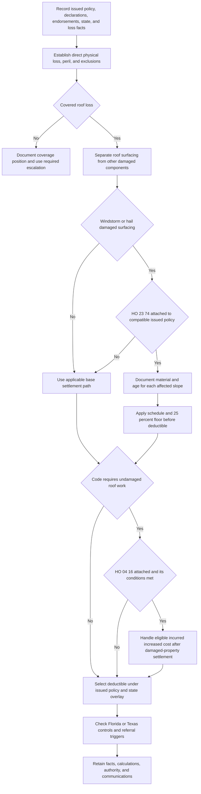

> **Internal claims guidance — not policy authority and not language to quote to an insured or claimant.** This procedure operationalizes the controlling issued policy and applicable state overlay; it does not grant, restrict, or alter coverage. [Roof Claim Handling Guidance, status](repo://guidelines/claims/roof-claim-handling.md#L1-L4)

## Use this procedure after assembling the policy record

Start a roof file with the loss date, reported cause, state, policy written/effective dates, issued base-form edition, Declarations (Coverage A and every deductible), and the actual attached endorsements and their editions. This is a gating control, not a clerical step: HO-3 2011-05 remains controlling for policies written under it, while HO-3 2018-09 applies to policies written on or after 2018-09-01. The former expressly settles dwelling loss, including roof surfacing, at replacement cost and says that no separate roof settlement basis applies; the latter routes windstorm/hail roof-surfacing loss to an ACV schedule **only if** that endorsement is attached. [HO-3 2011-05, applicability and A.3](repo://forms/HO/MS/HO-3/2011-05.md#L1-L7) [A.3](repo://forms/HO/MS/HO-3/2011-05.md#L25-L34) · [HO-3 2018-09, applicability and A.3–A.4](repo://forms/HO/MS/HO-3/2018-09.md#L1-L4) [A.3–A.4](repo://forms/HO/MS/HO-3/2018-09.md#L25-L34)

**Do not assume an endorsement is attached.** HO 23 74 and HO 04 16 are each described as endorsements that attach to HO-3, with different targets: the roof schedule modifies A.4, while ordinance-or-law coverage modifies Exclusion D.1. Neither document makes the other automatic. [HO 23 74, heading](repo://forms/HO/MS/HO-23-74/2018-09.md#L1-L4) · [HO 04 16, heading](repo://forms/HO/MS/HO-04-16/2018-09.md#L1-L4)

For policy-condition and deductible detail, see [Section I Claim Conditions, Payment, and Deductibles](/openwiki/coverage/property/claim-conditions-and-deductibles.md). For the contract analysis behind the roof estimate, see [Roof Settlement](/openwiki/coverage/coverage-a/roof-settlement.md), and use [Ordinance or Law Coverage and Undamaged Roof Portions](/openwiki/coverage/property/ordinance-or-law.md) for the code-cost path.

## Handling sequence

*The internal flow shows the order of decisions: coverage and attachment precede pricing; code-driven undamaged work is separate from damaged-property settlement; deductible and state checks follow the chosen settlement path.* [HO-3 2018-09, A.3–A.4 and D.1](repo://forms/HO/MS/HO-3/2018-09.md#L25-L34) [D.1](repo://forms/HO/MS/HO-3/2018-09.md#L91-L94) · [HO 23 74, R.1–R.6](repo://forms/HO/MS/HO-23-74/2018-09.md#L5-L40) · [HO 04 16, O.1–O.6](repo://forms/HO/MS/HO-04-16/2018-09.md#L5-L37)

### 1. Establish coverage and peril before estimating

**Contractual control.** For HO-3 2018-09 Coverage A/B, begin with direct physical loss and then test exclusions. The form excludes loss caused by wear and tear, deterioration, rust, rot, and other listed conditions affecting roofs or ceilings. A roof condition or contractor scope is therefore not, by itself, a covered-loss determination. [HO-3 2018-09, P.1](repo://forms/HO/MS/HO-3/2018-09.md#L59-L63) · [HO-3 2018-09, C.2](repo://forms/HO/MS/HO-3/2018-09.md#L83-L89)

**Internal claims guidance.** Establish and document the peril before pricing. The guidance identifies the peril—not just the observed damage—as the fact that determines whether the roof schedule can apply. Preserve the inspection observations, weather or other causal evidence, reported date, and reasoning that supports the peril conclusion. This documentation direction is an operating control, not an additional policy condition. [Roof Claim Handling Guidance, K.1](repo://guidelines/claims/roof-claim-handling.md#L7-L11)

### 2. Classify scope, then choose the settlement basis

**Contractual control.** Under HO-3 2018-09 A.3, dwelling loss has a replacement-cost baseline, subject to the stated 80-percent insurance condition, roof-surfacing provisions, and the applicable deductible. A.4 and attached HO 23 74 create a narrower branch: windstorm- or hail-caused **roof surfacing** is ACV under the schedule; surfacing damaged by another covered peril remains replacement cost and the endorsement does not apply. [HO-3 2018-09, definitions and A.3–A.4](repo://forms/HO/MS/HO-3/2018-09.md#L9-L14) [A.3–A.4](repo://forms/HO/MS/HO-3/2018-09.md#L25-L34) · [HO 23 74, R.2](repo://forms/HO/MS/HO-23-74/2018-09.md#L11-L16)

The schedule has a defined boundary. “Roof surfacing” comprises shingles, tiles, shakes, metal panels, membrane, and immediately underlying underlayment and flashing; it excludes deck, trusses, rafters, sheathing, and interior finish. Those non-surfacing components continue under HO-3 A.3. Use separate estimate lines for surfacing and non-surfacing work so a scheduled calculation does not depreciate structural or interior components. The separate-line instruction is internal guidance; the boundary and settlement result are contractual. [HO 23 74, R.1](repo://forms/HO/MS/HO-23-74/2018-09.md#L5-L10) · [Roof Claim Handling Guidance, K.4](repo://guidelines/claims/roof-claim-handling.md#L29-L33)

### 3. For an attached schedule, verify age and material before calculation

**Contractual control.** For attached HO 23 74, use the documented original-installation date or most recent **full** replacement, whichever is later. In the absence of documentation, the endorsement presumes the dwelling's age. A partial repair does not reset age; a full replacement of one slope resets only that slope. Record the documentary source and calculate affected slopes separately when their supported ages differ. [HO 23 74, R.5](repo://forms/HO/MS/HO-23-74/2018-09.md#L31-L35) · [Roof Claim Handling Guidance, K.2](repo://guidelines/claims/roof-claim-handling.md#L13-L19)

Confirm surfacing material from inspection rather than treating the application as the claim-time material finding. This is internal guidance that protects the contractual material-and-age inputs to R.3. [Roof Claim Handling Guidance, K.3](repo://guidelines/claims/roof-claim-handling.md#L21-L27)

| Material under HO 23 74 R.3 | Age bands and payable percentage of surfacing replacement cost |
| --- | --- |
| Composition shingle | Under 5: 100%; 5–9: 80%; 10–14: 60%; 15–19: 40%; 20 or more: 25% |
| Architectural shingle, metal, or tile | Under 10: 100%; 10–19: 80%; 20–29: 60%; 30 or more: 40% |
| Wood shake | Under 5: 100%; 5–9: 70%; 10 or more: 40% |

The R.3 percentage is selected by surfacing material and age **at the date of loss**. R.4 then requires a 25-percent-of-surfacing-replacement-cost minimum payment before the deductible. For an eligible scheduled surfacing amount `RC`, rate `r`, and selected deductible `D`, retain the calculation as `max(RC × r, RC × 25%)`, then apply `D`; this expresses the contractual ordering and does not override any limit, Declarations term, or state overlay. [HO 23 74, R.2–R.4](repo://forms/HO/MS/HO-23-74/2018-09.md#L11-L30)

### 4. Route code-required undamaged work outside the roof schedule

**Contractual control.** HO-3 D.1 excludes increased construction, demolition, or repair cost required by an ordinance or law unless an ordinance-or-law endorsement is attached. Consistently, HO 23 74 R.6 says code-required replacement of undamaged roof surfacing is not payable under the roof schedule and is subject to D.1. An estimate or contractor assertion does not establish this separate coverage path. [HO-3 2018-09, D.1](repo://forms/HO/MS/HO-3/2018-09.md#L91-L94) · [HO 23 74, R.6](repo://forms/HO/MS/HO-23-74/2018-09.md#L37-L41)

**Conditional contractual write-back.** Only if HO 04 16 is attached, O.1 can cover the eligible increased cost where the underlying Section I loss is covered and the ordinance was in force at loss. O.3 specifically includes code-required undamaged roof surfacing. The separate benefit is capped at 10% of Coverage A unless a higher declared percentage applies, is additional insurance, excludes specified pre-existing-compliance and hazardous-material costs, requires timely completion, and applies only after damaged-property settlement and to increased cost actually incurred. Keep the underlying damaged-surfacing settlement and this incremental code cost in different estimate and payment records. [HO 04 16, O.1–O.6](repo://forms/HO/MS/HO-04-16/2018-09.md#L5-L37)

**Internal claims guidance.** Verify the in-force ordinance, isolate the undamaged surfacing and other increment, verify HO 04 16 attachment, and retain the damaged-property settlement, completion evidence, incurred-cost evidence, and any written extension. Refer a claimed code upgrade with no ordinance-or-law endorsement as specified below; the referral does not itself decide coverage. [Roof Claim Handling Guidance, K.5 and K.7](repo://guidelines/claims/roof-claim-handling.md#L35-L49)

### 5. Select one deductible path and apply it at the required point

**Contractual control.** The HO-3 2018-09 default uses the Declarations deductible for each Section I loss, recognizes a state-required separate windstorm/hail deductible, and says that where both apply only the larger is deducted. For scheduled surfacing, HO 23 74 makes the selected deductible follow the R.3/R.4 amount. [HO-3 2018-09, S.5](repo://forms/HO/MS/HO-3/2018-09.md#L101-L112) · [HO 23 74, R.2 and R.4](repo://forms/HO/MS/HO-23-74/2018-09.md#L11-L30)

**Texas contractual and regulatory overlay.** Only for a Texas policy with HO 01 45 attached and applicable does that endorsement supersede conflicting base-form wording. T.1 applies only the windstorm/hail deductible to windstorm/hail loss—not also the all-other-perils deductible—and provides allocation rules for mixed-peril occurrences. Its stated percentage range is 1%–5% of Coverage A, up to 10% in its seacoast territories. Texas Bulletin B-2021-08 independently requires the same no-stacking treatment, governs disclosure and filing, and permits a qualifying flat-dollar alternative; the bulletin is a regulatory control and is not evidence that HO 01 45 was issued on a specific claim. [HO 01 45, conflict rule and T.1/T.6](repo://forms/HO/TX/HO-01-45/2022-01.md#L1-L11) [T.6](repo://forms/HO/TX/HO-01-45/2022-01.md#L29-L31) · [Texas Bulletin B-2021-08, B.2–B.4 and B.7](repo://bulletins/TX/2021-08-windstorm-deductible.md#L9-L25) [B.7](repo://bulletins/TX/2021-08-windstorm-deductible.md#L35-L37)

**Florida regulatory overlay.** For Florida personal residential property policies issued or renewed with an effective date on or after 2023-07-01, OIR-2023-04 does not attach a roof schedule or deductible, but it constrains their use. An ACV roof schedule may not be applied to a roof that was under ten years old at policy effective date; a separate roof deductible or ACV schedule may be offered only alongside a policy without that provision at a filed and approved rate with written premium-difference disclosure. For one loss, a hurricane deductible and separate roof deductible cannot both be applied; deduct only the larger. [Florida OIR-2023-04, applicability and F.4](repo://bulletins/FL/2023-04-roof-age-nonrenewal.md#L1-L3) [F.4](repo://bulletins/FL/2023-04-roof-age-nonrenewal.md#L21-L25) · [F.6](repo://bulletins/FL/2023-04-roof-age-nonrenewal.md#L31-L33)

For state-specific background, see [Florida Roof Requirements](/openwiki/state-overlays/florida.md) and [Texas Windstorm and Hail Requirements](/openwiki/state-overlays/texas.md). State overlay review cannot substitute for the issued Declarations and verified endorsements.

## Time-sensitive conditions and file completion

The applicable policy still controls notice, proof, and payment. HO-3 2018-09 requires prompt notice and protection from further damage; a signed, sworn proof of loss is due within 60 days after the insurer requests it. Its base payment provision is 60 days after receipt of proof of loss and written agreement, appraisal award, or court judgment. [HO-3 2018-09, S.1–S.3](repo://forms/HO/MS/HO-3/2018-09.md#L101-L108)

For an applicable Texas HO 01 45, separately track acknowledgement within 15 days, written approval or denial within 15 business days after all reasonably requested items are received, and payment within five business days after approval notice. Do not recast these endorsement milestones as the base-form payment clause. [HO 01 45, T.5](repo://forms/HO/TX/HO-01-45/2022-01.md#L25-L27)

Before closing or issuing a settlement communication, the file should show: the selected form/endorsements and Declarations; factual peril and coverage analysis; itemized surfacing versus other components; material and age evidence by slope; R.3/R.4 calculation and deductible selection; ordinance evidence and HO 04 16 conditions if claimed; state overlay check; all required policy-condition dates; and any referral decision. This is an internal audit record, not a list of extra insured duties. [Roof Claim Handling Guidance, K.1–K.7](repo://guidelines/claims/roof-claim-handling.md#L7-L49)

## Referral controls — internal claims guidance only

Refer under the roof-claim guidance when any of these triggers is present:

- Roof age is disputed and the resulting payable difference exceeds $10,000.
- The insured has retained a public adjuster or counsel.
- More than one slope age applies.
- A code upgrade is claimed and no ordinance-or-law endorsement is attached.

These are escalation triggers set by Claims Technical Services, not policy conditions, and a referral does not resolve an ambiguous coverage issue or create authority to disregard an issued term. Record the trigger, facts provided, recipient, and resolution in the claim file. [Roof Claim Handling Guidance, K.7](repo://guidelines/claims/roof-claim-handling.md#L47-L49)

### Focused file-review scenarios

1. **Older policy reported today:** select the edition from the issued policy rather than importing the 2018 roof schedule. A 2011-05 A.3 claim has no separate roof settlement basis. [HO-3 2011-05, applicability and A.3](repo://forms/HO/MS/HO-3/2011-05.md#L1-L7) [A.3](repo://forms/HO/MS/HO-3/2011-05.md#L25-L34)
2. **Wind/hail claim with deck damage:** price only the R.1 surfacing under an attached schedule; keep deck, framing, sheathing, and interior work under the applicable dwelling path. [HO 23 74, R.1](repo://forms/HO/MS/HO-23-74/2018-09.md#L5-L10)
3. **One roof, two supported slope ages:** reset only the fully replaced slope; retain source evidence and refer because multiple slope ages apply. [HO 23 74, R.5](repo://forms/HO/MS/HO-23-74/2018-09.md#L31-L35) · [Roof Claim Handling Guidance, K.7](repo://guidelines/claims/roof-claim-handling.md#L47-L49)
4. **Code requires undamaged matching surfacing:** do not add it to the roof-schedule payment. Test the actual HO 04 16 attachment, ordinance at loss, limit, completion, damaged-property settlement, and actual-incurrence conditions. [HO 23 74, R.6](repo://forms/HO/MS/HO-23-74/2018-09.md#L37-L41) · [HO 04 16, O.1–O.6](repo://forms/HO/MS/HO-04-16/2018-09.md#L5-L37)
5. **Texas mixed-peril occurrence:** allocate deductions by attributable damage only when it can be separately determined; otherwise apply the larger single deductible. Verify HO 01 45 attachment and the controlling Declarations before calculating. [HO 01 45, T.1](repo://forms/HO/TX/HO-01-45/2022-01.md#L5-L11)
6. **Florida hurricane/roof-deductible overlap:** do not stack both; apply only the larger and preserve the policy-effective-date roof-age check for any ACV schedule. [Florida OIR-2023-04, F.4 and F.6](repo://bulletins/FL/2023-04-roof-age-nonrenewal.md#L21-L25) [F.6](repo://bulletins/FL/2023-04-roof-age-nonrenewal.md#L31-L33)
