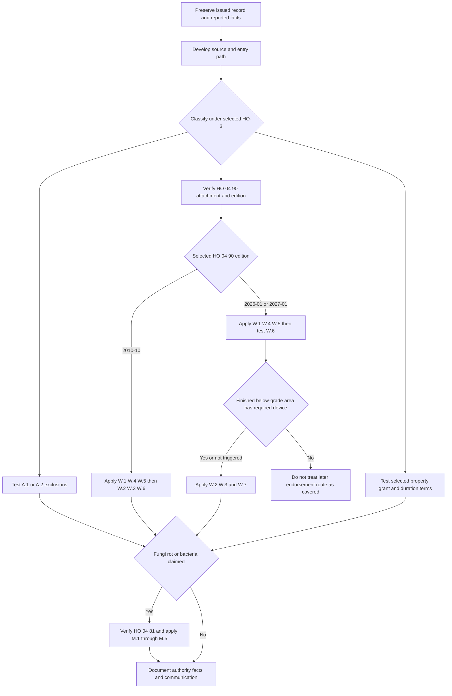

> **Internal claims guidance — not policy language and never language to quote to an insured or claimant.** This page and the underlying water-loss guide direct staff workflow only. They do not grant or restrict coverage, create an insured duty, decide a coverage defense, or supply customer-facing letter wording. Contract conclusions must come from the issued policy, Declarations, and verified attachments. [Guide status](repo://guidelines/claims/water-loss-handling.md#L1-L4)

## Operating boundary and entry record

Keep four decisions separate: (1) source and entry path, (2) onset and duration, (3) issued-policy assembly, and (4) application of the selected contract terms. Source-first investigation is an operational control, not a coverage rule: the guide directs the adjuster to establish and document source before evaluating damage. [Internal source-first direction](repo://guidelines/claims/water-loss-handling.md#L7-L11)

At first notice, preserve the reported cause, loss and notice dates, state, policy-written and effective dates, complete Declarations, applicable limits and deductibles, selected HO-3 edition, and each actual attached endorsement with its edition. For an asserted water-backup route, obtain the issued HO 04 90 and record its edition and selection facts. Do **not** infer attachment or an edition from a remediation invoice, a prior loss, a repository file, or the legacy guide.

The base and endorsement selections are independent. HO-3 2018-09 governs policies written on or after 2018-09-01; its Definition 5 and C.3 duration language do not occur in the supplied 2011-05 exclusions. HO 04 90 has its own prospective sequence: 2010-10 remains in force for policies written under it; 2026-01 replaces 2010-10 from 2026-01-01 and remains in force for policies written under it; and 2027-01 replaces 2026-01 from 2027-01-01. A loss-report date does not reselect either form. [HO-3 editions](repo://forms/HO/MS/HO-3/2011-05.md#L1-L7) · [HO-3 2018-09](repo://forms/HO/MS/HO-3/2018-09.md#L1-L4) · [HO 04 90 2010-10](repo://forms/HO/MS/HO-04-90/2010-10.md#L1-L7) · [HO 04 90 2026-01](repo://forms/HO/MS/HO-04-90/2026-01.md#L1-L8) · [HO 04 90 2027-01](repo://forms/HO/MS/HO-04-90/2027-01.md#L1-L4)

If the issued record cannot establish attachment, edition, or the needed date, leave the affected HO 04 90 coverage and payment issue unresolved while obtaining the issued endorsement and Declarations. Legacy guidance cannot fill that gap or override selected contract terms. See [Governing Form Editions and Policy Assembly](/openwiki/coverage/policy-editions-and-governing-forms.md).

*The internal flow first preserves facts and selects issued forms, then keeps source, the selected HO 04 90 route, and any resulting-fungi analysis separate. It does not make the guide a coverage authority.* [Guide status and source-first direction](repo://guidelines/claims/water-loss-handling.md#L1-L11) · [HO 04 90 later-edition W.6](repo://forms/HO/MS/HO-04-90/2026-01.md#L46-L51) · [HO 04 90 2027-01 W.6](repo://forms/HO/MS/HO-04-90/2027-01.md#L42-L48)

## Fact development: source, property path, and duration

**Internal workflow.** Record the reported source, observed entry path, water and damage locations, inspection photographs, plumbing or drain findings, weather and exterior conditions, service history, invoices, repairs, and statements. Retain the support for and against each plausible source rather than treating labels such as “flooded basement,” “backup,” or “pipe leak” as contractual conclusions. Staining, corrosion, and material degradation are examples of physical duration evidence. [Guide source and duration direction](repo://guidelines/claims/water-loss-handling.md#L7-L11) · [Duration evidence](repo://guidelines/claims/water-loss-handling.md#L35-L41)

The contractual map is as follows:

| Facts to develop | Contract controls to apply after selection | Handling boundary |
| --- | --- | --- |
| Water reached property across land, from flood, surface water, waves, tidal water, storm surge, or overflow of a body of water | A.1 excludes the stated category in both supplied HO-3 forms. Each HO 04 90 W.4 preserves A.1. Only HO-3 2018-09 adds A.4 concurrent/sequential-cause wording. | Water backup is not a general flood or surface-water write-back. |
| Water was below ground, exerted pressure, or seeped or leaked through a structure | A.2 excludes the stated category in both forms, and each HO 04 90 W.4 preserves A.2. | A basement, foundation, or sump alone does not establish either A.2 or a W.1 event. |
| Water or waterborne material backed up through a sewer or drain, or overflowed or discharged from a sump-related device | A.3 excludes this category unless HO 04 90 is attached. In each edition, W.1 provides the limited A/B/C direct-physical-loss route, while W.4 preserves A.1/A.2 and W.5 remains a separate condition. | Verify attachment and select 2010-10, 2026-01, or 2027-01 before applying payment or eligibility terms. |
| Internal-system discharge or an alleged leak | In 2018-09, A/B use P.1's direct-physical-loss grant subject to exclusions, and P.2 names accidental discharge or overflow from within plumbing, heating, or air-conditioning systems for Coverage C. | P.2 does not name household appliances. Do not import 2018 P.1/P.2 into a 2011-05 policy. |

[HO-3 2011-05 A.1-A.3](repo://forms/HO/MS/HO-3/2011-05.md#L59-L66) · [HO-3 2018-09 P.1-P.2 and A.1-A.4](repo://forms/HO/MS/HO-3/2018-09.md#L59-L77) · [HO 04 90 2010-10 W.1 and W.4-W.5](repo://forms/HO/MS/HO-04-90/2010-10.md#L9-L29) · [HO 04 90 2026-01 W.1 and W.4-W.5](repo://forms/HO/MS/HO-04-90/2026-01.md#L10-L44) · [HO 04 90 2027-01 W.1 and W.4-W.5](repo://forms/HO/MS/HO-04-90/2027-01.md#L6-L40)

For HO-3 2018-09, C.3 excludes continuous or repeated seepage or leakage over weeks, months, or years from specified systems or household appliances. Definition 5 requires a sudden-and-accidental event to be abrupt in onset and unintended, and rejects gradually developing or known-unremedied conditions regardless of when effects appear. Develop onset, elapsed duration, knowledge, repairs, and physical indicators separately from discovery date. These are contract provisions—not the guide—and do not appear in the supplied 2011-05 exclusions. [Definition 5](repo://forms/HO/MS/HO-3/2018-09.md#L19-L20) · [C.3](repo://forms/HO/MS/HO-3/2018-09.md#L83-L90) · [2011-05 exclusions](repo://forms/HO/MS/HO-3/2011-05.md#L57-L79)

## HO 04 90: preserve the selected edition and apply its route

A verified HO 04 90 attaches to HO-3 and modifies A.3. In **all three editions**, W.1 covers the stated direct physical loss to Coverage A, B, and C property from sewer/drain backup or sump-related overflow/discharge, including an event resulting from mechanical breakdown. W.4 separately retains the A.1 flood/surface-water and A.2 subsurface-water exclusions. W.5 does not cover loss where the event resulted from an insured's known pre-loss failure to maintain the serving sewer line, drain, sump, or sump pump and a reasonable person would have remedied that failure. Preserve the equipment, asserted maintenance failure, causation, knowledge, and reasonable-remedy facts; do not substitute a generic post-loss mitigation observation for W.5. [2010-10 W.1-W.5](repo://forms/HO/MS/HO-04-90/2010-10.md#L9-L29) · [2026-01 W.1-W.5](repo://forms/HO/MS/HO-04-90/2026-01.md#L10-L44) · [2027-01 W.1-W.5](repo://forms/HO/MS/HO-04-90/2027-01.md#L6-L40)

| Verified selected edition | Contract mechanics to preserve in the calculation |
| --- | --- |
| **2010-10** | W.2 supplies a $5,000 default policy-period sublimit unless its Declarations show more, within—not additional to—A/B/C limits. W.3 supplies a separate $500 deductible instead of the Section I deductible. W.6 supplies the A/B settlement basis and Coverage C actual-cash-value rule unless endorsement Declarations state otherwise. |
| **2026-01** | W.2 supplies a $10,000 default policy-period sublimit and W.3 a separate $1,000 deductible on the same within-limit and replacement-deductible basis. For a residence premises with finished area below grade, W.6 makes coverage conditional on an installed and operable backwater valve or equivalent backflow-prevention device on the serving sewer line at loss. W.7 supplies settlement. |
| **2027-01** | W.2/W.3 retain the $10,000/$1,000 mechanics, W.6 carries forward the same finished-below-grade device condition, and W.7 supplies settlement. |

[2010-10 W.2-W.6](repo://forms/HO/MS/HO-04-90/2010-10.md#L13-L35) · [2026-01 W.2-W.7](repo://forms/HO/MS/HO-04-90/2026-01.md#L17-L60) · [2027-01 W.2-W.7](repo://forms/HO/MS/HO-04-90/2027-01.md#L13-L57)

**Later-edition W.6 evidence gate.** First establish whether there is finished area below grade. Only if there is, preserve device type, location, installation, and at-loss operability evidence for the serving sewer line. Do not apply that condition to 2010-10; its W.6 is the settlement provision. Track the selected edition's policy-period payment total, A/B/C allocation, declared limit, deductible, and settlement basis. [2010-10 W.5-W.6](repo://forms/HO/MS/HO-04-90/2010-10.md#L27-L33) · [2026-01 W.6-W.7](repo://forms/HO/MS/HO-04-90/2026-01.md#L46-L58) · [2027-01 W.6-W.7](repo://forms/HO/MS/HO-04-90/2027-01.md#L42-L55)

## Resulting fungi, wet/dry rot, or bacteria

This is a separate attachment and fact analysis. When compatible HO 04 81 is attached, M.1 writes back C.2 only to the stated extent for fungi, wet/dry rot, or bacteria resulting from a Section I insured peril during the policy period. M.2 requires a covered underlying moisture event and retains the flood/surface-water, subsurface-water, and continuous/repeated-leakage barriers. A backup followed by fungi therefore requires independent HO 04 90 and HO 04 81 attachment determinations. For a later selected HO 04 90, complete any triggered W.6 device analysis before treating the backup as M.2's covered event. [HO 04 81 M.1-M.2](repo://forms/HO/MS/HO-04-81/2018-09.md#L5-L17) · [HO-3 2018-09 C.2-C.3](repo://forms/HO/MS/HO-3/2018-09.md#L83-L90)

M.3's $10,000 default policy-period aggregate is within the A/B/C limits and applies regardless of occurrences, claims, or locations unless Declarations show more. M.4 identifies included removal, necessary access work, post-removal testing, and attributable Coverage D increase; M.5 limits resulting loss to the extent caused by a failure to take reasonable drying, cleaning, or other mitigation measures after actual or constructive knowledge of intrusion. Keep that aggregate and allocation separate from HO 04 90's sublimit, deductible, condition, and settlement record. [HO 04 81 M.3-M.5](repo://forms/HO/MS/HO-04-81/2018-09.md#L19-L31) · [Fungi, Rot, and Bacteria](/openwiki/coverage/property/fungi-rot-and-bacteria.md)

## Referrals, reservation of rights, and state handoff

> **Internal workflow, not a contract determination.** Referral and reservation-of-rights directions manage the file; they do not establish coverage or a defense.

The guide directs technical-specialist referral when physical evidence does not establish source, two or more source categories plausibly apply, a foundation is involved, the insured has a public adjuster or counsel, loss exceeds $25,000, or a denial would rest primarily on duration. Record the trigger, materials supplied, recipient, response, approval/authority result, and how it was used. The separate referral matrix is underwriting authority guidance; do not treat it as claims coverage authority. [Claims referral criteria](repo://guidelines/claims/water-loss-handling.md#L51-L55) · [Referral matrix scope](repo://guidelines/authority/referral-matrix.md#L1-L11)

The guide directs a reservation of rights before investigating where coverage may turn on 2018 duration or HO 04 90 W.5 maintenance. Escalate the draft through the applicable approval process, identify unresolved factual and contractual issues using the selected issued form, and retain approved communication and delivery evidence. Do not present the guidance as a letter template or state a final outcome while material facts remain unresolved. [Guide reservation direction](repo://guidelines/claims/water-loss-handling.md#L57-L59)

For a Texas loss, verify attachment, effective-date scope, and compatibility of HO 01 45 before using T.5. When it applies, record its acknowledgement, requested-item receipt, written-decision, approval, and payment dates alongside—not in place of—2018-09 S.3's proof-of-loss-plus-resolution payment trigger. Do not transpose this relationship to the supplied 2011-05 form, which lacks S.3's payment clause. [HO 01 45 scope and T.5](repo://forms/HO/TX/HO-01-45/2022-01.md#L1-L4) · [T.5](repo://forms/HO/TX/HO-01-45/2022-01.md#L25-L27) · [HO-3 2018-09 S.3](repo://forms/HO/MS/HO-3/2018-09.md#L101-L108) · [HO-3 2011-05 conditions](repo://forms/HO/MS/HO-3/2011-05.md#L83-L92)

## Completion record and focused review tests

Before a coverage-position or payment communication, the file should allow a reviewer to reproduce the contract analysis from the issued record and developed facts. Retain:

- selected HO-3 edition, complete Declarations, verified attachments and editions, and HO 04 90 selection facts;
- source/entry-path, onset/duration, maintenance, repair, mitigation, and competing-cause evidence;
- selected policy provisions, referral/reservation records, and any in-scope state-overlay timing record;
- selected-edition A/B/C allocation, prior policy-period payments, limit, deductible, settlement calculation, and later-edition W.6 evidence when triggered; and
- final communication, authority, payment, and unresolved-issue record.

Use these focused tests:

1. **Rain near a basement sump:** develop surface, subsurface, and W.1 paths independently. A location or the word “flood” does not decide source.
2. **Sump pump mechanically fails:** verify attachment and select the HO 04 90 edition. Test W.1, W.4, and W.5; apply 2010-10 W.2/W.3/W.6 or the selected later edition's W.6 gate and W.2/W.3/W.7.
3. **Slow leak behind a wall:** on 2018-09, develop Definition 5 and C.3 facts; do not import them into 2011-05.
4. **Prior drain complaint:** develop W.5's causation, knowledge, and reasonable-remedy facts rather than assuming a maintenance result.
5. **Backup followed by mold:** verify both endorsements, resolve the selected backup route first, then apply M.2 and separately account for M.3-M.5.
6. **Texas water loss:** only for an attached, in-scope, compatible HO 01 45, track T.5 dates separately from the selected base form and water-loss analysis.

For contract analysis beyond this operational page, use [Water Damage Exclusions and Water Backup Write-Back](/openwiki/coverage/property/water-damage-and-backup.md), [Section I Claim Conditions, Payment, and Deductibles](/openwiki/coverage/property/claim-conditions-and-deductibles.md), and [Governing Form Editions and Policy Assembly](/openwiki/coverage/policy-editions-and-governing-forms.md).
