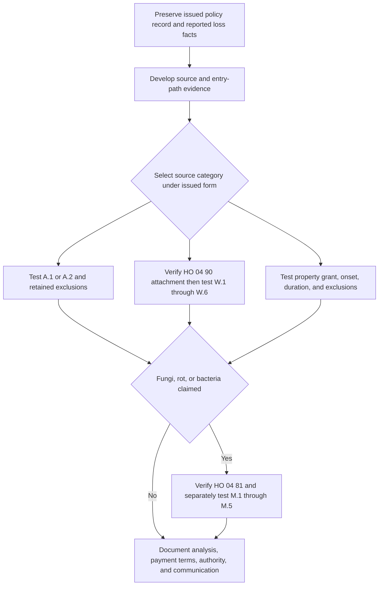

> **Internal claims guidance — not contract language and not language to quote to an insured or claimant.** This page operationalizes the issued policy record. It neither grants nor restricts coverage, creates an insured duty, nor supplies coverage-letter wording. The underlying water-loss guide has the same status. [Water Loss Claim Handling Guidance, status](repo://guidelines/claims/water-loss-handling.md#L1-L4)

## Operating objective: separate the decisions

A reported “water loss” is not one coverage decision. Maintain separate, supported findings for:

1. **source and entry path** — where the water or waterborne material originated and how it reached the damaged property;
2. **onset and duration** — whether a condition developed gradually or involved an abrupt, unintended event under the selected form;
3. **issued contract and attachment** — the controlling HO-3 edition, Declarations, and actual endorsements;
4. **endorsement-specific conditions and payment terms** — particularly water-backup maintenance, sublimit, deductible, and settlement rules; and
5. **resulting fungi, wet/dry rot, or bacteria** — a separate, limited write-back with its own attachment, causal trigger, mitigation condition, and aggregate.

This separation matters because damage observed in the same room can follow different contractual paths. The internal guide directs adjusters to determine and document the water source before evaluating the damage; it is an investigation sequence, not a rule that an insured's initial description decides the result. [Internal source-first direction](repo://guidelines/claims/water-loss-handling.md#L7-L11) The applicable policy language remains the control for each path: in HO-3 2018-09, Coverage A/B starts with direct physical loss subject to exclusions, while Coverage C has the additional P.2 named-peril gate. [HO-3 2018-09, P.1–P.2](repo://forms/HO/MS/HO-3/2018-09.md#L59-L64)

## Entry control: assemble the issued policy before testing facts

**Internal claims guidance — not contract language and not language to quote to an insured or claimant.** At first notice, preserve the loss date and reported cause, policy written and effective dates, state, full Declarations, all Section I limits and deductibles, selected HO-3 edition, and the actual attached endorsements and editions. Do not infer attachment from a remediation invoice, a prior claim, an underwriting practice, or the presence of a form in the repository.

The issued edition is a gating fact. HO-3 2018-09 applies to policies written on or after 2018-09-01 and supersedes 2011-05; the supplied 2011-05 form remains the relevant wording for a policy issued on that form. In particular, 2018-09 contains Definition 5 and C.3’s continuous/repeated leakage wording, while the supplied 2011-05 exclusions do not contain those provisions. Do not import the newer duration test into an older issued policy without controlling policy support. [HO-3 2018-09, applicability](repo://forms/HO/MS/HO-3/2018-09.md#L1-L4) · [HO-3 2018-09, Definition 5 and C.3](repo://forms/HO/MS/HO-3/2018-09.md#L19-L20) [HO-3 2018-09, C.3](repo://forms/HO/MS/HO-3/2018-09.md#L83-L90) · [HO-3 2011-05, applicability and exclusions](repo://forms/HO/MS/HO-3/2011-05.md#L1-L7) [HO-3 2011-05, exclusions](repo://forms/HO/MS/HO-3/2011-05.md#L57-L79)

<!-- openwiki: broken internal link [/openwiki/coverage/property/claim-conditions-and-deductibles] file "/openwiki/coverage/property/claim-conditions-and-deductibles" does not exist. Fix the href or restore the target, then delete this comment. -->
The first file record should also log prompt notice, protection/mitigation measures, damaged-personal-property inventory where the selected form requires it, any proof-of-loss request, and the delivery date. These facts preserve the selected form's Section I conditions; they do not turn this checklist into additional insured obligations. For 2018-09, S.1 requires prompt notice and protection from further damage and calls for an inventory; S.2 makes the 60-day sworn-proof period run after the insurer requests it. [HO-3 2018-09, S.1–S.2](repo://forms/HO/MS/HO-3/2018-09.md#L101-L106) See [Section I Claim Conditions, Payment, and Deductibles](/openwiki/coverage/property/claim-conditions-and-deductibles) for the edition-specific condition and deductible analysis.

### Internal fact-development flow

*The internal flow separates source classification from endorsement verification and keeps resulting fungi as a later, independent coverage path; the selected issued form and endorsements govern every branch.* [Internal source-first direction](repo://guidelines/claims/water-loss-handling.md#L7-L11) · [HO-3 2018-09, A.1–A.4 and C.3](repo://forms/HO/MS/HO-3/2018-09.md#L69-L77) [HO-3 2018-09, C.3](repo://forms/HO/MS/HO-3/2018-09.md#L83-L90) · [HO 04 90, W.1–W.6](repo://forms/HO/MS/HO-04-90/2010-10.md#L5-L31) · [HO 04 81, M.1–M.5](repo://forms/HO/MS/HO-04-81/2018-09.md#L5-L31)

## Develop the source finding before estimating scope

**Internal claims guidance — not contract language and not language to quote to an insured or claimant.** Record the reported source, the observed entry path, the location of water and damage, inspection photographs, plumbing or drain findings, weather or exterior conditions where relevant, and the basis for selecting or not selecting each plausible source. The guide specifically identifies physical duration evidence such as staining patterns, corrosion, and material degradation. A label such as “flooded basement,” “backup,” or “pipe leak” is a report of facts to investigate, not a contractual conclusion. [Internal investigation direction](repo://guidelines/claims/water-loss-handling.md#L7-L11) · [Internal duration-evidence direction](repo://guidelines/claims/water-loss-handling.md#L35-L41)

Use the following contract map only after selecting the issued form and confirming the facts.

| Fact path to develop | Governing contract dependency | File question and boundary |
| --- | --- | --- |
| Water reached the property across land, from flood, surface water, waves, tidal water, storm surge, or overflow of a body of water | HO-3 2018-09 A.1 excludes the stated water sources, and A.4 applies A.1–A.3 regardless of another contributing cause or event concurrently or in sequence. HO 04 90 W.4 expressly retains A.1. | Establish the source and path, including whether water reached the property across the ground. Do not treat a water-backup endorsement as a general flood or surface-water write-back. |
| Water was below the surface of the ground, exerted pressure, or seeped/leaked through a building, foundation, pool, or other structure | HO-3 2018-09 A.2 excludes the stated subsurface-water category; A.4 supplies the concurrent/sequential-cause wording. HO 04 90 W.4 expressly retains A.2. | Establish the entry path. Water found below grade, a foundation, or a sump's presence does not by itself establish either A.2 or a W.1 sump event. |
| Water or waterborne material backed up through a sewer or drain, or overflowed/discharged from a sump, sump pump, or related equipment | HO-3 2018-09 A.3 excludes this category unless HO 04 90 is attached; the attached endorsement's W.1 is the limited A/B/C coverage route. | Verify the actual HO 04 90 attachment, then retain separate findings for W.1 event scope, W.4 retained exclusions, W.5 maintenance, and W.2/W.3/W.6 payment terms. |
| An internal-system discharge, or a condition alleged to be a leak | For 2018-09, P.2 lists accidental discharge or overflow from within plumbing, heating, or air-conditioning systems as a Coverage C peril; C.3 separately addresses continuous/repeated leakage from specified systems or household appliances. A/B use P.1's direct-physical-loss grant subject to exclusions. | Identify the system or equipment, the property coverage, the onset, and duration. Do not treat the discovery date, a contractor's label, or damage alone as proof of a P.2 peril or of a sudden-and-accidental event. |

The table's water-exclusion and backup dependencies come from the issued base form and endorsement, not the internal guide. [HO-3 2018-09, P.1–P.2](repo://forms/HO/MS/HO-3/2018-09.md#L59-L64) · [HO-3 2018-09, A.1–A.4](repo://forms/HO/MS/HO-3/2018-09.md#L69-L77) · [HO-3 2018-09, C.3](repo://forms/HO/MS/HO-3/2018-09.md#L83-L90) · [HO 04 90, W.1 and W.4](repo://forms/HO/MS/HO-04-90/2010-10.md#L5-L8) [HO 04 90, W.4](repo://forms/HO/MS/HO-04-90/2010-10.md#L17-L21)

### Duration is a distinct finding

For HO-3 2018-09, C.3 excludes continuous or repeated seepage or leakage of water or steam over weeks, months, or years from within a plumbing, heating, or air-conditioning system or a household appliance. Its proviso preserves loss that is sudden and accidental as Definition 5 defines it. Definition 5 requires an event both abrupt in onset and unintended from the insured's standpoint and says a gradually developing condition, or one known and not remedied, is not sudden and accidental merely because its effects appeared later. Thus onset, elapsed duration, awareness, repairs, and physical indicators are distinct facts to document under this edition; they are not resolved solely by when the damage was found. [HO-3 2018-09, Definition 5](repo://forms/HO/MS/HO-3/2018-09.md#L19-L20) · [HO-3 2018-09, C.3](repo://forms/HO/MS/HO-3/2018-09.md#L83-L90)

**Internal claims guidance — not contract language and not language to quote to an insured or claimant.** When duration may affect the coverage analysis, preserve the factual basis for the finding—inspection observations, photographs, material condition, service history, invoices, repair records, and statements—rather than recording an unsupported conclusion. The guide calls for technical referral where a denial would rest primarily on duration. [Internal duration and referral direction](repo://guidelines/claims/water-loss-handling.md#L35-L41) · [Internal referral criteria](repo://guidelines/claims/water-loss-handling.md#L51-L55)

## Attached HO 04 90: handle water backup as a limited route

HO 04 90 is not presumed. If the endorsement is attached, W.1 covers direct physical loss to Coverage A, B, and C property from water or waterborne material that backs up through sewers or drains, or overflows or is discharged from a sump, sump pump, or related equipment, including an event resulting from mechanical breakdown of that equipment. W.4 nevertheless preserves the A.1 flood/surface-water category and the A.2 subsurface-water category. Attachment therefore does not resolve source, retained exclusions, property scope, or every other policy condition. [HO-3 2018-09, A.1–A.4](repo://forms/HO/MS/HO-3/2018-09.md#L69-L77) · [HO 04 90, W.1](repo://forms/HO/MS/HO-04-90/2010-10.md#L5-L8) · [HO 04 90, W.4](repo://forms/HO/MS/HO-04-90/2010-10.md#L17-L21)

### Maintain separate W.5 maintenance findings

W.5's stated consequence applies if the backup, overflow, or discharge resulted from an insured's failure to maintain a sewer line, drain, sump, or sump pump serving the residence premises, when the failure was known before loss and a reasonable person would have remedied it. Document each component: the relevant equipment or line; the asserted maintenance failure; the causal connection to the event; pre-loss knowledge; and the reasonable-person/remedy facts. This is different from the HO-3 C.1 neglect exclusion, which addresses reasonable means to save and preserve property at and after a loss. Do not substitute a generic post-loss mitigation observation for W.5's specific pre-loss condition. [HO 04 90, W.5](repo://forms/HO/MS/HO-04-90/2010-10.md#L23-L25) · [HO-3 2018-09, C.1](repo://forms/HO/MS/HO-3/2018-09.md#L83-L87)

### Payment record invariants

For a verified W.1 loss, W.2 sets a $5,000 policy-period maximum for all loss under the endorsement unless the Declarations show a higher amount; it is part of, not additional to, the A/B/C limits. W.3 provides a separate $500 deductible for each endorsement loss and states that the ordinary Section I deductible does not apply. W.6 uses the attached policy's basis for Coverage A/B and requires Coverage C actual-cash-value settlement regardless of a replacement-cost personal-property endorsement, unless the Declarations state otherwise for HO 04 90. Keep a policy-period payment total and a distinct calculation record rather than treating the endorsement as an extra layer or stacking deductibles. [HO 04 90, W.2–W.3](repo://forms/HO/MS/HO-04-90/2010-10.md#L9-L15) · [HO 04 90, W.6](repo://forms/HO/MS/HO-04-90/2010-10.md#L27-L31)

**Internal claims guidance — not contract language and not language to quote to an insured or claimant.** Preserve the verified attachment, Declarations limit, source evidence, maintenance evidence, payment history for the policy period, A/B/C allocation, settlement-basis analysis, and selected deductible. The guide's instruction to investigate and document a prior service report is an investigative example, not a coverage conclusion on its own. [Internal water-backup guidance](repo://guidelines/claims/water-loss-handling.md#L25-L33)

<!-- openwiki: broken internal link [/openwiki/coverage/property/water-damage-and-backup] file "/openwiki/coverage/property/water-damage-and-backup" does not exist. Fix the href or restore the target, then delete this comment. -->
For the detailed contract reference, see [Water Damage Exclusions and Water Backup Write-Back](/openwiki/coverage/property/water-damage-and-backup).

## Resulting fungi, wet/dry rot, or bacteria is a separate analysis

HO-3 2018-09 C.2 excludes loss caused by mold, wet/dry rot, or deterioration. Only if **HO 04 81 is attached** does M.1 provide limited direct-physical-loss coverage for covered A/B/C property caused by fungi, wet/dry rot, or bacteria, and only where the condition results from a Section I insured peril during the policy period. M.1 displaces C.2 only to that extent; all other policy provisions remain applicable. [HO-3 2018-09, C.2](repo://forms/HO/MS/HO-3/2018-09.md#L83-L89) · [HO 04 81, M.1](repo://forms/HO/MS/HO-04-81/2018-09.md#L5-L10) [HO 04 81, all-other-provisions clause](repo://forms/HO/MS/HO-04-81/2018-09.md#L33-L37)

For moisture-related fungi, M.2 requires that the water or moisture came from an event itself covered. It gives sudden-and-accidental plumbing discharge and water backup covered by an attached water-backup endorsement as examples. Accordingly, a backup followed by fungi requires two independent attachment and coverage determinations: HO 04 90 for the backup route and HO 04 81 for the fungi route. Neither attachment rewrites the A.1/A.2 water exclusions, and M.1/M.2 do not themselves eliminate the 2018 C.3 duration issue. [HO 04 81, M.1–M.2](repo://forms/HO/MS/HO-04-81/2018-09.md#L5-L17) · [HO-3 2018-09, A.1–A.4 and C.2–C.3](repo://forms/HO/MS/HO-3/2018-09.md#L69-L77) [HO-3 2018-09, C.2–C.3](repo://forms/HO/MS/HO-3/2018-09.md#L83-L90) · [HO 04 90, W.1 and W.4](repo://forms/HO/MS/HO-04-90/2010-10.md#L5-L8) [HO 04 90, W.4](repo://forms/HO/MS/HO-04-90/2010-10.md#L17-L21)

M.3 is a $10,000 aggregate for all endorsement loss in one policy period unless the Declarations show a higher limit, regardless of occurrences, claims, or locations; it is part of and not additional to the applicable A/B/C limits. M.4 includes removal, necessary access tear-out/replacement, post-removal testing, and attributable Coverage D loss-of-use increase within that aggregate. M.5 separately limits loss to the extent it resulted from failure to take reasonable drying, cleaning, or other mitigation measures after the insured knew or reasonably should have known of water intrusion. Track the M.3 policy-period total, M.4 cost categories, knowledge/mitigation evidence, and the allocation of any M.5 issue independently from the water-backup sublimit and W.5 maintenance analysis. [HO 04 81, M.3–M.5](repo://forms/HO/MS/HO-04-81/2018-09.md#L19-L31) · [HO 04 90, W.2–W.5](repo://forms/HO/MS/HO-04-90/2010-10.md#L9-L25)

<!-- openwiki: broken internal link [/openwiki/coverage/property/fungi-rot-and-bacteria] file "/openwiki/coverage/property/fungi-rot-and-bacteria" does not exist. Fix the href or restore the target, then delete this comment. -->
**Internal claims guidance — not contract language and not language to quote to an insured or claimant.** Verify the covered underlying event before evaluating resulting fungi and check prior fungi payments in the same policy period. Those handling controls do not make a water source covered or decide the application of the issued language. [Internal resulting-fungi guidance](repo://guidelines/claims/water-loss-handling.md#L43-L49) For more detail, see [Fungi, Rot, and Bacteria](/openwiki/coverage/property/fungi-rot-and-bacteria).

## Escalation and reservation of rights

> **Internal claims guidance — not contract language and not language to quote to an insured or claimant.** Referral and reservation-of-rights directions below are file-management controls. They do not establish a coverage defense, alter a policy condition, or provide language for an insured communication.

### Refer before the factual or contractual issue is collapsed

The internal guide directs referral to a technical claims specialist when any of the following is present:

- physical evidence does not establish the water source;
- two or more source categories are plausibly implicated;
- the claim involves a foundation;
- the insured has retained a public adjuster or counsel;
- loss exceeds $25,000; or
- a denial would rest primarily on the duration finding.

Record the trigger, the competing facts or issue, materials supplied, referral recipient, response, authority decision, and how that response was used. Referral does not decide whether coverage exists. [Internal referral criteria](repo://guidelines/claims/water-loss-handling.md#L51-L55) The governing contract issues that commonly require this escalation include the selected form's A.1–A.3 source exclusions, 2018 A.4 concurrent/sequential-cause wording, C.3 duration rule, and an attached HO 04 90 W.5 maintenance condition. [HO-3 2018-09, A.1–A.4 and C.3](repo://forms/HO/MS/HO-3/2018-09.md#L69-L77) [HO-3 2018-09, C.3](repo://forms/HO/MS/HO-3/2018-09.md#L83-L90) · [HO 04 90, W.5](repo://forms/HO/MS/HO-04-90/2010-10.md#L23-L25)

### Reservation-of-rights checkpoint

The internal guide directs issuance of a reservation of rights **before investigation** where coverage may turn on 2018 duration or HO 04 90 W.5 maintenance. Escalate the draft through the applicable internal approval process, identify the unresolved factual and contractual issues from the selected issued policy, and retain the approved communication and delivery evidence in the file. Do not use this procedure as a template for letter language or state a final coverage conclusion while material investigation remains unresolved. [Internal reservation direction](repo://guidelines/claims/water-loss-handling.md#L57-L59) · [HO-3 2018-09, Definition 5 and C.3](repo://forms/HO/MS/HO-3/2018-09.md#L19-L20) [HO-3 2018-09, C.3](repo://forms/HO/MS/HO-3/2018-09.md#L83-L90) · [HO 04 90, W.5](repo://forms/HO/MS/HO-04-90/2010-10.md#L23-L25)

## Completion record and focused file-review tests

**Internal claims guidance — not contract language and not language to quote to an insured or claimant.** Before a coverage-position or payment communication, the file should permit a reviewer to reproduce the result from the issued contract and facts. Retain at least:

- selected HO-3 edition, complete Declarations, and verified attachments/editions;
- loss and notice chronology, source and entry-path evidence, photos, inspection findings, and causation reasoning;
- onset/duration, knowledge, repair, maintenance, and mitigation evidence, including unresolved alternatives;
- source-specific policy sections and endorsement terms considered, plus referral and reservation records when triggered;
- property and cost allocation by A/B/C, payment history against each policy-period aggregate or sublimit, and deductible/settlement calculations; and
- the final communication, authority, payment, and evidence supporting the resolved or remaining issues.

The guide directs documentation of source and duration evidence and supplies the stated referral and reservation triggers; this file-review list is an internal control, not an additional policy condition. [Internal source and duration documentation](repo://guidelines/claims/water-loss-handling.md#L7-L11) [Internal duration documentation](repo://guidelines/claims/water-loss-handling.md#L35-L41) · [Internal referral and reservation controls](repo://guidelines/claims/water-loss-handling.md#L51-L59)

Use these focused tests to identify common analysis failures:

1. **Water enters a basement near a sump after heavy rain.** Develop whether the entry path is across ground, below ground, or a W.1 sump event; do not decide from the location of damage or the insured's use of “flood.” Apply the selected form's A.1/A.2 terms and W.4 retained exclusions before any attached W.1 write-back. [HO-3 2018-09, A.1–A.4](repo://forms/HO/MS/HO-3/2018-09.md#L69-L77) · [HO 04 90, W.1 and W.4](repo://forms/HO/MS/HO-04-90/2010-10.md#L5-L8) [HO 04 90, W.4](repo://forms/HO/MS/HO-04-90/2010-10.md#L17-L21)
2. **A sump pump mechanically fails and water overflows.** Verify HO 04 90 attachment, then test W.1's express mechanical-breakdown language, W.4, W.5, the W.2 policy-period sublimit, W.3 separate deductible, and W.6 settlement path. [HO 04 90, W.1–W.6](repo://forms/HO/MS/HO-04-90/2010-10.md#L5-L31)
3. **A slow leak is discovered behind a wall.** On 2018-09, develop the onset and duration evidence under Definition 5 and C.3 and follow the internal referral/reservation direction if the disputed duration could control. Do not assume the same provisions govern a supplied 2011-05 policy. [HO-3 2018-09, Definition 5 and C.3](repo://forms/HO/MS/HO-3/2018-09.md#L19-L20) [HO-3 2018-09, C.3](repo://forms/HO/MS/HO-3/2018-09.md#L83-L90) · [HO-3 2011-05, exclusions](repo://forms/HO/MS/HO-3/2011-05.md#L57-L79) · [Internal reservation direction](repo://guidelines/claims/water-loss-handling.md#L57-L59)
4. **A prior drain complaint predates a backup.** Do not equate the prior complaint with a W.5 result. Develop the maintenance failure, causation, knowledge, and reasonable-remedy elements and follow the internal reservation/referral controls where applicable. [HO 04 90, W.5](repo://forms/HO/MS/HO-04-90/2010-10.md#L23-L25) · [Internal referral and reservation controls](repo://guidelines/claims/water-loss-handling.md#L51-L59)
5. **A backup is followed by mold and remediation costs.** Do not merge the water-backup and fungi analyses. Verify both HO 04 90 and HO 04 81, then separately maintain W.2/W.3 and M.3/M.4/M.5 records. [HO 04 90, W.2–W.3](repo://forms/HO/MS/HO-04-90/2010-10.md#L9-L15) · [HO 04 81, M.1–M.5](repo://forms/HO/MS/HO-04-81/2018-09.md#L5-L31)
