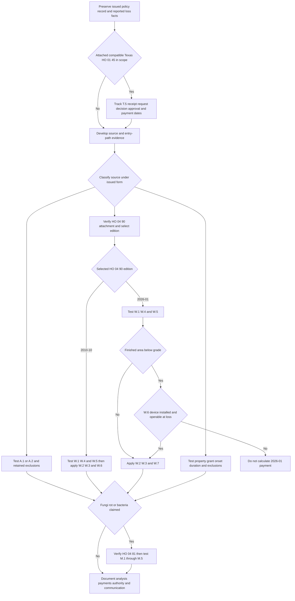

> **Internal claims guidance — not policy authority and not language to quote to an insured or claimant.** This page operationalizes the issued policy record; it neither grants nor restricts coverage, creates an insured duty, nor supplies coverage-letter wording. The underlying water-loss guide has the same status. [Water Loss Claim Handling Guidance, status](repo://guidelines/claims/water-loss-handling.md#L1-L4)

## Operating objective: keep separate decisions separate

A reported water loss is not one coverage decision. Maintain supported, independently reviewable findings for:

1. **source and entry path** — where water or waterborne material originated and how it reached the property;
2. **onset and duration** — whether the relevant condition was gradual or involved an abrupt, unintended event under the selected form;
3. **issued contract and attachment** — the governing HO-3 edition, Declarations, and actual attached endorsements;
4. **endorsement-specific terms** — including water-backup maintenance, sublimit, deductible, and settlement provisions; and
5. **resulting fungi, wet/dry rot, or bacteria** — a separate write-back with its own attachment, trigger, mitigation condition, and aggregate.

This separation is an internal investigation sequence, not a rule that an insured’s initial description decides the outcome. The guide directs the adjuster to establish and document source before evaluating damage. Coverage remains governed by the selected issued form: in HO-3 2018-09, Coverage A/B begins with direct physical loss subject to exclusions, while Coverage C also has the P.2 named-peril gate. [Internal source-first direction](repo://guidelines/claims/water-loss-handling.md#L7-L11) · [HO-3 2018-09, P.1–P.2](repo://forms/HO/MS/HO-3/2018-09.md#L59-L64)

## Entry control: assemble the issued policy before testing facts

**Internal claims guidance — not contract language.** At first notice, preserve the loss date and reported cause; policy-written and effective dates; state; complete Declarations; Section I limits and deductibles; selected HO-3 edition; and actual attached endorsements **with their editions**. For an asserted HO 04 90, record the verified attached edition—2010-10 or 2026-01—and the written-date facts needed to select it. Do not infer attachment or an edition from a remediation invoice, a prior claim, underwriting practice, or a form’s presence in the repository. HO 04 90 2010-10 remains governing for policies written under it regardless of reporting date, while 2026-01 replaces it for policies written on or after 2026-01-01. [HO 04 90 2010-10, status and continuing force](repo://forms/HO/MS/HO-04-90/2010-10.md#L1-L7) · [HO 04 90 2026-01, replacement rule](repo://forms/HO/MS/HO-04-90/2026-01.md#L1-L4)

The issued edition is a gating fact. HO-3 2018-09 applies to policies written on or after 2018-09-01 and supersedes 2011-05; a policy issued under the supplied 2011-05 form remains governed by that edition. Definition 5 and C.3’s continuous/repeated-leakage wording appear in 2018-09, not in the supplied 2011-05 exclusions. Do not import the newer duration rule into an older issued policy without controlling policy support. [HO-3 2018-09, applicability, Definition 5, and C.3](repo://forms/HO/MS/HO-3/2018-09.md#L1-L4) [Definition 5](repo://forms/HO/MS/HO-3/2018-09.md#L19-L20) [C.3](repo://forms/HO/MS/HO-3/2018-09.md#L83-L90) · [HO-3 2011-05, applicability and exclusions](repo://forms/HO/MS/HO-3/2011-05.md#L1-L7) [exclusions](repo://forms/HO/MS/HO-3/2011-05.md#L57-L79)

The first file record should also log notice, protection/mitigation measures, the damaged-personal-property inventory where the selected form requires it, any proof-of-loss request, and delivery date. This preserves the policy-condition record; it does **not** turn an internal checklist into additional insured obligations. Under 2018-09, S.1 requires prompt notice, property protection, and an inventory, while S.2 makes the 60-day sworn-proof period run after the insurer requests it. See [Section I Claim Conditions, Payment, and Deductibles](/openwiki/coverage/property/claim-conditions-and-deductibles.md) for the edition-specific policy analysis. [HO-3 2018-09, S.1–S.2](repo://forms/HO/MS/HO-3/2018-09.md#L101-L106)

### Internal fact-development flow

*The internal flow records an in-scope attached Texas amendment at intake, then separates source classification, attachment and HO 04 90 edition selection, and resulting fungi. The 2026-01 branch tests W.6 only if the premises has finished area below grade, and requires installed-and-operable-at-loss device evidence before its payment terms are calculated; the 2010-10 branch retains its distinct W.6 settlement term. T.5 dates are tracked only for an attached, compatible HO 01 45 and remain distinct from the selected base form’s payment trigger.* [Internal source-first direction](repo://guidelines/claims/water-loss-handling.md#L7-L11) · [HO-3 2018-09, A.1–A.4, C.3, and S.3](repo://forms/HO/MS/HO-3/2018-09.md#L69-L77) [C.3](repo://forms/HO/MS/HO-3/2018-09.md#L83-L90) [S.3](repo://forms/HO/MS/HO-3/2018-09.md#L101-L108) · [HO 04 90 2010-10, W.1–W.6](repo://forms/HO/MS/HO-04-90/2010-10.md#L9-L35) · [HO 04 90 2026-01, W.1–W.7](repo://forms/HO/MS/HO-04-90/2026-01.md#L6-L56) · [HO 04 81, M.1–M.5](repo://forms/HO/MS/HO-04-81/2018-09.md#L5-L31) · [HO 01 45, scope and T.5](repo://forms/HO/TX/HO-01-45/2022-01.md#L1-L4) [T.5](repo://forms/HO/TX/HO-01-45/2022-01.md#L25-L27)

## Develop source and duration before estimating scope

**Internal claims guidance — not contract language.** Record the reported source, observed entry path, location of water and damage, inspection photographs, plumbing or drain findings, and relevant weather or exterior conditions. Document the basis for selecting and not selecting each plausible source. Staining patterns, corrosion, and material degradation are examples of physical duration evidence. A label such as “flooded basement,” “backup,” or “pipe leak” is a fact report to investigate, not a contractual conclusion. [Internal source and duration direction](repo://guidelines/claims/water-loss-handling.md#L7-L11) [duration evidence](repo://guidelines/claims/water-loss-handling.md#L35-L41)

| Fact path to develop | Governing contract dependency | File boundary |
| --- | --- | --- |
| Water reached property across land, from flood, surface water, waves, tidal water, storm surge, or overflow of a body of water | A.1 excludes the stated sources in both supplied HO-3 forms. Only 2018-09 A.4 applies A.1–A.3 regardless of another contributing cause or event concurrently or in sequence. HO 04 90 W.4 separately preserves A.1. | Establish the source and path. Do not treat water-backup coverage as a general flood or surface-water write-back. |
| Water was below ground, exerted pressure, or seeped/leaked through a building, foundation, pool, or other structure | A.2 excludes the stated subsurface-water category in both supplied HO-3 forms. Only 2018-09 A.4 supplies the concurrent/sequential-cause wording. HO 04 90 W.4 separately preserves A.2. | A below-grade location, foundation, or sump does not alone establish A.2 or a W.1 sump event. |
| Water or waterborne material backed up through a sewer or drain, or overflowed/discharged from a sump, sump pump, or related equipment | A.3 excludes this category unless HO 04 90 is attached. When attached to a compatible selected base form, either HO 04 90 edition’s W.1 writes back A.3 with its limited A/B/C route. | Verify attachment **and selected edition**, then test W.1 event scope, W.4 retained exclusions, and W.5 maintenance. Before calculating terms, apply 2010-10 W.2/W.3/W.6 or 2026-01 W.2/W.3/W.6/W.7 as applicable; for 2026-01 with finished area below grade, first obtain W.6 installed-and-operable-at-loss device evidence. |
| Internal-system discharge or an alleged leak | P.2 lists accidental discharge or overflow from within plumbing, heating, or air-conditioning systems as a 2018 Coverage C peril. P.2 does **not** list household appliances in that peril; C.3 separately addresses specified systems and household appliances. A/B use P.1’s direct-physical-loss grant subject to exclusions. | Identify the system or equipment, property coverage, onset, and duration. Discovery date, contractor label, or observed damage alone does not establish a P.2 peril or a sudden-and-accidental event. |

The table is a contract map, not an internal handling rule. For the full coverage analysis, use [Water Damage Exclusions and Water Backup Write-Back](/openwiki/coverage/property/water-damage-and-backup.md). [HO-3 2011-05, A.1–A.3](repo://forms/HO/MS/HO-3/2011-05.md#L59-L66) · [HO-3 2018-09, P.1–P.2 and A.1–A.4](repo://forms/HO/MS/HO-3/2018-09.md#L59-L77) · [HO 04 90 2010-10, W.1 and W.4](repo://forms/HO/MS/HO-04-90/2010-10.md#L9-L25) · [HO 04 90 2026-01, W.1 and W.4–W.6](repo://forms/HO/MS/HO-04-90/2026-01.md#L6-L47)

### Duration is a distinct finding

For HO-3 2018-09, C.3 excludes continuous or repeated seepage or leakage of water or steam over weeks, months, or years from the specified systems or a household appliance. Its proviso preserves loss that is sudden and accidental as Definition 5 defines it. Definition 5 requires an event both abrupt in onset and unintended from the insured’s standpoint, and rejects a gradually developing or known-unremedied condition merely because effects appeared later. Onset, elapsed duration, awareness, repairs, and physical indicators are therefore distinct facts; they are not resolved solely by when damage was found. [HO-3 2018-09, Definition 5](repo://forms/HO/MS/HO-3/2018-09.md#L19-L20) · [HO-3 2018-09, C.3](repo://forms/HO/MS/HO-3/2018-09.md#L83-L90)

**Internal claims guidance — not contract language.** Preserve the factual basis—inspection observations, photographs, material condition, service history, invoices, repair records, and statements—rather than an unsupported duration conclusion. When evidence supports competing source or duration explanations, retain each explanation, supporting and contrary evidence, and its unresolved status; do not force a conclusion merely to complete an estimate or communication. Refer where a denial would rest primarily on duration. [Internal duration and referral direction](repo://guidelines/claims/water-loss-handling.md#L35-L41) · [Internal referral criteria](repo://guidelines/claims/water-loss-handling.md#L51-L55)

## Attached HO 04 90: select the edition, then handle the limited route

HO 04 90 is not presumed. Verify attachment and preserve the **issued endorsement edition** before applying a backup condition or payment term. The selection is independent of the HO-3 selection: 2010-10 remains in force for policies written under it and governs their losses regardless of report date; 2026-01 replaces it for policies written on or after 2026-01-01. If attachment, edition, or the relevant written-date fact is unverified, obtain the issued endorsement and Declarations rather than substituting the repository’s current form. [HO 04 90 2010-10, status and continuing force](repo://forms/HO/MS/HO-04-90/2010-10.md#L1-L7) · [HO 04 90 2026-01, replacement rule](repo://forms/HO/MS/HO-04-90/2026-01.md#L1-L4) · [Governing Form Editions and Policy Assembly](/openwiki/coverage/policy-editions-and-governing-forms.md#select-the-ho-04-90-endorsement-edition)

In either verified attached edition, **W.1 writes back A.3** with direct-physical-loss coverage for the stated Coverage A, B, and C sewer/drain-backup or sump-related overflow/discharge events, including an event resulting from mechanical breakdown. **W.4 separately preserves A.1** for flood and surface-water sources and **A.2** for subsurface-water sources. Attachment therefore does not resolve source, retained exclusions, property scope, or other policy conditions. [HO-3 2011-05, A.1–A.3](repo://forms/HO/MS/HO-3/2011-05.md#L59-L66) · [HO-3 2018-09, A.1–A.4](repo://forms/HO/MS/HO-3/2018-09.md#L69-L77) · [HO 04 90 2010-10, W.1 and W.4](repo://forms/HO/MS/HO-04-90/2010-10.md#L9-L25) · [HO 04 90 2026-01, W.1 and W.4](repo://forms/HO/MS/HO-04-90/2026-01.md#L6-L33)

### Maintain distinct W.5, W.6, and payment findings

W.5 is shared by both editions. It applies where the backup, overflow, or discharge resulted from an insured’s failure to maintain the serving sewer line, drain, sump, or sump pump, the failure was known before loss, and a reasonable person would have remedied it. Document the equipment or line, asserted maintenance failure, causation, pre-loss knowledge, and reasonable-remedy facts. This is not the same as HO-3 C.1 neglect, which concerns reasonable means to save and preserve property at and after loss. Do not substitute a generic post-loss mitigation observation for W.5’s stated pre-loss condition. [HO 04 90 2010-10, W.5](repo://forms/HO/MS/HO-04-90/2010-10.md#L27-L29) · [HO 04 90 2026-01, W.5](repo://forms/HO/MS/HO-04-90/2026-01.md#L35-L40) · [HO-3 2018-09, C.1](repo://forms/HO/MS/HO-3/2018-09.md#L83-L87)

**2026-01 evidence gate.** Before calculating 2026-01 payment terms, first determine whether the residence premises has a finished area below grade. If it does, W.6 makes coverage under the endorsement conditional on an installed and operable backwater valve or equivalent backflow-prevention device on the serving sewer line **at the time of loss**. Preserve the below-grade finding plus device type, location, installation, and at-loss operability evidence. A basement location or a sump pump alone does not establish the condition’s trigger or meet its device evidence requirement. This W.6 requirement is new to 2026-01: do not apply it to the selected 2010-10 endorsement. [HO 04 90 2026-01, W.6](repo://forms/HO/MS/HO-04-90/2026-01.md#L42-L47) · [HO 04 90 2010-10, W.5–W.6](repo://forms/HO/MS/HO-04-90/2010-10.md#L27-L33)

Keep legacy and current payment calculations separate:

| Selected HO 04 90 edition | Conditions and payment record after W.1/W.4/W.5 | Settlement record |
| --- | --- | --- |
| **2010-10 legacy** | W.2 sets a $5,000 policy-period maximum unless the Declarations show a higher amount; it is within, not additional to, A/B/C limits. W.3 applies a separate $500 deductible to each endorsement loss and displaces the ordinary Section I deductible. No W.6 backflow-prevention condition exists in this edition. | W.6 uses the attached policy’s A/B settlement basis and settles Coverage C at actual cash value unless the HO 04 90 Declarations state otherwise. |
| **2026-01 current** | After the W.6 gate when there is finished area below grade, W.2 sets a $10,000 policy-period maximum unless the Declarations show a higher amount; it remains within A/B/C limits. W.3 applies a separate $1,000 deductible and displaces the ordinary Section I deductible. | W.7—not W.6—uses the attached policy’s A/B settlement basis and settles Coverage C at actual cash value unless the HO 04 90 Declarations state otherwise. |

Maintain the selected edition’s policy-period payment total, A/B/C allocation, declared limit, deductible, and settlement-basis calculation; do not treat either endorsement as an extra layer or stack deductibles. [HO 04 90 2010-10, W.2–W.6](repo://forms/HO/MS/HO-04-90/2010-10.md#L13-L35) · [HO 04 90 2026-01, W.2–W.7](repo://forms/HO/MS/HO-04-90/2026-01.md#L13-L56)

**Internal claims guidance — not contract language.** Preserve verified attachment and edition, edition-selection facts, declared limit, source and maintenance evidence, policy-period payment history, A/B/C allocation, settlement-basis analysis, and selected deductible. For selected 2026-01 with finished area below grade, preserve the W.6 device evidence before calculating payment. A prior service report is investigative evidence, not a coverage conclusion by itself. [Internal water-backup guidance](repo://guidelines/claims/water-loss-handling.md#L25-L33)

## Resulting fungi, wet/dry rot, or bacteria is a separate analysis

HO-3 2018-09 C.2 excludes loss caused by mold, wet/dry rot, or deterioration. Only when compatible **HO 04 81 is attached** does **M.1 write back C.2** to its stated extent: limited direct-physical-loss coverage for covered A/B/C property caused by fungi, wet/dry rot, or bacteria resulting from a Section I insured peril during the policy period. All other policy provisions apply. [HO-3 2018-09, C.2](repo://forms/HO/MS/HO-3/2018-09.md#L83-L89) · [HO 04 81, M.1](repo://forms/HO/MS/HO-04-81/2018-09.md#L5-L10) · [HO 04 81, all-other-provisions clause](repo://forms/HO/MS/HO-04-81/2018-09.md#L33-L37)

**Separately, M.2 preserves the underlying water-source and duration barriers.** For moisture-related fungi, it requires water or moisture from an event that was itself covered; it identifies sudden-and-accidental plumbing discharge and backup covered by an attached water-backup endorsement as examples. It preserves A.1 for flood/surface water, A.2 for subsurface water, and 2018 C.3 for continuous or repeated seepage or leakage. A backup followed by fungi therefore requires independent attachment and coverage determinations for HO 04 90 and HO 04 81. Select the HO 04 90 edition and, for 2026-01 with finished area below grade, complete the W.6 device evidence gate before treating the backup as the covered underlying event for M.2; that W.6 condition is not part of a 2010-10 route or HO 04 81 itself. [HO 04 81, M.1–M.2](repo://forms/HO/MS/HO-04-81/2018-09.md#L5-L17) · [HO-3 2018-09, A.1–A.4 and C.2–C.3](repo://forms/HO/MS/HO-3/2018-09.md#L69-L77) [C.2–C.3](repo://forms/HO/MS/HO-3/2018-09.md#L83-L90) · [HO 04 90 2026-01, W.6](repo://forms/HO/MS/HO-04-90/2026-01.md#L42-L47)

M.3 is a $10,000 policy-period aggregate unless the Declarations show a higher limit, regardless of occurrences, claims, or locations, and is part of—not additional to—the applicable A/B/C limits. M.4 includes removal, necessary access tear-out/replacement, post-removal testing, and attributable Coverage D loss-of-use increase within that aggregate. M.5 limits loss to the extent it resulted from failure to take reasonable drying, cleaning, or other mitigation measures after the insured knew or reasonably should have known of water intrusion. Track M.3 total, M.4 cost categories, and any M.5 allocation separately from the selected HO 04 90 W.2/W.3/W.5 terms and the 2026-01 W.6 gate. [HO 04 81, M.3–M.5](repo://forms/HO/MS/HO-04-81/2018-09.md#L19-L31) · [HO 04 90 2010-10, W.2–W.6](repo://forms/HO/MS/HO-04-90/2010-10.md#L13-L35) · [HO 04 90 2026-01, W.2–W.7](repo://forms/HO/MS/HO-04-90/2026-01.md#L13-L56)

**Internal claims guidance — not contract language.** Verify the covered underlying event before evaluating resulting fungi and check prior fungi payments in the same policy period. These handling controls do not make a water source covered. See [Fungi, Rot, and Bacteria](/openwiki/coverage/property/fungi-rot-and-bacteria.md) for the full contract analysis. [Internal resulting-fungi guidance](repo://guidelines/claims/water-loss-handling.md#L43-L49)

## Escalation and reservation of rights

> **Internal claims guidance — not contract language and not coverage-letter language.** Referral and reservation-of-rights directions are file-management controls. They do not establish a coverage defense or alter a policy condition.

### Refer before collapsing an unresolved issue

The guide directs technical-specialist referral where physical evidence does not establish source; two or more source categories are plausible; a foundation is involved; the insured has retained a public adjuster or counsel; loss exceeds $25,000; or a denial would rest primarily on duration. Record the trigger, competing facts, materials supplied, recipient, response, authority decision, and how the response was used. Referral does not decide coverage. [Internal referral criteria](repo://guidelines/claims/water-loss-handling.md#L51-L55)

### Reservation-of-rights checkpoint

The guide directs issuance of a reservation of rights **before investigation** where coverage may turn on 2018 duration or HO 04 90 W.5 maintenance. Escalate the draft through the applicable approval process, identify unresolved factual and contractual issues from the selected issued policy, and retain approved communication and delivery evidence. Preserve competing source or duration findings in that review record; do not state a final coverage conclusion while material investigation remains unresolved. This procedure is not a letter template. [Internal reservation direction](repo://guidelines/claims/water-loss-handling.md#L57-L59) · [HO-3 2018-09, Definition 5 and C.3](repo://forms/HO/MS/HO-3/2018-09.md#L19-L20) [C.3](repo://forms/HO/MS/HO-3/2018-09.md#L83-L90) · [HO 04 90, W.5](repo://forms/HO/MS/HO-04-90/2010-10.md#L23-L25)

## Completion record and focused file-review tests

**Internal claims guidance — not contract language.** Before a coverage-position or payment communication, the file should let a reviewer reproduce the result from the issued contract and facts. Retain:

- selected HO-3 edition, complete Declarations, and verified attachments/editions, including the selected HO 04 90 edition and its written-date selection facts when water backup is asserted;
- loss and notice chronology, source and entry-path evidence, photos, inspection findings, and causation reasoning;
- onset/duration, knowledge, repair, maintenance, and mitigation evidence, including unresolved alternatives;
- for selected HO 04 90 2026-01 with finished area below grade, the below-grade finding and W.6 device type, location, installation, and at-loss operability evidence before a payment calculation;
- considered source-specific policy sections and endorsement terms, plus referral and reservation records when triggered;
- property and cost allocation by A/B/C, payment history against every policy-period aggregate or sublimit, and selected-edition deductible/settlement calculations; and
- final communication, authority, payment, and evidence supporting resolved and remaining issues; and
- when an attached, compatible Texas HO 01 45 is in scope, claim receipt, reasonably requested-item receipt, written decision, approval notice, and payment dates.

### State-overlay handoff

**Internal claims guidance — not contract language.** Record state and check the issued policy for an applicable state amendment before setting a communication or payment timetable. **Only when Texas HO 01 45 is actually attached, within its effective-date scope, and compatible with the selected base form does T.5 change the claim-handling timetable.** For the compatible 2018-09 base form, record T.5’s 15-day acknowledgement, 15-business-day written approval-or-denial period after all reasonably requested items are received, and five-business-day post-approval payment period **alongside—not in place of—S.3’s proof-of-loss-plus-written-agreement, appraisal-award, or court-judgment payment trigger.** T.5 does not identify itself as a rewrite of S.3. The supplied 2011-05 form has no S.3 payment clause, so do not transpose this relationship onto that edition; resolve compatibility from the issued policy record. This operational timing review does not establish water-loss coverage or replace selected-form coverage analysis. Route it to [Texas Windstorm and Hail Requirements](/openwiki/state-overlays/texas.md). [HO 01 45, attachment, effective date, conflict rule, and T.5](repo://forms/HO/TX/HO-01-45/2022-01.md#L1-L4) [T.5](repo://forms/HO/TX/HO-01-45/2022-01.md#L25-L27) · [HO-3 2018-09, S.3](repo://forms/HO/MS/HO-3/2018-09.md#L101-L108) · [HO-3 2011-05, Section I conditions](repo://forms/HO/MS/HO-3/2011-05.md#L83-L92)

Use these focused tests to identify common failures:

1. **Water enters a basement near a sump after heavy rain.** Develop whether the path is across ground, below ground, or a W.1 sump event; do not decide from location or the word “flood.” Apply the selected A.1/A.2 terms and W.4 retained exclusions before an attached W.1 write-back. [HO-3 2018-09, A.1–A.4](repo://forms/HO/MS/HO-3/2018-09.md#L69-L77) · [HO 04 90, W.1 and W.4](repo://forms/HO/MS/HO-04-90/2010-10.md#L5-L8) [W.4](repo://forms/HO/MS/HO-04-90/2010-10.md#L17-L21)
2. **A sump pump mechanically fails and water overflows.** Verify HO 04 90 attachment **and edition**, then test W.1, W.4, and W.5. For 2010-10, use W.2/W.3 and W.6 settlement; for 2026-01, if there is finished area below grade, preserve installed-and-operable-at-loss W.6 device evidence before applying W.2/W.3 and W.7 settlement. [HO 04 90 2010-10, W.1–W.6](repo://forms/HO/MS/HO-04-90/2010-10.md#L9-L35) · [HO 04 90 2026-01, W.1–W.7](repo://forms/HO/MS/HO-04-90/2026-01.md#L6-L56)
3. **A slow leak is discovered behind a wall.** On 2018-09, develop onset and duration under Definition 5 and C.3; retain competing evidence and follow internal referral/reservation controls if duration could control. Do not assume these provisions govern a 2011-05 policy. [HO-3 2018-09, Definition 5 and C.3](repo://forms/HO/MS/HO-3/2018-09.md#L19-L20) [C.3](repo://forms/HO/MS/HO-3/2018-09.md#L83-L90) · [HO-3 2011-05, exclusions](repo://forms/HO/MS/HO-3/2011-05.md#L57-L79)
4. **A prior drain complaint predates a backup.** Do not equate it with a W.5 result. Develop maintenance failure, causation, knowledge, and reasonable-remedy facts, then use internal reservation/referral controls where applicable. [HO 04 90, W.5](repo://forms/HO/MS/HO-04-90/2010-10.md#L23-L25) · [Internal referral and reservation controls](repo://guidelines/claims/water-loss-handling.md#L51-L59)
5. **A backup is followed by mold and remediation costs.** Do not merge the analyses. Verify both HO 04 90 and HO 04 81, select the HO 04 90 edition, and complete the 2026-01 W.6 device gate when triggered before treating the backup as the covered underlying event. Separately maintain the selected HO 04 90 W.2/W.3/W.5/W.6-or-W.7 record and the HO 04 81 M.3/M.4/M.5 record. [HO 04 90 2010-10, W.2–W.6](repo://forms/HO/MS/HO-04-90/2010-10.md#L13-L35) · [HO 04 90 2026-01, W.2–W.7](repo://forms/HO/MS/HO-04-90/2026-01.md#L13-L56) · [HO 04 81, M.1–M.5](repo://forms/HO/MS/HO-04-81/2018-09.md#L5-L31)
6. **A Texas water loss has an attached, in-scope HO 01 45.** Log T.5 receipt, requested-item, written-decision, approval, and payment dates from first notice. On a compatible 2018-09 policy, retain S.3’s separate proof-of-loss and resolution facts; do not substitute either timing path for the water-loss coverage analysis. [HO 01 45, scope and T.5](repo://forms/HO/TX/HO-01-45/2022-01.md#L1-L4) [T.5](repo://forms/HO/TX/HO-01-45/2022-01.md#L25-L27) · [HO-3 2018-09, S.3](repo://forms/HO/MS/HO-3/2018-09.md#L101-L108)
