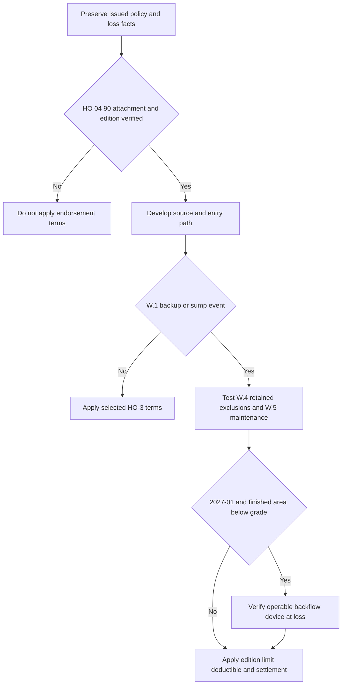

> **Internal claims guidance — not policy authority and not language to quote to an insured or claimant.** This page and the underlying water-loss guide direct file handling only; they do not grant or restrict coverage, add an insured duty, or supply coverage-letter wording. [Water Loss Claim Handling Guidance, status](repo://guidelines/claims/water-loss-handling.md#L1-L4)

## Control objective

Keep four decisions separate: the water source and entry path, the issued policy and verified attachment, the selected endorsement edition, and the payment/condition analysis under that edition. The internal guide directs adjusters to establish and document source before evaluating damage. [Water Loss Claim Handling Guidance §C.1](repo://guidelines/claims/water-loss-handling.md#L7-L11)

**Internal handling checkpoint.** At intake, preserve the policy-written date, full Declarations, HO-3 edition, endorsement schedule, exact HO 04 90 edition, reported cause, loss date, source evidence, and prior endorsement payments in the policy period. A repository form or an underwriting configuration is not evidence that an endorsement was issued; use the issued-policy record. See [Governing Form Editions and Policy Assembly](/openwiki/coverage/policy-editions-and-governing-forms.md).

HO 04 90 edition selection is independent of base-form selection. **HO 04 90 2010-10** remains governing for a policy written under it, including a later-reported loss; **HO 04 90 2027-01** replaces 2026-01 for policies written on or after 2027-01-01. Neither document permits substituting one edition’s terms into a policy issued with the other. [HO 04 90 2010-10, status and scope](repo://forms/HO/MS/HO-04-90/2010-10.md#L1-L7) · [HO 04 90 2027-01, scope](repo://forms/HO/MS/HO-04-90/2027-01.md#L1-L4)

*This internal workflow requires attachment and edition verification before the endorsement route, then applies the event, retained-exclusion, condition, and payment checkpoints in order.* [HO 04 90 2010-10 W.1–W.6](repo://forms/HO/MS/HO-04-90/2010-10.md#L9-L35) · [HO 04 90 2027-01 W.1–W.7](repo://forms/HO/MS/HO-04-90/2027-01.md#L6-L57)

## Source and base-form checkpoint

**Internal handling checkpoint.** Record the reported source, observed entry path, location of water and damage, photographs, plumbing/drain findings, and relevant exterior conditions. Develop and retain the basis for selecting or rejecting plausible sources. Staining, corrosion, and material degradation are examples of duration evidence identified by the guide. [Water Loss Claim Handling Guidance §C.1 and §C.5](repo://guidelines/claims/water-loss-handling.md#L7-L11) · [duration evidence](repo://guidelines/claims/water-loss-handling.md#L35-L41)

For **HO-3 2018-09**, A.1 excludes the stated flood/surface-water category, A.2 excludes the stated subsurface-water category, and A.3 excludes the stated sewer/drain-backup and sump-event category unless HO 04 90 is attached; A.4 applies A.1–A.3 regardless of another concurrent or sequential cause or event. The issued base-form edition, rather than an internal label such as “flooded basement,” controls the coverage analysis. [HO-3 2018-09 A.1–A.4](repo://forms/HO/MS/HO-3/2018-09.md#L69-L77)

For **HO-3 2018-09**, C.3 excludes continuous or repeated leakage over weeks, months, or years from the specified systems or household appliances, except loss that is sudden and accidental. Definition 5 defines that term as abrupt in onset and unintended from the insured’s standpoint and excludes gradually developing or known-unremedied conditions regardless of when effects appear. Do not import those provisions into the supplied **HO-3 2011-05** form, whose exclusions do not contain them. [HO-3 2018-09, Definition 5 and C.3](repo://forms/HO/MS/HO-3/2018-09.md#L19-L20) · [HO-3 2018-09 C.3](repo://forms/HO/MS/HO-3/2018-09.md#L83-L90) · [HO-3 2011-05, scope and exclusions](repo://forms/HO/MS/HO-3/2011-05.md#L1-L7) · [HO-3 2011-05 exclusions](repo://forms/HO/MS/HO-3/2011-05.md#L57-L79)

## HO 04 90 endorsement checkpoint

For **HO 04 90 2010-10** and **HO 04 90 2027-01**, W.1 provides the stated direct-physical-loss route for Coverage A, B, and C property damaged by sewer/drain backup or a sump-related overflow/discharge, including one resulting from mechanical breakdown. In both editions, W.4 retains the HO-3 A.1 flood/surface-water and A.2 subsurface-water exclusions. A verified attachment therefore does not replace source analysis. [HO 04 90 2010-10 W.1 and W.4](repo://forms/HO/MS/HO-04-90/2010-10.md#L9-L11) · [HO 04 90 2010-10 W.4](repo://forms/HO/MS/HO-04-90/2010-10.md#L21-L25) · [HO 04 90 2027-01 W.1 and W.4](repo://forms/HO/MS/HO-04-90/2027-01.md#L6-L11) · [HO 04 90 2027-01 W.4](repo://forms/HO/MS/HO-04-90/2027-01.md#L25-L33)

### Apply the correct edition’s condition and payment terms

| Verified attached edition | Condition and calculation checkpoints |
| --- | --- |
| **HO 04 90 2010-10** | W.5 excludes the endorsement loss when the event resulted from the insured’s known pre-loss failure to maintain the serving sewer line, drain, sump, or sump pump and a reasonable person would have remedied it. W.2 supplies a default $5,000 all-losses-per-policy-period sublimit unless the Declarations show more; it is within, not additional to, A/B/C limits. W.3 supplies a separate $500 deductible per endorsement loss instead of the Section I deductible. W.6 retains the attached policy’s A/B settlement basis and provides Coverage C ACV unless the endorsement Declarations state otherwise. [2010-10 W.2–W.6](repo://forms/HO/MS/HO-04-90/2010-10.md#L13-L35) |
| **HO 04 90 2027-01** | W.5 contains the same known pre-loss maintenance condition. W.2 supplies a default $10,000 all-losses-per-policy-period sublimit unless the Declarations show more, within A/B/C limits; W.3 supplies a separate $1,000 deductible per endorsement loss instead of the Section I deductible. W.6 adds a condition only where the residence premises has a finished area below grade: an installed, operable backwater valve or equivalent backflow-prevention device on the serving sewer line at loss. W.7 contains the A/B and Coverage C settlement rule. [2027-01 W.2–W.7](repo://forms/HO/MS/HO-04-90/2027-01.md#L13-L57) |

**Internal handling checkpoint.** For either verified edition, document the serving equipment, alleged maintenance failure, causation, pre-loss knowledge, reasonable-remedy facts, payment history, A/B/C allocation, selected deductible, and settlement basis. For **2027-01 only**, also document finished-below-grade status and device installation/operability at the time of loss. Do not impose W.6’s below-grade device condition on **2010-10**; that edition’s W.6 is its settlement provision. [HO 04 90 2010-10 W.5–W.6](repo://forms/HO/MS/HO-04-90/2010-10.md#L27-L35) · [HO 04 90 2027-01 W.5–W.7](repo://forms/HO/MS/HO-04-90/2027-01.md#L35-L57)

All other policy provisions apply under **HO 04 90 2010-10** and **HO 04 90 2027-01**. The endorsement route does not bypass property scope, other exclusions, Declarations, or applicable policy conditions. [HO 04 90 2010-10, concluding provision](repo://forms/HO/MS/HO-04-90/2010-10.md#L31-L35) · [HO 04 90 2027-01, concluding provision](repo://forms/HO/MS/HO-04-90/2027-01.md#L50-L57)

## Escalation and completion

**Internal claims guidance — not contract language.** Refer to a technical claims specialist when physical evidence does not establish source, two or more source categories are plausible, a foundation is involved, the insured has a public adjuster or counsel, loss exceeds $25,000, or denial would rest primarily on duration. Referral does not decide coverage. [Water Loss Claim Handling Guidance §C.7](repo://guidelines/claims/water-loss-handling.md#L51-L55)

**Internal claims guidance — not contract language.** The guide directs a reservation of rights before investigation where coverage may turn on duration or the HO 04 90 maintenance condition. Use the selected issued form in any coverage analysis and retain the approved communication and delivery record; the instruction is not a coverage defense or letter template. [Water Loss Claim Handling Guidance §C.8](repo://guidelines/claims/water-loss-handling.md#L57-L59)

Before a coverage-position or payment communication, ensure the file can reproduce: issued base form and HO 04 90 edition; attachment and Declarations evidence; source/duration findings; W.1, W.4, and W.5 analysis; the edition-specific W.2/W.3 calculation; the **2027-01 W.6** device result when applicable; settlement analysis; prior policy-period payments; and any referral or reservation record. For fungi, rot, or bacteria following a water loss, conduct the separate analysis in [Fungi, Rot, and Bacteria](/openwiki/coverage/property/fungi-rot-and-bacteria.md); do not treat water-backup attachment as proof of fungi coverage. [HO 04 90 2010-10 W.1–W.6](repo://forms/HO/MS/HO-04-90/2010-10.md#L9-L35) · [HO 04 90 2027-01 W.1–W.7](repo://forms/HO/MS/HO-04-90/2027-01.md#L6-L57)

### Focused file-review tests

1. **Edition mismatch:** Fail the review if the file uses the **2010-10** $5,000/$500 terms for a verified **2027-01** attachment, or the **2027-01** $10,000/$1,000 terms or W.6 device condition for a verified **2010-10** attachment. [HO 04 90 2010-10 W.2–W.3](repo://forms/HO/MS/HO-04-90/2010-10.md#L13-L19) · [HO 04 90 2027-01 W.2–W.3 and W.6](repo://forms/HO/MS/HO-04-90/2027-01.md#L13-L23) · [HO 04 90 2027-01 W.6](repo://forms/HO/MS/HO-04-90/2027-01.md#L42-L48)
2. **Finished below grade:** For **2027-01**, require the W.6 device evidence only if the premises has a finished area below grade; confirm installation and operability at loss. [HO 04 90 2027-01 W.6](repo://forms/HO/MS/HO-04-90/2027-01.md#L42-L48)
3. **Prior drain complaint:** Do not equate a complaint with a W.5 outcome. Test maintenance failure, causation, pre-loss knowledge, and reasonable-remedy facts under the verified edition. [HO 04 90 2010-10 W.5](repo://forms/HO/MS/HO-04-90/2010-10.md#L27-L29) · [HO 04 90 2027-01 W.5](repo://forms/HO/MS/HO-04-90/2027-01.md#L35-L40)
4. **Water near a sump after rain:** Develop whether the source is surface water, subsurface water, or the specified backup/sump event; neither the location nor the word “flood” selects the route. [HO-3 2018-09 A.1–A.3](repo://forms/HO/MS/HO-3/2018-09.md#L69-L77) · [HO 04 90 2010-10 W.1 and W.4](repo://forms/HO/MS/HO-04-90/2010-10.md#L9-L11) · [HO 04 90 2010-10 W.4](repo://forms/HO/MS/HO-04-90/2010-10.md#L21-L25)
