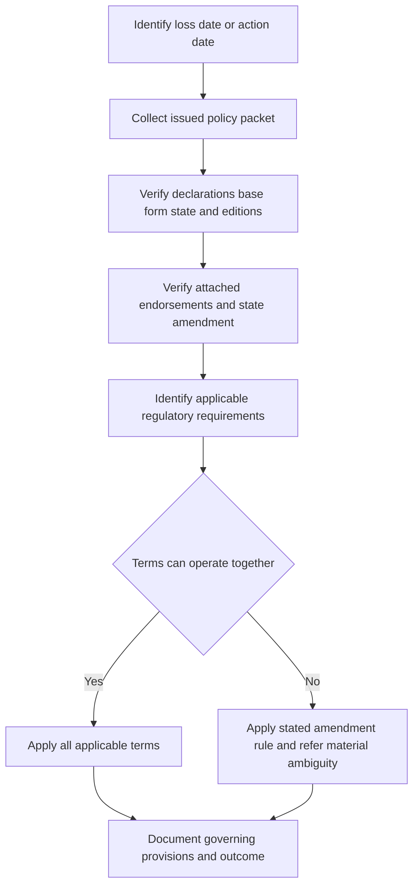

# Assembling the Governing Homeowners Policy

## Purpose and scope

A coverage, valuation, deductible, or underwriting answer begins with the **issued record for the relevant event**, not the newest document in the repository. For the reviewed HO-3 (2018-09), the policy consists of applicable provisions, endorsements, and Declarations; the Declarations identify the named insured, residence premises, insurance, limits, and deductible. The 2024 edition likewise confines coverage to its terms, makes it applicable to loss or occurrence during the policy period, and permits changes only through authorized written action. [HO-3 (2018-09), AGR.1–AGR.2](repo://forms/HO/MS/HO-3/2018-09.md#L13-L17) [HO-3 (2024-03), AGR.1–AGR.12](repo://forms/HO/MS/HO-3/2024-03.md#L13-L39)

This page is an assembly method for the reviewed homeowners forms and state materials. It does not decide an individual claim, treat a quote, producer statement, filing memorandum, internal guide, or a later edition as a policy term, or supply a universal priority rule for documents that are not in the issued packet.

## The governing-record invariant

For a **loss**, preserve the policy snapshot in force on the loss date. The 2024 HO-3 limits coverage to a loss or occurrence during the policy period and directs that coverage be determined from facts, policy terms, and applicable law. Its conditions also require the deductible to be applied to covered loss unless an endorsement changes it. The Florida amendment similarly fixes the applicable wind/hail deductible from the policy in effect when the covered loss occurs; later changes do not alter it. [HO-3 (2024-03), AGR.8–AGR.9 and I.S S.29–S.34](repo://forms/HO/MS/HO-3/2024-03.md#L29-L31) [HO-3 (2024-03), I.S S.29–S.34](repo://forms/HO/MS/HO-3/2024-03.md#L859-L869) [HO 01 09 (2023-07), T.1 T.41–T.42](repo://forms/HO/FL/HO-01-09/2023-07.md#L137-L142)

For an **underwriting, issuance, or renewal action**, preserve the proposed or issued policy record, its effective date, the applicable underwriting requirements, and the notice/selection evidence. A renewal may be offered on revised terms, conditions, or premium under the 2024 HO-3; it is therefore not safe to carry a prior-term form list or deductible forward without checking the renewal packet. [HO-3 (2024-03), G.37–G.39](repo://forms/HO/MS/HO-3/2024-03.md#L1457-L1461) [Texas Bulletin B-2021-08, B.2.23–B.2.31](repo://bulletins/TX/b-2021-08-windstorm-deductibles.md#L93-L109)

### Minimum assembly packet

Record these items together before answering a question:

1. **Event and policy identity:** policy number, state, form/line, named insured, insured location, policy period, loss date or underwriting-action date.
2. **Declarations:** the limits, deductibles, covered location, selections, and other values that identify what was issued.
3. **Base form:** exact form number and edition, rather than a form with the same name from a later filing.
4. **Attachments that are actually part of the policy:** every endorsement and state amendatory form, with its edition and effective date. An HO 04 90 endorsement is effective only when attached; the Florida amendment becomes part of the policy when effective and remains applicable while part of the policy. [HO 04 90 (2027-01), W.0 W.1–W.2](repo://forms/HO/MS/HO-04-90/2027-01.md#L13-L17) [HO 01 09 (2023-07), T.0 T.21](repo://forms/HO/FL/HO-01-09/2023-07.md#L53-L55)
5. **Applicable external requirements:** state and date-specific law, regulation, and regulator requirements governing insurer conduct, filing, notice, underwriting, or claims handling.
6. **Supporting issuance record:** endorsement schedule, policy-change or renewal notice, selection forms, and evidence of delivery where a deductible or other term was changed.

A form merely stored in a library is not an attachment. The older HO-3 and the HO-6 both say that a policy term may be changed only by an insurer-issued endorsement and that oral statements do not change the policy. [HO-3 (2018-09), S.63–S.67](repo://forms/HO/MS/HO-3/2018-09.md#L1039-L1047) [HO-6 (2023-02), S.60–S.63](repo://forms/HO/MS/HO-6/2023-02.md#L962-L968)

*The assembly flow fixes the issued record first, then applies compatible terms and only a stated conflict rule.*

## How the documents operate together

### Base form and Declarations establish the starting contract

Use the selected base form to identify the coverage grant, definitions, exclusions, conditions, and default settlement path. Use the Declarations to identify the insured, location, limits, deductible, and policy-specific selections. For example, the HO-3 (2024-03) provides a Coverage A roof-surfacing replacement-cost baseline unless an actual-cash-value roof-schedule endorsement is attached; it also says that its deductible applies unless modified by endorsement. [HO-3 (2024-03), I.A A.22](repo://forms/HO/MS/HO-3/2024-03.md#L141-L141) [HO-3 (2024-03), I.S S.29–S.34](repo://forms/HO/MS/HO-3/2024-03.md#L859-L869)

Do not make a coverage decision from a declaration value alone. A deductible, limit, or schedule is applied only after the applicable form establishes the relevant covered loss and under its conditions. The HO-3 (2024-03) requires accidental direct physical loss during the policy period and subject to exclusions and limitations. [HO-3 (2024-03), I.P P.1–P.2](repo://forms/HO/MS/HO-3/2024-03.md#L557-L563)

### Attached endorsements are targeted changes, not a separate policy

The reviewed endorsements use a limited rule: they form part of the policy, change it only as stated, retain unmodified terms, and control an actual conflict within their scope. For example, HO 04 90 (2027-01) says that it forms part of the policy only when attached, controls a conflicting provision, and leaves provisions not modified unchanged. HO 23 74 (2025-05) states that it does not create otherwise-uncovered coverage or change an exclusion, condition, limit, or deductible except as it expressly says. [HO 04 90 (2027-01), W.0 W.1–W.13](repo://forms/HO/MS/HO-04-90/2027-01.md#L13-L39) [HO 23 74 (2025-05), W.0](repo://forms/HO/MS/HO-23-74/2025-05.md#L39-L55)

**HO 04 90 (2027-01), W.0 W.1–W.4 modifies HO-3 (2024-03), I.P P.9.** When attached, the water-backup endorsement supplies its stated direct-physical-loss coverage for Water Backup or Sump Discharge or Overflow; the base form otherwise excludes water that backs up through sewers, drains, or sump systems. [HO 04 90 (2027-01), W.0 W.1–W.4 and W.1 W.1–W.4](repo://forms/HO/MS/HO-04-90/2027-01.md#L13-L25) [HO-3 (2024-03), I.P P.9](repo://forms/HO/MS/HO-3/2024-03.md#L573-L581)

**HO 23 74 (2025-05), W.0 and W.1 W.4 modifies HO-3 (2024-03), I.A A.22.** When attached and its roof-age condition is met, the roof-surfacing endorsement supplies actual-cash-value settlement for covered Roof Surfacing, while the base form otherwise uses replacement cost unless an ACV roof schedule is attached. [HO 23 74 (2025-05), W.0 and W.1 W.4](repo://forms/HO/MS/HO-23-74/2025-05.md#L39-L43) [HO 23 74 (2025-05), W.1 W.4](repo://forms/HO/MS/HO-23-74/2025-05.md#L63-L67) [HO-3 (2024-03), I.A A.22](repo://forms/HO/MS/HO-3/2024-03.md#L141-L141)

The operative rule is not “the latest endorsement wins.” Read provisions together when they can operate consistently; apply the amendment's stated conflict rule only to the matter it addresses. If two attachments materially conflict and the packet or controlling law does not resolve the issue, preserve the conflict and refer it rather than silently choosing the newer document. The Texas 2022 amendment expressly directs compatible terms to be read together and controlling terms to be used only where a conflict exists. [HO 01 45 (2022-01), T.0 T.1–T.5](repo://forms/HO/TX/HO-01-45/2022-01.md#L13-L23)

### State amendatory form and external regulation have different jobs

A state amendatory form is a policy attachment when it is included in the issued packet. **HO 01 09 (2023-07), T.0 T.1–T.6 modifies the attached policy to the extent its Florida terms differ.** It controls a conflict but otherwise leaves policy terms, limitations, exclusions, and duties applicable. [HO 01 09 (2023-07), T.0 T.1–T.6](repo://forms/HO/FL/HO-01-09/2023-07.md#L13-L25)

External regulatory materials govern insurer conduct and may require a form term to conform to law; they are not automatically policy endorsements. The HO-3 (2024-03) provides that a policy provision conflicting with applicable law is amended to conform while remaining provisions continue. Florida Bulletin OIR-2023-04 expressly says it does not itself amend a policy and cannot be used to alter policy terms without the applicable filing and notice requirements. [HO-3 (2024-03), G.57](repo://forms/HO/MS/HO-3/2024-03.md#L1469-L1469) [Florida Bulletin OIR-2023-04, B.1](repo://bulletins/FL/oir-2023-04-roof-age-nonrenewal.md#L45-L49)

This distinction matters operationally. Florida's 2023 bulletin requires an admitted insurer to evaluate roof age with condition information, maintain support for underwriting action, and not apply an ACV roof schedule unless the policy form authorizes it. Texas's 2021 bulletin requires deductible application from the policy in force for the loss and records showing the selected deductible, policy language, and basis for claim application. Those are compliance controls alongside, not substitutes for, the issued policy terms. [Florida Bulletin OIR-2023-04, B.1 and B.2.8–B.2.10](repo://bulletins/FL/oir-2023-04-roof-age-nonrenewal.md#L13-L29) [Florida Bulletin OIR-2023-04, B.2.8–B.2.10](repo://bulletins/FL/oir-2023-04-roof-age-nonrenewal.md#L75-L79) [Texas Bulletin B-2021-08, B.2.10 and B.2.17–B.2.21](repo://bulletins/TX/b-2021-08-windstorm-deductibles.md#L67-L89)

### Filing memoranda and internal guides are interpretation aids

A filing memorandum can explain what a revised form was intended to clarify, but it is not an issued policy provision. For example, the HO-3 (2024-03) memorandum says the filing revised roof loss-settlement wording to address a roof payment floor; the controlling form supplies the operative policy text, including the attached-ACV-schedule rule. If a memorandum and the form conflict, the form controls. [Filing Memorandum — HO-3 (2024-03), M.1.20](repo://memoranda/HO-3-2024-03.md#L51-L55) [HO-3 (2024-03), I.A A.22](repo://forms/HO/MS/HO-3/2024-03.md#L141-L141)

Likewise, the Underwriting Referral and Authority Matrix is internal guidance, not an insurance contract; it can identify a referral but cannot create, expand, restrict, or waive coverage. Use it to escalate incomplete or inconsistent records, not to change the assembled policy. [Underwriting Referral and Authority Matrix, H.0.1–H.0.9](repo://guidelines/authority/referral-matrix.md#L13-L31)

## Edition lifecycle: keep superseded records live

A later edition is not retroactive merely because it has a later effective date. The following `SUPERSEDED by` relationships appear in the reviewed record set. The superseded edition remains relevant to the policy population stated in its own status line.

| Record family | `SUPERSEDED by` relationship | Policy population to use |
| --- | --- | --- |
| HO-3 base form | HO-3 (2018-09) is **SUPERSEDED by** HO-3 (2024-03) for policies effective on or after **2024-03-01**; the 2018-09 edition remains in force for policies written under it. [status](repo://forms/HO/MS/HO-3/2018-09.md#L8-L9) | Use 2018-09 where it is the issued base-form edition; use 2024-03 only where that later edition is the issued base form. |
| HO 23 74 roof-surfacing endorsement | HO 23 74 (2018-09) is **SUPERSEDED by** HO 23 74 (2025-05) for policies effective on or after **2025-05-01**; the 2018-09 edition remains in force for policies written under it. [status](repo://forms/HO/MS/HO-23-74/2018-09.md#L8-L9) | Use the 2018-09 attachment for policies written under it; use the 2025-05 attachment only when it is attached to the applicable policy. |
| HO 04 90 water-backup endorsement | HO 04 90 (2010-10) is **SUPERSEDED by** HO 04 90 (2027-01) for policies effective on or after **2027-01-01**; the 2010-10 edition remains in force for policies written under it. [status](repo://forms/HO/MS/HO-04-90/2010-10.md#L8-L9) | Use the 2010-10 attachment for policies written under it; use the 2027-01 attachment only when it is attached to the applicable policy. |
| Texas HO 01 45 state amendment | HO 01 45 (2019-01) is **SUPERSEDED by** HO 01 45 (2022-01) for policies effective on or after **2022-01-01**; the 2019-01 edition remains in force for policies written under it. [status](repo://forms/HO/TX/HO-01-45/2019-01.md#L8-L10) | Use the 2019-01 amendment for its written policy population; use the 2022-01 amendment for an issued packet carrying that later edition. |
| Florida roof-age bulletin | OIR-2019-11 is **SUPERSEDED by** OIR-2023-04 for policies effective on or after **2023-04-11**; the 2019 bulletin remains in force for policies written under it. [status](repo://bulletins/FL/oir-2019-11-roof-age.md#L8-L9) | Apply the regulator material to the policy/action population stated in its status line; do not treat either bulletin as a policy attachment. |
| Texas wind/hail deductible bulletin | B-2016-04 is **SUPERSEDED by** B-2021-08 for policies effective on or after **2021-08-19**; the 2016 bulletin remains in force for policies written under it. [status](repo://bulletins/TX/b-2016-04-windstorm-deductibles.md#L8-L9) | Apply the regulator material to the policy/action population stated in its status line; do not substitute it for the deductible in the issued policy. |

The differences can be substantive, so preserving an old edition is not archival formality. The 2018 HO 23 74 applies ACV to covered roof surfacing at age 15 years and permits reasonable labor depreciation, whereas the 2025 edition uses a 12-year roof-age trigger and states ACV applies whether or not repair or replacement occurs. [HO 23 74 (2018-09), W.1 W.2–W.7](repo://forms/HO/MS/HO-23-74/2018-09.md#L47-L59) [HO 23 74 (2025-05), W.1 W.4–W.10](repo://forms/HO/MS/HO-23-74/2025-05.md#L63-L77)

The Texas amendments also differ operationally: the 2019 amendment requires at least 30 days' written notice before a windstorm-deductible increase takes effect, while the 2022 amendment states at least 45 days for that increase. Each edition also determines its deductible by the loss date rather than the report or payment date. [HO 01 45 (2019-01), T.2 T.2–T.10 and T.28–T.30](repo://forms/HO/TX/HO-01-45/2019-01.md#L169-L189) [HO 01 45 (2019-01), T.2 T.28–T.30](repo://forms/HO/TX/HO-01-45/2019-01.md#L223-L229) [HO 01 45 (2022-01), T.2 T.4–T.17](repo://forms/HO/TX/HO-01-45/2022-01.md#L173-L203)

## Applying the assembled policy

After the packet is fixed, make the analysis in this order:

1. **Classify the question.** Identify whether it concerns coverage, a condition, settlement, a limit, deductible, renewal eligibility, cancellation/nonrenewal notice, or regulatory conduct. A valuation endorsement does not independently create a covered cause of loss.
2. **Apply the issued base form.** Identify covered property, loss/occurrence timing, coverage grant, definitions, exclusions, conditions, and default settlement rule.
3. **Apply each attached change within its stated scope.** Identify the specific provision changed and retain terms the attachment does not change. Do not use an unattached form to fill a coverage gap.
4. **Apply the applicable state amendment and regulatory requirements.** State amendments may be contractual attachments. Regulatory materials direct conduct and may require conformity to law, notice, documentation, or a different administration outcome.
5. **Calculate only after entitlement and scope are resolved.** Apply the applicable settlement basis, sublimits/limits, deductibles, and payment conditions to the covered amount. Appraisal, where available, does not decide coverage, policy interpretation, or compliance with policy conditions. [HO-3 (2024-03), I.S S.42–S.47](repo://forms/HO/MS/HO-3/2024-03.md#L885-L895)
6. **Document the result.** List every governing form and provision, the version/attachment evidence, the facts used, unresolved conflicts, required notices, and the reasoning for each conclusion.

### Representative entrypoints

- **Roof settlement:** establish covered direct physical loss under the base form before applying a roof schedule. Then confirm whether the exact HO 23 74 or Florida amendment is attached and whether its scope and roof-age trigger are met. See [Roof Loss Settlement and Actual Cash Value Schedules](/openwiki/coverages/coverage-a/roof-settlement.md).
- **Water backup:** do not infer attachment from a report label. The 2024 HO-3 excludes sewer, drain, and sump backup unless a water-backup endorsement is attached; determine the actual water source/path and the edition of any attached HO 04 90. See [Water Damage and Water-Backup Write-Backs](/openwiki/coverages/coverage-a/water-damage-and-water-backup.md). [HO-3 (2024-03), I.P P.9](repo://forms/HO/MS/HO-3/2024-03.md#L573-L581)
- **Texas wind/hail deductible:** identify the deductible shown in the loss-date Declarations, the attached HO 01 45 edition, the covered cause, and any valid change notice. The 2022 amendment calculates the deductible from the loss-date Declarations and does not let a later limit change alter it. See [Texas Wind Deductible and Claim Rules](/openwiki/state-overlays/texas-wind-deductible-and-claim-rules.md). [HO 01 45 (2022-01), T.1 T.1–T.6](repo://forms/HO/TX/HO-01-45/2022-01.md#L59-L71)
- **Florida roof or wind question:** identify the attached Florida amendment and its loss-date application, then separately apply the Florida regulator requirements for underwriting or claims conduct. See [Florida Roof, Wind, and Claim Rules](/openwiki/state-overlays/florida-roof-wind-and-claim-rules.md).

## Controls, failure modes, and focused tests

### Issuance and change controls

A safe issuance process creates a reproducible policy fingerprint: the approved base-form edition, every attached endorsement/state form and edition, the completed Declarations, effective dates, selection evidence, and required notices. This matters particularly for deductible changes. The Texas 2021 bulletin requires controls that prevent policy language from conflicting with underwriting practice, requires deductible selections to appear in the issued policy, and prohibits application of a changed deductible before it is properly reflected in the policy record. [Texas Bulletin B-2021-08, B.2.23–B.2.31](repo://bulletins/TX/b-2021-08-windstorm-deductibles.md#L93-L109)

For underwriting, separate **eligibility evidence** from the contract already issued. Florida's current bulletin requires reliable roof-age information, consideration of condition evidence, and an accurate, supportable reason for a roof-age nonrenewal; it does not itself change coverage. Internal referral guidance requires escalation when the facts do not support a confident authority determination and retention of material support. [Florida Bulletin OIR-2023-04, B.1](repo://bulletins/FL/oir-2023-04-roof-age-nonrenewal.md#L19-L35) [Underwriting Referral and Authority Matrix, H.0.2–H.0.11](repo://guidelines/authority/referral-matrix.md#L17-L35)

For claim handling, preserve the issued packet and factual record. The HO-3 (2024-03) requires prompt notice, protection of property, retention where reasonably possible, access/inspection, records, and cooperation; Texas prompt-payment guidance requires a claim file, reasonable investigation, and a policy-and-fact-consistent explanation for a full or partial denial. [HO-3 (2024-03), I.S S.4–S.19](repo://forms/HO/MS/HO-3/2024-03.md#L809-L839) [Texas Bulletin B-2019-02, B.1.8–B.1.15 and B.2.3–B.2.14](repo://bulletins/TX/b-2019-02-prompt-payment.md#L29-L43) [Texas Bulletin B-2019-02, B.2.3–B.2.14](repo://bulletins/TX/b-2019-02-prompt-payment.md#L57-L79)

### Failure modes to stop early

- **Wrong edition:** applying a post-effective-date successor to a policy expressly retained under the earlier edition.
- **Missing attachment proof:** applying HO 04 90, HO 23 74, or a state amendment because it exists in the library rather than because it was attached/effective in the packet.
- **Declaration/form mismatch:** treating an application, quote, informal communication, or prior renewal as the loss-date Declarations.
- **Scope creep:** using a deductible or ACV schedule as a coverage grant, or letting an endorsement alter exclusions/conditions it says remain unchanged.
- **Regulatory category error:** treating a regulator bulletin, filing memorandum, or internal manual as a contractual endorsement.
- **Unresolved conflict hidden by an assumption:** choosing a later document based on file date, assumed priority, or a generic “most specific” label instead of documenting the actual provisions and referring a material ambiguity.

### Focused tests for a policy-assembly workflow

Use test cases that assert both the selected record and the rejected alternative:

| Test | Inputs | Expected control |
| --- | --- | --- |
| Loss-date base-form selection | A 2018-09 HO-3 packet and a loss after the 2024 successor was published | Select issued 2018-09, not 2024-03; retain the successor only as a lifecycle reference. |
| Attachment gate | A 2024-03 base form with a backup loss but no HO 04 90 on the schedule | Do not apply the water-backup write-back; analyze the base exclusion. |
| Targeted roof settlement | A 2024-03 HO-3 packet with attached 2025-05 HO 23 74 and a covered roof-surfacing loss | Apply the endorsement's ACV trigger and retain base-form limits, deductible, exclusions, and conditions. |
| Florida separation | A Florida issuance/nonrenewal file carrying HO 01 09 and roof-condition evidence | Apply the issued amendment as policy text; apply OIR requirements to underwriting conduct without treating the bulletin itself as an endorsement. |
| Texas changed deductible | A loss before the effective date of a proposed deductible increase | Select the deductible then in effect and verify the written notice/policy record, not the later proposed value. |
| Conflicting records | Declarations, endorsement schedule, or state forms that materially disagree | Stop automated conclusion, preserve sources/effective dates, and refer for authorized policy/legal/regulatory resolution. |

For related controls and examples, see [Endorsement Attachment and Issuance Controls](/openwiki/underwriting-guidance/endorsement-attachment-and-issuance-controls.md) and the [OpenWiki quickstart](/openwiki/quickstart.md).
