# Policy Assembly: Editions, Endorsements, and State Overlays

A policy position is assembled from documents with different jobs. The governing contract is the live base form, its attached endorsements, the Declarations, and any applicable state amendatory form. A regulator bulletin constrains how the carrier may file, issue, disclose, and administer the contract. A filing memorandum explains an edition change; an appetite guide or underwriting manual constrains whether the carrier may bind or attach the requested terms. None of those latter documents silently replaces contract language.

The corpus makes this distinction explicit: `forms/` and `bulletins/` are frozen authority, prior editions remain applicable to policies written under them, and memoranda are interpretation rather than authority ([README, layout and authority model](repo://README.md#L15-L21), [README, frozen authority](repo://README.md#L35-L41)).

## Authority and relationship vocabulary

| Layer | What it does | How to read it |
| --- | --- | --- |
| Base form | Supplies the ordinary coverage agreement, definitions, limits, exclusions, conditions, and settlement rules for its line and edition. | Contract authority. Start here, using the edition selected by the policy-effective date. |
| Attached endorsement | Adds, removes, or changes a defined part of the base policy only within its stated terms. | Contract authority. Attachment is required; unchanged policy terms continue to apply. |
| State amendatory form | Changes the contract for the named state and line. | Contract authority for that state. It is not the bulletin itself. |
| Regulator bulletin | Sets regulatory requirements for policy language, disclosures, filing, underwriting, rating, and claims administration. | Regulatory constraint on the carrier; it does not authorize a deductible that the policy does not provide. |
| Filing memorandum | Describes why an edition changed and helps interpret the filing. | Interpretation only. The filed form controls if the memorandum and form differ. |
| Appetite guide and underwriting manual | Set eligibility, authority, referral, documentation, and attachment controls. | Internal guidance. They constrain carrier action but cannot grant, remove, or reinterpret coverage. |

Use the relationship verbs directionally, with the acting document first: `supersedes`, `writes back`, `preserves`, `modifies`, `implements`, or `constrains`. For example, the later base edition supersedes the earlier base edition; an endorsement writes back only the excluded event it actually covers; and an internal rule constrains attachment rather than changing the coverage grant.

## Edition selection is date-sensitive

The policy-effective date selects the live base-form and endorsement edition. Do not replace a superseded edition in an older policy with today's text: the corpus says the prior edition continues to govern every policy written under it ([README, prior editions](repo://README.md#L35-L37)). The edition metadata supplies the effective boundary: HO-3 2018-09 is effective 2018-09-01 and is marked superseded by HO-3 2024-03 for policies effective on or after 2024-03-01 ([HO-3 2018-09, metadata and supersession](repo://forms/HO/MS/HO-3/2018-09.md#L1-L9)); HO-3 2024-03 is effective 2024-03-01 ([HO-3 2024-03, metadata](repo://forms/HO/MS/HO-3/2024-03.md#L1-L7)). Thus, **HO-3 2024-03 supersedes HO-3 2018-09** only at that boundary; it does not rewrite an earlier policy.

The same rule applies independently to an endorsement. HO 04 90 2010-10 is marked superseded by HO 04 90 2027-01 for policies effective on or after 2027-01-01 ([HO 04 90 2010-10, supersession](repo://forms/HO/MS/HO-04-90/2010-10.md#L1-L9)); the 2027-01 endorsement is effective 2027-01-01 ([HO 04 90 2027-01, metadata](repo://forms/HO/MS/HO-04-90/2027-01.md#L1-L7)). Therefore, **HO 04 90 2027-01 supersedes HO 04 90 2010-10** for the later effective period, while the 2010-10 wording remains the live endorsement for an earlier policy.

```mermaid
flowchart TD
    A["Policy effective date and state"] --> U["Pre-bind underwriting review"]
    U --> B{"Select base edition effective on date"}
    B --> B18["HO-3 2018-09 before 2024-03"]
    B --> B24["HO-3 2024-03 from 2024-03"]
    U --> E{"Select attached endorsement edition effective on date"}
    E --> E10["HO 04 90 2010-10 before 2027-01"]
    E --> E27["HO 04 90 2027-01 from 2027-01"]
    B18 --> S["Add applicable state amendatory form"]
    B24 --> S
    E10 --> S
    E27 --> S
    S --> R["Apply regulator requirements"]
    R --> I["Apply internal eligibility and attachment controls"]
    I --> P["Issue the composed policy position"]
```

*This flow shows the date-based edition choice followed by state contract terms, regulatory requirements, and internal pre-bind controls.*

### Selection procedure

1. Read the policy-effective date, line, and state from the policy record. Select the base-form edition whose effective interval contains that date; retain the older edition for policies written under it.
2. Select each attached endorsement by the same date rule. Attachment is not implied by the existence of a form: the endorsement must be attached and its own terms govern only the stated coverage ([HO 04 90 2027-01, attachment and unchanged terms](repo://forms/HO/MS/HO-04-90/2027-01.md#L15-L39)).
3. Add the state amendatory form applicable to the line and state. Read its precedence clause with the base form and endorsements: Texas HO 01 45 says its conflicting term governs, nonconflicting terms remain applicable, and the amendatory terms do not provide coverage unless expressly provided ([HO 01 45, T.0](repo://forms/HO/TX/HO-01-45/2022-01.md#L13-L23)).
4. Apply the regulator overlay to issuance, disclosure, filing, and claim administration. For Texas separate windstorm or hail deductibles, B-2021-08 requires clear policy identification, a stated trigger, and application according to the policy in force ([B-2021-08, B.1.1-B.1.7](repo://bulletins/TX/b-2021-08-windstorm-deductibles.md#L13-L27)).
5. Run internal underwriting controls before binding or renewing. Record the authority and referral outcome; do not treat a manual or guideline as an additional contract layer.

## How the documents compose

### Base form and endorsement

The base form establishes the ordinary exclusion or limit. HO-3 2018-09 excludes water or waterborne material backing up through sewers, drains, or sumps and sump discharge or overflow ([HO-3 2018-09, I.A A.16](repo://forms/HO/MS/HO-3/2018-09.md#L113-L121)). The 2024 base form likewise excludes sewer, drain, and sump water in its Section I exclusions, while expressly pointing to an attached water-backup endorsement as the exception ([HO-3 2024-03, X.8-X.9](repo://forms/HO/MS/HO-3/2024-03.md#L683-L691)). **HO 04 90 2027-01 writes back HO-3 2024-03 X.8-X.9** only for its stated Water Backup and Sump Discharge or Overflow coverage: it covers direct physical loss from those events, subject to its limit and terms ([HO 04 90 2027-01, W.1-W.5](repo://forms/HO/MS/HO-04-90/2027-01.md#L41-L57)). It does not turn flood or unrelated surface water into covered loss ([HO 04 90 2027-01, W.15-W.20](repo://forms/HO/MS/HO-04-90/2027-01.md#L71-L81)).

The endorsement is not a second policy. **HO 04 90 2027-01 preserves HO-3 2024-03 terms not modified by the endorsement**: the endorsement controls a conflict, but the policy's other terms, conditions, exclusions, and limitations remain applicable, and the attachment does not create a separate contract ([HO 04 90 2027-01, W.4-W.5 and W.12-W.13](repo://forms/HO/MS/HO-04-90/2027-01.md#L21-L39)). The older edition states the same boundary in different words: unchanged policy terms and exclusions continue unless expressly changed ([HO 04 90 2010-10, W.0](repo://forms/HO/MS/HO-04-90/2010-10.md#L13-L33)).

An endorsement can also modify a limit or deductible without restoring every excluded cause. **HO 04 90 2027-01 modifies HO 04 90 2010-10** from a $5,000 limit and $500 deductible to a $10,000 limit and $1,000 water-backup deductible ([2010-10, W.2 Limit and W.3 Deductible](repo://forms/HO/MS/HO-04-90/2010-10.md#L107-L119), [2010-10, deductible](repo://forms/HO/MS/HO-04-90/2010-10.md#L175-L191), [2027-01, W.2 Limit](repo://forms/HO/MS/HO-04-90/2027-01.md#L139-L169), [2027-01, W.3 Deductible](repo://forms/HO/MS/HO-04-90/2027-01.md#L189-L205)). That is an edition change, not permission to apply the 2027 amount to a policy carrying the 2010-10 endorsement.

### State amendatory form and regulator bulletin

A state overlay is contract language, while the bulletin is regulatory authority. In Texas, B-2021-08 requires separate windstorm and hail deductibles to be clearly described, tied to the loss conditions, and applied consistently with the policy; it also sets the named-storm minimum at one percent and the seacoast windstorm maximum at ten percent ([B-2021-08, B.2.1-B.2.10](repo://bulletins/TX/b-2021-08-windstorm-deductibles.md#L47-L71)). **HO 01 45 Texas 2022-01 implements Texas Bulletin B-2021-08** by making the windstorm and hail deductible separate, setting its one-to-ten-percent range, tying it to the Declarations and applicable limit, and addressing mixed causes ([HO 01 45, T.1-T.16](repo://forms/HO/TX/HO-01-45/2022-01.md#L59-L91), [README, cross-wired document design](repo://README.md#L89-L92)). The bulletin still constrains administration: the carrier must not apply a deductible that the policy does not permit and must keep records supporting the policy terms and claim basis ([B-2021-08, B.1.5-B.1.6 and B.2.9-B.2.10](repo://bulletins/TX/b-2021-08-windstorm-deductibles.md#L23-L27), [B-2021-08, B.2.9-B.2.10](repo://bulletins/TX/b-2021-08-windstorm-deductibles.md#L63-L69)).

**Texas Bulletin B-2021-08 constrains the use of HO 01 45 and any related declarations or endorsement**: its disclosure section requires a clear separate windstorm and hail disclosure at application, issuance, and renewal, and requires at least 30 days' written notice before a windstorm-deductible increase ([B-2021-08, B.3.1-B.3.18](repo://bulletins/TX/b-2021-08-windstorm-deductibles.md#L135-L171)). The bulletin is not a substitute for the amendatory form's contractual wording; the form supplies the contract mechanism and the bulletin supplies the regulatory floor.

### Memoranda and internal guidance

The filing memorandum for HO-3 2024-03 records that the edition revised deductible wording, including the all-other-perils minimum and multi-cause handling, and that the form was revised for clarity and internal consistency ([HO-3 2024-03 memorandum, M.1.6-M.1.7 and M.1.31](repo://memoranda/HO-3-2024-03.md#L23-L31), [HO-3 2024-03 memorandum, M.1.31](repo://memoranda/HO-3-2024-03.md#L73-L75)). It explains the edition; it is not an endorsement and cannot override the filed HO-3 text. The corpus classifies memoranda as interpretation, while forms remain frozen authority ([README, document families](repo://README.md#L15-L21), [README, frozen authority](repo://README.md#L35-L41)).

Internal rules operate before contract issuance. The underwriting manual is internal carrier direction, must be used within delegated authority, and expressly forbids using it to alter coverage; it requires pre-bind review and referral before binding ([Personal Lines Underwriting Manual, Rules 100.A-100.G](repo://manuals/underwriting/manual.md#L14-L55)). **Personal Lines Underwriting Manual Rule 400 constrains endorsement attachment**: the risk must support the requested coverage, every request must be reviewed, the endorsement must match the insured and property, and incomplete or conflicting information requires referral ([Rule 400](repo://manuals/underwriting/manual.md#L5089-L5129)). The Texas appetite guide makes the same authority boundary explicit: it is internal guidance, not part of the policy contract, and coverage follows the applicable policy language ([Texas Homeowners Appetite Guide, H.0.1-H.0.10](repo://guidelines/appetite/tx-homeowners.md#L13-L35)).

For Texas operations, Rule 510 adds controls without changing the contract: Coverage A over $800,000 requires senior referral up to $1,200,000, water-backup limits over $25,000 require referral, and the Texas address must be verified before quoting or binding ([Underwriting Manual, Rule 510.1-510.6](repo://manuals/underwriting/manual.md#L6227-L6263)). Those are underwriting decisions, not hidden coverage limits.

## Worked assemblies

Each example names every participating document, the exact relationship provision, and the authority boundary. The examples describe the assembled position for the stated effective date; they do not backdate a later edition.

### Example 1 — Texas HO-3 policy effective 2023-06-01

- **Base contract:** use **HO-3 2018-09**, because its 2018-09-01 effective date precedes the policy and its supersession marker reserves HO-3 2024-03 for policies effective on or after 2024-03-01 ([HO-3 2018-09, metadata and marker](repo://forms/HO/MS/HO-3/2018-09.md#L1-L9)). **HO-3 2024-03 supersedes HO-3 2018-09** only for its later interval ([HO-3 2024-03, metadata](repo://forms/HO/MS/HO-3/2024-03.md#L1-L7)).
- **Water-backup endorsement:** use **HO 04 90 2010-10**, not 2027-01, because the 2010 edition is the applicable edition before 2027-01-01. **HO 04 90 2010-10 writes back HO-3 2018-09 I.A A.16** for its stated water-backup and sump coverage, while its W.0 preserves exclusions not changed by the endorsement ([HO-3 2018-09, I.A A.16](repo://forms/HO/MS/HO-3/2018-09.md#L113-L121), [HO 04 90 2010-10, W.0 and W.1](repo://forms/HO/MS/HO-04-90/2010-10.md#L13-L37), [HO 04 90 2010-10, coverage](repo://forms/HO/MS/HO-04-90/2010-10.md#L35-L47)). Its $5,000 limit and $500 deductible are the 2010 contract terms ([HO 04 90 2010-10, W.2-W.3](repo://forms/HO/MS/HO-04-90/2010-10.md#L107-L119), [HO 04 90 2010-10, W.3 Deductible](repo://forms/HO/MS/HO-04-90/2010-10.md#L175-L191)).
- **Texas contract overlay:** attach **HO 01 45 Texas 2022-01**, whose T.1-T.3 make the windstorm and hail deductible a separate contractual deductible and whose T.2 sets the one-to-ten-percent range ([HO 01 45, metadata](repo://forms/HO/TX/HO-01-45/2022-01.md#L1-L7), [HO 01 45, T.0-T.1](repo://forms/HO/TX/HO-01-45/2022-01.md#L13-L23), [HO 01 45, T.1-T.2](repo://forms/HO/TX/HO-01-45/2022-01.md#L59-L73)). **HO 01 45 implements Texas Bulletin B-2021-08**, which requires the separate deductible to be described and applied from the policy language ([B-2021-08, B.1.3-B.1.7](repo://bulletins/TX/b-2021-08-windstorm-deductibles.md#L19-L27), [HO 01 45, T.1-T.5](repo://forms/HO/TX/HO-01-45/2022-01.md#L59-L71)).
- **Operational boundary:** before binding, the appetite guide and Manual Rule 400 constrain attachment and referral; Rule 510 constrains Texas authority, including water-backup limits over $25,000. These documents cannot change the HO-3 or HO 04 90 grant ([appetite guide, H.0.1-H.0.10](repo://guidelines/appetite/tx-homeowners.md#L13-L35), [Manual Rule 400](repo://manuals/underwriting/manual.md#L5089-L5129), [Manual Rule 510.1-510.6](repo://manuals/underwriting/manual.md#L6227-L6263)).

### Example 2 — Texas HO-3 policy effective 2027-02-01

- **Base contract:** use **HO-3 2024-03**, whose effective date is 2024-03-01; do not carry forward HO-3 2018-09 merely because that edition was once issued ([HO-3 2024-03, metadata](repo://forms/HO/MS/HO-3/2024-03.md#L1-L7), [HO-3 2018-09, supersession](repo://forms/HO/MS/HO-3/2018-09.md#L8-L9)).
- **Water-backup endorsement:** use **HO 04 90 2027-01**, whose W.1-W.4 require attachment, make it part of the policy, and give it control over a conflict. **HO 04 90 2027-01 writes back HO-3 2024-03 X.8-X.9** only for the stated water-backup and sump-discharge events ([HO-3 2024-03, X.8-X.9](repo://forms/HO/MS/HO-3/2024-03.md#L683-L691), [HO 04 90 2027-01, W.1-W.5](repo://forms/HO/MS/HO-04-90/2027-01.md#L15-L25), [HO 04 90 2027-01, W.1-W.4 coverage](repo://forms/HO/MS/HO-04-90/2027-01.md#L41-L51)). **HO 04 90 2027-01 modifies HO 04 90 2010-10** to the $10,000 limit and $1,000 deductible shown in its own W.2 and W.3 ([HO 04 90 2027-01, W.2-W.3](repo://forms/HO/MS/HO-04-90/2027-01.md#L139-L199), [HO 04 90 2010-10, prior amounts](repo://forms/HO/MS/HO-04-90/2010-10.md#L107-L119)).
- **Texas contract and regulatory overlay:** use **HO 01 45 Texas 2022-01** as the applicable state amendatory form. It implements the bulletin's separate-deductible requirements through T.1-T.16; B-2021-08 still constrains disclosure, policy consistency, and claim application ([HO 01 45, T.1-T.16](repo://forms/HO/TX/HO-01-45/2022-01.md#L59-L91), [B-2021-08, B.2.1-B.2.10](repo://bulletins/TX/b-2021-08-windstorm-deductibles.md#L47-L71), [B-2021-08, B.3.9-B.3.18](repo://bulletins/TX/b-2021-08-windstorm-deductibles.md#L153-L171)).
- **Operational boundary:** the same current appetite guide, Manual Rule 400, and Texas Rule 510 constrain whether this 2027 policy may be bound and whether the endorsement may attach; they do not replace the 2024-03 base text or 2027-01 endorsement text ([appetite guide, H.0.2-H.0.10](repo://guidelines/appetite/tx-homeowners.md#L15-L35), [Manual Rule 400.A-400.G](repo://manuals/underwriting/manual.md#L5091-L5129), [Manual Rule 510.1-510.6](repo://manuals/underwriting/manual.md#L6229-L6263)).

## Failure checks

- **Wrong edition:** a claim file or quote uses HO-3 2024-03 for a policy effective before 2024-03-01, or HO 04 90 2027-01 for a policy effective before 2027-01-01. Re-select by policy-effective date and preserve the older edition as live knowledge.
- **Unattached write-back:** someone cites HO 04 90 coverage without confirming that the endorsement is attached. The endorsement is effective only when attached and does not create a separate contract ([HO 04 90 2027-01, W.1 and W.12](repo://forms/HO/MS/HO-04-90/2027-01.md#L15-L17), [HO 04 90 2027-01, W.11-W.13](repo://forms/HO/MS/HO-04-90/2027-01.md#L35-L39)).
- **Authority inversion:** an adjuster or underwriter uses the bulletin, memorandum, appetite guide, or manual as though it changed the contract. Return to the applicable form and endorsement; use the other document only for its regulatory, interpretive, or internal function ([Manual Rule 100.D](repo://manuals/underwriting/manual.md#L33-L37), [appetite guide, H.0.2 and H.0.10](repo://guidelines/appetite/tx-homeowners.md#L15-L35)).
- **Regulatory-contract mismatch:** a separate Texas deductible appears in declarations or communications without a supporting policy provision, trigger, and record. B-2021-08 requires consistency and prohibits applying a deductible not permitted by the policy ([B-2021-08, B.1.5-B.1.6 and B.2.9-B.2.10](repo://bulletins/TX/b-2021-08-windstorm-deductibles.md#L23-L27), [B-2021-08, B.2.9-B.2.10](repo://bulletins/TX/b-2021-08-windstorm-deductibles.md#L63-L69)).

For subject-specific detail, continue to [HO-3 forms](/openwiki/coverage/forms/ho-3.md), [water backup](/openwiki/coverage/perils/water-backup.md), [Texas state overlays](/openwiki/state-overlays/texas.md), and [endorsements and deductibles](/openwiki/underwriting/manual/endorsements-and-deductibles.md).
