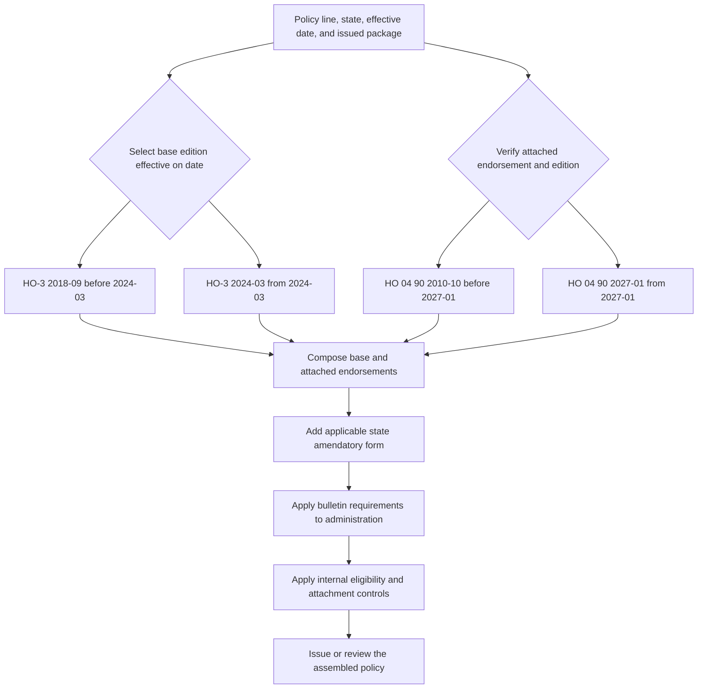

# Policy Assembly: Editions, Endorsements, and State Overlays

A policy position is assembled from documents with different jobs. Start with the issued policy package: the base form edition, Declarations, attached endorsements, and any applicable state amendatory form are contract authority. Bulletins are regulatory authority that constrains how the carrier files, issues, discloses, and administers the contract. Filing memoranda and training explain or teach; the underwriting manual and appetite guide constrain carrier action. None of those interpretive or internal documents changes the contract conclusion ([README, document families](repo://README.md#L15-L21), [README, authority model](repo://README.md#L35-L41), [Guidance Versus Contract Language](repo://training/guidance-versus-contract.md#L15-L23)).

## Authority layers and relationship vocabulary

| Document | Responsibility | Safe relationship to state |
| --- | --- | --- |
| Base form | Supplies the coverage grants, definitions, limits, exclusions, conditions, and settlement rules for its line and edition. | Read the edition that applies to the issued policy. |
| Attached endorsement | Changes the base policy only within its stated terms and only when attached. | The endorsement modifies the base form; unchanged terms remain applicable. ([HO 04 90 2027-01](repo://forms/HO/MS/HO-04-90/2027-01.md#L15-L39), [HO-3 2024-03](repo://forms/HO/MS/HO-3/2024-03.md#L683-L691)) |
| State amendatory form | Adds state-specific contract wording and a precedence rule for matters it addresses. | The state form implements the relevant bulletin; it is not the bulletin. ([HO 01 45 2022-01](repo://forms/HO/TX/HO-01-45/2022-01.md#L13-L23), [B-2021-08](repo://bulletins/TX/b-2021-08-windstorm-deductibles.md#L13-L27)) |
| Regulator bulletin | Constrains issuance, disclosure, filing, underwriting, rating, or claim administration. | It constrains the carrier, but does not create a deductible or coverage term absent from the policy ([B-2021-08](repo://bulletins/TX/b-2021-08-windstorm-deductibles.md#L19-L27), [B-2021-08](repo://bulletins/TX/b-2021-08-windstorm-deductibles.md#L63-L69)). |
| Filing memorandum and training | Explain an edition or teach a review method. | Interpretation only; they do not replace the filed form ([README](repo://README.md#L20-L21), [Choosing the Governing Edition](repo://training/choosing-the-governing-edition.md#L101-L107)). |
| Appetite guide and underwriting manual | Set eligibility, authority, referral, documentation, and attachment controls. | Internal guidance constrains binding or attachment; it does not alter coverage ([manual Rules 100.B-100.E](repo://manuals/underwriting/manual.md#L21-L43), [Texas appetite guide](repo://guidelines/appetite/tx-homeowners.md#L13-L35)). |

For a composed proposition, name the acting document first and use one of the repository’s directional verbs: `supersedes`, `writes back`, `preserves`, `modifies`, `implements`, or `constrains`. For example, **HO 04 90 2027-01 writes back HO-3 2024-03 X.8-X.9** only within its stated water-backup coverage, while **HO 04 90 2027-01 preserves HO-3 2024-03 terms** that it does not modify. Cite both documents whenever the proposition connects them ([HO 04 90 2027-01](repo://forms/HO/MS/HO-04-90/2027-01.md#L21-L39), [HO-3 2024-03](repo://forms/HO/MS/HO-3/2024-03.md#L683-L691)).

## Date-sensitive edition selection

Use the policy-effective date to select the candidate base and endorsement editions, then verify that the selected wording and endorsements were actually issued and attached. A later frozen authority does not rewrite an older policy: prior editions remain in force for policies written under them ([README, frozen authority](repo://README.md#L35-L37), [Choosing the Governing Edition](repo://training/choosing-the-governing-edition.md#L69-L79)).

For the representative HO-3 package:

- **HO-3 2018-09** is effective 2018-09-01 and is marked superseded by **HO-3 2024-03** for policies effective on or after 2024-03-01. **HO-3 2024-03 supersedes HO-3 2018-09** only at that boundary; the 2018-09 form remains live for policies written under it ([HO-3 2018-09](repo://forms/HO/MS/HO-3/2018-09.md#L1-L9), [HO-3 2024-03](repo://forms/HO/MS/HO-3/2024-03.md#L1-L7)).
- **HO 04 90 2010-10** is marked superseded by **HO 04 90 2027-01** for policies effective on or after 2027-01-01. **HO 04 90 2027-01 supersedes HO 04 90 2010-10** for that later interval; the 2010-10 wording remains the applicable edition for an earlier policy ([HO 04 90 2010-10](repo://forms/HO/MS/HO-04-90/2010-10.md#L1-L9), [HO 04 90 2027-01](repo://forms/HO/MS/HO-04-90/2027-01.md#L1-L7)).

The effective date is a selection rule, not permission to assume attachment. The endorsement training requires review of the request, insured, location, policy term, schedules, and complete package; a listed-but-missing endorsement needs correction or a reliable issued copy ([Attaching Endorsements Correctly](repo://training/attaching-endorsements.md#L65-L87), [Attaching Endorsements Correctly](repo://training/attaching-endorsements.md#L201-L215)). The 2027 endorsement itself says it is effective only when attached, forms part of the policy, and does not create a separate contract ([HO 04 90 2027-01](repo://forms/HO/MS/HO-04-90/2027-01.md#L15-L39)).

*This flow shows date-based edition selection, attachment verification, contract composition, state implementation, regulatory constraints, and separate internal controls.*

### Selection procedure

1. **Identify the transaction.** Record the line, state, policy-effective date, Declarations, issued form labels, and attached endorsements. If the labels conflict or an attachment is missing, preserve the uncertainty and obtain the issued package rather than choosing the wording that produces the preferred result ([Choosing the Governing Edition](repo://training/choosing-the-governing-edition.md#L109-L119), [Attaching Endorsements Correctly](repo://training/attaching-endorsements.md#L221-L227)).
2. **Select the base edition.** Choose the edition whose effective interval contains the policy-effective date. Do not substitute the current repository file for a superseded edition that governed the policy when written ([HO-3 2018-09](repo://forms/HO/MS/HO-3/2018-09.md#L1-L9), [HO-3 2024-03](repo://forms/HO/MS/HO-3/2024-03.md#L1-L7)).
3. **Select and verify each endorsement.** Match its edition and effective application to the transaction, confirm attachment, and read the endorsement with the base form. Attachment is required before the endorsement’s contract language can be used ([HO 04 90 2010-10](repo://forms/HO/MS/HO-04-90/2010-10.md#L13-L33), [HO 04 90 2027-01](repo://forms/HO/MS/HO-04-90/2027-01.md#L15-L39)).
4. **Add the state contract overlay.** Read the state form’s scope and precedence terms with the base form and endorsements. Texas HO 01 45 says a conflicting term in its section governs, a nonconflicting term remains applicable, and the amendatory terms do not provide coverage unless expressly provided ([HO 01 45 2022-01](repo://forms/HO/TX/HO-01-45/2022-01.md#L13-L23)).
5. **Apply the regulatory overlay to operations.** For Texas separate windstorm and hail deductibles, B-2021-08 requires clear identification, a stated trigger and calculation basis, policy-consistent application, supporting records, and at least 30 days’ written notice before a windstorm-deductible increase ([B-2021-08](repo://bulletins/TX/b-2021-08-windstorm-deductibles.md#L19-L27), [B-2021-08](repo://bulletins/TX/b-2021-08-windstorm-deductibles.md#L47-L71), [B-2021-08](repo://bulletins/TX/b-2021-08-windstorm-deductibles.md#L153-L171)).
6. **Run internal controls separately.** Before binding or renewing, apply delegated authority and referral rules, document the decision, and review every requested endorsement. Rule 400 requires supported, eligible, correctly matched attachments and referral for incomplete or conflicting information; it does not change the selected form’s coverage ([manual Rules 100.C-100.E](repo://manuals/underwriting/manual.md#L27-L43), [manual Rule 400](repo://manuals/underwriting/manual.md#L5089-L5129)).

## How contract documents compose

### Base form and water-backup endorsement

The base form’s exclusion is the starting point. HO-3 2018-09 excludes water or waterborne material backing up through sewers, drains, or sumps and sump discharge or overflow ([HO-3 2018-09 I.A A.16](repo://forms/HO/MS/HO-3/2018-09.md#L113-L121)). HO-3 2024-03 likewise excludes sewer, drain, and sump water while pointing to an attached water-backup endorsement as the exception ([HO-3 2024-03 X.8-X.9](repo://forms/HO/MS/HO-3/2024-03.md#L683-L691)). **HO 04 90 2027-01 writes back HO-3 2024-03 X.8-X.9** for direct physical loss caused by Water Backup or Sump Discharge or Overflow, subject to its terms and $10,000 limit; it **preserves HO-3 2024-03 exclusions** outside that stated scope. The endorsement excludes flood and surface water and does not create a separate contract ([HO 04 90 2027-01 W.0-W.1](repo://forms/HO/MS/HO-04-90/2027-01.md#L15-L81), [HO-3 2024-03 X.8-X.9](repo://forms/HO/MS/HO-3/2024-03.md#L683-L691)).

The 2010-10 endorsement has the same assembly boundary: it forms part of the policy, changes policy provisions only as expressly stated, and preserves other exclusions. Its water-backup limit is $5,000 and its endorsement deductible is $500 ([HO 04 90 2010-10 W.0-W.1](repo://forms/HO/MS/HO-04-90/2010-10.md#L13-L47), [HO 04 90 2010-10 W.2-W.3](repo://forms/HO/MS/HO-04-90/2010-10.md#L107-L119), [HO 04 90 2010-10 deductible](repo://forms/HO/MS/HO-04-90/2010-10.md#L175-L191)). **HO 04 90 2027-01 modifies the endorsement’s limit and deductible relative to HO 04 90 2010-10** to $10,000 and $1,000, but that comparison does not backdate the 2027 amounts to a policy carrying 2010-10 ([HO 04 90 2027-01 W.2-W.3](repo://forms/HO/MS/HO-04-90/2027-01.md#L139-L205), [HO 04 90 2010-10 metadata](repo://forms/HO/MS/HO-04-90/2010-10.md#L1-L9), [HO 04 90 2027-01 metadata](repo://forms/HO/MS/HO-04-90/2027-01.md#L1-L7)).

### Texas amendatory form and bulletin

A state form and a regulator bulletin are complementary but different. **HO 01 45 Texas 2022-01 implements Texas Bulletin B-2021-08** through a separate Windstorm and Hail Deductible shown in the Declarations, a 1%–10% contractual range, an applicable-limit calculation, and mixed-cause provisions ([HO 01 45 T.1-T.16](repo://forms/HO/TX/HO-01-45/2022-01.md#L59-L91), [B-2021-08 B.2.1-B.2.10](repo://bulletins/TX/b-2021-08-windstorm-deductibles.md#L47-L71)). **B-2021-08 constrains HO 01 45 and related policy communications** by requiring clear disclosure at application, issuance, and renewal, consistent records, policy-based claim application, and at least 30 days’ notice before a windstorm-deductible increase ([B-2021-08 B.1.3-B.1.6](repo://bulletins/TX/b-2021-08-windstorm-deductibles.md#L19-L27), [B-2021-08 B.3.9-B.3.18](repo://bulletins/TX/b-2021-08-windstorm-deductibles.md#L153-L171), [HO 01 45 T.1-T.5](repo://forms/HO/TX/HO-01-45/2022-01.md#L59-L71)). The bulletin’s regulatory thresholds must not be silently substituted for the contractual terms in the attached form.

### Memoranda, training, and internal guidance

The filing memorandum for HO-3 2018-09 describes revision reasons such as clarifying coverage conditions, exclusions, exceptions, valuation, deductibles, and insured responsibilities. It is interpretation, not a second policy form; the 2018 filed wording supplies the operative result ([HO-3 2018-09 memorandum](repo://memoranda/HO-3-2018-09.md#L13-L99), [HO-3 2018-09 form](repo://forms/HO/MS/HO-3/2018-09.md#L13-L39)). The HO-3 2024-03 memorandum likewise explains deductible wording and multi-cause handling, but the filed 2024-03 form remains the authority ([HO-3 2024-03 memorandum](repo://memoranda/HO-3-2024-03.md#L23-L31), [HO-3 2024-03 form](repo://forms/HO/MS/HO-3/2024-03.md#L15-L39)). The HO 04 90 2027-01 memorandum similarly explains changes made for clarity, organization, terminology, and deductible wording; it does not replace the 2027 endorsement’s coverage, limit, deductible, or exclusions ([HO 04 90 memorandum](repo://memoranda/HO-04-90-2027-01.md#L13-L31), [HO 04 90 2027-01](repo://forms/HO/MS/HO-04-90/2027-01.md#L41-L81)).

Training supports the review method: read the complete endorsement, compare it with the request and policy package, and escalate missing or conflicting material. It does not establish a live policy’s coverage ([Attaching Endorsements Correctly](repo://training/attaching-endorsements.md#L15-L23), [Choosing the Governing Edition](repo://training/choosing-the-governing-edition.md#L35-L49)). The appetite guide and manual operate before binding. **Manual Rule 400 constrains endorsement attachment** by requiring supported, eligible, correctly matched, complete, and intent-consistent requests; **the manual preserves the boundary that carrier-issued terms determine coverage** ([manual Rules 100.B-100.E](repo://manuals/underwriting/manual.md#L21-L43), [manual Rule 400.A-400.G](repo://manuals/underwriting/manual.md#L5091-L5129), [HO 04 90 2027-01](repo://forms/HO/MS/HO-04-90/2027-01.md#L15-L39)). For Texas, Rule 510 adds internal authority and risk controls: Coverage A up to $800,000 may be within line-underwriter authority, amounts through $1,200,000 require senior referral, water-backup limits over $25,000 require referral, a 15-year roof inspection is required, and the Texas address must be verified. These are not hidden policy limits ([manual Rule 510](repo://manuals/underwriting/manual.md#L6227-L6263)).

## Worked assemblies

These examples assume the listed forms are actually issued and attached. They demonstrate the selection method, not a substitute for the policy record.

### Texas HO-3 policy effective 2023-06-01

- **Base:** HO-3 2018-09, because the policy date precedes the 2024-03 boundary. **HO-3 2024-03 supersedes HO-3 2018-09** only for its later interval ([HO-3 2018-09](repo://forms/HO/MS/HO-3/2018-09.md#L1-L9), [HO-3 2024-03](repo://forms/HO/MS/HO-3/2024-03.md#L1-L7)).
- **Water backup:** HO 04 90 2010-10, because 2027-01 is not the applicable endorsement interval. **HO 04 90 2010-10 writes back HO-3 2018-09 I.A A.16** for its stated coverage and preserves policy exclusions not changed by the endorsement; use its $5,000 limit and $500 deductible ([HO-3 2018-09](repo://forms/HO/MS/HO-3/2018-09.md#L113-L121), [HO 04 90 2010-10](repo://forms/HO/MS/HO-04-90/2010-10.md#L13-L47), [HO 04 90 2010-10 limits and deductible](repo://forms/HO/MS/HO-04-90/2010-10.md#L107-L119)).
- **Texas overlay:** HO 01 45 2022-01, if attached, implements the Texas bulletin’s separate-deductible requirements. The bulletin constrains disclosure and administration but does not replace the form’s contractual wording ([HO 01 45](repo://forms/HO/TX/HO-01-45/2022-01.md#L59-L91), [B-2021-08](repo://bulletins/TX/b-2021-08-windstorm-deductibles.md#L19-L27)).
- **Pre-bind boundary:** the appetite guide and Rules 400 and 510 constrain eligibility, authority, referral, and attachment; they do not modify the HO-3 or HO 04 90 coverage terms ([Texas appetite guide](repo://guidelines/appetite/tx-homeowners.md#L13-L35), [manual Rule 400](repo://manuals/underwriting/manual.md#L5089-L5129), [manual Rule 510](repo://manuals/underwriting/manual.md#L6227-L6263)).

### Texas HO-3 policy effective 2027-02-01

- **Base:** HO-3 2024-03. **HO-3 2024-03 supersedes HO-3 2018-09** for this effective period; do not carry forward the older base wording ([HO-3 2024-03](repo://forms/HO/MS/HO-3/2024-03.md#L1-L7), [HO-3 2018-09 supersession](repo://forms/HO/MS/HO-3/2018-09.md#L8-L9)).
- **Water backup:** HO 04 90 2027-01, if attached. **HO 04 90 2027-01 writes back HO-3 2024-03 X.8-X.9** for the stated water-backup and sump events, preserves unmodified policy terms, and supplies the $10,000 limit and $1,000 deductible ([HO-3 2024-03](repo://forms/HO/MS/HO-3/2024-03.md#L683-L691), [HO 04 90 2027-01](repo://forms/HO/MS/HO-04-90/2027-01.md#L15-L81), [HO 04 90 2027-01 limits and deductible](repo://forms/HO/MS/HO-04-90/2027-01.md#L139-L205)).
- **Texas overlay and operations:** HO 01 45 2022-01 implements the state contract mechanism, B-2021-08 constrains disclosure and administration, and current internal guidance constrains binding and attachment. These layers remain distinct ([HO 01 45](repo://forms/HO/TX/HO-01-45/2022-01.md#L13-L23), [B-2021-08](repo://bulletins/TX/b-2021-08-windstorm-deductibles.md#L153-L171), [manual Rule 400](repo://manuals/underwriting/manual.md#L5091-L5129)).

## Failure checks

- **Wrong edition:** a quote, renewal, or claim file uses HO-3 2024-03 for a policy effective before 2024-03-01, or HO 04 90 2027-01 before 2027-01-01. Re-select by the transaction and preserve the older frozen edition ([README](repo://README.md#L35-L37), [Choosing the Governing Edition](repo://training/choosing-the-governing-edition.md#L251-L265)).
- **Unattached write-back:** someone applies HO 04 90 coverage because the title or schedule appears in a system, without confirming the endorsement is attached. Obtain the complete issued package; the endorsement’s attachment is part of its contract boundary ([Attaching Endorsements Correctly](repo://training/attaching-endorsements.md#L81-L87), [HO 04 90 2027-01](repo://forms/HO/MS/HO-04-90/2027-01.md#L15-L39)).
- **Authority inversion:** an adjuster or underwriter uses a bulletin, memorandum, training page, appetite guide, or manual as though it changes the contract. Return to the applicable issued form and endorsement; use the other document for its regulatory, interpretive, or internal function ([Guidance Versus Contract Language](repo://training/guidance-versus-contract.md#L73-L83), [manual Rule 100.D](repo://manuals/underwriting/manual.md#L33-L37)).
- **Regulatory-contract mismatch:** a Texas separate deductible appears in declarations or communications without a supporting policy provision, trigger, calculation basis, and record. B-2021-08 requires consistency and prohibits applying a deductible not permitted by the policy ([B-2021-08](repo://bulletins/TX/b-2021-08-windstorm-deductibles.md#L19-L27), [B-2021-08](repo://bulletins/TX/b-2021-08-windstorm-deductibles.md#L63-L89)).

For line-specific editions, continue to [HO-3 forms](/openwiki/coverage/forms/ho-3.md). For state requirements, see [Texas state overlays](/openwiki/state-overlays/texas.md). For internal attachment and referral decisions, see [endorsements and deductibles](/openwiki/underwriting/manual/endorsements-and-deductibles.md) and keep those decisions separate from the contract analysis.
