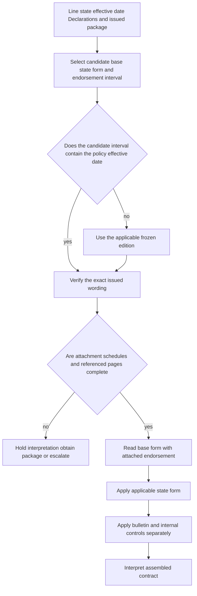

# Editions, Endorsements, and State Attachments

A coverage conclusion begins with the **issued contract package**, not the newest file in the repository. Assemble the applicable base form, Declarations, attached endorsements, schedules, referenced pages, and state amendatory form. Keep regulatory bulletins, filing memoranda, training, underwriting manuals, and appetite guidance in their separate authority roles: a bulletin **constrains** carrier operations, a state form **implements** a regulatory requirement in contract wording, an endorsement **modifies** the base form only within its terms, and internal guidance **constrains** binding or attachment. None of those interpretive or internal documents silently changes the issued contract ([README](repo://README.md#L15-L21), [README authority model](repo://README.md#L35-L41), [Guidance Versus Contract Language](repo://training/guidance-versus-contract.md#L15-L23)).

## Entry gate: route before interpreting coverage

Route by line, state, policy-effective date, Declarations, complete issued package, and applicable state form. Repository paths help locate candidate wording; they do not prove that wording was issued. Treat a schedule or system label as an index. A listed-but-missing endorsement requires the complete package or a reliable issued copy; an attached-but-unlisted form must be reconciled to the policy record ([README layout](repo://README.md#L13-L31), [Attaching Endorsements Correctly](repo://training/attaching-endorsements.md#L65-L87)).

Do not interpret water-backup coverage while the package is incomplete or the form cannot be tied to the insured, term, location, and property. Record the uncertainty and obtain or escalate the missing evidence rather than selecting the wording that produces the preferred result ([Choosing the Governing Edition](repo://training/choosing-the-governing-edition.md#L109-L119), [Attaching Endorsements Correctly](repo://training/attaching-endorsements.md#L193-L215)).

```mermaid
flowchart TD
    A["Line state effective date Declarations and issued package"] --> B["Select candidate base state form and endorsement interval"]
    B --> C{"Does the candidate interval contain the policy effective date"}
    C -->|"no"| D["Use the applicable frozen edition"]
    C -->|"yes"| E["Verify the exact issued wording"]
    D --> E
    E --> F{"Are attachment schedules and referenced pages complete"}
    F -->|"no"| G["Hold interpretation obtain package or escalate"]
    F -->|"yes"| H["Read base form with attached endorsement"]
    H --> I["Apply applicable state form"]
    I --> J["Apply bulletin and internal controls separately"]
    J --> K["Interpret assembled contract"]
```

*This flow shows date routing, package verification, contract composition, and the separate state, regulatory, and internal control layers.*

## Authority and relationship rules

| Document | Role | Relationship rule |
| --- | --- | --- |
| Base form | Supplies the line’s grants, definitions, exclusions, limits, conditions, and settlement rules. | Read the edition governing the policy-effective date. |
| Attached endorsement | Changes the base policy within its stated terms. | The endorsement **modifies** the base form; unchanged terms remain applicable. ([HO 04 90 2027-01](repo://forms/HO/MS/HO-04-90/2027-01.md#L16-L36), [HO-3 2024-03](repo://forms/HO/MS/HO-3/2024-03.md#L593-L597)) |
| State amendatory form | Adds state-specific contract wording and precedence for matters it addresses. | The state form **implements** the relevant bulletin; it is not the bulletin. ([HO 01 45](repo://forms/HO/TX/HO-01-45/2022-01.md#L13-L23), [B-2021-08](repo://bulletins/TX/b-2021-08-windstorm-deductibles.md#L13-L27)) |
| Regulator bulletin | Constrains filing, disclosure, issuance, rating, underwriting, or administration. | It **constrains** the carrier and does not create a deductible or coverage term absent from the policy ([B-2021-08](repo://bulletins/TX/b-2021-08-windstorm-deductibles.md#L19-L27)). |
| Memorandum and training | Explain wording or teach review method. | Interpretation only; they do not replace the filed form ([Choosing the Governing Edition](repo://training/choosing-the-governing-edition.md#L101-L107)). |
| Manual and appetite guide | Set eligibility, authority, referral, documentation, and attachment controls. | They **constrain** operations; they do not alter coverage ([manual](repo://manuals/underwriting/manual.md#L21-L43)). |

For a composed proposition, name the acting document and use directional vocabulary such as `supersedes`, `writes back`, `preserves`, `modifies`, `implements`, or `constrains`. Cite both documents whenever the proposition connects them. For example, an attached HO 04 90 endorsement **writes back** the applicable HO-3 water exclusion only within its stated coverage and **preserves** terms it does not modify ([HO 04 90 2027-01](repo://forms/HO/MS/HO-04-90/2027-01.md#L26-L36), [HO-3 2024-03](repo://forms/HO/MS/HO-3/2024-03.md#L593-L597)).

## Edition selection: interval first, attachment second

Use the policy-effective date to select the candidate edition, then independently verify that the exact endorsement was issued and attached. Do not infer attachment from an edition date. A later edition does not rewrite an older policy; an older edition remains relevant to policies written under its interval ([README frozen authority](repo://README.md#L35-L37), [Attaching Endorsements Correctly](repo://training/attaching-endorsements.md#L65-L87)).

### HO 04 90 intervals and differences

- **2010-10:** effective 2010-10-01 and superseded for policies effective on or after 2027-01-01. It attaches to and forms part of the policy, changes provisions only as expressly stated, and preserves other exclusions. Its cited water-backup limit is $5,000 and deductible is $500 ([HO 04 90 2010-10](repo://forms/HO/MS/HO-04-90/2010-10.md#L1-L9), [attachment](repo://forms/HO/MS/HO-04-90/2010-10.md#L13-L33), [limit and deductible](repo://forms/HO/MS/HO-04-90/2010-10.md#L107-L113)).
- **2026-01:** the newly present multistate endorsement says it replaces 2010-10 for policies written on or after 2026-01-01. It covers direct physical loss from sewer or drain backup and sump discharge or overflow, has a $10,000 per-policy-period sublimit unless a higher Declarations limit applies, and has a separate $1,000 deductible. It adds a finished-below-grade backflow-prevention requirement: a backwater valve or equivalent device must have been installed and operable at the time of loss. That requirement is expressly new in this edition and absent from 2010-10 ([HO 04 90 2026-01](repo://forms/HO/MS/HO-04-90/2026-01.md#L1-L4), [coverage and limits](repo://forms/HO/MS/HO-04-90/2026-01.md#L6-L23), [exclusions and maintenance](repo://forms/HO/MS/HO-04-90/2026-01.md#L25-L40), [backflow requirement](repo://forms/HO/MS/HO-04-90/2026-01.md#L42-L47)).
- **2027-01:** effective 2027-01-01, and the repository marks it as the later edition for that interval. It is a materially different endorsement: it is effective only when attached, forms part of the policy, and is construed with the policy rather than creating a separate contract. It provides a $10,000 limit in its operative limit section and has its own extensive conditions and exclusions ([HO 04 90 2027-01 metadata](repo://forms/HO/MS/HO-04-90/2027-01.md#L1-L7), [attachment boundary](repo://forms/HO/MS/HO-04-90/2027-01.md#L14-L60), [limit](repo://forms/HO/MS/HO-04-90/2027-01.md#L254-L282)).

The 2026-01 file’s “written on or after” wording and the 2027-01 effective metadata are not permission to substitute one for the other. For a 2026 policy, test the issued package for 2026-01; for a 2027 policy, test the issued package for 2027-01; for an earlier policy, retain 2010-10 when that is the issued applicable edition. If the repository’s edition metadata, policy record, or package conflicts, escalate rather than infer an interval or attachment.

## Assembly procedure

1. **Identify the transaction.** Record line, state, policy-effective date, insured, location, Declarations, base form, endorsements, schedules, and referenced pages.
2. **Select the base.** Choose the edition whose effective interval contains the policy-effective date; do not use the current file merely because it is newer ([HO-3 2018-09](repo://forms/HO/MS/HO-3/2018-09.md#L1-L9), [HO-3 2024-03](repo://forms/HO/MS/HO-3/2024-03.md#L1-L7)).
3. **Verify attachment.** Confirm the endorsement is in the complete issued package, matches the insured, term, location, and property, and has any required schedule completed. Attachment is a contract boundary, not a date inference ([HO 04 90 2010-10](repo://forms/HO/MS/HO-04-90/2010-10.md#L13-L33), [HO 04 90 2027-01](repo://forms/HO/MS/HO-04-90/2027-01.md#L16-L36)).
4. **Compose the wording.** Read the attached endorsement with the base form. The endorsement **modifies** only what it states and **preserves** unmodified policy terms; apply its limit, deductible, conditions, and exclusions.
5. **Apply the state contract overlay.** Read the applicable state form’s scope and precedence with the base and endorsement. A state form may control conflicts in matters it addresses while preserving compatible provisions ([HO 01 45](repo://forms/HO/TX/HO-01-45/2022-01.md#L13-L23)).
6. **Keep operations separate.** Apply bulletins to disclosure and administration and manuals to eligibility, authority, referral, and attachment. They **constrain** operations but do not rewrite the assembled contract ([B-2021-08](repo://bulletins/TX/b-2021-08-windstorm-deductibles.md#L47-L73), [manual Rule 400](repo://manuals/underwriting/manual.md#L5089-L5129)).

## Worked water-backup assemblies

These examples assume the named forms are actually issued and attached.

### Policy effective 2025-06-01

Use the applicable HO-3 base for that policy and do not select HO 04 90 2026-01 solely because it is present in the repository. If the issued package contains 2010-10, its $5,000 limit and $500 deductible govern. If the record instead identifies another filed edition, reconcile the package before interpreting the claim ([HO 04 90 2010-10](repo://forms/HO/MS/HO-04-90/2010-10.md#L1-L9), [attachment](repo://forms/HO/MS/HO-04-90/2010-10.md#L13-L33)).

### Policy effective 2026-06-01

First verify that 2026-01 is the issued attached endorsement. If so, apply its $10,000 sublimit unless the Declarations show a higher endorsement limit, its separate $1,000 deductible, its stated exclusions, and—where the premises has finished below-grade area—the operable backwater valve or equivalent requirement. Do not import the 2027-01 wording or assume attachment from the date ([HO 04 90 2026-01](repo://forms/HO/MS/HO-04-90/2026-01.md#L13-L23), [backflow requirement](repo://forms/HO/MS/HO-04-90/2026-01.md#L42-L47)).

### Policy effective 2027-02-01

Verify and use 2027-01 only if it is attached. Read it with the applicable HO-3 base: it **modifies** conflicting policy terms, **preserves** unmodified terms, and supplies its own $10,000 limit and extensive claim conditions. The attachment does not create a separate contract ([HO 04 90 2027-01](repo://forms/HO/MS/HO-04-90/2027-01.md#L26-L60), [limit and coverage](repo://forms/HO/MS/HO-04-90/2027-01.md#L254-L282)).

## Failure checks

- **Date substitution:** using 2026-01 or 2027-01 because it is newer, without checking the policy-effective date and issued package.
- **Attachment inference:** applying any HO 04 90 coverage because a system label or edition date exists. Obtain the complete package ([Attaching Endorsements Correctly](repo://training/attaching-endorsements.md#L81-L87)).
- **2026 control omitted:** failing to test the finished-below-grade backflow-prevention requirement when 2026-01 is the attached edition ([HO 04 90 2026-01](repo://forms/HO/MS/HO-04-90/2026-01.md#L42-L47)).
- **Authority inversion:** using a bulletin, memorandum, training page, manual, or appetite guide as though it changes coverage. Return to the applicable issued form and endorsement ([Guidance Versus Contract Language](repo://training/guidance-versus-contract.md#L73-L83)).
- **Composed proposition under-cited:** when saying an endorsement writes back or modifies a base exclusion, cite both the endorsement and base form.

For line-specific base editions, see [HO-3 forms](/openwiki/coverage/forms/ho-3.md). For loss analysis, see [water-loss handling](/openwiki/claims/guidelines/water-loss-handling.md) and [water-backup coverage](/openwiki/coverage/perils/water-backup.md).
