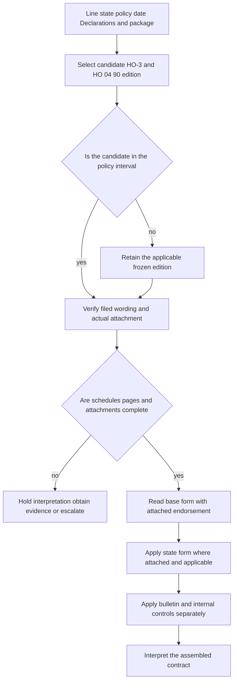

# Policy Assembly, Editions, and State Attachments

A coverage analysis starts with the issued policy package, not with a training summary or memorandum. Identify the line, state, policy-effective date, Declarations, base form, attached endorsements, schedules, referenced pages, and applicable state amendatory form. The filed form supplies contract wording; bulletins constrain carrier operations; memoranda and training explain; underwriting guidance constrains binding and attachment. None of the latter documents overrides the issued contract ([README, authority model](repo://README.md#L13-L41), [Guidance Versus Contract](repo://training/guidance-versus-contract.md#L15-L23)).

## The assembly boundary

| Document | Role in the assembled result |
| --- | --- |
| Base HO-3 form | Supplies grants, definitions, exclusions, conditions, limits, and settlement rules for its edition. |
| Attached endorsement | **Modifies** the base form only within its stated terms and only when actually attached; it **preserves** terms it does not change. |
| State amendatory form | **Modifies** the contract on the state-specific subjects it addresses and **implements** the relevant filed regulatory requirement; compatible base terms remain applicable. |
| Regulator bulletin | **Constrains** filing, disclosure, issuance, records, rating, or administration; it does not create a policy term absent from the contract. |
| Memorandum or training | Explains or teaches; it does not override the filed form. |
| Manual or appetite guide | **Constrains** eligibility, authority, referral, documentation, and attachment decisions; it does not alter coverage. |

Use only these directional relationships when describing composition: `supersedes`, `writes back`, `preserves`, `modifies`, `implements`, and `constrains`. Name the acting document first. For example, “HO 04 90 2026-01 modifies the applicable HO-3 water exclusion within its stated scope” is safer than saying that a bulletin or memorandum “adds” coverage.

### Entry gate

A schedule or system label is an index, not the operative endorsement language. A listed-but-missing form requires the complete package or a reliable issued copy; an attached-but-unlisted form must be reconciled to the policy record. Match each attachment to the named insured, policy term, location, and insured property ([Attaching Endorsements Correctly](repo://training/attaching-endorsements.md#L65-L107), [Attaching Endorsements Correctly](repo://training/attaching-endorsements.md#L193-L227)). If the package is incomplete, labels conflict, or an attachment cannot be tied to the risk, hold the interpretation, document the uncertainty, and obtain or escalate the missing evidence rather than selecting the wording that produces the preferred result ([Choosing the Governing Edition](repo://training/choosing-the-governing-edition.md#L109-L119)).

## Selecting HO 04 90 2026-01

The policy-effective date selects a candidate edition; it does **not** prove that the endorsement was attached. The 2026-01 endorsement is a multistate HO-3 endorsement that replaces 2010-10 for policies written on or after 2026-01-01 ([HO 04 90 2026-01](repo://forms/HO/MS/HO-04-90/2026-01.md#L1-L4)). Therefore:

- For a policy written before 2026-01-01, retain HO 04 90 2010-10 if that is the issued endorsement; do not backdate 2026 wording.
- For a policy written on or after 2026-01-01, route to HO 04 90 2026-01 as the candidate edition, then verify the complete issued package and any completed Declarations entry.
- Do not substitute HO 04 90 2027-01 merely because it is newer. The 2027 form is a later edition and applies only in its own effective interval ([HO 04 90 2027-01](repo://forms/HO/MS/HO-04-90/2027-01.md#L1-L7)).

The 2026 form’s material changes from 2010-10 must be read from the filed text, not inferred from the title: it provides a $10,000 per-policy-period sublimit unless a higher Declarations limit applies, uses a separate $1,000 deductible, and makes the Section I deductible inapplicable to covered loss under the endorsement ([HO 04 90 2026-01](repo://forms/HO/MS/HO-04-90/2026-01.md#L6-L23)). It also adds a maintenance condition for a known, unreasonable failure to remedy the serving sewer, drain, sump, or pump and a backflow-prevention requirement for a finished below-grade area; the latter is expressly new compared with 2010-10 ([HO 04 90 2026-01](repo://forms/HO/MS/HO-04-90/2026-01.md#L35-L47)). Those provisions are contract terms only if this edition was issued and attached.

```mermaid
flowchart TD
    A["Line state policy date Declarations and package"] --> B["Select candidate HO-3 and HO 04 90 edition"]
    B --> C{"Is the candidate in the policy interval"}
    C -->|"no"| D["Retain the applicable frozen edition"]
    C -->|"yes"| E["Verify filed wording and actual attachment"]
    D --> E
    E --> F{"Are schedules pages and attachments complete"}
    F -->|"no"| G["Hold interpretation obtain evidence or escalate"]
    F -->|"yes"| H["Read base form with attached endorsement"]
    H --> I["Apply state form where attached and applicable"]
    I --> J["Apply bulletin and internal controls separately"]
    J --> K["Interpret the assembled contract"]
```

*This flow separates date selection from proof of attachment and keeps contract composition distinct from regulatory and internal controls.*

## Selection and verification procedure

1. **Identify the transaction.** Record line, state, effective date, Declarations, issued form labels, schedules, referenced pages, and the complete attachment package.
2. **Select the base edition.** Use the edition whose effective interval contains the policy-effective date. A later edition supersedes an earlier one only at the stated boundary; it does not rewrite an older policy ([Choosing the Governing Edition](repo://training/choosing-the-governing-edition.md#L69-L79)).
3. **Select the endorsement candidate.** For HO 04 90, use 2010-10 before 2026-01-01, 2026-01 from 2026-01-01 until the later edition’s boundary, and 2027-01 only in its later interval. Treat this as routing, not proof of attachment.
4. **Verify attachment.** Confirm the endorsement pages, schedule, Declarations entry, insured, term, location, and property. Read the entire form, including completed selections and referenced policy provisions. A title or system listing alone cannot establish the endorsement’s contract effect ([Attaching Endorsements Correctly](repo://training/attaching-endorsements.md#L81-L107), [Attaching Endorsements Correctly](repo://training/attaching-endorsements.md#L173-L215)).
5. **Apply the state contract form.** Read its scope and precedence wording with the base and endorsements. Texas HO 01 45 gives its conflicting term precedence, reads compatible provisions together, and does not provide coverage unless expressly stated ([HO 01 45 2022-01](repo://forms/HO/TX/HO-01-45/2022-01.md#L13-L23)).
6. **Apply non-contract controls separately.** A bulletin constrains disclosure and administration; the manual and appetite guide constrain eligibility, authority, referral, and attachment. None changes the selected form’s coverage ([B-2021-08](repo://bulletins/TX/b-2021-08-windstorm-deductibles.md#L19-L27), [Manual Rule 400](repo://manuals/underwriting/manual.md#L5089-L5129)).

## HO-3 water exclusions and the 2026 endorsement

The applicable HO-3 exclusion remains the starting point. HO-3 2024-03 excludes flood and surface water and separately excludes sewer, drain, and sump water in X.7-X.9; X.8 identifies an attached water-backup endorsement as the exception ([HO-3 2024-03](repo://forms/HO/MS/HO-3/2024-03.md#L591-L601)). When actually attached, HO 04 90 2026-01 **writes back** coverage for direct physical loss caused by sewer or drain backup and sump, sump-pump, or related-equipment discharge or overflow ([HO 04 90 2026-01](repo://forms/HO/MS/HO-04-90/2026-01.md#L6-L11)). It **preserves** the HO-3 flood, surface-water, and below-surface-water exclusions: W.4 continues A.1 and A.2 in full ([HO 04 90 2026-01](repo://forms/HO/MS/HO-04-90/2026-01.md#L25-L33)).

The 2026 endorsement’s write-back is limited, not a general water grant. It is subject to the $10,000 sublimit or higher Declarations limit, the $1,000 separate deductible, maintenance condition, backflow-prevention requirement where applicable, and the endorsement’s loss-settlement language ([HO 04 90 2026-01](repo://forms/HO/MS/HO-04-90/2026-01.md#L13-L23), [HO 04 90 2026-01](repo://forms/HO/MS/HO-04-90/2026-01.md#L35-L54)). “Water backup” therefore does not include flood or surface water merely because the event also involves a drain or sump.

## Conflict, unchanged terms, and supersession

Resolve overlap from operative wording, not from a memorandum, training module, title, or preferred outcome. The endorsement modifies only what it says; “all other provisions” remain applicable in the 2026 text ([HO 04 90 2026-01](repo://forms/HO/MS/HO-04-90/2026-01.md#L49-L56)). Thus, the endorsement **preserves** unmodified HO-3 definitions, conditions, exclusions, and settlement rules, while its stated water-backup grant, limitations, deductible, and conditions control where they address the same subject.

For multiple endorsements, compare grants, exclusions, definitions, conditions, limits, deductibles, schedules, and effective dates as one package. Do not stack the broadest sentence from each form. If duplicate, unsupported, or irreconcilable attachments remain, correct or escalate before a final coverage conclusion ([Attaching Endorsements Correctly](repo://training/attaching-endorsements.md#L173-L215), [Attaching Endorsements Correctly](repo://training/attaching-endorsements.md#L501-L517)). Manual rules **constrain** whether an endorsement may be attached; they do not resolve a contract conflict.

A memorandum may explain why the 2026 edition changed, and training may describe the review method, but the filed 2026 form **supersedes** neither source. If either conflicts with the filed wording, the filed wording controls ([README](repo://README.md#L20-L21), [Choosing the Governing Edition](repo://training/choosing-the-governing-edition.md#L101-L107)).

## Worked date examples

### Policy effective 2025-06-01

Use the applicable older HO-3 edition and HO 04 90 2010-10 if that is the issued attachment. Do not use the 2026 $10,000 limit, $1,000 deductible, or new backflow condition. The effective date of a later form does not backdate its terms.

### Policy effective 2026-06-01

Route to HO 04 90 2026-01, but use its coverage only after confirming it is attached. If attached, it writes back the specified sewer/drain backup and sump discharge or overflow coverage, preserves the HO-3 A.1/A.2 water exclusions, and applies its $10,000-or-Declarations sublimit, $1,000 deductible, and conditions. If it is listed but missing, hold the conclusion and obtain the issued copy.

### Policy effective 2027-02-01

Do not automatically carry forward 2026-01. Route to the 2027-01 candidate and verify the actual package. Read that later filed form with the applicable HO-3 edition; compare its operative terms rather than assuming that the 2026 limits or conditions continue.

## Failure checks

- **Wrong edition:** a later form is used for an earlier policy. Re-select by effective interval and preserve the older frozen wording.
- **Unattached write-back:** coverage is applied because a schedule or system label names HO 04 90. Obtain the complete issued package.
- **Training override:** a memorandum or module is treated as contract wording. Return to the filed form.
- **Water-exclusion overreach:** flood, surface water, or below-surface water is treated as covered water backup. Apply the endorsement’s express preserved exclusions.
- **Incomplete conditions:** the $1,000 deductible, sublimit, maintenance condition, or below-grade backflow requirement is omitted from the analysis of an attached 2026 endorsement.
- **Regulatory-contract mismatch:** a bulletin’s disclosure or deductible requirement is substituted for the contractual wording. Keep the bulletin’s operational constraint separate from the policy term.

For line-specific material, see [HO-3 forms](/openwiki/coverage/forms/ho-3.md). For operational attachment and referral decisions, see [endorsements and deductibles](/openwiki/underwriting/manual/endorsements-and-deductibles.md).
