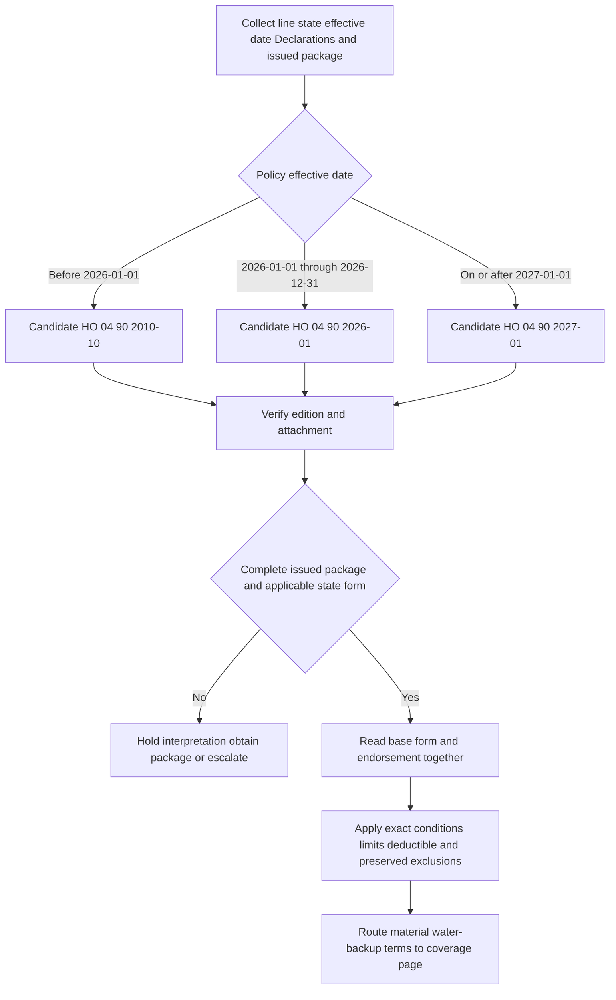

# Editions, Endorsements, and State Attachments

A policy conclusion starts with the **issued policy package**, not the newest file in the repository. Treat the base form and edition, policy-effective date, Declarations, attached endorsement, referenced schedules and pages, and applicable state amendatory form as the contract-assembly inputs. Bulletins constrain regulatory operations; memoranda and training explain or teach; underwriting guidance controls internal authority and attachment. None of those documents overrides the wording of an issued form ([README](repo://README.md#L13-L41), [guidance versus contract](repo://training/guidance-versus-contract.md#L15-L23)).

## Edition selection: HO 04 90

The three repository editions are a dated sequence, not interchangeable descriptions:

| Edition | Selection boundary | Material provisions to route onward |
| --- | --- | --- |
| **2010-10** | Effective 2010-10-01; remains applicable to policies written under it. It is superseded for policies effective on or after 2027-01-01. | Direct physical loss from sewer or drain backup, or sump discharge/overflow; **$5,000** limit and **$500** endorsement deductible. Its legacy exclusions and conditions remain controlling for that package ([form](repo://forms/HO/MS/HO-04-90/2010-10.md#L1-L9), [coverage and limit](repo://forms/HO/MS/HO-04-90/2010-10.md#L35-L47), [deductible](repo://forms/HO/MS/HO-04-90/2010-10.md#L107-L113), [deductible terms](repo://forms/HO/MS/HO-04-90/2010-10.md#L157-L167)). |
| **2026-01** | Multistate edition replacing 2010-10 for policies written on or after 2026-01-01. Do not skip it merely because 2027-01 exists. | Direct physical loss to Coverage A, B, and C property; **$10,000** per-policy-period sublimit unless a higher Declarations limit applies; **$1,000** separate deductible per loss. It adds a maintenance condition and, for finished below-grade areas, requires an installed and operable backwater valve or equivalent device ([form](repo://forms/HO/MS/HO-04-90/2026-01.md#L1-L4), [coverage and limit](repo://forms/HO/MS/HO-04-90/2026-01.md#L6-L18), [deductible](repo://forms/HO/MS/HO-04-90/2026-01.md#L20-L23), [conditions](repo://forms/HO/MS/HO-04-90/2026-01.md#L35-L47)). |
| **2027-01** | Effective 2027-01-01; supersedes 2010-10 for that later interval. Select it only when the policy date and issued package support it. | Direct physical loss from defined Water Backup or Sump Discharge or Overflow, **$10,000** limit and **$1,000** deductible, with extensive maintenance, failed-system, source-water, mitigation, and below-grade backwater-valve provisions ([form attachment boundary](repo://forms/HO/MS/HO-04-90/2027-01.md#L14-L39), [coverage](repo://forms/HO/MS/HO-04-90/2027-01.md#L62-L117), [limit](repo://forms/HO/MS/HO-04-90/2027-01.md#L254-L265), [deductible](repo://forms/HO/MS/HO-04-90/2027-01.md#L391-L407)). |

The 2026-01 and 2027-01 amounts happen to be similar, but their wording and effective boundaries are not interchangeable. The effective date selects a candidate; the issued attachment proves that the endorsement became part of the contract. A system label, quote, or schedule entry is not a substitute for the complete issued form ([attaching endorsements](repo://training/attaching-endorsements.md#L65-L87)).

```mermaid
flowchart TD
  A["Collect line state effective date Declarations and issued package"] --> B{"Policy effective date"}
  B -->|"Before 2026-01-01"| C["Candidate HO 04 90 2010-10"]
  B -->|"2026-01-01 through 2026-12-31"| D["Candidate HO 04 90 2026-01"]
  B -->|"On or after 2027-01-01"| E["Candidate HO 04 90 2027-01"]
  C --> F["Verify edition and attachment"]
  D --> F
  E --> F
  F --> G{"Complete issued package and applicable state form"}
  G -->|"No"| H["Hold interpretation obtain package or escalate"]
  G -->|"Yes"| I["Read base form and endorsement together"]
  I --> J["Apply exact conditions limits deductible and preserved exclusions"]
  J --> K["Route material water-backup terms to coverage page"]
```

*This decision flow selects the HO 04 90 candidate by effective date, then requires package verification before applying the endorsement’s terms.*

## Assembly procedure and precedence

1. **Identify the contract instance.** Record the line and state, effective date, named insured, location and property, Declarations, base-form edition, endorsement edition, schedules, referenced pages, and the complete issued package.
2. **Select by date, then verify issuance.** Use the effective interval above. A later edition does not rewrite an earlier policy; a candidate endorsement does not apply unless the issued package establishes attachment ([choosing the governing edition](repo://training/choosing-the-governing-edition.md#L69-L79), [attachment controls](repo://training/attaching-endorsements.md#L193-L227)).
3. **Read the acting endorsement with its base form.** An attached endorsement modifies only what it says. Unmodified policy terms and exclusions remain in force. HO-3 2024-03, for example, excludes sewer, drain, and sump water while identifying an attached water-backup endorsement as the exception ([HO-3 2024-03](repo://forms/HO/MS/HO-3/2024-03.md#L591-L601)).
4. **Apply the state amendatory form separately.** A state form supplies contractual state wording and its stated precedence rule; it is not the bulletin. For Texas, HO 01 45 gives its conflicting terms precedence, preserves compatible provisions, and does not provide coverage unless it expressly does so ([HO 01 45](repo://forms/HO/TX/HO-01-45/2022-01.md#L13-L23)).
5. **Apply regulatory and internal controls without changing coverage.** Bulletins govern disclosure or administration; manuals and appetite rules govern eligibility, referral, and attachment. They cannot manufacture a limit or write back an exclusion ([README](repo://README.md#L35-L41), [manual](repo://manuals/underwriting/manual.md#L21-L43)).

If labels conflict, an attachment is missing, a schedule is incomplete, or the form cannot be tied to the insured, term, location, and property, stop the coverage interpretation and obtain the reliable issued copy or escalate. Do not select the wording that produces the preferred result ([choosing the governing edition](repo://training/choosing-the-governing-edition.md#L109-L119)).

## Route material terms to the water-backup page

This page establishes **which endorsement governs**; it is not a substitute for the endorsement’s operative provisions. After selecting and proving attachment, route the claim or underwriting question to [Water Backup and Sump Overflow](../coverage/perils/water-backup.md), which compares the editions and explains the event definitions, covered property, limits, deductibles, duties, and preserved exclusions. Always return to the exact acting form for the contract conclusion:

- For **2010-10**, use the $5,000 limit, $500 deductible, and its own accidental-event, precipitation, flood, subsurface-water, seepage, maintenance, and failed-equipment boundaries ([form provisions](repo://forms/HO/MS/HO-04-90/2010-10.md#L77-L105), [limit and deductible](repo://forms/HO/MS/HO-04-90/2010-10.md#L107-L113)).
- For **2026-01**, use the $10,000 per-policy-period sublimit unless Declarations show higher, the $1,000 deductible, its maintenance condition, and the below-grade backflow-prevention requirement ([form](repo://forms/HO/MS/HO-04-90/2026-01.md#L13-L47)).
- For **2027-01**, use the exact Water Backup and Sump Discharge or Overflow provisions, $10,000 limit, $1,000 per-loss deductible, maintenance and backwater-valve conditions, and exclusions that remain under the endorsement and base policy ([form coverage and exclusions](repo://forms/HO/MS/HO-04-90/2027-01.md#L62-L117), [limit and deductible](repo://forms/HO/MS/HO-04-90/2027-01.md#L254-L321), [conditions](repo://forms/HO/MS/HO-04-90/2027-01.md#L851-L861)).

Memoranda may explain why 2027-01 changed its limit, deductible, and below-grade requirement, but the attached form controls ([memorandum](repo://memoranda/HO-04-90-2027-01.md#L143-L151)).

## Failure checks

- **Wrong edition:** applying 2027-01 to a 2026 policy, or applying 2026-01 to a pre-2026 policy. Re-select by effective date and preserve the older frozen wording.
- **Edition skipped:** treating 2010-10 as followed immediately by 2027-01. Check the 2026-01 multistate form for policies written on or after 2026-01-01.
- **Unattached write-back:** relying on a title, schedule, or system code without the issued endorsement. Obtain the package.
- **Term substitution:** importing the $10,000/$1,000 figures from one edition, memorandum, training page, or bulletin into another edition. Read the acting form and Declarations.
- **Preserved-exclusion error:** assuming an endorsement covers flood, surface water, subsurface water, failed equipment, maintenance, or loss of use merely because water was present. Route to the water-backup page and then apply the exact endorsement and base-form provisions.
