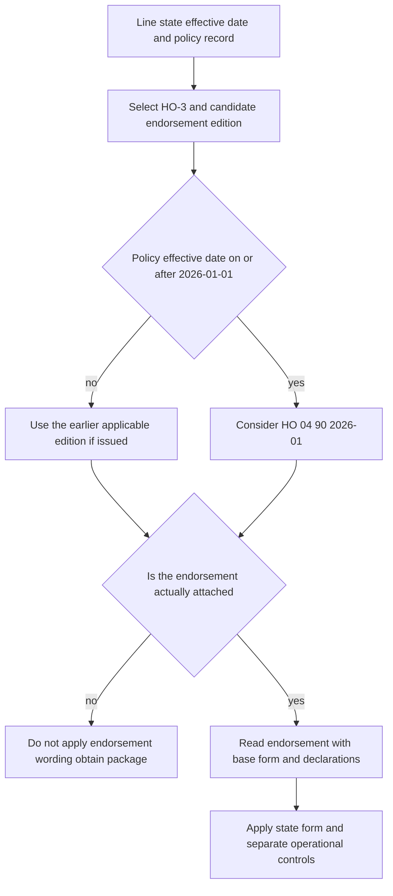

# Policy Editions and State Attachments

<!-- openwiki: broken internal link [../quickstart.md#L128-L140] heading anchor "L128-L140" does not exist in "../quickstart.md". Fix the href or restore the target, then delete this comment. -->
A coverage answer starts with the **issued package**, not the newest form in the repository. Identify the line, state, policy-effective date, Declarations, base form, complete endorsement package, schedules, and applicable state form before interpreting the loss. The applicable issued wording and policy-effective date govern; a later edition may supersede an earlier edition for a later interval, but it does not backdate its wording ([Quickstart](../quickstart.md#L128-L140), [governing-edition training](repo://training/choosing-the-governing-edition.md#L61-L83)).

## Where HO 04 90 2026-01 fits

HO 04 90 2026-01 is a multistate water-backup and sump-discharge endorsement for HO-3. Its source metadata says it attaches to HO-3, modifies Section I—Exclusions A.3, and replaces HO 04 90 2010-10 for policies written on or after **2026-01-01** ([HO 04 90 2026-01](repo://forms/HO/MS/HO-04-90/2026-01.md#L1-L4)). This is an edition-selection boundary, not evidence that the endorsement was included in every HO-3 policy on or after that date.

The endorsement must be attached to the policy before its terms can be used. A title, quote, system label, or schedule entry is not a substitute for the complete issued endorsement. If the package is missing, illegible, mismatched to the insured, location, or policy term, hold the interpretation and obtain the issued copy ([attachment training](repo://training/attaching-endorsements.md#L65-L87)).

```mermaid
flowchart TD
    A["Line state effective date and policy record"] --> B["Select HO-3 and candidate endorsement edition"]
    B --> C{"Policy effective date on or after 2026-01-01"}
    C -->|"no"| D["Use the earlier applicable edition if issued"]
    C -->|"yes"| E["Consider HO 04 90 2026-01"]
    D --> F{"Is the endorsement actually attached"}
    E --> F
    F -->|"no"| G["Do not apply endorsement wording obtain package"]
    F -->|"yes"| H["Read endorsement with base form and declarations"]
    H --> I["Apply state form and separate operational controls"]
```

*Caption: The effective date selects a candidate edition, while attachment and the complete issued package determine whether that wording belongs in the assembled policy.*

## Assembly with HO-3 2024-03

For an HO-3 policy using the 2024-03 base edition, the base form supplies the policy agreement, property coverages, exclusions, limits, conditions, and settlement rules. Its Section I exclusions address flood and surface water and separately exclude sewer, drain, and sump water while recognizing an attached water-backup endorsement as an exception ([HO-3 2024-03](repo://forms/HO/MS/HO-3/2024-03.md#L13-L39), [HO-3 water exclusions](repo://forms/HO/MS/HO-3/2024-03.md#L591-L601)).

When HO 04 90 2026-01 is both the applicable edition and actually attached, it modifies that base policy only within its own terms:

- It covers direct physical loss to property described in Coverages A, B, and C caused by sewer or drain backup, or sump, sump-pump, or related-equipment overflow or discharge, including losses that do not result from mechanical breakdown ([2026-01 coverage](repo://forms/HO/MS/HO-04-90/2026-01.md#L6-L11)).
- Its default maximum is **$10,000 for all loss under the endorsement in one policy period**, unless the Declarations show a higher endorsement limit. That sublimit is part of, not additional to, the applicable Coverage A, B, and C limits ([2026-01 sublimit](repo://forms/HO/MS/HO-04-90/2026-01.md#L13-L18)).
- A separate **$1,000 deductible applies to each loss**; the Section I Declarations deductible does not apply to loss covered under this endorsement ([2026-01 deductible](repo://forms/HO/MS/HO-04-90/2026-01.md#L20-L23)).
- Flood, surface water, waves, tidal water, storm surge, body-of-water overflow, and below-surface water remain excluded. The endorsement also preserves the policy’s A.1 and A.2 exclusions ([2026-01 exclusions](repo://forms/HO/MS/HO-04-90/2026-01.md#L25-L33)).
- A new backflow-prevention condition applies where the residence has finished below-grade space: a backwater valve or equivalent device must have been installed and operable on the serving sewer line at the time of loss ([2026-01 condition](repo://forms/HO/MS/HO-04-90/2026-01.md#L35-L47)).
- Coverage C property is settled at actual cash value unless the Declarations state otherwise for this endorsement; Coverages A and B follow the attached policy’s settlement basis ([2026-01 settlement](repo://forms/HO/MS/HO-04-90/2026-01.md#L49-L56)).

Thus the endorsement is a **targeted modification**, not a replacement HO-3 policy. Unmodified base-form provisions continue to matter, and the endorsement cannot create coverage for property or a cause of loss outside its stated scope.

## Edition timeline and supersession

Use the policy-effective date and the issued package together:

| Policy-effective interval | Candidate HO 04 90 edition | Result |
| --- | --- | --- |
| Before 2026-01-01 | The earlier edition applicable to that policy, such as 2010-10 | Do not backdate 2026-01 wording. Verify the earlier form and attachment. |
| 2026-01-01 through 2026-12-31 | 2026-01 | Use only if issued and attached; apply its $10,000 default sublimit, $1,000 deductible, exclusions, and new backflow condition. |
| On or after 2027-01-01 | 2027-01, if issued and attached | 2027-01 supersedes the prior endorsement interval; do not replace historical 2026-01 wording on an earlier policy. |

The 2010-10 form is marked superseded by 2027-01 for policies effective on or after 2027-01-01 and remains in force for policies written under it ([2010-10 metadata](repo://forms/HO/MS/HO-04-90/2010-10.md#L1-L9)). The 2026-01 source separately states that it replaces 2010-10 for policies written on or after 2026-01-01 ([2026-01 metadata](repo://forms/HO/MS/HO-04-90/2026-01.md#L1-L4)). The later 2027-01 edition is effective 2027-01-01 ([2027-01 metadata](repo://forms/HO/MS/HO-04-90/2027-01.md#L1-L7)); its attachment clause says it is effective only when attached and forms part of the policy ([2027-01 attachment](repo://forms/HO/MS/HO-04-90/2027-01.md#L14-L20)). These markers document succession; they do not authorize retroactive substitution.

## State attachments are a separate layer

A state amendatory form is contract wording for the state and the subjects it addresses. It must be read with the applicable HO-3 edition and attached endorsements. It does not turn a regulator bulletin, filing memorandum, training page, or underwriting rule into policy language. For example, Illinois routing requires the applicable Illinois overlay and its water-backup disclosure or claim controls, but those state requirements do not eliminate the need to identify the issued HO-3 and HO 04 90 edition ([Illinois overlay](../state-overlays/illinois.md)).

Keep responsibilities distinct:

- **Base HO-3 and attached HO 04 90:** determine the assembled contract, subject to the form’s terms and the Declarations.
- **State amendatory form:** modifies or supplements the contract for the matters it addresses, with its own precedence rules where stated.
- **Bulletin or regulation:** constrains issuance, disclosure, rating, or administration; it does not silently add a deductible or coverage term to the policy.
- **Underwriting and claims guidance:** controls internal eligibility, evidence, referral, investigation, and authority; it does not rewrite the issued contract.

## Review checklist

1. Record line, state, policy-effective date, insured location, Declarations, and policy period.
2. Select the HO-3 base edition whose effective interval contains the policy date; do not use a current file to replace a historical edition.
3. Select the candidate HO 04 90 edition from the same date boundary.
4. Confirm that the endorsement is complete, legible, issued, attached, and matched to the policy and risk. Verify the Declarations limit if it exceeds the 2026-01 default.
5. Read the endorsement with HO-3 2024-03 (or the applicable historical base), all other endorsements, and the state form.
6. Apply the 2026-01-specific $1,000 deductible, sublimit, exclusions, maintenance rule, backflow-prevention condition, and Coverage C settlement rule only when that edition is the applicable attached form.
7. If records conflict or the attachment is missing, document the uncertainty and escalate rather than choosing the broader or newer wording.

For the focused peril analysis, continue to [water backup](../coverage/perils/water-backup.md); for the base line, see [HO-3 forms](../coverage/forms/ho-3.md); and keep internal attachment and deductible decisions separate in [endorsements and deductibles](../underwriting/manual/endorsements-and-deductibles.md).
