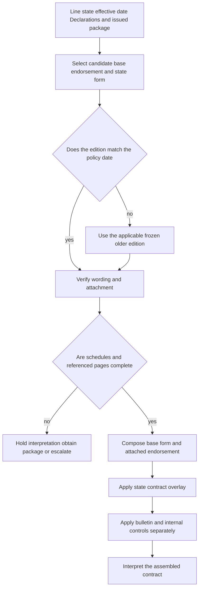

# Editions, Endorsements, and State Attachments

A policy position starts with the **issued policy package**: the governing base-form edition, Declarations, attached endorsements, referenced schedules, and any applicable state amendatory form. Forms and attached endorsements supply contract language. State bulletins constrain regulatory operations; filing memoranda and training explain; underwriting manuals and appetite guides constrain carrier action. None of those guidance documents changes the contract conclusion ([README, document families](repo://README.md#L15-L21), [README, authority model](repo://README.md#L35-L41), [manual Rules 100.B–100.D](repo://manuals/underwriting/manual.md#L21-L37)).

## Authority layers and relationship vocabulary

| Document | Responsibility | Relationship |
| --- | --- | --- |
| Base form | Supplies coverage grants, definitions, limits, exclusions, conditions, and settlement rules for its line and edition. | The applicable edition governs the issued policy. |
| Attached endorsement | Changes the base policy only within its stated terms and only when attached. | The endorsement **modifies** the base form and **preserves** terms it does not change. ([HO 04 90 2026-01](repo://forms/HO/MS/HO-04-90/2026-01.md#L1-L4), [HO-3 2024-03](repo://forms/HO/MS/HO-3/2024-03.md#L593-L597)) |
| State amendatory form | Adds state-specific contract wording and precedence for matters it addresses. | The state form **implements** the relevant bulletin; it is not the bulletin. |
| Regulator bulletin | Constrains disclosure, filing, underwriting, rating, or claim administration. | The bulletin **constrains** operations but does not create a policy term absent from the form. ([README](repo://README.md#L35-L41)) |
| Manual, appetite guide, memorandum, and training | Set internal controls or explain an edition. | These materials **constrain** or explain; they do not alter coverage. |

When documents are composed, name the acting document and use a directional relationship: **supersedes**, **writes back**, **preserves**, **modifies**, **implements**, or **constrains**. Cite both provisions whenever a proposition connects documents. For example, HO 04 90 2026-01 **writes back** the HO-3 water-backup exclusion only within its stated grant and **preserves** the base form’s other exclusions ([HO 04 90 2026-01](repo://forms/HO/MS/HO-04-90/2026-01.md#L6-L56), [HO-3 2024-03](repo://forms/HO/MS/HO-3/2024-03.md#L591-L601)).

## Entry gate: route before interpreting coverage

Route by line, state, policy-effective date, Declarations, complete issued package, schedules, referenced pages, and state form. Repository paths identify line, state, form, and edition; the package proves what was made part of the policy ([README](repo://README.md#L13-L31)). A system label or schedule is an index, not the operative endorsement language. A listed-but-missing form requires the complete package or reliable issued copy; an attached-but-unlisted form must be reconciled to the policy record. If the package is incomplete or cannot be tied to the insured, term, location, and property, record the uncertainty and escalate rather than selecting the wording that produces the preferred result ([training attaching endorsements](repo://training/attaching-endorsements.md#L65-L87), [training choosing the governing edition](repo://training/choosing-the-governing-edition.md#L109-L119)).

```mermaid
flowchart TD
    A["Line state effective date Declarations and issued package"] --> B["Select candidate base endorsement and state form"]
    B --> C{"Does the edition match the policy date"}
    C -->|"no"| D["Use the applicable frozen older edition"]
    C -->|"yes"| E["Verify wording and attachment"]
    D --> E
    E --> F{"Are schedules and referenced pages complete"}
    F -->|"no"| G["Hold interpretation obtain package or escalate"]
    F -->|"yes"| H["Compose base form and attached endorsement"]
    H --> I["Apply state contract overlay"]
    I --> J["Apply bulletin and internal controls separately"]
    J --> K["Interpret the assembled contract"]
```

*This flow shows date selection, package verification, contract composition, state implementation, and separate regulatory and underwriting controls.*

## Date-sensitive selection and supersession map

Frozen forms are never edited in place. A new edition **supersedes** an older edition only for its stated effective interval; the older edition remains applicable to policies written under it ([README](repo://README.md#L35-L37), [README supersession convention](repo://README.md#L57-L60)).

- **HO-3 2024-03 supersedes HO-3 2018-09** for policies effective on or after 2024-03-01. The 2018-09 form remains live for earlier policies ([HO-3 2018-09](repo://forms/HO/MS/HO-3/2018-09.md#L1-L9), [HO-3 2024-03](repo://forms/HO/MS/HO-3/2024-03.md#L1-L7)).
- **HO 04 90 2026-01 supersedes HO 04 90 2010-10** for policies written on or after 2026-01-01. The 2010-10 wording remains applicable to policies written under it ([HO 04 90 2010-10](repo://forms/HO/MS/HO-04-90/2010-10.md#L1-L9), [HO 04 90 2026-01](repo://forms/HO/MS/HO-04-90/2026-01.md#L1-L4)).
- **HO 04 90 2027-01 is not the changed edition for this workflow.** Do not substitute it for a 2026-01 policy merely because it is newer; select by the policy-effective date and verify the issued attachment.

The date selects a candidate; it does not prove attachment. HO 04 90 2026-01 expressly says it is effective only when attached and forms part of the policy ([HO 04 90 2026-01](repo://forms/HO/MS/HO-04-90/2026-01.md#L16-L20)).

## Selection and composition procedure

1. **Identify the transaction.** Record line, state, policy-effective date, insured, location, Declarations, form labels, schedules, and the complete package.
2. **Select the base edition.** Choose the edition whose effective interval contains the policy date; do not replace a frozen older form with the current repository file.
3. **Select and verify the endorsement.** For a policy written on or after 2026-01-01, test HO 04 90 2026-01, then confirm that the endorsement is actually attached and that its Declarations or limit schedule is complete. Attachment is required before its contract language can be used ([HO 04 90 2026-01](repo://forms/HO/MS/HO-04-90/2026-01.md#L1-L4), [training attaching endorsements](repo://training/attaching-endorsements.md#L173-L207)).
4. **Compose the forms.** Read the endorsement with the applicable HO-3 edition. The endorsement controls a conflict within its scope, and unmodified policy provisions remain applicable ([HO 04 90 2026-01](repo://forms/HO/MS/HO-04-90/2026-01.md#L6-L56)).
5. **Add the state contract overlay.** Read the state form’s scope and precedence with the base and endorsement. A state form can modify or constrain the assembled contract only in the matters it addresses.
6. **Apply regulatory and internal controls separately.** Bulletins constrain disclosure and administration; the underwriting manual constrains eligibility, authority, referral, and attachment. Rule 100.D says not to use the manual to alter coverage ([manual Rules 100.B–100.E](repo://manuals/underwriting/manual.md#L21-L43)).

## HO 04 90 2026-01 with HO-3 2024-03

The HO-3 2024-03 form excludes flood and surface water and separately excludes sewer, drain, and sump water, while identifying an attached water-backup endorsement as the exception ([HO-3 2024-03 X.7–X.9](repo://forms/HO/MS/HO-3/2024-03.md#L591-L601)). **HO 04 90 2026-01 writes back** that exclusion for its stated Water Backup and Sump Discharge or Overflow grant: it covers direct physical loss to insured property, with the sump discharge originating from equipment on the residence premises ([HO 04 90 2026-01 W.1](repo://forms/HO/MS/HO-04-90/2026-01.md#L62-L99)). It **preserves** the HO-3 flood and surface-water exclusions because W.4 continues to exclude them ([HO 04 90 2026-01 W.4](repo://forms/HO/MS/HO-04-90/2026-01.md#L119-L120), [HO-3 2024-03 X.7](repo://forms/HO/MS/HO-3/2024-03.md#L591-L597)).

The 2026-01 edition materially changes selection and interpretation compared with 2010-10. It provides a $10,000 default policy-period sublimit unless a higher Declarations limit applies and a separate $1,000 deductible; the Section I deductible does not apply to this endorsement ([HO 04 90 2026-01 W.2–W.3](repo://forms/HO/MS/HO-04-90/2026-01.md#L13-L23)). It also adds a maintenance condition for a known failure to maintain the serving system and a backwater-valve or equivalent-device requirement for finished below-grade areas ([HO 04 90 2026-01 W.5–W.6](repo://forms/HO/MS/HO-04-90/2026-01.md#L35-L47)). Those are contract provisions, not underwriting advice.

The 2010-10 endorsement instead has a $5,000 limit and $500 deductible and does not contain the 2026-01 backflow-prevention requirement ([HO 04 90 2010-10](repo://forms/HO/MS/HO-04-90/2010-10.md#L107-L113), [HO 04 90 2010-10](repo://forms/HO/MS/HO-04-90/2010-10.md#L157-L167), [HO 04 90 2026-01](repo://forms/HO/MS/HO-04-90/2026-01.md#L42-L47)). The 2026-01 edition **supersedes** 2010-10 only for the later policy interval; it does not backdate the $10,000 limit, $1,000 deductible, or new conditions.

## State overlays and internal boundaries

A state amendatory form **modifies** the applicable HO-3 contract only within the matters it addresses and **preserves** compatible base-form and endorsement terms. For Texas, HO 01 45 2022-01 supplies the contractual windstorm-and-hail deductible mechanism, while Bulletin B-2021-08 **constrains** disclosure, records, administration, and notice; the bulletin is not a substitute for the attached contract form ([HO 01 45](repo://forms/HO/TX/HO-01-45/2022-01.md#L13-L23), [HO 01 45 deductible](repo://forms/HO/TX/HO-01-45/2022-01.md#L59-L91), [B-2021-08](repo://bulletins/TX/b-2021-08-windstorm-deductibles.md#L19-L27)). Cite both the state form and bulletin when describing that relationship.

The underwriting manual **constrains** whether a requested endorsement may be bound or attached, including authority, eligibility, documentation, and referral. It does not modify the issued HO-3 or HO 04 90 terms ([manual Rule 400](repo://manuals/underwriting/manual.md#L5089-L5129), [manual Rule 100.D](repo://manuals/underwriting/manual.md#L33-L37)). Do not present this internal control as contract language.

## Worked assemblies and failure checks

For a policy effective **2025-06-01**, use HO-3 2024-03 and, if actually attached, HO 04 90 2010-10. For a policy effective **2026-02-01**, use HO-3 2024-03 and, if actually attached, HO 04 90 2026-01. In the latter assembly, HO 04 90 2026-01 **writes back** the HO-3 water-backup exclusion within its grant, **preserves** other exclusions, and supplies the $10,000 default sublimit and $1,000 deductible ([HO-3 2024-03](repo://forms/HO/MS/HO-3/2024-03.md#L591-L601), [HO 04 90 2026-01](repo://forms/HO/MS/HO-04-90/2026-01.md#L13-L47)). A state form, bulletin, and manual remain separate overlays and controls.

Check for: wrong edition; an unattached endorsement inferred from a schedule or system label; missing Declarations or referenced pages; treating 2027-01 as governing a 2026 policy; importing the 2010-10 $5,000/$500 terms into a 2026-01 policy; ignoring the 2026-01 maintenance or backflow condition; or treating a bulletin, memorandum, training page, or manual as a coverage grant. Resolve incomplete or conflicting packages before a final contract conclusion ([training attaching endorsements](repo://training/attaching-endorsements.md#L193-L215), [README](repo://README.md#L35-L37)).

For line-specific forms, see [HO-3 forms](../coverage/forms/ho-3.md). Keep state-overlay and underwriting decisions separate from contract analysis.
