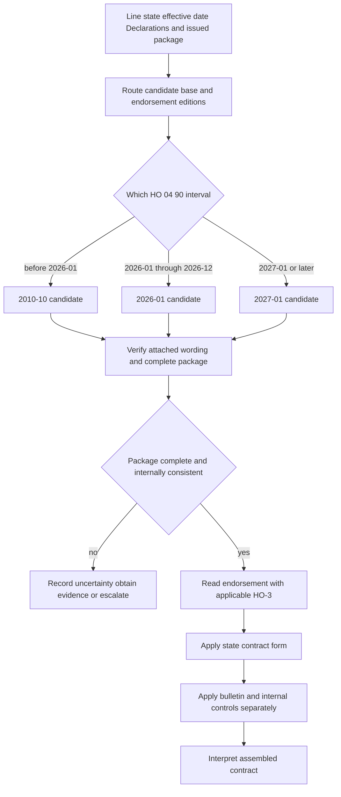

# Editions, Endorsements, and State Attachments

Policy assembly answers **which documents were made part of this policy before asking what the coverage means**. Route by line, state, policy-effective date, Declarations, complete issued package, and attached endorsement. A filename, repository location, schedule entry, or later file is an index or research lead—not proof of attachment or supersession. If the issued package is incomplete or contradictory, record the uncertainty and obtain the missing evidence or escalate rather than selecting the wording that produces a preferred result ([README](repo://README.md#L13-L31), [Choosing the Governing Edition](repo://training/choosing-the-governing-edition.md#L109-L119), [Attaching Endorsements Correctly](repo://training/attaching-endorsements.md#L65-L87)).

## Authority layers and relationship vocabulary

| Layer | Responsibility | Relationship rule |
| --- | --- | --- |
| Issued base form | Supplies the insuring agreement, definitions, limits, exclusions, conditions, and settlement rules for its line and edition. | Read the edition applicable to the policy; a later repository file does not rewrite an older policy. |
| Attached endorsement | Changes the base policy only within its stated terms and only when attached. | The endorsement **modifies** or **writes back** the base form within its scope and **preserves** terms it does not change. Cite both documents. |
| State amendatory form | Supplies state-specific contract wording and any stated precedence rule. | The state form **implements** the relevant state requirement; it is not the bulletin. |
| Regulator bulletin | Constrains filing, disclosure, issuance, rating, underwriting, or administration. | The bulletin **constrains** operations; it does not create a policy term absent from the contract. |
| Memorandum and training | Explain an edition or teach a review method. | They explain; they do not replace the filed form or establish live coverage. |
| Manual and appetite guide | Set eligibility, authority, referral, documentation, and attachment controls. | They constrain internal action; they do not alter contract coverage. |

Use the repository vocabulary directionally and name the acting document first: “HO 04 90 2027-01 **writes back** HO-3 2024-03 X.8-X.9 within its stated scope,” “HO 01 45 **implements** Bulletin B-2021-08,” and “the bulletin **constrains** disclosure.” Do not say that a base form supersedes an endorsement unless the acting document and evidence support that relationship ([HO 04 90 2027-01](repo://forms/HO/MS/HO-04-90/2027-01.md#L16-L36), [HO-3 2024-03](repo://forms/HO/MS/HO-3/2024-03.md#L593-L597), [HO 01 45](repo://forms/HO/TX/HO-01-45/2022-01.md#L13-L23)).

## Entry gate and control flow

1. **Identify the transaction:** line, state, policy-effective date, named insured, residence/location, Declarations, base-form label, all schedules and referenced pages, and the complete issued attachment package.
2. **Route candidate editions:** use the policy-effective interval and issued wording to identify a candidate base and endorsement. Do not infer attachment from a schedule or system label.
3. **Verify the package:** match every endorsement to the insured, term, location, property, and requested change. A listed-but-missing form requires the complete package or a reliable issued copy; an attached-but-unlisted form requires reconciliation.
4. **Compose the contract:** read the attached endorsement with the applicable base form, then apply the state amendatory form and its precedence language.
5. **Apply non-contract overlays separately:** apply bulletins to issuance and administration, and manuals or appetite rules to binding, referral, and attachment. Neither layer silently changes the assembled contract.
6. **Interpret or escalate:** only after the package is complete and reconciled. If labels, dates, cross-references, schedules, or wording conflict, state what is known, what is missing, and escalate.

```mermaid
flowchart TD
    A["Line state effective date Declarations and issued package"] --> B["Route candidate base and endorsement editions"]
    B --> C{"Which HO 04 90 interval"}
    C -->|"before 2026-01"| D["2010-10 candidate"]
    C -->|"2026-01 through 2026-12"| E["2026-01 candidate"]
    C -->|"2027-01 or later"| F["2027-01 candidate"]
    D --> G["Verify attached wording and complete package"]
    E --> G
    F --> G
    G --> H{"Package complete and internally consistent"}
    H -->|"no"| I["Record uncertainty obtain evidence or escalate"]
    H -->|"yes"| J["Read endorsement with applicable HO-3"]
    J --> K["Apply state contract form"]
    K --> L["Apply bulletin and internal controls separately"]
    L --> M["Interpret assembled contract"]
```

*This flow shows date routing, package verification, escalation, contract composition, and the separate state, regulatory, and internal-control layers.*

## HO 04 90 edition routing

The policy-effective date selects a **candidate** edition; the complete issued package confirms what actually became contract wording. The repository expressly states that HO 04 90 2026-01 replaces 2010-10 for policies written on or after 2026-01-01 ([HO 04 90 2026-01](repo://forms/HO/MS/HO-04-90/2026-01.md#L1-L4)). The 2010-10 form is marked superseded by 2027-01 for policies effective on or after 2027-01-01 and remains in force for policies written under it ([HO 04 90 2010-10](repo://forms/HO/MS/HO-04-90/2010-10.md#L1-L9)). Accordingly:

- **Before 2026-01-01:** route to HO 04 90 2010-10 if that endorsement is attached and issued. Its water-backup limit is $5,000 and its endorsement deductible is $500 ([2010-10 limit and deductible](repo://forms/HO/MS/HO-04-90/2010-10.md#L107-L113), [2010-10 deductible](repo://forms/HO/MS/HO-04-90/2010-10.md#L157-L167)).
- **2026-01-01 through 2026-12-31:** route a policy carrying HO 04 90 2026-01 to that edition—not to 2010-10 or 2027-01. The 2026 wording provides a $10,000 per-policy-period sublimit unless a higher limit appears in the Declarations, and a separate $1,000 deductible; the Section I deductible does not apply to loss covered there ([2026-01](repo://forms/HO/MS/HO-04-90/2026-01.md#L1-L4), [2026-01 sublimit and deductible](repo://forms/HO/MS/HO-04-90/2026-01.md#L13-L23)).
- **2027-01 and later:** route to HO 04 90 2027-01 only when that edition is actually attached. Its stated limit is $10,000 and its deductible is $1,000 ([2027-01 limit](repo://forms/HO/MS/HO-04-90/2027-01.md#L254-L265), [2027-01 deductible](repo://forms/HO/MS/HO-04-90/2027-01.md#L391-L407)). Do not carry 2027 amounts back to a 2010-10 or 2026-01 policy.

The 2026 and 2027 editions are not interchangeable merely because both state a $10,000 limit and $1,000 deductible. HO 04 90 2026-01 expressly covers sewer or drain backup and sump discharge or overflow whether or not mechanical breakdown caused the event, requires a backwater valve or equivalent device for a finished area below grade, and states that this requirement is new in that edition ([2026-01 coverage](repo://forms/HO/MS/HO-04-90/2026-01.md#L6-L11), [2026-01 backflow requirement](repo://forms/HO/MS/HO-04-90/2026-01.md#L35-L47)). HO 04 90 2027-01 has its own definitions, exclusions, maintenance duties, loss settlement, and attachment terms ([2027-01 attachment](repo://forms/HO/MS/HO-04-90/2027-01.md#L16-L60), [2027-01 coverage](repo://forms/HO/MS/HO-04-90/2027-01.md#L62-L117)). Read the attached edition, not a comparison or summary.

### Base-form relationship and unresolved cross-references

HO-3 2024-03 excludes water backing up through sewers, drains, or sump systems in X.8 and says the exclusion is subject to an attached water-backup endorsement; it separately excludes flood, surface water, and below-surface water ([HO-3 2024-03 X.8-X.11](repo://forms/HO/MS/HO-3/2024-03.md#L485-L491)). HO 04 90 2027-01 therefore **writes back** the relevant HO-3 exclusion only for its stated Water Backup or Sump Discharge or Overflow coverage and **preserves** the base policy’s other terms ([2027-01 relationship](repo://forms/HO/MS/HO-04-90/2027-01.md#L16-L36), [2027-01 exclusions](repo://forms/HO/MS/HO-04-90/2027-01.md#L254-L282)).

The 2026 source says it attaches to HO-3 and modifies “Section I — Exclusions A.3,” while the 2024-03 HO-3 text in this repository labels the comparable water exclusion X.8. That mismatch is a document-integrity issue, not permission to infer that 2026 automatically writes back X.8. Confirm the actual issued base, endorsement, state form, and complete cross-referenced pages; if they cannot be reconciled, record the uncertainty and escalate ([2026-01](repo://forms/HO/MS/HO-04-90/2026-01.md#L1-L4), [HO-3 2024-03](repo://forms/HO/MS/HO-3/2024-03.md#L467-L491)).

## State attachments and other authority

For a Texas policy, HO 01 45 2022-01 **modifies** the applicable HO-3 contract only within matters it addresses: its conflicting term controls, compatible terms remain applicable, and it does not provide coverage unless expressly stated ([HO 01 45](repo://forms/HO/TX/HO-01-45/2022-01.md#L13-L23)). HO 01 45 **implements** Texas Bulletin B-2021-08 through its contractual windstorm-and-hail deductible and Declarations mechanism; the bulletin **constrains** disclosure, records, policy-consistent claim application, and notice before an increase. The bulletin is not a substitute for the attached state form ([HO 01 45 deductible](repo://forms/HO/TX/HO-01-45/2022-01.md#L59-L91), [B-2021-08](repo://bulletins/TX/b-2021-08-windstorm-deductibles.md#L19-L27)).

Filing memoranda and training explain revision rationale or review technique; they do not replace the filed form. The underwriting manual and appetite guide constrain supported attachment, delegated authority, referral, and documentation, but carrier-issued wording determines coverage ([README authority model](repo://README.md#L15-L21), [Attaching Endorsements Correctly](repo://training/attaching-endorsements.md#L201-L227), [Manual Rule 400](repo://manuals/underwriting/manual.md#L5089-L5129)).

## Worked water-backup assemblies

These are routing examples, not conclusions for an incomplete file. They assume the named forms are actually issued and attached; if that assumption is not supported, stop at “candidate” and escalate.

### Policy effective 2023-06-01

- **Base:** HO-3 2018-09, because the date precedes the HO-3 2024-03 boundary ([HO-3 2018-09](repo://forms/HO/MS/HO-3/2018-09.md#L1-L9), [HO-3 2024-03](repo://forms/HO/MS/HO-3/2024-03.md#L1-L7)).
- **Water backup:** HO 04 90 2010-10, when attached. It **modifies** the older base water exclusion within its stated scope and supplies the $5,000 limit and $500 deductible ([HO-3 2018-09 exclusion](repo://forms/HO/MS/HO-3/2018-09.md#L109-L111), [2010-10 attachment and scope](repo://forms/HO/MS/HO-04-90/2010-10.md#L13-L33), [2010-10 amounts](repo://forms/HO/MS/HO-04-90/2010-10.md#L107-L113)).
- **Texas:** add HO 01 45 2022-01 only if attached; apply B-2021-08 as an administrative constraint, not as coverage wording.

### Policy effective 2026-06-01 carrying HO 04 90 2026-01

- **Base candidate:** use the HO-3 edition supported by the issued policy record. Do not infer the base edition from the endorsement filename.
- **Water backup:** HO 04 90 2026-01 is the routed endorsement because the policy falls within its stated replacement interval. Its candidate terms are the $10,000 per-policy-period sublimit unless a higher Declarations limit applies, separate $1,000 deductible, Coverage A/B/C water-loss grant, and finished-below-grade backflow-prevention condition ([2026-01](repo://forms/HO/MS/HO-04-90/2026-01.md#L6-L23), [2026-01 condition](repo://forms/HO/MS/HO-04-90/2026-01.md#L35-L47)).
- **Integrity check:** the 2026 source’s A.3 reference must be reconciled to the attached HO-3 and any state form. Do not silently substitute HO-3 2024-03 X.8 or HO 04 90 2027-01. If the issued package does not establish the relationship, state the uncertainty and escalate.

### Policy effective 2027-02-01

- **Base:** HO-3 2024-03 is the candidate base for this interval, subject to the issued record ([HO-3 2024-03](repo://forms/HO/MS/HO-3/2024-03.md#L1-L7)).
- **Water backup:** HO 04 90 2027-01, if attached, **writes back** the relevant HO-3 water exclusion for its stated coverage, preserves unmodified policy terms, and supplies its $10,000 limit and $1,000 deductible ([2027-01 attachment](repo://forms/HO/MS/HO-04-90/2027-01.md#L16-L36), [2027-01 amounts](repo://forms/HO/MS/HO-04-90/2027-01.md#L254-L265), [HO-3 exclusion](repo://forms/HO/MS/HO-3/2024-03.md#L485-L491)).
- **Texas:** attach and apply HO 01 45 only when the complete package supports it; keep the bulletin and internal underwriting controls in their separate authority layers.

## Failure checks

- **Wrong interval:** applying 2010-10 after 2026-01-01, or 2027-01 before its 2027 boundary. Re-route by date, then verify issuance.
- **Edition substitution:** using 2027 wording because its limit resembles 2026 wording, or using a later repository file to answer an older policy. Preserve the applicable frozen edition.
- **Unattached endorsement:** relying on a title, schedule, quote, or system label without the issued pages. Obtain the package; do not treat the endorsement as contract wording.
- **Cross-reference mismatch:** treating the 2026 A.3 reference as the 2024 X.8 exception without issued-package support. Record and escalate.
- **Authority inversion:** treating a bulletin, memorandum, training page, manual, or appetite guide as if it changes the policy. Return to the issued contract for coverage.
- **Stacking or duplicate forms:** compare grants, exclusions, definitions, conditions, limits, deductibles, schedules, and dates. Use the correction process and escalate an unreconciled conflict rather than choosing broader wording ([Attaching Endorsements Correctly](repo://training/attaching-endorsements.md#L173-L215), [Manual Rule 400](repo://manuals/underwriting/manual.md#L5241-L5257)).

For the line reference, see [HO-3 forms](/openwiki/coverage/forms/ho-3.md). For water-backup context, see [water backup](/openwiki/coverage/perils/water-backup.md). Keep contract assembly separate from internal attachment and referral decisions in [endorsements and deductibles](/openwiki/underwriting/manual/endorsements-and-deductibles.md).
