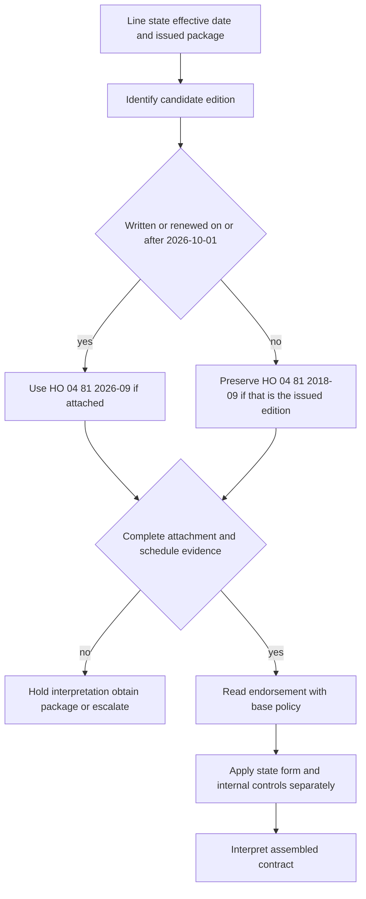

# Editions and State Attachments

Policy assembly answers **which documents govern this issued policy** before anyone interprets what those documents mean. Route by line, state, policy-effective date, Declarations, schedules, referenced pages, and the complete issued attachment package. A title, system label, request, or schedule is an index—not the endorsement wording itself. If the package is incomplete or inconsistent, obtain the issued copy or escalate rather than selecting the wording that produces the preferred result ([Choosing the Governing Edition](repo://training/choosing-the-governing-edition.md#L69-L79), [Attaching Endorsements Correctly](repo://training/attaching-endorsements.md#L65-L87)).

## Governing-edition rule

Use the policy-effective or renewal date to identify the candidate edition, then confirm that the candidate wording was actually issued. A later edition **supersedes** an earlier edition only for the policies to which its effective boundary applies. It does not rewrite policies written under the earlier edition; the earlier edition remains live knowledge and governs that policy, including a loss reported later ([Choosing the Governing Edition](repo://training/choosing-the-governing-edition.md#L77-L79), [Choosing the Governing Edition](repo://training/choosing-the-governing-edition.md#L109-L119)).

### HO 04 81 fungi endorsement

- **HO 04 81 2018-09** is effective 2018-09-01. Its notice states that it is **superseded by HO 04 81 2026-09 for policies written on or after 2026-10-01**, but remains in force for policies written under it and governs adjustment of a loss under that policy regardless of when reported ([HO 04 81 2018-09](repo://forms/HO/MS/HO-04-81/2018-09.md#L1-L12)).
- **HO 04 81 2026-09** applies to policies written or renewed on or after 2026-10-01 and **replaces** 2018-09 for that population. Policies written under 2018-09 remain governed by 2018-09 ([HO 04 81 2026-09](repo://forms/HO/MS/HO-04-81/2026-09.md#L1-L7)).
- The substantive stated change is the fungi, wet or dry rot, or bacteria aggregate limit: 2018-09 states $10,000, while 2026-09 raises it to $25,000. The 2026-09 form says all other provisions are unchanged ([HO 04 81 2018-09](repo://forms/HO/MS/HO-04-81/2018-09.md#L161-L169), [HO 04 81 2026-09](repo://forms/HO/MS/HO-04-81/2026-09.md#L23-L33)). Do not apply the $25,000 limit to a policy written under 2018-09.

The endorsement is not self-applying. The 2018-09 wording says it modifies the policy only to the extent stated, leaves unchanged policy terms in force, controls a conflict within its scope, and must be read with the policy ([HO 04 81 2018-09](repo://forms/HO/MS/HO-04-81/2018-09.md#L17-L31)). Independently of edition selection, confirm that the endorsement is actually attached to the insured’s policy term and package. A listed-but-missing form requires correction or a reliable issued copy; an attached-but-unlisted form requires reconciliation ([Attaching Endorsements Correctly](repo://training/attaching-endorsements.md#L77-L87), [Attaching Endorsements Correctly](repo://training/attaching-endorsements.md#L201-L227)).

```mermaid
flowchart TD
    A["Line state effective date and issued package"] --> B["Identify candidate edition"]
    B --> C{"Written or renewed on or after 2026-10-01"}
    C -->|"yes"| D["Use HO 04 81 2026-09 if attached"]
    C -->|"no"| E["Preserve HO 04 81 2018-09 if that is the issued edition"]
    D --> F{"Complete attachment and schedule evidence"}
    E --> F
    F -->|"no"| G["Hold interpretation obtain package or escalate"]
    F -->|"yes"| H["Read endorsement with base policy"]
    H --> I["Apply state form and internal controls separately"]
    I --> J["Interpret assembled contract"]
```

*This flow shows date-based edition selection, supersession without backdating, attachment verification, and the boundary between contract assembly and separate state or internal controls.*

## Attachment and state boundaries

Attachment selection is a separate control from edition selection. Review the request, named insured, policy term, location or subject, effective date, schedules, completed selections, legibility, and every referenced page. Compare the complete set when endorsements overlap; do not stack duplicate forms or choose broader language by assumption. Unsupported, duplicate, blank-schedule, or unreconciled attachments require the approved correction process or escalation ([Attaching Endorsements Correctly](repo://training/attaching-endorsements.md#L165-L199), [Attaching Endorsements Correctly](repo://training/attaching-endorsements.md#L173-L215)).

A state amendatory form is contract wording when attached; a regulator bulletin is a separate operational constraint. Read the state form with the selected base edition and endorsements, using its stated precedence only for matters it addresses. Do not treat a bulletin, memorandum, training page, appetite guide, or underwriting manual as silently changing the issued contract ([Choosing the Governing Edition](repo://training/choosing-the-governing-edition.md#L101-L107), [Attaching Endorsements Correctly](repo://training/attaching-endorsements.md#L101-L107)). Internal attachment and referral rules constrain whether a form may be issued; they do not change the form’s coverage after issuance.

## Selection checklist

1. Record line, state, policy or renewal effective date, Declarations, and the complete issued package.
2. Select the edition whose stated interval covers the transaction. For HO 04 81, use the 2026-09 edition only for policies written or renewed on or after 2026-10-01; retain 2018-09 for policies written under it.
3. Confirm the selected endorsement is attached to the correct insured, term, location or subject, and that schedules and referenced pages are complete.
4. Read the endorsement with the applicable base policy. Apply only its express changes; preserve unmodified terms.
5. Add any attached state amendatory form and apply its precedence language only within its scope.
6. Keep regulatory and internal attachment constraints separate from the contract conclusion.
7. If edition, attachment, schedule, or state applicability remains uncertain, document the uncertainty and escalate before final coverage interpretation.

### Worked date examples

- A policy written **2026-09-30** does not move to HO 04 81 2026-09 merely because the claim is reported after October 1. If HO 04 81 2018-09 was issued, that edition governs.
- A policy written or renewed **2026-10-01 or later** uses HO 04 81 2026-09 when that endorsement is actually attached. Its $25,000 aggregate limit is not evidence that the endorsement was attached, and it is not retroactive to the 2018-09 population.

For related contract context, see [Fungi and Bacteria](../coverage/perils/fungi-and-bacteria.md), [Water Damage](../coverage/perils/water-damage.md), [Quickstart](../quickstart.md), and [Endorsements and Deductibles](../underwriting/manual/endorsements-and-deductibles.md).
