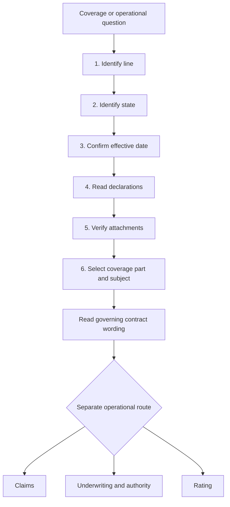

# Coverage Wiki Quickstart

This is a compact routing map, not a substitute for an issued policy, endorsement, state bulletin, claims procedure, underwriting rule, or rating procedure. The corpus cross-wires forms, endorsements, state amendatory forms, bulletins, guidelines, manuals, memoranda, and training, so a coverage question must be followed across those document relationships rather than answered from one isolated chunk ([corpus relationships](repo://README.md#L89-L95)).

## Source roles

Use each source for its proper job before composing an answer. Base forms, attached endorsements, and state amendatory forms supply contract wording; a state form implements the subject bulletin within the policy. Regulator bulletins constrain issuance, disclosure, rating, claims, or other carrier conduct. Manuals and appetite or authority guidelines constrain internal operations. Filing memoranda explain what an edition changed, and training teaches a review method; neither replaces the issued form or creates coverage ([document families](repo://README.md#L15-L27), [authority layers](repo://openwiki/policy-assembly/editions-and-state-attachments.md#L18-L25), [guidance boundary](repo://training/guidance-versus-contract.md#L15-L23)).

When a proposition composes documents, name the acting document and its relationship—`supersedes`, `writes back`, `preserves`, `modifies`, `implements`, or `constrains`—and cite both sides. This prevents a memorandum, training shortcut, or bulletin from being mistaken for the contract ([relationship vocabulary](repo://openwiki/INSTRUCTIONS.md#L68-L103)).

## Required path

*Caption: Start with line, state, effective date, declarations, and attachments; then identify the contract subject and separate operational route.*

The repository evidence path carries line of business, state, form, and edition context for retrieval because claims do not carry those domain attributes ([repository path model](repo://README.md#L26-L31)). The quickstart requires a question to proceed from line and state through effective date, declarations, attachments, coverage subject, governing wording, and only then to claims, underwriting, or rating controls ([issued-edition training](repo://training/choosing-the-governing-edition.md#L13-L25), [endorsement attachment training](repo://training/attaching-endorsements.md#L61-L83)).

## 1. Identify the line

Open the line page before applying a generic homeowners answer:

| Line | Start here | Next route |
| --- | --- | --- |
| Homeowners dwelling | [HO-3 form editions](/openwiki/coverage/forms/ho-3.md) | Coverage A–D, the applicable peril, settlement, and attachments |
| Homeowners tenant | [HO-4 form editions](/openwiki/coverage/forms/ho-4.md) | Personal property, loss of use, liability, and attachments |
| Homeowners broad/open-peril | [HO-5 form editions](/openwiki/coverage/forms/ho-5.md) | Property, peril, limit, settlement, and endorsement pages |
| Condominium unit owner | [HO-6 form editions](/openwiki/coverage/forms/ho-6.md) | Unit property, assessment, liability, and attachments |
| Dwelling property | [DP-3 form editions](/openwiki/coverage/forms/dp-3.md) | Property coverages, settlement, state form, and DP attachments |

The HO-3 2024-03 form sets Coverage B at ten percent of Coverage A and Coverage C at fifty percent of Coverage A ([Coverage B](repo://forms/HO/MS/HO-3/2024-03.md#L155-L161), [Coverage C](repo://forms/HO/MS/HO-3/2024-03.md#L217-L225)). DP-3 has no Section II E or F liability and medical-payments grants; do not carry an HO-line liability answer into a DP-3 file ([DP-3 2026-01](repo://forms/DP/MS/DP-3/2026-01.md#L13-L39), [HO-3 Section II](repo://forms/HO/MS/HO-3/2024-03.md#L1023-L1071)).

## 2. Identify the state overlay

Use the applicable state page after the line is known and before final assembly. The form supplies state-specific contract wording; the bulletin constrains issuance, disclosure, rating, claims administration, or other carrier conduct. A state amendatory form implements the relevant bulletin, but neither layer turns internal appetite guidance into policy language ([document families](repo://README.md#L15-L27), [guidance boundary](repo://training/guidance-versus-contract.md#L61-L83)).

- [California state overlay](/openwiki/state-overlays/california.md) — earthquake offers, deductibles, notices, form periods, and claims or underwriting controls.
- [Colorado state overlay](/openwiki/state-overlays/colorado.md) — hail deductibles, roof settlement disclosures, bulletin periods, deadlines, and evidence.
- [Florida state overlay](/openwiki/state-overlays/florida.md) — HO and DP amendatory forms, roof age, hurricane deductibles, notices, and claims.
- [Illinois state overlay](/openwiki/state-overlays/illinois.md) — producer licensing, water-backup disclosure, amendatory form, notice, and claims controls.
- [Louisiana state overlay](/openwiki/state-overlays/louisiana.md) — hurricane and windstorm deductibles, named-storm periods, notice, disclosure, and claims deadlines.
- [New York state overlay](/openwiki/state-overlays/new-york.md) — HO 01 31, nonrenewal and data-call requirements, deductibles, and claims duties.
- [North Carolina state overlay](/openwiki/state-overlays/north-carolina.md) — HO 01 32, fungi disclosure, claims bulletin, wind and seacoast deductibles, and deadlines.
- [Texas state overlay](/openwiki/state-overlays/texas.md) — HO and DP amendatory forms, windstorm deductibles, prompt payment, notice, and claims duties.

For Texas, Bulletin B-2021-08 requires clear and consistent administration and disclosure of separate windstorm or hail deductibles, including a one-percent named-storm minimum, a five-percent hurricane maximum, and a ten-percent seacoast windstorm maximum ([bulletin](repo://bulletins/TX/b-2021-08-windstorm-deductibles.md#L13-L27), [requirements](repo://bulletins/TX/b-2021-08-windstorm-deductibles.md#L47-L71)). Apply the bulletin with the applicable Texas form and policy record; it is not a substitute for the contract.

## 3. Confirm effective date and declarations

Use the policy-effective date and issued policy record to select the base form and endorsement editions. Confirm the wording itself, declarations, schedules, and complete attachment package; do not substitute the newest repository file, specimen, quote, or familiar form title for the wording issued with the policy ([governing edition](repo://training/choosing-the-governing-edition.md#L61-L83)). Frozen forms and regulator bulletins remain live by edition, while guidelines and manuals are living guidance revised in place; an older form edition continues to govern policies written under it ([source lifecycle](repo://README.md#L33-L41), [edition markers](repo://README.md#L53-L60)).

Use [Editions, Endorsements, and State Attachments](/openwiki/policy-assembly/editions-and-state-attachments.md) when the answer composes documents. Record line, state, effective date, declarations, form labels, selected limits and deductibles, and the coverage part or damaged interest before interpreting the wording.

Use a filing memorandum to locate the meaningful edition delta, not to establish the result. For example, the HO-3 2024-03 memorandum explains revised deductible, multiple-cause, water-damage, settlement, and condition wording, while the filed HO-3 2024-03 provisions control the answer ([HO-3 memorandum](repo://memoranda/HO-3-2024-03.md#L13-L31), [HO-3 form](repo://forms/HO/MS/HO-3/2024-03.md#L13-L39)). Apply the same discipline to DP-3 and the other edition memoranda: compare the memorandum's explanation with the applicable frozen form, and preserve the older form when its effective interval governs.

## 4. Verify attachments

Confirm that every endorsement is attached, complete, legible, matched to the insured, location, subject, and policy term, and consistent with the declarations. An endorsement changes the policy only when properly attached and only within its stated terms. An attached endorsement applies only when attached to the policy, and its provisions control over conflicting policy provisions for the subject the endorsement modifies while unmodified policy terms remain applicable ([attachment and conflict rule](repo://forms/HO/MS/HO-04-90/2027-01.md#L13-L30), [attachment workflow](repo://training/attaching-endorsements.md#L65-L111)).

HO 04 90 2027-01 writes back the HO-3 water-backup and sump-discharge exclusion for an attached policy by providing direct-physical-loss coverage, subject to a shared $10,000 limit and a $1,000 water-backup deductible ([base exclusion](repo://forms/HO/MS/HO-3/2024-03.md#L593-L601), [write-back](repo://forms/HO/MS/HO-04-90/2027-01.md#L69-L83), [limit](repo://forms/HO/MS/HO-04-90/2027-01.md#L254-L265), [deductible](repo://forms/HO/MS/HO-04-90/2027-01.md#L391-L412)). Do not apply that result to an earlier endorsement edition or an unattached policy.

HO 23 74 2025-05 modifies HO-3 2024-03 roof settlement by changing covered roof surfacing to actual cash value when roof age is at least twelve years, with age and condition supported by specified evidence ([roof endorsement](repo://forms/HO/MS/HO-23-74/2025-05.md#L94-L124), [HO-3 settlement](repo://forms/HO/MS/HO-3/2024-03.md#L119-L131)). Establish covered direct physical loss before applying settlement; an ACV schedule is not an underwriting eligibility rule and does not decide whether the loss is covered.

## 5. Select the coverage part and subject

| Question | Open first | Continue with |
| --- | --- | --- |
| Dwelling, other structures, personal property, or loss of use | [Coverage A Through D](/openwiki/coverage/parts/property-a-d.md) | Water, roof, property-limit, settlement, or endorsement page |
| Personal liability or medical payments | [Coverage E and F](/openwiki/coverage/parts/liability-e-f.md) | Liability subject, endorsement, and state overlay |
| Plumbing discharge, seepage, outside water, freezing, or resulting damage | [Water damage](/openwiki/coverage/perils/water-damage.md) | Base form, cause evidence, and any write-back |
| Sewer, drain, or sump backup | [Water backup and sump overflow](/openwiki/coverage/perils/water-backup.md) | Attached endorsement, limit, deductible, and claims route |
| Fungi, wet rot, dry rot, or bacteria | [Fungi and bacteria](/openwiki/coverage/perils/fungi-and-bacteria.md) | Causation, microbial evidence, and endorsement |
| Wind, hail, or percentage deductibles | [Wind and hail deductibles](/openwiki/coverage/perils/wind-hail-deductibles.md) | State bulletin, deductible, and declarations |
| Roof cause, matching, repair scope, or settlement | [Roof settlement](/openwiki/coverage/settlement/roof-settlement.md) | Roof claim handling and underwriting evidence |
| Earthquake or California earthquake offer | [Earthquake coverage](/openwiki/coverage/perils/earthquake.md) | California overlay and applicable deductible |
| Other structures or additional interests | [Additional structures and insured interests](/openwiki/coverage/property/additional-structures-and-insured-interests.md) | Coverage B, ownership, and line-specific form |
| Association or condominium assessment | [Loss assessment](/openwiki/coverage/property/loss-assessment.md) | HO-6 form, association facts, and state overlay |
| Code-required repair or upgrade | [Ordinance or law](/openwiki/coverage/conditions/ordinance-law.md) | Form, endorsement, limit, and state requirements |
| Incidental business or personal-injury liability | [Incidental business and personal injury](/openwiki/coverage/liability/incidental-business-and-personal-injury.md) | Coverage E, definitions, and endorsement |
| Personal-property category limit or scheduling | [Personal property limits and scheduling](/openwiki/coverage/property/personal-property-limits-and-scheduling.md) | Line form, schedule, and valuation basis |

Water is source-driven: distinguish plumbing, appliance, weather, drain, outside, and seepage paths before applying a coverage or deductible conclusion ([water-loss training](repo://training/water-losses-101.md#L59-L91)). A focused page narrows the issue; it does not replace the form edition, attached endorsement, declarations, or state wording.

## 6. Branch to claims only after the contract route

The claims manual opens and controls the claim file, verifies policy and role, preserves evidence, develops cause and scope, separates investigation from coverage and valuation, and keeps payment and closure within delegated authority ([claims manual](repo://manuals/claims/manual.md#L13-L103), [authority and closure](repo://manuals/claims/manual.md#L141-L175)). Investigation, an estimate, mitigation, or partial payment is not acceptance of the whole claim. Internal claims guidance, appetite guidance, and the underwriting manual are operational material rather than contract authority and must not be used to create, expand, restrict, or waive coverage. Filing memoranda and training may organize the review or explain an edition, but the issued form, attached endorsement, declarations, and applicable law still control ([claims boundary](repo://manuals/claims/manual.md#L15-L19), [underwriting boundary](repo://manuals/underwriting/manual.md#L21-L37), [guidance versus contract](repo://training/guidance-versus-contract.md#L61-L83), [document families](repo://README.md#L15-L27)).

**Claims guidelines**

- [Water loss handling](/openwiki/claims/guidelines/water-loss-handling.md) — source and path, mitigation, evidence, coverage consultation, limits, deductibles, escalation, payment, and closure.
- [Liability claim handling](/openwiki/claims/guidelines/liability-claim-handling.md) — occurrence, injury or property damage, insured status, defense, exclusions, communications, and escalation.
- [Mold claim handling](/openwiki/claims/guidelines/mold-claim-handling.md) — moisture causation, microbial evidence, mitigation, remediation, coverage consultation, and closure.
- [Roof claim handling](/openwiki/claims/guidelines/roof-claim-handling.md) — cause, condition, evidence, scope, valuation, matching, communication, and escalation.

**Claims manual routes**

- [Intake, investigation, and mitigation](/openwiki/claims/manual/intake-investigation-and-mitigation.md)
- [Property perils and loss types](/openwiki/claims/manual/property-perils-and-loss-types.md)
- [Conditions, authority, and state operations](/openwiki/claims/manual/conditions-authority-and-state-operations.md)
- [Liability, specialty property, and recovery](/openwiki/claims/manual/liability-specialty-and-recovery.md)

Keep coverage, causation, scope and valuation, payment authority, and recovery as distinct work products. Claims questions about proof of loss, appraisal, suit, prompt payment, catastrophe, ordinance or law, and state operations must use the operative contract and applicable law because contractual deadlines and requirements are not interchangeable across states or editions ([claims conditions](repo://manuals/claims/manual.md#L3601-L3715), [catastrophe](repo://manuals/claims/manual.md#L4321-L4369), [ordinance or law](repo://manuals/claims/manual.md#L5311-L5395)).

## 7. Branch to underwriting and authority

Underwriting guidance controls whether the carrier will write, attach, renew, refer, or require evidence; it does not create, restrict, or waive coverage. Start with [Referral Authority](/openwiki/underwriting/guidelines/referral-authority.md) for referral levels and [Binding Authority and Exceptions](/openwiki/underwriting/guidelines/binding-authority.md) for binding ceilings, approvals, exceptions, evidence, and file controls. Binding Authority and Exceptions is a separate internal control for binding and attachment decisions: it requires complete evidence, referral before action outside delegated authority, documented exceptions, and line and senior Coverage A ceilings of $800,000 and $1,500,000 respectively; these are not policy limits ([binding guide](repo://guidelines/authority/binding-authority.md#L13-L25), [authority ceilings](repo://guidelines/authority/binding-authority.md#L37-L57)).

**State appetite routes**

- [California Appetite](/openwiki/underwriting/guidelines/california-appetite.md) — California internal appetite guidance uses a $300,000 to $2,000,000 Coverage A appetite, $1,000,000 line authority, a roof inspection gate at 20 years, and wind-mitigation review above $1,000,000, separately from California contract and regulatory requirements ([guide](repo://guidelines/appetite/ca-homeowners.md#L96-L102), [roof](repo://guidelines/appetite/ca-homeowners.md#L304-L313), [wind](repo://guidelines/appetite/ca-homeowners.md#L518-L524), [authority](repo://guidelines/appetite/ca-homeowners.md#L1318-L1326)).
- [Florida Appetite](/openwiki/underwriting/guidelines/florida-appetite.md) — Florida internal appetite guidance uses a $200,000 to $900,000 Coverage A appetite, $600,000 line authority, roof inspection at 15 years with no bind at 20 years, and separate OIR and contract controls ([guide](repo://guidelines/appetite/fl-homeowners.md#L119-L127), [roof](repo://guidelines/appetite/fl-homeowners.md#L416-L422), [wind](repo://guidelines/appetite/fl-homeowners.md#L603-L608), [authority](repo://guidelines/appetite/fl-homeowners.md#L1358-L1367)).
- [Louisiana Appetite](/openwiki/underwriting/guidelines/louisiana-appetite.md) — Louisiana internal appetite guidance uses a $125,000 to $750,000 Coverage A appetite, $500,000 line authority, treats roof age of 20 years or more as outside appetite, and routes exception requests through the guide and Rule 540 rather than treating them as coverage terms ([guide](repo://guidelines/appetite/la-homeowners.md#L111-L119), [roof](repo://guidelines/appetite/la-homeowners.md#L400-L414), [authority](repo://guidelines/appetite/la-homeowners.md#L1375-L1387), [exceptions](repo://guidelines/appetite/la-homeowners.md#L1411-L1419)).
- [New York Appetite](/openwiki/underwriting/guidelines/new-york-appetite.md) — New York internal appetite guidance uses a $200,000 to $1,500,000 Coverage A appetite, $750,000 line authority, and referral for three paid property claims in the preceding three years, separately from the New York overlay and contract ([guide](repo://guidelines/appetite/ny-homeowners.md#L108-L114), [loss trigger](repo://guidelines/appetite/ny-homeowners.md#L1027-L1037), [authority](repo://guidelines/appetite/ny-homeowners.md#L1359-L1373)).
- [North Carolina Appetite](/openwiki/underwriting/guidelines/north-carolina-appetite.md) — North Carolina internal appetite guidance uses a $150,000 to $1,000,000 Coverage A appetite, $700,000 delegated authority, a roof inspection gate at 18 years, wind mitigation above $500,000, and referral for two paid property claims in three years, separately from the state contract and bulletins ([guide](repo://guidelines/appetite/nc-homeowners.md#L120-L128), [roof](repo://guidelines/appetite/nc-homeowners.md#L457-L465), [wind](repo://guidelines/appetite/nc-homeowners.md#L675-L682), [loss trigger](repo://guidelines/appetite/nc-homeowners.md#L1082-L1090), [authority](repo://guidelines/appetite/nc-homeowners.md#L1471-L1484)).
- [Texas Appetite](/openwiki/underwriting/guidelines/texas-appetite.md) — Texas appetite guidance requires roof-age and condition verification, a roof inspection at age fifteen years or more, and no binding at age twenty-five years or more; these are internal underwriting constraints rather than coverage terms ([Texas guide](repo://guidelines/appetite/tx-homeowners.md#L153-L173)).

These numbers are routing cues for internal appetite and authority only. Do not turn an eligibility threshold, inspection trigger, or prior-loss referral into a coverage exclusion, deductible, or claim deadline. If facts are incomplete or conflicting, hold the affected action and obtain recorded direction ([underwriting manual](repo://manuals/underwriting/manual.md#L13-L49), [guidance boundary](repo://training/guidance-versus-contract.md#L73-L83)).

**Underwriting manual routes**

- [Eligibility and product lines](/openwiki/underwriting/manual/eligibility-and-product-lines.md)
- [Property and water risk](/openwiki/underwriting/manual/property-and-water-risk.md)
- [Endorsements and deductibles](/openwiki/underwriting/manual/endorsements-and-deductibles.md)
- [Inspection and records](/openwiki/underwriting/manual/inspection-and-records.md)
- [Liability losses and occupancy](/openwiki/underwriting/manual/liability-losses-and-occupancy.md)
- [Authority, referrals, and clearance](/openwiki/underwriting/manual/authority-referrals-and-clearance.md)
- [State exceptions](/openwiki/underwriting/manual/state-exceptions.md)
- [Renewal and adverse action](/openwiki/underwriting/manual/renewal-and-adverse-action.md)

## 8. Route rating questions to controls, not tables

Use [Rating Inputs and Adjustments](/openwiki/underwriting/rating/inputs-and-adjustments.md) for complete submissions, occupancy, location, construction, form selection, valuation, deductibles, protective devices, roof and wind adjustments, state exceptions, re-rating, and file controls. The rating workflow requires a complete, source-documented submission, classification of occupancy and location, matching form selection, supported valuation and deductible review, approved-system calculation, evidence-based adjustments, state-exception review, and a hold or referral for unsupported or conflicting inputs; rating does not create coverage ([rating procedure](repo://manuals/rating/manual.md#L13-L91), [state controls](repo://manuals/rating/manual.md#L8155-L8191)).

Keep rating, underwriting acceptance, and contract assembly separate: a rating adjustment does not create coverage, an underwriting approval does not interpret coverage, and an issued form or endorsement must match the rated package.

## 9. Final assembly and evidence check

Return to [Editions, Endorsements, and State Attachments](/openwiki/policy-assembly/editions-and-state-attachments.md). Record line, state, effective date, governing base edition, attached endorsement editions, declarations and selected limits or deductibles, state form and bulletin, coverage part and damaged interest, reported cause and facts, and the separate guidance or authority source used.

Before publishing a position, verify that:

- the route began with line, state, effective date, declarations, and attachments;
- the governing edition and issued wording were checked, including superseded editions that still govern older policies;
- every endorsement was confirmed attached, complete, and matched to the policy and subject;
- the state amendatory form and applicable bulletin were checked without treating them as interchangeable;
- claims guidance, underwriting appetite, authority, rating, memoranda, and training are labeled as operational or interpretive sources rather than contract authority;
- coverage, causation, scope, valuation, payment, eligibility, authority, and rating questions remain separate; and
- unresolved causation, valuation, attachment, authority, regulatory, or evidence issues are escalated rather than guessed.

The corpus requires stable, narrow evidence lines and preserves prior source editions and their operative text, so a defensible position must identify the exact source location rather than rely on a broad or bare citation ([citation and line conventions](repo://README.md#L35-L60)). Prefer a canonical `repo://` citation because its path preserves line, state, form, and edition context. When documents compose, name the acting document first and say whether it `supersedes`, `writes back`, `preserves`, `modifies`, `implements`, or `constrains` the other document ([document relationships](repo://README.md#L89-L95)).
`implements`, or `constrains` the other document ([document relationships](repo://README.md#L89-L95)).
