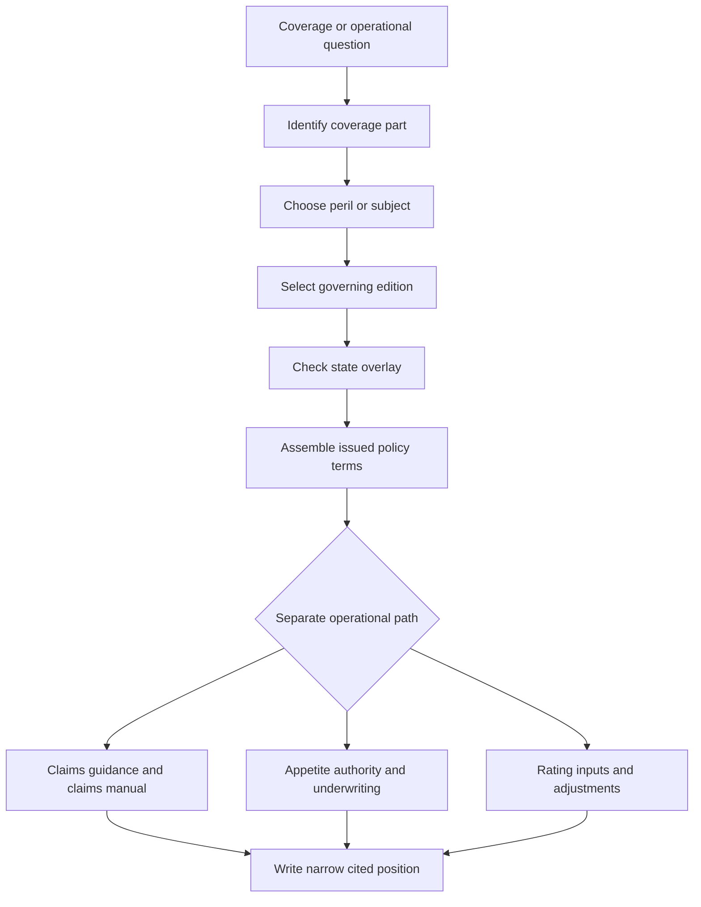

# Coverage Wiki Quickstart

This is a navigation map, not a substitute for the controlling policy form, endorsement, state bulletin, claim workflow, underwriting rule, or rating procedure. Start with the coverage part, narrow to the peril or subject, identify the governing edition, check the state overlay, assemble the issued terms, and only then branch to claims, underwriting, rating, or other internal guidance. Frozen forms and regulator bulletins remain live by edition, while guidelines and manuals are living internal material; a superseded form still governs policies written under it ([corpus layout](repo://README.md#L15-L24), [frozen and living sources](repo://README.md#L33-L41)).

## Route in one view

*Caption: Required navigation from coverage part through edition, state, assembly, and the separate operational paths.*

The map follows the corpus organizing rule: Coverage A dwelling, B other structures, C personal property, D loss of use, E liability, and F medical payments come before a peril or subject and state overlay ([coverage organization](repo://README.md#L15-L24)). The source path is load-bearing because it carries line, state, form, and edition context to retrieval ([repository layout](repo://README.md#L26-L31)).

## 1. Identify the coverage part

| Question | Open first | Continue with |
| --- | --- | --- |
| Dwelling, other structures, personal property, or loss of use | [Property Coverages A–D](/openwiki/coverage/parts/property-a-d.md) | The relevant peril, settlement, limit, or endorsement page |
| Personal liability or medical payments | [Liability and Medical Payments E–F](/openwiki/coverage/parts/liability-e-f.md) | The liability subject, endorsement, and state overlay |
| Line-specific form or edition | [HO-3 editions](/openwiki/coverage/forms/ho-3.md), [HO-4 editions](/openwiki/coverage/forms/ho-4.md), [HO-5 editions](/openwiki/coverage/forms/ho-5.md), [HO-6 editions](/openwiki/coverage/forms/ho-6.md), or [DP-3 editions](/openwiki/coverage/forms/dp-3.md) | The subject page and policy assembly |

Do not begin with a free-floating peril label. For example, the HO-3 2024-03 form places Coverage B at 10% of Coverage A and Coverage C at 50% of Coverage A, so the damaged interest and line matter before the water, roof, or property subject is analyzed ([HO-3 2024-03 Coverage B](repo://forms/HO/MS/HO-3/2024-03.md#L153-L159), [HO-3 2024-03 Coverage C](repo://forms/HO/MS/HO-3/2024-03.md#L219-L225)). The DP-3 line has no Section II E or F liability and medical-payments grants; do not carry an HO-line liability answer into a DP-3 file ([DP-3 2026-01 agreement](repo://forms/DP/MS/DP-3/2026-01.md#L13-L39), [HO line Coverage E/F example](repo://forms/HO/MS/HO-3/2024-03.md#L1023-L1071)).

## 2. Choose the peril or subject

| Subject | Route |
| --- | --- |
| Plumbing discharge, seepage, outside water, freezing, or resulting damage | [Water damage](/openwiki/coverage/perils/water-damage.md) |
| Sewer, drain, or sump backup | [Water backup and sump discharge](/openwiki/coverage/perils/water-backup.md) |
| Fungi, wet rot, dry rot, bacteria, or microbial loss | [Fungi, wet rot, dry rot, and bacteria](/openwiki/coverage/perils/fungi-and-bacteria.md) |
| Wind, hail, storm deductibles, or percentage deductibles | [Windstorm, hail, and percentage deductibles](/openwiki/coverage/perils/wind-hail-deductibles.md) |
| Roof cause, matching, repair scope, or settlement | [Roof surfacing settlement and roof claims](/openwiki/coverage/settlement/roof-settlement.md) |
| Earthquake or California earthquake offer | [Earthquake coverage](/openwiki/coverage/perils/earthquake.md) |
| Other structures, occupancy, or additional interests | [Other structures and insured interests](/openwiki/coverage/property/additional-structures-and-insured-interests.md) |
| Association or condominium assessment | [Loss assessment coverage](/openwiki/coverage/property/loss-assessment.md) |
| Code-required repair or upgrade | [Ordinance or law coverage](/openwiki/coverage/conditions/ordinance-law.md) |
| Incidental business or personal-injury liability | [Incidental business and personal-injury liability](/openwiki/coverage/liability/incidental-business-and-personal-injury.md) |

Water is source-driven: distinguish plumbing, appliance, weather, drain, outside, and seepage paths before applying a coverage or deductible conclusion ([water-loss training](repo://training/water-losses-101.md#L59-L91)). A focused page narrows the issue; it does not replace the form edition, attached endorsement, declarations, or state wording.

## 3. Select the governing edition

Use the policy-effective date and issued policy record to select the base form and endorsement editions. Confirm the actual wording, declarations, schedules, and complete attachment package; do not substitute the newest repository file or a specimen, quote, or familiar form title for the wording issued with the policy ([choosing the governing edition](repo://training/choosing-the-governing-edition.md#L13-L25), [edition selection guidance](repo://training/choosing-the-governing-edition.md#L61-L83)). The policy date is a selection rule, not proof that an endorsement is attached.

Use [Policy Assembly: Editions, Endorsements, and State Overlays](/openwiki/policy-assembly/editions-and-state-attachments.md) when the answer composes documents. Its sequence is: identify line, state, effective date, declarations, and issued labels; select the edition whose interval contains the policy date; verify each endorsement is attached and matches; add the state form; apply bulletin requirements to administration; then run internal authority and attachment controls ([choosing the governing edition](repo://training/choosing-the-governing-edition.md#L61-L83), [repository authority model](repo://README.md#L33-L41), [manual pre-bind controls](repo://manuals/underwriting/manual.md#L27-L49)).

An endorsement changes the policy only when properly attached and only within its stated terms; conflicting modified subject matter follows the endorsement while unmodified policy terms remain applicable ([attaching endorsements](repo://training/attaching-endorsements.md#L59-L87), [HO 04 90 attachment boundary](repo://forms/HO/MS/HO-04-90/2027-01.md#L13-L23)). For a representative water-backup question, HO 04 90 2027-01 writes back the applicable HO-3 exclusion for an attached policy and supplies a shared $10,000 limit and $1,000 deductible; do not apply that result to an earlier endorsement edition or an unattached policy ([HO 04 90 2027-01](repo://forms/HO/MS/HO-04-90/2027-01.md#L41-L79), [limits and deductible](repo://forms/HO/MS/HO-04-90/2027-01.md#L139-L149), [HO-3 2024-03 exclusion](repo://forms/HO/MS/HO-3/2024-03.md#L197-L204)).

For a roof question, establish covered direct physical loss before settlement. If HO 23 74 2025-05 is attached, it modifies HO-3 2024-03 roof-surfacing settlement to actual cash value at roof age 12 years or greater and requires reliable age and condition evidence ([HO 23 74 2025-05](repo://forms/HO/MS/HO-23-74/2025-05.md#L57-L77), [HO-3 2024-03 settlement](repo://forms/HO/MS/HO-3/2024-03.md#L135-L145)). An ACV schedule is not an underwriting eligibility rule and does not decide whether the loss is covered.

## 4. Check the state overlay

A state overlay joins the applicable amendatory form with regulator requirements. The form supplies state-specific contract wording; the bulletin constrains issuance, disclosure, rating, claims administration, or other carrier conduct. The state form implements the relevant bulletin, but neither layer turns internal appetite guidance into policy language ([document families](repo://README.md#L20-L27), [cross-wired sources](repo://README.md#L89-L92), [guidance versus contract](repo://training/guidance-versus-contract.md#L61-L83)). Use the overlay after the peril or subject and before final assembly.

- [California state overlay](/openwiki/state-overlays/california.md) — earthquake offers and disclosures, form and bulletin periods, deductibles, notice, underwriting, and claims controls.
- [Colorado state overlay](/openwiki/state-overlays/colorado.md) — hail deductibles, roof settlement disclosures, bulletin supersession, deadlines, and evidence.
- [Florida state overlay](/openwiki/state-overlays/florida.md) — HO and DP amendatory editions, roof-age and hurricane-deductible bulletins, notices, deductibles, and claims.
- [Illinois state overlay](/openwiki/state-overlays/illinois.md) — producer licensing, water-backup disclosure, amendatory form, notice, and claims controls.
- [Louisiana state overlay](/openwiki/state-overlays/louisiana.md) — hurricane and windstorm deductibles, named-storm periods, advance notice, disclosure, and claims deadlines.
- [New York state overlay](/openwiki/state-overlays/new-york.md) — HO 01 31, DFS nonrenewal and data-call requirements, deductible, and claims duties.
- [North Carolina state overlay](/openwiki/state-overlays/north-carolina.md) — HO 01 32, fungi disclosure, claims bulletin, wind and seacoast deductibles, and claim deadlines.
- [Texas state overlay](/openwiki/state-overlays/texas.md) — HO and DP amendatory editions, windstorm-deductible and prompt-payment bulletins, disclosure, notice, and claims duties.

For example, Texas Bulletin B-2021-08 requires clear and consistent administration of a separate windstorm or hail deductible, including a 1% named-storm minimum, a 5% hurricane maximum, and a 10% seacoast windstorm maximum. Apply those regulatory controls with the applicable Texas form and policy record; the bulletin is not a substitute for the contract ([Texas bulletin](repo://bulletins/TX/b-2021-08-windstorm-deductibles.md#L13-L27), [Texas deductible requirements](repo://bulletins/TX/b-2021-08-windstorm-deductibles.md#L47-L71)).

## 5. Separate claims guidance from contract coverage

A claims question branches only after the contract route is identified. The claims manual supplies intake, investigation, evidence preservation, mitigation, scope, valuation, authority, payment, recovery, escalation, and closure controls; the issued policy and endorsements decide coverage. Investigation, an estimate, mitigation, or partial payment is not acceptance of the whole claim ([claims manual intake controls](repo://manuals/claims/manual.md#L15-L19), [coverage and valuation boundary](repo://manuals/claims/manual.md#L63-L73)).

### Claims guidelines

- [Water Loss Claim Handling Guidance](/openwiki/claims/guidelines/water-loss-handling.md) — water source and path, mitigation, evidence, coverage consultation, limits and deductibles, escalation, payment, and closure. Confirm coverage before applying limits or deductibles and escalate unresolved causation, valuation, or regulatory issues ([water guidance](repo://guidelines/claims/water-loss-handling.md#L37-L57)).
- [Liability Claim Handling Guidance](/openwiki/claims/guidelines/liability-claim-handling.md) — occurrence, injury or property damage, insured status, defense, exclusions, communications, and liability escalation. It is operational guidance, not a coverage grant ([liability guidance](repo://guidelines/claims/liability-claim-handling.md#L13-L41)).
- [Mold Claim Handling Guidance](/openwiki/claims/guidelines/mold-claim-handling.md) — moisture causation, microbial evidence, mitigation, remediation, coverage consultation, and closure. Identify fungi or mold early but do not call testing, cleaning, or remediation covered before contract analysis ([mold guidance](repo://guidelines/claims/mold-claim-handling.md#L13-L33)).
- [Roof Claim Handling Guidance](/openwiki/claims/guidelines/roof-claim-handling.md) — roof cause, condition, evidence, scope, valuation, matching, communication, and escalation. Use it with the roof settlement contract page, not instead of it ([roof guidance](repo://guidelines/claims/roof-claim-handling.md#L13-L45)).

### Claims manual workflows

- [Claims Manual: Intake, Investigation, and Mitigation](/openwiki/claims/manual/intake-investigation-and-mitigation.md) — claim creation, prompt contact, policy and role checks, evidence, cause, mitigation, coverage separation, authority, and closure ([manual Chapters 1–3](repo://manuals/claims/manual.md#L13-L103)).
- [Claims Manual: Property Perils and Loss Types](/openwiki/claims/manual/property-perils-and-loss-types.md) — water, roof, fire, theft, weather, mold, loss of use, and dwelling-property paths joined to evidence, scope, valuation, and policy consultation ([manual property workflow](repo://manuals/claims/manual.md#L5071-L5147)).
- [Claims Manual: Conditions, Authority, and State Operations](/openwiki/claims/manual/conditions-authority-and-state-operations.md) — proof of loss, appraisal, suit, prompt payment, catastrophe, ordinance or law, state timing, and specialist referral. Contract deadlines are not interchangeable across states or editions ([claims manual conditions](repo://manuals/claims/manual.md#L3601-L3715), [catastrophe controls](repo://manuals/claims/manual.md#L4321-L4369), [ordinance-or-law controls](repo://manuals/claims/manual.md#L5311-L5395)).
- [Claims Manual: Liability, Specialty Property, and Recovery](/openwiki/claims/manual/liability-specialty-and-recovery.md) — liability, condominium and assessment, scheduled property, subrogation, salvage, recovery, authority, and closure ([specialty workflow](repo://manuals/claims/manual.md#L2527-L2681), [recovery controls](repo://manuals/claims/manual.md#L5983-L6283)).

At every claim handoff, keep coverage, causation, scope and valuation, and payment authority as distinct work products. Preserve reported facts, observations, opinions, and policy conclusions separately; refer disputed or technically complex issues rather than guessing ([claims manual controls](repo://manuals/claims/manual.md#L87-L103)).

## 6. Separate underwriting appetite and authority from coverage

Underwriting guidance controls whether the carrier will write, attach, renew, refer, or require evidence. It does not create, restrict, or waive coverage. Use [Underwriting Referral and Authority Guidance](/openwiki/underwriting/guidelines/referral-authority.md) for the referral matrix and delegated-authority boundary, and [Binding Authority Guidance](/openwiki/underwriting/guidelines/binding-authority.md) for binding ceilings, required approvals, exception handling, evidence, and file controls. Binding Authority and Exceptions allows line binding through $800,000 Coverage A and senior binding through $1,500,000, with referral before a binder above the handler’s delegation; those are internal controls, not policy limits ([binding authority guidance](repo://guidelines/authority/binding-authority.md#L13-L25), [authority ceilings](repo://guidelines/authority/binding-authority.md#L44-L54)).

### State appetite pages

Use the state-specific appetite page for pre-bind eligibility, evidence, risk triggers, claims handoff, and state-specific authority. Each remains separate from the matching state overlay and from contract coverage.

| Internal appetite route | High-value routing cue |
| --- | --- |
| [California Homeowners Appetite Guidance](/openwiki/underwriting/guidelines/california-appetite.md) | Coverage A $300,000–$2,000,000 appetite, $1,000,000 line authority, roof inspection at 20 years, and wind mitigation above $1,000,000 ([California guide](repo://guidelines/appetite/ca-homeowners.md#L44-L66)). |
| [Florida Homeowners Appetite Guidance](/openwiki/underwriting/guidelines/florida-appetite.md) | Coverage A $200,000–$900,000, line authority through $600,000, roof inspection at 15 years and no bind at 20 years; keep OIR and contract rules separate ([Florida guide](repo://guidelines/appetite/fl-homeowners.md#L41-L63)). |
| [Louisiana Homeowners Appetite Guidance](/openwiki/underwriting/guidelines/louisiana-appetite.md) | Coverage A $125,000–$750,000, line authority through $500,000, roof age 20 years outside appetite, and storm or water referrals under the guide and Rule 540 ([Louisiana guide](repo://guidelines/appetite/la-homeowners.md#L49-L73)). |
| [New York Homeowners Appetite Guidance](/openwiki/underwriting/guidelines/new-york-appetite.md) | Coverage A $200,000–$1,500,000, line authority through $750,000, and referral for 3 paid property claims in the preceding 3 years ([New York guide](repo://guidelines/appetite/ny-homeowners.md#L43-L53), [loss trigger](repo://guidelines/appetite/ny-homeowners.md#L83-L89)). |
| [North Carolina Homeowners Appetite Guidance](/openwiki/underwriting/guidelines/north-carolina-appetite.md) | Coverage A $150,000–$1,000,000, line authority through $700,000, roof inspection at 18 years, wind mitigation above $500,000, and referral for 2 paid property claims in 3 years ([North Carolina guide](repo://guidelines/appetite/nc-homeowners.md#L50-L64)). |
| [Texas Homeowners Appetite Guidance](/openwiki/underwriting/guidelines/texas-appetite.md) | Coverage A $150,000–$1,200,000, line authority through $800,000, inspection at 15 years, no bind at 25 years, wind mitigation above $500,000, and water-backup referral above $25,000 ([Texas guide](repo://guidelines/appetite/tx-homeowners.md#L61-L74)). |

These numbers are routing cues for internal appetite and authority only. Do not turn an eligibility threshold, inspection trigger, or prior-loss referral into a coverage exclusion, deductible, or claim deadline. If facts are incomplete or conflicting, hold the affected action and obtain recorded direction ([guidance-versus-contract training](repo://training/guidance-versus-contract.md#L15-L23), [underwriting manual controls](repo://manuals/underwriting/manual.md#L13-L43)).

### Underwriting manual routes

- [Manual eligibility by product line](/openwiki/underwriting/manual/eligibility-and-product-lines.md) — product, occupancy, and pre-bind eligibility.
- [Manual property, roof, and water risk controls](/openwiki/underwriting/manual/property-and-water-risk.md) — construction, roof, plumbing, drainage, and water exposure.
- [Manual binding authority, referrals, and unclearable conditions](/openwiki/underwriting/manual/authority-referrals-and-clearance.md) — delegated limits, mandatory referral, holds, and clearance.
- [Manual endorsement attachment and deductible controls](/openwiki/underwriting/manual/endorsements-and-deductibles.md) — internal attachment and deductible selection under Rules 400 and 410, separate from the contractual endorsement.
- [Manual inspections and documentation standards](/openwiki/underwriting/manual/inspection-and-records.md) — inspection triggers, reliable evidence, referral, and file records.
- [Manual liability, loss history, and occupancy controls](/openwiki/underwriting/manual/liability-losses-and-occupancy.md) — hazards, prior losses, occupancy, vacancy, rental, and business use.
- [Manual state exception controls](/openwiki/underwriting/manual/state-exceptions.md) — state-specific underwriting exceptions.
- [Manual renewal, cancellation, and nonrenewal procedures](/openwiki/underwriting/manual/renewal-and-adverse-action.md) — post-bind changes and adverse action.

## 7. Route rating questions to controls, not tables

Use [Rating Inputs and Non-Table Adjustments](/openwiki/underwriting/rating/inputs-and-adjustments.md) for complete submissions, occupancy and use, location, construction, form selection, valuation, deductibles, protective-device credits, roof and wind adjustments, endorsement premiums, state exceptions, re-rating, and file controls. The rating manual requires a complete submission, recorded input sources, matching form selection, supported valuation, deductible review, and a hold or referral for incomplete or conflicting inputs ([rating procedure](repo://manuals/rating/manual.md#L13-L91)).

The rating page intentionally routes table lookups to the approved rating system rather than reproducing generated tables. Keep rating, underwriting acceptance, and contract assembly separate: a rating adjustment does not create coverage, an underwriting approval does not interpret coverage, and an issued form or endorsement must match the rated package ([rating boundary](repo://manuals/rating/manual.md#L13-L25)). State exceptions can replace generic adjustment treatment, so verify the state instruction before releasing the result ([rating state controls](repo://manuals/rating/manual.md#L8155-L8191)).

## 8. Final assembly and citation checklist

Use [Policy Assembly: Editions, Endorsements, and State Overlays](/openwiki/policy-assembly/editions-and-state-attachments.md) for the final composition. Record the line and state, effective date, governing base edition, attached endorsement editions, declarations and selected limits or deductibles, state form and bulletin, coverage part and damaged interest, reported cause and facts, and the separate guidance or authority source used.

Before publishing a position, verify that:

- the route began with Coverage A–F and then narrowed to the subject or peril;
- the policy-effective date and issued wording were checked, including superseded editions that still govern older policies;
- every endorsement was confirmed attached, complete, and matched to the policy and subject;
- the state amendatory form and applicable bulletin were checked without treating them as interchangeable;
- claims guidance, underwriting appetite, authority, rating, memoranda, and training are labeled as operational or interpretive sources rather than contract authority;
- coverage, causation, scope, valuation, payment, eligibility, authority, and rating questions are not collapsed into one conclusion; and
- unresolved causation, valuation, attachment, authority, regulatory, or evidence issues are escalated rather than guessed.

Cite each material proposition to the exact source section with a narrow line range. Prefer a canonical `repo://` citation because its path preserves line, state, form, and edition context; when documents compose, name the acting document first and say whether it `supersedes`, `writes back`, `preserves`, `modifies`, `implements`, or `constrains` the other document ([repository citation rules](repo://README.md#L26-L31), [document relationships](repo://README.md#L89-L92), [guidance boundary](repo://training/guidance-versus-contract.md#L73-L83)). There is no single general homeowners answer: the governing edition, attachments, state overlay, internal route, and documented facts determine the defensible position.
