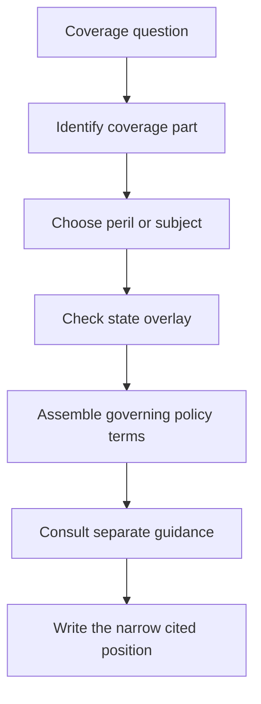

# Coverage Wiki Quickstart

<!-- openwiki: broken internal link [INSTRUCTIONS.md#L10-L14] heading anchor "L10-L14" does not exist in "INSTRUCTIONS.md". Fix the href or restore the target, then delete this comment. -->
This page is a routing map, not a substitute for the controlling form, bulletin, or a complete claim or underwriting analysis. Start with the coverage part, then narrow to the peril or subject, then check the state overlay; keep internal guidance visibly separate from contract language. That order follows the corpus organization rule ([Coverage Wiki Instructions § What to organize by](INSTRUCTIONS.md#L10-L14)).

## The route in one view

This diagram shows the required navigation sequence; it does not change the order of authority among the documents.

<!-- openwiki: broken internal link [../forms/HO/MS/HO-3/2024-03.md#L153-L159] heading anchor "L153-L159" does not exist in "../forms/HO/MS/HO-3/2024-03.md". Fix the href or restore the target, then delete this comment. -->
<!-- openwiki: broken internal link [../forms/HO/MS/HO-3/2024-03.md#L219-L225] heading anchor "L219-L225" does not exist in "../forms/HO/MS/HO-3/2024-03.md". Fix the href or restore the target, then delete this comment. -->
1. **Identify the property or liability part.** Decide whether the question concerns Coverage A dwelling, B other structures, C personal property, D loss of use, E personal liability, or F medical payments. The HO-3 2024-03 form, for example, gives Coverage B a ten-percent-of-Coverage-A limit and Coverage C a fifty-percent-of-Coverage-A limit, so do not begin with a peril label alone ([HO-3 2024-03 §§ I.B B.1–B.2, I.C C.1](../forms/HO/MS/HO-3/2024-03.md#L153-L159), [HO-3 2024-03 § I.C C.1](../forms/HO/MS/HO-3/2024-03.md#L219-L225)).
<!-- openwiki: broken internal link [../training/water-losses-101.md#L59-L107] heading anchor "L59-L107" does not exist in "../training/water-losses-101.md". Fix the href or restore the target, then delete this comment. -->
2. **Choose the peril or subject.** Route the cause, valuation issue, limit, exclusion, or endorsement interaction to its focused page. Similar-looking water damage is not one category: the training material directs the reader to distinguish plumbing, weather, appliance, drain, and outside sources ([Water Losses 101 § L.2](../training/water-losses-101.md#L59-L107)).
<!-- openwiki: broken internal link [../bulletins/TX/b-2021-08-windstorm-deductibles.md#L13-L27] heading anchor "L13-L27" does not exist in "../bulletins/TX/b-2021-08-windstorm-deductibles.md". Fix the href or restore the target, then delete this comment. -->
3. **Check the state overlay.** Confirm the state amendatory form and any regulator bulletin that apply to the risk, policy, or loss. A Texas windstorm question, for example, must be checked against the bulletin's applicability and disclosure requirements, not only the generic deductible wording ([Texas Bulletin B-2021-08 §§ B.1.1–B.1.7](../bulletins/TX/b-2021-08-windstorm-deductibles.md#L13-L27)).
<!-- openwiki: broken internal link [../forms/HO/MS/HO-04-90/2027-01.md#L13-L23] heading anchor "L13-L23" does not exist in "../forms/HO/MS/HO-04-90/2027-01.md". Fix the href or restore the target, then delete this comment. -->
4. **Assemble the policy terms.** Identify the line, base-form edition in force for the policy, attached endorsements, state amendatory form, and applicable bulletin. An endorsement applies only when attached; where attached terms conflict, the endorsement controls its modified subject ([HO 04 90 2027-01 §§ W.1–W.5](../forms/HO/MS/HO-04-90/2027-01.md#L13-L23)).
<!-- openwiki: broken internal link [../guidelines/claims/water-loss-handling.md#L13-L21] heading anchor "L13-L21" does not exist in "../guidelines/claims/water-loss-handling.md". Fix the href or restore the target, then delete this comment. -->
<!-- openwiki: broken internal link [../guidelines/appetite/tx-homeowners.md#L13-L18] heading anchor "L13-L18" does not exist in "../guidelines/appetite/tx-homeowners.md". Fix the href or restore the target, then delete this comment. -->
<!-- openwiki: broken internal link [../manuals/underwriting/manual.md#L13-L37] heading anchor "L13-L37" does not exist in "../manuals/underwriting/manual.md". Fix the href or restore the target, then delete this comment. -->
5. **Consult guidance only after the contract route is clear.** Use claims guidance for investigation and payment workflow, underwriting guidance for appetite and authority, and training for plain-language explanation. Guidance does not create, expand, restrict, or waive coverage ([Water Loss Claim Handling Guidance §§ H.0.1–H.0.2](../guidelines/claims/water-loss-handling.md#L13-L21); [Texas Homeowners Appetite Guide §§ H.0.1–H.0.2](../guidelines/appetite/tx-homeowners.md#L13-L18); [Personal Lines Underwriting Manual Rule 100 §§ 100.A–100.D](../manuals/underwriting/manual.md#L13-L37)).
<!-- openwiki: broken internal link [INSTRUCTIONS.md#L68-L103] heading anchor "L68-L103" does not exist in "INSTRUCTIONS.md". Fix the href or restore the target, then delete this comment. -->
6. **State the answer with narrow citations.** Every material proposition needs the exact source section and a narrow line range. If the position composes documents, cite both: name the acting document first and say whether it `supersedes`, `writes back`, `preserves`, `modifies`, `implements`, or `constrains` the other document ([Coverage Wiki Instructions § Document relationships](INSTRUCTIONS.md#L68-L103)).

## Start with the coverage part

| Question or damaged interest | Open this page first | Then narrow to |
| --- | --- | --- |
| Dwelling, other structures, personal property, or loss of use | [Property Coverages A–D](/openwiki/coverage/parts/property-a-d.md) | The relevant peril, settlement, limit, or endorsement page below |
| Personal liability or medical payments | [Liability and Medical Payments E–F](/openwiki/coverage/parts/liability-e-f.md) | The liability endorsement or state overlay that changes the result |
| A line-specific edition question | [HO-3 editions](/openwiki/coverage/forms/ho-3.md), [HO-4 editions](/openwiki/coverage/forms/ho-4.md), [HO-5 editions](/openwiki/coverage/forms/ho-5.md), [HO-6 editions](/openwiki/coverage/forms/ho-6.md), or [DP-3 editions](/openwiki/coverage/forms/dp-3.md) | The applicable peril or endorsement page, then assembly |

<!-- openwiki: broken internal link [../README.md#L33-L41] heading anchor "L33-L41" does not exist in "../README.md". Fix the href or restore the target, then delete this comment. -->
<!-- openwiki: broken internal link [INSTRUCTIONS.md#L105-L109] heading anchor "L105-L109" does not exist in "INSTRUCTIONS.md". Fix the href or restore the target, then delete this comment. -->
Use the form page when the answer depends on the edition, a renumbered provision, or a line-specific coverage grant. Do not silently replace an older edition with the newest one: frozen forms remain live for policies written under that edition ([README.md § The two halves](../README.md#L33-L41); [Coverage Wiki Instructions § Editions and supersession](INSTRUCTIONS.md#L105-L109)).

## Then choose the peril or subject

### Water and moisture

- [Water damage, plumbing discharge, and seepage](/openwiki/coverage/perils/water-damage.md) — accidental plumbing or appliance discharge, resulting damage, seepage, groundwater, flood, roof entry, freezing, maintenance, and fungi boundaries.
<!-- openwiki: broken internal link [../forms/HO/MS/HO-04-90/2027-01.md#L41-L79] heading anchor "L41-L79" does not exist in "../forms/HO/MS/HO-04-90/2027-01.md". Fix the href or restore the target, then delete this comment. -->
<!-- openwiki: broken internal link [../forms/HO/MS/HO-04-90/2027-01.md#L139-L149] heading anchor "L139-L149" does not exist in "../forms/HO/MS/HO-04-90/2027-01.md". Fix the href or restore the target, then delete this comment. -->
- [Water backup and sump discharge](/openwiki/coverage/perils/water-backup.md) — sewer or drain backup, sump discharge, sublimits, deductibles, duties, and the endorsement write-back. For example, HO 04 90 2027-01 covers direct physical loss caused by water backup or sump discharge, subject to a $10,000 shared limit and a $1,000 water-backup deductible ([HO 04 90 2027-01 §§ W.1–W.3](../forms/HO/MS/HO-04-90/2027-01.md#L41-L79), [§§ W.2–W.3](../forms/HO/MS/HO-04-90/2027-01.md#L139-L149)). The endorsement acts on the base policy; confirm attachment and read its remaining exclusions before treating the loss as covered.
- [Fungi, wet rot, dry rot, and bacteria](/openwiki/coverage/perils/fungi-and-bacteria.md) — microbial exclusions, limited write-backs, remediation, and state disclosure.
- [Ordinance or law coverage](/openwiki/coverage/conditions/ordinance-law.md) — code-related repair or upgrade costs and their interaction with a covered loss.

### Storm and earth perils

- [Windstorm, hail, and percentage deductibles](/openwiki/coverage/perils/wind-hail-deductibles.md) — covered storm damage, wind-driven rain openings, percentage-deductible calculation, and multiple-deductible questions.
<!-- openwiki: broken internal link [../forms/HO/MS/HO-3/2024-03.md#L135-L145] heading anchor "L135-L145" does not exist in "../forms/HO/MS/HO-3/2024-03.md". Fix the href or restore the target, then delete this comment. -->
<!-- openwiki: broken internal link [../forms/HO/MS/HO-23-74/2025-05.md#L57-L77] heading anchor "L57-L77" does not exist in "../forms/HO/MS/HO-23-74/2025-05.md". Fix the href or restore the target, then delete this comment. -->
- [Roof surfacing settlement and roof claims](/openwiki/coverage/settlement/roof-settlement.md) — cause and direct physical loss first, then roof age, condition, matching, repair scope, and valuation. HO-3 2024-03 ordinarily provides replacement-cost roof settlement unless an ACV roof schedule is attached ([HO-3 2024-03 § I.A A.22](../forms/HO/MS/HO-3/2024-03.md#L135-L145)); HO 23 74 2025-05 changes roof-surfacing settlement to ACV at roof age twelve years or greater and requires evidence of age and condition ([HO 23 74 2025-05 §§ W.1 W.1–W.9](../forms/HO/MS/HO-23-74/2025-05.md#L57-L77)).
- [Earthquake coverage and California offer requirements](/openwiki/coverage/perils/earthquake.md) — earthquake endorsement terms and California offer or disclosure requirements.

### Property structure, limits, and settlement

- [Other structures, additional interests, and occupancy endorsements](/openwiki/coverage/property/additional-structures-and-insured-interests.md) — Coverage B, rented structures, additional interests, incidental occupancy, and unit-owner arrangements.
- [Loss assessment coverage](/openwiki/coverage/property/loss-assessment.md) — association assessments, limits, deductibles, triggers, and exclusions.
- [Personal property limits, special limits, and scheduling](/openwiki/coverage/property/personal-property-limits-and-scheduling.md) — Coverage C special limits, business property, scheduled property, and identity-related items.

## Check the state overlay

<!-- openwiki: broken internal link [../bulletins/TX/b-2021-08-windstorm-deductibles.md#L47-L71] heading anchor "L47-L71" does not exist in "../bulletins/TX/b-2021-08-windstorm-deductibles.md". Fix the href or restore the target, then delete this comment. -->
<!-- openwiki: broken internal link [../bulletins/TX/b-2021-08-windstorm-deductibles.md#L213-L231] heading anchor "L213-L231" does not exist in "../bulletins/TX/b-2021-08-windstorm-deductibles.md". Fix the href or restore the target, then delete this comment. -->
The state page is the place to reconcile regulator requirements with the amendatory form. A bulletin is not a substitute for the policy: Texas B-2021-08 requires clear identification and consistent administration of a separate windstorm or hail deductible, including a one-percent named-storm minimum, a five-percent hurricane maximum, and a ten-percent seacoast windstorm maximum ([Texas Bulletin B-2021-08 §§ B.2.1–B.2.12](../bulletins/TX/b-2021-08-windstorm-deductibles.md#L47-L71)). Its claims standards also require a factual causation determination and explanation of the deductible applied ([§§ B.4.1–B.4.9](../bulletins/TX/b-2021-08-windstorm-deductibles.md#L213-L231)). Use the [Texas state overlay](/openwiki/state-overlays/texas.md) to connect that bulletin to the Texas amendatory form and the policy in force.

- [California state overlay](/openwiki/state-overlays/california.md)
- [Colorado state overlay](/openwiki/state-overlays/colorado.md)
- [Florida state overlay](/openwiki/state-overlays/florida.md)
- [Illinois state overlay](/openwiki/state-overlays/illinois.md)
- [Louisiana state overlay](/openwiki/state-overlays/louisiana.md)
- [New York state overlay](/openwiki/state-overlays/new-york.md)
- [North Carolina state overlay](/openwiki/state-overlays/north-carolina.md)
- [Texas state overlay](/openwiki/state-overlays/texas.md)

<!-- openwiki: broken internal link [../README.md#L78-L92] heading anchor "L78-L92" does not exist in "../README.md". Fix the href or restore the target, then delete this comment. -->
<!-- openwiki: broken internal link [INSTRUCTIONS.md#L91-L103] heading anchor "L91-L103" does not exist in "INSTRUCTIONS.md". Fix the href or restore the target, then delete this comment. -->
When a state bulletin and amendatory form both matter, cite the bulletin for the regulatory requirement and the form for the contract implementation. The state form `implements` the regulator requirement; it does not turn internal appetite guidance into contract language ([README.md § Current contents](../README.md#L78-L92); [Coverage Wiki Instructions § Document relationships](INSTRUCTIONS.md#L91-L103)).

## Keep guidance separate from contract language

### Claims route

<!-- openwiki: broken internal link [../guidelines/claims/water-loss-handling.md#L37-L57] heading anchor "L37-L57" does not exist in "../guidelines/claims/water-loss-handling.md". Fix the href or restore the target, then delete this comment. -->
Use [Water Loss Claim Handling Guidance](/openwiki/claims/guidelines/water-loss-handling.md) for the operational sequence: intake and cause investigation, mitigation, evidence preservation, coverage consultation, valuation, limits and deductibles, escalation, payment, and closure. The guide expressly says to apply limits and deductibles only after confirming coverage and to escalate unresolved causation, valuation, or regulatory issues ([Water Loss Claim Handling Guidance §§ H.0.12–H.0.22](../guidelines/claims/water-loss-handling.md#L37-L57)). It is claims guidance, not authority to pay a loss.

<!-- openwiki: broken internal link [../training/water-losses-101.md#L59-L107] heading anchor "L59-L107" does not exist in "../training/water-losses-101.md". Fix the href or restore the target, then delete this comment. -->
<!-- openwiki: broken internal link [../training/water-losses-101.md#L177-L219] heading anchor "L177-L219" does not exist in "../training/water-losses-101.md". Fix the href or restore the target, then delete this comment. -->
For a water claim, collect the reported source and path, timing and duration, damaged property, mitigation records, failed component, photographs, estimates, and any conflicting evidence. Then compare the facts to [Water damage](/openwiki/coverage/perils/water-damage.md) or [water backup](/openwiki/coverage/perils/water-backup.md), and cite any attached endorsement. The training material is useful for the intake vocabulary and evidence checklist, but not for deciding coverage or supplying a limit ([Water Losses 101 § L.2](../training/water-losses-101.md#L59-L107), [§ L.2](../training/water-losses-101.md#L177-L219)).

<!-- openwiki: broken internal link [../training/roof-claims-and-the-schedule.md#L59-L71] heading anchor "L59-L71" does not exist in "../training/roof-claims-and-the-schedule.md". Fix the href or restore the target, then delete this comment. -->
For a roof claim, use [Roof surfacing settlement](/openwiki/coverage/settlement/roof-settlement.md) after establishing whether a covered event caused direct physical loss. The roof training module says an ACV schedule values covered roof surfacing after coverage is established; it does not decide coverage ([Roof Claims and the ACV Schedule § L.2](../training/roof-claims-and-the-schedule.md#L59-L71)).

### Underwriting route

<!-- openwiki: broken internal link [../guidelines/appetite/tx-homeowners.md#L153-L173] heading anchor "L153-L173" does not exist in "../guidelines/appetite/tx-homeowners.md". Fix the href or restore the target, then delete this comment. -->
Use [Texas homeowners appetite guidance](/openwiki/underwriting/guidelines/texas-appetite.md) for current Texas risk-selection direction, including required roof evidence, age and condition referrals, wind and hail review, water exposure, prior losses, and authority. The guide requires roof verification, inspection at age fifteen years or more, and no bind at twenty-five years or more ([Texas Homeowners Appetite Guide §§ H.2.1–H.2.10](../guidelines/appetite/tx-homeowners.md#L153-L173)). These are internal constraints on what the carrier will write; they do not change what an issued policy covers.

Use the focused manual pages for broader internal controls:

- [Manual eligibility by product line](/openwiki/underwriting/manual/eligibility-and-product-lines.md) for line eligibility and pre-bind controls.
<!-- openwiki: broken internal link [../manuals/underwriting/manual.md#L1963-L1999] heading anchor "L1963-L1999" does not exist in "../manuals/underwriting/manual.md". Fix the href or restore the target, then delete this comment. -->
<!-- openwiki: broken internal link [../manuals/underwriting/manual.md#L2211-L2249] heading anchor "L2211-L2249" does not exist in "../manuals/underwriting/manual.md". Fix the href or restore the target, then delete this comment. -->
- [Manual property, roof, and water risk controls](/openwiki/underwriting/manual/property-and-water-risk.md) for construction, roof, plumbing, and water exposure. The manual requires a roof survey at fifteen years and refers or declines material roof conditions ([Rules 200–210](../manuals/underwriting/manual.md#L1963-L1999), [Rule 210](../manuals/underwriting/manual.md#L2211-L2249)).
<!-- openwiki: broken internal link [../manuals/underwriting/manual.md#L3991-L4027] heading anchor "L3991-L4027" does not exist in "../manuals/underwriting/manual.md". Fix the href or restore the target, then delete this comment. -->
<!-- openwiki: broken internal link [../manuals/underwriting/manual.md#L4413-L4429] heading anchor "L4413-L4429" does not exist in "../manuals/underwriting/manual.md". Fix the href or restore the target, then delete this comment. -->
- [Manual binding authority, referrals, and unclearable conditions](/openwiki/underwriting/manual/authority-referrals-and-clearance.md) for delegated limits and mandatory escalation. Rule 300 requires referral outside active delegation and Rule 310 holds action for specified open, disputed, or material risks ([Rules 300–310](../manuals/underwriting/manual.md#L3991-L4027), [Rule 310](../manuals/underwriting/manual.md#L4413-L4429)).
- [Manual endorsement attachment and deductible controls](/openwiki/underwriting/manual/endorsements-and-deductibles.md) for internal selection and approval of endorsements and deductibles.
<!-- openwiki: broken internal link [../manuals/underwriting/manual.md#L8501-L8513] heading anchor "L8501-L8513" does not exist in "../manuals/underwriting/manual.md". Fix the href or restore the target, then delete this comment. -->
<!-- openwiki: broken internal link [../manuals/underwriting/manual.md#L8803-L8845] heading anchor "L8803-L8845" does not exist in "../manuals/underwriting/manual.md". Fix the href or restore the target, then delete this comment. -->
- [Manual inspections and documentation standards](/openwiki/underwriting/manual/inspection-and-records.md) for inspection triggers, reliable evidence, referral, and file records. Rule 600 requires inspection when information is incomplete or unreliable and requires a roof survey at fifteen years ([Rule 600](../manuals/underwriting/manual.md#L8501-L8513)); Rule 610 requires source, discrepancy, decision, and referral documentation ([Rule 610](../manuals/underwriting/manual.md#L8803-L8845)).
- [Manual liability, loss history, and occupancy controls](/openwiki/underwriting/manual/liability-losses-and-occupancy.md) for hazards, prior losses, occupancy, vacancy, rental, and business use.
- [Manual state exception controls](/openwiki/underwriting/manual/state-exceptions.md) for the eight state-specific underwriting chapters.
- [Manual renewal, cancellation, and nonrenewal procedures](/openwiki/underwriting/manual/renewal-and-adverse-action.md) for post-bind risk changes and adverse action.
- [Underwriting referral and authority guidance](/openwiki/underwriting/guidelines/referral-authority.md) when the question is an authority boundary rather than a coverage interpretation.

## Assemble the answer without mixing authorities

Use [Policy Assembly: Editions, Endorsements, and State Overlays](/openwiki/policy-assembly/editions-and-state-attachments.md) as the final assembly page. Before stating a position, record:

- the policy line and state;
- the policy or endorsement effective date and the base-form edition in force;
- every attached endorsement and its edition;
- the state amendatory form and regulator bulletin, if applicable;
- the coverage part and damaged property or liability interest;
- the reported cause, timing, and relevant facts; and
- the applicable guidance source, clearly labeled as guidance rather than authority.

<!-- openwiki: broken internal link [../README.md#L33-L41] heading anchor "L33-L41" does not exist in "../README.md". Fix the href or restore the target, then delete this comment. -->
<!-- openwiki: broken internal link [../README.md#L15-L23] heading anchor "L15-L23" does not exist in "../README.md". Fix the href or restore the target, then delete this comment. -->
<!-- openwiki: broken internal link [INSTRUCTIONS.md#L16-L27] heading anchor "L16-L27" does not exist in "INSTRUCTIONS.md". Fix the href or restore the target, then delete this comment. -->
The corpus has two authority layers that must remain live: frozen forms and bulletins are not edited in place and older editions continue to govern policies written under them, while guidelines and manuals are living internal guidance revised in place ([README.md § The two halves](../README.md#L33-L41)). Memoranda explain edition changes but are interpretation, and training explains operational expectations but is not contract authority ([README.md § Layout](../README.md#L15-L23), [Coverage Wiki Instructions § Lines, states and document families](INSTRUCTIONS.md#L16-L27)). When an internal statement differs from a form or bulletin, the controlling form or bulletin governs.

### A compact composition example

<!-- openwiki: broken internal link [../forms/HO/MS/HO-3/2024-03.md#L197-L204] heading anchor "L197-L204" does not exist in "../forms/HO/MS/HO-3/2024-03.md". Fix the href or restore the target, then delete this comment. -->
<!-- openwiki: broken internal link [../forms/HO/MS/HO-04-90/2027-01.md#L41-L79] heading anchor "L41-L79" does not exist in "../forms/HO/MS/HO-04-90/2027-01.md". Fix the href or restore the target, then delete this comment. -->
<!-- openwiki: broken internal link [../forms/HO/MS/HO-04-90/2027-01.md#L139-L149] heading anchor "L139-L149" does not exist in "../forms/HO/MS/HO-04-90/2027-01.md". Fix the href or restore the target, then delete this comment. -->
For a 2024-03 HO-3 water-backup question in Texas, route to [Property Coverages A–D](/openwiki/coverage/parts/property-a-d.md), then [Water damage](/openwiki/coverage/perils/water-damage.md) and [Water backup](/openwiki/coverage/perils/water-backup.md), then [Texas](/openwiki/state-overlays/texas.md), and finally [Policy Assembly](/openwiki/policy-assembly/editions-and-state-attachments.md). Check whether HO 04 90 is attached: the base HO-3 excludes sewer, drain, and sump backup under Coverage B ([HO-3 2024-03 § I.B B.23–B.25](../forms/HO/MS/HO-3/2024-03.md#L197-L204)), while HO 04 90 provides a distinct attached endorsement grant, limit, deductible, and remaining exclusions ([HO 04 90 2027-01 §§ W.1–W.4](../forms/HO/MS/HO-04-90/2027-01.md#L41-L79), [§§ W.2–W.4](../forms/HO/MS/HO-04-90/2027-01.md#L139-L149)). Use the claims guide for investigation and documentation, and the Texas appetite or manual only for internal handling and eligibility. The final position must cite both the base provision and the attached endorsement, plus the state document when it changes the result.

## Citation and authority checklist

Before publishing an answer, verify that:

- the route began with A–F rather than a free-floating peril label;
- the policy edition and attached endorsement were checked, including superseded editions still governing older policies;
- the state overlay was checked after the peril or subject;
- each material proposition cites the exact source section and a narrow line range;
- a composed position cites both the acting document and the document it acts on;
- forms and bulletins are identified as contract or regulatory authority;
- guidelines, manuals, memoranda, and training are labeled as internal guidance or interpretation; and
- unresolved causation, valuation, authority, or regulatory issues are escalated rather than guessed.

<!-- openwiki: broken internal link [../README.md#L13-L31] heading anchor "L13-L31" does not exist in "../README.md". Fix the href or restore the target, then delete this comment. -->
This separation is mandatory because the repository states that the path carries line, state, form, and edition context, while claims themselves do not; a bare or broad citation loses the facts needed for retrieval ([README.md § Layout](../README.md#L13-L31)). There is no single “general homeowners answer”: the controlling edition, attachments, state overlay, and documented facts determine which route and which citations apply.
