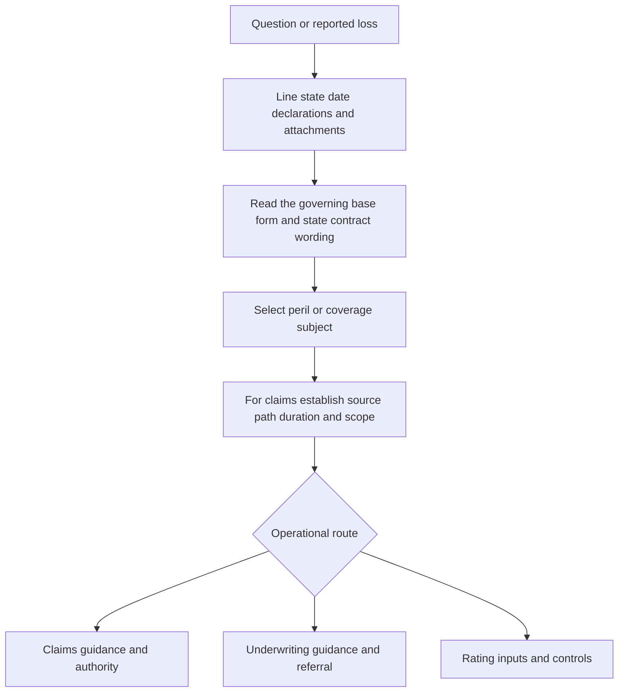

# Coverage Wiki Quickstart

Use this page as a routing map, not as a substitute for the issued policy, declarations, attached endorsements, state requirements, claims procedure, or underwriting authority. The corpus deliberately connects forms, endorsements, state forms, bulletins, manuals, guidelines, memoranda, and training; follow those relationships instead of answering from one isolated source ([corpus relationships](repo://README.md#L89-L95)).

## The entry gate

Before interpreting coverage, record:

1. **Line and subject:** HO-3, HO-4, HO-5, HO-6, or DP-3; Coverage A–D, E, F, or the specific property/peril.
2. **State and effective date:** identify the applicable state form and policy transaction date.
3. **Issued package:** read the declarations, governing base-form edition, complete endorsements and schedules, and state amendatory form. An endorsement changes the policy only when attached and only within its stated terms; unchanged terms remain applicable ([assembly workflow](repo://openwiki/policy-assembly/editions-and-state-attachments.md#L46-L65)).
4. **Facts:** for a loss, establish source, path, duration, damaged property, mitigation, and evidence before applying exclusions, limits, or deductibles.

The repository path is load-bearing: it carries line, state, form, and edition context that claim records do not ([repository layout](repo://README.md#L13-L31)). Frozen forms remain live for policies written under them; living manuals and guidelines are operational material revised in place ([source lifecycle](repo://README.md#L33-L41)).

```mermaid
flowchart TD
    q["Question or reported loss"] --> route["Line state date declarations and attachments"]
    route --> contract["Read the governing base form and state contract wording"]
    contract --> subject["Select peril or coverage subject"]
    subject --> facts["For claims establish source path duration and scope"]
    facts --> branch{"Operational route"}
    branch --> claims["Claims guidance and authority"]
    branch --> uw["Underwriting guidance and referral"]
    branch --> rating["Rating inputs and controls"]
```
*Caption: Route the issued policy package before branching to claims, underwriting, or rating controls.*

## Route by domain

| Need | Open first | Then use |
| --- | --- | --- |
| Assemble editions, endorsements, or state attachments | [Editions, Endorsements, and State Attachments](/openwiki/policy-assembly/editions-and-state-attachments.md) | Issued forms, declarations, schedules, and applicable bulletin |
| HO-3 dwelling, other structures, contents, or loss of use | [HO-3 form](/openwiki/coverage/forms/ho-3.md) | Applicable edition, coverage part, peril, settlement, and endorsements |
| Water discharge, seepage, flood, outside water, or resulting damage | [Water Damage](/openwiki/coverage/perils/water-damage.md) | Exact source evidence, base exclusions, and any attached write-back |
| Fungi, wet or dry rot, or bacteria | [Fungi and Bacteria](/openwiki/coverage/perils/fungi-and-bacteria.md) | HO 04 81 edition, causation, covered remediation, and aggregate |
| Water or microbial claim handling | [Water Loss Handling](/openwiki/claims/guidelines/water-loss-handling.md) and [Mold Claim Handling](/openwiki/claims/guidelines/mold-claim-handling.md) | Claims manual, evidence, mitigation, authority, payment, and closure |
| Cross-peril claim investigation | [Property Perils and Loss Types](/openwiki/claims/manual/property-perils-and-loss-types.md) | Applicable peril page and controlling policy wording |
| State contract or regulatory overlay | State overlay pages, beginning with [North Carolina](/openwiki/state-overlays/north-carolina.md) or [Texas](/openwiki/state-overlays/texas.md) as applicable | Amendatory form for contract terms; bulletin for regulatory administration |
| Binding, eligibility, referral, or attachment | [Referral Authority](/openwiki/underwriting/guidelines/referral-authority.md) and [Binding Authority and Exceptions](/openwiki/underwriting/guidelines/binding-authority.md) | State appetite and underwriting manual |
| Rating inputs or adjustments | [Rating Inputs and Adjustments](/openwiki/underwriting/rating/inputs-and-adjustments.md) | Complete submission, approved calculation, and state exceptions |

## The HO 04 81 edition checkpoint

Do not select the newest endorsement merely because it is current in the repository. **HO 04 81 2018-09 remains in force for policies written under it**, including a loss reported later. **HO 04 81 2026-09 applies to policies written or renewed on or after 2026-10-01 and supersedes 2018-09 for those policies** ([2018-09 applicability](repo://forms/HO/MS/HO-04-81/2018-09.md#L8-L12); [2026-09 applicability](repo://forms/HO/MS/HO-04-81/2026-09.md#L1-L7)). Verify attachment as well as date; if the package or edition is unclear, hold the conclusion and escalate.

Both editions require the covered-cause-first sequence: a covered cause must cause direct physical loss to covered property before the fungi-related loss, and the fungi must result from that loss. Both describe reasonable, necessary removal, access tear-out, and qualifying post-remediation testing, while excluding repeated seepage or leakage and flood ([2018-09 coverage](repo://forms/HO/MS/HO-04-81/2018-09.md#L49-L81); [2026-09 coverage](repo://forms/HO/MS/HO-04-81/2026-09.md#L9-L21)). The material edition change is the aggregate: **$10,000 for 2018-09** ([2018-09 limit](repo://forms/HO/MS/HO-04-81/2018-09.md#L161-L181)) versus **$25,000 for 2026-09**, with all covered fungi, rot, or bacteria loss sharing one limit rather than gaining additional insurance ([2026-09 limit and change](repo://forms/HO/MS/HO-04-81/2026-09.md#L23-L33)). A limit does not create coverage where the base form or endorsement excludes the loss.

## Water-to-fungi claim workflow

For a water or microbial report, use this order:

1. **Intake and protect:** open the file, verify policy and parties, acknowledge notice, give safe protection/mitigation direction, and preserve an inspection opportunity. Handling guidance is not a coverage grant ([water handling boundary](repo://guidelines/claims/water-loss-handling.md#L34-L46)).
2. **Trace the event:** distinguish plumbing or appliance discharge, roof or wall entry, drain or sump backup, flood, surface/groundwater, condensation, and repeated seepage. Discovery, staining, odor, or a vendor label does not establish cause or duration ([water investigation controls](repo://guidelines/claims/water-loss-handling.md#L90-L103)).
3. **Preserve and separate:** retain photographs, failed components, moisture findings, samples, estimates, invoices, and mitigation records. Separate emergency protection, source repair, resulting direct physical damage, fungi work, testing, preexisting/maintenance work, and betterment ([water evidence controls](repo://guidelines/claims/water-loss-handling.md#L105-L117)).
4. **Consult the exact assembly:** apply the base grant and exclusions, then the attached endorsement and state form. For HO 04 81, prove the covered-cause-first sequence before discussing fungi coverage; then apply the edition-specific aggregate ([water and fungi interaction](repo://openwiki/coverage/perils/water-damage.md#L57-L75)).
5. **Decide and escalate:** apply limits, deductibles, valuation, and authority only after covered scope is identified. Escalate unresolved causation, duration, attachment, contamination, health, safety, valuation, regulatory, recovery, or authority issues; an inspection, estimate, mitigation authorization, or partial payment is not acceptance of the whole claim ([claims authority](repo://guidelines/claims/water-loss-handling.md#L158-L171)).

## Keep authority layers distinct

- **Contract:** base form, attached endorsement, declarations, and state amendatory form supply operative policy wording.
- **Regulation:** a bulletin constrains carrier issuance, disclosure, rating, or administration; it does not silently create a policy grant or limit.
- **Internal guidance:** claims, underwriting, appetite, authority, and rating materials control operations, eligibility, referral, and delegated action; they do not create, expand, restrict, or waive coverage.
- **Interpretation:** memoranda and training explain an edition or method; the issued form controls when they differ ([document-family boundary](repo://README.md#L15-L27); [guidance boundary](repo://training/guidance-versus-contract.md#L15-L23)).

When documents compose, name the acting document and relationship explicitly: an endorsement may **write back** or **modify** a base exclusion, a later edition **supersedes** an earlier one only at its stated boundary, a state form **implements** a bulletin, and internal rules **constrain** attachment or operations. Cite both sides of a composed proposition ([relationship rules](repo://openwiki/INSTRUCTIONS.md#L68-L103)).

## Final check

Before publishing a position, confirm the line, state, effective date, declarations, attachment package, governing editions, cause and scope evidence, exact limits/deductibles/conditions, and applicable state controls. Label each conclusion as contract, regulatory, operational, or interpretive. If any material fact or document is missing, do not guess: preserve the uncertainty and escalate. Use narrow canonical `repo://` citations to the exact controlling lines ([citation conventions](repo://README.md#L43-L60)).
