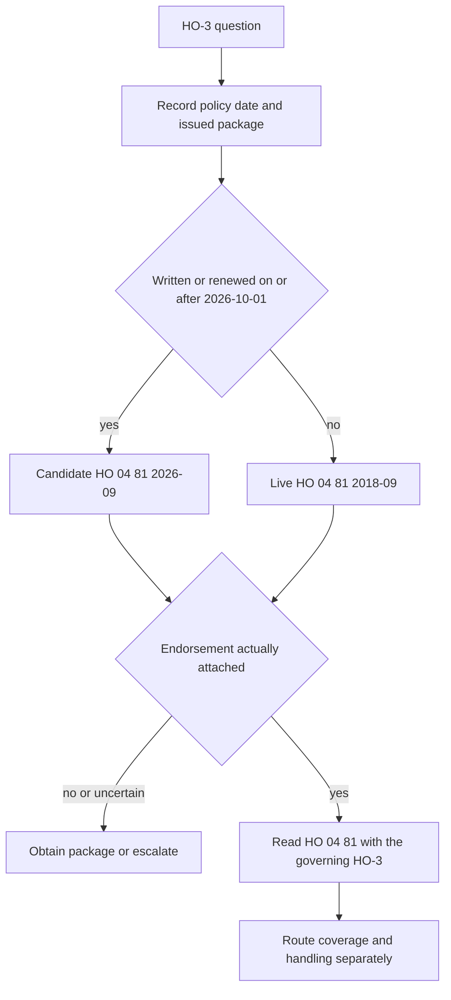

# Coverage Wiki Quickstart

This is a **policy-assembly routing page**, not a coverage opinion or claims procedure. Begin with the issued policy package: line, state, policy-effective date, Declarations, base form, attached endorsements, and applicable state form. The repository path is load-bearing because it carries line, state, form, and edition context ([repository layout](repo://README.md#L13-L31)).

## HO 04 81: select the edition first

For an HO-3 policy, **HO 04 81 edition 2026-09 supersedes edition 2018-09 only for policies written or renewed on or after 2026-10-01**. The older 2018-09 edition remains live for policies written under it and governs losses under those policies, even if reported later ([2026-09 endorsement](repo://forms/HO/MS/HO-04-81/2026-09.md#L1-L7), [2018-09 endorsement](repo://forms/HO/MS/HO-04-81/2018-09.md#L8-L12)). Do not select an edition from the report date, current catalog, or newest repository file.

```mermaid
flowchart TD
    A["HO-3 question"] --> B["Record policy date and issued package"]
    B --> C{"Written or renewed on or after 2026-10-01"}
    C -->|"yes"| D["Candidate HO 04 81 2026-09"]
    C -->|"no"| E["Live HO 04 81 2018-09"]
    D --> F{"Endorsement actually attached"}
    E --> F
    F -->|"no or uncertain"| G["Obtain package or escalate"]
    F -->|"yes"| H["Read HO 04 81 with the governing HO-3"]
    H --> I["Route coverage and handling separately"]
```
*Caption: The policy date selects the candidate edition; the complete issued package confirms whether the endorsement forms part of the contract.*

The date rule is not proof of attachment. An endorsement can be used as contract language only after its complete pages and schedules are matched to the insured, policy term, location, and subject; a listed-but-missing form or attached-but-unlisted form must be reconciled ([attachment workflow](repo://training/attaching-endorsements.md#L65-L87), [policy-assembly entry gate](repo://openwiki/policy-assembly/editions-and-state-attachments.md#L61-L69)). Once attachment is confirmed, read the endorsement with the base HO-3: it controls only where it conflicts within its stated scope, while unchanged policy provisions remain applicable ([2018-09 attachment and preservation](repo://forms/HO/MS/HO-04-81/2018-09.md#L17-L47), [2026-09 scope](repo://forms/HO/MS/HO-04-81/2026-09.md#L3-L7)).

## What changes between the two editions

The 2026-09 form states that its only change from 2018-09 is the aggregate limit: **$25,000 instead of $10,000**; all other provisions are unchanged ([2026-09 change statement](repo://forms/HO/MS/HO-04-81/2026-09.md#L23-L33), [2018-09 limit](repo://forms/HO/MS/HO-04-81/2018-09.md#L161-L169)). This is a routing cue, not a coverage conclusion. The fungi page explains the trigger, exclusions, covered remediation, and the single aggregate; the applicable attached edition controls ([Fungi, Wet or Dry Rot, and Bacteria](/openwiki/coverage/perils/fungi-and-bacteria.md)).

A covered cause must cause direct physical loss before the fungi causes loss; qualifying work is limited to the endorsement’s express terms. Thus a water event, inspection, vendor label, mitigation step, or mold allegation does not by itself establish fungi coverage ([2026-09 coverage terms](repo://forms/HO/MS/HO-04-81/2026-09.md#L9-L21), [2018-09 trigger and work](repo://forms/HO/MS/HO-04-81/2018-09.md#L49-L81)).

## Route by domain

| Need | Open next | Boundary |
| --- | --- | --- |
| Select edition, assemble policy, resolve attachment or precedence | [Editions, Endorsements, and State Attachments](/openwiki/policy-assembly/editions-and-state-attachments.md) | Contract forms and attached endorsements are distinct from bulletins and internal controls. |
| Interpret fungi, wet or dry rot, bacteria, trigger, exclusions, scope, or limit | [Fungi, Wet or Dry Rot, and Bacteria](/openwiki/coverage/perils/fungi-and-bacteria.md) | Apply the attached HO 04 81 edition; do not combine the $10,000 and $25,000 aggregates. |
| Investigate a reported mold or microbial loss | [Mold Claim Handling](/openwiki/claims/guidelines/mold-claim-handling.md) | Handling guidance organizes evidence and escalation; it does not grant or deny coverage. |
| Investigate a water-origin loss | [Water Loss Handling](/openwiki/claims/guidelines/water-loss-handling.md) and [Water Damage](/openwiki/coverage/perils/water-damage.md) | Separate the initiating water cause from the resulting fungi question. |

## Contract versus guidance

Base forms, attached endorsements, and state amendatory forms supply contract wording. Regulator bulletins constrain carrier issuance, disclosure, or administration. Manuals and claims or underwriting guidelines are internal controls. Filing memoranda explain an edition, and training teaches a review method; neither replaces the issued form or creates coverage ([document families](repo://README.md#L15-L27), [authority layers](repo://openwiki/policy-assembly/editions-and-state-attachments.md#L46-L57), [guidance boundary](repo://training/guidance-versus-contract.md#L61-L83)).

Keep these propositions separate:

- **Edition selection:** use the policy-effective date and preserve the 2018-09 edition for policies written under it.
- **Attachment:** verify the complete issued package; a schedule or system label is not the endorsement itself.
- **Coverage:** read the attached endorsement and governing HO-3 together; an endorsement is not a base form and does not expand coverage beyond its express terms.
- **Handling:** use mold and water pages to investigate source, sequence, evidence, mitigation, scope, and escalation. Do not turn handling activity, a manual rule, a memorandum, or training shortcut into a coverage result.

If date, attachment, state form, or policy wording is incomplete or conflicting, hold the interpretation and obtain the issued package or escalate rather than choosing the edition that produces the preferred result ([selection procedure](repo://openwiki/policy-assembly/editions-and-state-attachments.md#L96-L103)).
