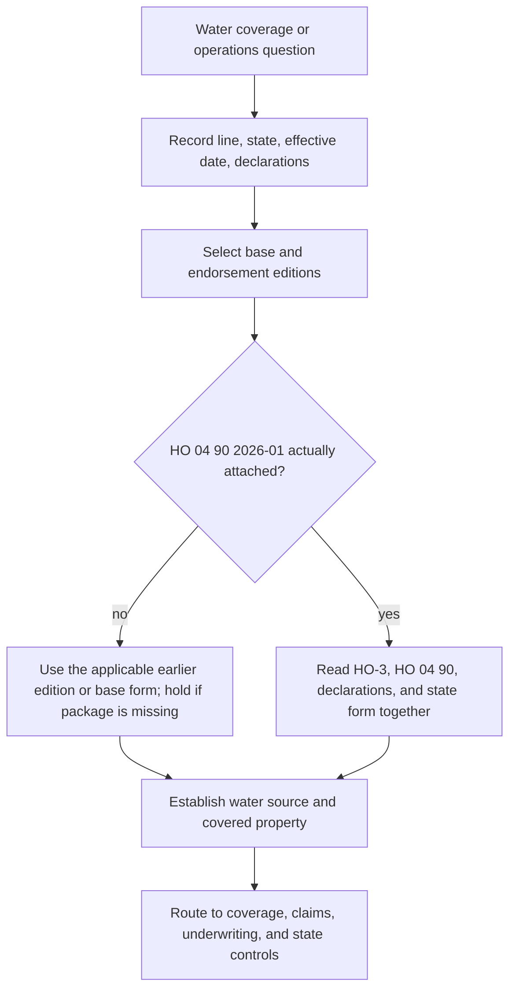

# Coverage Wiki Quickstart

This is a task-routing map, not a substitute for the issued policy, declarations, attached endorsement, state form, applicable law, or internal procedure. Forms and bulletins are frozen authority; manuals and guidelines are living operational guidance, while memoranda and training explain rather than create coverage ([repository document families](repo://README.md#L15-L23), [authority boundary](repo://README.md#L35-L41)).

## Start with the issued package

For any water question, record the line, state, policy-effective date, policy period, declarations, base form, complete endorsement package, and state attachments before interpreting the loss. A repository file, quote, schedule entry, or system label does not establish that an endorsement was issued or attached. The evidence path is load-bearing because it carries line, state, form, and edition context ([repository path model](repo://README.md#L26-L31)).

```mermaid
flowchart TD
  Q["Water coverage or operations question"] --> P["Record line, state, effective date, declarations"]
  P --> E["Select base and endorsement editions"]
  E --> A{"HO 04 90 2026-01 actually attached?"}
  A -->|"no"| H["Use the applicable earlier edition or base form; hold if package is missing"]
  A -->|"yes"| W["Read HO-3, HO 04 90, declarations, and state form together"]
  H --> C["Establish water source and covered property"]
  W --> C
  C --> R["Route to coverage, claims, underwriting, and state controls"]
```

### Edition gate: HO 04 90 2026-01

HO 04 90 2026-01 is a multistate endorsement that attaches to HO-3, modifies Section I—Exclusions A.3, and replaces 2010-10 for policies written on or after **2026-01-01** ([edition metadata](repo://forms/HO/MS/HO-04-90/2026-01.md#L1-L4)). That date selects a candidate edition; it does **not** mean the endorsement applies merely because the topic is water loss. Confirm the actual attachment and complete issued wording. For the assembly decision and the 2027-01 supersession boundary, use [Policy Editions and State Attachments](policy-assembly/editions-and-state-attachments.md).

When the 2026-01 endorsement is attached, it covers direct physical loss to Coverage A, B, and C property from sewer or drain backup or sump, sump-pump, or related-equipment overflow or discharge, including an event resulting from mechanical breakdown ([endorsement grant](repo://forms/HO/MS/HO-04-90/2026-01.md#L6-L11)). Its default maximum is **$10,000 for all endorsement loss in one policy period**, subject to a higher declarations limit, and a separate **$1,000 deductible applies to each loss** ([limit and deductible](repo://forms/HO/MS/HO-04-90/2026-01.md#L13-L23)). Flood, surface water, storm surge, body-of-water overflow, and below-ground water remain excluded; the endorsement also contains a known-maintenance condition and a backwater-valve condition for finished below-grade areas ([preserved exclusions and conditions](repo://forms/HO/MS/HO-04-90/2026-01.md#L25-L47)). These are contract terms, not underwriting thresholds.

## Route by work product

| Need | Open first | What to establish |
| --- | --- | --- |
| Edition, attachment, declarations, or state assembly | [Policy Editions and State Attachments](policy-assembly/editions-and-state-attachments.md) | Effective-date interval, base form, attached endorsement, declarations, and state form; do not backdate later wording. |
| Water cause and coverage boundaries | [Water Backup and Sump Discharge](coverage/perils/water-backup.md) | Sewer/drain reverse flow versus sump discharge, flood, surface water, groundwater, seepage, source repair, covered property, limit, deductible, and valuation. |
| Reported or pending loss | [Water Loss Handling](claims/guidelines/water-loss-handling.md) | Safe mitigation, evidence preservation, source and path, direct physical damage, exact attached wording, exclusions, scope, payment, and escalation. Guidance does not create coverage. |
| Attachment, deductible, eligibility, or referral | [Endorsements and Deductibles](underwriting/manual/endorsements-and-deductibles.md) | Whether the carrier may attach or select terms, required evidence and authority, and reconciliation of rating, declarations, and issued package. Internal rules are not policy terms. |
| Base homeowners form | [HO-3 Form Editions](coverage/forms/ho-3.md) | The applicable HO-3 edition, Section I exclusions, covered property, settlement, and declarations before applying a write-back. |
| State-specific contract or operations | [Policy Editions and State Attachments](policy-assembly/editions-and-state-attachments.md) and the applicable state overlay | Amendatory form and bulletin requirements separately from the multistate endorsement and internal guidance. |

## Water-loss triage

<!-- openwiki: broken internal link [claims/guidelines/water-loss-handling.md#L12-L16] heading anchor "L12-L16" does not exist in "claims/guidelines/water-loss-handling.md". Fix the href or restore the target, then delete this comment. -->
<!-- openwiki: broken internal link [claims/guidelines/water-loss-handling.md#L43-L54] heading anchor "L43-L54" does not exist in "claims/guidelines/water-loss-handling.md". Fix the href or restore the target, then delete this comment. -->
Do not infer “backup” from standing water or a claimant’s label. Establish the source, first appearance, migration path, duration, affected property, failed component, maintenance history, weather/runoff, and direct physical damage. Separate mitigation, source repair, permanent repair, valuation, and coverage; an inspection, estimate, mitigation authorization, reserve, or partial payment is not acceptance of the whole claim ([claims workflow](claims/guidelines/water-loss-handling.md#L12-L16), [investigation evidence](claims/guidelines/water-loss-handling.md#L43-L54)).

<!-- openwiki: broken internal link [claims/guidelines/water-loss-handling.md#L56-L69] heading anchor "L56-L69" does not exist in "claims/guidelines/water-loss-handling.md". Fix the href or restore the target, then delete this comment. -->
For an attached 2026-01 endorsement, consult the exact endorsement with the HO-3 and declarations: the grant is limited to stated Coverage A/B/C property, and the preserved flood, surface-water, below-ground-water, maintenance, and below-grade backflow requirements still require factual investigation ([water-loss contract consultation](claims/guidelines/water-loss-handling.md#L56-L69)).

## State and guidance boundary

<!-- openwiki: broken internal link [policy-assembly/editions-and-state-attachments.md#L63-L72] heading anchor "L63-L72" does not exist in "policy-assembly/editions-and-state-attachments.md". Fix the href or restore the target, then delete this comment. -->
State amendatory forms modify or supplement the contract for the matters they address. Bulletins constrain disclosure, issuance, rating, claims administration, or other carrier conduct; they do not silently add an endorsement limit or deductible. Underwriting and claims manuals control eligibility, evidence, referrals, investigation, and authority; they do not grant, restrict, waive, or interpret coverage ([state-layer roles](policy-assembly/editions-and-state-attachments.md#L63-L72)). Where the state page is absent or records conflict, hold the affected action and escalate rather than choosing the broader or newest wording.

<!-- openwiki: broken internal link [coverage/perils/water-backup.md#L206-L214] heading anchor "L206-L214" does not exist in "coverage/perils/water-backup.md". Fix the href or restore the target, then delete this comment. -->
For Illinois water-backup work, route to the Illinois overlay and verify its disclosure and claims controls separately from the contract. The focused coverage page explains that an overlay disclosure does not replace the edition-specific attached endorsement ([Illinois overlay discussion](coverage/perils/water-backup.md#L206-L214)).

## Final check

Before publishing a position or issuing a package, verify: (1) effective date and governing editions; (2) complete, legible, correctly matched attachments; (3) declarations limits and deductibles; (4) water source, covered property, exclusions, and valuation; (5) state form and bulletin; and (6) the distinct operational owner for claims, underwriting, authority, or rating. Cite the acting document and describe whether it **supersedes**, **writes back**, **preserves**, **modifies**, **implements**, or **constrains** another source ([relationship conventions](repo://README.md#L92-L95)).
