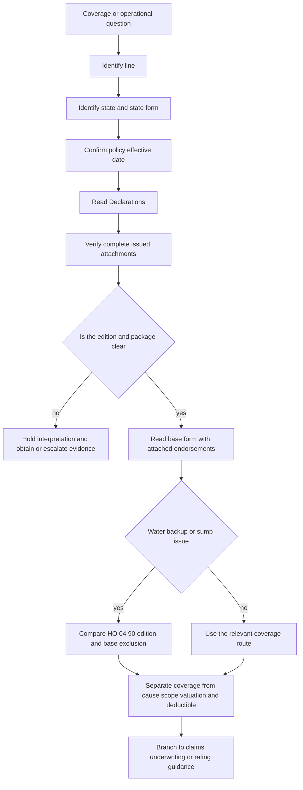

# Coverage Wiki Quickstart

This is a concise task-routing map, not a substitute for an issued policy, endorsement, declarations, state form, claims procedure, underwriting rule, or rating procedure. The repository is synthetic and its forms are not legal advice ([corpus scope](repo://README.md#L1-L11)).

## Route before answering

Start with the issued package, not a familiar title or the newest repository file. Record the **line**, **state**, **policy-effective date**, **Declarations**, base-form edition, attached endorsement editions, state attachments, coverage part, damaged interest, and reported cause. The evidence path is load-bearing because it carries line, state, form, and edition context ([repository layout](repo://README.md#L13-L31)).

```mermaid
flowchart TD
  Q["Coverage or operational question"] --> L["Identify line"]
  L --> S["Identify state and state form"]
  S --> D["Confirm policy effective date"]
  D --> R["Read Declarations"]
  R --> A["Verify complete issued attachments"]
  A --> E{"Is the edition and package clear"}
  E -->|"no"| H["Hold interpretation and obtain or escalate evidence"]
  E -->|"yes"| C["Read base form with attached endorsements"]
  C --> W{"Water backup or sump issue"}
  W -->|"yes"| B["Compare HO 04 90 edition and base exclusion"]
  W -->|"no"| P["Use the relevant coverage route"]
  B --> X["Separate coverage from cause scope valuation and deductible"]
  P --> X
  X --> O["Branch to claims underwriting or rating guidance"]
```
*Caption: The routing flow selects the issued contract first, then sends the resolved issue to the appropriate operational domain.*

Frozen forms and bulletins remain available by edition; a later form does not rewrite an older policy. Living manuals and guidelines are revised in place ([source lifecycle](repo://README.md#L33-L41)). If labels conflict, an attachment is missing, or the package cannot be matched to the insured, term, location, and subject, do not choose the wording that produces the preferred result; obtain the issued copy or escalate ([governing edition method](repo://training/choosing-the-governing-edition.md#L69-L79), [attachment method](repo://training/attaching-endorsements.md#L81-L111)).

## Contract, regulatory, and guidance boundaries

Base forms, attached endorsements, declarations, and state amendatory forms supply or compose contract wording. A state amendatory form **implements** its bulletin; a bulletin **constrains** carrier administration but does not create a coverage term. Filing memoranda and training explain or teach; manuals, appetite, authority, and rating guidance **constrain** internal operations but do not create, restrict, waive, or interpret coverage ([document families](repo://README.md#L15-L27), [authority layers](repo://openwiki/policy-assembly/editions-and-state-attachments.md#L50-L61)).

When documents compose, name the acting document and use directional vocabulary precisely: an endorsement **writes back** or **modifies** the base form within its stated scope, **preserves** unmodified terms, and a newer edition **supersedes** an older edition only at its applicable boundary. The endorsement must be attached before its contract language can be used ([attachment rule](repo://training/attaching-endorsements.md#L65-L87)).

## Water-backup fast route: HO 04 90 2026-01

For an HO-3 water-backup question, compare the attached HO 04 90 edition with the HO-3 base exclusion. **HO 04 90 2026-01 supersedes HO 04 90 2010-10 for policies written on or after 2026-01-01**; it attaches to HO-3 and modifies Section I Exclusions A.3 ([2026-01 form](repo://forms/HO/MS/HO-04-90/2026-01.md#L1-L4)). The 2010-10 amount must not be carried forward into the 2026-01 interval, and a later repository edition must not be backdated to an earlier policy.

The 2026-01 endorsement writes back direct physical loss to Coverage A, B, and C property from sewer or drain backup or sump, sump-pump, or related-equipment discharge or overflow, even when mechanical breakdown caused the event. It provides a **$10,000 maximum per policy period**, unless a higher endorsement limit appears in the Declarations, as part of—not in addition to—the applicable Coverage A, B, and C limits; a separate **$1,000 deductible applies per loss** ([coverage and amounts](repo://forms/HO/MS/HO-04-90/2026-01.md#L6-L23)).

Before applying that write-back, confirm direct physical loss and the covered property. The endorsement **preserves** flood, surface water, body-of-water overflow, and below-surface-water exclusions; excludes a known and unreasonable failure to maintain the serving system; and requires an installed, operable backwater valve or equivalent for finished below-grade areas ([preserved exclusions and conditions](repo://forms/HO/MS/HO-04-90/2026-01.md#L25-L47)). Coverage A and B use the policy’s settlement basis, while Coverage C is actual cash value unless the Declarations say otherwise ([settlement](repo://forms/HO/MS/HO-04-90/2026-01.md#L49-L56)). For comparison across editions and lines, use [Water Backup and Sump Discharge Coverage](/openwiki/coverage/perils/water-backup.md), not a remembered limit or training figure.

## Choose the next domain

- **Policy assembly:** [Policy Editions and State Attachments](/openwiki/policy-assembly/editions-and-state-attachments.md) — select the base and endorsement edition, verify attachment and state overlays, and resolve composition before interpretation.
- **Coverage:** [Water Backup and Sump Discharge Coverage](/openwiki/coverage/perils/water-backup.md) — compare 2010-10, 2026-01, and 2027-01 HO 04 90 positions, other homeowners lines, limits, deductibles, exclusions, and resulting-damage boundaries.
- **Base form:** [HO-3 form editions](/openwiki/coverage/forms/ho-3.md) — read the applicable HO-3 exclusion and the policy’s other unmodified terms.
- **Claims:** [Water Loss Claim Handling](/openwiki/claims/guidelines/water-loss-handling.md) — investigate source and cause, mitigate, preserve evidence, consult the resolved contract, apply the governing limit and deductible, and escalate uncertainty. Claims guidance is operational, not contract authority.

Keep coverage, causation, scope and valuation, payment authority, underwriting eligibility, and rating separate. An inspection, estimate, mitigation action, partial payment, underwriting approval, or rating result does not by itself establish coverage. If evidence is incomplete or conflicting, hold the affected decision and document the escalation rather than guessing ([claims boundary](repo://manuals/claims/manual.md#L13-L19), [guidance boundary](repo://training/guidance-versus-contract.md#L61-L83)).

## Final check

Before stating a position, confirm that the route began with line, state, date, Declarations, and attachments; the issued edition was checked; the HO 04 90 2026-01 interval was distinguished from 2010-10 and 2027-01; state forms and bulletins were not treated as interchangeable; and every operational source was labeled as guidance rather than contract authority. Cite the exact canonical `repo://` source and identify whether the acting document **supersedes**, **writes back**, **preserves**, **modifies**, **implements**, or **constrains** the other document ([citation and relationship conventions](repo://README.md#L53-L60), [relationships](repo://README.md#L89-L95)).
