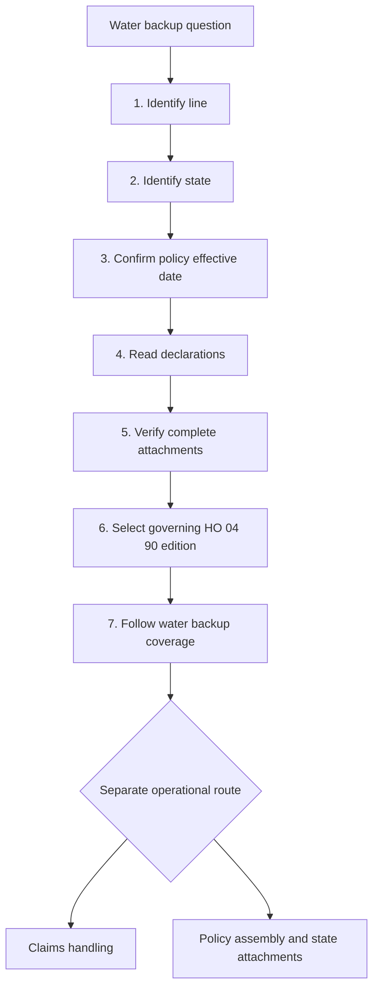

# Coverage Wiki Quickstart

This is a routing map, not a substitute for the issued policy, endorsement, state form, claims procedure, or internal guidance. Contract wording comes from the issued base form and attached endorsements; bulletins, memoranda, training, manuals, and appetite guidance constrain or explain operations but do not create coverage ([source roles](repo://README.md#L15-L27), [guidance boundary](repo://training/guidance-versus-contract.md#L61-L83)).

## Required path

```mermaid
flowchart TD
    question["Water backup question"] --> line["1. Identify line"]
    line --> state["2. Identify state"]
    state --> date["3. Confirm policy effective date"]
    date --> declarations["4. Read declarations"]
    declarations --> attach["5. Verify complete attachments"]
    attach --> edition["6. Select governing HO 04 90 edition"]
    edition --> coverage["7. Follow water backup coverage"]
    coverage --> route{"Separate operational route"}
    route --> claims["Claims handling"]
    route --> assembly["Policy assembly and state attachments"]
```
*Caption: Preserve the line, state, date, declarations, and attachment sequence before interpreting coverage or routing operations.*

## Water-backup entrypoint

Start with [Water Backup and Sump Overflow](/openwiki/coverage/perils/water-backup.md) after confirming the policy package. It explains the water path, direct physical loss, edition-specific exclusions and conditions, and the form-versus-memorandum authority boundary.

For HO 04 90, use the policy-effective date only to identify the candidate interval, then independently prove that the exact endorsement is attached. The repository does not make a newer file universally applicable, and a later edition does not rewrite an older policy ([assembly gate](repo://openwiki/policy-assembly/editions-and-state-attachments.md#L15-L19), [edition selection](repo://openwiki/policy-assembly/editions-and-state-attachments.md#L51-L61)).

| Candidate edition | Routing cue | Do not skip |
| --- | --- | --- |
| **2010-10** | Effective 2010-10-01; retain it for an earlier policy when it is the issued endorsement. Its cited limit is $5,000 and deductible $500. | Confirm the endorsement is attached; do not substitute a newer specimen ([form](repo://forms/HO/MS/HO-04-90/2010-10.md#L1-L9), [limit](repo://forms/HO/MS/HO-04-90/2010-10.md#L107-L113), [deductible](repo://forms/HO/MS/HO-04-90/2010-10.md#L157-L167)). |
| **2026-01** | Replaces 2010-10 for policies written on or after 2026-01-01. It states a $10,000 per-policy-period sublimit, unless a higher endorsement limit is shown in the Declarations, and a separate $1,000 deductible. | For finished below-grade area, verify an installed and operable backwater valve or equivalent device; test the maintenance condition and preserved flood and below-ground-water exclusions ([form](repo://forms/HO/MS/HO-04-90/2026-01.md#L1-L4), [limits](repo://forms/HO/MS/HO-04-90/2026-01.md#L13-L33), [controls](repo://forms/HO/MS/HO-04-90/2026-01.md#L35-L47)). |
| **2027-01** | Effective 2027-01-01; use it only when the issued package attaches it. It states a $10,000 limit and $1,000 deductible. | Read its own conditions and exclusions with the base policy; attachment makes it part of the policy and unmodified terms remain applicable ([form](repo://forms/HO/MS/HO-04-90/2027-01.md#L14-L60), [limit and deductible](repo://forms/HO/MS/HO-04-90/2027-01.md#L254-L271), [deductible](repo://forms/HO/MS/HO-04-90/2027-01.md#L391-L412)). |

If the date, declarations, schedule, attachment record, or form copy conflicts, hold the coverage conclusion and obtain the complete issued package. Do not infer attachment from a system label or edition date ([attachment workflow](repo://training/attaching-endorsements.md#L65-L87)).

## Route after the contract check

- **Coverage interpretation:** Use [Water Backup and Sump Overflow](/openwiki/coverage/perils/water-backup.md), then [HO-3 form editions](/openwiki/coverage/forms/ho-3.md) for the base exclusion and applicable policy terms.
- **Assembly, edition, or state attachment:** Use [Editions, Endorsements, and State Attachments](/openwiki/policy-assembly/editions-and-state-attachments.md). A state form implements state contract wording; a bulletin constrains administration; neither replaces the issued endorsement ([authority rules](repo://openwiki/policy-assembly/editions-and-state-attachments.md#L38-L49)).
- **Claim investigation and mitigation:** Use [Water loss handling](/openwiki/claims/guidelines/water-loss-handling.md) after the contract route. Keep cause, coverage, scope, valuation, payment authority, and recovery as separate work products ([claims manual](repo://manuals/claims/manual.md#L13-L19)).

## Final check

Before publishing a position, confirm: line and state; policy-effective date; declarations; base form; exact attached HO 04 90 edition; water path and direct physical loss; edition-specific limit, deductible, exclusions, and conditions; applicable state wording; and the separate claims or operational guidance. Escalate unresolved attachment, causation, authority, regulatory, or evidence issues rather than guessing.
