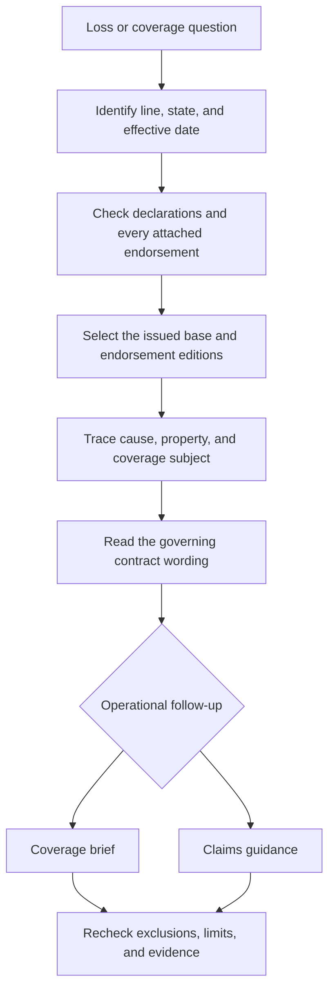

# Coverage Wiki Quickstart

<!-- openwiki: broken internal link [README.md#L15-L27] file "README.md" does not exist. Fix the href or restore the target, then delete this comment. -->
<!-- openwiki: broken internal link [training/guidance-versus-contract.md#L61-L83] file "training/guidance-versus-contract.md" does not exist. Fix the href or restore the target, then delete this comment. -->
This is a compact task-routing map, not a substitute for an issued policy, endorsement, state form, claims procedure, or applicable law. Forms and attached endorsements supply contract wording; claims pages and manuals provide operational guidance. A memorandum or training page can explain a change or review method, but cannot create, expand, restrict, or waive coverage ([document roles](README.md#L15-L27), [guidance boundary](training/guidance-versus-contract.md#L61-L83)).

When documents are combined, name the relationship: an endorsement **modifies** or **writes back** a base provision; a later edition **supersedes** an earlier edition for its stated policies; a state form **implements** a bulletin; and guidance **constrains** internal operations. Do not treat a limit, endorsement title, or claims instruction as a coverage grant.

## Required route

```mermaid
flowchart TD
    q["Loss or coverage question"] --> identify["Identify line, state, and effective date"]
    identify --> record["Check declarations and every attached endorsement"]
    record --> edition["Select the issued base and endorsement editions"]
    edition --> subject["Trace cause, property, and coverage subject"]
    subject --> wording["Read the governing contract wording"]
    wording --> route{"Operational follow-up"}
    route --> coverage["Coverage brief"]
    route --> claims["Claims guidance"]
    coverage --> verify["Recheck exclusions, limits, and evidence"]
    claims --> verify
```

1. Identify the line and state.
2. Confirm the policy-effective or renewal date and retrieve the issued base form.
3. Read declarations, schedules, and the complete attachment package.
4. Select the coverage part and damaged interest; establish the reported cause and sequence.
5. Read the applicable form and endorsement before consulting claims guidance.
6. Keep coverage, causation, scope and valuation, payment authority, and recovery as separate work products.

<!-- openwiki: broken internal link [README.md#L15-L31] file "README.md" does not exist. Fix the href or restore the target, then delete this comment. -->
<!-- openwiki: broken internal link [README.md#L33-L41] file "README.md" does not exist. Fix the href or restore the target, then delete this comment. -->
The repository path is load-bearing: it carries line, state, form, and edition context that a claim record does not carry ([repository layout](README.md#L15-L31)). Frozen forms remain available by edition; an older form continues to govern policies written under it, while guidelines and manuals are living operational material ([source lifecycle](README.md#L33-L41)). Use [Editions, Endorsements, and State Attachments](policy-assembly/editions-and-state-attachments.md) when the policy record is incomplete or documents must be composed.

## Fungi, mold, and water route

For a plumbing, appliance, seepage, flood, roof-entry, or microbial question, start with the two coverage briefs:

- [Water Damage](coverage/perils/water-damage.md) — trace the source and entry path, distinguish sudden discharge from repeated seepage, flood, external water, backup, freezing, and roof entry, then separate the failed source component from resulting damage.
- [Fungi, Wet or Dry Rot, and Bacteria](coverage/perils/fungi-and-bacteria.md) — apply the covered-cause-first prerequisite, preserved exclusions, remediation boundaries, and edition-specific aggregate.

<!-- openwiki: broken internal link [../forms/HO/MS/HO-04-81/2018-09.md#L8-L12] heading anchor "L8-L12" does not exist in "../forms/HO/MS/HO-04-81/2018-09.md". Fix the href or restore the target, then delete this comment. -->
<!-- openwiki: broken internal link [../forms/HO/MS/HO-04-81/2026-09.md#L1-L7] heading anchor "L1-L7" does not exist in "../forms/HO/MS/HO-04-81/2026-09.md". Fix the href or restore the target, then delete this comment. -->
<!-- openwiki: broken internal link [../forms/HO/MS/HO-04-81/2026-09.md#L23-L33] heading anchor "L23-L33" does not exist in "../forms/HO/MS/HO-04-81/2026-09.md". Fix the href or restore the target, then delete this comment. -->
HO 04 81 is an attached multistate endorsement to HO-3, not a stand-alone mold policy. The 2018-09 form remains applicable to policies written under that edition, including later-reported losses; its aggregate is $10,000. The 2026-09 edition applies to policies written or renewed on or after 2026-10-01, replaces 2018-09 for those policies, and raises the aggregate to $25,000. The 2026 edition states that other provisions are unchanged; do not infer a broader coverage result from the changed limit ([2018-09 supersession notice](../forms/HO/MS/HO-04-81/2018-09.md#L8-L12), [2026-09 applicability and change](../forms/HO/MS/HO-04-81/2026-09.md#L1-L7), [2026-09 limit](../forms/HO/MS/HO-04-81/2026-09.md#L23-L33)).

<!-- openwiki: broken internal link [../forms/HO/MS/HO-04-81/2018-09.md#L49-L67] heading anchor "L49-L67" does not exist in "../forms/HO/MS/HO-04-81/2018-09.md". Fix the href or restore the target, then delete this comment. -->
<!-- openwiki: broken internal link [../forms/HO/MS/HO-04-81/2026-09.md#L9-L21] heading anchor "L9-L21" does not exist in "../forms/HO/MS/HO-04-81/2026-09.md". Fix the href or restore the target, then delete this comment. -->
Both editions require fungi-related direct physical loss to covered property to result from a covered cause that occurred first. Both retain limitations for fungi arising from constant or repeated seepage or leakage and from flood. The endorsement does not turn an excluded water event into covered fungi loss; establish the water cause and the base-form grant or exclusion first ([2018 coverage sequence and exclusions](../forms/HO/MS/HO-04-81/2018-09.md#L49-L67), [2026 coverage sequence and exclusions](../forms/HO/MS/HO-04-81/2026-09.md#L9-L21)).

## Claims follow-up

After the contract route, use the operational pages:

- [Water Loss Handling](claims/guidelines/water-loss-handling.md) — source and movement, mitigation, evidence, coverage consultation, limits, escalation, payment, and closure.
- [Mold Claim Handling](claims/guidelines/mold-claim-handling.md) — moisture causation, microbial evidence, mitigation and remediation, coverage consultation, and closure.

<!-- openwiki: broken internal link [manuals/claims/manual.md#L13-L19] file "manuals/claims/manual.md" does not exist. Fix the href or restore the target, then delete this comment. -->
<!-- openwiki: broken internal link [forms/HO/MS/HO-04-81/2018-09.md#L35-L45] file "forms/HO/MS/HO-04-81/2018-09.md" does not exist. Fix the href or restore the target, then delete this comment. -->
Investigation, inspection, testing, mitigation, vendor assignment, or a remediation invoice does not itself establish coverage. Preserve failed parts, photographs, invoices, reports, timing, and repair findings where possible; separate emergency protection from permanent repair. Apply claims guidance only after checking the issued policy, attached endorsement, declarations, and applicable edition. The claims manual controls file handling and delegated authority, not contract interpretation ([claims manual boundary](manuals/claims/manual.md#L13-L19), [HO 04 81 investigation and cooperation](forms/HO/MS/HO-04-81/2018-09.md#L35-L45)).

## Final evidence check

Before publishing a position, confirm:

- line, state, effective date, declarations, and attachment status;
- governing base and endorsement editions, including superseded editions that still govern older policies;
- water source, movement, timing, covered property, and direct versus resulting damage;
- the acting grant, exclusion, write-back, limit, deductible, and settlement terms;
- the contract-versus-guidance boundary; and
- unresolved causation, attachment, valuation, authority, or evidence issues are escalated rather than guessed.

Use narrow canonical evidence citations such as `repo://forms/HO/MS/HO-04-81/2026-09.md#L23-L33` in research and review. The quickstart routes the work; the issued form and complete policy record decide the contract result.
