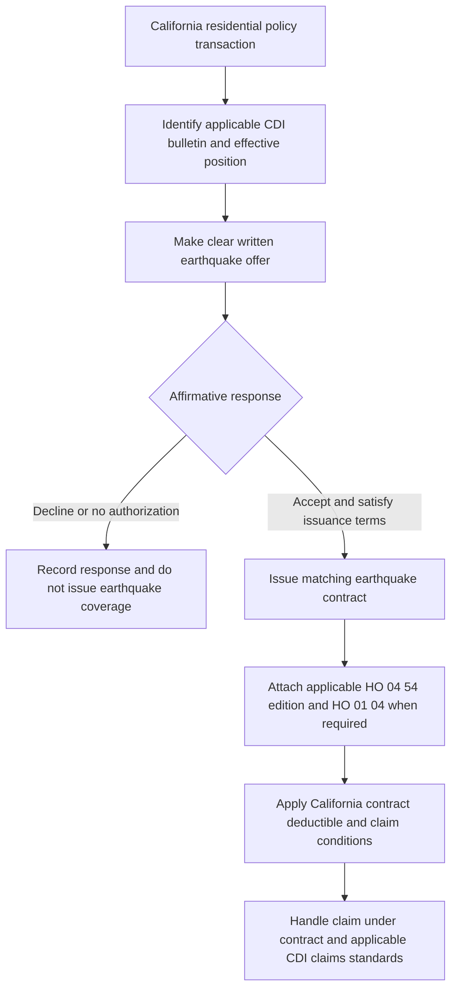

# California State Overlay

## Scope and the controlling layers

California has two distinct control layers:

1. **Regulatory transaction layer.** An admitted insurer offering or issuing eligible residential property insurance must make and document the earthquake-coverage offer. The offer, notice, response, filing, and claims-handling duties come from the applicable California Department of Insurance (CDI) bulletin.
2. **Contract layer.** Earthquake coverage exists only under the policy terms and an attached earthquake endorsement. An offer, acceptance record, or declination does not by itself turn an unendorsed homeowners policy into earthquake coverage.
3. **Internal underwriting layer.** The carrier manual controls eligibility, authority, referral, and file documentation. It is internal guidance and must not be used to alter coverage.

*This flow separates the California offer-and-record process from the contract grant and subsequent claim handling.*

The separation matters operationally: the offer process must be completed even when acceptance is unlikely, while coverage analysis must begin by identifying the policy package, attached form, edition, limits, deductible, exclusions, and conditions. The manual’s general rules also prohibit treating internal underwriting direction as a coverage grant ([manual Rule 100.B and 100.D](repo://manuals/underwriting/manual.md#L21-L37)).

## Effective positions and edition control

The repository contains one California homeowners amendatory-form edition and two California earthquake-offer bulletin positions. The multistate HO 04 54 editions are included because they supply the underlying earthquake contract that the California form may modify; they are not additional California amendatory-form editions.

| Authority | Effective position | Current or superseded treatment |
| --- | --- | --- |
| **HO 01 04 California Amendatory Endorsement, 2021-06** | Effective 2021-06-01. Applies to property and interests located in California and controls over conflicting policy language to the extent permitted by California law. | The California amendatory edition represented in this corpus; use it when it is the applicable attached state form. ([T.0](repo://forms/HO/CA/HO-01-04/2021-06.md#L1-L27)) |
| **CDI-2014-06 Mandatory Earthquake Coverage Offer** | Effective 2014-06-30. | Superseded by CDI-2022-03 for policies effective on or after 2022-03-14, but remains in force for policies written under the earlier bulletin. ([supersession and metadata](repo://bulletins/CA/cdi-2014-06-earthquake-offer.md#L1-L9)) |
| **CDI-2022-03 Mandatory Earthquake Coverage Offer** | Effective 2022-03-14. Applies to offers made on or after the applicable effective date and to eligible new or existing business when an offer obligation arises. | Current bulletin position in the source set; it requires procedures for the effective-date transition and consistent application. ([B.1.6-B.1.8](repo://bulletins/CA/cdi-2022-03-earthquake-offer.md#L25-L29), [B.1.21](repo://bulletins/CA/cdi-2022-03-earthquake-offer.md#L51-L57)) |
| **HO 04 54 Earthquake, 2009-04** | Effective 2009-04-01. | Superseded by the 2021-12 edition for policies effective on or after 2021-12-01, while remaining in force for policies written under it. ([metadata and supersession](repo://forms/HO/MS/HO-04-54/2009-04.md#L1-L9)) |
| **HO 04 54 Earthquake, 2021-12** | Effective 2021-12-01. | Later multistate earthquake-endorsement edition; confirm that it is the edition attached to the issued policy before applying its terms. ([metadata and attachment rules](repo://forms/HO/MS/HO-04-54/2021-12.md#L1-L27)) |

The supplied underlying **HO-3 Homeowners 3—Special Form, 2024-03** is effective 2024-03-01. It is a multistate base form, not a California amendatory form or a grant of earthquake coverage: its P.8 and X.4 exclude earth movement, including earthquake, so earthquake coverage requires the applicable attached endorsement and any California form in the issued package ([HO-3 metadata](repo://forms/HO/MS/HO-3/2024-03.md#L1-L7), [P.8](repo://forms/HO/MS/HO-3/2024-03.md#L467-L489), [X.4](repo://forms/HO/MS/HO-3/2024-03.md#L579-L591)). The base form has its own contract conditions, including a **90-day** proof-of-loss period after request and payment within **60 days** after agreement, final judgment, or appraisal; do not substitute those terms for attached HO 01 04 or HO 04 54 provisions without reading the complete package ([HO-3 S.13-S.18](repo://forms/HO/MS/HO-3/2024-03.md#L731-L747), [S.35](repo://forms/HO/MS/HO-3/2024-03.md#L769-L783)).

Do not select a form from the loss date alone. Verify the policy effective date, the edition shown in the package, the California attachment, and the bulletin position governing the transaction. A superseded source remains relevant to policies written under it; its deductible, notice period, and claim conditions must not be blended with a later edition.

## CDI-2014-06: requirements for its policy position

### Offer, notice, and disclosure

For transactions subject to CDI-2014-06, the admitted insurer must make a clear, timely, verifiable earthquake offer when it offers or issues California residential property insurance. The offer must make clear that earthquake coverage is separate from the underlying policy, explain that earthquake damage may not be covered without the separate coverage, identify material coverages, limitations, exclusions, conditions, limits, and premium implications, and avoid language that discourages consideration. The insurer may use an affiliated or participating insurer but remains responsible for the offer ([B.1](repo://bulletins/CA/cdi-2014-06-earthquake-offer.md#L13-L35)).

The notice is due **when residential property insurance is offered and again when a renewal offer is presented**. It must be clear, conspicuous, understandable, reasonably likely to be seen, and distinct from unrelated disclosures. It must state how to accept and decline, identify material limitations and the deductible, distinguish an offer from coverage already in force, and provide a contact method. Electronic delivery is permitted when lawful and agreed to, but the notice must remain printable or retainable ([B.3.1-B.3.22](repo://bulletins/CA/cdi-2014-06-earthquake-offer.md#L181-L225)).

The offer must disclose a **10% seismic deductible** and explain that the deductible applies before payment. It must provide a reasonable acceptance method, may require reasonably necessary underwriting information, and must not condition the offer on unrelated products. Silence cannot be treated as acceptance without affirmative authorization; the insurer must preserve evidence of the offer and the applicant’s acceptance, declination, or other response ([B.2.7-B.2.22](repo://bulletins/CA/cdi-2014-06-earthquake-offer.md#L69-L103)).

### Claims and records

CDI-2014-06 applies its claims standards to earthquake claims **received on or after 2014-06-30**. It requires written procedures for prompt, fair, and equitable handling; prompt acknowledgment with responsible-person contact information; reasonable investigation before denial or payment limitation; qualified personnel; plain-language assistance; reasonable requests for information; a written decision stating the relevant policy provisions and basis; distinction between covered and noncovered damage; payment of undisputed covered amounts without conditioning payment on disputed portions; and claim files containing material communications, investigation, evaluation, and decision records ([B.4.1-B.4.19](repo://bulletins/CA/cdi-2014-06-earthquake-offer.md#L259-L297)). There is no numeric acknowledgment or payment period in this bulletin’s claims section; “promptly” and “reasonable” are the operative timing standards.

The insurer must file the offer and related materials before use, identify the policy forms and presentation method, identify the effective date of each filed material, keep delivered materials identical to filed materials, and discontinue noncompliant material. The filing section applies on the bulletin’s effective date ([B.5.1-B.5.16](repo://bulletins/CA/cdi-2014-06-earthquake-offer.md#L305-L337)).

## CDI-2022-03: current offer and disclosure controls

### Offer mechanics and required content

For the 2022-03 position, the insurer must make an earthquake offer when issuing or renewing eligible residential property insurance. The offer must be written; electronic delivery is allowed only with the recipient’s consent and must be retainable or reproducible. It must use clear and conspicuous language, identify the offering insurer and related policy, describe the property, state limits and material terms, identify exclusions and conditions, state the premium or rating basis, and disclose underwriting conditions without using undisclosed criteria ([B.2.1-B.2.19](repo://bulletins/CA/cdi-2022-03-earthquake-offer.md#L59-L97)).

The offer must state a **15% seismic deductible of applicable covered loss** and explain how it applies. Acceptance must be affirmative and must identify the selected coverage and accepting person; silence is not acceptance. The insurer must confirm acceptance in writing with coverage, premium, deductible, and material conditions, confirm a declination in writing, preserve delivery and response records, and preserve the underwriting basis for any ineligibility decision ([B.2.10-B.2.29](repo://bulletins/CA/cdi-2022-03-earthquake-offer.md#L77-L117)).

The notice must identify the insurer and related policy, state that earthquake damage may not be covered unless earthquake coverage is purchased, explain how to request coverage, identify material limitations, exclusions, and deductibles, disclose underwriting requirements and separate premium when applicable, and state who will issue the coverage. It must be provided early enough to give a **meaningful opportunity to consider the offer** and must not be withheld until after the related policy transaction ([B.3.1-B.3.14](repo://bulletins/CA/cdi-2022-03-earthquake-offer.md#L181-L209)). A request for information is not a declination, and absence of a response is not affirmative acceptance ([B.3.22-B.3.25](repo://bulletins/CA/cdi-2022-03-earthquake-offer.md#L225-L231)).

A separate material notice deadline applies to nonrenewal: the insurer must provide a written notice of nonrenewal **at least 75 days before nonrenewal takes effect**. The earthquake offer must be kept separate from cancellation or nonrenewal communications when combining them would be misleading ([B.3.15-B.3.18](repo://bulletins/CA/cdi-2022-03-earthquake-offer.md#L211-L217)).

### Claims, records, and filing controls

CDI-2022-03 requires prompt claim acknowledgment, information sufficient to understand the process, a reasonable investigation before denial or limitation, qualified claim personnel, clear and nonmisleading communication, only reasonably relevant requests, consideration of available alternative evidence when records are unavailable through no fault of the claimant, inspection when reasonably necessary, and claim notes supporting material decisions. Denials or limitations must explain the policy provision and facts relied on; covered payment is due without unreasonable delay after the amount is determined, and undisputed payment cannot be withheld while another portion remains under review ([B.4.1-B.4.17](repo://bulletins/CA/cdi-2022-03-earthquake-offer.md#L259-L293)). The bulletin also preserves a reasonable opportunity for supplemental information and requires catastrophe-claim supervision and claim records available to CDI ([B.4.23-B.4.27](repo://bulletins/CA/cdi-2022-03-earthquake-offer.md#L305-L313)). It supplies no numeric claim-acknowledgment, decision, or payment deadline; “promptly,” “reasonable,” and “without unreasonable delay” are the stated standards.

Before use, the insurer must file the forms, endorsements, notices, offer, applications, elections, rejection or acknowledgment documents, and related materials. The filing must identify applicable policy forms, terms, limits, deductible, conditions, exclusions, presentation method, and response documentation. Unfiled or superseded materials may not be used, effective filings must be applied consistently, and the insurer remains responsible when a producer, vendor, or other person prepares, delivers, or administers the offer ([B.5.1-B.5.16](repo://bulletins/CA/cdi-2022-03-earthquake-offer.md#L315-L347)).

## HO 01 04: California contract overlay

HO 01 04 2021-06 applies only to property and interests located in California. It takes precedence over conflicting policy language, leaves nonconflicting provisions operating together, and enforces its terms only to the extent permitted by California law. It applies while the insurance is in force, subject to the form’s stated post-termination and legal-law exceptions ([T.0](repo://forms/HO/CA/HO-01-04/2021-06.md#L13-L29), [T.0 continuation](repo://forms/HO/CA/HO-01-04/2021-06.md#L41-L57)).

Its earthquake-specific contract terms are in T.8. The form states that the earthquake deductible is **15% of the applicable covered property value**, applies it to a covered earthquake loss, and treats damage arising from the same earthquake occurrence together. It also states that replacement-cost settlement for a covered building requires the building to be insured to at least **100% of replacement cost** at the time of loss ([T.8 T.7-T.19](repo://forms/HO/CA/HO-01-04/2021-06.md#L689-L729)). The contract’s percentage basis (“applicable covered property value”) must be reconciled with the wording of the filed offer, which CDI-2022-03 describes as 15% of applicable covered loss; do not silently substitute one basis for the other.

### Contractual notice and claim deadlines in HO 01 04

These are contract terms and must be kept separate from CDI’s regulatory offer requirements:

- A deductible-change notice must be written, identify the changed deductible, state its effective date, and be sent before the changed deductible applies. A changed deductible applies only to a covered loss occurring on or after that stated date ([T.2.1-T.2.12](repo://forms/HO/CA/HO-01-04/2021-06.md#L213-L237)). No numeric advance period is stated in this provision.
- Cancellation for nonpayment requires at least **10 days’ notice**; cancellation for another reason requires at least **20 days’ notice** and a stated reason. The notice must be written and identify the policy ([T.4.4-T.4.6](repo://forms/HO/CA/HO-01-04/2021-06.md#L349-L363)).
- Nonrenewal requires at least **75 days’ notice before the policy expires**. The written notice must identify the policy and state that it will not be renewed ([T.4.29-T.4.33](repo://forms/HO/CA/HO-01-04/2021-06.md#L407-L415)).
- A claim must be acknowledged within **15 days**. After requested items are received, the insurer must accept or reject the claim within **40 business days**, or provide a written explanation if it cannot decide; an accepted claim must be paid within **30 business days** ([T.5.1-T.5.6](repo://forms/HO/CA/HO-01-04/2021-06.md#L471-L483), [T.5.29-T.5.38](repo://forms/HO/CA/HO-01-04/2021-06.md#L529-L547)).
- The policyholder must give prompt claim notice, cooperate, protect property, preserve inspection evidence, provide a requested proof of loss, and comply with the policy’s proof-of-loss deadline. The form does not insert a numeric earthquake proof-of-loss deadline; it incorporates the deadline applicable elsewhere in the insurance ([T.5.1-T.5.18](repo://forms/HO/CA/HO-01-04/2021-06.md#L471-L507), [T.0 duties](repo://forms/HO/CA/HO-01-04/2021-06.md#L29-L47)).

## Relationship to HO 04 54 earthquake coverage

HO 01 04 does not replace the separate earthquake endorsement. Confirm that HO 04 54 is attached and identify its edition before applying coverage, limit, deductible, exclusion, or claim-condition language.

- **HO 04 54 2009-04:** covers direct physical loss to covered property caused by earthquake and treats related earth shocks from the same movement as one earthquake loss. Its W.3 wording states an earthquake deductible of **5%**, applies it after the covered loss is determined, and addresses dwelling, other structures, personal property, and losses involving more than one class of covered property; the supplied edition does **not** state a dwelling-limit or one-deductible-per-occurrence basis ([W.1](repo://forms/HO/MS/HO-04-54/2009-04.md#L57-L107), [W.3](repo://forms/HO/MS/HO-04-54/2009-04.md#L263-L317)). Its claim conditions require prompt notice within **90 days after discovery**, protection and inspection access, cooperation, records, examination under oath, and a signed statement when requested ([W.5](repo://forms/HO/MS/HO-04-54/2009-04.md#L523-L549), [W.5 continuation](repo://forms/HO/MS/HO-04-54/2009-04.md#L563-L585)).
- **HO 04 54 2021-12:** its W.1 grant covers the direct physical loss stated in that edition, including specified earthquake-caused ground movement and resulting physical damage. The same supplied edition later contains broad W.4 earth-movement exclusions that refer to earthquake loss, shaking, tremors, aftershocks, and shifting; that grant/exclusion tension must be read with the complete issued form and applicable California amendment, not simplified into an assumption that every earth-movement loss is covered or excluded. Its W.3 wording states an applicable earthquake deductible percentage of **10%**, applies it to covered Earthquake loss before payment, and says the deductible does not apply to property or loss that is not covered; the supplied edition does **not** state a Coverage A basis or a single aggregate across every property class ([W.1 grant](repo://forms/HO/MS/HO-04-54/2021-12.md#L80-L97), [W.3](repo://forms/HO/MS/HO-04-54/2021-12.md#L482-L522), [W.4 exclusions](repo://forms/HO/MS/HO-04-54/2021-12.md#L632-L645)). Its conditions require prompt notice and a report within **90 days after the loss occurs**, protection against further damage, preservation until inspection except for emergency action, cooperation, examination under oath, and a sworn proof of loss when requested ([W.5](repo://forms/HO/MS/HO-04-54/2021-12.md#L1032-L1065), [W.5 continuation](repo://forms/HO/MS/HO-04-54/2021-12.md#L1067-L1093)).

For a California policy, HO 01 04’s 15% earthquake term is the state contract overlay shown in the source set. Do not carry forward the 5% or 10% multistate percentage merely because the attached earthquake endorsement is an older or newer HO 04 54 edition; use the issued declarations, attached state form, and filed offer package together. The multistate forms do not supply the California 15% contract basis.

## How the form carries out the overlay

The explicit form-to-bulletin implementation link is HO 01 04 **T.57**. It implements the referenced CDI-2022-03 B.2 requirement by directing that its provision be applied as required by the bulletin, subject to applicable law ([HO 01 04 T.57](repo://forms/HO/CA/HO-01-04/2021-06.md#L169-L175), [CDI-2022-03 B.2](repo://bulletins/CA/cdi-2022-03-earthquake-offer.md#L59-L97)). Because T.57 appears inside the endorsement’s windstorm-and-hail section, it is not a standalone earthquake grant and does not, by itself, prove that an insurer made the offer, obtained affirmative authorization, or completed CDI filing.

The form also carries contract terms that make the regulatory disclosure operationally testable:

- **Deductible:** HO 01 04 T.8 supplies the 15% contract term, while CDI-2022-03 B.2.10-B.2.11 requires the offer to state 15% and explain its application. The form provision and bulletin provision must be read together; their different stated bases require reconciliation in the filed policy package ([HO 01 04 T.8](repo://forms/HO/CA/HO-01-04/2021-06.md#L703-L709), [CDI-2022-03 B.2.10-B.2.11](repo://bulletins/CA/cdi-2022-03-earthquake-offer.md#L77-L81)).
- **Nonrenewal:** HO 01 04 T.4.30 requires 75 days before expiration, matching CDI-2022-03 B.3.15’s 75-day nonrenewal notice requirement ([HO 01 04 T.4.29-T.4.33](repo://forms/HO/CA/HO-01-04/2021-06.md#L407-L415), [CDI-2022-03 B.3.14-B.3.17](repo://bulletins/CA/cdi-2022-03-earthquake-offer.md#L205-L217)). This aligns the contract notice with the regulator’s notice timing; it does not replace the separate earthquake offer.
- **Claims:** HO 01 04 adds concrete contract acknowledgment, decision, and payment periods, while CDI-2022-03 supplies regulatory standards for prompt acknowledgment, reasonable investigation, written explanations, undisputed payment, supplemental information, supervision, and records. Meeting one layer does not eliminate the other ([HO 01 04 T.5](repo://forms/HO/CA/HO-01-04/2021-06.md#L471-L571), [CDI-2022-03 B.4](repo://bulletins/CA/cdi-2022-03-earthquake-offer.md#L259-L313)).

## Internal underwriting controls

Internal manual rules are not regulatory text and do not change the policy. Before binding or attaching earthquake-related coverage, the underwriter must confirm that the attachment reflects the risk location and construction characteristics and review the quake deductible ([manual Rule 400.AH](repo://manuals/underwriting/manual.md#L5289-L5293)). California state exceptions prohibit altering, waiving, or negotiating the quake deductible without authorized underwriting direction and require referral of requests outside approved handling ([manual Rule 520.AB](repo://manuals/underwriting/manual.md#L6741-L6745)). The file must preserve facts, sources, analysis, and authority action for referrals, exceptions, and adverse decisions ([manual Rule 520.AT](repo://manuals/underwriting/manual.md#L6849-L6853)).

Other California manual thresholds are also internal controls, not contract limits: bind only within delegated line-underwriter authority of **$1,000,000** and refer above it; do not issue Coverage A above **$2,000,000**; and require the valuation review to support **100% insured-to-value** before offering replacement-cost settlement ([manual Rule 520.A](repo://manuals/underwriting/manual.md#L6577-L6583), [Rule 520.B-520.C](repo://manuals/underwriting/manual.md#L6585-L6595)). The 100% manual review is an underwriting eligibility and valuation control; it must not be confused with HO-3’s supplied **80%** replacement-cost threshold or with HO 01 04’s **100%** contract condition when that state form applies ([HO-3 A.10](repo://forms/HO/MS/HO-3/2024-03.md#L113-L123), [HO 01 04 T.18-T.19](repo://forms/HO/CA/HO-01-04/2021-06.md#L723-L729)).

A practical handoff checklist is:

1. Identify the policy effective date, the applicable HO-3 base edition, bulletin position, HO 01 04 attachment, and HO 04 54 edition.
2. Confirm that the offer is written or lawfully electronic, clearly separate from the underlying policy, and includes insurer, policy, property, limit, premium or rating basis, exclusions, conditions, and the applicable deductible.
3. Require affirmative acceptance before issuing earthquake coverage; record delivery, response, declination, or the documented eligibility basis.
4. Assemble the issued contract so the HO-3 base form, attached California form, earthquake endorsement, declarations, limits, and deductible do not conflict with the filed offer.
5. For a claim, record notice timing, occurrence or loss date, causation, covered property, deductible basis, inspection opportunity, proof and records, and any applicable CDI and contractual claim deadlines.
6. Keep the CDI offer records, form version, filed-material evidence, policy document, and claim file available for examination.

## Related pages

- [HO-3 form editions](/openwiki/coverage/forms/ho-3.md)
- [Earthquake coverage and California offer requirements](/openwiki/coverage/perils/earthquake.md)
- [Edition and state-attachment control](/openwiki/policy-assembly/editions-and-state-attachments.md)
- [California appetite and internal underwriting controls](/openwiki/underwriting/guidelines/california-appetite.md)
