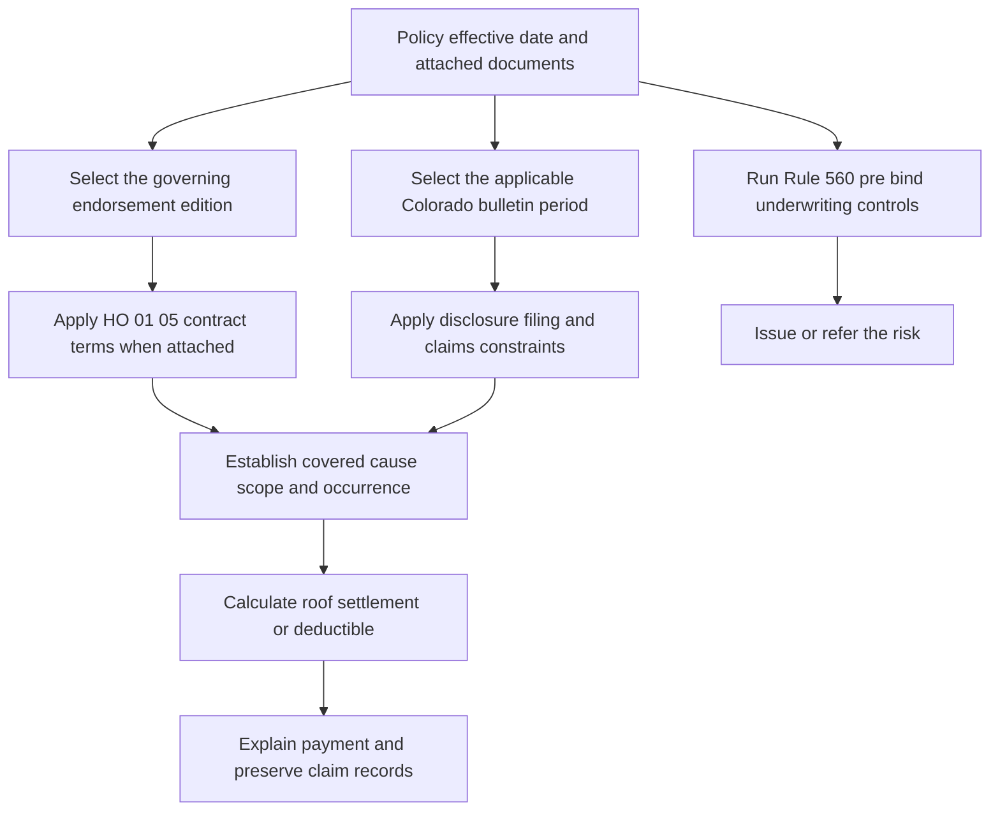

# Colorado State Overlay

This page separates three authorities that must be read together without being conflated:

1. **Contract:** the attached **HO 01 05 Colorado Amendatory Endorsement, edition 2022-10**, changes the policy only within its stated scope. A changed term controls a conflicting policy term, while unchanged terms remain applicable; the endorsement does not broaden or reduce coverage except where it expressly does so ([HO 01 05, T.0](repo://forms/HO/CO/HO-01-05/2022-10.md#L13-L57)).
2. **Regulatory overlay:** Colorado Division of Insurance bulletins constrain how an insurer offers, files, discloses, and administers a deductible or roof settlement. They do not silently create coverage or replace the policy wording ([DOI-2019-05, B.1.3-B.1.5](repo://bulletins/CO/doi-2019-05-hail-deductibles.md#L13-L31), [DOI-2022-08, B.1.3-B.1.8](repo://bulletins/CO/doi-2022-08-roof-settlement.md#L17-L31)).
3. **Internal underwriting control:** Personal Lines Underwriting Manual Rule 560 governs eligibility, referral, authority, and file documentation. It is internal carrier direction and must not be used to alter coverage or interpreted as a coverage grant ([Manual, Rules 100.A-100.E](repo://manuals/underwriting/manual.md#L15-L43)).

The controlling question is always which policy and endorsement edition was effective for the policy and attached to it. A later bulletin, endorsement, or manual rule must not be backdated into an earlier contract.

## Document lifecycle and supersession

| Document | Effective point and lifecycle | Practical consequence |
|---|---|---|
| **DOI-2013-01 — Hail Deductibles** | Issued and effective **2013-01-15**. It is marked superseded by DOI-2019-05 for policies effective on or after **2019-05-20**, but remains in force for policies written under it ([metadata and supersession](repo://bulletins/CO/doi-2013-01-hail-deductibles.md#L1-L9)). | Use the 3% ceiling and the 2013 disclosure and claim-administration rules for an in-scope policy written under this bulletin. Do not replace it with the later 5% rule merely because the claim is adjusted later. |
| **DOI-2019-05 — Hail Deductibles** | Effective on issuance **2019-05-20**. It applies prospectively to forms, endorsements, underwriting, sales, and claim practices used after that date and does not retroactively change an already issued policy ([B.1.3-B.1.4](repo://bulletins/CO/doi-2019-05-hail-deductibles.md#L13-L31)). | Use it for its applicable prospective regulatory requirements and for policies within its scope. The policy still controls the contractual deductible. |
| **DOI-2022-08 — Roof Settlement Disclosures** | Edition and effective date are **2022-08-09**. The claims section is effective upon issuance and applies to claim activity while the bulletin is effective ([metadata](repo://bulletins/CO/doi-2022-08-roof-settlement.md#L1-L8), [B.4.1-B.4.2](repo://bulletins/CO/doi-2022-08-roof-settlement.md#L229-L233)). | Apply the roof-disclosure and roof-claim communication duties to covered roof claims and to settlement communications in the bulletin's scope. |
| **HO 01 05 Colorado Amendatory Endorsement, 2022-10** | Edition **2022-10**, effective **2022-10-01** ([metadata](repo://forms/HO/CO/HO-01-05/2022-10.md#L1-L9)). It operates as an attached contract amendment, not as a free-standing bulletin ([T.0](repo://forms/HO/CO/HO-01-05/2022-10.md#L13-L31)). | Apply its 1%-5% deductible, occurrence, notice, roof, claim, and other amended terms only when this endorsement is attached and its scope reaches the loss. |

### Relationship between the 2019 bulletin and HO 01 05

The endorsement expressly directs the insurer to administer its windstorm and hail deductible as required by Colorado Bulletin DOI-2019-05 and requires the insured to provide reasonably requested information used to determine the deductible ([HO 01 05, T.1-T.4](repo://forms/HO/CO/HO-01-05/2022-10.md#L59-L67)). The form therefore **implements** the 2019 bulletin for the contractual deductible mechanism, but the two documents retain different roles: the endorsement supplies the contract and the bulletin supplies regulatory requirements for policy language, disclosure, filing, and administration. The form does not contain an equivalent statement that it implements DOI-2022-08; treat the roof bulletin as a disclosure and claims-administration constraint rather than as an implied roof endorsement.

*This flow shows date-sensitive contract selection followed by regulatory administration and separate internal underwriting controls.*

## Windstorm and hail deductible

### Thresholds and covered-loss gate

The superseded 2013 bulletin capped any windstorm or hail deductible at **3% of the applicable property coverage limit**. It required a clear policy statement identifying the affected coverage, trigger, calculation basis, and relationship to another deductible ([DOI-2013-01, B.2.1-B.2.10](repo://bulletins/CO/doi-2013-01-hail-deductibles.md#L59-L79)). The 2013 bulletin also required pre-bind deductible information, accurate declarations and endorsements, advance notice of a change before it became applicable, and records supporting selections and changes ([DOI-2013-01, B.2.13-B.2.19](repo://bulletins/CO/doi-2013-01-hail-deductibles.md#L85-L99)).

The 2019 bulletin changed the regulatory ceiling to **5% of the applicable covered loss** and requires a percentage deductible to be calculated using the **value stated in the policy**. The insurer must disclose the value used and state whether the deductible applies separately to each covered loss or otherwise under the policy ([DOI-2019-05, B.2.1-B.2.10](repo://bulletins/CO/doi-2019-05-hail-deductibles.md#L59-L79)). The 2013 3% limit and the 2019 5% limit are period-specific; do not blend them.

HO 01 05 (2022-10) sets the contractual windstorm and hail deductible at **not less than 1% and not more than 5%**. It applies only to a covered windstorm or hail loss, subtracts from the covered loss, and does not pay the covered portion within the deductible ([HO 01 05, T.1-T.5](repo://forms/HO/CO/HO-01-05/2022-10.md#L59-L75), [T.18-T.19](repo://forms/HO/CO/HO-01-05/2022-10.md#L93-L99)). The bulletin's 5% ceiling and the endorsement's 1%-5% contractual range are not a reason to apply the endorsement to a policy that does not carry it.

The deductible is a **coverage-gated allocation**, not an exclusion or coverage grant:

- Windstorm or hail must cause covered direct physical loss. The endorsement applies to covered property, including structures and personal property, but not to property for which windstorm or hail coverage is unavailable ([HO 01 05, T.4-T.7 and T.11-T.13](repo://forms/HO/CO/HO-01-05/2022-10.md#L65-L85)).
- Windstorm or hail may be the sole cause or act with another cause. Covered and uncovered damage must be separated when reasonably possible; the deductible applies to the covered amount, not to noncovered work ([HO 01 05, T.6-T.7 and T.29-T.32](repo://forms/HO/CO/HO-01-05/2022-10.md#L69-L75), [T.29-T.32](repo://forms/HO/CO/HO-01-05/2022-10.md#L117-L123)).
- The endorsement applies the deductible to covered loss before a payment limitation and before depreciation when the valuation terms require depreciation. Emergency measures, repair, replacement, restoration, and supplemental amounts remain subject to applicable coverage and deductible terms ([HO 01 05, T.8 and T.20](repo://forms/HO/CO/HO-01-05/2022-10.md#L75-L99), [T.40-T.43](repo://forms/HO/CO/HO-01-05/2022-10.md#L139-L145)).
- One occurrence does not become multiple deductibles merely because several items are damaged or damage is discovered at different times. Related damage from the same windstorm or hail event is one loss; separate weather events may be separate occurrences ([HO 01 05, T.14-T.15 and T.21-T.24](repo://forms/HO/CO/HO-01-05/2022-10.md#L85-L107)).
- A payment from another person, a mortgagee, lienholder, additional insured, contractor, or other interested party does not eliminate or reduce the insured's deductible responsibility ([HO 01 05, T.9-T.10 and T.35-T.38](repo://forms/HO/CO/HO-01-05/2022-10.md#L75-L85), [T.63-T.65](repo://forms/HO/CO/HO-01-05/2022-10.md#L185-L189)).

### Notice and disclosure

For a policy containing a Colorado hail deductible, DOI-2019-05 requires a clear, reasonably understandable, conspicuous disclosure. Before binding, the applicant must be able to understand the deductible; a renewal offer must disclose a material change; and adding a deductible to existing coverage requires a new disclosure ([DOI-2019-05, B.3.1-B.3.3](repo://bulletins/CO/doi-2019-05-hail-deductibles.md#L151-L159)). The disclosure must, at minimum, identify the policy provision, trigger, affected property, calculation basis, minimum or maximum, separate-deductible treatment, and treatment of hail combined with another covered cause ([DOI-2019-05, B.3.4-B.3.14](repo://bulletins/CO/doi-2019-05-hail-deductibles.md#L159-L175)).

The insurer must use consistent terminology across applications, declarations, endorsements, policy documents, renewal materials, and claim communications. The material must not obscure the deductible or portray it as a benefit, discount, or optional term when the offered form requires it. A required disclosure must be affirmatively provided, be retainable, and be supported by records showing its content, method, policy, and delivery date. Producers and representatives do not shift responsibility away from the insurer ([DOI-2019-05, B.3.15-B.3.23](repo://bulletins/CO/doi-2019-05-hail-deductibles.md#L175-L193), [B.3.25-B.3.38](repo://bulletins/CO/doi-2019-05-hail-deductibles.md#L201-L227)).

The 2019 bulletin requires **written notice at least 30 days before an increase in a windstorm deductible takes effect**. The notice must explain the change and its effect on the policyholder's responsibility ([DOI-2019-05, B.3.2-B.3.4](repo://bulletins/CO/doi-2019-05-hail-deductibles.md#L153-L161)). HO 01 05 repeats a contractual **30-day written notice** rule for an increase to the windstorm deductible. It sends notice to the mailing address in the insurer's records, permits electronic notice when the insured agreed to electronic communications, and requires the notice to state the post-change deductible and applicable coverage ([HO 01 05, T.1-T.6](repo://forms/HO/CO/HO-01-05/2022-10.md#L211-L225)).

A deductible change under the endorsement is prospective: it cannot be applied to a loss occurring before the change takes effect. A later notice may replace an earlier change for the same deductible, but a notice does not otherwise change coverage, override the policy's multiple-deductible rules, or waive a policy term. Notice to the named insured is notice to all insureds; a clerical correction cannot reduce coverage for a prior loss ([HO 01 05, T.7-T.18](repo://forms/HO/CO/HO-01-05/2022-10.md#L223-L249)).

### Filing and operational controls

DOI-2019-05 requires filing for approval of policy forms, endorsements, deductible provisions, and related rules that establish or change a hail deductible. The filing must identify the affected coverage, trigger, calculation method, options, underwriting and rating effect, and disclosure materials. Material revisions must be filed before use, and the insurer may not apply the provision before the authorized effective date ([DOI-2019-05, B.5.1-B.5.10](repo://bulletins/CO/doi-2019-05-hail-deductibles.md#L259-L279)). Department approval does not remove the insurer's responsibility for lawful, nonmisleading administration, and inaction is not approval ([DOI-2013-01, B.5.11-B.5.16](repo://bulletins/CO/doi-2013-01-hail-deductibles.md#L281-L291)).

The underwriting manual adds a pre-bind control but is not a coverage document. Rule 560 directs the underwriter to apply a wind-deductible ceiling and refer a request that exceeds approved handling, and to refer risks with hail damage affecting the roof or exterior. The file must record the requested deductible, disposition, hail condition, and underwriting determination ([Manual, Rule 560.AJ and Rule 560.AL](repo://manuals/underwriting/manual.md#L8063-L8085)).

## Roof settlement disclosure overlay

DOI-2022-08 applies when a Colorado insurer communicates an estimate, settlement, payment, or coverage determination involving roof damage, whether directly or through an authorized representative. It covers repair, replacement, actual cash value, depreciation, deductible application, and other settlement elements, and requires disclosures that are clear, accurate, accessible, retainable, and consistent with the policy ([DOI-2022-08, B.1.1-B.1.7 and B.1.11-B.1.18](repo://bulletins/CO/doi-2022-08-roof-settlement.md#L13-L49)). It does **not** establish an all-other-perils deductible minimum, coinsurance threshold, or ALE percentage ([DOI-2022-08, B.1.8-B.1.10](repo://bulletins/CO/doi-2022-08-roof-settlement.md#L27-L33)).

### Roof age and settlement method

For a policy providing roof-surfacing coverage, the bulletin requires the insurer to identify the settlement method and distinguish roof surfacing from other damaged property when methods differ. An actual-cash-value roof schedule may be applied to roof surfacing only when the roof age is at least **15 years**. The insurer must explain how age is determined, consider reliable information not generated by the insurer, and explain depreciation and any material limitation based on age, condition, material, or useful life ([DOI-2022-08, B.2.1-B.2.15](repo://bulletins/CO/doi-2022-08-roof-settlement.md#L59-L91)).

When roof surfacing is replaced, the bulletin requires payment of **not less than 25% of the applicable roof-surfacing replacement cost, subject to the policy deductible**. Depreciation or a schedule adjustment may not be used to avoid that floor ([DOI-2022-08, B.2.28-B.2.32](repo://bulletins/CO/doi-2022-08-roof-settlement.md#L115-L123)). This is a bulletin requirement for the stated circumstance; it is not a license to rewrite an attached policy's settlement terms.

HO 01 05 separately states that its **actual cash value roof schedule** applies to a roof covering that has reached **15 years**, and that the applicable loss-settlement provision then governs the roof covering ([HO 01 05, T.8](repo://forms/HO/CO/HO-01-05/2022-10.md#L697-L717)). The form is the contractual source for that amendment; DOI-2022-08 supplies the disclosure and claim-administration duties. The age trigger happens to align, but the form's deductible provisions and the bulletin's 25% minimum must each be applied according to their own wording.

The disclosure must state whether the roof is settled at replacement cost, actual cash value, repair cost, or another policy-authorized method; whether depreciation is applied or recoverable; what conditions permit replacement-cost benefits; the deductible; age, condition, material, cause, matching, ordinance-or-law, debris-removal, tear-off, disposal, labor, and material limitations; and which roof components are included or excluded ([DOI-2022-08, B.3.1-B.3.21](repo://bulletins/CO/doi-2022-08-roof-settlement.md#L151-L193)). An estimate must identify the scope, repair versus replacement work, material and labor, deductions, and the basis for differences from a policyholder's estimate ([DOI-2022-08, B.3.15-B.3.20](repo://bulletins/CO/doi-2022-08-roof-settlement.md#L179-L191), [B.4.5-B.4.12](repo://bulletins/CO/doi-2022-08-roof-settlement.md#L235-L255)).

### Roof notice timing and filing

The insurer must provide the required roof disclosure before an applicant is bound to coverage and with a renewal when the roof settlement method changes. For a claim involving roof damage, the insurer must provide notice **before issuing a settlement offer that includes a roof valuation**, and must update it when a material change affects the settlement ([DOI-2022-08, B.2.19-B.2.23](repo://bulletins/CO/doi-2022-08-roof-settlement.md#L97-L105), [B.3.1-B.3.4](repo://bulletins/CO/doi-2022-08-roof-settlement.md#L151-L161)). A clear written explanation of the proposed settlement must precede a request for acceptance ([DOI-2022-08, B.4.1-B.4.10](repo://bulletins/CO/doi-2022-08-roof-settlement.md#L229-L249)).

Each roof settlement disclosure must be filed before use, and a revision affecting content, presentation, or applicability must be filed before the revised version is used. The filed version must match the version delivered; a superseded disclosure must not be substituted for the current one ([DOI-2022-08, B.5.1-B.5.7 and B.5.9-B.5.16](repo://bulletins/CO/doi-2022-08-roof-settlement.md#L285-L317)).

## Claims-handling requirements

### Hail claims

For a Colorado hail claim, the 2019 bulletin requires prompt acknowledgment, fair investigation without unreasonable delay, reasonable inspection when needed, and a factual distinction between hail damage, covered damage from other causes, preexisting damage, wear, deterioration, and excluded causes. The file must document the evidence and causal determination ([DOI-2019-05, B.4.1-B.4.10](repo://bulletins/CO/doi-2019-05-hail-deductibles.md#L229-L249)).

Before applying the deductible, the insurer must identify the policy provision, explain the effect on payment, provide a clear calculation, and determine whether the damage arose from one or distinct occurrences. The insurer must not apply the deductible more than the policy permits ([DOI-2019-05, B.4.4-B.4.14](repo://bulletins/CO/doi-2019-05-hail-deductibles.md#L235-L249)). Denials and limitations require written policy and factual explanations. The insurer must consider relevant estimates, photographs, contractor information, reinspection requests, and supplemental damage; it may not require a particular contractor or withhold an undisputed covered amount because another portion remains disputed ([DOI-2019-05, B.4.15-B.4.27](repo://bulletins/CO/doi-2019-05-hail-deductibles.md#L257-L283)).

The endorsement adds the insured's claim duties: prompt loss notice, cooperation, reasonable access, preservation of damaged property and evidence, truthful records, proof of loss when requested, and examination under oath when reasonably requested. The insurer may request records, photographs, estimates, and repair or property-condition information, but must evaluate the covered amount rather than treating visible damage, a contractor choice, or repair pricing as conclusive ([HO 01 05, Claims Handling T.1-T.19](repo://forms/HO/CO/HO-01-05/2022-10.md#L489-L527), [windstorm and hail T.45-T.62](repo://forms/HO/CO/HO-01-05/2022-10.md#L149-L183)).

### Roof claims

For a roof claim, DOI-2022-08 requires an itemized estimate and a plain-language explanation of material estimating entries. The insurer must identify damaged, undamaged, included, and excluded components; explain depreciation and amounts withheld pending repair or replacement; address material differences from a policyholder estimate; and state whether the proposal is repair, replacement, or another method ([DOI-2022-08, B.4.3-B.4.13](repo://bulletins/CO/doi-2022-08-roof-settlement.md#L235-L255)).

A denial, partial denial, excluded-cause determination, or decision not to include claimed work must identify both policy and factual bases. The insurer must explain each payment, update the settlement information when scope, valuation, depreciation, deductible, or coverage changes, and respond meaningfully to requests for clarification ([DOI-2022-08, B.4.14-B.4.23](repo://bulletins/CO/doi-2022-08-roof-settlement.md#L257-L275)). It must not require a particular contractor, call a payment full and final when rights remain, or condition a supplemental roof claim on acceptance of an earlier settlement ([DOI-2022-08, B.4.16-B.4.17 and B.4.24-B.4.27](repo://bulletins/CO/doi-2022-08-roof-settlement.md#L259-L283)). Required notices must not delay adjustment or payment, and the claim file must retain the notice, delivery method and date, valuation, depreciation, coverage decision, and supporting inspection findings ([DOI-2022-08, B.3.29-B.3.38](repo://bulletins/CO/doi-2022-08-roof-settlement.md#L209-L227)).

### Contractual claim deadlines

HO 01 05 contains these numeric claim and policy-action periods:

| Event | Contractual period or deadline |
|---|---|
| Claim acknowledgment | Acknowledge receipt **within 15 days**. The acknowledgment may be oral, electronic, or written ([HO 01 05, T.3-T.4](repo://forms/HO/CO/HO-01-05/2022-10.md#L491-L499)). |
| Accept or reject claim | **Within 60 business days after receiving all requested items necessary to decide**; communicate the decision ([HO 01 05, T.20-T.23](repo://forms/HO/CO/HO-01-05/2022-10.md#L529-L535)). |
| Pay accepted claim | **Within 30 business days**; payment may be made to the insured or another person entitled to payment ([HO 01 05, T.24-T.26](repo://forms/HO/CO/HO-01-05/2022-10.md#L537-L543)). |
| Legal action | An action against the insurer must be brought **within two years after the date of loss** ([HO 01 05, Suit Against Us T.1-T.10](repo://forms/HO/CO/HO-01-05/2022-10.md#L641-L661)). |
| Cancellation for nonpayment | At least **10 days' notice** before cancellation takes effect ([HO 01 05, Cancellation and Nonrenewal T.1-T.7](repo://forms/HO/CO/HO-01-05/2022-10.md#L325-L341)). |
| Cancellation for another reason | At least **30 days' notice**, with the reason stated ([HO 01 05, Cancellation and Nonrenewal T.3-T.6](repo://forms/HO/CO/HO-01-05/2022-10.md#L331-L337)). |
| Nonrenewal | At least **30 days' notice before policy expiration** ([HO 01 05, Cancellation and Nonrenewal T.2-T.6](repo://forms/HO/CO/HO-01-05/2022-10.md#L327-L337)). |

The endorsement requires a signed, sworn proof of loss **when the policy requires it**, but this edition does not state a numeric number of days for submitting that proof in the cited claim provisions. Do not invent a proof-of-loss deadline; locate any applicable requirement in the governing policy text ([HO 01 05, T.0-T.11 and Claims Handling T.10-T.12](repo://forms/HO/CO/HO-01-05/2022-10.md#L29-L35), [repo://forms/HO/CO/HO-01-05/2022-10.md#L507-L515)).

The endorsement also defines a **Named Storm Period** rather than a fixed number of days: it runs while a named storm is subject to an official advisory, watch, warning, or similar declaration applicable to the residence premises, including an interruption while the storm remains capable of causing direct physical loss. It ends when the storm no longer presents such conditions. The insured must promptly report the loss, protect property, preserve evidence, allow inspection, and avoid permanent repairs before a reasonable inspection opportunity except for necessary emergency protection ([HO 01 05, Named Storm Period T.1-T.10 and T.21-T.23](repo://forms/HO/CO/HO-01-05/2022-10.md#L259-L305)). The period does not itself create coverage for flood, surface water, earth movement, preexisting openings, wear, or deterioration ([HO 01 05, Named Storm Period T.4-T.5 and T.16-T.20](repo://forms/HO/CO/HO-01-05/2022-10.md#L265-L299)).

## Underwriting entrypoint and separation from claims

Rule 560 requires an underwriter to verify Colorado location, occupancy, insurable interest, and prior loss information before binding. For roof risks, it requires a roof inspection before binding when reported roof age is **12 years or more**, declines a reported roof age of **22 years or more**, refers submissions lacking information needed to apply the roof schedule trigger, and refers visible roof deterioration, damage, or active leakage until acceptable corrective action is supported ([Manual, Rule 560.A-560.H](repo://manuals/underwriting/manual.md#L7857-L7905)). It also refers weather-susceptible roof materials and hail damage concerns affecting the roof or exterior ([Manual, Rule 560.I and Rule 560.AL](repo://manuals/underwriting/manual.md#L7907-L7911), [repo://manuals/underwriting/manual.md#L8081-L8085]).

These **12-year inspection** and **22-year declination** points are underwriting controls. They are not a 12-year or 22-year claim settlement rule and cannot be used to deny a covered loss or replace the attached HO 01 05 roof schedule, whose trigger is 15 years. Rule 560 also requires a complete file for every referred or declined Colorado risk, including facts, sources, conditions, authority, and final disposition ([Manual, Rule 560.BH](repo://manuals/underwriting/manual.md#L8213-L8217)).

## Defensible operational checklist

For each quote, policy change, or claim, preserve the following in the appropriate underwriting or claim record:

1. **Identity and period:** policy state, line, effective date, attached HO 01 05 edition, applicable bulletin period, and whether a prior bulletin or policy edition remains controlling.
2. **Contract terms:** deductible percentage, affected coverage, cause trigger, occurrence allocation, roof schedule, valuation method, exclusions, and any other deductible.
3. **Disclosure:** pre-bind, renewal, change, and claim-stage disclosure; clear statement of calculation basis, deductible effect, roof method, age, depreciation, components, and limitations.
4. **Evidence:** weather information, inspection findings, photographs, roof-age records, estimates, repair records, condition evidence, causation analysis, and covered-versus-uncovered allocation.
5. **Timing:** 30-day notice before an increased windstorm deductible; 15-day claim acknowledgment; 60-business-day decision clock after necessary requested items; 30-business-day payment clock after acceptance; and the two-year suit period.
6. **Communication and correction:** written deductible or roof-settlement calculation, reasons for denial or limitation, supplemental and reinspection response, undisputed payment handling, and correction of any inaccurate disclosure or calculation.
7. **Records and authority:** filing version, delivery method and date, claim communications, claim determination, underwriting referral authority, and final disposition.

The most common failures are using DOI-2013-01's 3% cap for a later policy, applying a 2022 form without confirming attachment, treating a bulletin or underwriting manual as a coverage amendment, applying a deductible without covered hail or wind causation, counting one occurrence twice, treating the 15-year roof trigger as proof of damage or coverage, or omitting the factual and policy basis from a roof or hail settlement explanation. Resolve period, contract, regulatory, and evidence conflicts explicitly rather than silently substituting one authority for another.

## Related pages

- [Windstorm, Hail, and Percentage Deductibles](/openwiki/coverage/perils/wind-hail-deductibles.md)
- [Roof Surfacing Settlement and Roof Claims](/openwiki/coverage/settlement/roof-settlement.md)
- [Policy Assembly: Editions, Endorsements, and State Overlays](/openwiki/policy-assembly/editions-and-state-attachments.md)
- [Underwriting manual state exceptions](/openwiki/underwriting/manual/state-exceptions.md)
