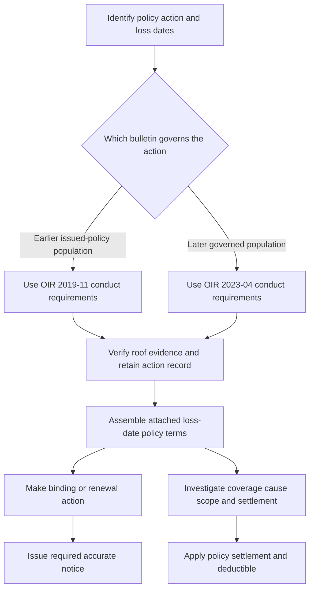

# Florida Overlay — Roof, Wind, Notices, and Claims

## Scope: three controls, one loss-date policy record

This overlay applies the reviewed Florida sources without turning any one of them into another. For a particular risk or claim, first identify the policy and endorsement actually in force, its declarations, the loss or underwriting-action date, and the policyholder/risk location. The Florida amendatory endorsement is contractual only when attached: it forms part of the policy, changes only differing terms, and controls a conflict with the base policy. The OIR bulletins regulate insurer conduct; they expressly do not amend a policy. The underwriting manual is internal carrier guidance, not policy language. [HO 01 09 (2023-07), T.0](repo://forms/HO/FL/HO-01-09/2023-07.md#L13-L35) [OIR-2023-04, B.1](repo://bulletins/FL/oir-2023-04-roof-age-nonrenewal.md#L45-L53) [Underwriting Manual, Rule 500.AX](repo://manuals/underwriting/manual.md#L6219-L6225)

| Control | What it governs | What it cannot decide by itself |
| --- | --- | --- |
| **HO 01 09 Florida Amendatory Endorsement** | Attached-policy deductible, roof settlement, claims duties/timing, cancellation/nonrenewal, and seacoast terms. | A coverage grant beyond its express terms, or an unattached endorsement's terms. |
| **OIR bulletin governing the action** | Carrier underwriting, inspection, nonrenewal notice, recordkeeping, and claim-handling conduct. | The loss-date contract's coverage or settlement wording. |
| **Underwriting Manual Rule 500** | Carrier appetite, binding, referral, documentation, and approved operational action. | Policy coverage, a claim exclusion, claim valuation, or a regulatory safe harbor. |

The two Mississippi HO 23 74 files are separate roof-surfacing endorsement populations, not Florida policy terms. Their 2018 edition remains live only for policies written under it despite supersession by the 2025 edition, and the 2025 edition applies only when attached. Do not substitute either MS endorsement's roof-surfacing definition or threshold for the attached Florida amendment. [HO 23 74 (2018-09), status and W.0](repo://forms/HO/MS/HO-23-74/2018-09.md#L8-L23) [HO 23 74 (2025-05), W.0-W.1](repo://forms/HO/MS/HO-23-74/2025-05.md#L13-L23) [HO 23 74 (2025-05), W.1](repo://forms/HO/MS/HO-23-74/2025-05.md#L59-L77)

## Regulatory lifecycle and the historic boundary

**OIR-2023-04 supersedes OIR-2019-11 only for policies governed by the later requirement: policies effective on or after 2023-04-11 and underwriting or nonrenewal actions taken on or after that bulletin's effective date.** The 2019 bulletin expressly remains in force for policies written under it. Earlier issued-policy terms remain live: a newer bulletin neither rewrites an earlier attached endorsement nor authorizes retroactive application of a new adverse roof-age rule inconsistent with policy terms. [OIR-2019-11, status](repo://bulletins/FL/oir-2019-11-roof-age.md#L8-L9) [OIR-2019-11, B.2](repo://bulletins/FL/oir-2019-11-roof-age.md#L139-L147) [OIR-2023-04, B.1 and B.2](repo://bulletins/FL/oir-2023-04-roof-age-nonrenewal.md#L47-L53) [OIR-2023-04, B.2](repo://bulletins/FL/oir-2023-04-roof-age-nonrenewal.md#L151-L155)

The distinction is material because the historic bulletin uses a 15-year ACV-schedule rule and a pre-bind inspection at 20 years or more, while the later bulletin calls for a 10-year ACV schedule authorized and clearly described by the policy form and an inspection before binding property with a 15-year-old roof. Neither threshold can be applied as a generic claim outcome: the applicable bulletin governs carrier conduct for its population, and the loss-date policy controls settlement. [OIR-2019-11, B.2-B.3](repo://bulletins/FL/oir-2019-11-roof-age.md#L49-L59) [OIR-2019-11, B.3](repo://bulletins/FL/oir-2019-11-roof-age.md#L153-L161) [OIR-2023-04, B.2](repo://bulletins/FL/oir-2023-04-roof-age-nonrenewal.md#L73-L79) [OIR-2023-04, B.3](repo://bulletins/FL/oir-2023-04-roof-age-nonrenewal.md#L163-L175)

For the later population, an insurer must use reliable roof-age information, distinguish age from condition, consider credible replacement, repair, and condition evidence before a roof-age nonrenewal, and retain the supporting record. It must not state a generic underwriting reason when roof age is material, and must review timely information before finalizing the action. [OIR-2023-04, B.2](repo://bulletins/FL/oir-2023-04-roof-age-nonrenewal.md#L61-L73) [OIR-2023-04, B.2](repo://bulletins/FL/oir-2023-04-roof-age-nonrenewal.md#L81-L111)

*The flow keeps the governing bulletin for carrier action separate from the loss-date endorsement that controls a reported claim.*

## Roof age: eligibility is not settlement

**T.8 Other Amendments implements OIR-2023-04's policy-form ACV-schedule requirement and modifies the attached policy's roof-settlement terms.** T.8 places a roof in the actual-cash-value roof schedule at 10 years and directs settlement using its condition immediately before loss; it permits consideration of deterioration, wear, prior damage, and maintenance. The later bulletin requires an ACV schedule at 10 years, requires that the policy form and related materials describe it clearly, and forbids applying an ACV schedule to a loss unless the policy form authorizes it and identifies the applicable roof components. [HO 01 09 (2023-07), T.8](repo://forms/HO/FL/HO-01-09/2023-07.md#L613-L641) [OIR-2023-04, B.2](repo://bulletins/FL/oir-2023-04-roof-age-nonrenewal.md#L73-L79)

That is a **settlement** mechanism after a covered loss, not an underwriting declination rule and not proof of covered damage. A roof's age does not establish cause, direct physical loss, repair scope, or an exclusion. OIR-2023-04 separately prohibits denial, limitation, or delay solely because of roof age and requires a loss-specific investigation; it allows application of exclusions, conditions, deductibles, and limitations only when the policy and claim facts support them. [HO 01 09 (2023-07), T.0](repo://forms/HO/FL/HO-01-09/2023-07.md#L15-L25) [HO 01 09 (2023-07), T.8](repo://forms/HO/FL/HO-01-09/2023-07.md#L629-L649) [OIR-2023-04, B.4](repo://bulletins/FL/oir-2023-04-roof-age-nonrenewal.md#L241-L265)

**T.8 Other Amendments modifies the base policy’s roof-loss analysis; OIR-2023-04 requires carrier personnel to keep that contractual settlement question distinct from roof eligibility.** The endorsement's exclusions for wear, deterioration, repeated seepage, faulty work, and maintenance remain policy-language issues subject to their terms, including the stated resulting-covered-peril language for faulty work. The bulletin says claim personnel may not impose an underwriting eligibility requirement while adjusting a covered loss and that customer communications must distinguish eligibility from loss valuation. [HO 01 09 (2023-07), T.8](repo://forms/HO/FL/HO-01-09/2023-07.md#L629-L649) [OIR-2023-04, B.2](repo://bulletins/FL/oir-2023-04-roof-age-nonrenewal.md#L119-L143)

## Wind and named-storm controls

**T.1 Windstorm and Hail Deductible modifies the attached policy's otherwise applicable deductible for an otherwise covered windstorm or hail loss; OIR-2023-04 requires the carrier to apply the policy deductible as written and on the claim facts.** The endorsement sets a 2% minimum and 15% maximum, applies to covered windstorm or hail loss, is determined from the limits applicable to damaged property, and is subtracted before payment. It does not create coverage, and losses within the deductible are unpaid. [HO 01 09 (2023-07), T.1](repo://forms/HO/FL/HO-01-09/2023-07.md#L57-L89) [HO 01 09 (2023-07), T.1](repo://forms/HO/FL/HO-01-09/2023-07.md#L111-L115) [OIR-2023-04, B.4](repo://bulletins/FL/oir-2023-04-roof-age-nonrenewal.md#L259-L267)

For wind-driven rain, T.1 defines windstorm as direct physical wind loss and includes rain only when it enters through a wind-caused opening; it separately excludes rain entering without such an opening and flood, surface water, storm surge, waves, tidal water, and body-of-water overflow. This is cause-and-coverage analysis before deductible calculation, not a conclusion drawn from a storm's name or roof age. [HO 01 09 (2023-07), T.1](repo://forms/HO/FL/HO-01-09/2023-07.md#L71-L75) [HO 01 09 (2023-07), T.1](repo://forms/HO/FL/HO-01-09/2023-07.md#L115-L125)

T.3 defines the Named Storm Period as beginning with a governmental designation and continuing 72 hours after it ends. The carrier may use public authority records to determine the period, but the report date or discovery date does not determine when loss occurred, and a designation neither creates nor expands coverage or changes another applicable deductible. Preserve weather and timing evidence rather than infer a coverage result from the designation. [HO 01 09 (2023-07), T.3](repo://forms/HO/FL/HO-01-09/2023-07.md#L217-L249) [HO 01 09 (2023-07), T.3](repo://forms/HO/FL/HO-01-09/2023-07.md#L261-L283)

T.2 requires written notice at least 60 days before an increase in the windstorm deductible takes effect, identifies the new deductible and its basis, and permits mail or consented electronic delivery. It concerns a deductible increase, not the separate cancellation or nonrenewal notice path. [HO 01 09 (2023-07), T.2](repo://forms/HO/FL/HO-01-09/2023-07.md#L167-L191)

## Renewal, nonrenewal, and seacoast terms

**T.4 Cancellation and Nonrenewal modifies the attached policy's cancellation and expiration mechanics and implements a form-level notice path alongside OIR-2023-04's nonrenewal conduct requirements.** T.4 distinguishes midterm cancellation from nonrenewal at the end of the current policy period; it calls for 135 days’ mailed or delivered notice before policy-end nonrenewal and says that a legally different notice method, content, or effective date will control. The later bulletin requires at least 120 days’ advance written notice, a clear nonrenewal identification and date, a specific principal reason, the supporting roof information if roof age or condition is used, contact information, and retained delivery evidence. [HO 01 09 (2023-07), T.4](repo://forms/HO/FL/HO-01-09/2023-07.md#L285-L297) [HO 01 09 (2023-07), T.4](repo://forms/HO/FL/HO-01-09/2023-07.md#L327-L339) [HO 01 09 (2023-07), T.4](repo://forms/HO/FL/HO-01-09/2023-07.md#L377-L395) [OIR-2023-04, B.3](repo://bulletins/FL/oir-2023-04-roof-age-nonrenewal.md#L193-L219)

A nonrenewal does not cancel the current term and does not end duties or claims for a loss occurring while coverage applied. It must never stand in for the claim investigation: the later bulletin says a nonrenewal decision does not relieve the insurer of pending or reported-claim obligations, and claim handling cannot pressure an insured to accept nonrenewal. [HO 01 09 (2023-07), T.4](repo://forms/HO/FL/HO-01-09/2023-07.md#L287-L295) [HO 01 09 (2023-07), T.4](repo://forms/HO/FL/HO-01-09/2023-07.md#L391-L397) [OIR-2023-04, B.4](repo://bulletins/FL/oir-2023-04-roof-age-nonrenewal.md#L275-L283)

**T.6 Seacoast Territories modifies the attached policy by creating territory-specific information, inspection, maintenance, risk-control, and notice duties; OIR-2023-04 still governs any roof-age or roof-condition nonrenewal action.** The carrier may identify a seacoast territory in writing, request underwriting information, and inspect; the insured must provide accurate location/exposure information and safe inspection access. A territory determination may lead to a permitted restriction, policy change, cancellation, or nonrenewal, but the endorsement expressly subjects that determination to applicable law. It does not create a separate roof-age rule or displace the bulletin’s accurate-reason, evidence-review, and notice requirements. [HO 01 09 (2023-07), T.6](repo://forms/HO/FL/HO-01-09/2023-07.md#L505-L529) [HO 01 09 (2023-07), T.6](repo://forms/HO/FL/HO-01-09/2023-07.md#L545-L569) [OIR-2023-04, B.2-B.3](repo://bulletins/FL/oir-2023-04-roof-age-nonrenewal.md#L97-L111) [OIR-2023-04, B.3](repo://bulletins/FL/oir-2023-04-roof-age-nonrenewal.md#L193-L205)

## Claim intake, investigation, decision, and suit

**T.5 Claims Handling implements the policy-level intake and resolution workflow that OIR-2023-04 requires insurers to administer as a fair, loss-specific investigation.** The endorsement requires prompt claim notice, protection from further damage, expense records, preservation and inspection access, cooperation, and requested sworn proof, records, and examinations. It requires carrier acknowledgment within 14 days, an accept/reject decision within 85 business days after requested items are received, and payment of an accepted claim within 20 business days. Its requests and investigation do not waive rights or admit coverage. [HO 01 09 (2023-07), T.5](repo://forms/HO/FL/HO-01-09/2023-07.md#L403-L439) [HO 01 09 (2023-07), T.5](repo://forms/HO/FL/HO-01-09/2023-07.md#L459-L503) [OIR-2023-04, B.4](repo://bulletins/FL/oir-2023-04-roof-age-nonrenewal.md#L241-L259) [OIR-2023-04, B.4](repo://bulletins/FL/oir-2023-04-roof-age-nonrenewal.md#L267-L293)

Operationally, create a file that identifies the applicable policy and endorsement before quoting a deductible or settlement basis; record the reported event, discovery, damage, protection measures, roof age/condition evidence, weather and inspection facts, requests and receipts, and the policy basis for every material decision. Evaluate evidence from the insured and other relevant sources, distinguish reported storm damage from wear, deterioration, maintenance, or prior damage based on facts, and document the reason for any limitation, denial, or reservation. The bulletin requires a reasonable investigation and a record supporting the investigation, evaluation, and disposition; a roof's age alone cannot decide the claim. [OIR-2023-04, B.4](repo://bulletins/FL/oir-2023-04-roof-age-nonrenewal.md#L243-L255) [OIR-2023-04, B.4](repo://bulletins/FL/oir-2023-04-roof-age-nonrenewal.md#L259-L291)

**T.7 Suit Against Us modifies the attached policy's action prerequisites and limitations period; OIR-2023-04 requires claim communications and investigation to remain separate from nonrenewal.** Before suit, the form requires compliance with policy terms, requested claim information, cooperation, records, examination, and inspection; it states a five-year period after date of loss. Treat this as attached-form wording subject to applicable law, not as an operational substitute for investigation or a generic Florida limitations rule. [HO 01 09 (2023-07), T.7](repo://forms/HO/FL/HO-01-09/2023-07.md#L571-L611) [OIR-2023-04, B.4](repo://bulletins/FL/oir-2023-04-roof-age-nonrenewal.md#L275-L293)

## Manual controls: constrain carrier action only

Rule 500 is guidance only: it **constrains** carrier attachment or carrier action at binding, referral, declination, documentation, and approved notice workflow. In Florida it calls for a roof inspection at age 15 or more, a declination at age 20 or more, referral for visible deterioration or unsupported roof information, and a documented underwriting file. Its 15-year inspection rule is an internal operational control, even where it aligns with the later bulletin's pre-bind inspection threshold; it does not determine the meaning of the HO 01 09 roof schedule or a claim result. [Underwriting Manual, Rule 500.C-G](repo://manuals/underwriting/manual.md#L5843-L5881) [Underwriting Manual, Rule 500.AE-AF](repo://manuals/underwriting/manual.md#L6067-L6089) [Underwriting Manual, Rule 500.AX](repo://manuals/underwriting/manual.md#L6219-L6225) [OIR-2023-04, B.3](repo://bulletins/FL/oir-2023-04-roof-age-nonrenewal.md#L163-L175)

For later-governed actions, do not use a manual age cut-off as a shortcut around OIR-2023-04. The regulator requires reliable information, a condition-versus-age distinction, consideration of credible replacement/repair evidence, accurate and specific notice, and review of timely information before final nonrenewal. If a manual instruction conflicts with those requirements, escalate and apply the governing regulatory and filed-policy requirements; a manual cannot authorize a contrary carrier action. [OIR-2023-04, B.2](repo://bulletins/FL/oir-2023-04-roof-age-nonrenewal.md#L61-L73) [OIR-2023-04, B.2](repo://bulletins/FL/oir-2023-04-roof-age-nonrenewal.md#L81-L111) [OIR-2023-04, B.3](repo://bulletins/FL/oir-2023-04-roof-age-nonrenewal.md#L193-L237)

## Focused checks

- **Population and dates:** Is the action in the historic 2019 population or governed by the 2023 requirement? Is the form actually attached and in force on the loss date?
- **Separate tracks:** Does the file separately state the roof-age/condition eligibility decision, the claim cause-and-coverage decision, and the settlement calculation? No track may be used as a shortcut for another.
- **Roof evidence:** Does the record identify the damaged/assessed component, installation or replacement evidence, roof material/configuration, condition, conflicts, and the result of reviewing contrary evidence?
- **Notice:** For nonrenewal, are lead time, delivery evidence, policy end date, specific principal reason, roof information, contact route, response/reconsideration result, and withdrawal confirmation if applicable documented?
- **Claim calculation:** For a covered wind or hail loss, has the file first established the covered amount and applicable T.8 settlement treatment, then applied the T.1 deductible and limits? Do not treat a named-storm designation as proof of coverage.
- **Manual boundary:** Is a referral, inspection, or appetite decision labeled as carrier guidance rather than a policy term or claim exclusion, with regulatory conflicts escalated?

<!-- openwiki: broken internal link [/openwiki/policy-assembly/assembling-the-governing-policy] file "/openwiki/policy-assembly/assembling-the-governing-policy" does not exist. Fix the href or restore the target, then delete this comment. -->
<!-- openwiki: broken internal link [/openwiki/coverages/coverage-a/roof-settlement] file "/openwiki/coverages/coverage-a/roof-settlement" does not exist. Fix the href or restore the target, then delete this comment. -->
For broader policy assembly and the roof-surfacing-versus-roof-system analysis, see [Assembling the Governing Policy](/openwiki/policy-assembly/assembling-the-governing-policy) and [Roof Loss Settlement and Actual Cash Value Schedules](/openwiki/coverages/coverage-a/roof-settlement). For claim-file practice, see [Claims Guidance — Intake, Investigation, Duties, and Payment Handling](/openwiki/claims-guidance/claim-intake-investigation-and-documentation.md).
