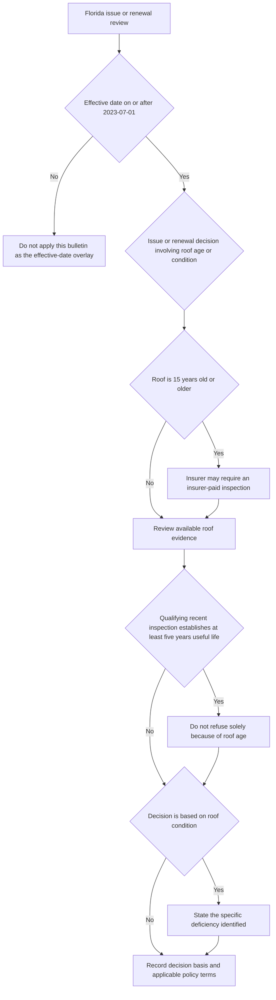

## Scope, effective-date gate, and authority boundary

This is the Florida regulatory overlay for **personal residential property policies issued or renewed in Florida with an effective date on or after 2023-07-01**. Florida Office of Insurance Regulation Bulletin OIR-2023-04 regulates an insurer's use of roof age in issuance and renewal decisions, inspections, roof deductibles, and roof settlement schedules; it also prescribes a nonrenewal notice rule and annual reporting. Apply the effective-date gate before using the bulletin as the governing regulatory overlay. [OIR-2023-04, applicability and purpose](repo://bulletins/FL/2023-04-roof-age-nonrenewal.md#L1-L7)

> **Authority boundary.** The bulletin is a regulatory overlay, not policy contract language. It does not attach a roof endorsement, select a deductible stated in the Declarations, establish coverage for a reported loss, or replace the settlement wording in the issued form. The Florida appetite guide and referral matrix are internal underwriting guidance, not policy language and not material to quote to an insured or claimant. [OIR-2023-04, purpose](repo://bulletins/FL/2023-04-roof-age-nonrenewal.md#L5-L7) · [Florida Homeowners Appetite Guide, status](repo://guidelines/appetite/fl-homeowners.md#L1-L5) · [Underwriting Referral and Authority Matrix, status](repo://guidelines/authority/referral-matrix.md#L1-L5)

For the multistate **HO-3 2018-09** form, dwelling losses have a replacement-cost baseline, subject to A.3 and the applicable deductible. A.4 sends windstorm- or hail-caused *roof surfacing* to an actual-cash-value (ACV) schedule only **when an ACV roof schedule endorsement is attached**; other dwelling components remain under A.3. Thus, a Florida offer that satisfies the bulletin is not evidence that HO 23 74 was issued on a particular policy. Verify the issued Declarations and endorsement attachment before settling a claim. [HO-3 2018-09, A.3–A.4](repo://forms/HO/MS/HO-3/2018-09.md#L25-L34) · [HO 23 74 2018-09, attachment and scope](repo://forms/HO/MS/HO-23-74/2018-09.md#L1-L10)

## Issuance and renewal: roof age, useful life, and inspection

### The roof-age restriction is conditional and decision-specific

An insurer may not refuse to issue or refuse to renew **solely because of roof age** when an inspection performed by an authorized inspector within the 12 months before the effective date establishes that the roof has **five years or more of remaining useful life**. This is not a rule that every older roof must be accepted, nor does it make roof deterioration a covered loss. It restricts the stated basis for the issuance or renewal decision when the bulletin's inspection and useful-life facts are present. [OIR-2023-04, F.2](repo://bulletins/FL/2023-04-roof-age-nonrenewal.md#L9-L13)

When declining a risk on roof condition, the insurer must state the **specific deficiency identified** and may not state roof age alone as the reason. A file should therefore preserve the condition finding and use that finding—not a generic age label—in the declination explanation. The internal referral matrix repeats this documentation standard, but the bulletin supplies the regulatory requirement. [OIR-2023-04, F.2](repo://bulletins/FL/2023-04-roof-age-nonrenewal.md#L11-L13) · [Underwriting Referral and Authority Matrix, R.6](repo://guidelines/authority/referral-matrix.md#L49-L53)

### Inspection rights and cost allocation

For a roof that is **15 years old or older**, the insurer may require a roof inspection as a condition of issuance or renewal, but that insurer-required inspection is at the insurer's expense. The insurer cannot turn the permission to require an inspection into an insured-paid condition for this age category. [OIR-2023-04, F.3](repo://bulletins/FL/2023-04-roof-age-nonrenewal.md#L15-L17)

F.3 separately protects the insured's qualifying evidence in two ways:

- If the insured obtains and provides an inspection meeting F.2, the insurer must accept it and may not require a second inspection at the insured's expense in the same policy period.
- The insurer must accept an inspection performed by an inspector licensed in Florida and may not restrict acceptance to inspectors selected by the insurer.

These rules do not say that every inspection is interchangeable for every purpose; they specify acceptance and no-second-insured-paid-inspection limits. Retain the report, inspector qualification, inspection date, stated remaining useful life, and policy effective date so the 12-month and five-year tests can be reviewed. [OIR-2023-04, F.2–F.3](repo://bulletins/FL/2023-04-roof-age-nonrenewal.md#L9-L19)

*This issuance and renewal flow applies the bulletin's date gate, 15-year inspection permission, qualifying-inspection restriction, and specific-deficiency requirement; it does not decide contractual coverage or settlement.* [OIR-2023-04, applicability and F.2–F.3](repo://bulletins/FL/2023-04-roof-age-nonrenewal.md#L3-L19)

## Optional roof deductible and ACV-schedule offers

The bulletin permits an insurer to offer either a separate roof deductible or an ACV roof settlement schedule only when, **at the time of offer**, it also offers a policy **without that provision** at a filed and approved rate and discloses the premium difference between the two in writing. These are conjunctive offer controls: a product configuration should not be treated as eligible merely because the proposed deductible or schedule is filed. [OIR-2023-04, F.4](repo://bulletins/FL/2023-04-roof-age-nonrenewal.md#L21-L25)

The bulletin additionally says an insurer may not apply an ACV roof settlement schedule to a roof **less than 10 years old at the policy effective date**. The relevant regulatory age is therefore fixed at the policy effective date. It is distinct from HO 23 74's claim-time schedule input, which uses the roof-surfacing age at the date of loss and documented installation or full-replacement evidence. Do not substitute one age test for the other. [OIR-2023-04, F.4](repo://bulletins/FL/2023-04-roof-age-nonrenewal.md#L21-L25) · [HO 23 74 2018-09, R.3 and R.5](repo://forms/HO/MS/HO-23-74/2018-09.md#L17-L35)

### Contract terms after a permitted offer

For an issued HO-3 2018-09 policy with attached **HO 23 74 2018-09**, the endorsement modifies A.4. It applies only to roof surfacing—rather than decking, framing, sheathing, or interior finish—and only to windstorm- or hail-caused loss. It settles that eligible surfacing loss at ACV using its material-and-age schedule, with a 25-percent-of-replacement-cost pre-deductible minimum. Loss to roof surfacing from another covered peril remains replacement cost, and the endorsement does not apply to that loss. Those are contract results from the attached forms, not an effect created by the Florida bulletin. [HO-3 2018-09, A.3–A.4](repo://forms/HO/MS/HO-3/2018-09.md#L25-L34) · [HO 23 74 2018-09, R.1–R.4](repo://forms/HO/MS/HO-23-74/2018-09.md#L5-L30)

**Operational evidence for an offer file.** Preserve the policy effective date and roof age used for the 10-year check; both offered configurations; the filed-and-approved rate for the no-provision alternative; the written premium-difference disclosure; and the acceptance and issued-policy record. The internal Florida appetite guide goes further by directing retention of the comparison quote; that retention direction is internal guidance, while the offer and disclosure requirements above come from F.4. [OIR-2023-04, F.4](repo://bulletins/FL/2023-04-roof-age-nonrenewal.md#L21-L25) · [Florida Homeowners Appetite Guide, H.2](repo://guidelines/appetite/fl-homeowners.md#L15-L21)

## Nonrenewal for roof condition

Before nonrenewing a personal residential property policy, the insurer must provide **at least 120 days' written notice** and state the **specific reason**. When the stated reason relates to roof condition, the notice must also include a copy of **any inspection report on which the insurer relied**. A generic roof-age explanation does not satisfy the separate F.2 requirement for a roof-condition declination, and a roof-condition nonrenewal requires both the F.5 timing/reason requirements and the relied-on-report enclosure requirement. [OIR-2023-04, F.2 and F.5](repo://bulletins/FL/2023-04-roof-age-nonrenewal.md#L11-L13) · [OIR-2023-04, F.5](repo://bulletins/FL/2023-04-roof-age-nonrenewal.md#L27-L29)

The Florida appetite guide directs that roof-condition nonrenewal notices route through Compliance before issuance without exception, and it assigns management approval to any roof-condition nonrenewal. Those are additional **internal controls**, not customer-facing notice terms or a substitute for the bulletin's 120-day, specific-reason, and inspection-report requirements. [Florida Homeowners Appetite Guide, H.3 and H.7](repo://guidelines/appetite/fl-homeowners.md#L23-L25) · [Florida Homeowners Appetite Guide, H.7](repo://guidelines/appetite/fl-homeowners.md#L47-L49)

A nonrenewal packet should be checked against this minimum record: the policy effective and nonrenewal dates, the calculation demonstrating 120 days' written notice, the specific roof-condition reason, every inspection report actually relied upon, and the required internal compliance and management review. This is a compliance review checklist; it neither authorizes an exception nor changes the policy contract.

## Hurricane and separate roof deductible overlap

Nothing in the bulletin limits application of a hurricane deductible when it is otherwise permitted by law. But if a hurricane deductible and a separate roof deductible would both apply to the **same loss**, they may not both be applied: only the larger deductible is deducted. This is a Florida regulatory nonstacking rule. It does not establish the dollar or percentage amount of either deductible; obtain those terms from the applicable law, filing, Declarations, and issued policy documents. [OIR-2023-04, F.6](repo://bulletins/FL/2023-04-roof-age-nonrenewal.md#L31-L33)

Keep this rule distinct from the HO-3 2018-09 general rule. The base form provides that the Declarations deductible applies to each Section I loss, recognizes a separate windstorm-or-hail deductible where required by a state amendatory endorsement, and says only the larger applies where both apply. The Florida bulletin specifically addresses a **hurricane deductible and separate roof deductible**; neither source by itself proves that either provision was included in a particular policy. [HO-3 2018-09, S.5](repo://forms/HO/MS/HO-3/2018-09.md#L101-L112) · [OIR-2023-04, F.6](repo://bulletins/FL/2023-04-roof-age-nonrenewal.md#L31-L33)

## Annual reporting

The insurer must annually report the number of policies nonrenewed for reasons relating to roof condition, **disaggregated by county**, on the form prescribed by the Office. This is an insurer-level regulatory reporting obligation, not a coverage condition, policyholder duty, or claim-payment step. The reportable population should be tied to recorded roof-condition nonrenewal reasons so county aggregation can be supported. [OIR-2023-04, F.7](repo://bulletins/FL/2023-04-roof-age-nonrenewal.md#L35-L37)

## Focused control tests

Use the following reviews before binding, issuing a nonrenewal, calculating an affected deductible, or preparing annual reporting:

1. **Applicability:** Is this Florida personal residential property policy being issued or renewed with an effective date on or after 2023-07-01? If not, do not assume OIR-2023-04 supplies the applicable rule.
2. **Age-based decision:** Does an authorized-inspector report from the 12 months before the effective date establish at least five years of remaining useful life? If so, verify the decision is not a refusal solely due to roof age. If roof condition is the reason, verify the actual specific deficiency is recorded and stated.
3. **Inspection acceptance:** For a 15-year-or-older roof, confirm any insurer-required inspection is insurer-paid. For an insured-provided F.2 inspection or a Florida-licensed inspector's inspection, test the acceptance rules and ensure no second inspection is charged to the insured within the policy period where F.3 prohibits it.
4. **Offer and issued-policy separation:** For a roof deductible or ACV schedule, retain the no-provision alternative at a filed and approved rate and written premium comparison at offer; apply the under-10-years-at-effective-date prohibition to the ACV schedule. Separately confirm the Declarations and actual endorsement attachment before using contractual settlement terms.
5. **Roof-condition nonrenewal:** Verify 120 days' written notice, specific reason, and inclusion of every relied-on inspection report; then complete internal Compliance and management controls without treating them as regulatory substitutes.
6. **Loss and reporting:** When a hurricane deductible and separate roof deductible both appear applicable to one Florida loss, deduct only the larger. Maintain roof-condition nonrenewal reason and county data for the annual Office-prescribed report.

<!-- openwiki: broken internal link [/openwiki/coverage/coverage-a/roof-settlement] file "/openwiki/coverage/coverage-a/roof-settlement" does not exist. Fix the href or restore the target, then delete this comment. -->
<!-- openwiki: broken internal link [/openwiki/coverage/property/claim-conditions-and-deductibles] file "/openwiki/coverage/property/claim-conditions-and-deductibles" does not exist. Fix the href or restore the target, then delete this comment. -->
<!-- openwiki: broken internal link [/openwiki/operations/claims-roof-loss-handling] file "/openwiki/operations/claims-roof-loss-handling" does not exist. Fix the href or restore the target, then delete this comment. -->
For the roof-loss contract analysis and claim-estimate sequence, see [Roof Settlement](/openwiki/coverage/coverage-a/roof-settlement) and [Section I Claim Conditions, Payment, and Deductibles](/openwiki/coverage/property/claim-conditions-and-deductibles). For claims operating controls, see [Claims Roof Loss Handling](/openwiki/operations/claims-roof-loss-handling). The Florida appetite and referral pages are the appropriate home for the internal underwriting controls discussed above.
