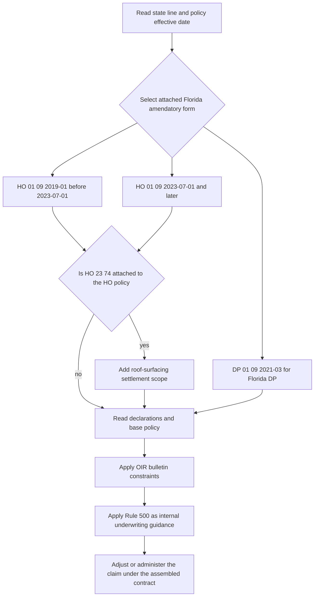

# Florida State Overlay

This page separates three authorities that must be read together but must not be collapsed:

- **Florida contract layer:** an attached HO 01 09 or DP 01 09 amendatory form changes the policy only within its stated terms. A conflicting endorsement provision controls, while unaffected policy terms remain in force. The endorsement does not create coverage that the policy does not otherwise provide ([HO 01 09 2023-07, T.0](repo://forms/HO/FL/HO-01-09/2023-07.md#L13-L55), [DP 01 09 2021-03, T.0](repo://forms/DP/FL/DP-01-09/2021-03.md#L13-L57)).
- **Regulatory layer:** OIR bulletins constrain underwriting, filing, disclosure, notice, and claims administration. They do not silently amend the policy or authorize a deductible or settlement method that the contract does not provide ([OIR-2022-01, B.1.12-B.1.18](repo://bulletins/FL/oir-2022-01-hurricane-deductible.md#L37-L49), [OIR-2023-04, B.1](repo://bulletins/FL/oir-2023-04-roof-age-nonrenewal.md#L13-L25)).
- **Internal underwriting layer:** Personal Lines Underwriting Manual Rule 500 is carrier direction for acceptance, referral, and file handling. Its thresholds are **not Florida regulatory requirements and are not policy coverage terms**. The manual expressly says it is internal guidance and must not be used to alter coverage ([Manual Rules 100.B and 100.D](repo://manuals/underwriting/manual.md#L21-L35)).

## Edition selection and policy assembly

Use the policy effective date, not the claim-report date, to select the attached Florida amendatory form. A superseded edition continues to govern policies written under it.

| Line and edition | Effective date | Governing interval in this source set | Supersession reading |
|---|---:|---|---|
| **HO 01 09 2019-01** | 2019-01-01 | Policies effective before 2023-07-01, when this edition is attached | Superseded by HO 01 09 2023-07 for policies effective on or after 2023-07-01; it remains in force for policies written under it ([metadata and marker](repo://forms/HO/FL/HO-01-09/2019-01.md#L1-L10)). |
| **HO 01 09 2023-07** | 2023-07-01 | Policies effective on or after 2023-07-01, when attached | Current HO Florida edition in this source set ([metadata](repo://forms/HO/FL/HO-01-09/2023-07.md#L1-L9)). |
| **DP 01 09 2021-03** | 2021-03-01 | Florida DP policies using this attached endorsement | The source set contains this DP edition separately; do not substitute an HO edition for it ([metadata](repo://forms/DP/FL/DP-01-09/2021-03.md#L1-L9)). |

*This flow shows date-based form selection and optional roof-surfacing endorsement scope followed by regulatory and internal controls; a bulletin or manual does not replace the attached contract form.*

### Selection rules

1. Confirm the line, Florida location, policy-effective date, declarations, and attached form.
2. For HO, use **HO 01 09 2019-01** through 2023-06-30 and **HO 01 09 2023-07** from 2023-07-01, preserving the earlier text for earlier policies.
3. For DP, use the separately identified **DP 01 09 2021-03** when that endorsement is attached; do not import HO deductible, roof, cancellation, or claims deadlines into the DP policy.
4. If **HO 23 74** is also attached to an HO policy, apply its roof-surfacing provisions within their stated scope and effective edition. It does not replace HO 01 09's Florida notice, deductible, cancellation, nonrenewal, or claim-decision rules outside roof-surfacing settlement.
5. Read the base form, declarations, and amendatory or attached endorsement together. Each contract document controls only conflicts within its scope; none becomes a second policy.
6. Apply the bulletin in force for the relevant action or filing, then apply Rule 500 only as internal pre-bind or renewal guidance. A roof-age underwriting decision does not decide whether a later roof loss is covered or how the contract settles it.

## Contract comparison at a glance

| Requirement | HO 01 09 2019-01 | HO 01 09 2023-07 | DP 01 09 2021-03 |
|---|---|---|---|
| Windstorm and hail deductible | **2% minimum, 10% maximum**; separate from other deductibles; calculated from the amount of insurance applicable to damaged property; multiple coverages are calculated separately unless the policy says otherwise ([T.1](repo://forms/HO/FL/HO-01-09/2019-01.md#L59-L91)). | **2% minimum, 15% maximum**; separate from other deductibles; calculated from policy limits applicable to damaged property ([T.1](repo://forms/HO/FL/HO-01-09/2023-07.md#L57-L89)). | **2% minimum, 10% maximum**; separate from other deductibles; calculated from the amount of insurance applicable to damaged property and applied to the total covered loss from the same occurrence ([T.1](repo://forms/DP/FL/DP-01-09/2021-03.md#L59-L79)). |
| Increase notice | **45 days** before the increased windstorm deductible takes effect ([T.2](repo://forms/HO/FL/HO-01-09/2019-01.md#L169-L217)). | **60 days** before the increased windstorm deductible takes effect ([T.2](repo://forms/HO/FL/HO-01-09/2023-07.md#L167-L215)). | **45 days** before the increased windstorm deductible takes effect ([T.2](repo://forms/DP/FL/DP-01-09/2021-03.md#L169-L207)). |
| Named Storm Period | Begins when the official designation takes effect and ends **72 hours after** it ends; damage timing, not discovery or reporting, controls ([T.3](repo://forms/HO/FL/HO-01-09/2019-01.md#L219-L285)). | Begins when the designation is issued and continues **72 hours after** it ends; the designation alone does not establish covered loss ([T.3](repo://forms/HO/FL/HO-01-09/2023-07.md#L217-L283)). | Begins when the official designation takes effect and ends **72 hours after** it ends; cause and timing are determined from available facts ([T.3](repo://forms/DP/FL/DP-01-09/2021-03.md#L237-L283)). |
| Cancellation notice | **10 days** for nonpayment; **45 days** for another permitted cancellation ([T.4](repo://forms/HO/FL/HO-01-09/2019-01.md#L287-L317)). | **10 days** for nonpayment; **45 days** for another permitted cancellation ([T.4](repo://forms/HO/FL/HO-01-09/2023-07.md#L285-L337)). | **10 days** for nonpayment; **45 days** for another permitted cancellation ([T.4](repo://forms/DP/FL/DP-01-09/2021-03.md#L530-L551)). |
| Nonrenewal notice | **120 days** before the end of the policy period ([T.4](repo://forms/HO/FL/HO-01-09/2019-01.md#L349-L367)). | **135 days** before the end of the current policy period ([T.4](repo://forms/HO/FL/HO-01-09/2023-07.md#L287-L339)). | **120 days** before expiration ([T.4](repo://forms/DP/FL/DP-01-09/2021-03.md#L530-L551)). |
| Claim acknowledgment | Within **14 days** after receipt ([T.5](repo://forms/HO/FL/HO-01-09/2019-01.md#L405-L431), [2023-07](repo://forms/HO/FL/HO-01-09/2023-07.md#L403-L421), [DP](repo://forms/DP/FL/DP-01-09/2021-03.md#L770-L809)). | Same. | Same. |
| Claim decision | Within **90 business days** after receiving the items and information requested to evaluate the claim ([T.5](repo://forms/HO/FL/HO-01-09/2019-01.md#L477-L501), [DP](repo://forms/DP/FL/DP-01-09/2021-03.md#L882-L898)). | Within **85 business days** after receiving requested items ([T.5](repo://forms/HO/FL/HO-01-09/2023-07.md#L461-L501)). | Within **90 business days** after receiving requested items. |
| Accepted-claim payment | **20 business days** after acceptance ([HO 2019-01](repo://forms/HO/FL/HO-01-09/2019-01.md#L525-L535), [DP](repo://forms/DP/FL/DP-01-09/2021-03.md#L882-L898)). | **20 business days** after acceptance ([repo://forms/HO/FL/HO-01-09/2023-07.md#L465-L477)). | **20 business days** after acceptance. |
| Roof settlement threshold in form | ACV roof schedule when the roof is **10 years old**, using pre-loss condition ([T.8-T.9](repo://forms/HO/FL/HO-01-09/2019-01.md#L629-L647)). | ACV roof schedule when roof age reaches **10 years**, using pre-loss condition ([T.8-T.10](repo://forms/HO/FL/HO-01-09/2023-07.md#L613-L637)). | ACV for covered roof damage when the roof is **10 years or older**, unless another policy provision is broader ([T.8-T.9](repo://forms/DP/FL/DP-01-09/2021-03.md#L1148-L1162)). |

The table gives the high-value differences among the Florida HO and DP amendatory forms. HO 23 74 is intentionally not a fourth Florida amendatory-form column: it is an attached, multi-state roof-surfacing endorsement whose 2025-05 edition uses a 12-year ACV trigger only when attached. The detailed sections below preserve the other notice, disclosure, claim, storm-period, and settlement rules that accompany each form.

## HO 01 09 — 2019-01 contract

### Deductible and storm-period terms

The 2019-01 form applies a **2% to 10%** Windstorm and Hail Deductible to covered direct physical loss caused by windstorm or hail, including concurrent contribution by wind or hail. It is separate from another deductible, uses the Deductible Basis for the damaged property, and is applied before payment. If more than one coverage applies, the deductible is calculated separately for each coverage unless the policy provides otherwise; an unrelated limit is not used. One windstorm or hail event is one covered loss, while separate events may be separate losses ([T.1-T.17](repo://forms/HO/FL/HO-01-09/2019-01.md#L59-L105), [T.30-T.36](repo://forms/HO/FL/HO-01-09/2019-01.md#L119-L143)).

The insured must cooperate, preserve and show damaged property, provide records, photographs, receipts, estimates, and other requested information, and submit proof of loss or an examination under oath when required. The deductible applies only to covered loss; it does not pay for wear, deterioration, defective maintenance, excluded water, or other excluded damage, and it remains applicable even when an undisputed portion is paid ([T.18-T.29](repo://forms/HO/FL/HO-01-09/2019-01.md#L95-L119), [T.37-T.54](repo://forms/HO/FL/HO-01-09/2019-01.md#L131-L165)).

For the **Named Storm Period**, the official designation determines the start and the period ends 72 hours after the designation ends. The time damage begins controls; discovery, reporting, repair, payment, or a nearby designation does not by itself establish timing or causation. The insured must give prompt notice, protect and preserve property, provide weather and claim evidence, permit inspection, and avoid concealment or misrepresentation. A named-storm period does not create coverage or change exclusions, limits, conditions, or the applicable deductible ([T.1-T.18](repo://forms/HO/FL/HO-01-09/2019-01.md#L237-L273), [T.19-T.23](repo://forms/HO/FL/HO-01-09/2019-01.md#L273-L285)).

### Deductible-change disclosure and notice

For an increase in the Windstorm Deductible, the insurer must provide written notice at least **45 days** before the increase takes effect. The notice must identify the insurance and property affected, state the new deductible and effective date, and describe the calculation method. It may be sent by mail or electronically when electronic delivery is agreed to; mailing or electronic delivery to the recorded address and a named insured is sufficient under the form. The insured must keep contact information current, and failure to respond does not prevent the change from taking effect ([T.1-T.12](repo://forms/HO/FL/HO-01-09/2019-01.md#L169-L193), [T.13-T.24](repo://forms/HO/FL/HO-01-09/2019-01.md#L193-L217)).

### Cancellation and nonrenewal

The form permits cancellation only as allowed by Florida law and the form. Nonpayment cancellation requires at least **10 days'** notice; another permitted cancellation requires at least **45 days'** notice and a stated reason. A nonrenewal requires at least **120 days'** notice before the end of the policy period and must state that coverage will not renew. Notices are written and may be mailed or electronically delivered when permitted and consented to; notice to a named insured generally reaches all insureds, and required mortgagee or lienholder notice does not expand coverage. Cancellation or nonrenewal does not eliminate rights and duties for a loss occurring before coverage ended ([T.1-T.24](repo://forms/HO/FL/HO-01-09/2019-01.md#L287-L331), [T.29-T.40](repo://forms/HO/FL/HO-01-09/2019-01.md#L343-L367)).

The form also allows renewal on changed terms, requires premium and stated conditions for renewal, permits electronic renewal communications with consent, and makes the insured responsible for current address, ownership, occupancy, use, truthful application information, property maintenance, and cooperation with underwriting requests. An information request, inspection, or corrective-action discussion is not itself cancellation or nonrenewal; a notice must identify the action and effective date ([T.38-T.58](repo://forms/HO/FL/HO-01-09/2019-01.md#L361-L401)).

### Claims handling and roof settlement

The 2019-01 claims lifecycle is:

- The insured gives prompt notice, protects property, keeps repair-expense records, preserves damaged property, permits inspection, provides requested records and proof of loss, and cooperates with investigation, adjustment, settlement, defense, examination under oath, and recovery efforts ([T.1-T.24](repo://forms/HO/FL/HO-01-09/2019-01.md#L405-L459)).
- The insurer acknowledges within **14 days**. It may request material information, inspect and use qualified personnel, communicate with relevant persons, and request statements, estimates, invoices, photographs, inventories, other-insurance information, and proof of payment ([T.1-T.38](repo://forms/HO/FL/HO-01-09/2019-01.md#L405-L481)).
- After receiving the requested items and information, the insurer accepts or rejects within **90 business days**. It must explain a denial or limitation, may continue investigating when necessary, may pay an undisputed amount, and must pay an accepted claim within **20 business days**. It may reopen for material new information, but it cannot use a claim investigation to impose an unrelated underwriting result ([T.39-T.65](repo://forms/HO/FL/HO-01-09/2019-01.md#L481-L535)).
- The form does not state a numeric proof-of-loss submission period in this Florida endorsement; it requires a signed, sworn proof when requested. An action against the insurer must be brought within **five years after the date of the occurrence causing the loss**, subject to the form and applicable law ([T.1-T.15](repo://forms/HO/FL/HO-01-09/2019-01.md#L405-L435), [T.1-T.8](repo://forms/HO/FL/HO-01-09/2019-01.md#L587-L603)).

When the roof reaches **10 years**, the form's actual cash value roof schedule applies, using the roof's condition immediately before loss. The schedule is a valuation rule, not an exclusion for age alone. The form preserves exclusions for wear, deterioration, faulty maintenance, repeated leakage, and other excluded causes, while covered resulting direct physical loss remains subject to the policy, the schedule, and the deductible ([T.8-T.21](repo://forms/HO/FL/HO-01-09/2019-01.md#L639-L671)).

## HO 01 09 — 2023-07 contract

### Deductible, storm period, and deductible-change notice

The 2023-07 form changes the Windstorm and Hail Deductible range to **2% through 15%**. It applies only to covered loss caused by windstorm or hail, is separate from other deductibles, is calculated from the applicable policy limits for the damaged property, and is applied before payment. The form specifically treats wind-driven rain as covered only when it enters through an opening caused by wind; rain without that wind-created opening, flood, surface water, storm surge, tidal water, and excluded deterioration remain outside the deductible's coverage gate ([T.1-T.17](repo://forms/HO/FL/HO-01-09/2023-07.md#L57-L121), [T.27-T.35](repo://forms/HO/FL/HO-01-09/2023-07.md#L105-L131)).

A deductible increase requires written notice at least **60 days** before it takes effect. The notice states the post-change deductible and basis, may be mailed or electronically delivered with consent, may be combined with other material, and relies on the recorded address or a named-insured or authorized-representative delivery. The insured must keep contact information current; the notice does not change coverage, exclusions, limits, or conditions ([T.1-T.24](repo://forms/HO/FL/HO-01-09/2023-07.md#L167-L215)).

The Named Storm Period begins when the governmental weather authority issues the designation and continues **72 hours after** it ends. Public records, weather information, physical evidence, and witness or insured information may be considered; discovery or reporting time is not the event time. The designation does not itself establish coverage, and the period does not modify exclusions, limits, conditions, or deductibles. The insured must cooperate, protect property, preserve evidence, permit inspection, and provide truthful timing and cause information ([T.1-T.16](repo://forms/HO/FL/HO-01-09/2023-07.md#L219-L249), [T.17-T.33](repo://forms/HO/FL/HO-01-09/2023-07.md#L249-L283)).

### Cancellation and nonrenewal

Nonpayment cancellation requires at least **10 days'** notice. Cancellation for another permitted reason requires at least **45 days'** notice and a stated reason. Nonrenewal requires at least **135 days'** notice before the end of the current policy period and states when coverage ends. The form permits mailing or electronic delivery where allowed, permits notice to a named insured, and preserves prior-loss rights after cancellation or nonrenewal. It also allows changed-term renewal offers, but renewal remains subject to premium and underwriting conditions ([T.1-T.20](repo://forms/HO/FL/HO-01-09/2023-07.md#L285-L337), [T.21-T.58](repo://forms/HO/FL/HO-01-09/2023-07.md#L325-L401)).

### Claims handling and roof settlement

The insured must promptly report a claim, protect and preserve property, retain repair records, permit inspection, provide signed sworn proof of loss when requested, produce records and information, submit to examination under oath, disclose other insurance and prior damage, preserve recovery rights, and avoid material concealment or misrepresentation ([T.1-T.30](repo://forms/HO/FL/HO-01-09/2023-07.md#L403-L463)). The insurer acknowledges within **14 days**, investigates, may use experts and contractors, requests only claim-relevant information, and must accept or reject within **85 business days** after receiving requested items. It must notify the insured of the decision, may pay undisputed amounts, must pay an accepted claim within **20 business days**, may reopen for material information, and may recover overpayments caused by fraud, duplicate payment, or error ([T.31-T.50](repo://forms/HO/FL/HO-01-09/2023-07.md#L461-L503)). The form does not state a numeric proof-of-loss submission period in this Florida endorsement; it requires a signed, sworn proof when requested. An action against the insurer must be brought within **five years after the date of loss** ([T.7-T.10](repo://forms/HO/FL/HO-01-09/2023-07.md#L571-L591)).

When roof age reaches **10 years**, the actual cash value roof schedule applies, using the pre-loss roof condition. The form requires reasonable maintenance and preserves exclusions for deterioration, wear, repeated seepage or leakage, faulty work, and excluded water. Age or the schedule does not itself establish that a storm loss is excluded; the claim still requires covered direct physical loss and causation ([T.8-T.14](repo://forms/HO/FL/HO-01-09/2023-07.md#L613-L645), [T.20-T.32](repo://forms/HO/FL/HO-01-09/2023-07.md#L651-L679)).

## DP 01 09 — 2021-03 contract

### Deductible and named-storm mechanics

DP 01 09 sets a **2% minimum and 10% maximum** Windstorm and Hail Deductible. It applies to covered direct physical loss caused by windstorm or hail, separately from other deductibles, and uses the amount of insurance applicable to the damaged property. The deductible is calculated before payment, applies to the total covered loss from the same occurrence rather than each item, and separate events may be separate losses. The insured must cooperate, protect property, preserve it for inspection, provide records, and submit proof or an examination under oath when requested ([T.1-T.24](repo://forms/DP/FL/DP-01-09/2021-03.md#L59-L107), [T.25-T.54](repo://forms/DP/FL/DP-01-09/2021-03.md#L107-L167)).

An increase in the windstorm deductible requires written notice at least **45 days** before the effective date. The notice identifies the dwelling and affected policy, states the new deductible and effective date, describes its application, and may be mailed or electronically delivered where permitted. Notice is effective when sent under the form; receipt is not required, and the insured must keep the recorded address current ([T.1-T.17](repo://forms/DP/FL/DP-01-09/2021-03.md#L169-L207), [T.20-T.33](repo://forms/DP/FL/DP-01-09/2021-03.md#L207-L237)).

The Named Storm Period begins when the official designation takes effect and ends **72 hours after** the designation ends. The insurer determines timing from when damage occurred, not when it was discovered or reported, and may use weather, public-authority, contractor, inspection, and other reliable evidence. The insured must give prompt notice, protect and preserve property, permit inspection, cooperate, provide records, and avoid misrepresentation. The period does not itself establish coverage or override exclusions ([T.1-T.18](repo://forms/DP/FL/DP-01-09/2021-03.md#L237-L269), [T.19-T.23](repo://forms/DP/FL/DP-01-09/2021-03.md#L269-L285)).

### Cancellation and nonrenewal

DP 01 09 provides at least **10 days'** notice for nonpayment cancellation, at least **45 days'** notice for another permitted cancellation, and at least **120 days'** notice before expiration for nonrenewal. Notices identify the action and effective date, may be mailed or electronically delivered where permitted, and do not eliminate rights for losses before cancellation or expiration. The form also addresses refund of unearned premium, reinstatement, changed renewal terms, address duties, and continuing claim obligations ([T.1-T.31](repo://forms/DP/FL/DP-01-09/2021-03.md#L530-L551), [T.32-T.60](repo://forms/DP/FL/DP-01-09/2021-03.md#L647-L768)).

### Claims handling and roof settlement

The DP claims requirements include prompt notice, mitigation, repair-expense records, preservation and inspection of damaged property, cooperation, documents, estimates and photographs, signed proof of loss, examination under oath, truthful responses, access, other-insurance information, recovery rights, and protection against duplicate payment. The insurer may investigate, use experts and vendors, pay an undisputed portion, request additional material information, reopen the investigation, and deny or reduce only as permitted when a material failure prejudices claim handling ([claim duties](repo://forms/DP/FL/DP-01-09/2021-03.md#L770-L922), [continued claim controls](repo://forms/DP/FL/DP-01-09/2021-03.md#L943-L971)).

The insurer acknowledges within **14 days**, accepts or rejects within **90 business days** after receiving the requested items, and pays an accepted claim within **20 business days**. The decision may address all or part of the claim, and payment or investigation does not waive remaining defenses ([T.2-T.3](repo://forms/DP/FL/DP-01-09/2021-03.md#L772-L790), [T.29-T.32](repo://forms/DP/FL/DP-01-09/2021-03.md#L882-L898)). The form does not state a numeric proof-of-loss submission period in this Florida endorsement; it requires a signed, sworn proof when requested. An action against the insurer must be brought within **five years after the date of the loss** ([T.1-T.8](repo://forms/DP/FL/DP-01-09/2021-03.md#L1051-L1078)).

When a roof is **10 years or older**, covered roof damage is valued on an actual cash value basis unless another policy provision provides broader settlement. ACV uses the roof condition immediately before loss. The rule does not cover excluded wear, deterioration, faulty work, or other excluded causes and does not turn the age threshold into a coverage exclusion ([roof valuation and claim conditions](repo://forms/DP/FL/DP-01-09/2021-03.md#L1148-L1187), [documentation and recovery controls](repo://forms/DP/FL/DP-01-09/2021-03.md#L1354-L1371)).

## HO 23 74 — attached roof-surfacing endorsement

HO 23 74 is a multi-state roof-surfacing endorsement, not a Florida bulletin and not a substitute for HO 01 09 or DP 01 09. Read it only when the endorsement is actually attached. Its attachment language makes it part of the policy and gives it precedence for roof-surfacing conflicts, while preserving the policy's other exclusions, conditions, limits, and deductibles ([HO 23 74 2025-05, W.0](repo://forms/HO/MS/HO-23-74/2025-05.md#L14-L86)). The repository's 2018-09 edition is superseded by the 2025-05 edition for policies effective on or after 2025-05-01; the earlier edition remains relevant to policies written under it ([2018-09 marker](repo://forms/HO/MS/HO-23-74/2018-09.md#L2-L9)).

For the **2025-05 edition**, a covered roof-surfacing loss is settled on an actual-cash-value basis when the damaged roof surfacing is **12 years or older**. Roof age is the age of the damaged portion at loss, and depreciation must reflect supported age, condition, expected useful life, and wear; the endorsement does not apply depreciation for a condition that did not exist before the loss ([W.1-W.10](repo://forms/HO/MS/HO-23-74/2025-05.md#L88-L133)). This is a contract valuation rule, not an age-only coverage exclusion. Coverage, causation, damaged versus undamaged surfacing, exclusions, and the applicable Florida HO form still have to be determined first.

The endorsement does not set a deductible range or change the applicable deductible. It requires the deductible to be applied under the policy before payment, and it preserves the policy's other terms ([W.19-W.21](repo://forms/HO/MS/HO-23-74/2025-05.md#L163-L176)). It also creates a specific **60-day** notice-of-loss deadline, requires inspection access and preservation of roof evidence, and requires a signed, sworn proof of loss when requested. It refers to the applicable proof-of-loss period and legal-action deadline but supplies no numeric value for either; do not replace the Florida form's deadline rules with this endorsement's generic references ([W.1-W.12](repo://forms/HO/MS/HO-23-74/2025-05.md#L996-L1041), [W.65-W.75](repo://forms/HO/MS/HO-23-74/2025-05.md#L1253-L1295)).

The roof-surfacing payment mechanics require a second check: for composition shingle roof surfacing in the applicable age category, W.3 states a **20% payable percentage before the deductible**, while W.4 states that covered roof-surfacing payment subject to ACV will not be less than **30% of applicable replacement cost** ([W.3.1-W.3.5](repo://forms/HO/MS/HO-23-74/2025-05.md#L568-L586), [W.4.1-W.4.4](repo://forms/HO/MS/HO-23-74/2025-05.md#L716-L735)). The same source contains malformed W.35-W.37 references to an unspecified “floor”; do not select 20% or 30% by assumption when the attached form or filing does not resolve the conflict—preserve the text and escalate for form or legal review ([W.1.35-W.1.37](repo://forms/HO/MS/HO-23-74/2025-05.md#L230-L246)).

Operationally, if HO 23 74 and a Florida HO 01 09 form are both attached, identify the effective edition of each, determine whether the claimed property is roof surfacing, establish covered direct physical loss, and then apply HO 23 74's roof-surfacing valuation where its scope and threshold are met. Do not use its 12-year threshold as a replacement for HO 01 09's 10-year provision when HO 23 74 is not attached, and do not treat Rule 500's internal 15-year inspection or 20-year decline as a settlement rule.

## Florida OIR bulletins

### OIR-2019-11 — Roof Age Underwriting Restrictions

**Effective:** 2019-11-05. The bulletin is marked superseded by OIR-2023-04 for policies effective on or after 2023-04-11, but its text remains applicable to policies written under it ([metadata and supersession](repo://bulletins/FL/oir-2019-11-roof-age.md#L1-L9)). It applies to admitted insurers' Florida residential property policies when roof age is considered for eligibility, underwriting, inspection, renewal, cancellation, nonrenewal, or settlement-related underwriting decisions.

**Roof-age and underwriting thresholds.**

- Roof age may be considered only as a risk-related factor; it cannot be the sole indicator of remaining serviceability when reliable condition information exists. The insurer must maintain written, filed, objective, consistently applied standards; distinguish age from condition and repair from replacement; record the source and assumptions used; consider permits, inspection reports, invoices, contracts, photographs, certifications, and other credible evidence; and review conflicting information reasonably ([B.1.1-B.1.11](repo://bulletins/FL/oir-2019-11-roof-age.md#L13-L35), [B.2.1-B.2.12](repo://bulletins/FL/oir-2019-11-roof-age.md#L47-L71)).
- The bulletin says the **actual cash value roof schedule must apply at 15 years or older**, unless the filed policy form permits more favorable settlement. This is a bulletin underwriting and administration requirement; it does not override a contract form's settlement language ([B.2.3 and B.2.30-B.2.34](repo://bulletins/FL/oir-2019-11-roof-age.md#L49-L57), [repo://bulletins/FL/oir-2019-11-roof-age.md#L105-L115)).
- Before binding coverage for a roof **20 years or older**, the insurer must obtain a reasonably sufficient roof inspection, disclose before requesting or accepting the inspection that coverage may depend on findings, identify available reconsideration information, and provide a reasonable opportunity to submit a report before declining for unavailable inspection information ([B.3.1-B.3.10](repo://bulletins/FL/oir-2019-11-roof-age.md#L153-L173)).
- Inspection findings may support declination, correction, repair, replacement, or a condition of binding, but the insurer must state the material concern in writing, permit relevant supporting information, avoid unnecessary repairs, disclose whether prior reports are accepted, and not imply that an inspection guarantees coverage, renewal, premium, or claim payment ([B.3.5-B.3.17](repo://bulletins/FL/oir-2019-11-roof-age.md#L163-L187)).

**Nonrenewal and notice.** A roof-related nonrenewal requires at least **90 days'** notice before it takes effect, with a clear roof-related reason. The insurer must distinguish an information request from a final nonrenewal, identify any process for submitting information, and retain the notice, inspection, evaluation, and related communications ([B.3.23-B.3.30](repo://bulletins/FL/oir-2019-11-roof-age.md#L197-L213)). An adverse notice must identify the underwriting concern rather than simply call the roof uninsurable, and must identify information available for reconsideration ([B.1.7-B.1.9](repo://bulletins/FL/oir-2019-11-roof-age.md#L27-L31)).

**Claims requirements.** The claims section applies to roof claims handled after the bulletin's effective date, including open claims to the extent handling continues, without changing rights fixed before effectiveness. The insurer must:

- evaluate under the policy in force at loss and claim facts, not use a roof-age guideline as an independent reason to deny, limit, or delay;
- make an independent claim decision rather than treat a prior issue, renewal, cancellation, or nonrenewal decision as proof that the loss is uncovered;
- explain reasonably necessary information, provide reasonable inspection access, use qualified inspectors, consider claimant photographs, estimates, reports, and event information, and distinguish covered damage from wear, deterioration, maintenance, or excluded conditions;
- apply repair, replacement, valuation, and deductible provisions as written; give a written factual and policy basis for denials or limitations; pay undisputed benefits when due; consider supplemental information; and preserve claim records and supervisory controls ([B.4.1-B.4.18](repo://bulletins/FL/oir-2019-11-roof-age.md#L215-L251), [B.4.19](repo://bulletins/FL/oir-2019-11-roof-age.md#L251-L253)).

**Filing and operations.** Before use, a roof-age practice must be filed where required and identify the affected underwriting action, age criteria, information sources, conflict-resolution method, forms, notices, inspection and exception process, effective date, and actuarial and nondiscrimination support. The insurer must use the filed practice, keep decision records, give clear adverse-action notices, and stop using a practice when the Department determines it is noncompliant ([B.5.1-B.5.16](repo://bulletins/FL/oir-2019-11-roof-age.md#L255-L287)).

### OIR-2023-04 — Roof Age and Nonrenewal

**Effective:** 2023-04-11. It supersedes OIR-2019-11 for underwriting and nonrenewal actions taken on or after that date. It applies to Florida residential property written by an admitted insurer, including direct or indirect use of roof age through an underwriting rule, inspection, eligibility standard, or decision process ([B.1](repo://bulletins/FL/oir-2023-04-roof-age-nonrenewal.md#L13-L57)).

**Roof-age and underwriting thresholds.**

- Roof age alone cannot substitute for a serviceability assessment when reliable information indicates the roof remains serviceable. The insurer must use reliable and relevant age information, identify material, configuration, and condition, maintain written standards, distinguish age from condition, consider credible replacement or substantial-repair evidence before nonrenewal, and correct unsupported records ([B.2.1-B.2.20](repo://bulletins/FL/oir-2023-04-roof-age-nonrenewal.md#L59-L103)).
- The bulletin says the **actual cash value roof schedule applies when roof age reaches 10 years**, and the schedule must be clearly described in the policy and coverage materials. The schedule cannot be applied unless the policy form authorizes it and identifies the roof components covered by it ([B.2.7-B.2.10](repo://bulletins/FL/oir-2023-04-roof-age-nonrenewal.md#L71-L79)).
- Before binding coverage for a roof **15 years old**, the insurer must obtain an inspection consistent with filed standards, retain the supporting information, and disclose before premium payment or acceptance that inspection may affect eligibility, coverage terms, premium, or whether coverage is offered. The applicant must be told who arranges and pays for the inspection and given a reasonable opportunity to submit a qualified inspector's report ([B.3.1-B.3.8](repo://bulletins/FL/oir-2023-04-roof-age-nonrenewal.md#L161-L177)).
- An adverse binding decision must be written and specific. The insurer must disclose material inspection criteria, allow meaningful dispute of material roof information, document the disposition of submitted information, and not imply that inspection guarantees eligibility ([B.3.8-B.3.15](repo://bulletins/FL/oir-2023-04-roof-age-nonrenewal.md#L177-L191)).

**Nonrenewal and notice.** A roof-age or roof-condition nonrenewal requires written notice at least **120 days before the policy expiration date**. The notice must identify itself as a nonrenewal notice, state the effective date, state the principal reason specifically, identify the roof information or condition relied upon, and explain whether and how updated information may be submitted before nonrenewal. The insurer must provide accessible contact information, preserve the notice and delivery evidence, retain supporting underwriting material, and confirm withdrawal in writing if the nonrenewal is withdrawn ([B.3.16-B.3.29](repo://bulletins/FL/oir-2023-04-roof-age-nonrenewal.md#L193-L219)). The insurer may not use a nonrenewal notice to impose a midterm reduction, exclusion, or cancellation, and must correct material notice defects promptly ([B.3.30-B.3.38](repo://bulletins/FL/oir-2023-04-roof-age-nonrenewal.md#L219-L237)).

**Claims requirements.** The insurer must investigate roof claims on the loss facts and may not deny, limit, or delay solely because of roof age. Claims and underwriting must remain separate: nonrenewal cannot substitute for claim investigation, and a pending or reported claim remains subject to claim duties even when the policy is not renewed. The insurer must acknowledge and explain the process, conduct a reasonable investigation, consider wear or prior damage only when relevant under the policy and document the basis, consider claimant and representative evidence, inspect sufficiently, communicate material findings and policy bases for denials or limitations, pay when coverage and amount are determined, review material supplemental information, preserve records, and maintain supervisory review ([B.4.1-B.4.18](repo://bulletins/FL/oir-2023-04-roof-age-nonrenewal.md#L239-L277), [B.4.19-B.4.27](repo://bulletins/FL/oir-2023-04-roof-age-nonrenewal.md#L277-L293)).

**Filing and operations.** A required filing must identify how roof age is determined, the records and inspections used, eligibility standards and disputed-information handling, distinctions among new, renewal, and in-force policies, policy and notice language, the nonrenewal circumstances, and the effective material. A revised practice must be filed and approved or otherwise effective before implementation ([B.5.1-B.5.12](repo://bulletins/FL/oir-2023-04-roof-age-nonrenewal.md#L295-L319)).

### OIR-2022-01 — Hurricane Deductible Disclosure

**Effective:** 2022-01-20. This bulletin applies to admitted insurers when offering, including, modifying, issuing, or renewing residential coverage subject to a hurricane deductible. It governs disclosure practice, not the contract's coverage or deductible terms ([metadata and B.1.1-B.1.12](repo://bulletins/FL/oir-2022-01-hurricane-deductible.md#L1-L7), [repo://bulletins/FL/oir-2022-01-hurricane-deductible.md#L13-L37)). It expressly does **not** prescribe a minimum Section I deductible, an 80% condition, or an additional-living-expense limit ([B.1.12-B.1.14](repo://bulletins/FL/oir-2022-01-hurricane-deductible.md#L37-L41)).

**Required disclosure content and timing.** Before coverage is bound or renewed, before premium is accepted, and before final electronic acceptance, the insurer must provide a clear, conspicuous, plain-language disclosure that:

- identifies the hurricane deductible and the event or condition that triggers it;
- distinguishes it from other deductibles and says whether it is separate, replaces, or combines with another deductible;
- explains the percentage or fixed-amount basis, including the property value or other controlling basis;
- states the named-storm deductible percentage, which must be at least **2%**, and the hurricane deductible percentage, which must not exceed **10%**;
- appears on the declarations page or with it, uses readable type, and is consistent across the application, policy, declarations, endorsements, renewal materials, and electronic communications ([B.2.1-B.2.12](repo://bulletins/FL/oir-2022-01-hurricane-deductible.md#L59-L83)).

If the application requires the applicant to select or accept the deductible, the insurer must obtain an acknowledgment and retain a record, including the disclosure version. The disclosure must remain accessible through the offering channel, including accessible formats, and must not be conditioned on completing the application or paying premium. Renewal materials must identify changes, and a revised disclosure must be provided before a deductible change takes effect; an endorsement change must state that out-of-pocket responsibility may change ([B.2.13-B.2.31](repo://bulletins/FL/oir-2022-01-hurricane-deductible.md#L83-L121)). The insurer must provide enough location-specific information for the policyholder to identify the selected deductible, disclose material limitations, correct misleading or inconsistent materials, monitor complaints, train personnel and vendors, and retain the applicable disclosure in policy records ([B.2.32-B.2.52](repo://bulletins/FL/oir-2022-01-hurricane-deductible.md#L121-L163)).

**Notice of an increase.** A written notice accompanying the policy, endorsement, renewal offer, or other establishing or changing communication must be clear, legible, retainable, identify the deductible, trigger, calculation method, affected property and material limitations, and be consistent with the policy. The bulletin requires at least **45 days' notice before an increase in a windstorm deductible takes effect**. Electronic delivery is permitted when authorized and accessible; delivery records must identify the policy or proposed policy ([B.3.1-B.3.18](repo://bulletins/FL/oir-2022-01-hurricane-deductible.md#L165-L203)).

**Claims requirements.** The insurer must promptly acknowledge a hurricane claim, provide the claim process and reasonably needed materials, investigate cause, scope, and coverage, and apply a hurricane deductible only when the policy and law permit it. A storm's occurrence alone is insufficient. The insurer must distinguish deductible-subject damage from other damage, document why it applies or does not apply, give a written explanation when it reduces payment or determines the loss is below the deductible, avoid unnecessary delay, consider supplemental information, correct errors, preserve communications and estimates, supervise vendors and adjusters, and permit clarification without unsupported claim assurances ([B.4.1-B.4.18](repo://bulletins/FL/oir-2022-01-hurricane-deductible.md#L243-L279), [B.4.19-B.4.27](repo://bulletins/FL/oir-2022-01-hurricane-deductible.md#L279-L297)).

**Filing and version control.** The hurricane-deductible disclosure must be filed with the form or endorsement to which it applies, submitted complete and legible, identify whether it accompanies new business, renewal, or another transaction, and describe the trigger and insured responsibility consistently with the policy. A revised disclosure must be filed before use; the insurer must identify changes, use an approved disclosure where approval is required, retain the version delivered, prevent use of an unfiled or superseded version, and correct affected policyholders when the disclosure is inaccurate ([B.5.1-B.5.16](repo://bulletins/FL/oir-2022-01-hurricane-deductible.md#L299-L331)).

## Rule 500 — internal Florida underwriting guidance

Rule 500 must be cited separately from the OIR bulletins. It is not a regulatory source and cannot change contract coverage. Relevant internal controls include:

- **500.C:** require a roof inspection before binding when roof age is **15 years or older** and refer an inspection that does not identify condition and remaining serviceability ([repo://manuals/underwriting/manual.md#L5843-L5849]).
- **500.D:** **decline** a risk when roof age is **20 years or older**; do not override the internal rule through discretionary pricing ([repo://manuals/underwriting/manual.md#L5851-L5857]).
- **500.AC:** apply the maximum named-storm deductible when required by the accepted risk profile and refer conflicting requests. This is an internal deductible-selection control, not a Florida statutory maximum ([repo://manuals/underwriting/manual.md#L6051-L6057]).
- The broader Rule 500 appetite also requires complete location, construction, occupancy, protection, valuation, inspection, discrepancy, exception, and file documentation. Its Coverage A controls are internal: do not bind below **$200,000**, do not write above **$900,000**, bind only within line authority of **$600,000**, and require senior-underwriter authority through **$900,000** ([500.A-500.I](repo://manuals/underwriting/manual.md#L5827-L5897), [500.J-500.M](repo://manuals/underwriting/manual.md#L5899-L5929)).
- Rule 500 requires a complete Florida underwriting file for accepted, declined, and referred risks; the file records the decision basis and material evidence, but the manual language is not for insured-facing communications ([500.AS-500.AX](repo://manuals/underwriting/manual.md#L6179-L6225)).

These internal thresholds can be stricter or differently timed than a bulletin or policy form. For example, the manual's 15-year inspection and 20-year decline controls must not be described as the OIR-2023-04 bulletin's 15-year inspection requirement or as a contractual claim exclusion. Conversely, the form's 10-year ACV roof schedule must not be replaced by the manual's underwriting decline threshold.

## Operational decision rules and failure checks

### Roof-age action versus roof claim

For underwriting or renewal, record the roof-age source, covering material, configuration, condition, inspection, replacement or repair evidence, the applicable bulletin, notice date, and the final reason. For a claim, first identify the policy and attached endorsement effective at loss, establish covered direct physical loss and causation, separate covered damage from wear and pre-existing conditions, then apply the form's roof valuation, deductible, limits, and claim deadlines. A prior acceptance, inspection, nonrenewal, or Rule 500 decision is not a coverage determination ([OIR-2023-04, B.4.2-B.4.3](repo://bulletins/FL/oir-2023-04-roof-age-nonrenewal.md#L241-L247), [OIR-2019-11, B.4.2-B.4.3](repo://bulletins/FL/oir-2019-11-roof-age.md#L217-L223)).

### Hurricane or windstorm deductible

Before applying a percentage deductible, establish the attached form and selected percentage, covered property, direct physical loss, causal event, storm-period facts, applicable limit or amount of insurance, occurrence allocation, and whether another deductible applies. Then calculate and subtract the contractual deductible. The OIR-2022-01 disclosure requirements do not replace the HO or DP form's deductible range or calculation basis; the 2023 HO form's 15% maximum and the bulletin's 10% hurricane-disclosure ceiling are not interchangeable terms ([OIR-2022-01, B.1.12-B.1.14 and B.2.6-B.2.10](repo://bulletins/FL/oir-2022-01-hurricane-deductible.md#L37-L41), [OIR-2022-01, B.2.6-B.2.10](repo://bulletins/FL/oir-2022-01-hurricane-deductible.md#L69-L79), [HO 01 09 2023-07, T.1-T.10](repo://forms/HO/FL/HO-01-09/2023-07.md#L57-L85)).

### Common failure checks

- **Wrong edition:** applying HO 01 09 2023-07's 15% maximum, 60-day notice, 135-day nonrenewal, or 85-business-day decision rule to a policy governed by HO 01 09 2019-01; or importing either HO edition into DP 01 09.
- **Authority inversion:** using an OIR bulletin as though it rewrote the contract, or using Rule 500 as though it were a regulatory requirement or coverage exclusion.
- **Roof conflation:** treating OIR-2019-11's 15-year ACV schedule, OIR-2023-04's 10-year bulletin schedule, HO 01 09's 10-year ACV provision, HO 23 74's attached-only 12-year roof-surfacing provision, and Rule 500's 15-year inspection or 20-year decline as one threshold. They perform different functions and must be recorded separately.
- **Notice failure:** missing the form-specific 45-day, 60-day, 90-day, 120-day, or 135-day deadline, including HO 23 74's 60-day roof-surfacing loss notice, or confusing a hurricane-deductible increase notice with a roof-related nonrenewal notice.
- **Claims shortcut:** denying or reducing a roof claim solely because of age, relying on nonrenewal or underwriting history instead of the policy in force at loss, applying a hurricane deductible merely because a named storm occurred, paying an age-based schedule without first establishing covered damage, or silently choosing between HO 23 74's 20% and 30% payment language.
- **Disclosure mismatch:** using a stale or unfiled hurricane-deductible disclosure, failing to identify the trigger or calculation basis, omitting the selected deductible, or allowing declarations, endorsement, application, and claim communications to conflict.

For the broader contract context, continue to [roof claim handling](/openwiki/claims/guidelines/roof-claim-handling.md), [DP-3 forms](/openwiki/coverage/forms/dp-3.md), [wind and hail deductibles](/openwiki/coverage/perils/wind-hail-deductibles.md), [roof settlement](/openwiki/coverage/settlement/roof-settlement.md), and [Florida appetite](/openwiki/underwriting/guidelines/florida-appetite.md). Use [policy assembly](/openwiki/policy-assembly/editions-and-state-attachments.md) to resolve the attached edition before applying this overlay.
