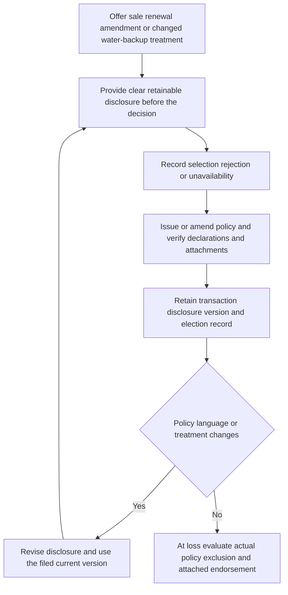

## Scope: an informed-election control, not a coverage mandate

Illinois Bulletin IDOI-2017-10 requires an admitted insurer to describe the offered treatment of water backup clearly: whether it is included, available by endorsement, or unavailable, and to distinguish it from other water sources. It also requires the disclosure to remain consistent with the policy and to identify material limits, deductibles, exclusions, and conditions. The corresponding contract decision is separate: the HO-3 2024 base form excludes loss caused by water backing up through sewers, drains, or sump systems unless a water-backup endorsement is attached. **Do not treat the bulletin, a quote, or an election record as the attachment or as coverage itself.** *(IDOI-2017-10 B.1.2–B.1.7, B.1.9–B.1.12, B.2.16–B.2.18; HO-3 2024-03 I.X.8; HO 04 90 2027-01 W.0.1–W.0.6.)*

This overlay is a control framework for Illinois personal-lines property transactions. It does not choose a form, an endorsement edition, a limit, or a claim outcome. The governing packet for the loss date—declarations, base policy, and attached endorsement—supplies those inputs. The 2027 HO 04 90 says it is effective only when attached, forms part of the policy, controls only where it conflicts, and leaves unmodified policy language in effect. *(IDOI-2017-10 B.2.26–B.2.29, B.4.5; HO-3 2024-03 I.X.8–I.X.11; HO 04 90 2027-01 W.0.1–W.0.5, W.0.10–W.0.13.)*

## Transaction lifecycle and control points

*The Illinois disclosure-and-record lifecycle remains distinct from the later policy-specific coverage determination. (IDOI-2017-10 B.1.10–B.1.11, B.2.10–B.2.12, B.2.20–B.2.24, B.2.36, B.4.5; HO-3 2024-03 I.X.8–I.X.10; HO 04 90 2027-01 W.0.1–W.0.6.)*

### 1. Disclosure entrypoints

Provide the disclosure in connection with sale, issuance, or renewal, and when an endorsement adds, removes, or materially changes water-backup coverage. It must be available before purchase, retainable by the applicant or policyholder, and accessible when delivered electronically. At renewal, make it available when backup coverage is not included or when the renewal changes its treatment. *(IDOI-2017-10 B.1.10–B.1.11, B.2.10–B.2.14, B.2.11–B.2.12; HO-3 2024-03 I.X.8–I.X.10; HO 04 90 2027-01 W.0.1–W.0.6.)*

The disclosed content must state the offered status and explain the events addressed, material exclusions and conditions, separate limit, and deductible. It must not call an optional endorsement automatic coverage or characterize backup as flood coverage. For the HO-3 2024 example, the disclosure must not collapse the separate base-form exclusions for backup, flood or surface water, sump overflow, and subsurface water into a generic “water damage” description. *(IDOI-2017-10 B.1.4–B.1.9, B.2.4–B.2.8, B.2.18–B.2.19, B.3.2–B.3.8; HO-3 2024-03 I.X.7–I.X.11; HO 04 90 2027-01 W.1.1–W.1.4, W.1.15–W.1.19.)*

### 2. Election and retention record

Maintain evidence of the disclosure provided that identifies the policy transaction and disclosure version, plus a record sufficient to show the applicant’s or policyholder’s selection or rejection of offered water-backup coverage. Retain the material complete and legible in a form producible to the Department upon request. Election absence is not an affirmative selection unless the coverage materials clearly provide otherwise. *(IDOI-2017-10 B.2.20–B.2.22, B.3.9–B.3.10, B.3.22–B.3.23, B.5.10; HO-3 2024-03 I.X.8; HO 04 90 2027-01 W.0.1–W.0.6.)*

A practical record has four independently reviewable elements: the transaction identifier, the exact disclosure version and delivery evidence, the offered coverage state, and the affirmative selection or rejection result. Store the issued declarations and attached endorsement with, but do not substitute them for, that transaction record: the 2010 endorsement makes declarations part of the endorsement, while the 2027 endorsement is only effective when attached. *(IDOI-2017-10 B.2.20–B.2.22, B.3.9–B.3.10, B.5.8–B.5.11; HO-3 2024-03 I.X.8; HO 04 90 2010-10 W.0, paragraphs 2–4; HO 04 90 2027-01 W.0.1–W.0.4.)*

### 3. Issuance and change controls

The insurer remains responsible for producer communications and for output from quotation, declaration, endorsement, and vendor systems. Controls must keep those outputs aligned with the policy treatment selected, correct contradictory disclosure or declaration materials, and retire superseded disclosure language. A change to policy language, underwriting practice, or the availability, scope, limitation, or exclusion of backup coverage triggers disclosure review; a materially changed offer requires a revised disclosure. *(IDOI-2017-10 B.1.12, B.2.16–B.2.17, B.2.23–B.2.28, B.2.34–B.2.36, B.3.17–B.3.18; HO-3 2024-03 I.X.8; HO 04 90 2027-01 W.0.1–W.0.6.)*

**Failure rule — do not silently reconcile a mismatch.** The bulletin directs correction when a disclosure is inaccurate, incomplete, misleading, or inconsistent with policy language, and it requires policy-specific disclosure language to remain clear. The contract form is therefore the comparison source; if the retained disclosure describes a limit, deductible, or event differently from the issued attachment, route the transaction for correction and preserve both versions and the action taken. *(IDOI-2017-10 B.2.16, B.2.24, B.3.17–B.3.18, B.5.8, B.5.12; HO-3 2024-03 I.X.8; HO 04 90 2027-01 W.0.1–W.0.6, W.2.2, W.3.1–W.3.3.)*

## Policy-specific coverage decision

### Start with the base-form exclusion and attachment

For the repository’s HO-3 2024 form, start at I.X.8: sewer, drain, and sump-system backup loss is excluded unless a water-backup endorsement is attached. I.X.9 separately excludes discharge or overflow from sump equipment, while I.X.7 and I.X.10 separately address flood or surface water and water below ground. Confirm the actual form edition and every attachment on the policy date before applying any example below. *(IDOI-2017-10 B.1.5, B.1.9, B.2.16, B.4.5; HO-3 2024-03 I.X.7–I.X.11; HO 04 90 2027-01 W.0.1–W.0.6.)*

If the applicable attachment is HO 04 90 (2027-01), its grant covers direct physical loss caused by defined Water Backup through a sewer or drain, and separately covers qualifying sump discharge or overflow from equipment on the residence premises. It retains specified exclusions, including flood, surface water that did not back up through a sewer or drain, and groundwater intrusion. It also requires the covered event to be the direct cause of direct physical loss; water merely being present does not establish the mechanism. *(IDOI-2017-10 B.1.4–B.1.9, B.2.4–B.2.9, B.4.5; HO-3 2024-03 I.X.7–I.X.11; HO 04 90 2027-01 W.1.1–W.1.4, W.1.15–W.1.19, W.1.29–W.1.30, W.1.43–W.1.49.)*

Apply the attached edition’s financial terms, not a generic disclosure amount. The 2010 HO 04 90 carries a $5,000 all-covered-loss limit and $500 endorsement deductible; its source file says it remains in force for policies written under it. The 2027 HO 04 90 provides a $10,000 limit and a $1,000 deductible. Because the bulletin requires a stated $5,000 maximum in the disclosure while also requiring consistency with the applicable policy terms, a record or content mismatch must be corrected or escalated rather than used to replace the issued endorsement’s terms. *(IDOI-2017-10 B.2.6–B.2.9, B.2.16, B.2.24, B.5.8; HO-3 2024-03 I.X.8; HO 04 90 2010-10 W.1.1, W.2.1–W.2.2, W.3.1–W.3.2; HO 04 90 2027-01 W.2.1–W.2.3, W.3.1–W.3.3.)*

A unit-owner form is a separate decision path. The repository’s HO-6 2023 exclusion identifies its own HO 04 91 unit-owner water-backup endorsement, not HO 04 90. Do not use an HO-3 endorsement or its limit and deductible as evidence of an HO-6 election or coverage. *(IDOI-2017-10 B.1.5, B.2.16, B.4.5; HO-6 2023-02 I.X.3–I.X.5; HO 04 90 2027-01 W.0.1–W.0.6.)*

## Claims handoff and focused review

For an alleged backup loss, claims must investigate the reported cause, damage, and relevant policy provisions, then evaluate coverage under the applicable terms and endorsements rather than a general description of water damage. A denial, payment limitation, or application of an exclusion, condition, or deductible requires a written explanation that identifies the relied-on policy language and explains its application to known facts. This is a claims-process requirement; it does not convert the disclosure or election record into a grant. *(IDOI-2017-10 B.4.3–B.4.7, B.4.20; HO-3 2024-03 I.X.7–I.X.11; HO 04 90 2027-01 W.0.10–W.0.13, W.1.24–W.1.30, W.1.43–W.1.49.)*

Before a material coverage communication, payment, or closure, verify:

1. **Disclosure test:** Is the retained disclosure the correct version for the transaction, clear about whether coverage was included, optional, or unavailable, and capable of being retained? *(IDOI-2017-10 B.1.5, B.1.10–B.1.11, B.2.10, B.2.20; HO-3 2024-03 I.X.8; HO 04 90 2027-01 W.0.1–W.0.6.)*
2. **Election test:** Does the file show selection or rejection, rather than inferring selection from silence, and can it be tied to the policy transaction? *(IDOI-2017-10 B.2.20–B.2.22, B.3.9–B.3.10; HO-3 2024-03 I.X.8; HO 04 90 2027-01 W.0.1–W.0.6.)*
3. **Attachment test:** Do the declarations and policy packet establish the base-form edition, endorsement edition, attachment, limit, and deductible in force on the loss date? *(IDOI-2017-10 B.2.27, B.4.5; HO-3 2024-03 I.X.8; HO 04 90 2027-01 W.0.1–W.0.4, W.2.2, W.3.1–W.3.3.)*
4. **Cause-and-path test:** Do facts establish the endorsement’s defined sewer/drain backup or qualifying sump event and direct physical loss, while separately testing flood, surface water, and groundwater? *(IDOI-2017-10 B.1.9, B.4.3–B.4.6; HO-3 2024-03 I.X.7–I.X.11; HO 04 90 2027-01 W.1.1–W.1.4, W.1.15–W.1.19, W.1.29, W.1.43–W.1.45.)*
5. **Explanation test:** Does the outcome quote the actual controlling clause and connect it to known facts, rather than rely on a disclosure label, producer statement, or prior transaction? *(IDOI-2017-10 B.2.18, B.4.5–B.4.6, B.4.20; HO-3 2024-03 I.X.8; HO 04 90 2027-01 W.0.10–W.0.13, W.1.45–W.1.49.)*

For field evidence and claim handling sequence, see [Water-Loss Investigation and Handling](../claims-guidance/water-loss-investigation-and-handling.md). For broader Coverage A water distinctions, see [Water Damage and Water-Backup Write-Backs](../coverages/coverage-a/water-damage-and-water-backup.md).
