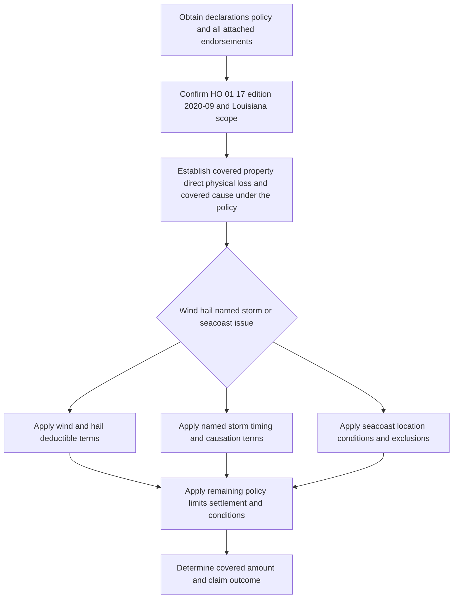

# Louisiana Contract Amendments — Wind, Claims, and Seacoast Terms

## Scope, edition, and source boundary

This page concerns **HO 01 17 Louisiana Amendatory Endorsement, edition 2020-09**, identified in the repository as an HO-3, Louisiana form with a 2020-09-01 effective date. By its terms, it applies to property and loss subject to Louisiana law, is part of the attached policy, controls a conflicting policy term, and otherwise leaves the policy in force. It applies only to coverage the policy already provides unless it expressly provides coverage. The policy packet—not the state name alone—therefore must establish that this edition was attached, applied on the loss date, and applies to the property and loss at issue. [HO 01 17 LA (2020-09), front matter and T.0](repo://forms/HO/LA/HO-01-17/2020-09.md#L1-L57)

The amendment does **not** identify, section by section, the base-form provisions that each of its terms replaces. Do not assume that it applies to the supplied Mississippi HO-3 editions merely because they are related corpus forms. The repository's HO-3 (2024-03) does expressly cross-reference this Louisiana endorsement for a state-amendment condition and says the applicable amendment controls a conflict, but that cross-reference does not establish attachment or map the balance of HO 01 17 to a particular Louisiana base-form edition. [HO-3 (2024-03), I.S S.88–S.95](repo://forms/HO/MS/HO-3/2024-03.md#L977-L991)

> **Bulletin limitation.** T.1.71 refers to “Louisiana Bulletin LDI-2020-07” for deductible notice, while saying that the notice does not alter the endorsement. No Louisiana regulator bulletin is held in this corpus. Accordingly, this page reports the endorsement's contractual wording only; it does **not** infer a Louisiana regulatory rule, statutory deadline, or remedy from that reference. [HO 01 17 LA (2020-09), T.1.71](repo://forms/HO/LA/HO-01-17/2020-09.md#L201-L203)

### Assembly and application sequence

*The amendment is applied only after the governing packet and base coverage are established; its state-specific terms operate alongside every unconflicted policy term.* [HO 01 17 LA (2020-09), T.0](repo://forms/HO/LA/HO-01-17/2020-09.md#L13-L57)

## Windstorm and hail deductible

### Trigger, amount, and calculation order

For a **covered direct physical loss** caused by windstorm or hail, the endorsement applies the windstorm-and-hail deductible. The percentage cannot be below **2%** or above **5%**; the applicable deductible is determined under the policy terms at the time of loss. The deductible is applied before the amount payable is determined, does not increase a liability limit, and leaves the insured responsible for the part of loss within it. It applies on both replacement-cost and actual-cash-value settlements, and completion of repairs does not remove it. [HO 01 17 LA (2020-09), T.1.1–T.1.7 and T.1.23–T.1.25](repo://forms/HO/LA/HO-01-17/2020-09.md#L61-L73) [HO 01 17 LA (2020-09), T.1.23–T.1.25](repo://forms/HO/LA/HO-01-17/2020-09.md#L105-L109)

Wind includes gusts and wind-driven debris; hail includes impact by hailstones and resulting direct physical damage. Either need only contribute directly to covered loss, rather than be the sole cause. For wind-driven rain, the deductible can apply when rain enters through an opening windstorm or hail created, but the deductible does not establish that rain damage is covered. The same point applies generally: exclusions, limits, insurable-interest requirements, and no-betterment constraints are tested before a deductible can yield a payment calculation. [HO 01 17 LA (2020-09), T.1.8–T.1.16](repo://forms/HO/LA/HO-01-17/2020-09.md#L75-L93) [HO 01 17 LA (2020-09), T.1.38–T.1.47](repo://forms/HO/LA/HO-01-17/2020-09.md#L133-L153)

The endorsement treats the total covered property damage arising from the same occurrence as one deductible application; related damage from the same wind or hail event remains one occurrence even if found later. Separate weather events can be separate occurrences. Where wind/hail and another covered cause produce loss, it assigns the wind/hail deductible to the wind/hail portion and any other applicable deductible to the remaining covered portion; it does not combine deductibles to create a payment. This makes factual allocation of cause and event relationship material to the calculation. [HO 01 17 LA (2020-09), T.1.15–T.1.20](repo://forms/HO/LA/HO-01-17/2020-09.md#L89-L99)

The deductible can reach otherwise covered loss involving the dwelling, other structures, personal property, extended property, debris removal, protective repairs, and loss of use when that coverage is provided. Those references extend the deductible's application; they do not independently grant any of those coverages. [HO 01 17 LA (2020-09), T.1.21–T.1.24 and T.1.48–T.1.53](repo://forms/HO/LA/HO-01-17/2020-09.md#L101-L107) [HO 01 17 LA (2020-09), T.1.48–T.1.53](repo://forms/HO/LA/HO-01-17/2020-09.md#L155-L165)

### Notice of a deductible increase

Section T.2 calls for the insurer to provide notice at least **30 days** before an increase in the windstorm deductible takes effect. The notice must identify the deductible, change, and effective date; it may be delivered by mail, electronic means, or another legally permitted method. The amendment says the change is effective on the stated date, applies to loss occurring then or later rather than retroactively, and is enforceable only to the extent permitted by applicable law. These are contractual terms in this endorsement, not a verified statement of Louisiana regulatory requirements. [HO 01 17 LA (2020-09), T.2.1–T.2.13 and T.2.20](repo://forms/HO/LA/HO-01-17/2020-09.md#L213-L237) [HO 01 17 LA (2020-09), T.2.20–T.2.24](repo://forms/HO/LA/HO-01-17/2020-09.md#L251-L259)

## Named Storm Period: a timing and evidence control

A **Named Storm Period** starts when a named-storm designation takes effect and continues for **72 hours** after that designation ends. The insurer determines whether the designation applies from reliable weather information, including information from a governmental weather authority, and determines loss timing from the surrounding facts—not merely when damage was discovered. A loss beginning during the period remains subject to this provision despite later continued damage; unrelated damage is evaluated separately. [HO 01 17 LA (2020-09), T.3.1–T.3.6](repo://forms/HO/LA/HO-01-17/2020-09.md#L263-L273)

The designation does not prove that every observed item was caused by the named storm. The policyholder must establish that claimed damage resulted from a covered cause; pre-period damage is not transformed into storm damage by discovery during the period. Weather records, inspection results, witness information, property condition, and repair records can be considered, and the evaluation may be revised as reliable information arrives. The Named Storm Period section does not itself state that it changes the deductible percentage or creates wind, rain, surge, or water coverage. [HO 01 17 LA (2020-09), T.3.16–T.3.24](repo://forms/HO/LA/HO-01-17/2020-09.md#L293-L309)

For a potentially storm-related claim, the endorsement calls for prompt notice identifying the damaged property and known circumstances; reasonable documented protection against further damage; retention of damaged property where practicable; inspection access; and cooperation, including available weather, photo, receipt, and repair information. Emergency repairs do not establish coverage. [HO 01 17 LA (2020-09), T.3.7–T.3.15](repo://forms/HO/LA/HO-01-17/2020-09.md#L275-L291)

## Claim conditions and handling terms

T.5 states that the insurer will acknowledge a claim within **14 days** of receipt. It may request reasonably necessary information and a signed proof of loss, must identify requests with reasonable clarity, and may make further requests when the material supplied is incomplete, inconsistent, or insufficient. After receiving all requested items, it will accept or reject the claim within **30 business days** and pay an accepted claim within **30 business days**. These are the endorsement's claim-handling promises; their interaction with applicable Louisiana law is not verified by a regulator source in this corpus. [HO 01 17 LA (2020-09), T.5.1–T.5.6](repo://forms/HO/LA/HO-01-17/2020-09.md#L429-L439)

The insured's corresponding claim responsibilities include cooperation; access and preservation for inspection; reasonable protection and expense records; requested ownership, condition, value, other-insurance, and electronic-record information; truthful EUO testimony if requested; and preservation of material evidence. The amendment permits denial for an insured's failure to preserve evidence only for resulting prejudice and, more broadly, says failure to comply with T.5 duties may affect coverage only to the extent it prejudices investigation, evaluation, or resolution. A request or inspection is not a coverage acceptance. [HO 01 17 LA (2020-09), T.5.7–T.5.30](repo://forms/HO/LA/HO-01-17/2020-09.md#L441-L487) [HO 01 17 LA (2020-09), T.5.49–T.5.50](repo://forms/HO/LA/HO-01-17/2020-09.md#L525-L527)

The insurer may pay an undisputed portion while other issues remain under investigation; an insured may submit an estimate; and a decision may be reconsidered if material information was not previously available. Payments or communications with a mortgagee, lienholder, or other legal-interest holder do not waive a condition. For operational intake, documentation, and referral controls that are not contract terms, see [Claim Intake, Investigation, and Documentation](/openwiki/claims-guidance/claim-intake-investigation-and-documentation.md). [HO 01 17 LA (2020-09), T.5.19–T.5.25 and T.5.31–T.5.36](repo://forms/HO/LA/HO-01-17/2020-09.md#L465-L499)

## Seacoast Territory terms

These provisions apply only to property in the endorsement-defined **Seacoast Territory** and to a Covered Location within it. Territory status turns on physical location, although the endorsement does not supply a geographic boundary or classification schedule. Coverage at that location is only as stated in the policy, and all applicable conditions, limitations, and exclusions remain in force. Confirm the declarations, territory classification, and the loss-date location rather than treating coastal exposure as a standalone coverage grant. [HO 01 17 LA (2020-09), T.6.1–T.6.7](repo://forms/HO/LA/HO-01-17/2020-09.md#L531-L543)

Before and after loss, the insured must use reasonable care and take reasonable protective measures: secure the location for threatened severe weather; maintain its roof, walls, openings, protective devices, and drainage; notify the insurer as soon as practicable of loss; mitigate and preserve property; provide access, records, and cooperation; and report material use, occupancy, condition, and vacancy changes. The insurer may inspect and request reasonable construction, maintenance, repair, and improvement information, and may require reasonable protective measures when they are a condition of coverage. [HO 01 17 LA (2020-09), T.6.8–T.6.16 and T.6.24–T.6.28](repo://forms/HO/LA/HO-01-17/2020-09.md#L545-L561) [HO 01 17 LA (2020-09), T.6.24–T.6.28](repo://forms/HO/LA/HO-01-17/2020-09.md#L577-L585)

The seacoast provision excludes loss from neglect only as to further loss caused by that neglect; it also excludes wear, deterioration, corrosion, decay, latent defect, and inadequate maintenance. It separately excludes sewer/drain/sump backup or sump overflow, and flood, surface water, waves, tidal water, body-of-water overflow, and storm surge, whether wind-driven or not. It additionally excludes specified earth movement, pollutants, and intentional damage or material concealment/misrepresentation. Windstorm is defined to include wind associated with a hurricane or tropical storm, while storm surge is defined as wind-caused abnormal water rise; that definition does not overcome the separate storm-surge exclusion. [HO 01 17 LA (2020-09), T.6.3–T.6.5 and T.6.17–T.6.23](repo://forms/HO/LA/HO-01-17/2020-09.md#L535-L575)

For water-source and write-back analysis, see [Water Damage and Water-Backup Write-Backs](/openwiki/coverages/coverage-a/water-damage-and-water-backup.md). A later change in Seacoast Territory classification does not create coverage for an earlier loss; coverage is evaluated on the facts at the time of loss. [HO 01 17 LA (2020-09), T.6.29–T.6.33](repo://forms/HO/LA/HO-01-17/2020-09.md#L587-L595)

## Other contractual controls

- **Cancellation and nonrenewal.** The endorsement permits cancellation by the insurer in writing, with 10 days' notice for nonpayment and 30 days' notice for other stated cancellation reasons; it describes a 30-day nonrenewal notice. It repeatedly qualifies those terms by applicable law. Cancellation or nonrenewal does not remove claim duties or the insurer's duty to adjust a covered pre-termination loss. [HO 01 17 LA (2020-09), T.4.1–T.4.11 and T.4.22–T.4.24](repo://forms/HO/LA/HO-01-17/2020-09.md#L313-L359) [HO 01 17 LA (2020-09), T.4.34–T.4.40 and T.4.53–T.4.57](repo://forms/HO/LA/HO-01-17/2020-09.md#L379-L425)
- **Action against the insurer.** T.7 conditions a legal action on compliance with applicable policy provisions and requires commencement within two years after the date of loss. It also requires claim presentation and a reasonable opportunity to evaluate it; investigation and payment do not waive conditions or defenses. This is contract text, subject to applicable law—not a verified statement of a Louisiana limitations rule. [HO 01 17 LA (2020-09), T.7.1–T.7.9](repo://forms/HO/LA/HO-01-17/2020-09.md#L599-L615)
- **General claim and coverage constraints.** T.8 reiterates prompt reporting, protection, access before repair/removal, records, EUO, preservation of recovery rights, and the principle that a duty failure may affect coverage only when it prejudices the insurer's ability to investigate, adjust, settle, defend, or recover. It also makes clear that appraisal can determine amount of loss but not coverage, cause, or an exclusion. [HO 01 17 LA (2020-09), T.8.5–T.8.15 and T.8.38–T.8.43](repo://forms/HO/LA/HO-01-17/2020-09.md#L657-L677) [HO 01 17 LA (2020-09), T.8.51–T.8.65](repo://forms/HO/LA/HO-01-17/2020-09.md#L749-L777)
- **Definitions.** T.9 supplies definitions that are material to these terms, including residence premises, dwelling, other structures, covered property, loss, direct physical loss, water, flood, surface water, sewer, storm surge, fungi, and actual cash value. Apply these endorsement definitions where the amendment uses them; otherwise, its general scope provision preserves the policy's meanings. [HO 01 17 LA (2020-09), T.0](repo://forms/HO/LA/HO-01-17/2020-09.md#L25-L33) [HO 01 17 LA (2020-09), T.9.5–T.9.18 and T.9.32–T.9.39](repo://forms/HO/LA/HO-01-17/2020-09.md#L789-L815) [HO 01 17 LA (2020-09), T.9.32–T.9.39](repo://forms/HO/LA/HO-01-17/2020-09.md#L843-L857)

## Focused review checks

1. Obtain the declarations, full base form, this exact 2020-09 endorsement if attached, every other endorsement, and the loss-date policy period. Confirm Louisiana-law scope and, for a seacoast issue, the actual property location and classification.
2. For wind/hail, separate covered direct physical damage from excluded water, maintenance, pre-existing, and non-covered property issues. Establish the event date, causation allocation, relationship of events, applicable percentage, loss basis, limits, and the deductible calculation order.
3. For a named-storm report, preserve designation evidence, loss and discovery timing, prior-condition evidence, inspection findings, mitigation records, and the basis for separating unrelated damage.
4. For a seacoast loss, separately test wind damage, rain through a qualifying opening, storm surge, flood/surface/tidal water, backup, and earth movement. Do not let the weather-event label decide the water mechanism.
5. Calendar the contract's stated notice, acknowledgment, decision, payment, and suit dates only after identifying their stated triggers. Obtain legal or compliance direction for any question of Louisiana law because the referenced LDI bulletin is absent from the corpus.
6. Treat inspection, emergency mitigation, partial payment, appraisal, and claim correspondence as their stated functions—not as a waiver, proof of coverage, or substitute for the governing-policy analysis. For dwelling property and settlement sequencing, see [Coverage A — Dwelling, Limits, and Base Loss Settlement](/openwiki/coverages/coverage-a/dwelling-and-settlement.md); Coverage E requires its separate Section II analysis at [Coverage E — Personal Liability](/openwiki/coverages/coverage-e/personal-liability.md).
