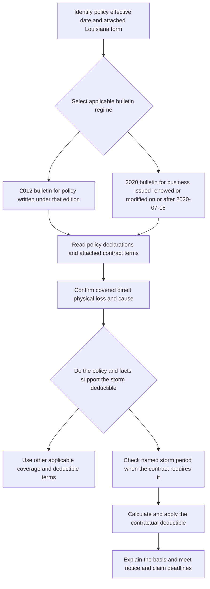

# Louisiana State Overlay

This page separates three layers that must be read together but must not be conflated:

1. **Regulatory layer:** Louisiana Bulletin LDI-2012-05 for policies written under that edition, or current Bulletin LDI-2020-07 for the later effective period.
2. **Contract layer:** the applicable policy, declarations, and attached **HO 01 17 Louisiana Amendatory Endorsement**. The form controls a conflict with the policy, but it does not create coverage that the policy does not provide.
3. **Internal underwriting layer:** Personal Lines Underwriting Manual Rule 540. It controls carrier acceptance, referral, and documentation; it is not a customer-facing coverage term.

The bulletin constrains how the insurer discloses, files, and administers a deductible. The attached form supplies the contractual deductible, named-storm-period, loss, and claim mechanics. The policy-effective date and the policy’s attached edition determine which contract text is live; a superseded bulletin or form is not silently replaced for an older policy.

## Edition and authority map

| Source | Status and boundary | What it controls |
|---|---|---|
| **LDI-2012-05** | Superseded by LDI-2020-07 for policies effective on or after **July 15, 2020**; it remains relevant to policies written under the earlier edition. ([2012 bulletin metadata and supersession](repo://bulletins/LA/ldi-2012-05-hurricane-deductible.md#L1-L9)) | Earlier hurricane-deductible notice, disclosure, claims, filing, and approval requirements. |
| **LDI-2020-07** | Effective **July 15, 2020**; applies to affected personal residential property business issued, delivered, renewed, or modified on or after that date. ([2020 bulletin metadata](repo://bulletins/LA/ldi-2020-07-hurricane-deductible.md#L1-L7), [B.1.21 and B.2.1](repo://bulletins/LA/ldi-2020-07-hurricane-deductible.md#L51-L61)) | Current Louisiana regulatory requirements for hurricane deductibles and named-storm periods. |
| **HO 01 17, 2020-09** | Louisiana amendatory endorsement effective **September 1, 2020**. It applies only when attached to the policy. ([form metadata](repo://forms/HO/LA/HO-01-17/2020-09.md#L1-L7), [T.0 scope and precedence](repo://forms/HO/LA/HO-01-17/2020-09.md#L13-L25)) | Contractual windstorm and hail deductible, deductible-change notice, named-storm period, and claims terms. |

A later bulletin does not itself rewrite an earlier policy. For a claim, first identify the policy effective date, applicable form edition, attached endorsements, declarations, and the bulletin regime; then apply the contract and the regulatory constraints to the same facts.

## Control flow for a Louisiana storm claim

*This flow shows the date-sensitive authority selection and the contract-first claim sequence required by the Louisiana sources.*

## Superseded position: LDI-2012-05

### Applicability and deductible rule

LDI-2012-05 applied to an admitted insurer delivering or issuing a Louisiana property policy containing a hurricane deductible, including a policy that is renewed, amended, or replaced. The insurer had to identify the deductible, explain when it could apply, distinguish it from other deductibles, and keep the notice with the policy materials. ([2012 bulletin, B.1.1-B.1.8](repo://bulletins/LA/ldi-2012-05-hurricane-deductible.md#L13-L29))

The 2012 regulatory ceiling was **5% of insured value** for the deductible applicable to windstorm and hail losses. The notice also had to state the basis used to calculate the deductible and match the deductible in the policy. ([2012 bulletin, B.2.1-B.2.12](repo://bulletins/LA/ldi-2012-05-hurricane-deductible.md#L47-L71)) This is the 2012 bulletin’s regulatory limit; it is not a substitute for identifying the deductible and calculation method in the applicable policy or endorsement.

### Named-storm trigger and disclosure

The 2012 bulletin did **not** prescribe a fixed named-storm period or a 72-hour continuation. It required the notice to explain whether the hurricane deductible applied only after a hurricane had been declared or designated by an authorized governmental authority, and to identify the event or condition used to determine applicability. ([2012 bulletin, B.2.4-B.2.8](repo://bulletins/LA/ldi-2012-05-hurricane-deductible.md#L55-L65)) Do not import the 2020 form’s 72-hour rule into a policy governed only by the 2012 position.

The disclosure had to be clear, conspicuous, understandable, and separate from other deductibles. It could be delivered in an application, declarations page, endorsement, renewal offer, or separate communication, but presentation could not obscure the deductible. The insurer had to provide it before the applicant became obligated under the policy and before renewal when the renewed policy contained the deductible. ([2012 bulletin, B.2.2-B.2.6 and B.2.13-B.2.15](repo://bulletins/LA/ldi-2012-05-hurricane-deductible.md#L49-L59), [B.2.21-B.2.24](repo://bulletins/LA/ldi-2012-05-hurricane-deductible.md#L89-L95))

### Advance notice and filing deadlines

For an **increase in a windstorm deductible**, the 2012 bulletin required written notice at least **30 days before** the increase took effect. The insurer could not make the increase effective without the notice and had to state the effective date and preserve evidence of delivery. ([2012 bulletin, B.3.8-B.3.16](repo://bulletins/LA/ldi-2012-05-hurricane-deductible.md#L153-L167)) A revised notice was also required when the deductible was changed, and a new deductible had to be disclosed before the policyholder was required to accept the policy containing it. ([2012 bulletin, B.2.21-B.2.23](repo://bulletins/LA/ldi-2012-05-hurricane-deductible.md#L89-L95))

Before using a hurricane-deductible notice, the insurer had to file it with the Department, identify the forms and endorsements to which it applied, and obtain Department approval. Filing alone did not authorize use; an approved notice had to be used without unapproved alteration, and material revisions had to be filed before use. ([2012 bulletin, B.5.1-B.5.8](repo://bulletins/LA/ldi-2012-05-hurricane-deductible.md#L257-L273))

### 2012 claims requirements

The 2012 claims standards required the insurer to investigate a reported loss promptly, determine the deductible from the policy terms in effect for the loss, and advise the insured when the hurricane deductible might apply. The insurer had to evaluate cause and timing, distinguish hurricane-deductible damage from damage subject to another deductible or no deductible, and document the allocation. ([2012 bulletin, B.4.1-B.4.6](repo://bulletins/LA/ldi-2012-05-hurricane-deductible.md#L215-L227))

A payment or denial that reflected the deductible required a timely written explanation of how the deductible affected the result. The insurer could not delay adjustment of undisputed portions while evaluating deductible applicability elsewhere, had to preserve material claim communications and documents, and had to correct an erroneous deductible determination and pay additional amounts due. ([2012 bulletin, B.4.7-B.4.18](repo://bulletins/LA/ldi-2012-05-hurricane-deductible.md#L229-L251)) The 2012 bulletin states prompt or timely duties here, but does not provide the HO 01 17 form’s later numeric claim deadlines.

## Current position: LDI-2020-07

### Applicability, deductible rule, and named-storm period

LDI-2020-07 applies to affected personal residential property insurance issued, delivered, renewed, or modified on or after **July 15, 2020**. The insurer must administer the deductible and named-storm period consistently with the policy contract and may not apply a deductible the contract does not authorize. ([2020 bulletin, B.1.21-B.1.22 and B.2.1-B.2.2](repo://bulletins/LA/ldi-2020-07-hurricane-deductible.md#L51-L63))

The 2020 bulletin states that a hurricane deductible must not exceed **5% of the applicable covered loss** and requires disclosure of whether the percentage is based on an insured value or another policy basis. ([2020 bulletin, B.2.13-B.2.16](repo://bulletins/LA/ldi-2020-07-hurricane-deductible.md#L85-L91)) This regulatory statement must be read with the attached contract: HO 01 17 sets the contractual windstorm-and-hail percentage at **2% minimum and 5% maximum**. ([HO 01 17, T.1-T.6](repo://forms/HO/LA/HO-01-17/2020-09.md#L59-L71))

Where the policy uses the 2020 named-storm provision, the **Named Storm Period begins when the named-storm designation takes effect and continues for 72 hours after the designation ends**. The insurer determines the designation from reliable weather information, which may include a governmental weather authority. Whether direct physical loss occurred during the period is determined from the facts surrounding the loss; the date damage is discovered does not alone establish when the loss occurred. ([HO 01 17, T.1-T.5 of T.3](repo://forms/HO/LA/HO-01-17/2020-09.md#L261-L273))

The bulletin requires the notice to disclose the commencement event and the relationship between the named-storm period and the deductible. It expressly requires the notice to state the **72-hour continuation** after the designation ends and not imply that the period ends merely because weather improves. ([2020 bulletin, B.3.10-B.3.12 and B.3.20-B.3.22](repo://bulletins/LA/ldi-2020-07-hurricane-deductible.md#L199-L223)) The period affects deductible application only as authorized by the policy; a storm designation alone does not establish coverage or permit a coverage denial. ([2020 bulletin, B.2.39-B.2.42](repo://bulletins/LA/ldi-2020-07-hurricane-deductible.md#L137-L143))

### Disclosure and advance-notice periods

The 2020 disclosure must be clear and conspicuous and identify the deductible, applicable coverage, trigger conditions, calculation basis, relationship to other deductibles, and how the insured can obtain information about whether a named-storm period is in effect. It must be provided before an applicant is bound and at renewal when the deductible is included, changed, or continued. ([2020 bulletin, B.2.3-B.2.10](repo://bulletins/LA/ldi-2020-07-hurricane-deductible.md#L65-L81)) The insurer must retain copies of the disclosure and records showing the applicable policy deductible and delivery method; electronic delivery is acceptable when the recipient can retain the disclosure and paper is provided when required by law. ([2020 bulletin, B.2.17-B.2.20](repo://bulletins/LA/ldi-2020-07-hurricane-deductible.md#L93-L99))

For an increase in a **windstorm deductible**, the insurer must give advance written notice at least **30 days before** the increase takes effect and may not impose the increased deductible before that period expires. The notice must state the prior deductible, the new deductible, and the effective date. ([2020 bulletin, B.3.4-B.3.8](repo://bulletins/LA/ldi-2020-07-hurricane-deductible.md#L187-L197)) A premium notice alone is insufficient unless it contains the required deductible information. ([2020 bulletin, B.3.24-B.3.28](repo://bulletins/LA/ldi-2020-07-hurricane-deductible.md#L225-L235))

The insurer must file hurricane-deductible notice language before use, file named-storm language when it affects deductible application, identify the policy forms and endorsements covered by the filing, and not treat Department review as authorization to use incomplete or misleading language. ([2020 bulletin, B.5.1-B.5.11](repo://bulletins/LA/ldi-2020-07-hurricane-deductible.md#L299-L321)) A change may not be applied to an insured before the required notice is provided. ([2020 bulletin, B.5.12-B.5.16](repo://bulletins/LA/ldi-2020-07-hurricane-deductible.md#L323-L331))

### 2020 claims requirements

The insurer must acknowledge claim communications without unreasonable delay and provide the responsible claim contact, conduct a reasonable investigation before denying or limiting payment, and explain the decision in plain language with the relied-on policy provision. ([2020 bulletin, B.4.1-B.4.5](repo://bulletins/LA/ldi-2020-07-hurricane-deductible.md#L257-L269)) Before applying a period-dependent deductible, the insurer must determine whether the loss occurred during the named-storm period and document the determination in the claim file. Cause of loss must be evaluated separately from deductible applicability, and a deductible dispute must not delay investigation or adjustment of covered damage. ([2020 bulletin, B.4.6-B.4.9](repo://bulletins/LA/ldi-2020-07-hurricane-deductible.md#L267-L275))

The claim explanation must identify the basis for applying the deductible and the relevant policy language. The file must contain sufficient communications, investigation records, estimates, and decision basis. Covered payment must not be delayed unreasonably after the amount payable is determined, and a hurricane or named-storm period may not be used to reduce, delay, or deny otherwise available coverage except as permitted by the policy and supported by the facts. ([2020 bulletin, B.4.9-B.4.20](repo://bulletins/LA/ldi-2020-07-hurricane-deductible.md#L273-L297)) The bulletin supplies these regulatory claim-handling standards; the numeric claim deadlines below come from HO 01 17.

## Implementing contract: HO 01 17, 2020-09

### Contract precedence and deductible mechanics

HO 01 17 modifies the policy for Louisiana law. If it conflicts with the policy, the endorsement controls; nonconflicting policy terms remain applicable, and the endorsement does not provide coverage the policy does not otherwise provide. ([HO 01 17, T.0](repo://forms/HO/LA/HO-01-17/2020-09.md#L13-L31))

The contractual **windstorm and hail deductible** applies to covered direct physical loss caused by windstorm or hail. Its range is **2% to 5%**. It is calculated from the terms governing the policy at the time of loss, applies before payment, and does not increase a limit of liability. ([HO 01 17, T.1-T.7](repo://forms/HO/LA/HO-01-17/2020-09.md#L59-L73))

Windstorm or hail need not be the sole cause. The deductible applies when either contributes directly to covered loss, including covered wind-driven rain entering through an opening created by windstorm or hail. For a mixed loss, the windstorm-and-hail deductible applies to the windstorm-or-hail portion and another applicable deductible applies to the remaining covered portion. ([HO 01 17, T.8-T.17](repo://forms/HO/LA/HO-01-17/2020-09.md#L75-L93)) Related damage from the same windstorm or hail event is one occurrence even if discovered at different times; separate weather events may be separate occurrences. ([HO 01 17, T.18-T.20](repo://forms/HO/LA/HO-01-17/2020-09.md#L95-L99))

The deductible applies only after coverage is established and does not restore excluded flood, surface water, earth movement, wear, deterioration, or other excluded loss. Covered additional repair costs, debris removal, reasonable protective repairs, and covered loss of use can remain subject to the deductible when the policy covers them. ([HO 01 17, T.37-T.50](repo://forms/HO/LA/HO-01-17/2020-09.md#L133-L159), [T.51-T.75](repo://forms/HO/LA/HO-01-17/2020-09.md#L161-L209))

### Deductible-change notice

HO 01 17 requires at least **30 days’ notice** before an increase in the windstorm deductible takes effect. The notice must identify the affected deductible, describe the change, state its effective date, and use a legally permitted delivery method. The change applies prospectively: it does not apply to a covered loss that began before its effective date, and the deductible in effect when the loss occurs controls. ([HO 01 17, T.1-T.10 of T.2](repo://forms/HO/LA/HO-01-17/2020-09.md#L211-L235))

### Named-storm period and insured duties

HO 01 17’s Named Storm Period begins when the designation takes effect and runs for **72 hours after** the designation ends. The insurer may consider wind, rain, storm surge, waves, tidal water, debris, the sequence of weather events, weather records, inspections, witness information, and other reliable evidence when determining whether the loss is related to the named storm. ([HO 01 17, T.1-T.6 and T.16-T.24 of T.3](repo://forms/HO/LA/HO-01-17/2020-09.md#L261-L309))

A named-storm designation does not establish that all damage was caused by the named storm, and damage that predated the period is not converted into named-storm damage merely because it was discovered during the period. The insured must give prompt notice, protect property from further damage, retain damaged property when practicable, allow inspection, cooperate, and provide available weather information, photographs, receipts, repair information, location, and pre-loss-condition information. ([HO 01 17, T.7-T.19 of T.3](repo://forms/HO/LA/HO-01-17/2020-09.md#L275-L299))

### Numeric claims deadlines and claim duties

HO 01 17 supplies the key numeric claim deadlines:

- **Acknowledgment:** the insurer must acknowledge receipt of a claim within **14 days** after receiving it; the acknowledgment may be oral or written.
- **Decision:** after receiving all requested items, the insurer must accept or reject the claim within **30 business days**.
- **Payment:** an accepted claim must be paid within **30 business days**.
- **Suit:** a legal action against the insurer must be brought within **2 years after the date of loss**, subject to applicable law and the policy’s other conditions.

These deadlines and the related information, proof-of-loss, inspection, cooperation, and preservation duties appear in the form’s claims-handling and suit provisions. ([HO 01 17, T.1-T.16 of T.5](repo://forms/HO/LA/HO-01-17/2020-09.md#L427-L461), [T.27-T.50 of T.5](repo://forms/HO/LA/HO-01-17/2020-09.md#L481-L527), [T.1-T.8 of T.7](repo://forms/HO/LA/HO-01-17/2020-09.md#L597-L613))

The form does not impose a single fixed number of days for the insured’s proof of loss or other requested claim information. Instead, the insurer may request a signed proof of loss and reasonably necessary information, and the insured must provide requested available material and cooperate. The insurer may pay an undisputed portion while other portions remain under investigation, and a claim decision must state the basis with reasonable specificity. ([HO 01 17, T.2-T.6 and T.31-T.34 of T.5](repo://forms/HO/LA/HO-01-17/2020-09.md#L429-L439), [T.31-T.34 of T.5](repo://forms/HO/LA/HO-01-17/2020-09.md#L489-L495))

## Rule 540: internal Louisiana underwriting guidance

Rule 540 is separate from the Louisiana Department bulletins and from HO 01 17. The underwriting manual is internal carrier direction, must be used within delegated authority, requires documentation, and expressly forbids using manual guidance to alter coverage. It requires pre-bind review and referral before binding when referral applies. ([Personal Lines Underwriting Manual, Rules 100.A-100.G](repo://manuals/underwriting/manual.md#L13-L55))

For this overlay, the relevant Rule 540 controls are:

- **540.BA:** refer a risk when the maximum windstorm-and-hail deductible percentage is not available for selection; document the available options and underwriting action.
- **540.BB:** refer a risk submitted outside the internal **named storm window** and document the submission status and disposition.
- **540.BC:** apply credits from the state-exception pages of the rating manual only when supported by required risk information.
- **540.BD:** refer requests for exceptions to Louisiana eligibility criteria before binding or issuing.
- **540.BE:** retain underwriting support for every Louisiana exception decision, including final eligibility, authority, rating, and exception decisions.

([Rule 540.BA-BE](repo://manuals/underwriting/manual.md#L7501-L7529))

Rule 540’s “named storm window” is an internal binding or submission-timing control. Rule 540 does not define it as the contractual 72-hour Named Storm Period, and it does not replace the bulletin disclosure, form language, or claim determination. Do not expose the manual’s internal language as a policyholder disclosure or use it to expand, restrict, or reinterpret coverage. ([Manual Rule 100.B and Rule 100.D](repo://manuals/underwriting/manual.md#L21-L37), [Rule 540.BB](repo://manuals/underwriting/manual.md#L7507-L7511))

## Operational checklist and failure checks

Before quoting, binding, renewing, changing, or adjusting a Louisiana policy:

1. **Select the regime by date and policy history.** Determine whether the policy remains under LDI-2012-05 or is in the LDI-2020-07 period. Do not backdate the later bulletin or form.
2. **Identify the contract.** Confirm the declarations, attached HO 01 17 edition, deductible percentage, applicable limit or value basis, windstorm-and-hail trigger, and occurrence treatment.
3. **Separate disclosure from coverage.** Provide the required trigger, deductible, calculation, other-deductible relationship, named-storm information, and required advance notice. A bulletin notice cannot create coverage absent contract language.
4. **Apply the named-storm rule only when the contract supports it.** Under HO 01 17, use the designation start and 72-hour continuation, but determine when loss occurred from the facts rather than the discovery date or storm name alone.
5. **Preserve claim evidence.** Record the policy provision, weather and inspection evidence, cause allocation, named-storm-period determination, deductible calculation, communications, requested items, and payment or denial explanation.
6. **Run Rule 540 separately before binding.** Check deductible availability and named-storm-window referral, obtain authority for exceptions, and retain underwriting support. Do not treat those internal controls as policy terms.

Common failures are using the 2020 72-hour period for a policy governed only by the 2012 position, applying a deductible not authorized by the contract, imposing an increased deductible before the 30-day notice period expires, treating a named storm as proof of causation, or using Rule 540 as if it were customer-facing coverage language.

For broader deductible calculation and wind-driven-rain principles, see [Windstorm, Hail, and Percentage Deductibles](/openwiki/coverage/perils/wind-hail-deductibles.md). For date-sensitive assembly and the distinction between forms, bulletins, and internal guidance, see [Policy Assembly: Editions, Endorsements, and State Overlays](/openwiki/policy-assembly/editions-and-state-attachments.md).
