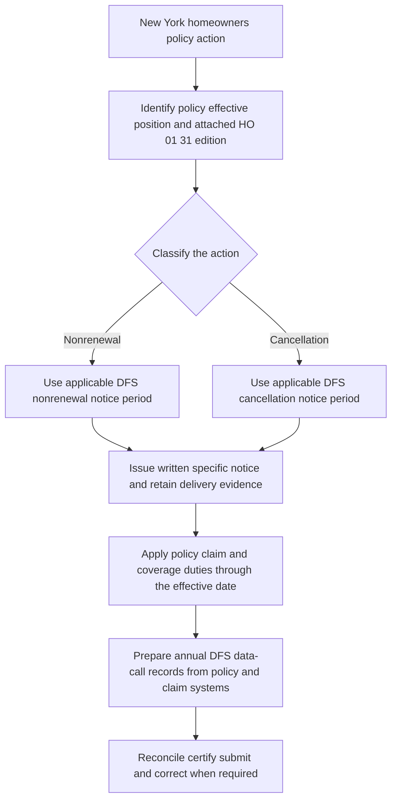

# New York State Overlay

## Scope and authority layers

New York has four related but distinct control layers:

1. **Contract layer — HO 01 31.** The New York Amendatory Endorsement applies when New York law governs. It becomes part of the policy, controls over conflicting policy language, and leaves unchanged policy terms applicable. It does not create coverage unless it expressly provides it ([HO 01 31 T.1-T.7](repo://forms/HO/NY/HO-01-31/2016-04.md#L13-L27)).
2. **Notice-regulation layer — DFS bulletins.** DFS-2010-09 governs its historical policy position, while DFS-2016-02 is the current cancellation and nonrenewal position in this source set. These bulletins regulate insurer administration and notice; they are not substitutes for the policy or endorsement.
3. **Reporting layer — DFS-2018-11.** The annual homeowners data call requires an insurer to submit, reconcile, certify, explain, and retain business and claims data. It does not establish coverage terms or a deductible minimum ([DFS-2018-11 B.1.7-B.1.10](repo://bulletins/NY/dfs-2018-11-data-call.md#L27-L33)).
4. **Internal underwriting layer.** The Personal Lines Underwriting Manual supplies carrier authority, referral, and file controls. It is internal direction, not New York regulator language and not policy coverage ([Manual Rules 100.A-100.E](repo://manuals/underwriting/manual.md#L15-L43)).

*This flow separates policy and action classification from notice issuance, continuing policy duties, and the later data-call reporting cycle.*

## Edition and effective-position control

| Authority | Effective position | Use and supersession |
| --- | --- | --- |
| **DFS-2010-09 — Nonrenewal Notice Requirements** | Effective 2010-09-01. | Superseded by DFS-2016-02 for policies effective on or after 2016-02-22. The 2010 position remains in force for policies written under it ([metadata and supersession](repo://bulletins/NY/dfs-2010-09-nonrenewal.md#L1-L9)). |
| **DFS-2016-02 — Nonrenewal and Cancellation Notice Requirements** | Effective 2016-02-22. | Current notice position represented in this repository. It applies prospectively to cancellation and nonrenewal actions and preserves the requirements applicable to earlier notices ([DFS-2016-02 B.1.20 and B.2.2](repo://bulletins/NY/dfs-2016-02-nonrenewal.md#L51-L55), [B.2.1-B.2.3](repo://bulletins/NY/dfs-2016-02-nonrenewal.md#L59-L67)). |
| **HO 01 31 New York Amendatory Endorsement, 2016-04** | Effective 2016-04-01. | Use when this edition is the attached New York HO-3 amendatory endorsement. It changes the policy only as expressly stated and preserves other policy terms ([metadata](repo://forms/HO/NY/HO-01-31/2016-04.md#L1-L7), [T.21-T.22](repo://forms/HO/NY/HO-01-31/2016-04.md#L53-L57)). |
| **DFS-2018-11 — Annual Homeowners Data Call** | Effective 2018-11-19 and effective upon issuance for requested filings. | A reporting overlay for admitted insurers writing or maintaining New York homeowners business. It is not a coverage or deductible amendment ([metadata](repo://bulletins/NY/dfs-2018-11-data-call.md#L1-L7), [B.5.1-B.5.2](repo://bulletins/NY/dfs-2018-11-data-call.md#L303-L307)). |

Select the position by the policy and notice timing applicable to the transaction. Do not replace an older policy position with current wording merely because a later bulletin or endorsement exists. The 2010 bulletin's supersession marker expressly preserves its earlier policy position, and DFS-2016-02 applies prospectively to notices issued under its effective position.

## DFS-2010-09: superseded nonrenewal position

DFS-2010-09 applied when an admitted insurer elected not to renew a policy issued or delivered in New York. It required a clear written notice that identified the policy, stated that the insurer would not renew, stated the effective date, and gave a specific and supportable reason. The insurer had to preserve the notice and the underwriting, inspection, claims, or other records supporting that reason ([DFS-2010-09 B.1.1-B.1.15](repo://bulletins/NY/dfs-2010-09-nonrenewal.md#L13-L43), [B.2.2-B.2.10](repo://bulletins/NY/dfs-2010-09-nonrenewal.md#L61-L79)).

For this historical position, the notice periods in B.3 were:

- **Nonrenewal:** mail or deliver at least **45 days before the policy’s stated end date**.
- **Cancellation for a reason other than nonpayment:** mail or deliver at least **20 days before the stated cancellation effective date**.

DFS-2010-09 B.3 does not state a numeric nonpayment-cancellation period in the cited notice provision. Do not backfill that period from the later bulletin or from an internal manual rule when analyzing a notice governed by the earlier position ([DFS-2010-09 B.3.1-B.3.18](repo://bulletins/NY/dfs-2010-09-nonrenewal.md#L161-L197)).

The historical notice also had to identify the insurer and policy identifier, state whether coverage remained in force before the effective date, distinguish nonrenewal from cancellation in accompanying communications, and preserve the content, delivery date, delivery method, and supporting reason. Oral communication could supplement but not replace the written notice ([DFS-2010-09 B.3.11-B.3.24](repo://bulletins/NY/dfs-2010-09-nonrenewal.md#L181-L209)).

When the decision used claims information, the insurer had to use relevant and accurate claim information, distinguish a claim from an inquiry or report that was not handled as a claim, investigate unresolved information, correct inaccurate records, and state a specific claim-related reason rather than a generic reference to loss history. Supporting claim and authorization records had to be retained for Department review ([DFS-2010-09 B.4.1-B.4.13](repo://bulletins/NY/dfs-2010-09-nonrenewal.md#L237-L263), [B.4.16-B.4.23](repo://bulletins/NY/dfs-2010-09-nonrenewal.md#L275-L283)).

Before use, an insurer had to file the nonrenewal notice form, include all proposed language, obtain Department approval or permission, file material revisions, retain the form version used, and stop using a form when directed. A service provider’s preparation or delivery did not shift responsibility away from the insurer ([DFS-2010-09 B.5.1-B.5.16](repo://bulletins/NY/dfs-2010-09-nonrenewal.md#L293-L325)).

## DFS-2016-02: current cancellation and nonrenewal position

DFS-2016-02 distinguishes **cancellation**—termination before the policy term expires—from **nonrenewal**—a decision not to continue coverage after expiration. The insurer remains responsible when a producer, managing general agent, administrator, or other service provider issues the notice. The notice process must use the correct action type, address each required recipient, preserve delivery evidence, and control automated notice generation ([DFS-2016-02 B.1.1-B.1.10](repo://bulletins/NY/dfs-2016-02-nonrenewal.md#L13-L33), [B.2.1-B.2.7](repo://bulletins/NY/dfs-2016-02-nonrenewal.md#L59-L73)).

### Current notice periods and deadlines

| Action | Minimum DFS-2016-02 period | Required timing anchor |
| --- | ---: | --- |
| Nonrenewal | **60 days** | Before the policy expires. ([B.3.1-B.3.2](repo://bulletins/NY/dfs-2016-02-nonrenewal.md#L145-L151)) |
| Cancellation for a reason other than nonpayment | **20 days** | Before cancellation becomes effective. ([B.3.3](repo://bulletins/NY/dfs-2016-02-nonrenewal.md#L149-L153)) |
| Cancellation for nonpayment of premium | **15 days** | Before cancellation becomes effective, identifying the unpaid premium obligation. ([B.3.3-B.3.4](repo://bulletins/NY/dfs-2016-02-nonrenewal.md#L149-L155)) |
| Data-call filing | No fixed numeric period in the bulletin | By the filing date specified by DFS, in the prescribed manner. ([DFS-2018-11 B.5.2-B.5.5](repo://bulletins/NY/dfs-2018-11-data-call.md#L305-L313)) |

The notice must be written and reasonably calculated to inform the policyholder. It must state whether it is a cancellation or nonrenewal, identify the insurer and policy number, state the affected coverage and effective date, give a sufficiently specific and accurate reason, and provide contact information. A nonpayment cancellation must identify the unpaid premium and how to pay when payment can prevent cancellation; a cure opportunity must be described when the insurer permits cure ([DFS-2016-02 B.3.1-B.3.17](repo://bulletins/NY/dfs-2016-02-nonrenewal.md#L145-L179)).

The insurer must maintain notice content and delivery evidence, preserve electronic-delivery consent where required, respond consistently to questions, correct material errors without undue delay, and ensure that a producer or service provider does not contradict the notice. Electronic delivery is available only when permitted and consented to as required, and it must remain retainable ([DFS-2016-02 B.3.18-B.3.37](repo://bulletins/NY/dfs-2016-02-nonrenewal.md#L181-L219)). A more protective applicable requirement is not displaced; DFS-2016-02 directs the insurer to apply the requirement that affords the policyholder greater protection ([B.1.17](repo://bulletins/NY/dfs-2016-02-nonrenewal.md#L45-L49), [B.2.42](repo://bulletins/NY/dfs-2016-02-nonrenewal.md#L139-L143)).

### Claims-based adverse action

For a cancellation or nonrenewal based in whole or in part on claims information, the insurer must maintain written standards and use claims information that is relevant, accurate, and reasonably related to the underwriting decision. It must distinguish an actual claim from an inquiry, report, or request for information that did not result in an opened and evaluated claim; verify the information before issuing notice; correct erroneous, withdrawn, or misattributed claims; and retain the claims information, underwriting basis, and notice ([DFS-2016-02 B.4.1-B.4.12](repo://bulletins/NY/dfs-2016-02-nonrenewal.md#L223-L247)).

The notice must identify the specific claims circumstance in clear language. “Claims experience,” “loss history,” or “underwriting standards” alone is insufficient. If the insured disputes the claims information, the insurer must investigate, consider credible documentation, and correct the underwriting record or notice when appropriate; inaccurate claims information may require withdrawal, reinstatement, or other corrective action ([DFS-2016-02 B.4.4-B.4.14](repo://bulletins/NY/dfs-2016-02-nonrenewal.md#L229-L251)).

The insurer must file each cancellation or nonrenewal notice form before use, include all policyholder-facing and variable language, file revisions before use, identify the delivery method, retain the form and completed fields, and remain responsible when a third party prepares the notice. Department review or acceptance does not transfer responsibility for legal sufficiency or accuracy ([DFS-2016-02 B.5.1-B.5.16](repo://bulletins/NY/dfs-2016-02-nonrenewal.md#L265-L297)).

## HO 01 31: contract amendments

### Precedence and deductible rules

HO 01 31’s windstorm and hail deductible applies only to covered direct physical loss caused by windstorm or hail. The selected deductible must be **at least 1% and no more than 5%**. It is separate from another deductible unless the policy expressly provides otherwise; related damage from one occurrence receives one windstorm and hail deductible, while separate occurrences may receive separate deductibles. The deductible is calculated after applicable coverage limitations and only against covered loss ([HO 01 31 T.1-T.4](repo://forms/HO/NY/HO-01-31/2016-04.md#L59-L75), [T.26-T.35](repo://forms/HO/NY/HO-01-31/2016-04.md#L111-L129)).

The deductible applies when windstorm, hail, or both cause the covered loss, including qualifying wind-driven rain, wind-driven debris, falling objects, trees or branches, and named-storm conditions. It does not create coverage for excluded water, wear, deterioration, faulty work, earth movement, or other excluded causes ([HO 01 31 T.9-T.25 and T.45-T.55](repo://forms/HO/NY/HO-01-31/2016-04.md#L77-L109), [T.45-T.55](repo://forms/HO/NY/HO-01-31/2016-04.md#L149-L169)).

A deductible change requires written notice identifying the new deductible, affected coverage, and circumstances in which it applies. The change may apply only to a loss after the notice’s stated effective date; the form supplies no numeric advance period. A change can accompany a renewal or continuation offer, but it does not alter coverage or limits and oral statements cannot change the deductible ([HO 01 31 T.1-T.4 and T.14-T.24 of the deductible-change provision](repo://forms/HO/NY/HO-01-31/2016-04.md#L211-L259)).

The named-storm provision supplies an investigation mechanism rather than an automatic coverage or deductible trigger: a named-storm period is determined from reliable meteorological information and loss facts, and its existence alone does not establish causation or select the deductible. The insured must take reasonable protective and emergency measures, preserve damaged property and records, give notice as soon as practicable, and cooperate with inspection and investigation ([HO 01 31 Named Storm Period T.1-T.10](repo://forms/HO/NY/HO-01-31/2016-04.md#L261-L281), [T.11-T.20](repo://forms/HO/NY/HO-01-31/2016-04.md#L283-L301)).

### Contractual cancellation and nonrenewal terms

HO 01 31 defines cancellation as termination before expiration and nonrenewal as noncontinuation at expiration. It repeats the current notice periods as contract terms:

- **Nonpayment cancellation:** at least **15 days** before the effective date, stating the amount due and action required to avoid cancellation.
- **Other cancellation:** at least **20 days** before the effective date, stating the reason.
- **Nonrenewal:** at least **60 days** before policy expiration, stating the intent not to renew.

The form also requires policy and premises identification and the effective date. Payment after a cancellation notice does not reinstate coverage unless agreed in writing, and proof of mailing is sufficient when mailing is authorized by law ([HO 01 31 T.1-T.20 of cancellation and nonrenewal](repo://forms/HO/NY/HO-01-31/2016-04.md#L329-L371)). A nonrenewal notice states when coverage ends, while the endorsement permits a renewal offer with changed premium, coverage, conditions, or deductibles; an offer of continuation is not a nonrenewal if it complies with applicable law ([HO 01 31 T.33-T.39](repo://forms/HO/NY/HO-01-31/2016-04.md#L395-L407)).

The insured must keep policy conditions in force until cancellation becomes effective or the policy expires and must protect the premises from further loss. The form preserves mortgagee or other protected-interest rights as applicable and permits electronic communications only when authorized by law, without replacing a legally required mailed or delivered notice ([HO 01 31 T.40-T.58](repo://forms/HO/NY/HO-01-31/2016-04.md#L409-L445)).

### Claims duties and deadlines

The endorsement imposes these claims deadlines:

- The insurer must acknowledge receipt within **15 days**.
- After receiving information and documents reasonably requested, the insurer must accept or reject the claim within **15 business days**.
- The insurer must pay an accepted claim within **5 business days**.
- An action against the insurer must be brought within **2 years after the date of loss**, subject to the form’s conditions and applicable law ([HO 01 31 claims T.1-T.6](repo://forms/HO/NY/HO-01-31/2016-04.md#L447-L461), [suit limitation T.1-T.5](repo://forms/HO/NY/HO-01-31/2016-04.md#L657-L667)).

The insured must give prompt claim notice, cooperate, provide reasonably available information, protect property from further damage, preserve damaged property until a reasonable inspection opportunity, provide requested records and evidence, submit to examination under oath when requested, and provide a truthful proof of loss when requested. The insurer may investigate cause and amount, separate covered from noncovered damage, make partial or undisputed payments, and must not withhold an undisputed amount merely because another part of the claim remains disputed ([HO 01 31 claims T.1-T.27](repo://forms/HO/NY/HO-01-31/2016-04.md#L449-L501), [T.35-T.58](repo://forms/HO/NY/HO-01-31/2016-04.md#L517-L563)).

The insured must also preserve subrogation rights, notify the insurer of lawsuits or legal process, and avoid concealment or material misrepresentation. A suit requires compliance with applicable conditions, preservation of records and evidence, and prompt notice of pleadings and other material communications ([HO 01 31 T.30-T.31 and T.49-T.50](repo://forms/HO/NY/HO-01-31/2016-04.md#L505-L509), [T.66-T.70](repo://forms/HO/NY/HO-01-31/2016-04.md#L577-L587), [suit conditions](repo://forms/HO/NY/HO-01-31/2016-04.md#L657-L691)).

## DFS-2018-11: annual homeowners data call

### Who reports and how the response is controlled

The data call applies to each admitted insurer authorized to write New York homeowners insurance that writes, renews, services, administers, or maintains in-scope homeowners business. Applicability follows the insurer’s activity, not its use of an affiliate, managing agent, administrator, vendor, or distribution channel. Reporting is by legal entity unless DFS permits another basis, and affiliated business must remain identifiable to the responsible insurer ([DFS-2018-11 B.1.1-B.1.6](repo://bulletins/NY/dfs-2018-11-data-call.md#L13-L25)).

The insurer must use books, records, systems, and files, reconcile the response to internal records, submit complete and accurate data in the designated format, identify the admitted legal name and assumed name, designate a knowledgeable contact, and certify completeness and accuracy through an authorized officer or representative. Estimates may not replace required data unless DFS authorizes them ([DFS-2018-11 B.2.1-B.2.7](repo://bulletins/NY/dfs-2018-11-data-call.md#L47-L61)).

The filing is due by the Department-specified filing date and must use the prescribed method and format. An insurer with no reportable data must still submit a filing clearly stating that condition. It must review before submission, correct inaccurate or incomplete data as directed, retain supporting records, and obtain authorized certification; third-party preparation does not shift responsibility ([DFS-2018-11 B.5.1-B.5.15](repo://bulletins/NY/dfs-2018-11-data-call.md#L303-L333)).

### Reportable policy and claims information

The response may require policy and exposure location, written and earned premium, paid losses, outstanding loss and loss-adjustment-expense reserves, salvage and subrogation, claim closures and denials, cancellations and termination classifications, underwriting action, property and mitigation characteristics, deductibles, applicable forms and endorsements, proof-of-loss periods, special-assessment limits, exclusions, cause of loss, catastrophe indicators, and geographic information. The insurer must use the governing form or endorsement for coverage fields and keep separate categories or affiliates separate when DFS requires it ([DFS-2018-11 B.2.8-B.2.40](repo://bulletins/NY/dfs-2018-11-data-call.md#L63-L127)).

For claims, the insurer must report notice and closure dates, policy status at loss, loss location, cause, affected coverage components, paid loss, allocated loss-adjustment expense, outstanding reserves, gross amounts before reinsurance recoverables unless instructions require otherwise, disposition including denial or closure without payment, reopened activity, catastrophe status, and service-provider-handled claims. The submission must reconcile to claim records and correct material discrepancies ([DFS-2018-11 B.4.1-B.4.27](repo://bulletins/NY/dfs-2018-11-data-call.md#L247-L301)).

### Disclosure, reconciliation, correction, and retention

The insurer must disclose the responsible preparer, material limitations, material changes in underwriting, rating, claims, policy administration, or data-management practices, estimates or derived values, unavailable data and substitutes, restatements, affiliate or excluded-service-provider business, treatment of terminations and endorsements, claim reopening or revision, paid or incurred basis, recovery treatment, location and classification methods, external data or models, system conversions, and material reconciliation differences. It must retain supporting records, disclose material control failures, review internal consistency, and certify after reasonable inquiry ([DFS-2018-11 B.3.1-B.3.29](repo://bulletins/NY/dfs-2018-11-data-call.md#L169-L227)).

A material error or omission discovered after submission must be corrected promptly with the affected information and basis identified. The insurer must respond to DFS inquiries, preserve confidential information, notify DFS if it cannot comply, and cooperate with review. The Department may require explanations, supporting records, revised data, or a clearly identified corrected filing ([DFS-2018-11 B.3.30-B.3.38](repo://bulletins/NY/dfs-2018-11-data-call.md#L229-L245), [B.2.41-B.2.57](repo://bulletins/NY/dfs-2018-11-data-call.md#L129-L161)).

## Internal implementation controls — not regulator language

The manual must not be shown to an applicant or insured and cannot alter coverage or serve as a coverage grant. It is pre-bind and servicing guidance within delegated authority ([Manual Rules 100.B-100.G](repo://manuals/underwriting/manual.md#L21-L55)).

For New York, internal Rule 530 directs the carrier to bind Coverage A only up to **$750,000** and refer a higher requested limit, refer a risk with **three paid property claims**, apply rating credits only after eligibility is confirmed, and refer unresolved damage or other listed risk conditions. These are carrier authority and referral controls, not DFS notice rules and not policy limits ([Manual Rule 530.A-530.D](repo://manuals/underwriting/manual.md#L6855-L6879)). Rule 530 also says to issue a notice of intent not to renew only after underwriting direction is recorded and to route nonpayment through approved servicing ([Manual Rule 530.BC](repo://manuals/underwriting/manual.md#L7181-L7185)).

Internal Rule 800 requires the operator to classify the action, verify policy status and the underwriting basis, use verified information, and document the decision. It contains internal instructions for a **10-day** premium-default notice and a **45-day** nonrenewal notice, but those numbers are not New York regulator language. For a current DFS-2016-02 or HO 01 31 position, the applicable external requirements are **15 days for nonpayment cancellation** and **60 days for nonrenewal**. The manual instruction must not be used to shorten those periods ([Manual Rule 800.A-800.G](repo://manuals/underwriting/manual.md#L9497-L9539), [DFS-2016-02 B.3.2-B.3.4](repo://bulletins/NY/dfs-2016-02-nonrenewal.md#L147-L155), [HO 01 31 cancellation and nonrenewal](repo://forms/HO/NY/HO-01-31/2016-04.md#L331-L341)).

Operationally, retain the action classification, policy status, verified reason, policy and insured identifiers, approved form version, delivery channel, mailing or transmission evidence, correction history, underwriting authority, and any claim-information review. For the data call, retain source extracts, transformations, assumptions, reconciliations, certifications, corrections, and the responsible contact. These records support both DFS review and internal audit without converting internal procedures into contract or regulator text ([DFS-2016-02 B.2.18-B.2.21](repo://bulletins/NY/dfs-2016-02-nonrenewal.md#L95-L101), [DFS-2018-11 B.2.41-B.2.53](repo://bulletins/NY/dfs-2018-11-data-call.md#L129-L153)).

## Failure checks

- **Wrong historical position:** a 45-day nonrenewal notice or omitted nonpayment period is analyzed under the wrong bulletin. Select the notice position applicable to the policy and notice date, then apply the 2010 or 2016 rule set without blending them.
- **Action misclassification:** a cancellation before expiration is labeled nonrenewal, or a nonrenewal is labeled cancellation. Reclassify the action before calculating the deadline and generating the notice ([DFS-2016-02 B.1.4-B.1.5](repo://bulletins/NY/dfs-2016-02-nonrenewal.md#L19-L25)).
- **Unsupported claim reason:** an inquiry, withdrawn claim, or misattributed claim is used as adverse claims history. Verify claim status and correct the record before notice ([DFS-2016-02 B.4.3-B.4.10](repo://bulletins/NY/dfs-2016-02-nonrenewal.md#L227-L245)).
- **Deductible mismatch:** a windstorm and hail deductible is applied to excluded loss, outside the 1%-5% range, more than once for one occurrence, or before coverage limitations are applied. Return to HO 01 31’s covered-loss and occurrence rules ([HO 01 31 T.1-T.4 and T.26-T.35](repo://forms/HO/NY/HO-01-31/2016-04.md#L59-L75), [T.26-T.35](repo://forms/HO/NY/HO-01-31/2016-04.md#L111-L129)).
- **Incomplete claim file:** the insurer cannot show prompt acknowledgment, request receipt, decision timing, payment timing, inspection opportunity, proof or records, or undisputed payment handling. Reconcile the claim file to HO 01 31 T.5 and the applicable policy duties.
- **Data-call mismatch:** reported data is estimated without authorization, aggregated across legal entities or affiliates, inconsistent with policy or claim records, or unsupported by a source and reconciliation trail. Correct the filing and preserve the correction basis.
- **Authority inversion:** an operator cites Rule 530 or Rule 800 as though it were DFS or policy language. Use the bulletin and attached form for external obligations, and use the manual only for carrier authority, referral, workflow, and documentation.

## Related pages

- [Policy assembly: editions and state attachments](/openwiki/policy-assembly/editions-and-state-attachments.md)
- [Renewal and adverse action](/openwiki/underwriting/manual/renewal-and-adverse-action.md)
- [Underwriting state exceptions](/openwiki/underwriting/manual/state-exceptions.md)
