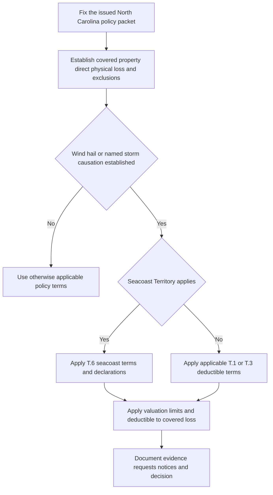

# North Carolina Contract Amendments — Wind, Named Storms, Claims, and Limits

## Scope: an attached contract amendment, not a generic state rule

This page documents **HO 01 32 North Carolina Amendatory Endorsement (2018-05)** as contract wording. It applies only if it is part of the issued, loss-date policy. The endorsement says that it changes provisions only as stated, retains unamended terms, and controls a conflict within its scope; the reviewed HO-3 base forms likewise make declarations and endorsements part of the policy and restrict policy changes to authorized written action. The 2024 HO-3 expressly identifies HO 01 32 (2018-05) as a state amendatory endorsement whose applicable amendment controls in a conflict. Do not use a form merely present in the repository to fill an attachment gap. [HO 01 32 (2018-05), T.0](repo://forms/HO/NC/HO-01-32/2018-05.md#L13-L57) [HO-3 (2018-09), AGR.1–AGR.2](repo://forms/HO/MS/HO-3/2018-09.md#L15-L17) [HO-3 (2024-03), I.S S.63 and S.93](repo://forms/HO/MS/HO-3/2024-03.md#L1039-L1047) [HO-3 (2024-03), I.S S.93](repo://forms/HO/MS/HO-3/2024-03.md#L985-L987)

The amendment is headed as an **HO-3** North Carolina form. It does not establish that an HO-6 unit-owner policy carries the same amendment or that every provision applies to every coverage. Identify the issued base-form edition, declarations, endorsement schedule, covered property, and loss date before selecting a deductible, limit, condition, or deadline. The 2018 HO-3 remains in force for policies written under it even though it is superseded for policies effective on or after 2024-03-01; a successor does not retroactively replace an earlier issued policy. [HO 01 32 (2018-05), front matter](repo://forms/HO/NC/HO-01-32/2018-05.md#L1-L8) [HO-3 (2018-09), status](repo://forms/HO/MS/HO-3/2018-09.md#L8-L9) [HO-3 (2024-03), AGR.8 and AGR.12](repo://forms/HO/MS/HO-3/2024-03.md#L29-L37)

## The decision sequence

The amendment adds targeted rules; it does not make weather, a deductible, a named-storm period, or a claims report a coverage grant. Establish covered direct physical loss and the property/coverage involved under the issued base form, then apply the North Carolina change that actually fits. For example, the 2018 HO-3 covers property against direct physical loss subject to exclusions, and the 2024 HO-3 provides that an applicable deductible is taken from covered loss unless an endorsement changes it. HO 01 32 similarly says that its wind deductible does not create coverage and requires application of applicable policy provisions before that deductible is applied. [HO-3 (2018-09), AGR.3–AGR.4](repo://forms/HO/MS/HO-3/2018-09.md#L19-L22) [HO-3 (2024-03), I.S S.29–S.34](repo://forms/HO/MS/HO-3/2024-03.md#L859-L869) [HO 01 32 (2018-05), T.1 T.5–T.7 and T.16](repo://forms/HO/NC/HO-01-32/2018-05.md#L69-L73) [HO 01 32 (2018-05), T.1 T.16](repo://forms/HO/NC/HO-01-32/2018-05.md#L91-L91)

*The contract-analysis flow preserves the base coverage inquiry before the amendment’s weather-specific deductible and settlement controls.* [HO 01 32 (2018-05), T.0](repo://forms/HO/NC/HO-01-32/2018-05.md#L21-L31) [HO-3 (2024-03), I.P P.1 and I.S S.29–S.34](repo://forms/HO/MS/HO-3/2024-03.md#L557-L563) [HO-3 (2024-03), I.S S.29–S.34](repo://forms/HO/MS/HO-3/2024-03.md#L859-L869)

## Windstorm and hail deductible

**Modification — T.1 supplies a North Carolina Windstorm and Hail Deductible for covered direct windstorm or hail loss.** The stated range is **not less than 1% and not more than 5%**. It applies when windstorm or hail is a direct cause, including with another covered cause; it is not triggered merely because severe weather occurred near the property. The deductible is applied to the covered loss before payment and may reduce or eliminate the payable amount, but does not change the property limit, create coverage, or apply to liability claims. This is a targeted change to the base deductible path, under which the 2018 HO-3 deducts from covered loss and permits an endorsement-specific deductible, while the 2024 form identifies the amendment as controlling if applicable. [HO 01 32 (2018-05), T.1 T.1–T.9](repo://forms/HO/NC/HO-01-32/2018-05.md#L61-L77) [HO 01 32 (2018-05), T.1 T.16–T.25](repo://forms/HO/NC/HO-01-32/2018-05.md#L91-L109) [HO 01 32 (2018-05), T.1 T.49–T.59](repo://forms/HO/NC/HO-01-32/2018-05.md#L157-L177) [HO-3 (2018-09), I.S S.29–S.34](repo://forms/HO/MS/HO-3/2018-09.md#L967-L977) [HO-3 (2024-03), I.S S.29–S.34 and S.93](repo://forms/HO/MS/HO-3/2024-03.md#L859-L869) [HO-3 (2024-03), I.S S.93](repo://forms/HO/MS/HO-3/2024-03.md#L985-L987)

For wind-driven rain, debris, or collapse, apply the same ordering. T.1 applies the wind/hail deductible when wind creates an opening through which rain enters, when wind-driven debris is directly caused by windstorm, and to collapse only if collapse is covered and wind/hail is a direct cause. It says neither the deductible nor the weather event restores an excluded loss. That aligns with, rather than displaces, the base form’s separate covered-peril and interior-rain-opening tests. [HO 01 32 (2018-05), T.1 T.20–T.31](repo://forms/HO/NC/HO-01-32/2018-05.md#L99-L121) [HO-3 (2018-09), I.P P.15, P.34–P.37](repo://forms/HO/MS/HO-3/2018-09.md#L655-L699) [HO-3 (2024-03), I.P P.37–P.43](repo://forms/HO/MS/HO-3/2024-03.md#L631-L645)

### Cause and evidence controls

The amendment calls for prompt notice; protection against further damage; retention of damaged property where reasonably necessary; access and records; cooperation; EUO and a signed statement when reasonably requested; and preservation of evidence of property condition, prior repairs, and prior damage. It allows use of weather information, contractors, engineers, and other qualified sources. Investigation, an information request, or a reservation of rights is not an admission or waiver. These provisions refine the base form’s post-loss duties and do not excuse the need to apply the actual condition and any legal qualifier. [HO 01 32 (2018-05), T.1 T.11–T.15 and T.32–T.39](repo://forms/HO/NC/HO-01-32/2018-05.md#L81-L89) [HO 01 32 (2018-05), T.1 T.32–T.39](repo://forms/HO/NC/HO-01-32/2018-05.md#L123-L137) [HO 01 32 (2018-05), T.1 T.52–T.73](repo://forms/HO/NC/HO-01-32/2018-05.md#L163-L205) [HO-3 (2018-09), I.S S.5–S.10 and S.27–S.32](repo://forms/HO/MS/HO-3/2018-09.md#L923-L957) [HO-3 (2024-03), I.S S.4–S.18](repo://forms/HO/MS/HO-3/2024-03.md#L809-L839)

### Referenced bulletin: evidence gap

T.1.10 says the insurer will investigate, evaluate, and adjust a covered loss as required by the named **“North Carolina Bulletin NCDOI-2021-06 — Claims Handling Standards, B.2 Requirements”** and will apply the deductible consistently with that adjustment. The corpus contains no North Carolina bulletin directory or bulletin text for that citation. Accordingly, this page records only the endorsement’s cross-reference and **does not state the bulletin’s requirements, effective date, legal force, or relationship to the policy**. Obtain the authoritative bulletin and the issued-policy record before making any regulatory compliance conclusion. [HO 01 32 (2018-05), T.1 T.10](repo://forms/HO/NC/HO-01-32/2018-05.md#L79-L79)

## Deductible-change notice and named storms

**Modification — T.2 replaces the ordinary change path for an increase in the windstorm deductible with a specific notice and loss-date rule.** Written notice is required at least **30 days** before the increase takes effect, and it must identify the increase and its effective date. The increase applies only if notice meets the provision and only to a covered loss on or after that date; the prior deductible remains applicable before then. The notice may be mailed, sent by another lawful method, or electronically when agreed/permitted, and may be included with other communications. A reduction does not require this notice. This is more specific than the reviewed base forms’ general statement that a deductible change requires notice as required by law/policy. [HO 01 32 (2018-05), T.2 T.1–T.12](repo://forms/HO/NC/HO-01-32/2018-05.md#L213-L235) [HO 01 32 (2018-05), T.2 T.19–T.33](repo://forms/HO/NC/HO-01-32/2018-05.md#L249-L277) [HO-3 (2018-09), I.S S.32 and S.63–S.67](repo://forms/HO/MS/HO-3/2018-09.md#L975-L977) [HO-3 (2018-09), I.S S.63–S.67](repo://forms/HO/MS/HO-3/2018-09.md#L1039-L1047) [HO-3 (2024-03), I.S S.18 and S.93](repo://forms/HO/MS/HO-3/2024-03.md#L947-L949) [HO-3 (2024-03), I.S S.93](repo://forms/HO/MS/HO-3/2024-03.md#L985-L987)

**Modification — T.3 adds a Named Storm Period and a named-storm deductible decision rule, but does not equate a watch/warning or discovery date with covered causation.** A Named Storm is a system identified by a governmental Weather Authority. The period runs while that authority’s watch or warning for the storm affects any part of North Carolina, ending when it is withdrawn or expires. Whether the loss was caused by the storm remains a factual inquiry using weather records, reports, inspections, and other evidence; damage can become apparent before or after the period. The named-storm deductible applies only to a covered loss caused by the named storm; unrelated damage is not subject to it merely because it occurs during the period. All covered loss from the same named storm is treated as one occurrence, while a different named storm is evaluated separately. [HO 01 32 (2018-05), T.3 T.1–T.14](repo://forms/HO/NC/HO-01-32/2018-05.md#L281-L307) [HO 01 32 (2018-05), T.3 T.21–T.28](repo://forms/HO/NC/HO-01-32/2018-05.md#L321-L335) [HO-3 (2018-09), I.S S.29–S.34](repo://forms/HO/MS/HO-3/2018-09.md#L967-L977) [HO-3 (2024-03), I.S S.29–S.34 and S.93](repo://forms/HO/MS/HO-3/2024-03.md#L859-L869) [HO-3 (2024-03), I.S S.93](repo://forms/HO/MS/HO-3/2024-03.md#L985-L987)

For a possible named-storm loss, T.3 carries forward operationally important duties: prompt notice identifying property and known circumstances; mitigation and preservation; records and weather/repair evidence; inspection access; cooperation; and no disposal that impairs cause or extent analysis unless needed to protect property. It also preserves all other conditions and says claim handling does not waive a policy provision absent a written waiver. [HO 01 32 (2018-05), T.3 T.15–T.27](repo://forms/HO/NC/HO-01-32/2018-05.md#L309-L333) [HO-3 (2018-09), I.S S.5–S.10 and S.27–S.32](repo://forms/HO/MS/HO-3/2018-09.md#L923-L957) [HO-3 (2024-03), I.S S.4–S.18](repo://forms/HO/MS/HO-3/2024-03.md#L809-L839)

## Claims, payment, and suit terms

**Modification — T.5 supplies a North Carolina claims workflow and stated contractual timing.** The insurer will acknowledge receipt within **30 days** after receipt. After it receives requested items needed to decide, it will accept or reject within **30 business days**; a whole or partial rejection must state the basis. It will pay an accepted claim within **30 business days after payment becomes due**. Do not convert these stated contract triggers into a claim outcome: coverage remains subject to the policy and facts, requests/inspection do not admit coverage, and the amendment permits further requests or clarification where the supplied information does not permit evaluation. [HO 01 32 (2018-05), T.5 T.1–T.17](repo://forms/HO/NC/HO-01-32/2018-05.md#L457-L489) [HO 01 32 (2018-05), T.5 T.24–T.32 and T.50](repo://forms/HO/NC/HO-01-32/2018-05.md#L503-L519) [HO 01 32 (2018-05), T.5 T.50](repo://forms/HO/NC/HO-01-32/2018-05.md#L553-L555) [HO-3 (2018-09), I.S S.31–S.32](repo://forms/HO/MS/HO-3/2018-09.md#L975-L977) [HO-3 (2024-03), I.S S.35 and S.52–S.53](repo://forms/HO/MS/HO-3/2024-03.md#L871-L873) [HO-3 (2024-03), I.S S.52–S.53](repo://forms/HO/MS/HO-3/2024-03.md#L1017-L1019)

T.5 pairs those insurer obligations with insured duties to give prompt notice; protect property and avoid unnecessary expense; preserve damage and provide inspection access; produce reasonably available records, estimates, and authorizations; identify knowledgeable people; provide a requested signed statement, EUO, and proof of loss; and promptly forward legal process. It permits payment to an insured or entitled person, including joint payment or payment to a mortgageholder/lienholder, and preserves recovery rights after payment. These are policy terms, not an automatic denial formula. [HO 01 32 (2018-05), T.5 T.2–T.23](repo://forms/HO/NC/HO-01-32/2018-05.md#L459-L501) [HO 01 32 (2018-05), T.5 T.33–T.49](repo://forms/HO/NC/HO-01-32/2018-05.md#L521-L553) [HO-3 (2018-09), I.S S.2 and S.5–S.10](repo://forms/HO/MS/HO-3/2018-09.md#L917-L957) [HO-3 (2024-03), AGR.6 and I.S S.4–S.18](repo://forms/HO/MS/HO-3/2024-03.md#L23-L25) [HO-3 (2024-03), I.S S.4–S.18](repo://forms/HO/MS/HO-3/2024-03.md#L809-L839)

**Modification — T.7 changes the reviewed base suit limitation from two years after loss to three years after loss and requires full policy compliance before action.** It also requires notice of an action and prompt forwarding of legal papers. It preserves defenses and says investigation, requests, discussion, or partial payment are not admissions or waivers. Apply the term only as an attached form and subject to applicable law; it is not a statement of a general North Carolina limitation period. [HO 01 32 (2018-05), T.7 T.1–T.9](repo://forms/HO/NC/HO-01-32/2018-05.md#L627-L643) [HO 01 32 (2018-05), T.7 T.10–T.20](repo://forms/HO/NC/HO-01-32/2018-05.md#L645-L665) [HO-3 (2018-09), I.S S.48–S.49](repo://forms/HO/MS/HO-3/2018-09.md#L897-L899) [HO-3 (2024-03), I.S S.69–S.70 and S.93](repo://forms/HO/MS/HO-3/2024-03.md#L1051-L1053) [HO-3 (2024-03), I.S S.93](repo://forms/HO/MS/HO-3/2024-03.md#L985-L987)

## Seacoast territory and fungi limit

**Modification — T.6 creates a separate Seacoast Territory windstorm mechanism.** It applies where the property is in territory the insurer designates. For that scope, Windstorm includes wind, hail, and wind-driven rain; Windstorm Loss includes direct physical loss and ensuing rain loss through a windstorm-created opening. The seacoast Windstorm Deductible applies separately from another deductible, must not exceed **10% of the Coverage A limit**, and is applied to covered Windstorm Loss—not to loss that is not a Windstorm Loss. Location, declaration terms, and the endorsement determine the applicable deductible if property is subject to different deductibles. [HO 01 32 (2018-05), T.6 T.1–T.10](repo://forms/HO/NC/HO-01-32/2018-05.md#L559-L577) [HO-3 (2018-09), I.S S.29–S.34](repo://forms/HO/MS/HO-3/2018-09.md#L967-L977) [HO-3 (2024-03), I.P P.37–P.39 and I.S S.29–S.34](repo://forms/HO/MS/HO-3/2024-03.md#L631-L635) [HO-3 (2024-03), I.S S.29–S.34](repo://forms/HO/MS/HO-3/2024-03.md#L859-L869)

T.6 retains base valuation, limit, causation, and condition analysis. It imposes location-information, mitigation, expense-record, inspection/preservation, notice, cooperation, EUO, and statement duties, and says appraisal does not decide coverage, causation, or deductible applicability. Its text says it controls a conflict for a Windstorm Loss in a Seacoast Territory, but it does not state how to reconcile every possible overlap with T.1’s 1%–5% wind/hail range or T.3’s named-storm deductible. Do not select a combined result from the labels alone: compare declarations and all applicable provisions, and refer a material unresolved conflict. [HO 01 32 (2018-05), T.6 T.11–T.33](repo://forms/HO/NC/HO-01-32/2018-05.md#L579-L623) [HO-3 (2018-09), I.S S.42–S.47](repo://forms/HO/MS/HO-3/2018-09.md#L885-L895) [HO-3 (2024-03), I.S S.42–S.51](repo://forms/HO/MS/HO-3/2024-03.md#L1005-L1015)

**Modification — T.8 places a $5,000 ceiling on all loss caused by fungi, wet or dry rot, or bacteria, regardless of insureds, claims, damaged properties, or occurrences, and requires express coverage for that loss.** This is materially narrower than treating the amount as a general remediation grant: the 2018 base form independently excludes fungal loss, while the 2024 base form excludes it except as provided by an attached limited-fungi endorsement. Identify a covered cause and any separately attached grant first, then apply this North Carolina ceiling to covered loss within its terms. [HO 01 32 (2018-05), T.8 T.1–T.10](repo://forms/HO/NC/HO-01-32/2018-05.md#L669-L687) [HO-3 (2018-09), I.P P.21–P.23](repo://forms/HO/MS/HO-3/2018-09.md#L667-L673) [HO-3 (2024-03), I.X X.28–X.29](repo://forms/HO/MS/HO-3/2024-03.md#L725-L727)

T.8 also restates broad property and liability definitions and exclusions, post-loss duties, repair/replace options, and a material-prejudice formulation. It says its terms apply to property and liability coverage, and that it controls if the policy conflicts. Do not infer that its property-loss wind deductible applies to a liability claim: T.1 expressly confines that deductible to covered property loss. [HO 01 32 (2018-05), T.8 T.2–T.7 and T.15–T.22](repo://forms/HO/NC/HO-01-32/2018-05.md#L671-L711) [HO 01 32 (2018-05), T.8 T.41–T.46](repo://forms/HO/NC/HO-01-32/2018-05.md#L749-L759) [HO-3 (2018-09), II.E E.1–E.2](repo://forms/HO/MS/HO-3/2018-09.md#L1075-L1079) [HO-3 (2024-03), I.S S.93](repo://forms/HO/MS/HO-3/2024-03.md#L985-L987)

## Cancellation and nonrenewal

**Modification — T.4 supplies North Carolina cancellation/nonrenewal contract terms and notice intervals.** It distinguishes midterm cancellation from nonrenewal at policy end; calls for at least **15 days’** written notice for cancellation for nonpayment, **30 days’** notice for another cancellation reason, and **45 days’** notice before policy-end nonrenewal. Notice is sent to the named insured at the recorded address by a lawful method, subject throughout to applicable law. A nonrenewal does not end coverage before policy end, and cancellation/nonrenewal does not affect a claim for loss before coverage ends. This is a more detailed path than the reviewed bases’ general cancellation/nonrenewal condition. [HO 01 32 (2018-05), T.4 T.1–T.18](repo://forms/HO/NC/HO-01-32/2018-05.md#L339-L373) [HO 01 32 (2018-05), T.4 T.21–T.26 and T.43–T.58](repo://forms/HO/NC/HO-01-32/2018-05.md#L379-L389) [HO 01 32 (2018-05), T.4 T.43–T.58](repo://forms/HO/NC/HO-01-32/2018-05.md#L423-L453) [HO-3 (2018-09), I.S S.63–S.67](repo://forms/HO/MS/HO-3/2018-09.md#L1039-L1047) [HO-3 (2024-03), I.S S.63 and S.93](repo://forms/HO/MS/HO-3/2024-03.md#L1039-L1047) [HO-3 (2024-03), I.S S.93](repo://forms/HO/MS/HO-3/2024-03.md#L985-L987)

## Focused file checks

- **Assembly:** Does the file establish the North Carolina risk/location, loss or action date, declarations, base-form edition, and actual attachment of HO 01 32?
- **Weather causation:** Does it separately record the direct wind/hail or named-storm evidence, the property and covered cause, the water path/opening if rain is claimed, pre-existing damage, and the applicable deductible provision?
- **Deductible conflict:** If T.1, T.3, and T.6 could apply, are the declaration values and each trigger documented, with unresolved overlap referred rather than silently combined?
- **Notice:** For a wind-deductible increase or termination action, does the record preserve the required content, effective date, delivery method/address, and evidence of sending?
- **Claim lifecycle:** Are receipt, acknowledgment, requests and responses, inspection/preservation, the 30-business-day decision trigger, payment-due trigger, basis for a whole/partial decision, payee interests, and recovery information recorded?
- **Fungi:** Is an otherwise covered causal grant and any separately attached fungi endorsement identified before applying the $5,000 North Carolina ceiling?
- **Bulletin boundary:** Is the unverified NCDOI-2021-06 cross-reference marked as an evidence gap rather than cited as a known regulatory requirement?

For the broader packet method, see [Assembling the Governing Policy](/openwiki/policy-assembly/assembling-the-governing-policy.md). For general claim-file practice, see [Claim Intake, Investigation, and Documentation](/openwiki/claims-guidance/claim-intake-investigation-and-documentation.md). For the underlying fungi analysis, see [Fungi, Wet or Dry Rot, and Bacteria Limits](/openwiki/coverages/coverage-a/fungi-wet-rot-and-bacteria.md); for the separate liability analysis, see [Coverage E — Personal Liability](/openwiki/coverages/coverage-e/personal-liability.md).
