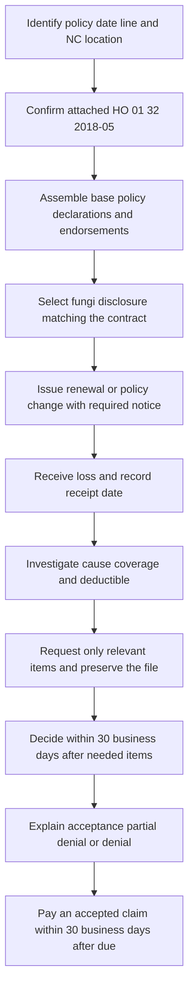

# North Carolina State Overlay

North Carolina requires the policy package to be read in layers. The **HO 01 32 North Carolina Amendatory Endorsement, edition 2018-05**, is contract language for an HO-3 policy when it is actually attached. **NCDOI-2018-03** regulates disclosure of a fungi, wet- or dry-rot, or bacteria limitation. **NCDOI-2021-06** regulates claim administration. Personal Lines Underwriting Manual **Rule 550** is internal carrier direction for eligibility, authority, referral, and documentation; it is not a customer-facing coverage term. ([HO 01 32 identity and scope](repo://forms/HO/NC/HO-01-32/2018-05.md#L1-L31), [NCDOI-2018-03 applicability](repo://bulletins/NC/ncdoi-2018-03-fungi-disclosure.md#L1-L29), [NCDOI-2021-06 applicability](repo://bulletins/NC/ncdoi-2021-06-claims-handling.md#L1-L25), [Manual authority boundary](repo://manuals/underwriting/manual.md#L13-L55))

A bulletin constrains issuance, disclosure, filing, and administration; it does not silently amend the policy. The form supplies the contractual limits, deductibles, notice provisions, duties, and deadlines. The form’s T.10 is the supported form-to-bulletin relationship: it expressly directs adjustment of a covered loss under **NCDOI-2021-06, B.2**, and requires deductible application to be consistent with that adjustment. Do not describe HO 01 32 as implementing NCDOI-2018-03; that bulletin remains a separate regulatory disclosure layer. ([HO 01 32 T.0 and T.1 T.10](repo://forms/HO/NC/HO-01-32/2018-05.md#L13-L31), [HO 01 32 deductible cross-reference](repo://forms/HO/NC/HO-01-32/2018-05.md#L59-L81), [NCDOI-2021-06 B.2](repo://bulletins/NC/ncdoi-2021-06-claims-handling.md#L49-L165))

*This flow separates policy assembly and disclosure from the claim investigation, decision, explanation, and payment sequence.*

## Authority, edition, and attachment control

Use HO 01 32 only when the issued policy identifies and attaches the 2018-05 endorsement. It is effective **2018-05-01**, applies to the HO-3 line, and changes only the provisions stated in the endorsement. A changed provision controls over a conflicting policy provision; provisions not changed remain in force, and the endorsement does not extend coverage beyond its express terms. ([HO 01 32 metadata](repo://forms/HO/NC/HO-01-32/2018-05.md#L1-L9), [HO 01 32 scope and precedence](repo://forms/HO/NC/HO-01-32/2018-05.md#L13-L57))

The two bulletins have separate effective positions in the source set: NCDOI-2018-03 is effective **2018-03-12** and addresses fungi-limit disclosure; NCDOI-2021-06 is effective **2021-06-01** and addresses claims handling. The 2018 bulletin applies prospectively to coverage issued, renewed, amended, or replaced on or after its effective date; the 2021 bulletin applies prospectively to claim-handling conduct after issuance. Check the policy transaction date, attached form, and bulletin position rather than blending their roles or using a later source to rewrite an earlier contract. ([NCDOI-2018-03 metadata and effective rule](repo://bulletins/NC/ncdoi-2018-03-fungi-disclosure.md#L1-L7), [NCDOI-2018-03 B.1.1-B.1.2](repo://bulletins/NC/ncdoi-2018-03-fungi-disclosure.md#L13-L29), [NCDOI-2021-06 metadata and effective rule](repo://bulletins/NC/ncdoi-2021-06-claims-handling.md#L1-L7), [NCDOI-2021-06 B.1.1-B.1.5](repo://bulletins/NC/ncdoi-2021-06-claims-handling.md#L13-L25))

## Fungi contract limit and required disclosure

### Contract result: separate from disclosure and write-back coverage

HO 01 32 states that the most the insurer will pay for **all loss caused by fungi, wet or dry rot, or bacteria is $5,000**, regardless of the number of insureds, claims, damaged properties, or occurrences. It also says loss caused by those conditions is not covered unless coverage is expressly provided. The form defines fungi to include mold, mildew, and mycotoxins, and defines wet rot as moisture-caused decomposition that includes damage from fungi. The $5,000 contract term is therefore a coverage limit and boundary, not a general grant of mold coverage. ([HO 01 32 fungi limit and boundary](repo://forms/HO/NC/HO-01-32/2018-05.md#L667-L687), [HO 01 32 amended definitions](repo://forms/HO/NC/HO-01-32/2018-05.md#L761-L823), [NCDOI-2018-03 required amount](repo://bulletins/NC/ncdoi-2018-03-fungi-disclosure.md#L59-L89), [NCDOI-2021-06 contract-preservation rule](repo://bulletins/NC/ncdoi-2021-06-claims-handling.md#L27-L41))

Keep this state fungi limit distinct from the fungi contract exclusion and from **HO 04 81 Limited Fungi, Wet or Dry Rot, or Bacteria Coverage**. HO 01 32 does not itself write back the base exclusion; it says coverage must be expressly provided. If HO 04 81 or another endorsement is attached, read that endorsement on its own terms and then reconcile the composed policy. Do not replace HO 04 81’s $10,000 aggregate with HO 01 32’s $5,000 term, and do not treat NCDOI-2018-03’s disclosure as coverage. ([HO 01 32 scope and fungi provisions](repo://forms/HO/NC/HO-01-32/2018-05.md#L13-L31), [HO 01 32 T.8-T.9](repo://forms/HO/NC/HO-01-32/2018-05.md#L667-L687), [NCDOI-2018-03 no-coverage-creation rule](repo://bulletins/NC/ncdoi-2018-03-fungi-disclosure.md#L181-L209), [NCDOI-2021-06 no-coverage-change rule](repo://bulletins/NC/ncdoi-2021-06-claims-handling.md#L27-L41))

### What the disclosure must do

An admitted insurer writing North Carolina property insurance must provide a clear disclosure when the policy contains a limitation applicable to fungi, wet or dry rot, or bacteria. The disclosure must be conspicuous, understandable to an ordinary insured, reasonably calculated to draw attention, and consistent with the policy, declarations, endorsements, and other coverage communications. It must identify the affected limitation and coverage, distinguish that limitation from other restrictions, and state: **“The most we will pay is $5,000 (five thousand dollars).”** The insurer may use a policy, application, endorsement, declarations, renewal material, or separate or electronic communication, but the material must be retainable and must not obscure or broaden the contract. ([HO 01 32 contract limit and precedence](repo://forms/HO/NC/HO-01-32/2018-05.md#L667-L687), [NCDOI-2018-03 B.1 and B.2.1-B.2.15](repo://bulletins/NC/ncdoi-2018-03-fungi-disclosure.md#L13-L89), [NCDOI-2021-06 notice consistency and policy boundary](repo://bulletins/NC/ncdoi-2021-06-claims-handling.md#L167-L209))

The disclosure must identify material conditions and exclusions affecting availability of fungi-related coverage, use terminology consistent with the policy, and accurately describe any relationship to water-related loss. It cannot create coverage, waive a condition, mischaracterize a limited provision as unlimited, or be contradicted by a declaration, endorsement, summary, marketing material, producer communication, or claim communication. If the policy or endorsement changes, revise the disclosure so the delivered version still matches the contract. ([HO 01 32 unchanged-terms and exclusion boundary](repo://forms/HO/NC/HO-01-32/2018-05.md#L21-L57), [NCDOI-2018-03 B.2.16-B.2.60](repo://bulletins/NC/ncdoi-2018-03-fungi-disclosure.md#L91-L179), [NCDOI-2021-06 B.3.1-B.3.13](repo://bulletins/NC/ncdoi-2021-06-claims-handling.md#L167-L191), [NCDOI-2021-06 B.3.34-B.3.38](repo://bulletins/NC/ncdoi-2021-06-claims-handling.md#L235-L243))

### When to deliver, retain, and file it

Provide the fungi disclosure before an applicant accepts new coverage and with the applicable coverage information. Provide it for new business, renewal business, replacement coverage, and an endorsement or policy change that adds or changes the limitation. At renewal, call out a material change from the prior policy. Do not condition delivery on a request, and do not rely on oral explanation alone. Electronic delivery is permitted when applicable law permits it and the insured can access and retain the material. ([HO 01 32 contract attachment and effective terms](repo://forms/HO/NC/HO-01-32/2018-05.md#L13-L31), [NCDOI-2018-03 B.3.1-B.3.23 and B.3.33](repo://bulletins/NC/ncdoi-2018-03-fungi-disclosure.md#L181-L247), [NCDOI-2021-06 B.3.1-B.3.3](repo://bulletins/NC/ncdoi-2021-06-claims-handling.md#L167-L181), [NCDOI-2021-06 B.3.31-B.3.36](repo://bulletins/NC/ncdoi-2021-06-claims-handling.md#L229-L239))

Retain the version delivered, evidence of the delivery method, and records showing that it matched the policy in effect. Producers, agents, third-party administrators, and system changes do not transfer responsibility away from the insurer. Before use, file the policy, endorsement, notice, and supporting materials with the Department as required by NCDOI-2018-03, identify the forms and lines to which the disclosure applies, and obtain approval; file revisions before use and withdraw superseded materials. ([HO 01 32 form version and policy control](repo://forms/HO/NC/HO-01-32/2018-05.md#L1-L9), [NCDOI-2018-03 records and delivery controls](repo://bulletins/NC/ncdoi-2018-03-fungi-disclosure.md#L91-L179), [NCDOI-2018-03 filing and approval controls](repo://bulletins/NC/ncdoi-2018-03-fungi-disclosure.md#L315-L347), [NCDOI-2021-06 records and delegated responsibility](repo://bulletins/NC/ncdoi-2021-06-claims-handling.md#L49-L61))

### Fungi claim handling

A fungi allegation or observation is not, by itself, a basis to deny or limit the claim. The insurer must review the reported facts, determine whether a covered cause produced the condition, distinguish damage caused by fungi from damage caused by another covered cause, identify the policy provision relied upon, and conduct a reasonable investigation before applying the limitation. A partial denial or limitation requires a clear written explanation of the factual and policy basis. ([HO 01 32 claim investigation and policy-boundary duties](repo://forms/HO/NC/HO-01-32/2018-05.md#L455-L555), [NCDOI-2018-03 fungi claims standards](repo://bulletins/NC/ncdoi-2018-03-fungi-disclosure.md#L259-L313), [NCDOI-2021-06 investigation and written-decision standards](repo://bulletins/NC/ncdoi-2021-06-claims-handling.md#L49-L81))

The claim file must preserve the policy provisions considered, material communications, requested information, investigation, evidence, valuation, and basis for the final determination. The insurer must respond clearly to reasonable requests, consider later material information, avoid unreasonable information demands or delay, and keep claims communications consistent with the disclosure and policy. These regulatory handling duties do not expand the $5,000 contract limit or turn the disclosure into a coverage grant. ([HO 01 32 claim records and reconsideration duties](repo://forms/HO/NC/HO-01-32/2018-05.md#L503-L555), [NCDOI-2018-03 B.4.8-B.4.27](repo://bulletins/NC/ncdoi-2018-03-fungi-disclosure.md#L275-L313), [NCDOI-2021-06 B.2.4-B.2.12](repo://bulletins/NC/ncdoi-2021-06-claims-handling.md#L57-L81), [NCDOI-2021-06 B.2.43-B.2.57](repo://bulletins/NC/ncdoi-2021-06-claims-handling.md#L135-L163))

## Windstorm, named-storm, and seacoast deductibles

### Windstorm and hail deductible

For a covered loss directly caused by windstorm or hail, HO 01 32 applies the **Windstorm and Hail Deductible** whether windstorm or hail acts alone or with another covered cause. The percentage must be at least **1%** and no more than **5%**. Apply it to the covered loss before calculating payment; it reduces the amount paid but does not create coverage for excluded or noncovered property. Related loss from the same general weather conditions is treated as one occurrence under the form. ([HO 01 32 T.1-T.9 and T.16-T.25](repo://forms/HO/NC/HO-01-32/2018-05.md#L59-L109), [NCDOI-2018-03 policy-consistency and deductible disclosure controls](repo://bulletins/NC/ncdoi-2018-03-fungi-disclosure.md#L25-L45), [NCDOI-2021-06 deductible and policy-application rules](repo://bulletins/NC/ncdoi-2021-06-claims-handling.md#L27-L41))

The insurer must investigate cause and extent, apply the deductible consistently with the claim adjustment, and request only reasonably relevant information. The insured must give prompt notice, protect property, preserve damaged property when reasonably possible, permit inspection, cooperate, and provide reasonably requested records, photographs, estimates, invoices, statements, and proof of loss. ([HO 01 32 windstorm claim duties](repo://forms/HO/NC/HO-01-32/2018-05.md#L79-L89), [HO 01 32 claims duties](repo://forms/HO/NC/HO-01-32/2018-05.md#L455-L555), [NCDOI-2018-03 claim investigation and records](repo://bulletins/NC/ncdoi-2018-03-fungi-disclosure.md#L259-L313), [NCDOI-2021-06 claims investigation and relevant requests](repo://bulletins/NC/ncdoi-2021-06-claims-handling.md#L63-L81))

### Change notice: 30 days and the date-of-loss rule

For an increase in the windstorm deductible, give the named insured **written notice at least 30 days before** the increase takes effect. The notice must identify the increase and effective date; the increased deductible applies only to a covered loss occurring on or after that date. Notice may be mailed, electronically delivered when legally permitted, included with other policy communications, or provided through an authorized representative. A reduction does not require this form’s advance notice. ([HO 01 32 deductible-change provision](repo://forms/HO/NC/HO-01-32/2018-05.md#L211-L277), [NCDOI-2018-03 notice consistency and delivery records](repo://bulletins/NC/ncdoi-2018-03-fungi-disclosure.md#L181-L257), [NCDOI-2021-06 written notice and delivery records](repo://bulletins/NC/ncdoi-2021-06-claims-handling.md#L167-L191))

Do not apply the increased deductible before the effective date or to another policy. Maintain the notice, delivery evidence, applicable deductible, policy address, and any corrected or withdrawn notice. The policyholder’s failure to update the address does not invalidate properly sent notice to the address in the insurer’s records, subject to applicable law. ([HO 01 32 T.2.3-T.2.15 and T.2.23-T.2.32](repo://forms/HO/NC/HO-01-32/2018-05.md#L215-L275), [NCDOI-2018-03 records and correction controls](repo://bulletins/NC/ncdoi-2018-03-fungi-disclosure.md#L91-L179), [NCDOI-2021-06 communication records and correction controls](repo://bulletins/NC/ncdoi-2021-06-claims-handling.md#L189-L243))

### Named Storm Period

The form’s **Named Storm Period** is the period during which a governmental Weather Authority has issued a watch or warning for a Named Storm affecting any part of North Carolina; it ends when that watch or warning is withdrawn or expires. The insurer must determine causation from the loss facts and may use weather records, reports, inspections, and other reliable evidence. Wind, rain, storm surge, flooding, or debris may be related, but the occurrence of one of those conditions or the timing of discovery does not itself prove Named Storm causation. ([HO 01 32 Named Storm Period definitions and causation](repo://forms/HO/NC/HO-01-32/2018-05.md#L279-L307), [NCDOI-2018-03 accurate coverage communication](repo://bulletins/NC/ncdoi-2018-03-fungi-disclosure.md#L19-L45), [NCDOI-2021-06 facts, policy, and investigation requirements](repo://bulletins/NC/ncdoi-2021-06-claims-handling.md#L27-L81))

A Named Storm Period does not create coverage. If a Named Storm Deductible applies, reduce the covered amount under its terms; do not apply it to unrelated damage merely because the damage occurred during the period. The insured must give prompt notice identifying the property and known circumstances, protect and preserve property, allow inspection, retain records and receipts, cooperate, and provide available weather, repair, and other cause evidence. ([HO 01 32 Named Storm deductible and insured duties](repo://forms/HO/NC/HO-01-32/2018-05.md#L287-L335), [NCDOI-2018-03 no-coverage and claim standards](repo://bulletins/NC/ncdoi-2018-03-fungi-disclosure.md#L259-L313), [NCDOI-2021-06 causation, investigation, and file standards](repo://bulletins/NC/ncdoi-2021-06-claims-handling.md#L245-L285))

### Seacoast Territory

For property in a designated **Seacoast Territory**, the form defines Windstorm to include wind, hail, and wind-driven rain, and defines Windstorm Loss as direct physical loss to covered property, including ensuing rain entering through an opening created by windstorm. The Windstorm Deductible applies separately from other deductibles and may not exceed **10% of the Coverage A limit**. The property location controls application; the deductible does not apply to a loss that is not Windstorm Loss and does not reduce the limit of liability. ([HO 01 32 Seacoast Territory and deductible terms](repo://forms/HO/NC/HO-01-32/2018-05.md#L557-L577), [NCDOI-2018-03 clear limitation and policy consistency](repo://bulletins/NC/ncdoi-2018-03-fungi-disclosure.md#L59-L89), [NCDOI-2021-06 contract deductible and limit rule](repo://bulletins/NC/ncdoi-2021-06-claims-handling.md#L27-L41))

For a seacoast windstorm claim, apply the location and declarations, establish covered Windstorm Loss first, then apply the deductible. The insured must promptly notify the insurer, protect property from weather exposure, preserve property when feasible, permit inspection, cooperate, provide records and documents, and submit to examination under oath or provide a signed statement when reasonably required. An appraisal, inspection, payment, or adjustment does not decide coverage, causation, or deductible applicability by itself. ([HO 01 32 Seacoast claim duties](repo://forms/HO/NC/HO-01-32/2018-05.md#L579-L623), [NCDOI-2018-03 fungi-claim investigation boundary](repo://bulletins/NC/ncdoi-2018-03-fungi-disclosure.md#L259-L313), [NCDOI-2021-06 investigation, explanation, and records](repo://bulletins/NC/ncdoi-2021-06-claims-handling.md#L245-L285))

## Cancellation and nonrenewal notices

HO 01 32 supplies these contractual minimums, subject to applicable law:

- **Cancellation for nonpayment of premium:** mail or deliver written notice at least **15 days before** cancellation takes effect and state the effective date.
- **Cancellation for another reason:** mail or deliver written notice at least **30 days before** cancellation takes effect and state the reason.
- **Nonrenewal:** mail or deliver written notice at least **45 days before the end of the policy period** and state when coverage ends.

The notice goes to the named insured shown in the Declarations or the address in the insurer’s records. Cancellation ends coverage before the policy period ends; nonrenewal does not. ([HO 01 32 cancellation and nonrenewal notice periods](repo://forms/HO/NC/HO-01-32/2018-05.md#L337-L369), [NCDOI-2018-03 written, clear policy communications](repo://bulletins/NC/ncdoi-2018-03-fungi-disclosure.md#L181-L257), [NCDOI-2021-06 claim-related communication and policy consistency](repo://bulletins/NC/ncdoi-2021-06-claims-handling.md#L167-L243))

The stated periods are form terms, not a substitute for checking North Carolina law or any later applicable authority. Keep cancellation and nonrenewal separate from the fungi disclosure and claim notices: delivery of a deductible-change or claim notice is not cancellation or nonrenewal, and a cancellation or nonrenewal notice does not itself alter a claim’s coverage terms. ([HO 01 32 T.2.16 and T.4](repo://forms/HO/NC/HO-01-32/2018-05.md#L241-L275), [NCDOI-2018-03 disclosure-notice boundary](repo://bulletins/NC/ncdoi-2018-03-fungi-disclosure.md#L181-L209), [NCDOI-2021-06 claim-notice boundary](repo://bulletins/NC/ncdoi-2021-06-claims-handling.md#L167-L209))

## Claims handling: duties, notices, and deadlines

### Insured duties and insurer investigation

The insured must give prompt loss notice with the information reasonably available; protect property from further damage; make reasonable protective repairs; retain damaged property until a reasonable inspection opportunity; permit inspection; cooperate; provide reasonably available photographs, recordings, estimates, invoices, receipts, records, authorizations, statements, and requested items; submit to examination under oath when reasonably requested; provide a requested signed or sworn proof of loss; forward legal process; and preserve information relevant to causation, coverage, amount, and recovery rights. ([HO 01 32 claims duties](repo://forms/HO/NC/HO-01-32/2018-05.md#L455-L555), [NCDOI-2018-03 fungi-specific duties](repo://bulletins/NC/ncdoi-2018-03-fungi-disclosure.md#L261-L313), [NCDOI-2021-06 reasonable requests and claim duties](repo://bulletins/NC/ncdoi-2021-06-claims-handling.md#L49-L81))

The insurer must handle claims in good faith, acknowledge communications, use qualified and supervised personnel, conduct a reasonable investigation before denial or refusal to pay, evaluate relevant and reliable information, identify the policy provisions relied upon, pay undisputed amounts when due, and give a clear written explanation for a denial, limitation, reservation, partial payment, or partial denial. Delegating work to an adjuster, administrator, vendor, producer, or other representative does not transfer the insurer’s responsibility. ([HO 01 32 claim administration and nonwaiver terms](repo://forms/HO/NC/HO-01-32/2018-05.md#L455-L555), [NCDOI-2018-03 B.4](repo://bulletins/NC/ncdoi-2018-03-fungi-disclosure.md#L259-L313), [NCDOI-2021-06 B.1-B.4](repo://bulletins/NC/ncdoi-2021-06-claims-handling.md#L13-L285))

### Numeric deadlines

The form and the 2021 claims bulletin establish this operational sequence:

1. **Acknowledgment:** acknowledge receipt of a claim within **30 days** after receipt and identify the claim or handling contact as required by the applicable communication.
2. **Decision:** after receiving the requested items needed to decide the claim, accept or reject it within **30 business days** and send the determination.
3. **Payment:** pay an accepted claim within **30 business days after payment becomes due**.
4. **Suit:** an action against the insurer must be brought within **3 years after the date of loss**, after compliance with the policy terms and subject to applicable law.

The 2021 bulletin also requires recording the claim-received date, reasonable investigation, clear written decision, and a claim file sufficient for Department review. Do not start the 30-business-day decision clock from the first notice when requested items needed for the determination have not yet been received, and do not use an information request to delay a decision when the necessary information is already available. ([HO 01 32 acknowledgment, decision, and payment deadlines](repo://forms/HO/NC/HO-01-32/2018-05.md#L455-L519), [HO 01 32 suit limitation](repo://forms/HO/NC/HO-01-32/2018-05.md#L625-L665), [NCDOI-2021-06 numeric claims standards](repo://bulletins/NC/ncdoi-2021-06-claims-handling.md#L245-L285), [NCDOI-2018-03 fungi claim investigation and records](repo://bulletins/NC/ncdoi-2018-03-fungi-disclosure.md#L259-L313))

### Claim notices, records, and later information

Claim-related notices must be written unless a lawful electronic method has been agreed to. They must be understandable, identify the insurer and a contact method, identify relied-on policy provisions and material facts, explain additional information requested, distinguish accepted and disputed portions, and state the basis for a denial, limitation, reservation, valuation, partial payment, or settlement. Preserve copies or reliable records showing the recipient, delivery method, date, substance, investigation, evaluation, payment, and decision. ([HO 01 32 written determination and record terms](repo://forms/HO/NC/HO-01-32/2018-05.md#L503-L555), [NCDOI-2018-03 written fungi explanations and records](repo://bulletins/NC/ncdoi-2018-03-fungi-disclosure.md#L271-L313), [NCDOI-2021-06 B.3 notice and disclosure requirements](repo://bulletins/NC/ncdoi-2021-06-claims-handling.md#L167-L243))

Consider material information submitted after an initial decision and reconsider the determination when the policy and facts support a different result. Do not represent a valuation or claim position as final when it remains subject to reasonable revision, do not request information unrelated to the claim, and do not withhold an undisputed amount solely because another portion remains under review. ([HO 01 32 reconsideration and payment terms](repo://forms/HO/NC/HO-01-32/2018-05.md#L511-L555), [NCDOI-2018-03 B.4.16-B.4.27](repo://bulletins/NC/ncdoi-2018-03-fungi-disclosure.md#L291-L313), [NCDOI-2021-06 B.2.11-B.2.17](repo://bulletins/NC/ncdoi-2021-06-claims-handling.md#L69-L81), [NCDOI-2021-06 B.3.15-B.3.31](repo://bulletins/NC/ncdoi-2021-06-claims-handling.md#L197-L231))

### Filing and oversight

The 2021 bulletin requires claims-handling procedures and, when the Department requires a filing, a description of the acknowledgment, investigation, evaluation, payment, and written-decision standards. Material procedure changes must be filed before use unless the Department directs otherwise. Maintain records showing that delegated personnel follow the procedures and that actual claim handling conforms to the bulletin and policy. ([HO 01 32 claim-record and representative provisions](repo://forms/HO/NC/HO-01-32/2018-05.md#L543-L555), [NCDOI-2018-03 filing and compliance records](repo://bulletins/NC/ncdoi-2018-03-fungi-disclosure.md#L315-L347), [NCDOI-2021-06 filing and effective-date controls](repo://bulletins/NC/ncdoi-2021-06-claims-handling.md#L287-L311))

## Internal underwriting controls: Rule 550

Rule 550 is an operational gate before binding or issuing, not a hidden coverage exclusion. The manual requires pre-bind application, delegated-authority review, referral when a rule applies, and documentation of the facts, authority, and disposition. It must not be disclosed as policy language or used to alter coverage. ([Manual Rules 100.A-100.H](repo://manuals/underwriting/manual.md#L13-L61), [Rule 550.A-550.CC](repo://manuals/underwriting/manual.md#L7531-L7855))

The North Carolina controls most relevant to this overlay include:

- **Authority and property:** refer Coverage A above **$700,000**; require a roof inspection before binding at roof age **18 years or more**; refer unresolved ownership, insurable-interest, occupancy, business, rental, short-term lodging, vacancy, construction, structural, water, moisture, and deterioration conditions. ([Rule 550.A-550.M](repo://manuals/underwriting/manual.md#L7531-L7583), [HO 01 32 scope and property terms](repo://forms/HO/NC/HO-01-32/2018-05.md#L13-L57), [NCDOI-2018-03 policy boundary](repo://bulletins/NC/ncdoi-2018-03-fungi-disclosure.md#L13-L57), [NCDOI-2021-06 policy boundary](repo://bulletins/NC/ncdoi-2021-06-claims-handling.md#L13-L41))
- **Loss and hazard history:** refer unrepaired fire, wind, hail, storm, flood, tidal-water, storm-surge, sewer, drain, sump, plumbing, electrical, heating, fuel-storage, environmental, and other material hazard conditions until cause, repair, mitigation, or present condition is evaluated. ([Rule 550.M-550.N and 550.P-550.BC](repo://manuals/underwriting/manual.md#L7581-L7591), [repo://manuals/underwriting/manual.md#L7593-L7751], [HO 01 32 causation and property boundaries](repo://forms/HO/NC/HO-01-32/2018-05.md#L279-L335), [NCDOI-2018-03 investigation boundary](repo://bulletins/NC/ncdoi-2018-03-fungi-disclosure.md#L259-L313), [NCDOI-2021-06 investigation boundary](repo://bulletins/NC/ncdoi-2021-06-claims-handling.md#L245-L285))
- **Fungi and deductible authority:** refer a request to change the fungi-and-bacteria aggregate; refer a requested treatment that would exceed the seacoast deductible ceiling; do not grant exceptions without authority. ([Rule 550.AL-550.AN and 550.BM](repo://manuals/underwriting/manual.md#L7681-L7691), [repo://manuals/underwriting/manual.md#L7789-L7791], [HO 01 32 fungi and seacoast terms](repo://forms/HO/NC/HO-01-32/2018-05.md#L667-L687), [repo://forms/HO/NC/HO-01-32/2018-05.md#L557-L577], [NCDOI-2018-03 disclosure amount and policy boundary](repo://bulletins/NC/ncdoi-2018-03-fungi-disclosure.md#L59-L89), [NCDOI-2021-06 contract-preservation rule](repo://bulletins/NC/ncdoi-2021-06-claims-handling.md#L27-L41))
- **Evidence and record quality:** verify conflicting or unusual applicant, producer, inspection, address, ownership, valuation, and coverage information; do not fill material gaps with assumptions; retain the facts reviewed, decision, and authority for every exception action. ([Rule 550.BN-550.CC](repo://manuals/underwriting/manual.md#L7793-L7855), [HO 01 32 record and cooperation terms](repo://forms/HO/NC/HO-01-32/2018-05.md#L455-L555), [NCDOI-2018-03 records and correction controls](repo://bulletins/NC/ncdoi-2018-03-fungi-disclosure.md#L91-L179), [NCDOI-2021-06 records and oversight](repo://bulletins/NC/ncdoi-2021-06-claims-handling.md#L135-L163))

These controls constrain whether and how the carrier may bind or administer a risk. They do not change the HO 01 32 $5,000 fungi term, the form’s deductible mechanics, the 30-day and 30-business-day claim deadlines, or any coverage determination. ([Rule 550.A-550.M](repo://manuals/underwriting/manual.md#L7531-L7583), [Rule 550.AL-550.AP](repo://manuals/underwriting/manual.md#L7681-L7699), [Rule 550.AR-550.BO](repo://manuals/underwriting/manual.md#L7705-L7799), [Rule 550.BP-550.CC](repo://manuals/underwriting/manual.md#L7801-L7855), [HO 01 32 contract boundaries](repo://forms/HO/NC/HO-01-32/2018-05.md#L13-L57), [NCDOI-2018-03 policy boundary](repo://bulletins/NC/ncdoi-2018-03-fungi-disclosure.md#L35-L57), [NCDOI-2021-06 policy boundary](repo://bulletins/NC/ncdoi-2021-06-claims-handling.md#L27-L41))

## Operational checklist and failure checks

Before issuing, renewing, changing, or adjusting a North Carolina HO-3 policy:

1. **Select the package:** confirm the policy-effective date, line, declarations, attached HO 01 32 edition, other endorsements, and applicable bulletin position. ([HO 01 32 metadata and scope](repo://forms/HO/NC/HO-01-32/2018-05.md#L1-L31), [NCDOI-2018-03 effective position](repo://bulletins/NC/ncdoi-2018-03-fungi-disclosure.md#L1-L29), [NCDOI-2021-06 effective position](repo://bulletins/NC/ncdoi-2021-06-claims-handling.md#L1-L25))
2. **Separate coverage from disclosure:** apply the contract’s $5,000 fungi maximum and express-coverage boundary; deliver a matching, conspicuous disclosure with the required amount. Do not substitute HO 04 81 or a bulletin for the attached contract. ([HO 01 32 fungi terms](repo://forms/HO/NC/HO-01-32/2018-05.md#L667-L687), [NCDOI-2018-03 disclosure requirements](repo://bulletins/NC/ncdoi-2018-03-fungi-disclosure.md#L59-L179), [NCDOI-2021-06 policy boundary](repo://bulletins/NC/ncdoi-2021-06-claims-handling.md#L167-L209))
3. **Test deductible application:** establish covered loss and direct cause first; use 1%-5% windstorm-and-hail terms, the Named Storm Period causation test, or the Seacoast Territory 10% Coverage A ceiling only when the form permits it. Apply an increased deductible only after the 30-day notice and effective date. ([HO 01 32 deductible terms](repo://forms/HO/NC/HO-01-32/2018-05.md#L59-L109), [HO 01 32 notice and seacoast terms](repo://forms/HO/NC/HO-01-32/2018-05.md#L211-L335), [NCDOI-2018-03 policy-consistency controls](repo://bulletins/NC/ncdoi-2018-03-fungi-disclosure.md#L25-L57), [NCDOI-2021-06 policy and deductible administration](repo://bulletins/NC/ncdoi-2021-06-claims-handling.md#L27-L41))
4. **Run notice controls:** calendar the 15-day nonpayment cancellation, 30-day other-cancellation, 45-day nonrenewal, and 30-day windstorm-deductible-increase periods. Preserve delivery evidence and policy-address data. ([HO 01 32 notice periods](repo://forms/HO/NC/HO-01-32/2018-05.md#L211-L277), [repo://forms/HO/NC/HO-01-32/2018-05.md#L337-L369], [NCDOI-2018-03 delivery and records](repo://bulletins/NC/ncdoi-2018-03-fungi-disclosure.md#L181-L257), [NCDOI-2021-06 delivery and records](repo://bulletins/NC/ncdoi-2021-06-claims-handling.md#L167-L243))
5. **Handle the claim:** record receipt, acknowledge within 30 days, investigate reasonably, request relevant items, decide within 30 business days after needed items arrive, explain the result in writing, pay an accepted claim within 30 business days after due, and preserve the file. Track the three-year suit limitation. ([HO 01 32 claims and suit deadlines](repo://forms/HO/NC/HO-01-32/2018-05.md#L455-L555), [repo://forms/HO/NC/HO-01-32/2018-05.md#L625-L665], [NCDOI-2018-03 claim standards](repo://bulletins/NC/ncdoi-2018-03-fungi-disclosure.md#L259-L313), [NCDOI-2021-06 numeric claims standards](repo://bulletins/NC/ncdoi-2021-06-claims-handling.md#L245-L312))
6. **Run Rule 550 separately:** complete referral and authority review before binding; verify material facts and retain the underwriting record. Never expose or apply an internal referral rule as though it were a coverage term. ([Manual Rules 100.A-100.E](repo://manuals/underwriting/manual.md#L13-L43), [Rule 550](repo://manuals/underwriting/manual.md#L7531-L7855), [HO 01 32 authority boundary](repo://forms/HO/NC/HO-01-32/2018-05.md#L13-L57), [NCDOI-2018-03 policy boundary](repo://bulletins/NC/ncdoi-2018-03-fungi-disclosure.md#L35-L57), [NCDOI-2021-06 policy boundary](repo://bulletins/NC/ncdoi-2021-06-claims-handling.md#L27-L41))

Common failures are using an unattached or wrong-edition form, treating the $5,000 disclosure as a coverage grant, importing HO 04 81’s limit into HO 01 32, applying a storm deductible merely because a storm occurred, applying an increased deductible before the notice effective date, missing the post-request claim deadline, denying fungi solely because it is observed, or using Rule 550 to alter coverage. ([HO 01 32 scope, deadlines, and claim controls](repo://forms/HO/NC/HO-01-32/2018-05.md#L13-L57), [HO 01 32 deductible and claim provisions](repo://forms/HO/NC/HO-01-32/2018-05.md#L211-L277), [HO 01 32 claims and suit provisions](repo://forms/HO/NC/HO-01-32/2018-05.md#L455-L665), [NCDOI-2018-03 disclosure and fungi claims](repo://bulletins/NC/ncdoi-2018-03-fungi-disclosure.md#L59-L89), [NCDOI-2018-03 claims standards](repo://bulletins/NC/ncdoi-2018-03-fungi-disclosure.md#L259-L313), [NCDOI-2021-06 claims deadlines and procedures](repo://bulletins/NC/ncdoi-2021-06-claims-handling.md#L245-L312), [Manual authority boundary](repo://manuals/underwriting/manual.md#L13-L55))

## Related pages

- [Fungi, wet rot, dry rot, and bacteria](/openwiki/coverage/perils/fungi-and-bacteria.md) — contract exclusion, limited write-back coverage, and the separate North Carolina disclosure boundary.
- [Water damage and related perils](/openwiki/coverage/perils/water-damage.md) — water cause, source, and exclusion analysis.
- [Policy assembly: editions, endorsements, and state overlays](/openwiki/policy-assembly/editions-and-state-attachments.md) — date-sensitive composition and authority layers.
- [Underwriting state exceptions](/openwiki/underwriting/manual/state-exceptions.md) — internal referral and documentation controls.
