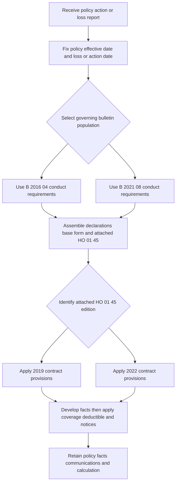

# Texas Overlay — Wind Deductibles, Named Storms, Notices, and Claims

## Scope: assemble three distinct controls

This overlay is a source map, not a coverage position. Start with the issued record for the event: Texas risk location; policy and loss or action date; loss-date Declarations; base form; every attached endorsement; and the exact **HO 01 45** edition. An attached Texas amendment is part of the contract only within its stated scope: it controls an actual conflict, leaves compatible and unmodified terms in force, and does not create coverage unless it says so. The 2019 amendment states the same targeted-change rule. [HO 01 45 (2022-01), T.0](repo://forms/HO/TX/HO-01-45/2022-01.md#L13-L57) [HO 01 45 (2019-01), T.0](repo://forms/HO/TX/HO-01-45/2019-01.md#L13-L57)

| Control | Governs | Does not independently decide |
| --- | --- | --- |
| **Attached HO 01 45 amendment** | The particular policy's deductible, named-storm period, notice, cancellation/nonrenewal, claim duties, and suit language. | A coverage grant, deductible, or edition not in the issued packet. |
| **Texas bulletins** | Insurer conduct: deductible disclosures, caps, implementation, investigation, communications, recordkeeping, and prompt-payment procedures. | A substitute for the loss-date policy wording or Declarations. |
| **Texas appetite guide and Underwriting Manual Rule 510** | Internal risk selection, authority, referral, documentation, and issuance controls. | Policy coverage, a claim exclusion, a deductible waiver, or permission to depart from applicable law or regulator requirements. |

The boundary is important: the Texas appetite guide expressly calls itself internal operating guidance and says that it is not part of the policy contract; it cannot expand, restrict, or change coverage. The manual's Texas state-exception rules control internal authority and risk handling, not the contract. [Texas Homeowners Appetite Guide, H.0](repo://guidelines/appetite/tx-homeowners.md#L13-L35) [Underwriting Manual, Rule 510](repo://manuals/underwriting/manual.md#L6227-L6245)

## Edition lifecycle: preserve both historic populations

**B-2021-08 supersedes B-2016-04 only for policies effective on or after August 19, 2021; the 2016 bulletin expressly remains in force for policies written under it.** It is therefore wrong to treat B-2021-08 as retroactively replacing either the earlier bulletin's regulatory requirements or a deductible in an older issued policy. Independently, HO 01 45 (2019-01) is superseded by the 2022-01 amendment for policies effective on or after January 1, 2022, while the 2019 edition remains live for its written policy population. [B-2016-04 status](repo://bulletins/TX/b-2016-04-windstorm-deductibles.md#L8-L9) [HO 01 45 (2019-01) status](repo://forms/HO/TX/HO-01-45/2019-01.md#L8-L10)

That means there are two related, but not interchangeable, selection exercises:

1. Select the bulletin that governs insurer conduct for the policy/action population.
2. Select the attached HO 01 45 edition and loss-date Declarations that govern the policy's deductible and claim terms.

For example, B-2016-04 says a wind/hail deductible must be at least 1% and caps a hurricane deductible at 3%; B-2021-08 retains a 1% named-storm floor, caps a hurricane deductible at 5%, and caps a seacoast windstorm deductible at 10%. Those are regulatory parameters, not a direction to overwrite the issued deductible. [B-2016-04, B.2](repo://bulletins/TX/b-2016-04-windstorm-deductibles.md#L65-L83) [B-2021-08, B.2](repo://bulletins/TX/b-2021-08-windstorm-deductibles.md#L51-L71)

*The selection flow keeps historic regulatory populations and the attached loss-date contract separate before a deductible or claim decision is made.*

## Wind and hail deductible: coverage and calculation come first

**HO 01 45 (2022-01), T.1 is the acting policy provision for an attached 2022 policy.** It applies the declared Windstorm and Hail Deductible only to a covered direct physical windstorm-or-hail loss, separately from other deductibles, before payment; it calculates the amount from the limit applicable when the loss occurs, and a later limit change cannot alter that loss's deductible. It applies to Coverage A and only to other coverages identified in the Declarations. The contract therefore requires the coverage/cause determination and loss-date policy snapshot before arithmetic. [HO 01 45 (2022-01), T.1](repo://forms/HO/TX/HO-01-45/2022-01.md#L59-L89) [HO 01 45 (2022-01), T.1](repo://forms/HO/TX/HO-01-45/2022-01.md#L137-L163)

The 2022 amendment's stated range is 1% to 10%. Its specific seacoast provision, **T.6.4**, implements B-2021-08's seacoast cap: it states that the maximum windstorm deductible in a seacoast territory is 10%, while B.2.5 prohibits the insurer from establishing a higher one. T.6 applies by damaged-property location at the time of loss and does not turn excluded loss into covered loss. Do not assume that a general 10% declaration value is valid for every deductible label or territory; identify the deductible label, property location, policy terms, and governing bulletin. [HO 01 45 (2022-01), T.6](repo://forms/HO/TX/HO-01-45/2022-01.md#L533-L547) [B-2021-08, B.2](repo://bulletins/TX/b-2021-08-windstorm-deductibles.md#L53-L65)

The older attached 2019 amendment is materially different. It defines windstorm (including wind-driven rain only where direct physical wind damage results), applies a 1%–5% windstorm-and-hail percentage, and expressly extends that deductible to building property, personal property, loss of use, debris removal, and reasonable emergency measures. It applies the deductible once as required for covered loss arising from the same occurrence, after determining covered loss and before payment. Preserve this wording rather than importing the 2022 Declaration-focused Coverage A rule. [HO 01 45 (2019-01), T.1](repo://forms/HO/TX/HO-01-45/2019-01.md#L59-L85) [HO 01 45 (2019-01), T.1](repo://forms/HO/TX/HO-01-45/2019-01.md#L101-L119)

For either edition, a weather report, a storm name, a report label, or a deductible percentage does not establish covered damage. The 2022 form requires a fact-based causation determination, allows continued investigation if cause cannot yet be determined, and limits the deductible to covered wind/hail loss; B-2021-08 likewise requires claim-specific support and forbids allocation to wind/hail solely from a general weather report. Develop and record the event, location, affected property, condition before loss, inspection evidence, weather data, estimates, and allocation of wind/hail damage from prior, excluded, or unrelated damage before calculating the deductible. [HO 01 45 (2022-01), T.1](repo://forms/HO/TX/HO-01-45/2022-01.md#L105-L131) [HO 01 45 (2022-01), T.1](repo://forms/HO/TX/HO-01-45/2022-01.md#L143-L161) [B-2021-08, B.4](repo://bulletins/TX/b-2021-08-windstorm-deductibles.md#L217-L251)

## Named storm period is a timing fact, not coverage

**HO 01 45 (2022-01), T.3.4 implements B-2021-08 B.3.22's 72-hour continuation requirement.** Under the attached 2022 amendment, the period starts with the official governmental-weather-authority Named Storm Designation and ends 72 hours after that designation ends. The insurer may use available weather information and the time and location of loss to decide whether the period applies. [HO 01 45 (2022-01), T.3](repo://forms/HO/TX/HO-01-45/2022-01.md#L217-L227) [B-2021-08, B.3](repo://bulletins/TX/b-2021-08-windstorm-deductibles.md#L175-L181)

The 2019 amendment follows the same basic start-plus-72-hours structure, but defines a Named Storm as one named by a governmental weather authority and says the period begins when the storm is designated. It applies its named-storm-period provisions to direct physical loss caused by the named storm, including associated wind, rain, water, or debris. Apply the edition actually attached. [HO 01 45 (2019-01), T.3](repo://forms/HO/TX/HO-01-45/2019-01.md#L237-L249)

In both editions, the designation and period neither create coverage nor establish causation: excluded loss remains excluded, and damage found during or after the period is not attributed to the storm merely from timing. Record the designation source, designation start/end, 72-hour calculation, property location, loss time, and evidence of cause separately. That separation matters if a policy has a named-storm deductible or a binding restriction, but it also prevents a named event from being used as a shortcut to a coverage conclusion. [HO 01 45 (2022-01), T.3](repo://forms/HO/TX/HO-01-45/2022-01.md#L247-L271) [B-2021-08, B.3](repo://bulletins/TX/b-2021-08-windstorm-deductibles.md#L175-L185)

## Deductible-change, cancellation, and nonrenewal notices

A deductible change is prospective. The 2022 amendment says the applicable deductible is determined by when the covered loss occurs—not by the report or payment date—and says oral/agent statements cannot change it without carrier written confirmation. The 2019 edition similarly limits a changed deductible to losses on or after its stated effective date and preserves the prior windstorm deductible until a properly noticed increase becomes effective. [HO 01 45 (2022-01), T.2](repo://forms/HO/TX/HO-01-45/2022-01.md#L169-L203) [HO 01 45 (2019-01), T.2](repo://forms/HO/TX/HO-01-45/2019-01.md#L171-L191)

**HO 01 45 (2019-01), T.2.2 implements B-2016-04 B.3.3's 30-day windstorm-deductible-increase notice requirement.** It requires written notice at least 30 days before the increase takes effect, and the bulletin imposes the same minimum advance period. The notice identifies the change, effective date, property, and coverage; retain the delivery method, address, date, policy/endorsement affected, and notice text. [HO 01 45 (2019-01), T.2](repo://forms/HO/TX/HO-01-45/2019-01.md#L169-L189) [B-2016-04, B.3](repo://bulletins/TX/b-2016-04-windstorm-deductibles.md#L149-L187)

The attached 2022 amendment is more demanding as contract text: T.2.4 requires written notice at least **45 days** before an increase in the windstorm deductible, whereas B-2021-08 B.3.12 requires at least **30 days**. Treat those as distinct sources, not competing values from which a handler may choose: for a policy carrying the 2022 form, calendar and satisfy the form's 45-day term as well as the applicable regulator requirement, and escalate an apparent conflict or missing notice. B-2021-08 also requires the disclosures at application, issue, and renewal and identifies content and record-retention duties for an increase notice. [HO 01 45 (2022-01), T.2](repo://forms/HO/TX/HO-01-45/2022-01.md#L169-L215) [B-2021-08, B.3](repo://bulletins/TX/b-2021-08-windstorm-deductibles.md#L153-L179) [B-2021-08, B.3](repo://bulletins/TX/b-2021-08-windstorm-deductibles.md#L189-L207)

Cancellation is not nonrenewal. Under both amendment editions, cancellation for nonpayment requires at least 10 days' written notice and other cancellation requires at least 30 days. For nonrenewal, the 2019 edition says at least 30 days before expiration, while the 2022 edition says at least 45 days and calls for a reason when law requires one. Both forms make the provisions subject to applicable law; the 2022 form also preserves claims for loss before cancellation or expiration. Thus, identify the exact form and applicable law before sending a notice, and do not let a cancellation/nonrenewal action end handling of a pre-termination loss. [HO 01 45 (2019-01), T.4](repo://forms/HO/TX/HO-01-45/2019-01.md#L285-L319) [HO 01 45 (2022-01), T.4](repo://forms/HO/TX/HO-01-45/2022-01.md#L275-L321) [HO 01 45 (2022-01), T.4](repo://forms/HO/TX/HO-01-45/2022-01.md#L363-L389)

## Claims: carrier clock, insured duties, and deductible record

**HO 01 45 (2022-01), T.5 is the acting policy provision for intake and insured post-loss duties.** It requires prompt claim notice, reasonable protection from further damage, retention and access for inspection where reasonably possible, cooperation, and a signed/sworn proof of loss if requested. It permits targeted requests for records, estimates, receipts, statements, examinations, property access, and evidence preservation. Investigation, information requests, and payments do not themselves waive policy rights or defenses. [HO 01 45 (2022-01), T.5](repo://forms/HO/TX/HO-01-45/2022-01.md#L391-L431) [HO 01 45 (2022-01), T.5](repo://forms/HO/TX/HO-01-45/2022-01.md#L445-L485) [HO 01 45 (2022-01), T.5](repo://forms/HO/TX/HO-01-45/2022-01.md#L519-L531)

Those policyholder duties are not the carrier's prompt-payment duties. The 2022 amendment calls for acknowledgment within 15 days after notice, a decision within 10 business days after all requested items, and payment within 5 business days after acceptance. B-2019-02 requires a file and receipt-date record, acknowledgment no later than 15 days after receipt, accept/reject within 15 business days after all reasonably requested items, and payment within 5 business days after acceptance. The different decision deadlines must be preserved and escalated as a compliance question; they are not permission to choose the longer clock. [HO 01 45 (2022-01), T.5](repo://forms/HO/TX/HO-01-45/2022-01.md#L399-L407) [B-2019-02, B.2](repo://bulletins/TX/b-2019-02-prompt-payment.md#L53-L71) [B-2019-02, B.4](repo://bulletins/TX/b-2019-02-prompt-payment.md#L217-L255)

The older attached amendment is also distinct: it specifies 15 days to acknowledge, 15 business days after requested items to accept/reject, and 5 business days after acceptance to pay. It allows a partial acceptance/rejection, requires a stated basis when it rejects, and does not require a release for an undisputed amount. [HO 01 45 (2019-01), T.5](repo://forms/HO/TX/HO-01-45/2019-01.md#L403-L431) [HO 01 45 (2019-01), T.5](repo://forms/HO/TX/HO-01-45/2019-01.md#L451-L473)

For wind/hail claims, the file should allow a reviewer to reconstruct: the applicable policy packet and deductible selection; location and seacoast status; named-storm designation/times if relevant; reported and observed cause, scope, and preexisting condition; inspections, weather material, estimates, and allocation; requested and received items; every material communication; deductible calculation; accepted, rejected, and undisputed portions; payment/payee; and any revised claim position. B-2021-08 requires the policy provision and factual basis for the deductible and a payment explanation that distinguishes a no-payment-within-deductible outcome from denial of coverage. B-2019-02 requires retention of material communications, requests, decisions, and payments in a reviewable claim file. [B-2021-08, B.4](repo://bulletins/TX/b-2021-08-windstorm-deductibles.md#L221-L255) [B-2019-02, B.2](repo://bulletins/TX/b-2019-02-prompt-payment.md#L109-L129)

The suit provision is a separate contract checkpoint, not a substitute for adjustment. The 2022 form makes compliance with applicable duties and conditions a condition precedent, states a two-year period after accrual, and preserves the carrier's defenses; apply its wording together with applicable law. The 2019 form likewise states two years after accrual and policy-duty compliance. [HO 01 45 (2022-01), T.7](repo://forms/HO/TX/HO-01-45/2022-01.md#L601-L637) [HO 01 45 (2019-01), T.7](repo://forms/HO/TX/HO-01-45/2019-01.md#L573-L609)

## Underwriting and operations: useful controls, firm boundary

The appetite guide can direct the carrier to verify wind/hail exposure, obtain a wind-mitigation inspection where Coverage A exceeds $500,000, keep roof/loss information, review the selected deductible across application, quote, and issued record, and refer weather-related binding changes during active weather restrictions. Rule 510 separately imposes internal Texas authority limits ($800,000 line-underwriter limit, $1,200,000 senior-underwriter ceiling), roof inspection at age 15 or higher, and seacoast deductible/territory documentation. These are operational gates for issuance and referral. They do not change the loss-date contract or excuse a regulatory requirement. [Texas Homeowners Appetite Guide, H.3](repo://guidelines/appetite/tx-homeowners.md#L275-L327) [Underwriting Manual, Rule 510](repo://manuals/underwriting/manual.md#L6227-L6257) [Underwriting Manual, Rule 510](repo://manuals/underwriting/manual.md#L6511-L6545)

A safe implementation keeps these records linked but not conflated: the selected deductible and supporting selection evidence; the policy/endorsement and Declarations issued; notice/disclosure version and delivery evidence; territory assignment; claim-event facts; and the claim calculation. B-2021-08 requires deductible selection to be reflected in the issued policy, controls for issuance/renewal/endorsement consistency, and testing/correction of systems that could apply a wrong deductible. [B-2021-08, B.2](repo://bulletins/TX/b-2021-08-windstorm-deductibles.md#L93-L123)

## Focused file and release checks

- **Edition and attachment:** Does the file identify the attached HO 01 45 edition and loss-date Declarations, rather than applying the newest form or bulletin by default?
- **Population:** Does it separately identify whether B-2016-04 or B-2021-08 governs the insurer action and retain the reason for that selection?
- **Deductible:** Has the file established covered cause and amount first; selected the declared deductible applicable to the loss date, coverage, location, and territory; then recorded the calculation without applying it twice?
- **Named storm:** Are official designation source, start/end, 72-hour continuation, property location, loss time, and causation evidence separately recorded?
- **Notice:** For a deductible change or cancellation/nonrenewal, are the edition-specific lead time, applicable-law requirements, content, policy/location, delivery method/date/address, and any correction or withdrawal retained?
- **Claim clock:** Are receipt, acknowledgment, each targeted request and response, decision, payment, undisputed portion, and communication dates diaried against both the contract and applicable Texas prompt-payment requirements?
- **Boundary and escalation:** Is each appetite/manual referral labelled as internal rather than contractual, and are missing attachment proof, a deadline conflict, deductible/territory mismatch, uncertain causation, or a material policy conflict referred before a final position?

For broader intake and record practice, see [Claims Guidance — Intake, Investigation, Duties, and Payment Handling](/openwiki/claims-guidance/claim-intake-investigation-and-documentation.md). For the governing-record method, see [Assembling the Governing Homeowners Policy](/openwiki/policy-assembly/assembling-the-governing-policy.md), and for roof settlement, see [Roof Loss Settlement and Actual Cash Value Schedules](/openwiki/coverages/coverage-a/roof-settlement.md).
