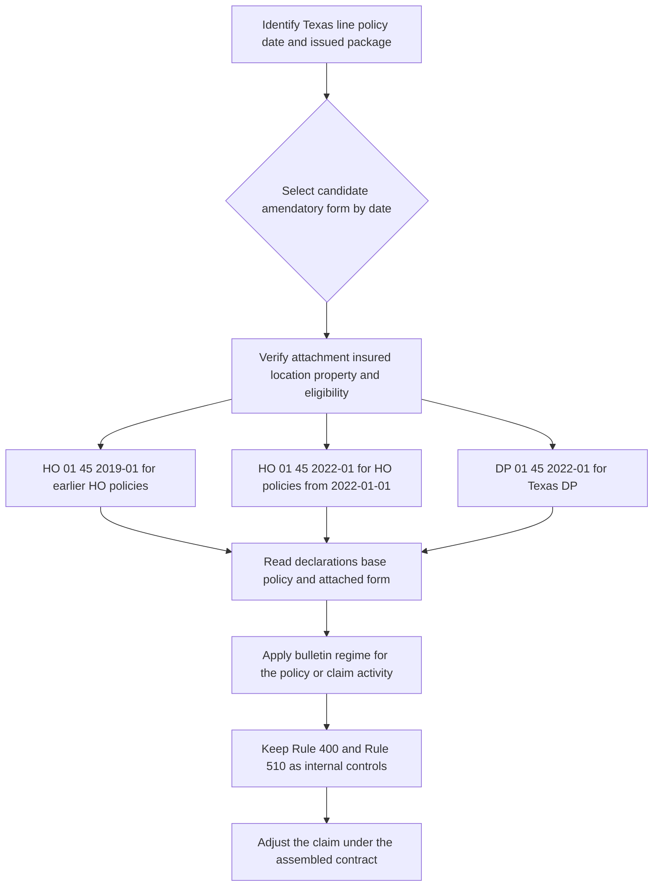

# Texas State Overlay

Texas policy handling has three separate authority layers:

- **Contract layer:** the attached Texas amendatory form changes the underlying policy only within its stated scope. A conflicting amendatory term controls, but the form does not create coverage unless it expressly does so; terms it does not change remain applicable ([HO 01 45 2022-01, T.0](repo://forms/HO/TX/HO-01-45/2022-01.md#L13-L57), [DP 01 45 2022-01, T.0](repo://forms/DP/TX/DP-01-45/2022-01.md#L13-L59)).
- **Regulatory layer:** Texas Department bulletins constrain how the carrier offers, discloses, files, and administers deductibles or claims. A bulletin does not authorize applying a deductible that the policy does not permit ([B-2021-08, B.1.3-B.1.6 and B.1.15](repo://bulletins/TX/b-2021-08-windstorm-deductibles.md#L19-L25), [B-2021-08, B.2.9-B.2.10](repo://bulletins/TX/b-2021-08-windstorm-deductibles.md#L63-L69)).
- **Internal underwriting layer:** Personal Lines Underwriting Manual Rule 510 is carrier direction for Texas acceptance, authority, referral, and file handling. The manual expressly says it is internal guidance and must not be used to alter coverage ([Manual Rules 100.B and 100.D](repo://manuals/underwriting/manual.md#L21-L37)). Its appetite thresholds and referral rules are not stated here as contractual or regulatory requirements; use the underwriting-guidance material separately.

## Edition and bulletin selection

Select the candidate form by line and policy-effective date, then verify that the edition is actually issued and attached to the named insured, Texas location, and covered property before using its contract terms. Read the declarations and base policy with the attached form. Do not replace an older form on an older policy with the newer text; a form title or requested schedule is not proof of attachment.

| Source | Effective/status | Position to use |
|---|---|---|
| **HO 01 45, 2019-01** | Effective 2019-01-01; superseded by the 2022-01 edition for policies effective on or after 2022-01-01. It remains in force for policies written under it ([metadata and supersession](repo://forms/HO/TX/HO-01-45/2019-01.md#L1-L10)). | Earlier HO contract: 1%–5% windstorm-and-hail deductible, 30-day increase notice, 72-hour named-storm continuation, and 15/15/5 claim clocks. |
| **HO 01 45, 2022-01** | Effective 2022-01-01 ([metadata](repo://forms/HO/TX/HO-01-45/2022-01.md#L1-L7)). | Later HO contract: 1%–10% windstorm-and-hail deductible, 45-day increase notice, 72-hour named-storm continuation, and 15/10/5 claim clocks. |
| **DP 01 45, 2022-01** | Effective 2022-01-01 ([metadata](repo://forms/DP/TX/DP-01-45/2022-01.md#L1-L7)). | DP contract: 1%–5% Windstorm or Hail Deductible, 30-day increase notice, 72-hour named-storm continuation, and 15/15/5 claim clocks. |
| **B-2016-04** | Effective 2016-08-19; superseded by B-2021-08 for policies effective on or after 2021-08-19, while remaining relevant to policies written under it ([metadata and supersession](repo://bulletins/TX/b-2016-04-windstorm-deductibles.md#L1-L9)). | Earlier regulatory windstorm-and-hail position. |
| **B-2019-02** | Effective 2019-02-11; its prompt-payment claims standards apply to claims received on or after that effective date ([metadata and B.4.20](repo://bulletins/TX/b-2019-02-prompt-payment.md#L1-L7), [B.4.20](repo://bulletins/TX/b-2019-02-prompt-payment.md#L247-L255)). | Prompt-payment regulatory position: 15-day acknowledgment, 15-business-day decision after requested items, and 5-business-day payment after acceptance. |
| **B-2021-08** | Effective 2021-08-19; later windstorm-and-hail regulatory position ([metadata and B.1.14](repo://bulletins/TX/b-2021-08-windstorm-deductibles.md#L1-L7), [B.1.14](repo://bulletins/TX/b-2021-08-windstorm-deductibles.md#L37-L45)). | Current windstorm-and-hail disclosure, filing, deductible, named-storm-disclosure, and claims-administration position in this source set. |

*This flow shows date-sensitive form selection, attachment verification, regulatory administration, and separate internal underwriting controls.*

## Attachment and Texas underwriting controls

### State-form attachment gate

A Texas amendatory form is contract authority only when it is part of the issued policy package. Before binding or renewal, Rule 400 requires review of every requested endorsement, confirmation that the risk facts support the requested coverage, matching to the named insured, location, and covered property, verification of current and complete underwriting information, and alignment of the effective date with the transaction. It also requires review of pending claims and correction of duplicate or unsupported attachments ([Manual Rules 400.A-400.G](repo://manuals/underwriting/manual.md#L5089-L5129), [Rule 400.Z-400.AC](repo://manuals/underwriting/manual.md#L5241-L5263)). The DP 01 45 endorsement says it is part of the agreement and applies only as stated in its terms; that contract language does not permit using a requested or mis-matched form as though it were attached ([DP 01 45 T.0](repo://forms/DP/TX/DP-01-45/2022-01.md#L13-L38), [DP 01 45 T.0](repo://forms/DP/TX/DP-01-45/2022-01.md#L89-L90)).

For the DP windstorm-or-hail deductible, DP 01 45 T.3 expressly directs administration as required by Texas Bulletin B-2021-08 B.2. That is the supported **implements** relationship for this source set: the form supplies the contractual deductible terms, while the bulletin supplies the regulatory requirements for the deductible’s offer and administration. Do not use the bulletin to invent a deductible absent from the issued form, or use an unattached DP form to change the policy ([DP 01 45 T.1-T.8](repo://forms/DP/TX/DP-01-45/2022-01.md#L92-L121), [B-2021-08 B.2.1-B.2.10](repo://bulletins/TX/b-2021-08-windstorm-deductibles.md#L47-L71)).

### Rule 510 internal controls

Rule 510 is carrier underwriting guidance, not Texas contract language or a claim-payment authority. Its principal Texas gates are:

- **Coverage A authority:** bind within line-underwriter authority through **$800,000**; refer amounts above $800,000 through **$1,200,000** to a senior underwriter; decline or refer amounts above **$1,200,000** ([510.1-510.3](repo://manuals/underwriting/manual.md#L6227-L6245)).
- **Pre-bind facts:** verify the Texas risk address, insurable interest, occupancy, and property description; refer conflicting ownership or occupancy information and undisclosed commercial activity ([510.6-510.12](repo://manuals/underwriting/manual.md#L6259-L6299)).
- **Water-backup and roof controls:** refer a requested water-backup limit above **$25,000**; obtain a roof inspection at or above **15 years**; verify roof material, condition, and visible defects; refer damage, active leakage, temporary repairs, or unresolved roof concerns ([510.4-510.5](repo://manuals/underwriting/manual.md#L6247-L6257), [510.19-510.21](repo://manuals/underwriting/manual.md#L6337-L6353)).
- **File control:** document the underwriting action, authority, referral, evidence, and disposition. Do not bind while a required referral or material property condition remains unresolved ([100.A, 100.C-100.E](repo://manuals/underwriting/manual.md#L15-L43), [510.22-510.30](repo://manuals/underwriting/manual.md#L6355-L6407)).

These controls constrain whether and how the carrier offers or attaches a Texas form; they do not change the deductible percentage, coverage trigger, claim deadline, or other term in the assembled contract.

### Separate internal Texas appetite controls

The Texas appetite guide is also internal operating direction, not a Texas requirement and not a policy term. Keep it separate from the overlay when quoting or referring a risk:

- **Eligibility range:** Coverage A must be **$150,000 through $1,200,000**, and the protection class must be **8 or lower** ([H.1.1-H.1.2](repo://guidelines/appetite/tx-homeowners.md#L59-L64)).
- **Roof:** obtain an inspection at **15 years or older**; do not bind at **25 years or older** ([H.2.5-H.2.6](repo://guidelines/appetite/tx-homeowners.md#L153-L166)).
- **Wind mitigation:** obtain a wind-mitigation inspection when Coverage A **exceeds $500,000** ([H.3.1-H.3.5](repo://guidelines/appetite/tx-homeowners.md#L275-L285)).
- **Water backup:** refer a requested limit **above $25,000** ([H.4.1-H.4.4](repo://guidelines/appetite/tx-homeowners.md#L367-L375)).
- **Loss history:** review the preceding **3 years** and refer when the reviewed history shows **2 paid property claims** ([H.5.1-H.5.5](repo://guidelines/appetite/tx-homeowners.md#L447-L459)).
- **Delegated authority:** routine line authority ends at **$800,000** Coverage A; senior authority extends to **$1,200,000**; amounts above that require decline or referral under Rule 510 ([H.7.1-H.7.5](repo://guidelines/appetite/tx-homeowners.md#L651-L661), [510.1-510.5](repo://manuals/underwriting/manual.md#L6227-L6257)).

None of these thresholds authorizes a deductible, creates coverage, or changes a form’s notice or claims deadline. A referral outcome also cannot be represented as changing policy terms unless the issued policy actually reflects that change.

### Separate internal claims-operation controls

The Claims Manual supplies workflow and authority controls for the carrier and its representatives. It requires acknowledgment within **15 days** and an internal accept-or-reject instruction within **30 days after requested items**; it also requires referral above **$25,000** evaluated amount, catastrophe referral above **$50,000** incurred exposure, and suspension of binding when forecast landfall is within **48 hours** ([12.4 and 12.18](repo://manuals/claims/manual.md#L3961-L4023), [1.V](repo://manuals/claims/manual.md#L139-L145), [7.R](repo://manuals/claims/manual.md#L2261-L2265), [13.D](repo://manuals/claims/manual.md#L4341-L4345)). The Texas appetite handling guidance separately requires reasonable mitigation within **7 days after discovery** of a covered loss condition ([H.6.5-H.6.7](repo://guidelines/appetite/tx-homeowners.md#L575-L585)). These are internal controls, not substitute contract or regulatory authority. In particular, the **30-day** manual disposition instruction cannot extend the shorter applicable contractual or regulatory deadline: diary and satisfy the assembled form and B-2019-02 deadline first.

## Contract comparison

| Requirement | HO 01 45 2019-01 | HO 01 45 2022-01 | DP 01 45 2022-01 |
|---|---|---|---|
| Windstorm or hail deductible | **1% minimum, 5% maximum**; applies to covered direct physical loss caused directly or indirectly by windstorm or hail, including concurrent causes; calculated from the deductible basis and subtracted before payment ([T.1-T.10](repo://forms/HO/TX/HO-01-45/2019-01.md#L59-L83)). | **1% minimum, 10% maximum**; shown in the Declarations, calculated from the applicable limit for the damaged property, and separate from other deductibles ([T.1-T.7](repo://forms/HO/TX/HO-01-45/2022-01.md#L59-L73)). | **1% minimum, 5% maximum**; shown in the Declarations, calculated from the applicable amount of insurance, and applied to the covered loss from the occurrence ([T.1-T.10](repo://forms/DP/TX/DP-01-45/2022-01.md#L61-L81)). |
| Increase notice | Written notice at least **30 days** before an increase in the windstorm deductible takes effect ([T.2-T.10](repo://forms/HO/TX/HO-01-45/2019-01.md#L169-L189)). | Written notice at least **45 days** before an increase in the windstorm deductible takes effect ([T.2-T.5](repo://forms/HO/TX/HO-01-45/2022-01.md#L167-L177)). | Notice at least **30 days** before an increase in the windstorm deductible takes effect ([T.1-T.7](repo://forms/DP/TX/DP-01-45/2022-01.md#L215-L229)). |
| Named Storm Period | Begins at designation and continues **72 hours after** designation ends; the period does not itself create coverage ([T.1-T.8](repo://forms/HO/TX/HO-01-45/2019-01.md#L237-L253)). | Begins when the Named Storm Designation begins and continues **72 hours after** it ends ([T.1-T.5](repo://forms/HO/TX/HO-01-45/2022-01.md#L217-L227)). | Begins when the official designation is assigned and continues **72 hours after** it ends ([T.1-T.4](repo://forms/DP/TX/DP-01-45/2022-01.md#L281-L289)). |
| Claim acknowledgment | Within **15 days**; accept or reject within **15 business days** after all requested items; pay an accepted claim within **5 business days** after acceptance notice ([T.5](repo://forms/HO/TX/HO-01-45/2019-01.md#L403-L417)). | Within **15 days**; accept or reject within **10 business days** after all requested items; pay an accepted claim within **5 business days** after acceptance notice ([T.5-T.8](repo://forms/HO/TX/HO-01-45/2022-01.md#L391-L407)). | Within **15 days**; accept or reject within **15 business days** after requested items; pay an accepted claim within **5 business days** after acceptance notice ([T.4, T.36, T.46](repo://forms/DP/TX/DP-01-45/2022-01.md#L495-L507), [repo://forms/DP/TX/DP-01-45/2022-01.md#L563-L589)). |
| Cancellation and nonrenewal | Nonpayment cancellation: **10 days**; other permitted cancellation: **30 days**; nonrenewal: **45 days** before expiration ([T.4-T.12](repo://forms/HO/TX/HO-01-45/2019-01.md#L285-L309)). | Nonpayment cancellation: **10 days**; other permitted cancellation: **30 days**; nonrenewal: **30 days** before expiration ([T.4-T.12](repo://forms/HO/TX/HO-01-45/2022-01.md#L275-L309)). | Nonpayment cancellation: **10 days**; other permitted cancellation: **30 days**; nonrenewal: **30 days** before effective nonrenewal ([T.4-T.7 and T.60](repo://forms/DP/TX/DP-01-45/2022-01.md#L331-L345), [T.60-T.61](repo://forms/DP/TX/DP-01-45/2022-01.md#L449-L455)). |
| Suit deadline | **2 years after accrual** of the cause of action ([T.1-T.3](repo://forms/HO/TX/HO-01-45/2019-01.md#L573-L591)). | **2 years after accrual** of the cause of action ([T.1-T.3](repo://forms/HO/TX/HO-01-45/2022-01.md#L601-L613)). | **2 years after accrual** of the cause of action ([T.1-T.3](repo://forms/DP/TX/DP-01-45/2022-01.md#L687-L699)). |

The HO editions must not be blended: the 2022 form raises the contractual windstorm-and-hail maximum from 5% to 10%, lengthens deductible-increase notice from 30 to 45 days, shortens the claim-decision clock from 15 to 10 business days, and changes nonrenewal notice from 45 to 30 days. DP 01 45 is a separate contract with its own 5% maximum and 30-day deductible-increase notice.

## HO 01 45 — 2019-01 contract

For the superseded HO edition, the Windstorm and Hail Deductible applies to covered direct physical loss caused directly or indirectly by windstorm or hail, whether either peril acts alone or with another cause. It applies to building, personal-property, loss-of-use, debris-removal, and covered emergency-measure loss when the underlying coverage applies. The deductible is calculated from the form’s deductible basis and applied before payment; a covered loss at or below the deductible produces no payment, while a larger loss is reduced by the deductible ([T.1-T.15 and T.21-T.30](repo://forms/HO/TX/HO-01-45/2019-01.md#L59-L119)). The deductible does not turn excluded loss, pre-existing damage, wear, deterioration, or faulty maintenance into covered loss ([T.39-T.54](repo://forms/HO/TX/HO-01-45/2019-01.md#L137-L167)).

The 2019 form requires prompt loss notice, cooperation, access to damaged property, preservation of property and evidence, records supporting ownership, value, repair, and other insurance, and examination under oath or a signed statement when requested. It also requires forwarding legal papers and preserving recovery rights ([T.16-T.20](repo://forms/HO/TX/HO-01-45/2019-01.md#L89-L99), [claims duties](repo://forms/HO/TX/HO-01-45/2019-01.md#L403-L451)). A proof of loss may be requested, but this form does not state a separate numeric period for the insured to submit it; the insured must return requested information within a reasonable time and request more time promptly when needed ([T.14-T.15](repo://forms/HO/TX/HO-01-45/2019-01.md#L429-L435)).

Its Named Storm Period begins when a governmental weather authority designates the storm and ends 72 hours after designation ends. The insurer determines timing from the facts, and the designation does not itself establish coverage or causation. Damage pre-dating the period is not converted into named-storm damage merely because it is discovered during the period ([T.1-T.8 and T.15-T.18](repo://forms/HO/TX/HO-01-45/2019-01.md#L237-L273)).

## HO 01 45 — 2022-01 contract

The 2022 HO form applies its Declarations-listed Windstorm and Hail Deductible to covered direct physical loss caused by windstorm or hail. The selected percentage must be 1%–10%; the deductible is based on the applicable limit of liability for the damaged property, applies before payment, and is separate from other deductibles. Wind-driven rain through a wind-created opening, wind-driven material, falling objects driven by wind or hail, and hail impact remain subject to the policy’s coverage terms; the deductible does not decide whether the underlying cause is covered ([T.1-T.23](repo://forms/HO/TX/HO-01-45/2022-01.md#L59-L105)).

The form’s deductible-change notice is broader than the earlier edition’s: it covers a deductible increase, decrease, addition, removal, or replacement, while requiring at least 45 days’ written notice before an increase in the windstorm deductible. Notice must describe the change and coverage, state the effective date, and may be mailed or electronically delivered when law permits. The changed deductible applies by the date of loss, not the claim-report or payment date, and the pre-change deductible remains applicable to an earlier loss ([T.1-T.13](repo://forms/HO/TX/HO-01-45/2022-01.md#L167-L199)).

The Named Storm Period begins with the governmental designation and continues 72 hours after it ends. The insurer may use weather and location information to determine timing; a designation does not establish coverage, and other policy exclusions and conditions remain in force ([T.1-T.18](repo://forms/HO/TX/HO-01-45/2022-01.md#L217-L253)). The insured must promptly report the loss, preserve property and evidence, protect against further damage, allow inspection, and provide records, truthful statements, and requested cooperation ([T.8-T.28](repo://forms/HO/TX/HO-01-45/2022-01.md#L233-L273)).

For claims, the 2022 HO form requires prompt notice, preservation and inspection, requested records and proof of loss, cooperation, and truthful information. It acknowledges within 15 days, decides within 10 business days after receiving requested items, and pays an accepted claim within 5 business days after acceptance notice. It may accept or reject portions separately and may pay undisputed amounts while other matters remain under review ([T.1-T.15](repo://forms/HO/TX/HO-01-45/2022-01.md#L391-L429), [T.24-T.35](repo://forms/HO/TX/HO-01-45/2022-01.md#L449-L473)).

## DP 01 45 — 2022-01 contract

DP 01 45 applies a Declarations-listed Windstorm or Hail Deductible of 1%–5% to covered direct physical loss caused by windstorm or hail. It is separate from another-peril deductible, is calculated from the applicable amount of insurance for the covered property, and is applied after coverage and valuation terms determine the covered amount but before payment. The form applies it to the covered loss from an occurrence and does not duplicate it merely because several items or coverages are damaged ([T.1-T.17 and T.23-T.26](repo://forms/DP/TX/DP-01-45/2022-01.md#L61-L95), [T.41-T.50](repo://forms/DP/TX/DP-01-45/2022-01.md#L143-L161)).

The DP form requires at least 30 days’ written notice before an increase in the windstorm deductible. Notice identifies the change, effective date, property, and coverage; it may be mailed or electronically delivered when permitted, and the deductible in effect on the date of loss controls rather than the date of report or payment ([T.1-T.13](repo://forms/DP/TX/DP-01-45/2022-01.md#L215-L245)).

Its Named Storm Period begins when the official weather authority assigns the designation and continues for 72 hours after that designation ends. The insurer determines applicability from reliable authority information and loss timing; a named-storm period does not create coverage, and damage that begins during the period remains subject to it even if the period later ends ([T.1-T.9](repo://forms/DP/TX/DP-01-45/2022-01.md#L281-L299)). The insured must promptly report named-storm damage, protect property, preserve damaged property and repair evidence, allow inspection, and provide timing and weather information ([T.13-T.24](repo://forms/DP/TX/DP-01-45/2022-01.md#L305-L329)).

DP claims handling requires prompt notice, preservation and access, requested records, proof of loss when reasonably necessary, truthful cooperation, and examination under oath when requested. The insurer acknowledges within 15 days, decides within 15 business days after requested items, and pays an accepted claim within 5 business days after acceptance. The insurer may accept or reject portions separately, explain a rejection, pay an accepted portion, and reopen when material new information arrives ([T.1-T.16](repo://forms/DP/TX/DP-01-45/2022-01.md#L495-L527), [T.31-T.38](repo://forms/DP/TX/DP-01-45/2022-01.md#L557-L575), [T.44-T.52](repo://forms/DP/TX/DP-01-45/2022-01.md#L583-L601)).

## Texas windstorm-deductible bulletins

### B-2016-04 — superseded windstorm-and-hail position

B-2016-04 applied to admitted insurers issuing, delivering, or renewing Texas property policies with windstorm or hail coverage and a separate windstorm-and-hail deductible. It required the deductible to be clearly described, distinguishable from other deductibles, consistent across declarations and endorsements, and disclosed before the policyholder was bound and at issuance or renewal ([B.1.1-B.1.9](repo://bulletins/TX/b-2016-04-windstorm-deductibles.md#L13-L33), [B.2.1-B.2.14](repo://bulletins/TX/b-2016-04-windstorm-deductibles.md#L59-L87)).

Its regulatory limits were a **1% minimum** for a windstorm-and-hail deductible and a **3% maximum** for a hurricane deductible, each stated against applicable insured value. It required the trigger, calculation basis, affected property, occurrence basis, and relationship to other deductibles to be disclosed, and prohibited duplicative application to the same covered loss ([B.2.3-B.2.12](repo://bulletins/TX/b-2016-04-windstorm-deductibles.md#L63-L83)). It required at least **30 days’ notice** before an increase in a windstorm deductible, with a clear written disclosure of the new deductible and its effect ([B.3.1-B.3.8](repo://bulletins/TX/b-2016-04-windstorm-deductibles.md#L147-L167)).

The bulletin’s claims standards required cause-of-loss investigation, application of the deductible stated in the policy, a clear explanation, supporting claim records, and no delay of an undisputed portion merely because deductible applicability was disputed ([B.4.1-B.4.20](repo://bulletins/TX/b-2016-04-windstorm-deductibles.md#L205-L245)). The cited 2016 bulletin provisions do not supply a fixed named-storm duration or a separate numeric prompt-payment clock; do not import the later 72-hour form period or B-2019-02 deadlines into the earlier bulletin position.

### B-2021-08 — later windstorm-and-hail position

B-2021-08 requires separate windstorm and hail deductibles to be identified in the policy and related communications, tied to stated loss conditions, and administered according to the policy in force. Its limits are a **1% minimum for a named-storm windstorm-and-hail deductible**, a **5% maximum for a hurricane deductible**, and a **10% maximum for a windstorm deductible in a seacoast territory**. These are regulatory categories and must not be collapsed into the contractual maximum in a particular HO or DP form ([B.1.1-B.1.7](repo://bulletins/TX/b-2021-08-windstorm-deductibles.md#L13-L29), [B.2.1-B.2.6](repo://bulletins/TX/b-2021-08-windstorm-deductibles.md#L47-L59)).

The bulletin requires disclosure of the applicable peril, trigger, calculation basis, relationship to other deductibles, and any endorsement changing the deductible. Disclosure is required at application, with issuance, and with renewal; a windstorm-deductible increase requires at least **30 days’ written notice**, identifying the post-change deductible and giving the policyholder an opportunity to review it ([B.3.1-B.3.18](repo://bulletins/TX/b-2021-08-windstorm-deductibles.md#L135-L171)). If the policy uses a named-storm period, the disclosure must state when it begins and that it continues **72 hours after** the named-storm designation ends; the insurer may not apply that deductible outside the stated period ([B.3.20-B.3.23](repo://bulletins/TX/b-2021-08-windstorm-deductibles.md#L173-L181)).

For a windstorm or hail claim, B-2021-08 requires prompt, good-faith investigation; claim-specific causation evidence rather than a general weather report alone; allocation of mixed-peril damage when reasonably possible; identification of the relied-on policy provision; a clear explanation of the deductible and payment; preservation of inspection, estimate, communication, and payment records; and review when material new information arrives ([B.4.1-B.4.18](repo://bulletins/TX/b-2021-08-windstorm-deductibles.md#L213-L247), [B.4.19-B.4.27](repo://bulletins/TX/b-2021-08-windstorm-deductibles.md#L247-L267)). B-2021-08 does not replace the form-specific numeric claim deadlines; use the attached form for those clocks.

## B-2019-02 — prompt-payment bulletin

B-2019-02 is distinct from the windstorm-deductible bulletins. It applies to admitted insurers and to claim-handling activity performed by employees, adjusters, managing general agents, third-party administrators, vendors, or other representatives; delegation does not transfer the insurer’s responsibility ([B.1.1-B.1.5](repo://bulletins/TX/b-2019-02-prompt-payment.md#L13-L23), [B.2.28-B.2.30](repo://bulletins/TX/b-2019-02-prompt-payment.md#L105-L111)). The insurer must create a claim file on notice, record the receipt date, request only reasonably necessary information, investigate before denial, explain acceptance or rejection, and pay undisputed amounts without conditioning them on unrelated disputes ([B.2.1-B.2.24](repo://bulletins/TX/b-2019-02-prompt-payment.md#L51-L101)).

The bulletin’s numeric deadlines are:

- **Acknowledgment:** no later than **15 days after receipt** of the claim ([B.4.2-B.4.3](repo://bulletins/TX/b-2019-02-prompt-payment.md#L215-L225)).
- **Decision:** accept or reject within **15 business days after receiving all items reasonably requested** ([B.4.6-B.4.10](repo://bulletins/TX/b-2019-02-prompt-payment.md#L225-L235)).
- **Payment:** pay an accepted claim within **5 business days after acceptance** ([B.4.11-B.4.15](repo://bulletins/TX/b-2019-02-prompt-payment.md#L235-L245)).

The insurer must provide written acceptance or rejection information, distinguish accepted and rejected portions, avoid repeated requests for already supplied information, preserve material communications and payment records, and remain responsible when claim functions are delegated ([B.4.8-B.4.20](repo://bulletins/TX/b-2019-02-prompt-payment.md#L231-L255)). B-2019-02 therefore supplies a regulatory prompt-payment baseline; the applicable HO or DP form may state the same or a different decision deadline for the assembled contract, so record which authority and form govern the claim.

## Operational checklist and failure checks

1. Identify the Texas line, policy-effective date, declarations, issued package, attached amendatory form, and applicable bulletin regime. Verify the form matches the named insured, location, and property before relying on it. Preserve the 2019 HO and 2016 bulletin positions for policies written under them.
2. For a deductible claim, establish covered direct physical loss, cause, mixed-cause allocation, applicable percentage and limit basis, occurrence, and whether the policy’s named-storm period applies. A storm name or general weather report alone is not enough ([HO 01 45 2022-01, T.23](repo://forms/HO/TX/HO-01-45/2022-01.md#L103-L107), [B-2021-08, B.4.5-B.4.7](repo://bulletins/TX/b-2021-08-windstorm-deductibles.md#L221-L227)).
3. Apply the contractual deductible only after determining the covered amount and under the form edition in force at loss. Then explain the percentage, basis, covered amount, deductible, remaining payment, and any other applicable limit or deductible ([DP 01 45 2022-01, T.13-T.14 and T.48-T.50](repo://forms/DP/TX/DP-01-45/2022-01.md#L85-L89), [repo://forms/DP/TX/DP-01-45/2022-01.md#L155-L161)).
4. Meet the form’s insured duties: prompt notice, mitigation, preservation, inspection access, records, proof of loss when requested, truthful cooperation, and examination under oath when required. Track the form-specific acknowledgment, decision, payment, cancellation, nonrenewal, and suit deadlines.
5. Keep bulletin disclosures, filing records, notices, claim communications, causation evidence, estimates, and payment explanations. Do not use a bulletin or Rule 510 as a substitute for the attached contract.
6. Run Rule 400 attachment review and Rule 510 separately before quoting, binding, or renewing. Their matching, authority, eligibility, and referral controls belong to internal underwriting guidance, not to this regulatory and contractual overlay; do not use them to alter an issued form.

Common errors are applying the 2022 HO maximum or 45-day notice to a 2019 HO policy, applying the DP 5% maximum to the HO 2022 contract, using the B-2021-08 30-day regulatory notice in place of a form’s longer contractual period, treating a named-storm designation as proof of coverage or causation, or presenting Rule 510 underwriting controls as policy or Texas Department requirements.
