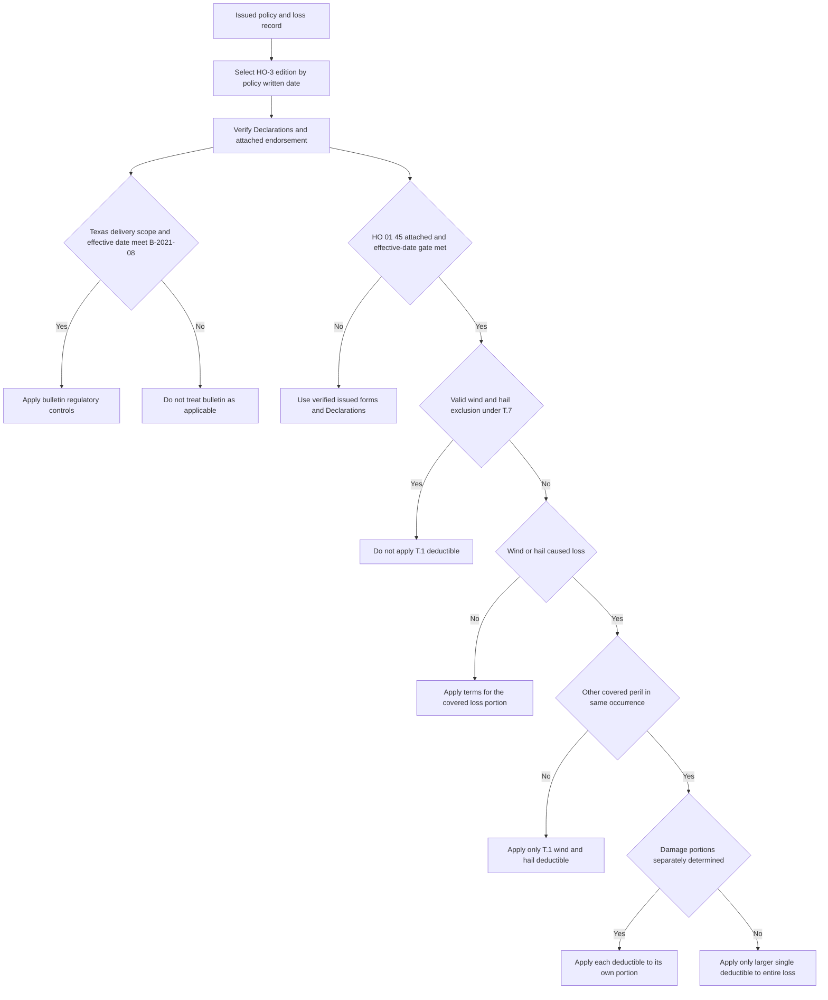

## Scope and authority boundary

This overlay concerns separate windstorm and hail deductibles on Texas residential property policies. It is a source-navigation and control reference for this synthetic corpus, not a substitute for the issued policy or legal advice. The corpus treats forms and regulatory bulletins as frozen authority and internal guidelines as living carrier guidance; the source language is invented for the corpus. [Corpus status and authority model](repo://README.md#L3-L9) · [Frozen authority and living guidance](repo://README.md#L28-L36)

Three layers answer different questions and must not be collapsed:

| Layer | Role | What it does not establish |
| --- | --- | --- |
| **Texas Department of Insurance Bulletin B-2021-08** | Regulatory requirements for deductible amount, disclosure, application, named-storm terms, and filing. | That a particular policy has an amendatory endorsement attached or that a particular deductible is in its Declarations. |
| **HO 01 45, edition 2022-01** | Texas contract amendment that attaches to HO-3, specifies its effective-date scope, and governs a conflict with the attached base form. | Coverage or a deductible unless the endorsement is actually attached and its stated conditions are met. |
| **Texas Homeowners Appetite Guide and Referral Matrix** | Internal intake, binding, referral, and documentation controls. | Policy language, a coverage determination, or a rule that may be quoted to an insured or claimant. |

The guide expressly labels itself internal and not part of the policy contract. It also says that the Texas windstorm deductible is governed by the state amendment and Texas Department of Insurance requirements, not by the guide. The cross-state referral matrix confirms that state-specific appetite can tighten authority but cannot broaden it, and that a referral cannot approve a state filing or bulletin violation. [Texas Homeowners Appetite Guide, status and G.4](repo://guidelines/appetite/tx-homeowners.md#L1-L5) [Texas Homeowners Appetite Guide, G.4](repo://guidelines/appetite/tx-homeowners.md#L31-L35) · [Underwriting Referral and Authority Matrix, R.1 and R.4](repo://guidelines/authority/referral-matrix.md#L1-L11) [Underwriting Referral and Authority Matrix, R.4](repo://guidelines/authority/referral-matrix.md#L33-L40)

### Separate effective-date gates

B-2021-08 applies to residential property policies **delivered or issued for delivery in Texas** with an effective date on or after **2022-01-01**; it superseded B-2016-04. HO 01 45 is effective for policies with an effective date on or after **2022-01-01**, attaches to HO-3, and says it governs where it conflicts with that form. Both gates must be recorded, but the bulletin's applicability does not itself attach HO 01 45. Conversely, an issued endorsement must be verified in the policy record before its contract terms are used. [B-2021-08, applicability and purpose](repo://bulletins/TX/2021-08-windstorm-deductible.md#L1-L7) · [HO 01 45, introductory provision](repo://forms/HO/TX/HO-01-45/2022-01.md#L1-L4)

The base HO-3 2018-09 has a different selection trigger: it applies to policies written on or after 2018-09-01. Its Section I S.5 says that the Declarations deductible applies to each loss, recognizes a separate windstorm/hail deductible required by a state amendment, and otherwise says only the larger applies where both apply. HO 01 45 T.1 expressly amends S.5, so the attached Texas amendment controls that conflict. Do not import either 2018 S.5 or HO 01 45 onto an unverified older or incompatible base form. [HO-3 2018-09, applicability](repo://forms/HO/MS/HO-3/2018-09.md#L1-L4) · [HO-3 2018-09, S.5](repo://forms/HO/MS/HO-3/2018-09.md#L101-L112) · [HO 01 45, conflict rule and T.1](repo://forms/HO/TX/HO-01-45/2022-01.md#L1-L11)

*This claim-routing flow keeps the written-date HO-3 selection, the bulletin's delivery/effective-date scope, and HO 01 45's attachment/effective-date gate separate. It then applies the T.7 exclusion check and T.1 wind/hail and mixed-peril rules; it does not decide whether damage is covered.* [HO-3 edition applicability](repo://forms/HO/MS/HO-3/2011-05.md#L3-L7) · [HO-3 2018-09, applicability](repo://forms/HO/MS/HO-3/2018-09.md#L1-L4) · [B-2021-08, applicability](repo://bulletins/TX/2021-08-windstorm-deductible.md#L1-L7) · [HO 01 45, introductory provision and T.1](repo://forms/HO/TX/HO-01-45/2022-01.md#L1-L11) · [HO 01 45, T.7](repo://forms/HO/TX/HO-01-45/2022-01.md#L33-L37)

## Regulatory deductible configuration and disclosure

### Amount, basis, and filing

Under B.2, an insurer may use a separate windstorm/hail deductible expressed as a percentage of the Coverage A limit. The permitted range is **1% through 5%**; in B.6 seacoast territories, the ceiling is **10%**. B.2 also permits a flat-dollar windstorm/hail deductible, but it cannot be less than the policy's all-other-perils deductible. B.7 requires the insurer to file the applicable amendatory endorsement and rate rule and prohibits application of the deductible before the filing is approved or deemed approved. These are regulatory configuration limits, not values to fabricate when the issued Declarations are unavailable. [B-2021-08, B.2](repo://bulletins/TX/2021-08-windstorm-deductible.md#L9-L13) · [B-2021-08, B.6-B.7](repo://bulletins/TX/2021-08-windstorm-deductible.md#L31-L37)

HO 01 45 T.1 is narrower contract wording: it provides a separate deductible stated in the Declarations as a percentage of Coverage A, with the same 1%–5% range and a 10% seacoast ceiling. Accordingly, do not treat B.2's permission for a flat-dollar deductible as text that HO 01 45 itself inserts into a policy. Identify the value and form of the deductible from the issued Declarations, then test it against the applicable regulatory requirements. [HO 01 45, T.1](repo://forms/HO/TX/HO-01-45/2022-01.md#L5-L11) · [B-2021-08, B.2](repo://bulletins/TX/2021-08-windstorm-deductible.md#L9-L13)

B.4 requires separate windstorm/hail deductible disclosure on the Declarations page in type no smaller than the all-other-perils deductible. It must state both the percentage and the dollar amount produced by that percentage at the Coverage A limit in effect at issuance. This disclosure is a regulator requirement; it remains important to preserve the actual issued Declarations as the policy-specific record. [B-2021-08, B.4](repo://bulletins/TX/2021-08-windstorm-deductible.md#L21-L25)

The sources use closely related but not identical territory reference dates. B.6 defines its seacoast territories by the Department's territory definitions in effect on the bulletin date. T.6 uses first-tier coastal counties and designated portions of Harris County under Texas Department of Insurance territory definitions in effect on the **endorsement's** effective date. Use the definition and time reference that belongs to the authority being applied; do not replace either with the appetite guide's operational county list. [B-2021-08, B.6](repo://bulletins/TX/2021-08-windstorm-deductible.md#L31-L33) · [HO 01 45, T.6](repo://forms/HO/TX/HO-01-45/2022-01.md#L29-L31) · [Texas Homeowners Appetite Guide, G.6](repo://guidelines/appetite/tx-homeowners.md#L43-L45)

### Renewal increase

For any increase in the windstorm/hail deductible percentage, B.4 requires written notice at least **30 days before the renewal effective date**. Failure makes that increase ineffective for that renewal term, and the prior percentage continues. HO 01 45 T.2 repeats the same policyholder promise. A renewal review therefore needs the old and proposed percentages, renewal effective date, and written-notice date—not merely the rate output. [B-2021-08, B.4](repo://bulletins/TX/2021-08-windstorm-deductible.md#L21-L25) · [HO 01 45, T.2](repo://forms/HO/TX/HO-01-45/2022-01.md#L13-L15)

## Loss routing under the attached Texas amendment

For a loss caused by windstorm or hail, T.1 says that **only** the separate windstorm/hail deductible applies and the all-other-perils deductible is not also applied. This is the specific Texas replacement for the otherwise broader 2018 S.5 wording: cite both the base provision and T.1 when explaining why the amendment controls. The same nonstacking result appears in B.3 as a regulatory requirement. [HO-3 2018-09, S.5](repo://forms/HO/MS/HO-3/2018-09.md#L109-L112) · [HO 01 45, T.1](repo://forms/HO/TX/HO-01-45/2022-01.md#L5-L11) · [B-2021-08, B.3](repo://bulletins/TX/2021-08-windstorm-deductible.md#L15-L19)

A single occurrence with wind/hail damage and damage from another covered peril has a two-part allocation rule:

1. If damage attributable to each peril can be separately determined, apply each deductible only to its respective portion.
2. If those portions cannot be separately determined, apply only the larger single deductible to the entire loss.

This requires documented causation and allocation before a net-loss calculation; it is not permission to deduct both amounts from the same wind/hail damage. The rule is stated in both B.3 and HO 01 45 T.1. [B-2021-08, B.3](repo://bulletins/TX/2021-08-windstorm-deductible.md#L15-L19) · [HO 01 45, T.1](repo://forms/HO/TX/HO-01-45/2022-01.md#L9-L11)

If the Declarations select a **per-named-storm** deductible, T.3 begins the named-storm period when the National Hurricane Center names the storm and ends it 72 hours after the designation is discontinued. Every windstorm/hail loss during that period is one occurrence for deductible purposes. B.5 permits the per-named-storm basis only when the policy explicitly states the trigger and duration, and establishes the same outer bounds. Confirm the Declarations selection before using this aggregation rule. [HO 01 45, T.3](repo://forms/HO/TX/HO-01-45/2022-01.md#L17-L19) · [B-2021-08, B.5](repo://bulletins/TX/2021-08-windstorm-deductible.md#L27-L29)

### Residual-market exclusion is a separate branch

T.7 permits windstorm and hail to be excluded when the insured obtains that coverage through the Texas Windstorm Insurance Association, **if** the applicable exclusion endorsement is attached and the insured's signed acknowledgment is obtained at binding. When windstorm/hail is excluded in that way, T.1 does not apply; all other policy provisions continue. Do not infer that a wind/hail deductible applies after this valid exclusion path, and do not use the exclusion as a decision about coverage for a policy without the required issued exclusion endorsement and acknowledgment. [HO 01 45, T.7](repo://forms/HO/TX/HO-01-45/2022-01.md#L33-L37)

The Texas appetite guide echoes that a signed exclusion acknowledgment is required at binding and that residual-market placement may support exclusion in seacoast territories. The referral matrix adds a mandatory internal referral for any risk where wind/hail will be excluded and placed in a residual market. These are operating controls in addition to—not replacements for—T.7's policy attachment and acknowledgment conditions. [Texas Homeowners Appetite Guide, G.4](repo://guidelines/appetite/tx-homeowners.md#L31-L35) · [Underwriting Referral and Authority Matrix, R.3](repo://guidelines/authority/referral-matrix.md#L19-L31)

## Claims terms that HO 01 45 changes or adds

The base 2018 HO-3 requires prompt notice, property protection, and an inventory of damaged personal property under S.1; it requires a signed, sworn proof of loss within 60 days after the insurer requests it under S.2. Under S.3, payment is payable 60 days after the insurer receives proof of loss and reaches written agreement, or after an appraisal award or court judgment. Those obligations and the resolution-dependent S.3 trigger remain important claim-file checkpoints. [HO-3 2018-09, S.1-S.3](repo://forms/HO/MS/HO-3/2018-09.md#L101-L108)

T.4 expressly amends the base form's **S.4** action limitation from two years after loss to **two years and one day after the date of loss**. On HO-3 2018-09, S.4 is the action provision and requires full compliance with Section I conditions. Preserve the loss date and selected base edition. Do not silently transpose T.4's S.4 cross-reference onto HO-3 2011-05, where the action limitation is S.3 and S.4 instead addresses the deductible. [HO 01 45, T.4](repo://forms/HO/TX/HO-01-45/2022-01.md#L21-L23) · [HO-3 2018-09, S.4](repo://forms/HO/MS/HO-3/2018-09.md#L107-L110) · [HO-3 2011-05, S.3-S.4](repo://forms/HO/MS/HO-3/2011-05.md#L83-L92)

T.5 provides additional carrier claim milestones: acknowledge receipt within **15 days**; approve or deny in writing within **15 business days after receiving all items reasonably requested**; and, if approved, make payment within **5 business days** of the approval notice. T.5 does not say that it replaces the base S.3 proof-of-loss-plus-resolution payment trigger. Track the T.5 milestones and the applicable base-form condition separately rather than treating any one date as a universal payment deadline. [HO 01 45, T.5](repo://forms/HO/TX/HO-01-45/2022-01.md#L25-L27) · [HO-3 2018-09, S.3](repo://forms/HO/MS/HO-3/2018-09.md#L105-L108)

## File controls and focused tests

Before binding, renewal, exclusion processing, or a wind/hail claim decision, retain the policy effective and written dates, state, selected base-form edition, Declarations Coverage A and deductible values, attached endorsement editions, renewal notice, loss date and peril facts, allocation evidence, and relevant named-storm timestamps. The required inputs vary because the base form refers to the Declarations, T.1 uses Coverage A and loss cause, T.2 is renewal-date dependent, and T.3 is Declaration-selection dependent. [HO-3 2018-09, S.5](repo://forms/HO/MS/HO-3/2018-09.md#L109-L112) · [HO 01 45, T.1-T.3](repo://forms/HO/TX/HO-01-45/2022-01.md#L5-L19)

Use these focused checks:

1. **Applicability and assembly:** Test Texas delivery/issue-for-delivery and the 2022-01-01 effective-date gate for the bulletin; separately verify HO 01 45 attachment, its effective-date scope, issued HO-3 edition, and Declarations.
2. **Configuration and renewal:** Confirm percentage range or permissible flat-dollar configuration, seacoast treatment, filed endorsement/rate rule status, Declaration disclosure, and 30-day written renewal notice before applying an increased percentage.
3. **Wind/hail loss:** Confirm the loss cause; apply only the T.1 deductible to wind/hail loss; if another covered peril is present, test whether damage can be allocated before choosing split deductibles or the larger single deductible.
4. **Named storm and exclusion:** Use the per-named-storm aggregation only when declared; record National Hurricane Center naming and discontinuation times. For residual-market exclusion, verify both the exclusion endorsement and signed acknowledgment, then do not apply T.1.
5. **Claims timing:** Log claim receipt, all reasonably requested items, written decision, approval notice, payment, and loss date. Test the 15-day, 15-business-day, and 5-business-day T.5 milestones separately from base S.3 and from the two-years-and-one-day action deadline.
6. **Internal controls:** Route a residual-market wind/hail exclusion for mandatory referral, but never use a referral or the appetite guide to waive a filing, bulletin, attachment, or acknowledgment condition.

<!-- openwiki: broken internal link [/openwiki/coverage/policy-editions-and-governing-forms] file "/openwiki/coverage/policy-editions-and-governing-forms" does not exist. Fix the href or restore the target, then delete this comment. -->
<!-- openwiki: broken internal link [/openwiki/coverage/property/claim-conditions-and-deductibles] file "/openwiki/coverage/property/claim-conditions-and-deductibles" does not exist. Fix the href or restore the target, then delete this comment. -->
<!-- openwiki: broken internal link [/openwiki/coverage/coverage-a/roof-settlement] file "/openwiki/coverage/coverage-a/roof-settlement" does not exist. Fix the href or restore the target, then delete this comment. -->
<!-- openwiki: broken internal link [/openwiki/underwriting/texas-appetite] file "/openwiki/underwriting/texas-appetite" does not exist. Fix the href or restore the target, then delete this comment. -->
<!-- openwiki: broken internal link [/openwiki/underwriting/referral-and-binding-authority] file "/openwiki/underwriting/referral-and-binding-authority" does not exist. Fix the href or restore the target, then delete this comment. -->
For broader issued-form selection, see [Governing Form Editions and Policy Assembly](/openwiki/coverage/policy-editions-and-governing-forms). For base Section I handling and deductible sequencing, see [Section I Claim Conditions, Payment, and Deductibles](/openwiki/coverage/property/claim-conditions-and-deductibles). For roof-surfacing settlement after coverage is established, see [Roof Settlement](/openwiki/coverage/coverage-a/roof-settlement). For internal intake, residual-market referral, and authority controls, see [Texas Homeowners Appetite](/openwiki/underwriting/texas-appetite) and [Referral and Binding Authority](/openwiki/underwriting/referral-and-binding-authority).
