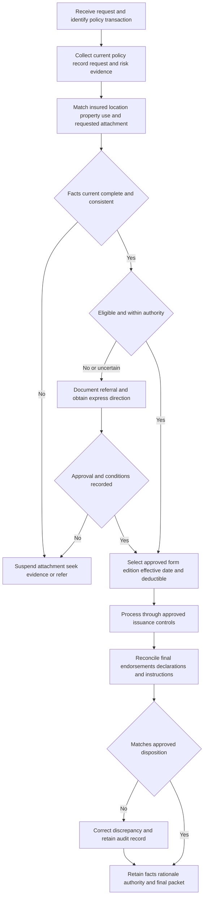

# Underwriting Guidance — Endorsement Attachment, Deductibles, and Issuance

## Purpose, boundary, and entry points

This page describes **internal underwriting and servicing controls**, not coverage interpretation. The underwriting manual is internal carrier direction: it must be used within delegated authority, supported by current and reliable risk information, documented in the account record, and applied before binding where referral is required. It cannot alter coverage; actual coverage changes come only from the issued policy, Declarations, and attached endorsements. [Underwriting Manual, 100.A–100.I](repo://manuals/underwriting/manual.md#L13-L67)

Use this workflow for new business, a midterm endorsement request, a deductible change, renewal, and correction of an issued packet. Start by identifying the applicant or producer request, the named insured, risk location, affected property or exposure, transaction and requested effective dates, proposed form number and edition, and the current policy record. An endorsement in the form library is not an attachment. The issued packet—not an internal approval, quote, or file note—establishes the terms that actually changed. See [Assembling the Governing Homeowners Policy](/openwiki/policy-assembly/assembling-the-governing-policy.md).

When this guidance refers to an endorsement, it **constrains whether or how the carrier may attach it**; it does not determine what the endorsement means. Obtain form or coverage review when the request, attachment instructions, form edition, or proposed policy effect is unclear.

## Control flow and required record

*The internal workflow holds incomplete or unauthorized changes, then independently reconciles the issued record with the approved disposition.*

### Intake and evidence gate

Review every requested endorsement before binding or renewal. Resolve an unclear request, incomplete producer instruction, conflicting applicant representation, uncertain eligibility, or stale risk fact before completing the transaction. Match the endorsement to the named insured, location, and property; verify ownership, occupancy, use, location, prior losses, and any protective feature on which the requested attachment depends. Do not attach an endorsement to an unrelated exposure or use one to cure an otherwise ineligible risk. [Underwriting Manual, 400.A–400.L](repo://manuals/underwriting/manual.md#L5089-L5161) [Underwriting Manual, 400.G and 400.AT–400.AU](repo://manuals/underwriting/manual.md#L5127-L5131) [Underwriting Manual, 400.AT–400.AU](repo://manuals/underwriting/manual.md#L5361-L5371)

The underwriting file must show the request source, evidence used, relevant risk facts, coverage intent considered, disposition, and any clarification. For an attachment, revision, or removal, record the action, factual rationale, and authority. Treat an unresolved material condition as a stop condition: suspend issuance rather than infer favorable facts. [Underwriting Manual, 400.E–400.F](repo://manuals/underwriting/manual.md#L5115-L5125) [Underwriting Manual, 400.AW and 400.BH–400.BI](repo://manuals/underwriting/manual.md#L5379-L5389) [Underwriting Manual, 400.BH–400.BI](repo://manuals/underwriting/manual.md#L5445-L5455)

### Authority and referral gate

Act only within delegated authority. A referral is a request for express direction, not an approval or a transfer of responsibility for the file; silence, delay, informal conversation, or an incomplete response is not authorization. Submit sufficient facts, the requested action, supporting material, material inconsistencies, and the reason for referral; preserve the referral communications and outcome. [Underwriting Referral and Authority Matrix, H.0.1–H.0.11](repo://guidelines/authority/referral-matrix.md#L13-L35) [Underwriting Referral and Authority Matrix, H.0.16–H.0.21](repo://guidelines/authority/referral-matrix.md#L45-L55)

Refer a request that changes the risk materially, a requested expansion outside normal authority, an unclear or conflicting attachment instruction, a request to remove a restriction without documented improved conditions, or an issue not addressed in established underwriting guidance. Do not issue the attachment pending authorization. Any approval is limited to its stated scope and must be reconsidered when a material fact changes. [Underwriting Manual, 300.U](repo://manuals/underwriting/manual.md#L4113-L4117) [Underwriting Manual, 400.AQ–400.AR](repo://manuals/underwriting/manual.md#L5343-L5353) [Underwriting Manual, 400.BF–400.BI](repo://manuals/underwriting/manual.md#L5433-L5455)

## Attachment controls by exposure

### Water backup and sump systems

Before considering a water-related attachment, evaluate water sources, drainage, plumbing condition, prior water or backup history, system type, lower-level exposure, and evidence that known defects were corrected. Refer unresolved water intrusion, sewer-line deterioration, repeated blockage, root intrusion, recurring sump overflow, active leakage, or inadequate/uncertain protective devices. The carrier's internal rules constrain whether or how it may attach water-backup terms; the applicable issued HO 04 90 form and edition exclusively determine any coverage effect. [Underwriting Manual, 400.M–400.O](repo://manuals/underwriting/manual.md#L5163-L5179) [Underwriting Manual, 220.U–220.AE](repo://manuals/underwriting/manual.md#L2725-L2789)

For Texas homeowners, require a clear description of previous water entry, drain overflow, and sump activity. Establish whether the dwelling uses public sewer, private sewer, septic, or a comparable arrangement, whether fixtures or finished areas are below grade, and whether the sump system is maintained, powered, and discharges away from the dwelling. Refer a requested water-backup limit above **$25,000** before binding or issuance; this is an authority control, not a statement of coverage. [Texas Homeowners Appetite Guide, H.4.1–H.4.20](repo://guidelines/appetite/tx-homeowners.md#L367-L407) [Underwriting Manual, 220.W–220.AC](repo://manuals/underwriting/manual.md#L2737-L2777)

Form editions make attachment selection and evidence capture material. The 2010-10 HO 04 90 remains in force for policies written under it but is superseded by the 2027-01 edition for policies effective on or after 2027-01-01. The attached 2010 form states a $5,000 limit and $500 endorsement deductible; the 2027 form states a $10,000 limit and $1,000 deductible. The 2027 form also requires a maintained operable backwater valve for finished areas below grade, while the 2010 form says one is not required in that circumstance. Confirm the selected edition and exact issued attachment rather than carrying forward a label or value. [HO 04 90 (2010-10), status and W.2–W.3](repo://forms/HO/MS/HO-04-90/2010-10.md#L8-L9) [HO 04 90 (2010-10), W.2–W.3](repo://forms/HO/MS/HO-04-90/2010-10.md#L107-L179) [HO 04 90 (2027-01), W.2–W.3](repo://forms/HO/MS/HO-04-90/2027-01.md#L139-L199) [HO 04 90 (2027-01), W.6](repo://forms/HO/MS/HO-04-90/2027-01.md#L497-L509)

### Roof ACV settlement attachment

Use roof age only with the current roof evidence. Verify the covering material, installation/replacement history, visible condition, repair history, and imagery or inspection findings. Refer an uncertain age, active leak, visible deterioration, incomplete repair support, or material conflict between the application and inspection/imagery. In the Texas appetite guide, obtain a roof inspection at age 15 or older and do not bind at age 25 or older; a roof condition exception requires referral authority and documented support. These are risk-selection controls, not claim settlement rules. [Texas Homeowners Appetite Guide, H.2.1–H.2.10](repo://guidelines/appetite/tx-homeowners.md#L153-L173) [Texas Homeowners Appetite Guide, H.2.38–H.2.60](repo://guidelines/appetite/tx-homeowners.md#L229-L273)

The internal roof control constrains whether or how the carrier may attach a roof-surfacing settlement endorsement; it does not establish the endorsement's meaning. Confirm the edition in the issued packet. HO 23 74 (2018-09) is retained for policies written under it and was superseded for policies effective on or after 2025-05-01; its stated age trigger is 15 years, the composition-shingle payable percentage is 25%, and its stated floor is 25% of replacement cost. The 2025-05 edition uses a 12-year trigger, states a 20% composition-shingle payable percentage, and a 30% floor. The forms, not this guidance, control any valuation, deductible ordering, limits, or exclusions. [HO 23 74 (2018-09), status and W.1](repo://forms/HO/MS/HO-23-74/2018-09.md#L8-L9) [HO 23 74 (2018-09), W.1](repo://forms/HO/MS/HO-23-74/2018-09.md#L47-L65) [HO 23 74 (2018-09), W.3–W.4](repo://forms/HO/MS/HO-23-74/2018-09.md#L233-L245) [HO 23 74 (2018-09), W.4](repo://forms/HO/MS/HO-23-74/2018-09.md#L297-L305) [HO 23 74 (2025-05), W.1](repo://forms/HO/MS/HO-23-74/2025-05.md#L57-L75) [HO 23 74 (2025-05), W.3–W.4](repo://forms/HO/MS/HO-23-74/2025-05.md#L327-L335) [HO 23 74 (2025-05), W.4](repo://forms/HO/MS/HO-23-74/2025-05.md#L415-L425)

For the policy analysis behind this attachment, including the distinction between coverage and settlement, see [Roof Loss Settlement and Actual Cash Value Schedules](/openwiki/coverages/coverage-a/roof-settlement.md).

### Ordinance and fungi limit treatments

Before attaching ordinance-related coverage, evaluate building ordinance exposure and property characteristics, then document the basis for the code-upgrade percentage treatment. Refer known code issues, required upgrades, or ordinance concerns that may materially affect restoration. This internal rule constrains attachment selection; the issued HO 04 16 is the exclusive source of any actual ordinance-or-law coverage change. [Underwriting Manual, 400.AF](repo://manuals/underwriting/manual.md#L5277-L5281) [Underwriting Manual, 150.AM](repo://manuals/underwriting/manual.md#L1849-L1849) [HO 04 16 (2023-11), W.0–W.1](repo://forms/HO/MS/HO-04-16/2023-11.md#L13-L51)

Before attaching mold-related treatment, investigate moisture, maintenance, water-loss, and remediation conditions and record the risk basis for the fungi, wet or dry rot, or bacteria aggregate-limit treatment. This control constrains whether or how the carrier may attach the form; the applicable HO 04 81 form determines the actual grant, aggregate limit, and deductible. The reviewed 2018-09 form states a $10,000 aggregate limit and applies the deductible after applicable limitations. [Underwriting Manual, 400.AE](repo://manuals/underwriting/manual.md#L5271-L5275) [HO 04 81 (2018-09), W.1–W.2](repo://forms/HO/MS/HO-04-81/2018-09.md#L45-L77) [HO 04 81 (2018-09), W.2 and W.3](repo://forms/HO/MS/HO-04-81/2018-09.md#L157-L165) [HO 04 81 (2018-09), W.3](repo://forms/HO/MS/HO-04-81/2018-09.md#L263-L275)

## Deductible selection and change controls

A deductible is a material underwriting term. Confirm the requested option is available, clear, unambiguous, and consistent across the application, quote, underwriting record, and issuance instructions. Use the deductible appropriate to the coverage part and intended location; do not infer an omitted selection, combine selections from different proposals, substitute a different deductible, or use a deductible to offset unacceptable property condition. Refer a conflict, unavailable legacy option, atypical or manuscript request, unverified feature, exception, or mismatch between the selected deductible and risk information. [Underwriting Manual, 410.A–410.K](repo://manuals/underwriting/manual.md#L5457-L5523) [Underwriting Manual, 410.P–410.Q](repo://manuals/underwriting/manual.md#L5549-L5559) [Underwriting Manual, 410.AN–410.AO](repo://manuals/underwriting/manual.md#L5693-L5703)

For a proposed deductible change, re-evaluate current risk facts and any late or material change; confirm the authorized effective date. Do not make a deductible change retroactive, or revise it after a loss based on claim information alone. Complete deductible review before release to issuance and retain the selection source, supporting evidence, correspondence, authorization, and final review. [Underwriting Manual, 410.X–410.Y](repo://manuals/underwriting/manual.md#L5597-L5607) [Underwriting Manual, 410.AT–410.BI](repo://manuals/underwriting/manual.md#L5729-L5823)

For water backup specifically, use only the deductible available for the risk and approved by underwriting; do not alter it without authorized approval. This is an internal control over attachment and servicing, while the attached form governs deductible application to any covered loss. [Underwriting Manual, 220.X](repo://manuals/underwriting/manual.md#L2743-L2747)

### Texas separate windstorm and hail deductible controls

For Texas residential property activity involving a separate windstorm or hail deductible, ensure that the policy and related communications identify the deductible distinctly, and reconcile the Declarations, endorsements, application, and other policy materials. The carrier must preserve the selection evidence, reflect it in the issued policy, and correct a policy record that does not accurately reflect it. A later changed deductible may be used only after it is properly reflected in the policy record; it cannot be substituted after a reported loss. These are state-specific operational and regulatory controls; the loss-date issued policy supplies the actual deductible term. [Texas Bulletin B-2021-08, B.1.1–B.1.13](repo://bulletins/TX/b-2021-08-windstorm-deductibles.md#L13-L43) [Texas Bulletin B-2021-08, B.2.10 and B.2.21–B.2.31](repo://bulletins/TX/b-2021-08-windstorm-deductibles.md#L67-L109)

## Issuance, renewal, and correction lifecycle

1. **Approve the disposition before release.** Attach only through approved processing controls. The transaction must identify the form edition, location, insured interest, effective date, attachment or removal, deductible, and any approval conditions. Do not use an endorsement retroactively to address a known loss circumstance.
2. **Build the final set.** Check for duplicate endorsements, attachment conflicts, accidental removal of an existing restriction, and mismatch between the final endorsement set and approved underwriting disposition. For a renewal, use current risk information rather than automatically continuing an attachment.
3. **Reconcile after processing.** Independently compare the issued endorsements, Declarations, and issuance instructions with the authorized decision. Correct a discrepancy promptly and record the correction. The control validates the issued record; it does not itself change the contract.
4. **Re-review on change.** A material change in occupancy, use, condition, protection, loss information, ownership, location, or valuation reopens the attachment and authority decision. At renewal, address unresolved conditions and do not continue a prior exception until its basis is confirmed.

These lifecycle rules are established by the manual's attachment, final-set, and renewal controls. [Underwriting Manual, 400.Z–400.AD](repo://manuals/underwriting/manual.md#L5241-L5269) [Underwriting Manual, 400.AB and 400.AW–400.AZ](repo://manuals/underwriting/manual.md#L5253-L5257) [Underwriting Manual, 400.AW–400.AZ](repo://manuals/underwriting/manual.md#L5379-L5401) [Underwriting Manual, 400.BB–400.BG](repo://manuals/underwriting/manual.md#L5409-L5443) [Underwriting Manual, 700.A–700.F](repo://manuals/underwriting/manual.md#L9129-L9165) [Underwriting Manual, 700.V](repo://manuals/underwriting/manual.md#L9257-L9261)

## Failures to stop early

- **Library-for-attachment error:** treating an available form or a referral note as proof that it was issued. Stop and obtain the schedule, endorsement copy, Declarations, effective date, and form edition.
- **Risk mismatch:** applying a location-specific, property-specific, or insured-specific attachment without verified linkage to that exposure. Stop and correct the underlying party or location data.
- **Eligibility workaround:** trying to solve adverse roof, water, moisture, occupancy, or use facts with an endorsement or higher deductible. Stop and refer the underlying risk issue.
- **Silent approval or scope drift:** treating an informal discussion as approval, or extending an approval for one risk/change to another. Stop until express, recorded direction identifies the action and scope.
- **Edition drift:** selecting the current HO 04 90 or HO 23 74 form because it is newer. Stop and use the form actually issued for the applicable policy population.
- **Release mismatch:** issuing a deductible or endorsement set that differs from the approved disposition. Stop release where possible; otherwise correct promptly and retain the reconciliation record.

## Focused control tests

Use representative file or system tests that assert the hold/referral outcome as well as a successful issuance outcome.

| Test | Setup | Expected control result |
| --- | --- | --- |
| Incomplete attachment request | Producer asks for “water coverage” but does not identify location, form, limit, or water-system facts | Clarify and hold; do not infer attachment, deductible, or coverage intent. |
| Older roof with ACV request | Texas roof is reported as 16 years old, but no current inspection is in file | Obtain roof inspection before binding; refer unresolved condition or authority issue; do not make a settlement representation. |
| Water-backup limit escalation | Texas request exceeds $25,000 or the file shows repeated sewer blockages | Refer with drainage, maintenance, loss, mitigation, and requested-limit evidence; issue only after authorized direction. |
| 2010/2027 edition selection | A policy schedule carries HO 04 90 (2010-10) while the form library includes 2027-01 | Retain the scheduled 2010 edition for that policy; do not migrate its limit, deductible, or backwater-valve requirement automatically. |
| Deductible reconciliation | Application, quote, and issuance instruction specify different deductible values | Hold/refer and obtain an authorized selection; verify the final issued policy matches it. |
| Texas deductible change | A separate wind/hail deductible change is requested after a reported loss or lacks selection evidence | Do not apply retroactively or substitute post-loss; retain the selection, policy, and effective-date record and use applicable policy terms. |
| Renewal carry-forward | Existing endorsement is scheduled but current property facts show new water damage or a changed occupancy | Reassess using current facts and approval scope; do not automatically continue the attachment. |

For complementary risk-selection controls, see [Risk Selection, Inspection, and Referral](/openwiki/underwriting-guidance/risk-selection-inspection-and-referral.md). For water-source and loss analysis, see [Water Damage and Water-Backup Write-Backs](/openwiki/coverages/coverage-a/water-damage-and-water-backup.md).
