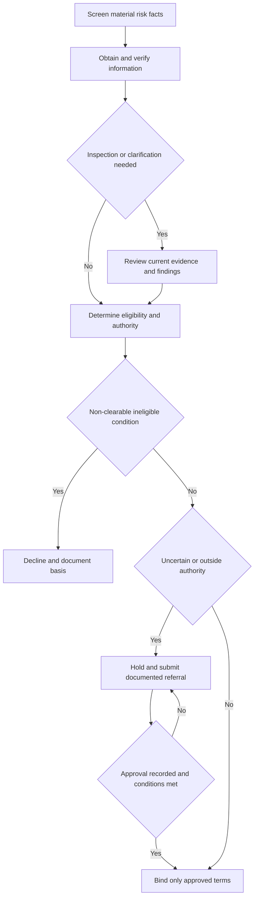

# Underwriting Guidance — Risk Selection, Inspection, and Referral

## Scope and control hierarchy

> **Internal guidance, not a contract.** The Underwriting Manual, Referral and Authority Matrix, and Texas Homeowners Appetite Guide are carrier operating guidance. They direct eligibility review, referral, authority, and file handling; they **must not** be represented as a coverage grant, restriction, waiver, claim decision, or promise of renewal or payment. Coverage and loss settlement come only from the issued policy, declarations, and endorsements that are attached and applicable. [Underwriting Manual, Rule 100](repo://manuals/underwriting/manual.md#L13-L43) [Referral and Authority Matrix, H.0](repo://guidelines/authority/referral-matrix.md#L13-L25) [Texas Homeowners Appetite Guide, H.0](repo://guidelines/appetite/tx-homeowners.md#L13-L35)

Use the following order rather than treating one source as a substitute for another:

| Control type | Governs | Does not govern |
| --- | --- | --- |
| **Contract terms** | Whether an insured loss is covered and, if so, its limit, deductible, conditions, and settlement. An endorsement is part of the policy only when attached. | The carrier's appetite or delegated authority. |
| **Regulatory constraints** | Conduct of Florida underwriting, inspection, notices, records, and claims activity. | A coverage change to an existing policy. |
| **Mandatory internal controls** | The carrier's action before binding, renewing, declining, or escalating a risk, including documentation and approval routing. | The meaning of contract language or the outcome of a claim. |

For example, **HO 04 90 (2027-01) W.0 constrains neither eligibility nor authority; it modifies the policy only when attached.** The internal $25,000 water-backup referral rule **constrains** the carrier's authority to act, not the $10,000 contractual limit and $1,000 deductible in this reviewed endorsement. [HO 04 90 (2027-01), W.0 and W.2-W.3](repo://forms/HO/MS/HO-04-90/2027-01.md#L13-L39) [HO 04 90 (2027-01), W.2-W.3](repo://forms/HO/MS/HO-04-90/2027-01.md#L139-L169) [Underwriting Manual, Rule 900.E](repo://manuals/underwriting/manual.md#L9891-L9895) [Referral and Authority Matrix, H.4](repo://guidelines/authority/referral-matrix.md#L403-L417)

Likewise, an attached **HO 23 74 (2025-05)** changes settlement for a covered roof-surfacing loss, including ACV settlement at a roof-surfacing age of 12 years or greater; it expressly neither creates coverage for an otherwise uncovered loss nor changes other exclusions, conditions, limits, or deductibles. Roof settlement is therefore not a proxy for roof eligibility. [HO 23 74 (2025-05), W.0-W.1](repo://forms/HO/MS/HO-23-74/2025-05.md#L13-L27) [HO 23 74 (2025-05), W.1](repo://forms/HO/MS/HO-23-74/2025-05.md#L59-L77)

<!-- openwiki: broken internal link [/openwiki/coverages/coverage-a/roof-settlement] file "/openwiki/coverages/coverage-a/roof-settlement" does not exist. Fix the href or restore the target, then delete this comment. -->
<!-- openwiki: broken internal link [/openwiki/coverages/coverage-a/water-damage-and-water-backup] file "/openwiki/coverages/coverage-a/water-damage-and-water-backup" does not exist. Fix the href or restore the target, then delete this comment. -->
See [Roof Loss Settlement and Actual Cash Value Schedules](/openwiki/coverages/coverage-a/roof-settlement) and [Water Damage and Water-Backup Write-Backs](/openwiki/coverages/coverage-a/water-damage-and-water-backup) for contract analysis. This page addresses only carrier risk-selection action.

## Binding lifecycle and release gate

The default operating path is to establish material facts, resolve or escalate what is not supportable, and bind only within documented authority. A referral is a request for direction, not a transfer of responsibility for an accurate file; silence, delay, informal discussion, or an incomplete response is not approval. [Underwriting Manual, Rule 100](repo://manuals/underwriting/manual.md#L57-L73) [Referral and Authority Matrix, H.0](repo://guidelines/authority/referral-matrix.md#L31-L49)

*The carrier may release a risk only after eligibility facts are supportable, material conditions are resolved or authorized, and the action is within recorded authority.*

### Mandatory pre-bind controls

- Use current, reliable information; verify material characteristics and do not assume favorable facts. Refer material uncertainty, unreliable sources, discrepancies, or information gaps rather than completing a decision on unsupported information. [Underwriting Manual, Rule 100.H-I and R-T](repo://manuals/underwriting/manual.md#L57-L67) [Underwriting Manual, Rule 100.R-T](repo://manuals/underwriting/manual.md#L117-L133)
- Confirm identity, insurable interest, occupancy, location/territory, property condition, valuation, requested coverage alignment, and effective date. Open, disputed, or unresolved claim activity; hazardous or deferred-maintenance conditions; and material omissions are referral/hold conditions, not routine binding facts. [Underwriting Manual, Rule 300](repo://manuals/underwriting/manual.md#L4017-L4105)
- A referred risk may be bound only after the authorized response is recorded, its conditions are satisfied, and proposed issuance terms match the approval. Do not divide a transaction to avoid referral, backdate approval, or call a pending referral bound. [Underwriting Manual, Rule 100.X-Y](repo://manuals/underwriting/manual.md#L153-L163) [Referral and Authority Matrix, H.7](repo://guidelines/authority/referral-matrix.md#L733-L749) [Referral and Authority Matrix, H.7](repo://guidelines/authority/referral-matrix.md#L760-L785)

A binding suspension is a separate operational hold: the Manual directs suspension of new binding when forecast landfall is within 72 hours and extends it to new business, coverage increases, and location additions in the affected territory. Release requires authorized underwriting confirmation. [Underwriting Manual, Rule 800.I-L](repo://manuals/underwriting/manual.md#L9547-L9569)

## Property inspection and evidence

Order an inspection or obtain other reliable property-specific evidence when submitted information is incomplete, inconsistent, unreliable, stale, inaccessible, or indicates a material property-condition concern. Review material findings; resolve, refer, or accept them within authority before final underwriting action. Preserve inspection information rather than editing it, and record separately any clarification and its source. [Underwriting Manual, Rule 100.AJ-AM](repo://manuals/underwriting/manual.md#L225-L247) [Underwriting Manual, Rule 300.F and L-P](repo://manuals/underwriting/manual.md#L4023-L4087)

Evidence can include inspections, photographs, permits, invoices, contractor records, and other credible property-specific material. It must identify what it supports; an applicant statement is reported information until verified. For repairs, determine whether the evidence addresses the underlying cause, not merely visible or cosmetic restoration. [Underwriting Manual, Rule 210.C-D](repo://manuals/underwriting/manual.md#L2225-L2235) [Underwriting Manual, Rule 240.G-H and AU](repo://manuals/underwriting/manual.md#L3359-L3369) [Underwriting Manual, Rule 240.AU](repo://manuals/underwriting/manual.md#L3599-L3603)

### Inspection-currency conflict — escalate; do not select a rule by inference

The Manual contains inconsistent inspection-recency directions:

| Source | Direction |
| --- | --- |
| Rule 100.AJ | Treats an inspection report as current for **12 months after receipt**. |
| Rule 610.AA | Says to treat an inspection report as valid for **18 from completion**; it does not state a unit. |
| Rule 700.R | Treats an inspection report as valid for **12 months** and calls for updated information when it is no longer valid or conditions may have changed. |

Do **not** silently choose a validity period. Record the report and completion/receipt dates, the condition-change assessment, and the clarification or authority direction used for the transaction. [Underwriting Manual, Rule 100.AJ](repo://manuals/underwriting/manual.md#L225-L229) [Underwriting Manual, Rule 610.AA](repo://manuals/underwriting/manual.md#L8961-L8965) [Underwriting Manual, Rule 700.R](repo://manuals/underwriting/manual.md#L9233-L9237) [Underwriting Manual, Rule 100.P](repo://manuals/underwriting/manual.md#L105-L109)

## Roof selection: age informs review; condition controls present risk

Under the baseline Manual, a roof age of **15 years or more** requires inspection findings before binding, and binding authority remains on hold until the findings support acceptable condition. A roof age of **25 years or more** is a decline threshold when replacement evidence is unavailable or unreliable. Verify age and claimed replacement with reliable evidence; do not infer full replacement from cosmetic appearance or treat an unsupported assertion as proof. [Underwriting Manual, Rule 210.A-D](repo://manuals/underwriting/manual.md#L2213-L2235)

Refer and keep the risk unbound when evidence identifies or cannot resolve material deterioration, missing/lifted/curled/cracked covering, active leakage or related interior staining, temporary or incomplete repair, impaired drainage, flashing/penetration/seal defects, structural distortion, suspect decking, roof-associated mold/rot/moisture, or inconsistent roof material/age information. Planned repairs do not establish acceptable present condition. [Underwriting Manual, Rule 210.E-Q](repo://manuals/underwriting/manual.md#L2237-L2313) [Underwriting Manual, Rule 210.Z](repo://manuals/underwriting/manual.md#L2363-L2367)

Roof review is a system review: identify covering material, age, condition, repair history, drainage, flashings, penetrations, and any water-entry evidence. For a weather-related prior roof loss, evaluate current condition and credible repair completion rather than assuming a paid claim produced full replacement. [Underwriting Manual, Rule 210.S](repo://manuals/underwriting/manual.md#L2321-L2325) [Underwriting Manual, Rule 240.M-N](repo://manuals/underwriting/manual.md#L3395-L3405)

### Florida overlay: regulatory constraints prevail over a conflicting internal action

Florida Rule 500 is internal guidance that **constrains** carrier action: it requires a pre-bind inspection at age 15 or more, directs decline at age 20 or more, and requires referral for deterioration, missing material, patching, unresolved repair evidence, unsupported roof statements, or roof-related water evidence. [Underwriting Manual, Rule 500.C-G](repo://manuals/underwriting/manual.md#L5843-L5881)

For Florida admitted residential business, OIR-2023-04 is a regulatory constraint: roof age cannot substitute for an assessment of condition where available information indicates the roof may remain serviceable; reliable repair, replacement, material, and observed-condition evidence must be evaluated. It also requires supportable, accurate reasons and review of timely information before a roof-age-based nonrenewal is finalized. Where an internal age threshold would produce a contrary action, escalate and follow the regulatory and filed requirements; do not use the Manual as authority to override them. [OIR-2023-04, B.1](repo://bulletins/FL/oir-2023-04-roof-age-nonrenewal.md#L13-L35) [OIR-2023-04, B.2](repo://bulletins/FL/oir-2023-04-roof-age-nonrenewal.md#L61-L111)

<!-- openwiki: broken internal link [/openwiki/state-overlays/florida-roof-wind-and-claim-rules] file "/openwiki/state-overlays/florida-roof-wind-and-claim-rules" does not exist. Fix the href or restore the target, then delete this comment. -->
Florida roof eligibility and roof-loss adjustment remain separate: a nonrenewal decision cannot replace a loss-specific claim investigation, and a claim cannot be denied, limited, or delayed solely for roof age. [OIR-2023-04, B.4](repo://bulletins/FL/oir-2023-04-roof-age-nonrenewal.md#L241-L265) [Florida Overlay — Roof, Wind, Notices, and Claims](/openwiki/state-overlays/florida-roof-wind-and-claim-rules)

### Texas overlay

The Texas Appetite Guide and Rule 510 are internal controls. They require roof type, visible condition, and age verification; a pre-bind roof inspection at age 15 or more; referral for active leakage, temporary repair, damage, unresolved condition, repeated water/moisture/mold/plumbing concerns, and correction of a material roof condition where underwriting requires it. A Texas risk with an unresolved material property condition must not be bound. [Texas Homeowners Appetite Guide, H.2](repo://guidelines/appetite/tx-homeowners.md#L153-L173) [Underwriting Manual, Rule 510](repo://manuals/underwriting/manual.md#L6253-L6257) [Underwriting Manual, Rule 510](repo://manuals/underwriting/manual.md#L6337-L6353) [Underwriting Manual, Rule 510](repo://manuals/underwriting/manual.md#L6367-L6389)

## Water, plumbing, drainage, and water-backup exposure

For underwriting, obtain a clear account of reported water entry, plumbing condition, drainage/sewer configuration, sump equipment, prior backups/overflows, water source, and remediation. Refer unresolved water entry, active leaks, moisture or mold, repeated water loss, drainage/sump/sewer issues, inadequate water management, incomplete remediation, or an uncertain cause. Require credible confirmation that corrective work addressed the cause before approval when the condition is material. [Underwriting Manual, Rule 240.G-H](repo://manuals/underwriting/manual.md#L3359-L3369) [Underwriting Manual, Rule 240.AL](repo://manuals/underwriting/manual.md#L3545-L3549) [Underwriting Manual, Rule 900.X and AA](repo://manuals/underwriting/manual.md#L10005-L10027)

The source and path matter to risk review, but **do not make a coverage determination in the underwriting file**. As an example, the reviewed HO 04 90 defines Water Backup as water backing up through a sewer or drain, covers direct physical loss only as its attached terms provide, and separately excludes flood, non-qualifying surface water, groundwater intrusion, fixture/appliance overflow, exterior-drainage discharge, and certain failure-to-maintain losses. Its terms govern a claim only if attached; the referral control does not broaden or narrow those terms. [HO 04 90 (2027-01), W.1](repo://forms/HO/MS/HO-04-90/2027-01.md#L41-L101) [HO 04 90 (2027-01), W.1](repo://forms/HO/MS/HO-04-90/2027-01.md#L119-L137)

A request for water-backup coverage above **$25,000** requires referral before binding. This is an authority control, not an available-limit representation: do not quote the requested limit as available pending approval. It can coexist with a particular attached endorsement's stated limit, which remains the contractual limit. [Underwriting Manual, Rule 900.E](repo://manuals/underwriting/manual.md#L9891-L9895) [Underwriting Manual, Rule 510.4](repo://manuals/underwriting/manual.md#L6247-L6251) [HO 04 90 (2027-01), W.2](repo://forms/HO/MS/HO-04-90/2027-01.md#L139-L177)

## Prior-loss review and referral

Obtain and compare carrier-approved loss history and disclosures before acceptance, renewal, or material change. Review reported, paid, denied, and open property claims in the prior three years, including available history for the applicant, household, and insured location. Refer material disclosure-versus-history discrepancies and treat unavailable history as an underwriting concern. [Underwriting Manual, Rule 240.A-C](repo://manuals/underwriting/manual.md#L3321-L3339)

Two paid property claims require referral and no binding without underwriting authority. That trigger does not make a risk automatically ineligible: assess cause, recurrence, repair/remediation, and present condition. A closed or unpaid claim may still disclose a current hazard, and loss history alone does not establish ineligibility. [Underwriting Manual, Rule 240.D](repo://manuals/underwriting/manual.md#L3341-L3345) [Underwriting Manual, Rule 240.AO and AX](repo://manuals/underwriting/manual.md#L3563-L3567) [Underwriting Manual, Rule 240.AX](repo://manuals/underwriting/manual.md#L3617-L3621)

Give heightened review to repeated water, seepage, leakage, backup, overflow, drainage failure, roof/exterior storm damage, and moisture/mold conditions. Identify the cause and affected area; separate remediation from cosmetic restoration; and use reliable repair evidence such as inspections, photographs, or contractor records. Refer material conflicts between current condition, repair evidence, inspection, and application information. [Underwriting Manual, Rule 240.G-H](repo://manuals/underwriting/manual.md#L3359-L3369) [Underwriting Manual, Rule 240.M-N and S-T](repo://manuals/underwriting/manual.md#L3395-L3405) [Underwriting Manual, Rule 240.S-T](repo://manuals/underwriting/manual.md#L3431-L3441) [Underwriting Manual, Rule 240.AU and AW](repo://manuals/underwriting/manual.md#L3599-L3615)

## Authority, referrals, and renewals

The general delegated limits are $800,000 Coverage A for a line underwriter and $1,500,000 for a senior underwriter; the Texas overlay uses $800,000 and $1,200,000 respectively, with decline or further referral above $1,200,000. Apply the state-specific ceiling and the assigned authority; neither an automated indication nor a similar prior approval expands it. [Underwriting Manual, Rule 300.A-B](repo://manuals/underwriting/manual.md#L3991-L4003) [Underwriting Manual, Rule 510.1-3](repo://manuals/underwriting/manual.md#L6229-L6245) [Referral and Authority Matrix, H.7](repo://guidelines/authority/referral-matrix.md#L697-L731)

A referral packet should state the requested action, trigger, material facts and sources, unresolved issues, loss and repair facts, inspection evidence, requested limits, and proposed conditions. Record the approver, scope and conditions of approval, and any later material change; seek renewed approval if the submitted risk changes before binding. [Underwriting Manual, Rule 100.W-X](repo://manuals/underwriting/manual.md#L147-L157) [Referral and Authority Matrix, H.7](repo://guidelines/authority/referral-matrix.md#L721-L749)

At renewal, conduct a current review rather than relying on earlier acceptance. Refer material changes, two paid property claims, unresolved conditions, unrepaired roof/exterior/water issues, repeated water conditions, outdated or conflicting inspection information, missing material information, and open claims that prevent reliable assessment. Complete the underwriting review and approval process before issuing a nonrenewal notice, and use factual, supportable reasons. [Underwriting Manual, Rule 700.A-F](repo://manuals/underwriting/manual.md#L9131-L9165) [Underwriting Manual, Rule 700.N-P and R-S](repo://manuals/underwriting/manual.md#L9209-L9243) [Underwriting Manual, Rule 700.AT and BA](repo://manuals/underwriting/manual.md#L9401-L9405) [Underwriting Manual, Rule 700.BA](repo://manuals/underwriting/manual.md#L9443-L9447)

## File documentation and quality checks

Create a contemporaneous, factual, professional record. Attribute reported information and distinguish it from verified fact, observation, inference, or an unverified statement. Record material adverse information even if the risk is accepted, and do not include speculation about intent, conduct, or credibility. [Underwriting Manual, Rule 610.A-E](repo://manuals/underwriting/manual.md#L8805-L8833) [Underwriting Manual, Rule 610.Y](repo://manuals/underwriting/manual.md#L8949-L8953) [Underwriting Manual, Rule 610.AU](repo://manuals/underwriting/manual.md#L9081-L9085)

For each final action, the file should make a later review possible:

- **Facts and evidence:** property, ownership/occupancy/use, construction, roof, water/plumbing/drainage, protection, loss history, sources, received/verified dates, and limitations or discrepancies.
- **Decision state:** acceptable, declined, referred, restricted, conditioned, or held; the material eligibility findings; final factual rationale; and the source/rule basis.
- **Referral and authority:** trigger, requested action, materials supplied, approver, response, authority used, approval scope, and conditions.
- **Corrective action and lifecycle:** requested evidence, responsible party, due/follow-up status, completion evidence, hold/release decision, new information, reassessment, and final disposition.
- **Adverse action:** supported action reason, source information, approving authority, and any required notice-handling direction. Do not interpret notice requirements or policy coverage in the underwriting record.

These are mandatory internal recordkeeping controls. [Underwriting Manual, Rule 610.F-I](repo://manuals/underwriting/manual.md#L8835-L8857) [Underwriting Manual, Rule 610.G-H](repo://manuals/underwriting/manual.md#L8841-L8851) [Underwriting Manual, Rule 610.AB and AG-AI](repo://manuals/underwriting/manual.md#L8967-L8977) [Underwriting Manual, Rule 610.AG-AI](repo://manuals/underwriting/manual.md#L8997-L9013) [Underwriting Manual, Rule 610.AP and AZ](repo://manuals/underwriting/manual.md#L9051-L9055) [Underwriting Manual, Rule 610.AZ](repo://manuals/underwriting/manual.md#L9111-L9115)

<!-- openwiki: broken internal link [/openwiki/state-overlays/florida-roof-wind-and-claim-rules] file "/openwiki/state-overlays/florida-roof-wind-and-claim-rules" does not exist. Fix the href or restore the target, then delete this comment. -->
For Florida notice, filing, roof-age, and claims-specific constraints, see [Florida Overlay — Roof, Wind, Notices, and Claims](/openwiki/state-overlays/florida-roof-wind-and-claim-rules). For policy issuance and endorsement attachment controls, use the governing policy packet and attached forms rather than an underwriting note or referral outcome.
