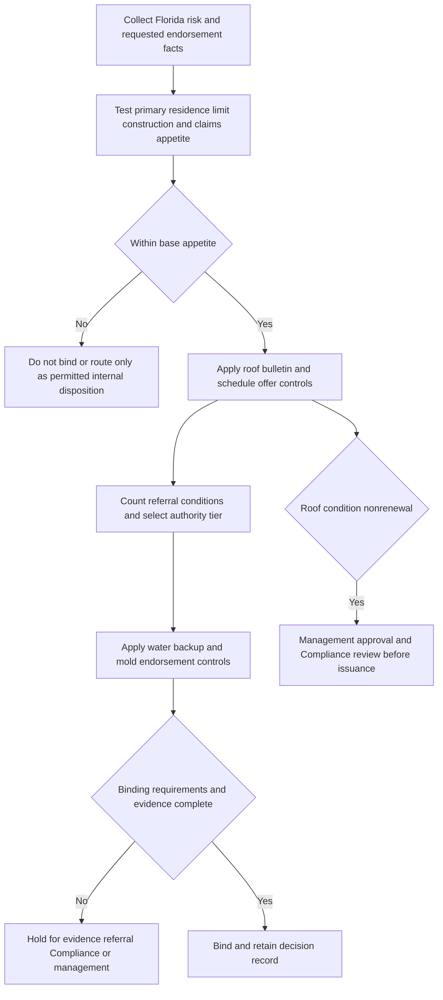

## Purpose and authority boundary

This page is **internal underwriting guidance** for Florida personal residential property. It directs risk selection, referral, documentation, and issuance workflow. It is not policy language, does not establish coverage, and must not be quoted to an insured or claimant. The Florida appetite guide is the state-specific source for these operating controls; the enterprise referral matrix may impose equal or stricter escalation but may not broaden the authority granted here. [Florida Homeowners Appetite Guide, status and H.7](repo://guidelines/appetite/fl-homeowners.md#L1-L5) [Florida Homeowners Appetite Guide, H.7](repo://guidelines/appetite/fl-homeowners.md#L47-L49) · [Underwriting Referral and Authority Matrix, R.1](repo://guidelines/authority/referral-matrix.md#L1-L11)

Keep three decision layers separate:

| Layer | What it controls | What it does **not** do |
| --- | --- | --- |
| **Florida appetite guide and referral matrix** | Internal eligibility, bind/referral authority, required file documentation, and Compliance/management routing. | Change an issued contract or approve an exception to a regulatory rule. |
| **OIR Bulletin OIR-2023-04** | Binding regulatory constraints for Florida personal residential property policies issued or renewed with effective dates on or after 2023-07-01: roof-age decisions, inspection, offer, nonrenewal, deductible overlap, and annual reporting. | Attach an endorsement, select a deductible amount, or determine claim coverage. |
| **Issued HO-3, Declarations, and endorsements** | The actual policy coverage, limits, deductibles, and settlement terms. | Supply underwriting authority or replace the bulletin's issuance/renewal controls. |

The bulletin's scope and effective-date gate come from the bulletin itself. HO-3 and its endorsements control only when issued and attached; for example, HO 23 74 attaches to HO-3 and modifies A.4, while HO 04 90 modifies the base-form water-backup exclusion. [OIR-2023-04, applicability and purpose](repo://bulletins/FL/2023-04-roof-age-nonrenewal.md#L1-L7) · [HO-3 2018-09, A.3-A.4](repo://forms/HO/MS/HO-3/2018-09.md#L25-L34) · [HO 23 74 2018-09, attachment](repo://forms/HO/MS/HO-23-74/2018-09.md#L1-L4) · [HO 04 90 2010-10, attachment](repo://forms/HO/MS/HO-04-90/2010-10.md#L1-L4)

> **Do not cure an out-of-appetite result or a bulletin/form constraint with a referral.** Management approval is required in the situations below, but it cannot approve an exception to a filed rule or bind a risk that is outside appetite entirely. [Underwriting Referral and Authority Matrix, R.1 and R.4](repo://guidelines/authority/referral-matrix.md#L7-L10) [Underwriting Referral and Authority Matrix, R.4](repo://guidelines/authority/referral-matrix.md#L33-L39)

## Intake and base Florida appetite

Start each submission with the policy effective date, occupancy and residence status, Coverage A and estimated replacement cost, construction, protection class, wind-borne-debris-region status, roof installation/replacement evidence and condition reports, prior water and mold claims, finished-below-grade exposure, and requested endorsements and limits. These facts determine both eligibility and which authority and regulatory gates apply; they do not themselves determine coverage under an issued policy.

A Florida risk is within the base appetite only when it is an **owner-occupied, one-family primary residence** with Coverage A from **$200,000 through $900,000** and insurance to at least **80% of replacement cost**. The 80% test is also material to the HO-3 2018-09 dwelling settlement baseline: A.3 makes replacement-cost settlement subject to that threshold and the applicable deductible. Seasonal and secondary residences are outside Florida appetite regardless of other favorable facts. [Florida Homeowners Appetite Guide, H.1](repo://guidelines/appetite/fl-homeowners.md#L7-L13) · [HO-3 2018-09, A.3](repo://forms/HO/MS/HO-3/2018-09.md#L25-L34)

Construction is a separate gate. Masonry and masonry veneer are eligible in all approved counties. Frame construction is eligible only in protection classes 1-5 and outside the wind-borne debris region. A frame risk in that region requires management approval; do not infer that approval is automatic or that another authority tier can waive an ineligible construction rule. [Florida Homeowners Appetite Guide, H.1](repo://guidelines/appetite/fl-homeowners.md#L7-L13) · [Florida Homeowners Appetite Guide, H.7](repo://guidelines/appetite/fl-homeowners.md#L47-L49)

## Authority and referral model

Florida's Coverage A ceiling is tighter than the enterprise ceiling, so the Florida limits control. A line underwriter may bind an in-appetite risk through **$600,000** Coverage A. A senior underwriter may bind through **$900,000** and may approve **one referral condition per risk**. Management approval is required above $900,000, for a wind-borne-debris-region frame risk, for roof-condition nonrenewal, and whenever more than one referral condition is present. Every cleared referral must record the condition, authority tier, facts relied on, and date. [Florida Homeowners Appetite Guide, H.7](repo://guidelines/appetite/fl-homeowners.md#L47-L49) · [Underwriting Referral and Authority Matrix, R.1-R.2](repo://guidelines/authority/referral-matrix.md#L7-L17) · [Underwriting Referral and Authority Matrix, R.6](repo://guidelines/authority/referral-matrix.md#L49-L53)

| Decision | Binding or routing control |
| --- | --- |
| Coverage A up to $600,000 | Line underwriter, only if all Florida appetite and regulatory gates are met. |
| Coverage A over $600,000 through $900,000 | Senior underwriter. |
| More than one referral condition, Coverage A above $900,000, wind-borne-debris-region frame, or roof-condition nonrenewal | Management approval. Compliance review is additionally mandatory before a roof-condition nonrenewal is issued. |
| Three or more water claims in five years | Entire risk is outside Florida appetite; it cannot be cleared by referral. |
| A filed-rule or bulletin violation | Never an authority exception; correct the configuration or do not bind. |

The last two rows are hard stops, rather than escalations. The Florida guide makes three or more water claims in five years outside appetite for the entire risk, and the matrix independently says an exception to a state filing or bulletin cannot be approved. [Florida Homeowners Appetite Guide, H.4](repo://guidelines/appetite/fl-homeowners.md#L27-L33) · [Underwriting Referral and Authority Matrix, R.4](repo://guidelines/authority/referral-matrix.md#L33-L39)

*The internal workflow sequences eligibility, nonwaivable roof controls, authority, endorsement decisions, and nonrenewal routing; it does not make a coverage determination.* [Florida Homeowners Appetite Guide, H.1-H.7](repo://guidelines/appetite/fl-homeowners.md#L7-L49) · [Underwriting Referral and Authority Matrix, R.1-R.6](repo://guidelines/authority/referral-matrix.md#L7-L53) · [OIR-2023-04, F.2-F.5](repo://bulletins/FL/2023-04-roof-age-nonrenewal.md#L9-L29)

## Roof review, inspection, and schedule configuration

### Inspection and declination controls

For a roof aged **15 years or more**, Florida internal guidance requires an inspection before binding. For a policy in the bulletin's effective-date scope, an insurer-required inspection at this age is at the insurer's expense. An insured-provided qualifying inspection must be accepted when it meets the F.2 requirements, and an insurer cannot require a second inspection at the insured's expense in the same policy period; the insurer also cannot limit acceptance to inspectors of its own selection when the inspector is Florida-licensed. Preserve the report, inspector license/qualification, inspection date, roof age, remaining-useful-life conclusion, and policy effective date. The before-binding workflow and comparison-quote retention are internal controls; the cost and inspection-acceptance rules are binding bulletin requirements. [Florida Homeowners Appetite Guide, H.2](repo://guidelines/appetite/fl-homeowners.md#L15-L21) · [OIR-2023-04, F.2-F.3](repo://bulletins/FL/2023-04-roof-age-nonrenewal.md#L9-L19)

Do not decline or nonrenew on a generic "roof age" reason. Under F.2, a refusal to issue or renew may not be based solely on roof age where an authorized-inspector report from the 12 months preceding the effective date establishes at least five years of remaining useful life. If the action is based on roof condition, record and state the **specific deficiency identified**. This is a regulatory decision-basis requirement; the matrix's declination-note requirement reinforces it operationally but is not its substitute. [OIR-2023-04, F.2](repo://bulletins/FL/2023-04-roof-age-nonrenewal.md#L9-L13) · [Underwriting Referral and Authority Matrix, R.6](repo://guidelines/authority/referral-matrix.md#L49-L53)

### HO 23 74 offer and attachment gate

Do not attach **HO 23 74 Actual Cash Value Loss Settlement - Roof Surfacing** to a roof that is under ten years old at the policy effective date. For an in-scope Florida policy, the controlling bulletin prohibits applying an ACV roof schedule below that age. When offering either a separate roof deductible or an ACV roof schedule, offer a policy without that provision at a filed and approved rate and disclose the premium difference in writing at the time of offer. Retain the two configurations, filed-rate support, written comparison, acceptance, and issued endorsement/Declarations record; retention of the comparison quote is specifically required by Florida internal guidance. [OIR-2023-04, F.4](repo://bulletins/FL/2023-04-roof-age-nonrenewal.md#L21-L25) · [Florida Homeowners Appetite Guide, H.2](repo://guidelines/appetite/fl-homeowners.md#L15-L21) · [Underwriting Referral and Authority Matrix, R.5](repo://guidelines/authority/referral-matrix.md#L41-L47)

The age used for this **issuance** prohibition is the roof age at policy effective date. It is not the HO 23 74 claim-time age calculation, which uses the documented original-installation or most recent full-replacement date (or the dwelling-age presumption if undocumented) at the date of loss. Do not substitute one test for the other. [OIR-2023-04, F.4](repo://bulletins/FL/2023-04-roof-age-nonrenewal.md#L21-L25) · [HO 23 74 2018-09, R.3 and R.5](repo://forms/HO/MS/HO-23-74/2018-09.md#L17-L35)

<!-- openwiki: broken internal link [/openwiki/coverage/coverage-a/roof-settlement] file "/openwiki/coverage/coverage-a/roof-settlement" does not exist. Fix the href or restore the target, then delete this comment. -->
An offer or underwriting approval is not evidence of issued coverage. Only an attached HO 23 74 changes settlement, and then only for windstorm- or hail-caused **roof surfacing**; other dwelling components remain under HO-3 A.3, and roof-surfacing loss from another covered peril remains replacement cost. For issued-policy claim analysis, use [Roof Settlement](/openwiki/coverage/coverage-a/roof-settlement). [HO-3 2018-09, A.3-A.4](repo://forms/HO/MS/HO-3/2018-09.md#L25-L34) · [HO 23 74 2018-09, R.1-R.2](repo://forms/HO/MS/HO-23-74/2018-09.md#L5-L16)

## Roof-condition nonrenewal: controlled Compliance handoff

A roof-condition nonrenewal is a regulated notice process, not an underwriting note or a policy condition. Before issuance, obtain management approval and route the packet through **Compliance without exception**. Compliance must verify at least 120 days' written notice, a specific reason, and inclusion of every inspection report actually relied upon. The first three requirements are from F.5; the Compliance and management steps are internal operational controls and do not replace the bulletin. [OIR-2023-04, F.5](repo://bulletins/FL/2023-04-roof-age-nonrenewal.md#L27-L29) · [Florida Homeowners Appetite Guide, H.3 and H.7](repo://guidelines/appetite/fl-homeowners.md#L23-L25) [Florida Homeowners Appetite Guide, H.7](repo://guidelines/appetite/fl-homeowners.md#L47-L49)

The nonrenewal file should retain: the policy and nonrenewal dates and 120-day calculation; the particular roof-condition deficiency; all relied-on inspection reports; decision and notice versions; management approval; Compliance approval; county; and final disposition. County and roof-condition reason must be reliable reporting fields because the bulletin requires annual reporting of roof-condition nonrenewals disaggregated by county. This is a carrier reporting obligation, not an insured duty or coverage condition. [OIR-2023-04, F.2, F.5, and F.7](repo://bulletins/FL/2023-04-roof-age-nonrenewal.md#L9-L13) [OIR-2023-04, F.5 and F.7](repo://bulletins/FL/2023-04-roof-age-nonrenewal.md#L27-L37)

## Water backup: underwriting configuration, not flood coverage

HO 04 90 is optional and must be attached; it is not a general water-damage or flood endorsement. Florida permits a line underwriter to bind the base endorsement sublimit without referral. The form's base is **$5,000 per policy period unless the Declarations show a higher limit**, part of rather than additional to Coverage A/B/C; it also has a separate $500 deductible. Higher water-backup limits are subject to the authority matrix: requests above $25,000 require referral, and senior underwriters may bind up to $50,000. For any limit above $10,000, a risk with a finished below-grade area requires a battery-backed sump pump. [Florida Homeowners Appetite Guide, H.4](repo://guidelines/appetite/fl-homeowners.md#L27-L33) · [Underwriting Referral and Authority Matrix, R.3 and R.5](repo://guidelines/authority/referral-matrix.md#L19-L30) [Underwriting Referral and Authority Matrix, R.5](repo://guidelines/authority/referral-matrix.md#L41-L47) · [HO 04 90 2010-10, W.2-W.3](repo://forms/HO/MS/HO-04-90/2010-10.md#L9-L15)

Two or more water claims of any type in five years puts the risk outside appetite **for this endorsement**. Three or more puts the entire risk outside Florida appetite. Do not represent a referral as authorization to attach HO 04 90 contrary to these controls. [Florida Homeowners Appetite Guide, H.4](repo://guidelines/appetite/fl-homeowners.md#L27-L33) · [Underwriting Referral and Authority Matrix, R.4](repo://guidelines/authority/referral-matrix.md#L33-L39)

<!-- openwiki: broken internal link [/openwiki/coverage/property/water-damage-and-backup] file "/openwiki/coverage/property/water-damage-and-backup" does not exist. Fix the href or restore the target, then delete this comment. -->
Underwriters must never describe HO 04 90 as flood coverage. If attached, W.1 responds to its defined sewer/drain backup and sump overflow/discharge events, but W.4 retains exclusions for flood, surface water, waves, tidal water, storm surge, overflow of a body of water, and subsurface water. The issued policy, including W.5's known-unremedied maintenance condition, governs any claim. For source classification and claim terms, use [Water Damage and Backup](/openwiki/coverage/property/water-damage-and-backup). [HO 04 90 2010-10, W.1 and W.4-W.5](repo://forms/HO/MS/HO-04-90/2010-10.md#L5-L8) [HO 04 90 2010-10, W.4-W.5](repo://forms/HO/MS/HO-04-90/2010-10.md#L17-L25) · [HO-3 2018-09, A.1-A.3](repo://forms/HO/MS/HO-3/2018-09.md#L69-L77)

## Mold endorsement controls

HO 04 81 is an optional Section I property endorsement, not blanket mold coverage. A line underwriter may attach the base **$10,000 aggregate** without referral; any higher limit requires referral and a plumbing-age disclosure. The matrix caps senior mold-limit authority at $25,000, so a request beyond that needs management under the general rule for authority above senior level. A prior mold claim within five years places the risk outside appetite for the endorsement, although the underlying policy may still be written without it. [Florida Homeowners Appetite Guide, H.6](repo://guidelines/appetite/fl-homeowners.md#L41-L45) · [Underwriting Referral and Authority Matrix, R.1 and R.5](repo://guidelines/authority/referral-matrix.md#L7-L10) [Underwriting Referral and Authority Matrix, R.5](repo://guidelines/authority/referral-matrix.md#L41-L47) · [HO 04 81 2018-09, M.3](repo://forms/HO/MS/HO-04-81/2018-09.md#L19-L23)

<!-- openwiki: broken internal link [/openwiki/coverage/property/fungi-rot-and-bacteria] file "/openwiki/coverage/property/fungi-rot-and-bacteria" does not exist. Fix the href or restore the target, then delete this comment. -->
The $10,000 form limit is the most payable for all loss under the endorsement in one policy period unless a higher amount is shown in the Declarations; it is aggregate and part of, not in addition to, Coverage A/B/C limits. Even when attached, HO 04 81 applies only to fungi, rot, or bacteria resulting from a Section I insured peril during the policy period, leaves flood/subsurface-water and long-term-seepage barriers in place, and is limited to Section I property coverage. Do not use the underwriting approval or plumbing disclosure as a claim-time coverage representation. For the two-endorsement water-backup/mold path, see [Fungi, Rot, and Bacteria](/openwiki/coverage/property/fungi-rot-and-bacteria). [HO 04 81 2018-09, M.1-M.3 and M.6](repo://forms/HO/MS/HO-04-81/2018-09.md#L5-L23) [HO 04 81 2018-09, M.6](repo://forms/HO/MS/HO-04-81/2018-09.md#L33-L37) · [HO-3 2018-09, A.1-A.2 and C.3](repo://forms/HO/MS/HO-3/2018-09.md#L69-L75) [HO-3 2018-09, C.3](repo://forms/HO/MS/HO-3/2018-09.md#L83-L90)

## Hurricane deductible communication

The hurricane deductible is set by the filing in force for the policy effective date and is not an underwriter's discretionary selection. Confirm the applicable filing and issued Declarations rather than reusing prior-year rating output. If a separate roof deductible and hurricane deductible would both apply to the same Florida loss, do **not** describe them as cumulative: F.6 prohibits applying both and requires deduction of only the larger. The bulletin does not set either deductible's dollar or percentage amount, nor does it establish that either applies to a particular issued policy. [Florida Homeowners Appetite Guide, H.5](repo://guidelines/appetite/fl-homeowners.md#L35-L39) · [OIR-2023-04, F.6](repo://bulletins/FL/2023-04-roof-age-nonrenewal.md#L31-L33) · [HO-3 2018-09, S.5](repo://forms/HO/MS/HO-3/2018-09.md#L101-L112)

## File-completion tests

Before binding, issuing a roof-condition nonrenewal, or approving an endorsement change, run these focused controls:

1. **Base risk:** Confirm owner occupancy, one-family primary-residence status, $200,000-$900,000 Coverage A, 80% replacement-cost support, construction/protection-class eligibility, and no seasonal/secondary-residence condition.
2. **Authority:** Count every referral condition. Confirm the binder's tier, use management where required, and record the condition, authority, facts, and date. Reject attempts to refer an entire-risk water-claim hard stop or regulatory exception.
3. **Roof inspection and decision basis:** For a 15+-year roof, retain required inspection evidence and cost/acceptance handling. For a roof-condition declination, test the 12-month/five-year-useful-life facts and require a specific deficiency rather than age alone.
4. **HO 23 74:** Test age at policy effective date before configuration; for any roof deductible or ACV-schedule offer retain the no-provision filed-rate alternative and written premium difference. Separately verify issued attachment before communicating a settlement effect.
5. **Nonrenewal:** Do not issue until management and Compliance complete their internal reviews and the packet proves 120-day written notice, specific reason, and inclusion of each relied-on report. Capture county and reason for annual reporting.
6. **Water backup and mold:** Verify claims thresholds, requested limits, below-grade sump requirement, plumbing-age disclosure for higher mold limits, and correct authority. Do not call either endorsement flood coverage or promise its claim outcome.
7. **Deductibles:** Verify the current effective-date filing and issued documents. Where a hurricane and separate roof deductible both appear relevant to one Florida loss, communicate that only the larger can be deducted.

These tests are issuance and operational safeguards. Coverage communications and claim payment remain governed by the issued policy, Declarations, endorsements, and applicable law/bulletin—not by this internal page. [Florida Homeowners Appetite Guide, H.1-H.7](repo://guidelines/appetite/fl-homeowners.md#L7-L49) · [Underwriting Referral and Authority Matrix, R.1-R.6](repo://guidelines/authority/referral-matrix.md#L7-L53) · [OIR-2023-04, F.2-F.7](repo://bulletins/FL/2023-04-roof-age-nonrenewal.md#L9-L37)
