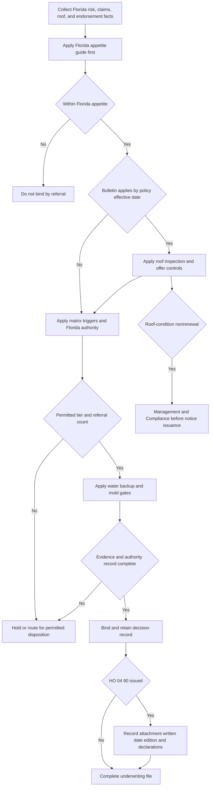

## Purpose and authority boundary

This page is internal underwriting guidance for Florida personal residential property. It directs risk selection, referral, documentation, and issuance workflow. It is not policy language, does not establish coverage, and must not be quoted to an insured or claimant.

Use the Florida appetite guide first for eligibility, limits, roof controls, endorsement gates, and management or Compliance routing. The enterprise referral matrix is an authority dependency: it can add an equal or stricter escalation or documentation requirement, but it cannot broaden Florida authority. The Florida guide is not a policy contract.

Keep the internal guide, regulatory bulletin, and issued forms separate:

| Layer | What it controls | What it does **not** do |
| --- | --- | --- |
| Primary internal authority — Florida appetite guide | Florida eligibility, bind and referral authority, required file documentation, and Compliance or management routing. | Change an issued contract or approve an out-of-appetite result. |
| Authority dependency — referral matrix | Enterprise referral triggers, maximum authority, and documentation standards, to the extent they are not less restrictive than the Florida guide. | Broaden Florida authority or approve a filing or bulletin exception. |
| Regulatory dependency — OIR Bulletin OIR-2023-04 | Binding Florida controls for in-scope policies: roof-age decisions, inspection, offer, nonrenewal, deductible overlap, and annual reporting. | Attach an endorsement, select a deductible amount, or determine claim coverage. |
| Contract-form dependency — issued HO-3, Declarations, and endorsements | The actual policy coverage, limits, deductibles, and settlement terms. | Supply underwriting authority or replace bulletin issuance or renewal controls. |

The bulletin applies to Florida personal residential property policies issued or renewed with an effective date on or after 2023-07-01. Forms control only when issued and attached: HO 23 74 attaches to HO-3 and modifies A.4; the selected issued edition of HO 04 90 attaches to HO-3 and modifies Section I Exclusion A.3; and HO 04 81 attaches to HO-3 and provides limited coverage for a cause otherwise excluded by C.2. These contract relationships are separate from internal authority to configure an endorsement.

Do not cure an out-of-appetite result or a bulletin or form constraint with a referral. Management approval is required in the situations below, but it cannot approve an exception to a filed rule or bind a risk that is outside appetite entirely.

## Intake and base Florida appetite

Start each submission with the policy effective date, occupancy and residence status, Coverage A and estimated replacement cost, construction, protection class, wind-borne-debris-region status, roof installation or replacement evidence and condition reports, prior water and mold claims, finished-below-grade exposure, and requested endorsements and limits. These facts determine both eligibility and which authority and regulatory gates apply; they do not themselves determine coverage under an issued policy.

A Florida risk is within the base appetite only when it is an owner-occupied, one-family primary residence with Coverage A from $200,000 through $900,000 and insurance to at least 80% of replacement cost. The 80% test is also material to the HO-3 A.3 dwelling settlement baseline: replacement-cost settlement is subject to that threshold and the applicable deductible. Seasonal and secondary residences are outside Florida appetite regardless of other favorable facts.

Construction is a separate gate. Masonry and masonry veneer are eligible in all approved counties. Frame construction is eligible only in protection classes 1-5 and outside the wind-borne debris region. A wind-borne-debris-region frame risk is a management routing issue, but that route does not itself waive the construction eligibility rule: do not bind an out-of-appetite risk by referral.

## Authority and referral model

Florida's Coverage A ceiling is tighter than the enterprise ceiling, so the Florida limits control. A line underwriter may bind an in-appetite risk through $600,000 Coverage A. A senior underwriter may bind an in-appetite risk through $900,000 and may approve one referral condition per risk. Roof-condition nonrenewal requires management routing and Compliance review before issuance; the matrix also requires management for more than one referral condition. These routes are not a binding exception where the underlying result is out of appetite.

| Decision | Binding or routing control |
| --- | --- |
| Coverage A up to $600,000 | Line underwriter, only if all Florida appetite and regulatory gates are met. |
| Coverage A over $600,000 through $900,000 | Senior underwriter, only if all Florida appetite and regulatory gates are met. |
| More than one referral condition or roof-condition nonrenewal | Management route. Compliance review is additionally mandatory before a roof-condition nonrenewal is issued. |
| Coverage A above $900,000 or wind-borne-debris-region frame | Management routing only; do not treat routing as approval to cure an out-of-appetite result. |
| Three or more water claims in five years | Entire risk is outside Florida appetite; it cannot be cleared by referral. |
| A filed-rule or bulletin violation | Never an authority exception; correct the configuration or do not bind. |

The last three rows are hard stops, not escalations, when the underlying state eligibility or regulatory requirement fails. The Florida guide makes three or more water claims in five years outside appetite for the entire risk, and the matrix independently says an exception to a state filing or bulletin cannot be approved.

### Enterprise referral overlay

After the Florida guide's state-specific gates are met, apply the matrix's mandatory referrals and count each distinct condition. The all-state triggers include two or more paid property claims in three years; any prior mold, continuous-seepage, or foundation-movement claim; a qualifying prior liability claim; planned windstorm-and-hail exclusion with residual-market placement; specified higher water-backup requests; and roof surfacing at least 20 years old, with an age-25 trigger regardless of documentation. The Florida 15-year inspection requirement is separate from the matrix's 20-year roof referral; neither replaces the other. A senior underwriter can clear at most one referral condition, and management is required for more than one.

The internal workflow applies the Florida guide first, then the effective-date-gated bulletin controls and matrix authority overlay. A referral never cures an out-of-appetite or regulatory result. When HO 04 90 is issued, the file must separately preserve attachment, policy-written date, endorsement edition, and Declarations; that record identifies the controlling contract terms rather than the internal configuration rule.

## Roof review, inspection, and schedule configuration

### Inspection and declination controls

For a roof aged 15 years or more, Florida internal guidance requires an inspection before binding. For a policy in the bulletin's effective-date scope, an insurer-required inspection at this age is at the insurer's expense. An insured-provided qualifying inspection must be accepted when it meets the F.2 requirements, and an insurer cannot require a second inspection at the insured's expense in the same policy period; the insurer also cannot limit acceptance to inspectors of its own selection when the inspector is Florida-licensed. Preserve the report, inspector license or qualification, inspection date, roof age, remaining-useful-life conclusion, and policy effective date. The before-binding workflow and comparison-quote retention are internal controls; the cost and inspection-acceptance rules are binding bulletin requirements.

Do not decline or nonrenew on a generic roof age reason. Under F.2, a refusal to issue or renew may not be based solely on roof age where an authorized-inspector report from the 12 months preceding the effective date establishes at least five years of remaining useful life. If the action is based on roof condition, record and state the specific deficiency identified. This is a regulatory decision-basis requirement; the matrix's declination-note requirement reinforces it operationally but is not its substitute.

### HO 23 74 offer and attachment gate

Do not attach HO 23 74 Actual Cash Value Loss Settlement - Roof Surfacing to a roof that is under ten years old at the policy effective date. For an in-scope Florida policy, F.4 constrains the carrier's attachment or application of an ACV roof schedule below that age; it does not itself change HO-3 A.4 or the attached endorsement's claim terms. When offering either a separate roof deductible or an ACV roof schedule, offer a policy without that provision at a filed and approved rate and disclose the premium difference in writing at the time of offer. Retain the two configurations, filed-rate support, written comparison, acceptance, and issued endorsement or Declarations record; retention of the comparison quote is specifically required by Florida internal guidance.

The age used for this issuance prohibition is the roof age at policy effective date. It is not the HO 23 74 claim-time age calculation, which uses the documented original-installation or most recent full-replacement date, or the dwelling-age presumption if undocumented, at the date of loss. Do not substitute one test for the other.

An offer or underwriting approval does not establish issued coverage. Only an attached HO 23 74 changes settlement, and then only for windstorm- or hail-caused roof surfacing; other dwelling components remain under HO-3 A.3, and roof-surfacing loss from another covered peril remains replacement cost. For issued-policy claim analysis, use [Roof Settlement](/openwiki/coverage/coverage-a/roof-settlement.md).

## Roof-condition nonrenewal: controlled Compliance handoff

A roof-condition nonrenewal is a regulated notice process, not an underwriting note or a policy condition. Before issuance, obtain management approval and route the packet through Compliance without exception. Compliance must verify at least 120 days' written notice, a specific reason, and inclusion of every inspection report actually relied upon. The first three requirements are from F.5; the Compliance and management steps are internal operational controls and do not replace the bulletin.

The nonrenewal file should retain: the policy and nonrenewal dates and 120-day calculation; the particular roof-condition deficiency; all relied-on inspection reports; decision and notice versions; management approval; Compliance approval; county; and final disposition. County and roof-condition reason must be reliable reporting fields because the bulletin requires annual reporting of roof-condition nonrenewals disaggregated by county. This is a carrier reporting obligation, not an insured duty or coverage condition.

## Water backup: configuration control versus issued form

HO 04 90 is optional and must be attached; it is not a general water-damage or flood endorsement. H.4 and the authority matrix are pre-bind internal configuration controls, not policy language or claim authority. The Florida guide permits a line underwriter to bind the base HO 04 90 sublimit without referral. For a proposed limit over $10,000, it requires a battery-backed sump pump where any finished area is below grade. The matrix independently makes that same above-$10,000 and below-grade and no-battery configuration a referral trigger, requires referral for a request above $25,000, and allows senior authority through $50,000. Treat the battery-backed-sump evidence, requested limit, and authority record as underwriting-file evidence; none establishes endorsement attachment, claim coverage, or a policy condition.

Two or more water claims of any type in five years puts the risk outside appetite for this endorsement. Three or more puts the entire risk outside Florida appetite. Do not represent a referral as authorization to attach HO 04 90 contrary to these internal controls.

### Select the issued HO 04 90 edition before stating contract terms

The issued endorsement record controls the contract result, not the appetite guide's reference to a base sublimit. Verify attachment, the policy-written date, exact HO 04 90 edition, and the endorsement Declarations. HO 04 90 2010-10 was superseded for policies written on or after 2026-01-01 but remains in force, including for later-reported losses, for policies written under it. HO 04 90 2026-01 replaces it for policies written on or after that date. Do not use the base HO-3 edition, a current guide, or a repository form as a substitute for that issued-form record.

| Selected, attached HO 04 90 edition | Amount, deductible, and settlement terms | Finished-below-grade contract condition |
| --- | --- | --- |
| 2010-10 legacy | W.2 has a $5,000 policy-period default, unless the endorsement Declarations show a higher limit; it is within the applicable A/B/C limits. W.3 applies a separate $500 deductible. W.6 keeps A/B settlement under the attached policy and settles Coverage C at actual cash value unless the endorsement Declarations state otherwise. | None. W.6 is the settlement provision in this edition. |
| 2026-01 current | W.2 has a $10,000 policy-period default, unless the endorsement Declarations show a higher limit; it remains within A/B/C limits. W.3 applies a separate $1,000 deductible. W.7, not W.6, contains the corresponding A/B and Coverage C settlement terms. | W.6 applies if the residence premises has a finished area below grade: the serving sewer line must have had an installed and operable backwater valve or equivalent backflow-prevention device at the time of loss. |

Each W.3 displaces the Section I deductible shown in the Declarations for loss covered by the endorsement. The current W.6 requirement is expressly new; do not import its device condition, $10,000 default, $1,000 deductible, or W.7 numbering into a 2010-10 policy. Conversely, do not quote the legacy $5,000/$500/W.6-settlement structure for a selected 2026-01 endorsement.

### Expose the battery-sump and backflow-device mismatch; do not collapse it

The unchanged guide's battery-backed sump pump control and current-form W.6 are different tests with different roles. The guide applies before binding only when the requested limit exceeds $10,000 and any finished area is below grade. Current W.6 is a coverage condition for an issued 2026-01 endorsement whenever the premises has a finished area below grade, and it asks whether a backwater valve or equivalent device on the serving sewer line was installed and operable at the time of loss. W.6 neither uses the guide's limit threshold nor names a battery-backed sump pump. No internal-configuration outcome proves, satisfies, replaces, or adds the selected endorsement's contractual condition. Preserve the guide's pre-bind control as written and separately preserve the W.6 below-grade finding, device type and location, installation, and at-loss operability evidence for a 2026-01 claim.

Underwriters must never describe either edition as flood coverage. For a verified attached edition, W.1 writes back HO-3 Section I Exclusion A.3 only for its defined sewer or drain backup and sump overflow or discharge events. Separately, W.4 preserves HO-3 A.1 and A.2: flood, surface water, waves, tidal water, storm surge, overflow of a body of water, and subsurface water remain excluded. W.5 in both editions separately withholds coverage where the event resulted from the insured's known, unremedied maintenance failure that a reasonable person would have remedied. These contract terms are distinct from the internal authority to offer or configure the endorsement. For source classification and claim terms, use [Water Damage and Backup](/openwiki/coverage/property/water-damage-and-backup.md); for the internal claim workflow, use [Water-Loss Handling](/openwiki/operations/claims-water-loss-handling.md).

## Mold endorsement controls

HO 04 81 is an optional Section I property endorsement, not blanket mold coverage. A line underwriter may attach the base $10,000 aggregate without referral; any higher limit requires referral and a plumbing-age disclosure. The matrix caps senior mold-limit authority at $25,000, so a request beyond that needs management under the general rule for authority above senior level. A prior mold claim within five years places the risk outside appetite for the endorsement, although the underlying policy may still be written without it.

The $10,000 form limit is the most payable for all loss under the endorsement in one policy period unless a higher amount is shown in the Declarations; it is aggregate and part of, not in addition to, Coverage A/B/C limits. At the contract layer, M.1 writes back HO-3 C.2 only to the extent of the limited coverage it provides: fungi, rot, or bacteria must result from a Section I insured peril during the policy period. Separately, M.2 preserves the flood and subsurface-water and long-term-seepage barriers because HO-3 A.1, A.2, and C.3 continue to remove the underlying loss. The endorsement is limited to Section I property coverage. These form effects do not turn the internal higher-limit referral and plumbing-age disclosure into claim-time coverage terms. For the two-endorsement water-backup and mold path, see [Fungi, Rot, and Bacteria](/openwiki/coverage/property/fungi-rot-and-bacteria.md).

## Hurricane deductible communication

The hurricane deductible is set by the filing in force for the policy effective date and is not an underwriter's discretionary selection. Confirm the applicable filing and issued Declarations rather than reusing prior-year rating output. If a separate roof deductible and hurricane deductible would both apply to the same Florida loss, do not describe them as cumulative: F.6 prohibits applying both and requires deduction of only the larger. The bulletin does not set either deductible's dollar or percentage amount, nor does it establish that either applies to a particular issued policy.

## File-completion tests

Before binding, issuing a roof-condition nonrenewal, or approving an endorsement change, run these focused controls:

1. Base risk: Confirm owner occupancy, one-family primary-residence status, $200,000-$900,000 Coverage A, 80% replacement-cost support, construction and protection-class eligibility, and no seasonal or secondary-residence condition.
2. Authority: Count every referral condition. Confirm the binder's tier, use management where required, and record the condition, authority, facts, and date. Reject attempts to refer an entire-risk water-claim hard stop or regulatory exception.
3. Roof inspection and decision basis: For a 15+ year roof, retain required inspection evidence and cost or acceptance handling. For a roof-condition declination, test the 12-month and five-year-useful-life facts and require a specific deficiency rather than age alone.
4. HO 23 74: Test age at policy effective date before configuration; for any roof deductible or ACV-schedule offer retain the no-provision filed-rate alternative and written premium difference. Separately verify issued attachment before communicating a settlement effect.
5. Nonrenewal: Do not issue until management and Compliance complete their internal reviews and the packet proves 120-day written notice, specific reason, and inclusion of each relied-on report. Capture county and reason for annual reporting.
6. Water backup and mold: Verify claims thresholds, requested limits, correct authority, and the guide's pre-bind battery-backed-sump requirement for a limit over $10,000 with finished area below grade. After issuance, separately retain HO 04 90 attachment, policy-written date, edition, and Declarations. For 2026-01 with finished area below grade, send the W.6 serving-sewer backflow-device installation and at-loss-operability facts to the claim record; do not substitute battery-sump evidence or apply W.6 to 2010-10. Verify the plumbing-age disclosure for higher mold limits. Do not call either endorsement flood coverage or promise its claim outcome.
7. Deductibles: Verify the current effective-date filing and issued documents. Where a hurricane and separate roof deductible both appear relevant to one Florida loss, communicate that only the larger can be deducted.

These tests are issuance and operational safeguards. Coverage communications and claim payment remain governed by the issued policy, Declarations, endorsements, and applicable law or bulletin, not by this internal page.
